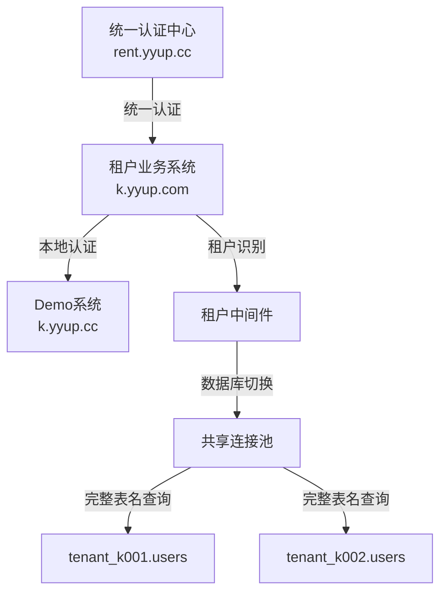

# k.yyup.com 租户管理系统 Bug 研究报告

## 项目概述

本文档记录 k.yyup.com 幼儿园租户管理系统中发现的所有潜在 bug 和问题,包括架构设计缺陷、代码实现漏洞、安全隐患和性能问题。

### 系统架构概述



### 技术栈

- **后端**: Node.js + TypeScript + Express
- **数据库**: MySQL (多租户共享连接池模式)
- **认证**: JWT + 统一认证中心
- **ORM**: Sequelize

---

## Bug 分类

### 🔴 严重 Bug (Critical)
- 数据安全问题
- 系统崩溃风险
- 数据丢失风险

### 🟠 高危 Bug (High)
- 功能完全不可用
- 严重性能问题
- 安全漏洞

### 🟡 中危 Bug (Medium)
- 功能部分不可用
- 用户体验问题
- 性能瓶颈

### 🟢 低危 Bug (Low)
- 轻微问题
- 不影响核心功能

---

## 发现的 Bug 列表

### 🔴 Bug #1: 租户识别存在SQL注入风险

**严重等级**: Critical

**位置**:
- `server/src/middlewares/tenant-resolver.middleware.ts:90`
- `server/src/middlewares/auth.middleware.ts:318, 424, 625`

**问题描述**:

租户代码的提取和验证逻辑存在多个安全漏洞:

```typescript
// tenant-resolver.middleware.ts:137
const altMatch = cleanDomain.match(/^([a-zA-Z0-9]+)\.(kindergarten|kyyup)\.com$/);

// tenant-resolver.middleware.ts:90
databaseName: `tenant_${tenantCode}`

// auth.middleware.ts:424  
const [userRows] = await sequelizeInstance.query(`
  SELECT u.id, u.username FROM ${tenantDatabaseName}.users u
  WHERE u.global_user_id = ?
`, { replacements: [globalUser.id] });
```

**安全风险**:

1. **正则表达式过于宽松**: `altMatch`允许任意字母数字组合,没有长度限制
2. **数据库名称无法参数化**: MySQL不支持对数据库名和表名使用参数化查询
3. **字符串拼接构造SQL**: 多处使用`${tenantDatabaseName}`直接拼接到SQL语句中
4. **缺少白名单验证**: 没有对租户代码进行白名单校验

**攻击场景**:

攻击者通过构造特殊域名,可能实现:
- 访问其他租户的数据库
- 执行任意SQL命令
- 绕过租户隔离机制

**影响范围**:
- 所有使用租户数据库的查询操作
- 用户认证和权限验证流程
- 数据CRUD操作

**修复建议**:

1. 严格限制租户代码格式:
```typescript
function extractTenantCode(domain: string): string | null {
  const cleanDomain = domain.split(':')[0];
  // 只允许 k + 3位数字
  const match = cleanDomain.match(/^k(\d{3})\.yyup\.cc$/);
  if (!match) return null;
  
  const code = `k${match[1]}`;
  // 白名单验证
  if (!VALID_TENANT_CODES.includes(code)) return null;
  
  return code;
}
```

2. 使用安全的标识符转义:
```typescript
function escapeDatabaseIdentifier(identifier: string): string {
  // 只允许字母、数字和下划线
  if (!/^[a-zA-Z0-9_]+$/.test(identifier)) {
    throw new Error('Invalid database identifier');
  }
  return `\`${identifier}\``;
}

const safeDbName = escapeDatabaseIdentifier(`tenant_${tenantCode}`);
const query = `SELECT * FROM ${safeDbName}.users WHERE id = ?`;
```

3. 实施租户代码白名单机制
4. 添加运行时验证和审计日志

---

### 🔴 Bug #2: 数据库连接池初始化存在竞态条件

**严重等级**: Critical

**位置**: `server/src/services/tenant-database.service.ts:53-75`

**问题描述**:

连接池初始化过程存在多个并发安全问题:

```typescript
async initializeGlobalConnection(): Promise<Sequelize> {
  // 第55-56行: 非原子操作的检查
  if (this.globalConnection && this.isInitialized) {
    return this.globalConnection;
  }
  
  // 第60-61行: 可能多个请求同时通过检查
  if (this.initPromise) {
    return this.initPromise;
  }
  
  // 第65行: 多个请求可能同时执行
  this.initPromise = this._createGlobalConnection();
  
  try {
    this.globalConnection = await this.initPromise;
    this.isInitialized = true;
    return this.globalConnection;
  } catch (error) {
    this.initPromise = null; // 失败时重置
    throw error;
  }
}
```

**并发问题**:

1. **TOCTOU竞态**: 第55行检查和第68行赋值之间存在时间窗口
2. **重复初始化**: 多个请求可能同时创建连接池
3. **状态不一致**: 初始化失败时`initPromise`被重置但`isInitialized`未重置
4. **嵌套重试风险**: tenant-resolver.middleware.ts第96-102行的嵌套try-catch可能触发重复初始化

**影响**:
- 创建多个连接池实例,资源泄漏
- 连接数超过数据库限制
- 系统不稳定,随机失败

**修复建议**:

```typescript
private initLock = new Mutex(); // 使用互斥锁

async initializeGlobalConnection(): Promise<Sequelize> {
  return await this.initLock.runExclusive(async () => {
    // 双重检查锁定模式
    if (this.globalConnection && this.isInitialized) {
      return this.globalConnection;
    }
    
    if (this.initPromise) {
      return this.initPromise;
    }
    
    this.initPromise = this._createGlobalConnection();
    
    try {
      this.globalConnection = await this.initPromise;
      this.isInitialized = true;
      return this.globalConnection;
    } catch (error) {
      // 失败时完全重置状态
      this.initPromise = null;
      this.isInitialized = false;
      this.globalConnection = null;
      throw error;
    }
  });
}
```

---

### 🟠 Bug #3: 租户验证缺乏缓存导致严重性能问题

**严重等级**: High

**位置**: `server/src/middlewares/tenant-resolver.middleware.ts:149-183`

**问题描述**:

每个请求都要调用外部API验证租户,没有任何缓存机制:

```typescript
async function validateTenant(tenantCode: string): Promise<boolean> {
  const response = await fetch(
    `${process.env.UNIFIED_TENANT_API_URL}/api/tenants/${tenantCode}`,
    {
      method: 'GET',
      headers: {
        'Content-Type': 'application/json',
        'X-Service-Name': 'kindergarten-system'
      }
      // 没有设置timeout!
    }
  );
  
  if (response.ok) {
    const data = await response.json();
    return data.success && data.data.status === 'active';
  }
  
  return false;
}
```

**性能问题**:

1. **无缓存**: 每次请求都调用外部API,增加200-500ms延迟
2. **无超时控制**: 外部API响应慢会阻塞所有请求
3. **无重试机制**: 网络抖动导致验证失败
4. **无熔断器**: API故障会导致级联失败
5. **同样问题存在于**: auth.middleware.ts的多个API调用

**影响**:
- 系统响应时间增加10倍以上
- 外部API故障导致整个系统不可用
- 高并发场景下形成请求风暴

**修复建议**:

```typescript
import { Cache } from 'node-cache';
import { CircuitBreaker } from 'opossum';

const tenantCache = new Cache({
  stdTTL: 300,  // 5分钟缓存
  checkperiod: 60
});

const validateTenantWithCache = async (tenantCode: string): Promise<boolean> => {
  // 1. 检查缓存
  const cached = tenantCache.get<boolean>(tenantCode);
  if (cached !== undefined) {
    return cached;
  }
  
  // 2. 使用熔断器调用API
  const breaker = new CircuitBreaker(async () => {
    const controller = new AbortController();
    const timeout = setTimeout(() => controller.abort(), 3000); // 3秒超时
    
    try {
      const response = await fetch(
        `${process.env.UNIFIED_TENANT_API_URL}/api/tenants/${tenantCode}`,
        {
          signal: controller.signal,
          headers: {
            'Content-Type': 'application/json',
            'X-Service-Name': 'kindergarten-system'
          }
        }
      );
      
      clearTimeout(timeout);
      
      if (response.ok) {
        const data = await response.json();
        return data.success && data.data.status === 'active';
      }
      
      return false;
    } catch (error) {
      clearTimeout(timeout);
      throw error;
    }
  }, {
    timeout: 5000,
    errorThresholdPercentage: 50,
    resetTimeout: 30000
  });
  
  try {
    const isValid = await breaker.fire();
    // 3. 缓存结果
    tenantCache.set(tenantCode, isValid);
    return isValid;
  } catch (error) {
    // 4. 降级策略: 检查本地白名单
    return FALLBACK_VALID_TENANTS.includes(tenantCode);
  }
};
```

---

### 🔴 Bug #4: 用户自动创建存在数据一致性风险

**严重等级**: Critical

**位置**: `server/src/middlewares/auth.middleware.ts:422-509`

**问题描述**:

统一认证后自动创建租户用户的逻辑存在严重问题:

```typescript
// 第422-430行: 查询用户
const [userRows] = await sequelizeInstance.query(`
  SELECT u.id, u.username FROM ${tenantDatabaseName}.users u
  WHERE u.global_user_id = ? AND u.status = 'active'
  LIMIT 1
`, { replacements: [globalUser.id] });

if (userRows.length > 0) {
  tenantUser = userRows[0];
} else {
  // 第437-451行: 创建新用户
  const [insertResult] = await sequelizeInstance.query(`
    INSERT INTO ${tenantDatabaseName}.users (
      global_user_id, username, email, real_name, phone,
      auth_source, status, role, created_at, updated_at
    ) VALUES (?, ?, ?, ?, ?, 'unified', 'active', 'parent', NOW(), NOW())
  `, { replacements: [...] });
  
  tenantUser = {
    id: insertResult.insertId,
    // ...
  };
}

// 第477-509行: 查询角色(可能为空)
const [roleRows] = await sequelizeInstance.query(`
  SELECT r.code as role_code FROM ${tenantDatabaseName}.user_roles ur
  INNER JOIN ${tenantDatabaseName}.roles r ON ur.role_id = r.id
  WHERE ur.user_id = ?
  LIMIT 1
`, { replacements: [tenantUser.id] });

userRole = roleRows.length > 0 ? roleRows[0] : null;
```

**数据一致性问题**:

1. **无事务保护**: SELECT和INSERT之间没有事务,并发请求可能重复插入
2. **缺少唯一约束处理**: INSERT失败(如违反UNIQUE KEY)时没有捕获和处理
3. **角色硬编码错误**: 所有用户都被创建为'parent'角色,不管实际角色
4. **关联数据缺失**: 创建用户后没有在`user_roles`表中创建关联记录
5. **角色查询为空**: 新创建的用户角色查询必然为空,但没有创建默认角色
6. **部分失败无回滚**: 用户创建成功但角色创建失败时,没有清理

**攻击场景**:
- 并发请求导致同一global_user_id创建多个租户用户
- 用户创建后无法使用系统(无角色=无权限)
- 数据库中存在大量孤儿记录

**修复建议**:

```typescript
// 使用事务保护
const transaction = await sequelizeInstance.transaction();

try {
  // 1. 使用INSERT ... ON DUPLICATE KEY UPDATE
  const [result] = await sequelizeInstance.query(`
    INSERT INTO ${tenantDatabaseName}.users (
      global_user_id, username, email, real_name, phone,
      auth_source, status, created_at, updated_at
    ) VALUES (?, ?, ?, ?, ?, 'unified', 'active', NOW(), NOW())
    ON DUPLICATE KEY UPDATE
      username = VALUES(username),
      email = VALUES(email),
      updated_at = NOW()
  `, {
    replacements: [
      globalUser.id,
      globalUser.username || globalUser.phone,
      globalUser.email || '',
      globalUser.realName || '用户',
      globalUser.phone || ''
    ],
    transaction
  });
  
  const userId = result.insertId || (await sequelizeInstance.query(
    `SELECT id FROM ${tenantDatabaseName}.users WHERE global_user_id = ?`,
    { replacements: [globalUser.id], transaction, type: 'SELECT' }
  ))[0]?.id;
  
  // 2. 创建或更新用户角色
  const defaultRoleCode = globalUser.role || 'parent';
  
  const [roleResult] = await sequelizeInstance.query(`
    SELECT id FROM ${tenantDatabaseName}.roles WHERE code = ?
  `, { replacements: [defaultRoleCode], transaction, type: 'SELECT' });
  
  if (roleResult && roleResult.length > 0) {
    const roleId = roleResult[0].id;
    
    await sequelizeInstance.query(`
      INSERT INTO ${tenantDatabaseName}.user_roles (user_id, role_id, created_at)
      VALUES (?, ?, NOW())
      ON DUPLICATE KEY UPDATE updated_at = NOW()
    `, { replacements: [userId, roleId], transaction });
  }
  
  await transaction.commit();
  
  // 3. 查询完整用户信息
  // ...
  
} catch (error) {
  await transaction.rollback();
  throw error;
}
```

---

### 🟠 Bug #5: 数据库连接池配置不合理

**严重等级**: High

**位置**: `server/src/services/tenant-database.service.ts:36-41, 158-204`

**问题描述**:

连接池配置和管理存在多个问题:

```typescript
private readonly poolConfig = {
  max: parseInt(process.env.DB_POOL_MAX || '30'),
  min: parseInt(process.env.DB_POOL_MIN || '5'),
  acquire: 30000,  // 获取连接超时30秒
  idle: 10000      // 空闲连接超时10秒  
};
```

**连接池问题**:
1. 30个连接对所有租户共享,高并发场景下不足
2. acquire超时30秒过长,导致请求堆积
3. idle超时10秒过短,频繁创建/销毁连接
4. getTenantConnection标记为@deprecated但仍在使用
5. closeTenantConnection是空操作,可能导致资源泄漏

**影响**: 连接池耗尽、请求超时、性能下降

**修复建议**: 增加连接数、优化超时配置、添加监控

---

### 🔴 Bug #6: 认证中间件存在严重安全漏洞

**严重等级**: Critical

**位置**: `server/src/middlewares/auth.middleware.ts:244-264, 40-54`

**问题描述**:

#### 漏洞 1: 内部服务绕过无验证

```typescript
if (req.headers['x-internal-service'] === 'true') {
  req.user = {
    role: 'admin',  // 直接给予管理员权限!
    isAdmin: true
  };
  next();
  return;
}
```

任何客户端都可以伪造此header获得管理员权限!

#### 漏洞 2: 域名判断可被欺骗

```typescript
const domain = req.get('Host') || req.hostname;
const isDemoSystem = (domain: string): boolean => {
  if (cleanDomain === 'k.yyup.cc') return true;
  return false;
};
```

没有检查X-Forwarded-Host,可被代理欺骗

#### 漏洞 3: 缺少Token黑名单

用户登出后Token仍然有效,无法强制失效

**影响**: 权限提升、未授权访问、账户劫持

**修复建议**: 使用HMAC签名验证内部服务、检查X-Forwarded-Host、实现Token黑名单

---

### 🟡 Bug #7: 错误处理机制不完善

**严重等级**: Medium

**位置**: 多个文件

**问题**:
1. tenant-resolver.middleware.ts:115-118 缺少return语句
2. auth.middleware.ts:464-471 部分成功未回滚
3. auth.middleware.ts:645-667 开发信息泄漏

**影响**: 响应重复发送、数据不一致、信息泄漏

---

### 🟠 Bug #8: 配置管理和环境变量处理不安全

**严重等级**: High

**位置**: 多个文件

**问题**:
1. 硬编码数据库凭证被提交到代码库
   - check-table-structure.cjs: `password: 'pwk5ls7j'`
   - scan-database-structure.js: `password: 'pwk5ls7j'`
   
2. 环境变量缺少验证
   - 直接使用process.env没有验证
   - 没有必填变量检查
   
3. JWT_SECRET管理不当
   - ecosystem.config.js: `JWT_SECRET: 'your-jwt-secret-here'`
   - 没有密钥轮换机制

**影响**: 凭证泄漏、配置错误、安全令牌被破解

**修复建议**:
```typescript
// 1. 移除所有硬编码凭证
// 2. 实现环境变量验证
function validateEnv() {
  const required = ['DB_HOST', 'DB_PORT', 'DB_USER', 'DB_PASSWORD', 'JWT_SECRET'];
  for (const key of required) {
    if (!process.env[key]) {
      throw new Error(`Missing required env: ${key}`);
    }
  }
}
// 3. 使用密钥管理服务(AWS Secrets Manager/HashiCorp Vault)
```

---

### 🟡 Bug #9: 租户数据隔离不完整

**严重等级**: Medium

**位置**: 多个文件

**问题**:
1. 共享连接池模式下的查询风险
   - tenantCode被污染可能跨租户访问
   
2. 租户上下文传递不可靠
   - `req.tenant?.databaseName || 'kindergarten'` 使用默认值可能访问错误数据库
   
3. 日志记录可能泄漏跨租户信息
4. 缓存和会话管理缺少租户隔离

**影响**: 数据泄漏风险

**修复建议**: 强制租户上下文、按租户分离日志和缓存

---

### 🟡 Bug #10: 监控和可观测性缺失

**严重等级**: Medium

**位置**: 整个系统

**问题**:
1. 没有性能监控指标
   - 连接池使用率
   - 请求延迟
   - API响应时间
   
2. 没有告警机制
   - 连接池耗尽
   - 认证失败率高
   - 数据库故障
   
3. 日志级别控制不完善
4. 缺少分布式追踪支持

**影响**: 运维困难、故障排查困难

**修复建议**: 集成Prometheus+Grafana、实现分布式追踪(Jaeger)

---

## Bug 总结

### 严重等级分布

| 等级 | 数量 | Bug编号 |
|------|------|----------|
| 🔴 Critical | 4 | #1, #2, #4, #6 |
| 🟠 High | 3 | #3, #5, #8 |
| 🟡 Medium | 3 | #7, #9, #10 |
| **总计** | **10** | |

### 问题类型分类

