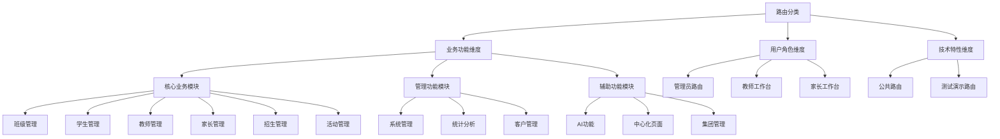
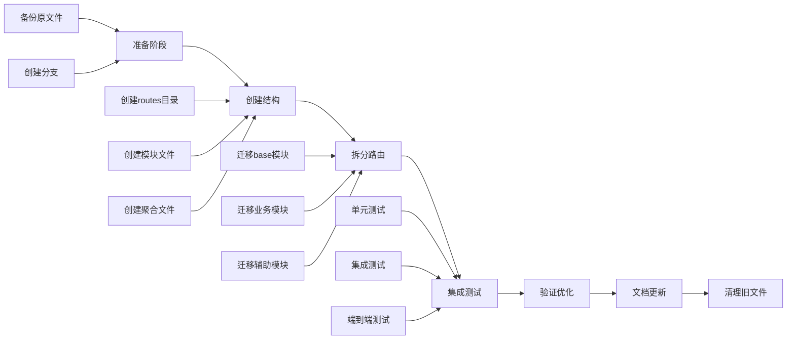
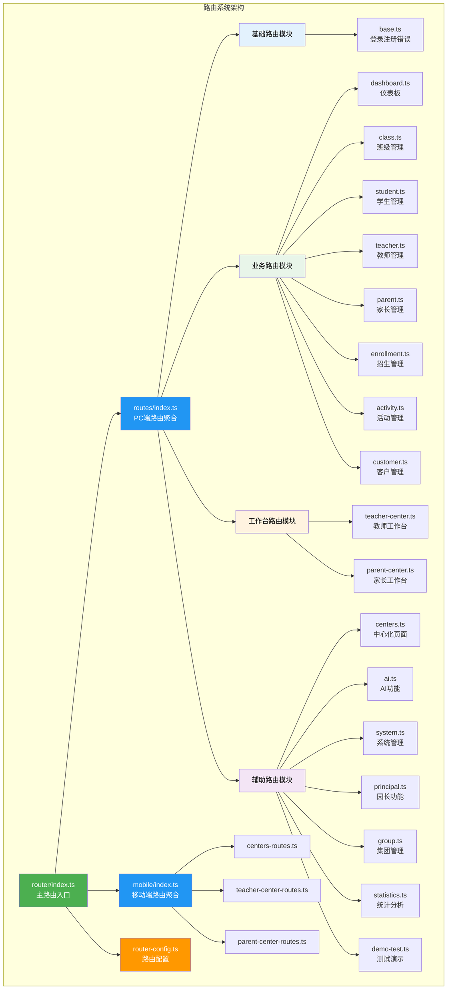
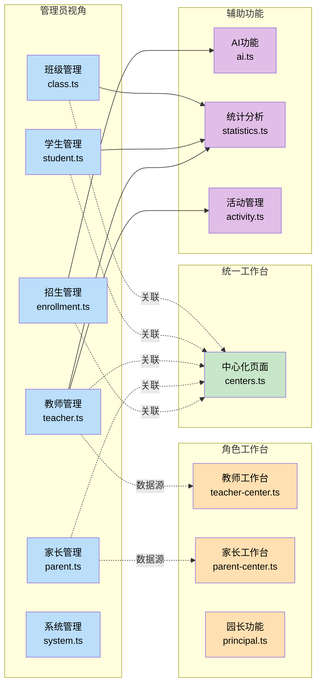

```mermaid
graph LR
    A[准备阶段] --> B[创建结构]
    B --> C[拆分路由]
    C --> D[集成测试]
    D --> E[验证优化]
    E --> F[文档更新]
    F --> G[清理旧文件]
    
    A1[备份原文件] --> A
    A2[创建分支] --> A
    
    B1[创建routes目录] --> B
    B2[创建模块文件] --> B
    B3[创建聚合文件] --> B
    
    C1[迁移base模块] --> C
    C2[迁移业务模块] --> C
    C3[迁移辅助模块] --> C
    
    D1[单元测试] --> D
    D2[集成测试] --> D
    D3[端到端测试] --> D
```

# 路由文件拆分优化设计方案

## 背景与目标

### 现状分析

当前 `optimized-routes.ts` 文件存在以下问题：

| 问题类型 | 具体描述 | 影响 |
|---------|---------|------|
| 文件过大 | 总共 4133 行代码 | 难以维护、加载缓慢、IDE性能下降 |
| 职责不清 | 所有路由混杂在一个文件中 | 模块边界模糊、团队协作困难 |
| 可读性差 | 大量路由定义堆砌 | 定位困难、理解成本高 |
| 扩展性弱 | 新增功能需要在巨大文件中插入 | 容易产生冲突、维护风险高 |

### 优化目标

- 将单一大文件拆分为多个职责清晰的模块文件
- 每个模块文件控制在 100-500 行代码范围内
- 建立清晰的文件组织结构和命名规范
- 提升代码可维护性和团队协作效率
- 保持与移动端路由结构的一致性

## 设计方案

### 分类策略

采用**按业务功能模块 + 用户角色混合分类**的策略，兼顾业务逻辑清晰性和权限管理需求。

#### 分类维度说明



### 目录结构设计

```
k.yyup.com/client/src/router/
├── routes/                          # PC端路由模块目录（新增）
│   ├── base.ts                      # 基础路由（登录、注册、错误页面）
│   ├── dashboard.ts                 # 仪表板路由
│   ├── class.ts                     # 班级管理路由
│   ├── student.ts                   # 学生管理路由
│   ├── teacher.ts                   # 教师管理路由（管理员视角）
│   ├── parent.ts                    # 家长管理路由（管理员视角）
│   ├── enrollment.ts                # 招生管理路由
│   ├── activity.ts                  # 活动管理路由
│   ├── customer.ts                  # 客户管理路由
│   ├── statistics.ts                # 统计分析路由
│   ├── centers.ts                   # 中心化页面路由
│   ├── ai.ts                        # AI功能路由
│   ├── system.ts                    # 系统管理路由
│   ├── principal.ts                 # 园长功能路由
│   ├── teacher-center.ts            # 教师工作台路由（教师角色）
│   ├── parent-center.ts             # 家长工作台路由（家长角色）
│   ├── group.ts                     # 集团管理路由
│   ├── demo-test.ts                 # 测试演示路由
│   └── index.ts                     # 路由模块聚合导出
├── mobile/                          # 移动端路由（已存在）
│   ├── centers-routes.ts
│   ├── teacher-center-routes.ts
│   ├── parent-center-routes.ts
│   └── index.ts
├── index.ts                         # 主路由入口
├── router-config.ts                 # 路由配置（优先级、预加载等）
├── optimized-routes.ts              # 原文件（迁移后可删除）
└── README.md                        # 路由架构文档
```

### 路由模块划分

#### 模块清单

| 序号 | 文件名 | 模块名称 | 主要内容 | 预估行数 |
|-----|--------|---------|---------|---------|
| 1 | base.ts | 基础路由 | 登录、注册、404、403、关于我们、联系我们、设备选择 | 100-150 |
| 2 | dashboard.ts | 仪表板 | 主仪表板、校园概览、数据统计、重要通知、日程安排、分析报表 | 200-300 |
| 3 | class.ts | 班级管理 | 班级列表、班级详情、班级统计、班级分析、班级优化、智能管理 | 150-250 |
| 4 | student.ts | 学生管理 | 学生列表、学生详情、学生统计、学生搜索、学生分析、成长记录、评估 | 150-250 |
| 5 | teacher.ts | 教师管理 | 教师列表、教师详情、教师编辑、教师绩效、教师发展、教师评估、教师统计 | 200-300 |
| 6 | parent.ts | 家长管理 | 家长列表、家长详情、家长编辑、家长跟进、沟通中心、儿童成长、反馈、统计 | 200-300 |
| 7 | enrollment.ts | 招生管理 | 招生计划、招生管理、名额管理、统计分析、AI招生功能（智能规划、预测、策略、优化等） | 300-400 |
| 8 | activity.ts | 活动管理 | 活动列表、活动详情、活动发布、活动编辑、活动策划、模板、分析、优化、报名、评估 | 250-350 |
| 9 | customer.ts | 客户管理 | 客户列表、客户详情、客户分析、客户统计、客户搜索、申请管理、申请审核、面试 | 200-300 |
| 10 | statistics.ts | 统计分析 | 统计分析主页、报告构建器、数据分析 | 100-150 |
| 11 | centers.ts | 中心化页面 | 20+个中心页面（招生中心、人员中心、活动中心、系统中心、任务中心、检查中心、招商中心、财务中心、通话中心、客户中心、教学中心、文档中心、相册中心、考勤中心、评估中心等） | 600-800 |
| 12 | ai.ts | AI功能 | AI助手、AI查询、AI分析、AI模型管理、专家咨询、记忆管理、NLP分析、文本分析、预测引擎、3D分析 | 300-400 |
| 13 | system.ts | 系统管理 | 用户管理、角色管理、权限管理、系统日志、安全监控、系统备份、系统设置、AI模型配置、通知设置、维护调度 | 250-350 |
| 14 | principal.ts | 园长功能 | 园长仪表板、活动管理、客户池、营销分析、绩效管理、海报编辑器、海报生成器、绩效规则、海报模板、媒体中心、决策支持、报告 | 250-350 |
| 15 | teacher-center.ts | 教师工作台 | 教师工作台、通知中心、活动、课程、考勤、任务、客户池、客户跟踪、AI互动课堂、学生测评 | 250-350 |
| 16 | parent-center.ts | 家长工作台 | 家长首页、我的孩子、成长报告、测评中心（发育测评、幼小衔接、学科测评、成长轨迹）、游戏大厅（10个游戏）、AI育儿助手、活动列表、家校沟通、反馈、相册、通知、个人信息 | 600-700 |
| 17 | group.ts | 集团管理 | 集团列表、集团创建、集团编辑、集团详情 | 100-150 |
| 18 | demo-test.ts | 测试演示 | 所有测试页面、所有演示页面（AI演示、快捷查询、API测试、组件测试、物理电路、专家团队、Markdown演示等） | 300-400 |

#### 特殊模块说明

**区分：教师管理 vs 教师工作台**

| 项目 | teacher.ts | teacher-center.ts |
|-----|-----------|------------------|
| 定位 | 管理员视角的教师管理 | 教师角色的工作台 |
| 功能 | 增删改查教师信息、绩效评估、统计分析 | 教师日常工作：课程、考勤、学生测评 |
| 权限 | 需要管理员权限 | 需要教师角色 |
| 用户 | 管理员、园长 | 教师本人 |

**区分：家长管理 vs 家长工作台**

| 项目 | parent.ts | parent-center.ts |
|-----|----------|------------------|
| 定位 | 管理员视角的家长管理 | 家长角色的工作台 |
| 功能 | 家长信息维护、沟通跟进、统计分析 | 查看孩子信息、测评、游戏、沟通 |
| 权限 | 需要管理员权限 | 需要家长角色 |
| 用户 | 管理员、教师 | 家长本人 |

**中心化页面的概念**

centers.ts 包含的"中心化页面"是指：
- 面向管理员的统一工作台
- 将分散的功能聚合到一个页面
- 提供快捷操作入口和数据概览
- 与具体的业务管理模块（如class.ts、student.ts）是互补关系

示例：
- 招生中心：汇总招生计划、申请、咨询等多个招生相关功能
- 人员中心：统一展示学生、教师、家长、班级等人员信息
- 活动中心：集中管理活动、报名、通知等

### 技术实现方案

#### 文件结构模板

每个路由模块文件遵循统一的结构：

```typescript
/**
 * [模块名称]路由配置
 * 
 * 功能说明：
 * - [主要功能1]
 * - [主要功能2]
 * - [主要功能3]
 * 
 * 权限说明：
 * - 主要权限标识
 * - 用户角色要求
 */

import { RouteRecordRaw } from 'vue-router'

// 布局组件导入
const Layout = () => import('@/layouts/MainLayout.vue')

// 页面组件懒加载导入
const [ModulePage1] = () => import('@/pages/[module]/[Page1].vue')
const [ModulePage2] = () => import('@/pages/[module]/[Page2].vue')

// 路由配置导出
export const [moduleName]Routes: RouteRecordRaw[] = [
  {
    path: '/[module]',
    name: '[ModuleName]',
    component: Layout,
    meta: {
      title: '[模块标题]',
      icon: '[图标]',
      requiresAuth: true,
      permission: '[权限标识]',
      priority: '[优先级]'
    },
    children: [
      // 子路由配置
    ]
  }
]
```

#### 路由聚合文件

`routes/index.ts` 负责聚合所有模块路由：

```typescript
/**
 * PC端路由模块聚合
 * 
 * 按照优先级顺序导入和导出所有路由模块
 */

import { RouteRecordRaw } from 'vue-router'

// 导入各模块路由
import { baseRoutes } from './base'
import { dashboardRoutes } from './dashboard'
import { classRoutes } from './class'
import { studentRoutes } from './student'
import { teacherRoutes } from './teacher'
import { parentRoutes } from './parent'
import { enrollmentRoutes } from './enrollment'
import { activityRoutes } from './activity'
import { customerRoutes } from './customer'
import { statisticsRoutes } from './statistics'
import { centersRoutes } from './centers'
import { aiRoutes } from './ai'
import { systemRoutes } from './system'
import { principalRoutes } from './principal'
import { teacherCenterRoutes } from './teacher-center'
import { parentCenterRoutes } from './parent-center'
import { groupRoutes } from './group'
import { demoTestRoutes } from './demo-test'

// 聚合导出（按优先级顺序）
export const pcRoutes: RouteRecordRaw[] = [
  ...baseRoutes,           // 基础路由（最高优先级）
  ...dashboardRoutes,      // 仪表板
  ...classRoutes,          // 班级管理
  ...studentRoutes,        // 学生管理
  ...teacherRoutes,        // 教师管理
  ...parentRoutes,         // 家长管理
  ...enrollmentRoutes,     // 招生管理
  ...activityRoutes,       // 活动管理
  ...customerRoutes,       // 客户管理
  ...statisticsRoutes,     // 统计分析
  ...centersRoutes,        // 中心化页面
  ...aiRoutes,             // AI功能
  ...systemRoutes,         // 系统管理
  ...principalRoutes,      // 园长功能
  ...teacherCenterRoutes,  // 教师工作台
  ...parentCenterRoutes,   // 家长工作台
  ...groupRoutes,          // 集团管理
  ...demoTestRoutes        // 测试演示（最低优先级）
]

// 单独导出各模块（便于按需使用）
export {
  baseRoutes,
  dashboardRoutes,
  classRoutes,
  studentRoutes,
  teacherRoutes,
  parentRoutes,
  enrollmentRoutes,
  activityRoutes,
  customerRoutes,
  statisticsRoutes,
  centersRoutes,
  aiRoutes,
  systemRoutes,
  principalRoutes,
  teacherCenterRoutes,
  parentCenterRoutes,
  groupRoutes,
  demoTestRoutes
}
```

#### 主路由入口更新

`router/index.ts` 保持简洁，只负责创建路由实例和配置守卫：

```typescript
import { createRouter, createWebHistory } from 'vue-router'
import { pcRoutes } from './routes'
import { mobileRoutes } from './mobile'
// ... 其他导入

// 合并PC端和移动端路由
const routes = [
  {
    path: '/',
    name: 'DeviceSelect',
    component: () => import('../pages/device-select/index.vue'),
    meta: {
      title: '选择设备类型',
      requiresAuth: false,
      hideNavigation: true
    }
  },
  ...pcRoutes,
  ...mobileRoutes
]

// 创建路由实例
const router = createRouter({
  history: createWebHistory('/'),
  routes,
  scrollBehavior(to, from, savedPosition) {
    if (savedPosition) {
      return savedPosition
    } else {
      return { top: 0 }
    }
  }
})

// 路由守卫配置（保持不变）
router.beforeEach(async (to, from, next) => {
  // ... 现有守卫逻辑
})

export default router
```

#### 路由配置文件

创建 `router-config.ts` 集中管理路由相关配置：

```typescript
/**
 * 路由配置文件
 * 
 * 包含：
 * - 路由优先级配置
 * - 路由预加载配置
 * - 其他全局路由配置
 */

// 路由优先级配置
export const routePriorities = {
  critical: ['/login', '/register', '/dashboard', '/'],
  high: [
    '/class', 
    '/teacher', 
    '/teacher-center', 
    '/enrollment-plan', 
    '/enrollment', 
    '/group'
  ],
  medium: [
    '/profile', 
    '/search', 
    '/parent', 
    '/customer', 
    '/statistics', 
    '/ai', 
    '/chat'
  ],
  low: [
    '/help', 
    '/system', 
    '/advertisement', 
    '/activity', 
    '/principal'
  ]
}

// 路由预加载配置
export const preloadConfig = {
  // 立即预加载的路由
  immediate: [
    '/dashboard', 
    '/class', 
    '/teacher', 
    '/teacher-center'
  ],
  
  // 空闲时预加载的路由
  idle: [
    '/enrollment-plan', 
    '/enrollment', 
    '/parent'
  ],
  
  // 按需预加载的路由
  ondemand: [
    '/system', 
    '/ai', 
    '/statistics'
  ]
}
```

### 命名规范

#### 文件命名

| 类型 | 规范 | 示例 |
|-----|------|------|
| 路由模块文件 | kebab-case | `teacher-center.ts` |
| 配置文件 | kebab-case | `router-config.ts` |
| 目录 | kebab-case | `routes/` |

#### 变量命名

| 类型 | 规范 | 示例 |
|-----|------|------|
| 路由数组导出 | camelCase + Routes后缀 | `teacherCenterRoutes` |
| 组件导入 | PascalCase | `TeacherDashboard` |
| 路由名称 | PascalCase | `TeacherCenter` |

### 迁移策略

#### 迁移步骤



#### 详细步骤说明

**第一阶段：准备工作**

| 步骤 | 操作 | 检查点 |
|-----|------|--------|
| 1.1 | 备份原文件为 `optimized-routes.ts.backup` | 备份文件存在 |
| 1.2 | 创建功能分支 `feat/route-split-optimization` | 分支创建成功 |
| 1.3 | 确认移动端路由结构作为参考 | 了解mobile目录结构 |

**第二阶段：创建目录结构**

| 步骤 | 操作 | 检查点 |
|-----|------|--------|
| 2.1 | 创建 `routes/` 目录 | 目录存在 |
| 2.2 | 创建18个模块文件（空文件） | 所有文件创建 |
| 2.3 | 创建 `routes/index.ts` 聚合文件 | 文件存在 |
| 2.4 | 创建 `router-config.ts` 配置文件 | 文件存在 |

**第三阶段：逐步拆分路由**

按优先级顺序拆分：

1. 先拆分 `base.ts`（基础路由）- 测试登录注册功能
2. 拆分 `dashboard.ts` - 测试首页访问
3. 拆分核心业务模块（class、student、teacher等）- 测试核心功能
4. 拆分辅助模块（centers、ai、system等）
5. 拆分测试演示模块

每完成一个模块：
- 在 `routes/index.ts` 中导入
- 更新 `router/index.ts` 引用
- 运行测试验证功能正常
- 提交代码

**第四阶段：集成测试**

| 测试类型 | 测试内容 | 通过标准 |
|---------|---------|---------|
| 路由访问测试 | 所有路由都能正常访问 | 无404错误 |
| 权限测试 | 权限控制正常工作 | 权限拦截正确 |
| 懒加载测试 | 组件懒加载正常 | 动态导入成功 |
| 路由守卫测试 | 导航守卫正常执行 | 跳转逻辑正确 |
| 性能测试 | 路由加载时间优化 | 加载时间减少 |

**第五阶段：验证与优化**

- 检查文件大小是否在预期范围内
- 验证IDE性能是否提升
- 确认团队成员可以方便地定位和修改路由
- 检查是否有重复或遗漏的路由

**第六阶段：文档更新**

- 更新 `README.md` 说明新的路由结构
- 编写路由模块使用指南
- 更新团队开发文档
- 记录迁移过程和注意事项

**第七阶段：清理工作**

- 确认所有功能正常后，删除 `optimized-routes.ts`
- 删除备份文件
- 清理未使用的导入
- 合并功能分支到主分支

### 注意事项

#### 路由定义注意事项

| 项目 | 说明 | 示例或建议 |
|-----|------|-----------|
| 路由顺序 | 保持原有的路由顺序，避免影响匹配逻辑 | 特别注意通配符路由应放在最后 |
| 懒加载 | 所有组件使用懒加载 | `() => import('@/pages/...')` |
| 路径一致性 | 确保路径与原文件完全一致 | 避免修改已有路径 |
| meta信息完整性 | 保留所有meta属性 | title、icon、permission、priority等 |
| 子路由嵌套 | 保持原有的嵌套关系 | 不要改变路由层级 |

#### 导入路径注意事项

- 使用绝对路径 `@/` 引用组件
- 确保所有导入路径正确
- 检查是否有循环依赖

#### 类型安全注意事项

- 确保所有路由配置符合 `RouteRecordRaw` 类型
- meta信息使用正确的类型定义
- 避免使用 `any` 类型

#### 测试验证注意事项

- 每个模块拆分后立即测试
- 特别关注嵌套路由的功能
- 验证路由守卫是否正常工作
- 检查权限控制是否生效

### 优化收益评估

#### 可维护性提升

| 指标 | 优化前 | 优化后 | 提升度 |
|-----|-------|--------|--------|
| 单文件代码行数 | 4133行 | 100-800行/文件 | ⭐⭐⭐⭐⭐ |
| 功能定位时间 | 需要搜索整个文件 | 直接定位到对应模块 | ⭐⭐⭐⭐⭐ |
| 代码审查效率 | 难以审查大文件 | 可以按模块审查 | ⭐⭐⭐⭐ |
| 合并冲突频率 | 高（多人修改同一文件） | 低（各自模块独立） | ⭐⭐⭐⭐⭐ |

#### 团队协作提升

| 场景 | 优化前 | 优化后 |
|-----|-------|--------|
| 多人并行开发 | 容易产生冲突 | 各自维护独立模块 |
| 新成员上手 | 需要理解整个大文件 | 只需关注相关模块 |
| 功能模块划分 | 边界模糊 | 职责清晰 |
| 代码责任归属 | 不明确 | 明确到具体模块 |

#### 性能提升

| 指标 | 优化前 | 优化后 | 说明 |
|-----|-------|--------|------|
| IDE响应速度 | 较慢 | 快速 | 小文件IDE解析更快 |
| 文件打开速度 | 慢 | 快 | 文件体积减小 |
| 语法检查速度 | 慢 | 快 | 检查范围缩小 |
| Git操作速度 | 慢 | 快 | 文件变更更精确 |

#### 扩展性提升

- 新增功能模块：只需创建新的路由文件并在聚合文件中导入
- 删除功能模块：直接删除对应文件并移除导入
- 修改功能模块：影响范围仅限于对应文件
- 重构优化：可以逐个模块进行，风险可控

### 后续优化建议

#### 短期优化（1-2周）

- 为每个路由模块添加单元测试
- 建立路由性能监控机制
- 优化路由预加载策略

#### 中期优化（1-2月）

- 实现路由级别的权限配置可视化
- 建立路由文档自动生成工具
- 优化路由lazy loading策略

#### 长期优化（3-6月）

- 考虑引入路由级别的微前端架构
- 实现路由的动态加载和热更新
- 建立路由变更的自动化测试体系

## 架构示意图

### 整体架构



### 模块关系图



## 参考资料

- 项目现有移动端路由结构：`k.yyup.com/client/src/router/mobile/`
- Vue Router 官方文档：路由懒加载和代码分割最佳实践
- 项目现有路由配置：`k.yyup.com/client/src/router/optimized-routes.ts`

```
k.yyup.com/client/src/router/
├── routes/                          # PC端路由模块目录（新增）
│   ├── base.ts                      # 基础路由（登录、注册、错误页面）
│   ├── dashboard.ts                 # 仪表板路由
│   ├── class.ts                     # 班级管理路由
│   ├── student.ts                   # 学生管理路由
│   ├── teacher.ts                   # 教师管理路由（管理员视角）
│   ├── parent.ts                    # 家长管理路由（管理员视角）
│   ├── enrollment.ts                # 招生管理路由
│   ├── activity.ts                  # 活动管理路由
│   ├── customer.ts                  # 客户管理路由
│   ├── statistics.ts                # 统计分析路由
│   ├── centers.ts                   # 中心化页面路由
│   ├── ai.ts                        # AI功能路由
│   ├── system.ts                    # 系统管理路由
│   ├── principal.ts                 # 园长功能路由
│   ├── teacher-center.ts            # 教师工作台路由（教师角色）
│   ├── parent-center.ts             # 家长工作台路由（家长角色）
│   ├── group.ts                     # 集团管理路由
│   ├── demo-test.ts                 # 测试演示路由
│   └── index.ts                     # 路由模块聚合导出
├── mobile/                          # 移动端路由（已存在）
│   ├── centers-routes.ts
│   ├── teacher-center-routes.ts
│   ├── parent-center-routes.ts
│   └── index.ts
├── index.ts                         # 主路由入口
├── router-config.ts                 # 路由配置（优先级、预加载等）
├── optimized-routes.ts              # 原文件（迁移后可删除）
└── README.md                        # 路由架构文档
```

### 路由模块划分

#### 模块清单

| 序号 | 文件名 | 模块名称 | 主要内容 | 预估行数 |
|-----|--------|---------|---------|---------|
| 1 | base.ts | 基础路由 | 登录、注册、404、403、关于我们、联系我们、设备选择 | 100-150 |
| 2 | dashboard.ts | 仪表板 | 主仪表板、校园概览、数据统计、重要通知、日程安排、分析报表 | 200-300 |
| 3 | class.ts | 班级管理 | 班级列表、班级详情、班级统计、班级分析、班级优化、智能管理 | 150-250 |
| 4 | student.ts | 学生管理 | 学生列表、学生详情、学生统计、学生搜索、学生分析、成长记录、评估 | 150-250 |
| 5 | teacher.ts | 教师管理 | 教师列表、教师详情、教师编辑、教师绩效、教师发展、教师评估、教师统计 | 200-300 |
| 6 | parent.ts | 家长管理 | 家长列表、家长详情、家长编辑、家长跟进、沟通中心、儿童成长、反馈、统计 | 200-300 |
| 7 | enrollment.ts | 招生管理 | 招生计划、招生管理、名额管理、统计分析、AI招生功能（智能规划、预测、策略、优化等） | 300-400 |
| 8 | activity.ts | 活动管理 | 活动列表、活动详情、活动发布、活动编辑、活动策划、模板、分析、优化、报名、评估 | 250-350 |
| 9 | customer.ts | 客户管理 | 客户列表、客户详情、客户分析、客户统计、客户搜索、申请管理、申请审核、面试 | 200-300 |
| 10 | statistics.ts | 统计分析 | 统计分析主页、报告构建器、数据分析 | 100-150 |
| 11 | centers.ts | 中心化页面 | 20+个中心页面（招生中心、人员中心、活动中心、系统中心、任务中心、检查中心、招商中心、财务中心、通话中心、客户中心、教学中心、文档中心、相册中心、考勤中心、评估中心等） | 600-800 |
| 12 | ai.ts | AI功能 | AI助手、AI查询、AI分析、AI模型管理、专家咨询、记忆管理、NLP分析、文本分析、预测引擎、3D分析 | 300-400 |
| 13 | system.ts | 系统管理 | 用户管理、角色管理、权限管理、系统日志、安全监控、系统备份、系统设置、AI模型配置、通知设置、维护调度 | 250-350 |
| 14 | principal.ts | 园长功能 | 园长仪表板、活动管理、客户池、营销分析、绩效管理、海报编辑器、海报生成器、绩效规则、海报模板、媒体中心、决策支持、报告 | 250-350 |
| 15 | teacher-center.ts | 教师工作台 | 教师工作台、通知中心、活动、课程、考勤、任务、客户池、客户跟踪、AI互动课堂、学生测评 | 250-350 |
| 16 | parent-center.ts | 家长工作台 | 家长首页、我的孩子、成长报告、测评中心（发育测评、幼小衔接、学科测评、成长轨迹）、游戏大厅（10个游戏）、AI育儿助手、活动列表、家校沟通、反馈、相册、通知、个人信息 | 600-700 |
| 17 | group.ts | 集团管理 | 集团列表、集团创建、集团编辑、集团详情 | 100-150 |
| 18 | demo-test.ts | 测试演示 | 所有测试页面、所有演示页面（AI演示、快捷查询、API测试、组件测试、物理电路、专家团队、Markdown演示等） | 300-400 |

#### 特殊模块说明

**区分：教师管理 vs 教师工作台**

| 项目 | teacher.ts | teacher-center.ts |
|-----|-----------|------------------|
| 定位 | 管理员视角的教师管理 | 教师角色的工作台 |
| 功能 | 增删改查教师信息、绩效评估、统计分析 | 教师日常工作：课程、考勤、学生测评 |
| 权限 | 需要管理员权限 | 需要教师角色 |
| 用户 | 管理员、园长 | 教师本人 |

**区分：家长管理 vs 家长工作台**

| 项目 | parent.ts | parent-center.ts |
|-----|----------|------------------|
| 定位 | 管理员视角的家长管理 | 家长角色的工作台 |
| 功能 | 家长信息维护、沟通跟进、统计分析 | 查看孩子信息、测评、游戏、沟通 |
| 权限 | 需要管理员权限 | 需要家长角色 |
| 用户 | 管理员、教师 | 家长本人 |

**中心化页面的概念**

centers.ts 包含的"中心化页面"是指：
- 面向管理员的统一工作台
- 将分散的功能聚合到一个页面
- 提供快捷操作入口和数据概览
- 与具体的业务管理模块（如class.ts、student.ts）是互补关系

示例：
- 招生中心：汇总招生计划、申请、咨询等多个招生相关功能
- 人员中心：统一展示学生、教师、家长、班级等人员信息
- 活动中心：集中管理活动、报名、通知等

### 技术实现方案

#### 文件结构模板

每个路由模块文件遵循统一的结构：

```typescript
/**
 * [模块名称]路由配置
 * 
 * 功能说明：
 * - [主要功能1]
 * - [主要功能2]
 * - [主要功能3]
 * 
 * 权限说明：
 * - 主要权限标识
 * - 用户角色要求
 */

import { RouteRecordRaw } from 'vue-router'

// 布局组件导入
const Layout = () => import('@/layouts/MainLayout.vue')

// 页面组件懒加载导入
const [ModulePage1] = () => import('@/pages/[module]/[Page1].vue')
const [ModulePage2] = () => import('@/pages/[module]/[Page2].vue')

// 路由配置导出
export const [moduleName]Routes: RouteRecordRaw[] = [
  {
    path: '/[module]',
    name: '[ModuleName]',
    component: Layout,
    meta: {
      title: '[模块标题]',
      icon: '[图标]',
      requiresAuth: true,
      permission: '[权限标识]',
      priority: '[优先级]'
    },
    children: [
      // 子路由配置
    ]
  }
]
```

#### 路由聚合文件

`routes/index.ts` 负责聚合所有模块路由：

```typescript
/**
 * PC端路由模块聚合
 * 
 * 按照优先级顺序导入和导出所有路由模块
 */

import { RouteRecordRaw } from 'vue-router'

// 导入各模块路由
import { baseRoutes } from './base'
import { dashboardRoutes } from './dashboard'
import { classRoutes } from './class'
import { studentRoutes } from './student'
import { teacherRoutes } from './teacher'
import { parentRoutes } from './parent'
import { enrollmentRoutes } from './enrollment'
import { activityRoutes } from './activity'
import { customerRoutes } from './customer'
import { statisticsRoutes } from './statistics'
import { centersRoutes } from './centers'
import { aiRoutes } from './ai'
import { systemRoutes } from './system'
import { principalRoutes } from './principal'
import { teacherCenterRoutes } from './teacher-center'
import { parentCenterRoutes } from './parent-center'
import { groupRoutes } from './group'
import { demoTestRoutes } from './demo-test'

// 聚合导出（按优先级顺序）
export const pcRoutes: RouteRecordRaw[] = [
  ...baseRoutes,           // 基础路由（最高优先级）
  ...dashboardRoutes,      // 仪表板
  ...classRoutes,          // 班级管理
  ...studentRoutes,        // 学生管理
  ...teacherRoutes,        // 教师管理
  ...parentRoutes,         // 家长管理
  ...enrollmentRoutes,     // 招生管理
  ...activityRoutes,       // 活动管理
  ...customerRoutes,       // 客户管理
  ...statisticsRoutes,     // 统计分析
  ...centersRoutes,        // 中心化页面
  ...aiRoutes,             // AI功能
  ...systemRoutes,         // 系统管理
  ...principalRoutes,      // 园长功能
  ...teacherCenterRoutes,  // 教师工作台
  ...parentCenterRoutes,   // 家长工作台
  ...groupRoutes,          // 集团管理
  ...demoTestRoutes        // 测试演示（最低优先级）
]

// 单独导出各模块（便于按需使用）
export {
  baseRoutes,
  dashboardRoutes,
  classRoutes,
  studentRoutes,
  teacherRoutes,
  parentRoutes,
  enrollmentRoutes,
  activityRoutes,
  customerRoutes,
  statisticsRoutes,
  centersRoutes,
  aiRoutes,
  systemRoutes,
  principalRoutes,
  teacherCenterRoutes,
  parentCenterRoutes,
  groupRoutes,
  demoTestRoutes
}
```

#### 主路由入口更新

`router/index.ts` 保持简洁，只负责创建路由实例和配置守卫：

```typescript
import { createRouter, createWebHistory } from 'vue-router'
import { pcRoutes } from './routes'
import { mobileRoutes } from './mobile'
// ... 其他导入

// 合并PC端和移动端路由
const routes = [
  {
    path: '/',
    name: 'DeviceSelect',
    component: () => import('../pages/device-select/index.vue'),
    meta: {
      title: '选择设备类型',
      requiresAuth: false,
      hideNavigation: true
    }
  },
  ...pcRoutes,
  ...mobileRoutes
]

// 创建路由实例
const router = createRouter({
  history: createWebHistory('/'),
  routes,
  scrollBehavior(to, from, savedPosition) {
    if (savedPosition) {
      return savedPosition
    } else {
      return { top: 0 }
    }
  }
})

// 路由守卫配置（保持不变）
router.beforeEach(async (to, from, next) => {
  // ... 现有守卫逻辑
})

export default router
```

#### 路由配置文件

创建 `router-config.ts` 集中管理路由相关配置：

```typescript
/**
 * 路由配置文件
 * 
 * 包含：
 * - 路由优先级配置
 * - 路由预加载配置
 * - 其他全局路由配置
 */

// 路由优先级配置
export const routePriorities = {
  critical: ['/login', '/register', '/dashboard', '/'],
  high: [
    '/class', 
    '/teacher', 
    '/teacher-center', 
    '/enrollment-plan', 
    '/enrollment', 
    '/group'
  ],
  medium: [
    '/profile', 
    '/search', 
    '/parent', 
    '/customer', 
    '/statistics', 
    '/ai', 
    '/chat'
  ],
  low: [
    '/help', 
    '/system', 
    '/advertisement', 
    '/activity', 
    '/principal'
  ]
}

// 路由预加载配置
export const preloadConfig = {
  // 立即预加载的路由
  immediate: [
    '/dashboard', 
    '/class', 
    '/teacher', 
    '/teacher-center'
  ],
  
  // 空闲时预加载的路由
  idle: [
    '/enrollment-plan', 
    '/enrollment', 
    '/parent'
  ],
  
  // 按需预加载的路由
  ondemand: [
    '/system', 
    '/ai', 
    '/statistics'
  ]
}
```

### 命名规范

#### 文件命名

| 类型 | 规范 | 示例 |
|-----|------|------|
| 路由模块文件 | kebab-case | `teacher-center.ts` |
| 配置文件 | kebab-case | `router-config.ts` |
| 目录 | kebab-case | `routes/` |

#### 变量命名

| 类型 | 规范 | 示例 |
|-----|------|------|
| 路由数组导出 | camelCase + Routes后缀 | `teacherCenterRoutes` |
| 组件导入 | PascalCase | `TeacherDashboard` |
| 路由名称 | PascalCase | `TeacherCenter` |

### 迁移策略

#### 迁移步骤



#### 详细步骤说明

**第一阶段：准备工作**

| 步骤 | 操作 | 检查点 |
|-----|------|--------|
| 1.1 | 备份原文件为 `optimized-routes.ts.backup` | 备份文件存在 |
| 1.2 | 创建功能分支 `feat/route-split-optimization` | 分支创建成功 |
| 1.3 | 确认移动端路由结构作为参考 | 了解mobile目录结构 |

**第二阶段：创建目录结构**

| 步骤 | 操作 | 检查点 |
|-----|------|--------|
| 2.1 | 创建 `routes/` 目录 | 目录存在 |
| 2.2 | 创建18个模块文件（空文件） | 所有文件创建 |
| 2.3 | 创建 `routes/index.ts` 聚合文件 | 文件存在 |
| 2.4 | 创建 `router-config.ts` 配置文件 | 文件存在 |

**第三阶段：逐步拆分路由**

按优先级顺序拆分：

1. 先拆分 `base.ts`（基础路由）- 测试登录注册功能
2. 拆分 `dashboard.ts` - 测试首页访问
3. 拆分核心业务模块（class、student、teacher等）- 测试核心功能
4. 拆分辅助模块（centers、ai、system等）
5. 拆分测试演示模块

每完成一个模块：
- 在 `routes/index.ts` 中导入
- 更新 `router/index.ts` 引用
- 运行测试验证功能正常
- 提交代码

**第四阶段：集成测试**

| 测试类型 | 测试内容 | 通过标准 |
|---------|---------|---------|
| 路由访问测试 | 所有路由都能正常访问 | 无404错误 |
| 权限测试 | 权限控制正常工作 | 权限拦截正确 |
| 懒加载测试 | 组件懒加载正常 | 动态导入成功 |
| 路由守卫测试 | 导航守卫正常执行 | 跳转逻辑正确 |
| 性能测试 | 路由加载时间优化 | 加载时间减少 |

**第五阶段：验证与优化**

- 检查文件大小是否在预期范围内
- 验证IDE性能是否提升
- 确认团队成员可以方便地定位和修改路由
- 检查是否有重复或遗漏的路由

**第六阶段：文档更新**

- 更新 `README.md` 说明新的路由结构
- 编写路由模块使用指南
- 更新团队开发文档
- 记录迁移过程和注意事项

**第七阶段：清理工作**

- 确认所有功能正常后，删除 `optimized-routes.ts`
- 删除备份文件
- 清理未使用的导入
- 合并功能分支到主分支

### 注意事项

#### 路由定义注意事项

| 项目 | 说明 | 示例或建议 |
|-----|------|-----------|
| 路由顺序 | 保持原有的路由顺序，避免影响匹配逻辑 | 特别注意通配符路由应放在最后 |
| 懒加载 | 所有组件使用懒加载 | `() => import('@/pages/...')` |
| 路径一致性 | 确保路径与原文件完全一致 | 避免修改已有路径 |
| meta信息完整性 | 保留所有meta属性 | title、icon、permission、priority等 |
| 子路由嵌套 | 保持原有的嵌套关系 | 不要改变路由层级 |

#### 导入路径注意事项

- 使用绝对路径 `@/` 引用组件
- 确保所有导入路径正确
- 检查是否有循环依赖

#### 类型安全注意事项

- 确保所有路由配置符合 `RouteRecordRaw` 类型
- meta信息使用正确的类型定义
- 避免使用 `any` 类型

#### 测试验证注意事项

- 每个模块拆分后立即测试
- 特别关注嵌套路由的功能
- 验证路由守卫是否正常工作
- 检查权限控制是否生效

### 优化收益评估

#### 可维护性提升

| 指标 | 优化前 | 优化后 | 提升度 |
|-----|-------|--------|--------|
| 单文件代码行数 | 4133行 | 100-800行/文件 | ⭐⭐⭐⭐⭐ |
| 功能定位时间 | 需要搜索整个文件 | 直接定位到对应模块 | ⭐⭐⭐⭐⭐ |
| 代码审查效率 | 难以审查大文件 | 可以按模块审查 | ⭐⭐⭐⭐ |
| 合并冲突频率 | 高（多人修改同一文件） | 低（各自模块独立） | ⭐⭐⭐⭐⭐ |

#### 团队协作提升

| 场景 | 优化前 | 优化后 |
|-----|-------|--------|
| 多人并行开发 | 容易产生冲突 | 各自维护独立模块 |
| 新成员上手 | 需要理解整个大文件 | 只需关注相关模块 |
| 功能模块划分 | 边界模糊 | 职责清晰 |
| 代码责任归属 | 不明确 | 明确到具体模块 |

#### 性能提升

| 指标 | 优化前 | 优化后 | 说明 |
|-----|-------|--------|------|
| IDE响应速度 | 较慢 | 快速 | 小文件IDE解析更快 |
| 文件打开速度 | 慢 | 快 | 文件体积减小 |
| 语法检查速度 | 慢 | 快 | 检查范围缩小 |
| Git操作速度 | 慢 | 快 | 文件变更更精确 |

#### 扩展性提升

- 新增功能模块：只需创建新的路由文件并在聚合文件中导入
- 删除功能模块：直接删除对应文件并移除导入
- 修改功能模块：影响范围仅限于对应文件
- 重构优化：可以逐个模块进行，风险可控

### 后续优化建议

#### 短期优化（1-2周）

- 为每个路由模块添加单元测试
- 建立路由性能监控机制
- 优化路由预加载策略

#### 中期优化（1-2月）

- 实现路由级别的权限配置可视化
- 建立路由文档自动生成工具
- 优化路由lazy loading策略

#### 长期优化（3-6月）

- 考虑引入路由级别的微前端架构
- 实现路由的动态加载和热更新
- 建立路由变更的自动化测试体系

## 架构示意图

### 整体架构


### 模块关系图


## 参考资料

- 项目现有移动端路由结构：`k.yyup.com/client/src/router/mobile/`
- Vue Router 官方文档：路由懒加载和代码分割最佳实践
- 项目现有路由配置：`k.yyup.com/client/src/router/optimized-routes.ts`
### 目录结构设计

```
k.yyup.com/client/src/router/
├── routes/                          # PC端路由模块目录（新增）
│   ├── base.ts                      # 基础路由（登录、注册、错误页面）
│   ├── dashboard.ts                 # 仪表板路由
│   ├── class.ts                     # 班级管理路由
│   ├── student.ts                   # 学生管理路由
│   ├── teacher.ts                   # 教师管理路由（管理员视角）
│   ├── parent.ts                    # 家长管理路由（管理员视角）
│   ├── enrollment.ts                # 招生管理路由
│   ├── activity.ts                  # 活动管理路由
│   ├── customer.ts                  # 客户管理路由
│   ├── statistics.ts                # 统计分析路由
│   ├── centers.ts                   # 中心化页面路由
│   ├── ai.ts                        # AI功能路由
│   ├── system.ts                    # 系统管理路由
│   ├── principal.ts                 # 园长功能路由
│   ├── teacher-center.ts            # 教师工作台路由（教师角色）
│   ├── parent-center.ts             # 家长工作台路由（家长角色）
│   ├── group.ts                     # 集团管理路由
│   ├── demo-test.ts                 # 测试演示路由
│   └── index.ts                     # 路由模块聚合导出
├── mobile/                          # 移动端路由（已存在）
│   ├── centers-routes.ts
│   ├── teacher-center-routes.ts
│   ├── parent-center-routes.ts
│   └── index.ts
├── index.ts                         # 主路由入口
├── router-config.ts                 # 路由配置（优先级、预加载等）
├── optimized-routes.ts              # 原文件（迁移后可删除）
└── README.md                        # 路由架构文档
```

### 路由模块划分

#### 模块清单

| 序号 | 文件名 | 模块名称 | 主要内容 | 预估行数 |
|-----|--------|---------|---------|---------|
| 1 | base.ts | 基础路由 | 登录、注册、404、403、关于我们、联系我们、设备选择 | 100-150 |
| 2 | dashboard.ts | 仪表板 | 主仪表板、校园概览、数据统计、重要通知、日程安排、分析报表 | 200-300 |
| 3 | class.ts | 班级管理 | 班级列表、班级详情、班级统计、班级分析、班级优化、智能管理 | 150-250 |
| 4 | student.ts | 学生管理 | 学生列表、学生详情、学生统计、学生搜索、学生分析、成长记录、评估 | 150-250 |
| 5 | teacher.ts | 教师管理 | 教师列表、教师详情、教师编辑、教师绩效、教师发展、教师评估、教师统计 | 200-300 |
| 6 | parent.ts | 家长管理 | 家长列表、家长详情、家长编辑、家长跟进、沟通中心、儿童成长、反馈、统计 | 200-300 |
| 7 | enrollment.ts | 招生管理 | 招生计划、招生管理、名额管理、统计分析、AI招生功能（智能规划、预测、策略、优化等） | 300-400 |
| 8 | activity.ts | 活动管理 | 活动列表、活动详情、活动发布、活动编辑、活动策划、模板、分析、优化、报名、评估 | 250-350 |
| 9 | customer.ts | 客户管理 | 客户列表、客户详情、客户分析、客户统计、客户搜索、申请管理、申请审核、面试 | 200-300 |
| 10 | statistics.ts | 统计分析 | 统计分析主页、报告构建器、数据分析 | 100-150 |
| 11 | centers.ts | 中心化页面 | 20+个中心页面（招生中心、人员中心、活动中心、系统中心、任务中心、检查中心、招商中心、财务中心、通话中心、客户中心、教学中心、文档中心、相册中心、考勤中心、评估中心等） | 600-800 |
| 12 | ai.ts | AI功能 | AI助手、AI查询、AI分析、AI模型管理、专家咨询、记忆管理、NLP分析、文本分析、预测引擎、3D分析 | 300-400 |
| 13 | system.ts | 系统管理 | 用户管理、角色管理、权限管理、系统日志、安全监控、系统备份、系统设置、AI模型配置、通知设置、维护调度 | 250-350 |
| 14 | principal.ts | 园长功能 | 园长仪表板、活动管理、客户池、营销分析、绩效管理、海报编辑器、海报生成器、绩效规则、海报模板、媒体中心、决策支持、报告 | 250-350 |
| 15 | teacher-center.ts | 教师工作台 | 教师工作台、通知中心、活动、课程、考勤、任务、客户池、客户跟踪、AI互动课堂、学生测评 | 250-350 |
| 16 | parent-center.ts | 家长工作台 | 家长首页、我的孩子、成长报告、测评中心（发育测评、幼小衔接、学科测评、成长轨迹）、游戏大厅（10个游戏）、AI育儿助手、活动列表、家校沟通、反馈、相册、通知、个人信息 | 600-700 |
| 17 | group.ts | 集团管理 | 集团列表、集团创建、集团编辑、集团详情 | 100-150 |
| 18 | demo-test.ts | 测试演示 | 所有测试页面、所有演示页面（AI演示、快捷查询、API测试、组件测试、物理电路、专家团队、Markdown演示等） | 300-400 |

#### 特殊模块说明

**区分：教师管理 vs 教师工作台**

| 项目 | teacher.ts | teacher-center.ts |
|-----|-----------|------------------|
| 定位 | 管理员视角的教师管理 | 教师角色的工作台 |
| 功能 | 增删改查教师信息、绩效评估、统计分析 | 教师日常工作：课程、考勤、学生测评 |
| 权限 | 需要管理员权限 | 需要教师角色 |
| 用户 | 管理员、园长 | 教师本人 |

**区分：家长管理 vs 家长工作台**

| 项目 | parent.ts | parent-center.ts |
|-----|----------|------------------|
| 定位 | 管理员视角的家长管理 | 家长角色的工作台 |
| 功能 | 家长信息维护、沟通跟进、统计分析 | 查看孩子信息、测评、游戏、沟通 |
| 权限 | 需要管理员权限 | 需要家长角色 |
| 用户 | 管理员、教师 | 家长本人 |

**中心化页面的概念**

centers.ts 包含的"中心化页面"是指：
- 面向管理员的统一工作台
- 将分散的功能聚合到一个页面
- 提供快捷操作入口和数据概览
- 与具体的业务管理模块（如class.ts、student.ts）是互补关系

示例：
- 招生中心：汇总招生计划、申请、咨询等多个招生相关功能
- 人员中心：统一展示学生、教师、家长、班级等人员信息
- 活动中心：集中管理活动、报名、通知等

### 技术实现方案

#### 文件结构模板

每个路由模块文件遵循统一的结构：

```typescript
/**
 * [模块名称]路由配置
 * 
 * 功能说明：
 * - [主要功能1]
 * - [主要功能2]
 * - [主要功能3]
 * 
 * 权限说明：
 * - 主要权限标识
 * - 用户角色要求
 */

import { RouteRecordRaw } from 'vue-router'

// 布局组件导入
const Layout = () => import('@/layouts/MainLayout.vue')

// 页面组件懒加载导入
const [ModulePage1] = () => import('@/pages/[module]/[Page1].vue')
const [ModulePage2] = () => import('@/pages/[module]/[Page2].vue')

// 路由配置导出
export const [moduleName]Routes: RouteRecordRaw[] = [
  {
    path: '/[module]',
    name: '[ModuleName]',
    component: Layout,
    meta: {
      title: '[模块标题]',
      icon: '[图标]',
      requiresAuth: true,
      permission: '[权限标识]',
      priority: '[优先级]'
    },
    children: [
      // 子路由配置
    ]
  }
]
```

#### 路由聚合文件

`routes/index.ts` 负责聚合所有模块路由：

```typescript
/**
 * PC端路由模块聚合
 * 
 * 按照优先级顺序导入和导出所有路由模块
 */

import { RouteRecordRaw } from 'vue-router'

// 导入各模块路由
import { baseRoutes } from './base'
import { dashboardRoutes } from './dashboard'
import { classRoutes } from './class'
import { studentRoutes } from './student'
import { teacherRoutes } from './teacher'
import { parentRoutes } from './parent'
import { enrollmentRoutes } from './enrollment'
import { activityRoutes } from './activity'
import { customerRoutes } from './customer'
import { statisticsRoutes } from './statistics'
import { centersRoutes } from './centers'
import { aiRoutes } from './ai'
import { systemRoutes } from './system'
import { principalRoutes } from './principal'
import { teacherCenterRoutes } from './teacher-center'
import { parentCenterRoutes } from './parent-center'
import { groupRoutes } from './group'
import { demoTestRoutes } from './demo-test'

// 聚合导出（按优先级顺序）
export const pcRoutes: RouteRecordRaw[] = [
  ...baseRoutes,           // 基础路由（最高优先级）
  ...dashboardRoutes,      // 仪表板
  ...classRoutes,          // 班级管理
  ...studentRoutes,        // 学生管理
  ...teacherRoutes,        // 教师管理
  ...parentRoutes,         // 家长管理
  ...enrollmentRoutes,     // 招生管理
  ...activityRoutes,       // 活动管理
  ...customerRoutes,       // 客户管理
  ...statisticsRoutes,     // 统计分析
  ...centersRoutes,        // 中心化页面
  ...aiRoutes,             // AI功能
  ...systemRoutes,         // 系统管理
  ...principalRoutes,      // 园长功能
  ...teacherCenterRoutes,  // 教师工作台
  ...parentCenterRoutes,   // 家长工作台
  ...groupRoutes,          // 集团管理
  ...demoTestRoutes        // 测试演示（最低优先级）
]

// 单独导出各模块（便于按需使用）
export {
  baseRoutes,
  dashboardRoutes,
  classRoutes,
  studentRoutes,
  teacherRoutes,
  parentRoutes,
  enrollmentRoutes,
  activityRoutes,
  customerRoutes,
  statisticsRoutes,
  centersRoutes,
  aiRoutes,
  systemRoutes,
  principalRoutes,
  teacherCenterRoutes,
  parentCenterRoutes,
  groupRoutes,
  demoTestRoutes
}
```

#### 主路由入口更新

`router/index.ts` 保持简洁，只负责创建路由实例和配置守卫：

```typescript
import { createRouter, createWebHistory } from 'vue-router'
import { pcRoutes } from './routes'
import { mobileRoutes } from './mobile'
// ... 其他导入

// 合并PC端和移动端路由
const routes = [
  {
    path: '/',
    name: 'DeviceSelect',
    component: () => import('../pages/device-select/index.vue'),
    meta: {
      title: '选择设备类型',
      requiresAuth: false,
      hideNavigation: true
    }
  },
  ...pcRoutes,
  ...mobileRoutes
]

// 创建路由实例
const router = createRouter({
  history: createWebHistory('/'),
  routes,
  scrollBehavior(to, from, savedPosition) {
    if (savedPosition) {
      return savedPosition
    } else {
      return { top: 0 }
    }
  }
})

// 路由守卫配置（保持不变）
router.beforeEach(async (to, from, next) => {
  // ... 现有守卫逻辑
})

export default router
```

#### 路由配置文件

创建 `router-config.ts` 集中管理路由相关配置：

```typescript
/**
 * 路由配置文件
 * 
 * 包含：
 * - 路由优先级配置
 * - 路由预加载配置
 * - 其他全局路由配置
 */

// 路由优先级配置
export const routePriorities = {
  critical: ['/login', '/register', '/dashboard', '/'],
  high: [
    '/class', 
    '/teacher', 
    '/teacher-center', 
    '/enrollment-plan', 
    '/enrollment', 
    '/group'
  ],
  medium: [
    '/profile', 
    '/search', 
    '/parent', 
    '/customer', 
    '/statistics', 
    '/ai', 
    '/chat'
  ],
  low: [
    '/help', 
    '/system', 
    '/advertisement', 
    '/activity', 
    '/principal'
  ]
}

// 路由预加载配置
export const preloadConfig = {
  // 立即预加载的路由
  immediate: [
    '/dashboard', 
    '/class', 
    '/teacher', 
    '/teacher-center'
  ],
  
  // 空闲时预加载的路由
  idle: [
    '/enrollment-plan', 
    '/enrollment', 
    '/parent'
  ],
  
  // 按需预加载的路由
  ondemand: [
    '/system', 
    '/ai', 
    '/statistics'
  ]
}
```

### 命名规范

#### 文件命名

| 类型 | 规范 | 示例 |
|-----|------|------|
| 路由模块文件 | kebab-case | `teacher-center.ts` |
| 配置文件 | kebab-case | `router-config.ts` |
| 目录 | kebab-case | `routes/` |

#### 变量命名

| 类型 | 规范 | 示例 |
|-----|------|------|
| 路由数组导出 | camelCase + Routes后缀 | `teacherCenterRoutes` |
| 组件导入 | PascalCase | `TeacherDashboard` |
| 路由名称 | PascalCase | `TeacherCenter` |

### 迁移策略

#### 迁移步骤


#### 详细步骤说明

**第一阶段：准备工作**

| 步骤 | 操作 | 检查点 |
|-----|------|--------|
| 1.1 | 备份原文件为 `optimized-routes.ts.backup` | 备份文件存在 |
| 1.2 | 创建功能分支 `feat/route-split-optimization` | 分支创建成功 |
| 1.3 | 确认移动端路由结构作为参考 | 了解mobile目录结构 |

**第二阶段：创建目录结构**

| 步骤 | 操作 | 检查点 |
|-----|------|--------|
| 2.1 | 创建 `routes/` 目录 | 目录存在 |
| 2.2 | 创建18个模块文件（空文件） | 所有文件创建 |
| 2.3 | 创建 `routes/index.ts` 聚合文件 | 文件存在 |
| 2.4 | 创建 `router-config.ts` 配置文件 | 文件存在 |

**第三阶段：逐步拆分路由**

按优先级顺序拆分：

1. 先拆分 `base.ts`（基础路由）- 测试登录注册功能
2. 拆分 `dashboard.ts` - 测试首页访问
3. 拆分核心业务模块（class、student、teacher等）- 测试核心功能
4. 拆分辅助模块（centers、ai、system等）
5. 拆分测试演示模块

每完成一个模块：
- 在 `routes/index.ts` 中导入
- 更新 `router/index.ts` 引用
- 运行测试验证功能正常
- 提交代码

**第四阶段：集成测试**

| 测试类型 | 测试内容 | 通过标准 |
|---------|---------|---------|
| 路由访问测试 | 所有路由都能正常访问 | 无404错误 |
| 权限测试 | 权限控制正常工作 | 权限拦截正确 |
| 懒加载测试 | 组件懒加载正常 | 动态导入成功 |
| 路由守卫测试 | 导航守卫正常执行 | 跳转逻辑正确 |
| 性能测试 | 路由加载时间优化 | 加载时间减少 |

**第五阶段：验证与优化**

- 检查文件大小是否在预期范围内
- 验证IDE性能是否提升
- 确认团队成员可以方便地定位和修改路由
- 检查是否有重复或遗漏的路由

**第六阶段：文档更新**

- 更新 `README.md` 说明新的路由结构
- 编写路由模块使用指南
- 更新团队开发文档
- 记录迁移过程和注意事项

**第七阶段：清理工作**

- 确认所有功能正常后，删除 `optimized-routes.ts`
- 删除备份文件
- 清理未使用的导入
- 合并功能分支到主分支

### 注意事项

#### 路由定义注意事项

| 项目 | 说明 | 示例或建议 |
|-----|------|-----------|
| 路由顺序 | 保持原有的路由顺序，避免影响匹配逻辑 | 特别注意通配符路由应放在最后 |
| 懒加载 | 所有组件使用懒加载 | `() => import('@/pages/...')` |
| 路径一致性 | 确保路径与原文件完全一致 | 避免修改已有路径 |
| meta信息完整性 | 保留所有meta属性 | title、icon、permission、priority等 |
| 子路由嵌套 | 保持原有的嵌套关系 | 不要改变路由层级 |

#### 导入路径注意事项

- 使用绝对路径 `@/` 引用组件
- 确保所有导入路径正确
- 检查是否有循环依赖

#### 类型安全注意事项

- 确保所有路由配置符合 `RouteRecordRaw` 类型
- meta信息使用正确的类型定义
- 避免使用 `any` 类型

#### 测试验证注意事项

- 每个模块拆分后立即测试
- 特别关注嵌套路由的功能
- 验证路由守卫是否正常工作
- 检查权限控制是否生效

### 优化收益评估

#### 可维护性提升

| 指标 | 优化前 | 优化后 | 提升度 |
|-----|-------|--------|--------|
| 单文件代码行数 | 4133行 | 100-800行/文件 | ⭐⭐⭐⭐⭐ |
| 功能定位时间 | 需要搜索整个文件 | 直接定位到对应模块 | ⭐⭐⭐⭐⭐ |
| 代码审查效率 | 难以审查大文件 | 可以按模块审查 | ⭐⭐⭐⭐ |
| 合并冲突频率 | 高（多人修改同一文件） | 低（各自模块独立） | ⭐⭐⭐⭐⭐ |

#### 团队协作提升

| 场景 | 优化前 | 优化后 |
|-----|-------|--------|
| 多人并行开发 | 容易产生冲突 | 各自维护独立模块 |
| 新成员上手 | 需要理解整个大文件 | 只需关注相关模块 |
| 功能模块划分 | 边界模糊 | 职责清晰 |
| 代码责任归属 | 不明确 | 明确到具体模块 |

#### 性能提升

| 指标 | 优化前 | 优化后 | 说明 |
|-----|-------|--------|------|
| IDE响应速度 | 较慢 | 快速 | 小文件IDE解析更快 |
| 文件打开速度 | 慢 | 快 | 文件体积减小 |
| 语法检查速度 | 慢 | 快 | 检查范围缩小 |
| Git操作速度 | 慢 | 快 | 文件变更更精确 |

#### 扩展性提升

- 新增功能模块：只需创建新的路由文件并在聚合文件中导入
- 删除功能模块：直接删除对应文件并移除导入
- 修改功能模块：影响范围仅限于对应文件
- 重构优化：可以逐个模块进行，风险可控

### 后续优化建议

#### 短期优化（1-2周）

- 为每个路由模块添加单元测试
- 建立路由性能监控机制
- 优化路由预加载策略

#### 中期优化（1-2月）

- 实现路由级别的权限配置可视化
- 建立路由文档自动生成工具
- 优化路由lazy loading策略

#### 长期优化（3-6月）

- 考虑引入路由级别的微前端架构
- 实现路由的动态加载和热更新
- 建立路由变更的自动化测试体系

## 架构示意图

### 整体架构


### 模块关系图


## 参考资料

- 项目现有移动端路由结构：`k.yyup.com/client/src/router/mobile/`
- Vue Router 官方文档：路由懒加载和代码分割最佳实践
- 项目现有路由配置：`k.yyup.com/client/src/router/optimized-routes.ts`
