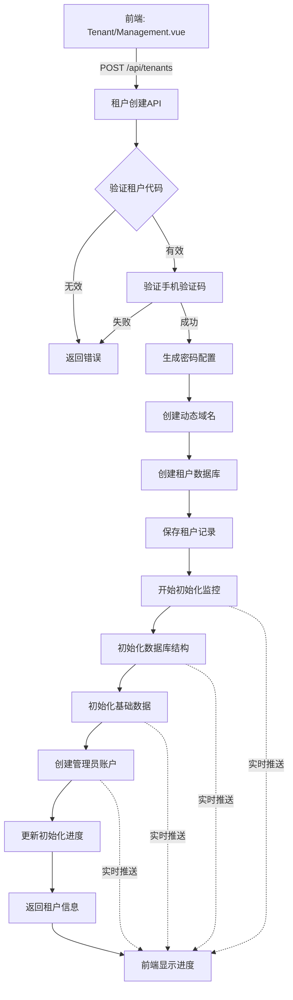
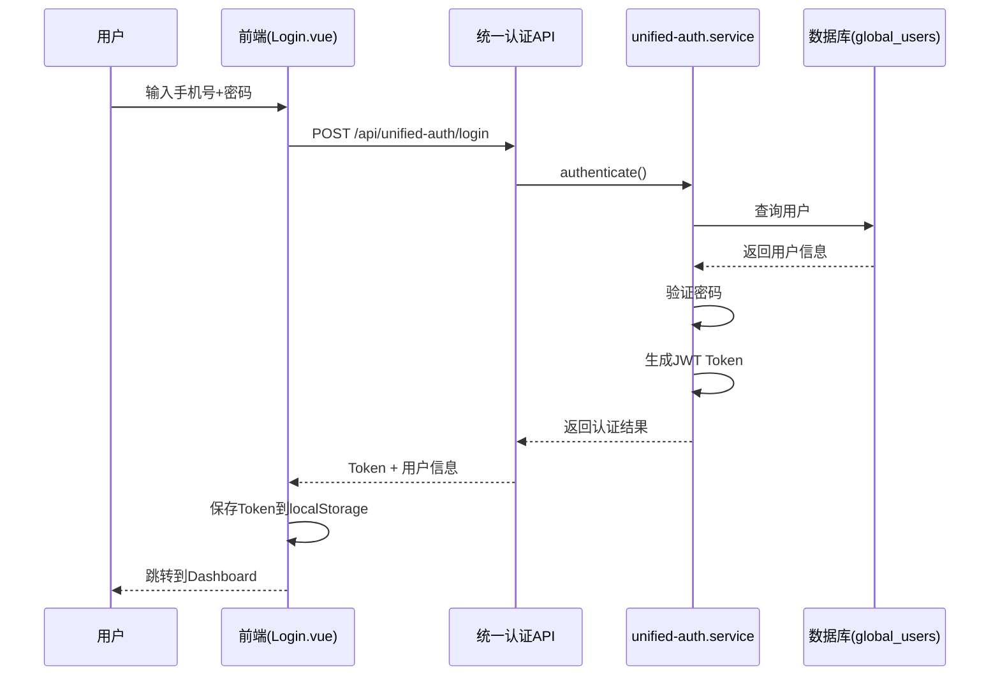
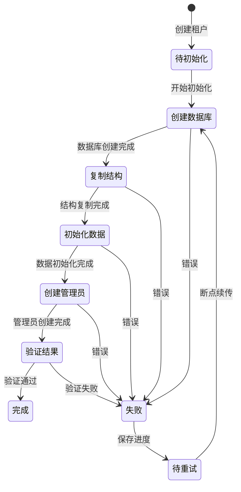
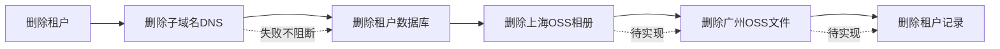

# unified-tenant-system → adminyyup 迁移执行设计

## 一、迁移背景与目标

### 1.1 项目定位对比

| 维度 | unified-tenant-system | adminyyup |
|------|----------------------|-----------|
| **定位** | 混合系统（管理后台+业务功能） | 纯租户管理系统 |
| **服务范围** | 755个TS文件，162个服务 | 42个TS文件，1个服务 |
| **页面结构** | ❌ 页面组织混乱 | ✅ 页面结构清晰正确 |
| **域名** | k.yyup.com（租户业务） | admin.yyup.cc（管理后台） |
| **最后更新** | 2025-11-29 | 2025-09-16 |

### 1.2 核心迁移原则

#### 必须遵守的原则

1. **保持adminyyup前端结构完全不变** - 前端views目录结构已正确，不可修改，只更新API调用逻辑以匹配新后端

2. **只迁移管理后台功能** - 租户生命周期管理、统一认证中心、AI模型配置管理、支付计费管理、系统监控管理。不迁移任何业务功能（招生、学生、教师、营销等）

3. **保持依赖兼容性** - adminyyup使用bcryptjs，unified使用bcrypt，统一使用bcryptjs。只添加必要的依赖包，避免依赖膨胀

### 1.3 迁移范围统计

共计70个文件需要迁移：租户管理服务11个（P0）、认证服务4个（P0）、数据库服务4个（P0）、AI模型服务5个（P0）、支付服务4个（P0 新建）、系统管理服务5个（P1）、路由文件13个、控制器10个、中间件10个

---

## 二、技术架构设计

### 2.1 后端服务目录结构设计

```
adminyyup/admin.yyup.cc/server/src/
├── services/
│   ├── tenant/                    (11个文件)
│   ├── auth/                      (4个文件)
│   ├── database/                  (4个文件)
│   ├── ai/                        (5个文件)
│   ├── payment/                   (4个文件 - 新建)
│   └── system/                    (5个文件)
├── controllers/                   (10个文件)
├── routes/                        (更新现有+新增)
└── middleware/                    (10个文件)
```

### 2.2 租户创建完整流程



### 2.3 统一认证流程



### 2.4 租户初始化进度监控流程



### 2.5 核心服务功能设计

#### 租户服务（tenant.service.ts）核心功能

| 功能方法 | 输入 | 输出 | 关键步骤 |
|---------|------|------|---------|
| createTenant | TenantCreateRequest | TenantInfo | 验证代码、验证手机、生成密码、创建域名、创建数据库、初始化结构、创建管理员 |
| getTenantByCode | tenantCode: string | TenantInfo | 查询租户、解密密码、返回信息 |
| updateTenantStatus | tenantCode, status | void | 更新状态、记录日志 |
| deleteTenant | tenantCode: string | void | 获取信息、删除域名、删除数据库、删除OSS、删除记录 |
| getAllTenants | - | TenantInfo[] | 查询所有、脱敏、返回列表 |

#### 级联删除机制



#### 数据库初始化服务（tenant-database-init.service.ts）功能

| 功能方法 | 职责 | 断点续传支持 |
|---------|------|-------------|
| initializeTenantDatabase | 完整初始化流程协调 | 支持 |
| checkInitializationStatus | 检查当前初始化状态 | - |
| checkPendingProgress | 检查未完成进度 | 核心功能 |
| getStepsToExecute | 计算需要执行的步骤 | 断点续传 |
| executeStep | 执行单个步骤并更新进度 | 进度跟踪 |
| retryInitialization | 重试失败的初始化 | 支持 |
| verifyInitialization | 验证初始化结果 | - |

#### 初始化步骤定义

| 步骤名称 | 说明 | 预计耗时 | 可重试 |
|---------|------|---------|--------|
| 创建租户数据库 | CREATE DATABASE tenant_xxx | 1-2秒 | 是 |
| 复制数据库结构 | 复制表结构、索引、约束 | 5-10秒 | 是 |
| 初始化基础数据 | 角色、权限、菜单、配置 | 3-5秒 | 是 |
| 复制督检中心文档 | 文档模板和实例 | 2-3秒 | 是 |
| 创建管理员账户 | 默认admin账户 | 1秒 | 是 |
| 验证初始化结果 | 完整性验证 | 1秒 | 否 |

#### 统一认证服务（unified-auth.service.ts）功能

| 功能方法 | 职责 | 安全措施 |
|---------|------|---------|
| authenticate | 用户登录认证 | 密码验证、失败次数限制、账户锁定 |
| register | 用户注册 | 密码强度验证、手机号唯一性 |
| findUserTenants | 查找用户关联的租户 | 身份验证、权限检查 |
| bindUserToTenant | 绑定用户到租户 | 防止重复绑定 |
| getUserStats | 获取用户统计 | - |
| verifyToken | 验证JWT Token | Token签名验证 |
| refreshToken | 刷新Token | Refresh Token验证 |

#### 认证安全机制

| 安全措施 | 配置项 | 默认值 |
|---------|--------|--------|
| 密码加密 | bcrypt.hash | 12轮加密 |
| 失败次数限制 | MAX_LOGIN_ATTEMPTS | 5次 |
| 账户锁定时间 | ACCOUNT_LOCK_TIME | 30分钟 |
| Token有效期 | UNIFIED_AUTH_TOKEN_EXPIRES | 24小时 |
| Refresh Token有效期 | UNIFIED_AUTH_REFRESH_EXPIRES | 7天 |

---

## 三、API接口设计

### 3.1 租户管理API

#### 创建租户

```
POST /api/tenants
Content-Type: application/json

请求体：
{
  "tenantCode": "k001",
  "name": "示例幼儿园",
  "domain": "k001.yyup.cc",
  "subdomain": "k001",
  "contactName": "张三",
  "contactEmail": "zhangsan@example.com",
  "contactPhone": "13800138000",
  "address": "北京市朝阳区xxx",
  "description": "示例幼儿园",
  "smsVerificationCode": "123456"
}

响应：
{
  "success": true,
  "message": "租户创建成功",
  "data": {
    "id": 1,
    "tenantCode": "k001",
    "name": "示例幼儿园",
    "domain": "k001.yyup.cc",
    "databaseName": "tenant_k001",
    "status": "pending",
    "domainConfig": {
      "domain": "k001.yyup.cc",
      "ip": "xxx.xxx.xxx.xxx",
      "provider": "aliyun"
    }
  }
}
```

#### 获取租户列表

```
GET /api/tenants?page=1&pageSize=20&status=active

响应：租户列表，包含id、tenantCode、name、domain、status、contactName、contactPhone、createdAt等字段
```

#### 获取初始化进度

```
GET /api/tenants/:tenantCode/progress

响应：包含tenantCode、overallStatus、overallProgress、currentStep、steps数组（每个步骤的状态、进度、消息、时间）、errors数组
```

#### 更新租户状态

```
PATCH /api/tenants/:tenantCode/status
Content-Type: application/json

请求体：{ "status": "suspended" }  // active | suspended | deleted
响应：{ "success": true, "message": "租户状态更新成功" }
```

#### 删除租户

```
DELETE /api/tenants/:tenantCode

响应：包含deletedResources对象（domain、database、shanghaiOSS、guangzhouOSS的删除状态）
```

### 3.2 统一认证API

#### 用户登录

```
POST /api/unified-auth/login
Content-Type: application/json

请求体：{ "phone": "13800138000", "password": "password123", "registrationSource": "admin" }
响应：包含globalUserId、phone、realName、email、isNewUser、token、refreshToken
```

#### 用户注册

```
POST /api/unified-auth/register
Content-Type: application/json

请求体：{ "phone": "13800138000", "password": "password123", "realName": "张三", "email": "zhangsan@example.com", "registrationSource": "admin" }
响应：包含globalUserId、phone、realName、email
```

#### 查找用户租户

```
POST /api/unified-auth/find-tenants
Content-Type: application/json

请求体：{ "phone": "13800138000", "password": "password123" }
响应：包含phone、globalUserId、tenants数组（每个租户的tenantCode、tenantName、domain、hasAccount、role、lastLoginAt、loginCount、status）
```

### 3.3 AI模型管理API

#### 获取AI模型配置

```
GET /api/ai-models

响应：包含models数组，每个模型包含id、modelId、modelName、provider、endpoint、apiKey、maxTokens、temperature、pricing（inputPrice、outputPrice、unit）、status
```

#### 同步AI配置

```
POST /api/ai-models/sync
Content-Type: application/json

请求体：{ "sourceSystem": "k.yyup.com" }
响应：{ "success": true, "message": "同步成功", "data": { "syncedModels": 5, "updatedModels": 3, "newModels": 2 } }
```

#### 获取AI使用统计

```
GET /api/ai-models/usage?tenantCode=k001&startDate=2025-01-01&endDate=2025-01-31

响应：包含tenantCode、period（start、end）、usage（totalRequests、totalTokens、totalCost、byModel数组）
```

### 3.4 支付计费API（新建）

#### 获取账户余额

```
GET /api/payment/accounts/:tenantCode

响应：包含tenantCode、balance、currency、status、lowBalanceThreshold、isLowBalance
```

#### 账户充值

```
POST /api/payment/recharge
Content-Type: application/json

请求体：{ "tenantCode": "k001", "amount": 500.00, "paymentMethod": "alipay", "paymentOrderId": "xxx" }
响应：包含transactionId、amount、newBalance
```

#### 获取交易流水

```
GET /api/payment/transactions?tenantCode=k001&page=1&pageSize=20

响应：包含transactions数组（id、tenantCode、type、amount、balance、description、createdAt）、total、page、pageSize
```

#### 获取计费规则

```
GET /api/payment/billing-rules

响应：包含rules数组，每个规则包含id、category、name、billingCycle、pricing配置
```

---

## 四、数据库设计（基于已开发的实际数据库结构）

### 4.0 数据库说明

本迁移项目涉及两个核心数据库：

| 数据库名称 | 用途 | 位置 | 说明 |
|-----------|------|------|------|
| **admin_tenant_management** | 租户管理中心数据库 | 远程MySQL | adminyyup系统的核心数据库，已开发完成 |
| **unified_auth** | 统一认证中心数据库 | 远程MySQL | 统一认证系统的数据库，已开发完成 |

**重要提示**：设计文档中的数据库结构必须与实际已开发的数据库保持一致，不允许新建表或修改表结构，只能使用现有表。

### 4.1 admin_tenant_management 数据库（租户管理中心）

**数据库连接信息**：
- 主机：dbconn.sealoshzh.site
- 端口：43906  
- 数据库名：admin_tenant_management
- 用户：root
- 密码：pwk5ls7j

#### 核心表结构（基于实际已开发的Sequelize模型）

**表1：tenants - 租户表**

| 字段名 | 类型 | 约束 | 默认值 | 说明 |
|--------|------|------|--------|------|
| id | INTEGER | PRIMARY KEY, AUTO_INCREMENT | - | 主键ID |
| tenant_id | STRING(50) | NOT NULL, UNIQUE | - | 租户唯一标识（k001, k002...） |
| name | STRING(255) | NOT NULL | - | 租户名称 |
| domain | STRING(255) | NOT NULL, UNIQUE | - | 租户域名（k001.yyup.cc） |
| database_name | STRING(100) | NOT NULL, UNIQUE | - | 租户数据库名称 |
| status | ENUM | NOT NULL | 'active' | active/inactive/suspended/deleted |
| plan_type | ENUM | NOT NULL | 'basic' | basic/standard/premium/enterprise |
| max_users | INTEGER | NOT NULL | 100 | 最大用户数 |
| max_storage | INTEGER | NOT NULL | 1024 | 最大存储空间(MB) |
| contact_name | STRING(100) | NULL | - | 联系人姓名 |
| contact_email | STRING(255) | NULL | - | 联系人邮箱 |
| contact_phone | STRING(50) | NULL | - | 联系人电话 |
| settings | JSON | NULL | - | 租户设置（JSON对象） |
| deleted_at | DATE | NULL | - | 软删除时间 |
| created_at | TIMESTAMP | NOT NULL | NOW | 创建时间 |
| updated_at | TIMESTAMP | NOT NULL | NOW | 更新时间 |

索引：
- INDEX: tenant_id
- INDEX: domain  
- INDEX: status
- INDEX: deleted_at

模型方法：
- softDelete(): Promise<void> - 软删除租户
- restore(): Promise<void> - 恢复已删除租户
- isActive(): boolean - 判断租户是否活跃
- isDeleted(): boolean - 判断租户是否已删除

**表2：tenant_accounts - 租户账户表**

| 字段名 | 类型 | 约束 | 默认值 | 说明 |
|--------|------|------|--------|------|
| id | INTEGER | PRIMARY KEY, AUTO_INCREMENT | - | 主键ID |
| tenant_id | STRING(50) | NOT NULL, FK | - | 租户ID（外键关联tenants.tenant_id） |
| account_type | ENUM | NOT NULL | 'prepaid' | prepaid/postpaid/credit |
| balance | DECIMAL(15,2) | NOT NULL | 0.00 | 账户余额 |
| credit_limit | DECIMAL(15,2) | NULL | - | 信用额度 |
| auto_recharge | BOOLEAN | NOT NULL | false | 是否自动充值 |
| auto_recharge_amount | DECIMAL(10,2) | NULL | - | 自动充值金额 |
| auto_recharge_threshold | DECIMAL(10,2) | NULL | - | 自动充值阈值 |
| billing_cycle | ENUM | NOT NULL | 'monthly' | monthly/quarterly/yearly |
| billing_day | INTEGER | NOT NULL | 1 | 计费日期（1-31） |
| status | ENUM | NOT NULL | 'active' | active/suspended/frozen |
| last_billing_date | DATE | NULL | - | 上次计费日期 |
| next_billing_date | DATE | NULL | - | 下次计费日期 |
| created_at | TIMESTAMP | NOT NULL | NOW | 创建时间 |
| updated_at | TIMESTAMP | NOT NULL | NOW | 更新时间 |

索引：
- INDEX: tenant_id
- INDEX: account_type
- INDEX: status
- INDEX: next_billing_date

模型方法：
- recharge(amount: number, description?: string): Promise<void> - 充值
- deduct(amount: number, description?: string): Promise<boolean> - 扣费
- canDeduct(amount: number): boolean - 检查是否可扣费
- getAvailableBalance(): number - 获取可用余额

**表3：ai_model_config - AI模型配置表**

| 字段名 | 类型 | 约束 | 默认值 | 说明 |
|--------|------|------|--------|------|
| id | INTEGER | PRIMARY KEY, AUTO_INCREMENT | - | 主键ID |
| name | STRING(100) | NOT NULL | - | 模型名称 |
| display_name | STRING(100) | NOT NULL | '' | 显示名称 |
| provider | STRING(50) | NOT NULL | - | 提供商（OpenAI/Anthropic等） |
| model_type | ENUM | NOT NULL | - | text/speech/image/video/multimodal/embedding/search |
| api_version | STRING(20) | NOT NULL | 'v1' | API版本 |
| endpoint_url | STRING(255) | NOT NULL | - | 端点URL |
| api_key | STRING(255) | NOT NULL | - | API密钥 |
| model_parameters | JSON | NULL | - | 模型参数（temperature, max_tokens等） |
| is_default | BOOLEAN | NOT NULL | false | 是否为默认模型 |
| status | ENUM | NOT NULL | 'inactive' | active/inactive/testing |
| description | TEXT | NULL | - | 模型描述 |
| capabilities | JSON | NULL | - | 模型能力列表（JSON数组） |
| max_tokens | INTEGER | NULL | - | 最大令牌数 |
| creator_id | INTEGER | NULL | - | 创建者ID |
| created_at | TIMESTAMP | NOT NULL | NOW | 创建时间 |
| updated_at | TIMESTAMP | NOT NULL | NOW | 更新时间 |

索引：
- UNIQUE INDEX: (name, provider)
- INDEX: model_type
- INDEX: status

### 4.2 unified_auth 数据库（统一认证中心）

**重要说明**：统一认证相关的表**也在 admin_tenant_management 数据库中**，不是独立的数据库。以下表都在同一个 `admin_tenant_management` 数据库。

#### 核心表结构（已存在于 admin_tenant_management）

**表4：global_users - 全局用户表**

```
表名：global_users
引擎：InnoDB
字符集：utf8mb4_unicode_ci
描述：存储所有统一认证用户信息
位置：admin_tenant_management 数据库
```

| 字段名 | 类型 | 是否必填 | 默认值 | 说明 |
|--------|------|---------|--------|------|
| id | VARCHAR(100) | 是 | - | 全局用户ID（UUID格式） |
| phone | VARCHAR(20) | 是 | - | 手机号（唯一标识） |
| password_hash | VARCHAR(255) | 是 | - | 密码哈希值（bcrypt） |
| real_name | VARCHAR(50) | 否 | - | 真实姓名 |
| email | VARCHAR(100) | 否 | - | 邮箱地址 |
| avatar_url | VARCHAR(512) | 否 | - | 头像URL |
| status | ENUM | 是 | active | active/inactive/locked |
| registration_source | ENUM | 是 | web | web/mobile/admin/tenant_creation |
| last_login_at | TIMESTAMP | 否 | - | 最后登录时间 |
| last_login_ip | VARCHAR(45) | 否 | - | 最后登录IP |
| login_count | INT | 是 | 0 | 登录次数 |
| failed_login_count | INT | 是 | 0 | 失败登录次数 |
| locked_until | TIMESTAMP | 否 | - | 锁定到期时间 |
| created_at | TIMESTAMP | 是 | NOW | 创建时间 |
| updated_at | TIMESTAMP | 是 | NOW | 更新时间 |

索引：
- PRIMARY KEY: id
- UNIQUE INDEX: phone
- INDEX: status
- INDEX: created_at
- INDEX: registration_source

**表5：global_user_tenant_relations - 用户租户关联表**

```
表名：global_user_tenant_relations
引擎：InnoDB
字符集：utf8mb4_unicode_ci
描述：存储用户与租户的关联关系
位置：admin_tenant_management 数据库
```

| 字段名 | 类型 | 是否必填 | 默认值 | 说明 |
|--------|------|---------|--------|------|
| id | INT | 是 | AUTO_INCREMENT | 关联ID |
| global_user_id | VARCHAR(100) | 是 | - | 全局用户ID |
| tenant_code | VARCHAR(20) | 是 | - | 租户代码 |
| tenant_user_id | VARCHAR(100) | 否 | - | 租户内用户ID |
| role_in_tenant | VARCHAR(50) | 否 | - | 在租户中的角色 |
| permissions | TEXT | 否 | - | 租户内权限（JSON格式） |
| first_login_at | TIMESTAMP | 否 | - | 首次登录时间 |
| last_login_at | TIMESTAMP | 否 | - | 租户内最后登录时间 |
| last_login_ip | VARCHAR(45) | 否 | - | 租户内最后登录IP |
| login_count | INT | 是 | 0 | 租户内登录次数 |
| data_usage | BIGINT | 是 | 0 | 数据使用量（字节） |
| storage_usage | BIGINT | 是 | 0 | 存储使用量（字节） |
| status | ENUM | 是 | active | active/inactive/suspended |
| created_at | TIMESTAMP | 是 | NOW | 创建时间 |
| updated_at | TIMESTAMP | 是 | NOW | 更新时间 |

索引：
- PRIMARY KEY: id
- UNIQUE KEY: (global_user_id, tenant_code)
- INDEX: global_user_id
- INDEX: tenant_code
- INDEX: tenant_user_id
- INDEX: status
- INDEX: created_at
- FOREIGN KEY: global_user_id REFERENCES global_users(id) ON DELETE CASCADE

### 4.3 数据库表与前端页面对应关系

**重要：所有表都在 admin_tenant_management 数据库中**

| 前端页面 | 数据库表 | 主要字段 | API端点 |
|----------|----------|---------|----------|
| **Dashboard/index.vue** | tenants | id, tenant_id, status | GET /api/statistics/dashboard |
|  | tenant_accounts | balance | |
|  | ai_model_config | id, status | |
| **Tenant/Management.vue** | tenants | 所有字段 | GET/POST/PUT/DELETE /api/tenants |
|  | tenant_accounts | balance, status | GET /api/tenants/:id/account |
| **Tenant/Statistics.vue** | tenants | tenant_id, name | GET /api/tenants/:id/statistics |
|  | （需要从租户数据库查询） | user_count, storage_usage | |
| **AIModel/Management.vue** | ai_model_config | 所有字段 | GET/POST/PUT/DELETE /api/ai-models |
| **AIModel/Sync.vue** | ai_model_config | name, status, updated_at | GET /api/ai-models/sync |
|  | （同步日志表 - 待开发） | sync_status, sync_time | POST /api/ai-models/sync |
| **Payment/Management.vue** | tenant_accounts | 所有字段 | GET /api/payment/accounts |
|  | （交易记录表 - 待开发） | transaction_type, amount | GET /api/payment/transactions |
| **Payment/Billing.vue** | tenant_accounts | billing_cycle, billing_day | GET /api/payment/billing |
|  | ai_model_config | model_parameters | |
| **System/Settings.vue** | （系统配置表 - 待开发） | config_key, config_value | GET/PUT /api/system/configs |
| **System/Logs.vue** | （系统日志表 - 待开发） | action, resource, created_at | GET /api/system/logs |
| **Login.vue** | （unified_auth.global_users） | phone, password_hash | POST /api/auth/login |

#### 缺失的数据库表分析（需要同步）

**重要发现**：以下表在 `/server/src/database/models/` 目录中**已有Sequelize模型定义**，说明这些表**应该存在于数据库中**，只是可能需要同步到远程数据库。

✅ **已有模型文件的表**（需要执行数据库同步）：

1. **sync_logs** - 同步日志表
   - 模型文件：`/server/src/database/models/SyncLog.ts` ✅
   - 前端依赖：AIModel/Sync.vue, aiModelApi.getSyncTasks()
   - **处理方案**：执行 `sequelize.sync()` 创建表

2. **ai_model_usage** - AI模型使用记录表  
   - 模型文件：`/server/src/database/models/AIModelUsage.ts` ✅
   - 前端依赖：AIModel/Management.vue（使用统计）
   - **处理方案**：执行 `sequelize.sync()` 创建表

3. **ai_model_billing** - AI模型计费规则表
   - 模型文件：`/server/src/database/models/AIModelBilling.ts` ✅
   - 前端依赖：Payment/Billing.vue
   - **处理方案**：执行 `sequelize.sync()` 创建表

4. **tenant_statistics** - 租户统计表
   - 模型文件：`/server/src/database/models/TenantStatistics.ts` ✅
   - 前端依赖：Tenant/Statistics.vue, Dashboard/index.vue
   - **处理方案**：执行 `sequelize.sync()` 创建表

5. **system_logs** - 系统日志表
   - 模型文件：`/server/src/database/models/SystemLog.ts` ✅
   - 前端依赖：System/Logs.vue
   - **处理方案**：执行 `sequelize.sync()` 创建表

6. **users** - 管理员用户表
   - 模型文件：`/server/src/database/models/User.ts` ✅
   - 前端依赖：Login.vue（管理员登录）
   - **处理方案**：执行 `sequelize.sync()` 创建表

❌ **真正缺失的表**（需要创建模型）：

1. **payment_transactions** - 支付交易表
   - 前端依赖：Payment/Management.vue, paymentApi.getTransactions()
   - **处理方案A（推荐）**：创建新的模型文件 `PaymentTransaction.ts` 并执行 `sequelize.sync()`
   - **处理方案B（临时）**：使用虚拟数据生成（基于tenant_accounts的变更记录）

---

注意：根据用户反馈，system_configs → 已存在 **system_config** 表（注意表名是单数形式），不需要创建新表。

### 4.2 索引优化策略

| 表名 | 索引名称 | 字段 | 类型 | 用途 |
|------|---------|------|------|------|
| tenants | idx_tenant_code | tenant_code | UNIQUE | 租户代码查询 |
| tenants | idx_domain | domain | UNIQUE | 域名查询 |
| tenants | idx_status_created | status, created_at | COMPOSITE | 列表分页查询 |
| global_users | idx_phone | phone | UNIQUE | 手机号登录 |
| user_tenant_relations | idx_user_tenant | global_user_id, tenant_code | UNIQUE | 用户租户关联 |
| auth_logs | idx_phone_time | phone, created_at | COMPOSITE | 登录历史查询 |
| ai_usage_logs | idx_tenant_time | tenant_code, request_time | COMPOSITE | 租户使用统计 |
| payment_transactions | idx_tenant_time | tenant_code, created_at | COMPOSITE | 交易流水查询 |

---

## 五、前端对接设计

### 5.1 前端页面功能矩阵

| 页面文件 | 功能 | 需要对接的API | 数据展示 | 操作功能 |
|---------|------|-------------|---------|---------|
| Dashboard/index.vue | 仪表板 | /api/statistics/dashboard | 租户总数、活跃租户、AI使用量、系统状态 | 无 |
| Tenant/Management.vue | 租户管理 | /api/tenants, /api/tenants/:id/progress | 租户列表、初始化进度 | 创建、编辑、删除、暂停、恢复 |
| Tenant/Statistics.vue | 租户统计 | /api/tenants/:id/statistics | 用户数、日活、月活、存储使用 | 无 |
| AIModel/Management.vue | AI模型管理 | /api/ai-models | 模型列表、配置信息 | 添加、编辑、删除、启用/禁用 |
| AIModel/Sync.vue | AI模型同步 | /api/ai-models/sync | 同步状态、同步历史 | 执行同步 |
| Payment/Management.vue | 账户管理 | /api/payment/accounts/:id | 账户余额、低余额告警 | 充值、查看流水 |
| Payment/Billing.vue | 计费管理 | /api/payment/billing-rules, /api/payment/transactions | 计费规则、交易流水 | 配置规则、查看详情 |
| System/Settings.vue | 系统设置 | /api/system/configs | 系统配置项 | 修改配置 |
| System/Logs.vue | 系统日志 | /api/system/logs | 操作日志列表 | 查询、导出 |
| Login.vue | 登录 | /api/unified-auth/login | 无 | 登录认证 |

### 5.2 前端API客户端更新

#### tenant.ts 需要添加的方法

getTenants（获取租户列表）、createTenant（创建租户）、getTenantDetail（获取租户详情）、updateTenantStatus（更新租户状态）、deleteTenant（删除租户）、getInitProgress（获取初始化进度）、retryInit（重试初始化）、getTenantStatistics（获取租户统计）

#### aiModel.ts 需要添加的方法

getAIModels（获取AI模型列表）、createAIModel（添加AI模型）、updateAIModel（更新AI模型）、deleteAIModel（删除AI模型）、syncAIModels（同步AI配置）、getAIUsageStats（获取AI使用统计）

#### payment.ts 需要创建的方法（新建文件）

getAccountBalance（获取账户余额）、recharge（账户充值）、getTransactions（获取交易流水）、getBillingRules（获取计费规则）、updateBillingRule（更新计费规则）

#### statistics.ts 需要添加的方法

getDashboardData（获取仪表板数据）、getTenantTrends（获取租户统计趋势）

---

## 六、后端实现设计（基于已开发的数据库表）

### 6.0 数据库表状态总览

**重要说明**：所有表都在 `admin_tenant_management` 数据库中（远程MySQL，dbconn.sealoshzh.site:43906）

| 序号 | 表名 | 模型文件 | 状态 | 处理方案 | 优先级 |
|------|------|----------|------|----------|-------|
| 1 | tenants | /src/models/Tenant.ts | ✅ 已存在 | 直接使用 | - |
| 2 | tenant_accounts | /src/models/TenantAccount.ts | ✅ 已存在 | 直接使用 | - |
| 3 | ai_model_config | /src/models/AIModelConfig.ts | ✅ 已存在 | 直接使用 | - |
| 4 | global_users | - | ✅ 已存在 | 直接使用 | - |
| 5 | global_user_tenant_relations | - | ✅ 已存在 | 直接使用 | - |
| 6 | system_config | - | ✅ 已存在 | 直接使用（注意表名是单数） | - |
| 7 | sync_logs | /database/models/SyncLog.ts | ⚠️ 模型已开发 | 执行sequelize.sync() | P0 |
| 8 | ai_model_usage | /database/models/AIModelUsage.ts | ⚠️ 模型已开发 | 执行sequelize.sync() | P0 |
| 9 | ai_model_billing | /database/models/AIModelBilling.ts | ⚠️ 模型已开发 | 执行sequelize.sync() | P0 |
| 10 | tenant_statistics | /database/models/TenantStatistics.ts | ⚠️ 模型已开发 | 执行sequelize.sync() | P1 |
| 11 | system_logs | /database/models/SystemLog.ts | ⚠️ 模型已开发 | 执行sequelize.sync() | P1 |
| 12 | users | /database/models/User.ts | ⚠️ 模型已开发 | 执行sequelize.sync() | P0 |
| 13 | payment_transactions | - | ❌ 缺失 | 创建模型+sync 或 虚拟实现 | P1 |

**状态说明**：
- ✅ **已存在**：表已在数据库中，可直接使用
- ⚠️ **模型已开发**：Sequelize模型文件已存在，但需要同步到数据库
- ❌ **缺失**：无模型文件，也无数据库表，需要决定实现方案

### 6.1 服务层设计原则

**核心原则**：
1. **使用已开发的模型** - 优先使用 /database/models/ 和 /src/models/ 目录中已有的Sequelize模型
2. **数据库表同步** - 对于有模型但未同步的表，执行sequelize.sync()创建表结构
3. **充分利用Sequelize功能** - 利用已开发的模型方法和关联查询
4. **分离管理和租户数据** - 管理数据存储在admin_tenant_management，租户业务数据存储在各自的租户数据库
5. **payment_transactions表处理** - 提供两种方案：方案A创建新表（推荐），方案B使用虚拟数据（临时）

### 6.2 租户管理服务设计

#### 6.2.1 TenantService - 租户核心服务

**文件路径**：server/src/services/tenant/tenant.service.ts

**依赖模型**：Tenant (已开发)

**核心方法设计**：

```typescript
// 获取租户列表
async getTenants(filters: TenantFilters, pagination: PaginationParams): Promise<PaginatedResponse<Tenant>>
实现逻辑：
1. 使用Tenant.findAndCountAll()
2. 支持的过滤条件：keyword(模糊搜索name/tenant_id), status(精确匹配)
3. 排序：created_at DESC
4. 分页：limit, offset
5. 关联查询：include: [{ model: TenantAccount, as: 'accounts' }]
6. 返回：{ items: Tenant[], pagination: { page, size, total } }

// 创建租户
async createTenant(data: TenantForm): Promise<Tenant>
实现逻辑：
1. 验证tenant_id格式（k001-k999）和domain格式（k001.yyup.cc）
2. 检查tenant_id和domain是否已存在
3. 生成database_name = `tenant_${tenant_id}`
4. 使用Tenant.create()创建租户记录
5. 创建关联账户：TenantAccount.create({ tenant_id, account_type: 'prepaid', balance: data.initialBalance })
6. **虚拟初始化进度** - 不存储到数据库，直接返回 { status: 'completed', progress: 100 }
7. 返回创建的租户对象

// 更新租户
async updateTenant(tenantId: string, data: Partial<TenantForm>): Promise<Tenant>
实现逻辑：
1. 使用Tenant.findOne({ where: { tenant_id: tenantId } })
2. 检查租户是否存在
3. 使用tenant.update(data)更新
4. 返回更新后的租户对象

// 删除租户（软删除）
async deleteTenant(tenantId: string): Promise<void>
实现逻辑：
1. 查找租户：Tenant.findOne({ where: { tenant_id: tenantId } })
2. 调用模型方法：tenant.softDelete() (已定义在Tenant模型中)
3. 设置status='deleted', deleted_at=NOW

// 暂停/恢复租户
async suspendTenant(tenantId: string): Promise<void>
async resumeTenant(tenantId: string): Promise<void>
实现逻辑：
1. 查找租户
2. 更新status字段为'suspended'或'active'
3. 保存
```

#### 6.2.2 TenantStatisticsService - 租户统计服务

**文件路径**：server/src/services/tenant/tenant-statistics.service.ts

**依赖模型**：TenantStatistics (已开发，位于 /database/models/TenantStatistics.ts)

**核心方法设计**：

```typescript
// 获取租户统计数据
async getTenantStatistics(tenantId: string, dateRange?: [string, string]): Promise<TenantStatistics>
实现逻辑：
1. 构建查询条件：
   where = { tenant_id: tenantId }
   如果提供了dateRange: where.stat_date = { [Op.between]: [dateRange[0], dateRange[1]] }
2. 查询统计记录：TenantStatistics.findAll({ 
     where, 
     order: [['stat_date', 'DESC']], 
     limit: 1,
     include: [{ model: Tenant, as: 'tenant' }]
   })
3. 如果没有历史统计数据，返回默认值：
   {
     tenant_id: tenantId,
     active_users: 0,
     new_users: 0,
     total_users: 0,
     ai_requests: 0,
     ai_tokens_used: 0,
     revenue: 0,
     stat_date: new Date()
   }
4. 返回最新统计记录

// 获取租户统计趋势（多日统计）
async getTenantStatisticsTrend(tenantId: string, days: number = 30): Promise<TenantStatistics[]>
实现逻辑：
1. 计算日期范围：startDate = days天前, endDate = 今天
2. 查询统计记录：TenantStatistics.findAll({ 
     where: { 
       tenant_id: tenantId,
       stat_date: { [Op.between]: [startDate, endDate] }
     },
     order: [['stat_date', 'ASC']]
   })
3. 返回统计数组（用于趋势图展示）
```

### 6.3 AI模型管理服务设计

#### 6.3.1 AIModelService - AI模型核心服务

**文件路径**：server/src/services/ai/ai-model.service.ts

**依赖模型**：AIModelConfig (已开发)

**核心方法设计**：

```typescript
// 获取AI模型列表
async getModelList(filters: { keyword?, provider?, status? }, pagination): Promise<PaginatedResponse<AIModelConfig>>
实现逻辑：
1. 构建where条件：
   - keyword: { [Op.or]: [{ name: { [Op.like]: `%${keyword}%` } }, { display_name: { [Op.like]: `%${keyword}%` } }] }
   - provider: { provider: filters.provider }
   - status: { status: filters.status }
2. AIModelConfig.findAndCountAll({ where, limit, offset, order: [['created_at', 'DESC']] })
3. 返回分页结果

// 创建/更新AI模型
async createModel(data: ModelForm): Promise<AIModelConfig>
async updateModel(modelId: string, data: Partial<ModelForm>): Promise<AIModelConfig>
实现逻辑：
1. 验证必填字段：name, provider, model_type, endpoint_url
2. 检查(name, provider)唯一性
3. 转换model_parameters为JSON格式
4. 使用AIModelConfig.create()或model.update()
5. 返回模型对象

// 删除AI模型
async deleteModel(modelId: number): Promise<void>
实现逻辑：
1. 查找模型：AIModelConfig.findByPk(modelId)
2. 检查是否为默认模型：如果is_default=true，拒绝删除
3. 物理删除：model.destroy()
```

#### 6.3.2 AIModelSyncService - AI模型同步服务

**文件路径**：server/src/services/ai/ai-model-sync.service.ts

**依赖模型**：SyncLog (已开发，位于 /database/models/SyncLog.ts)

**核心方法设计**：

```typescript
// 同步AI模型
async syncModelsFromSource(): Promise<SyncResult>
实现逻辑：
1. 创建同步任务记录：SyncLog.create({ sync_type: 'model_sync', status: 'running' })
2. 执行同步逻辑（从源系统拉取AI模型配置）
3. 更新AIModelConfig表
4. 更新同步任务：syncLog.update({ status: 'success', completed_at: new Date(), records_synced: count })
5. 返回：{
     success: true,
     synced_count: count,
     sync_time: new Date(),
     message: '同步完成'
   }

// 获取同步任务列表
async getSyncTasks(filters, pagination): Promise<PaginatedResponse<SyncTask>>
实现逻辑：
1. 构建where条件：
   - sync_type: filters.taskType
   - status: filters.status
2. SyncLog.findAndCountAll({ where, limit, offset, order: [['created_at', 'DESC']] })
3. 转换为前端所需的SyncTask格式：
   {
     taskId: log.id,
     taskType: log.sync_type,
     modelName: log.target_table,
     status: log.status,
     progress: log.status === 'success' ? 100 : 0,
     startTime: log.started_at,
     duration: calculateDuration(log.started_at, log.completed_at),
     message: log.error_message || '同步成功'
   }
4. 返回分页结果
```

#### 6.3.3 AIModelUsageService - AI模型使用记录服务

**文件路径**：server/src/services/ai/ai-model-usage.service.ts

**依赖模型**：AIModelUsage (已开发，位于 /database/models/AIModelUsage.ts)

**核心方法设计**：

```typescript
// 获取使用记录列表
async getUsageRecords(filters: { tenantId?, modelId?, startDate?, endDate? }, pagination): Promise<PaginatedResponse<AIModelUsage>>
实现逻辑：
1. 构建where条件：
   where = {}
   如果提供了filters.tenantId: where.tenant_id = filters.tenantId
   如果提供了filters.modelId: where.model_id = filters.modelId
   如果提供了filters.dateRange: where.created_at = { [Op.between]: [startDate, endDate] }
2. 查询使用记录：AIModelUsage.findAndCountAll({ 
     where, 
     limit, 
     offset, 
     order: [['created_at', 'DESC']],
     include: [
       { model: Tenant, as: 'tenant', attributes: ['tenant_id', 'name'] },
       { model: AIModelConfig, as: 'model', attributes: ['name', 'display_name', 'provider'] }
     ]
   })
3. 返回分页结果：{ items: usageRecords, pagination: { page, size, total } }

// 创建使用记录
async createUsageRecord(data: { tenantId, modelId, requestTokens, responseTokens, totalCost, requestMetadata }): Promise<AIModelUsage>
实现逻辑：
1. 验证租户和模型存在
2. 创建使用记录：AIModelUsage.create({
     tenant_id: data.tenantId,
     model_id: data.modelId,
     request_tokens: data.requestTokens,
     response_tokens: data.responseTokens,
     total_tokens: data.requestTokens + data.responseTokens,
     total_cost: data.totalCost,
     request_metadata: JSON.stringify(data.requestMetadata),
     created_at: new Date()
   })
3. 返回创建的记录

// 获取使用统计
async getUsageStats(tenantId: string, period: 'day' | 'week' | 'month'): Promise<UsageStats>
实现逻辑：
1. 计算时间范围：根据period计算startDate和endDate
2. 查询统计数据：
   - 总请求数：AIModelUsage.count({ where: { tenant_id: tenantId, created_at: { [Op.gte]: startDate } } })
   - 总Token数：AIModelUsage.sum('total_tokens', { where: ... })
   - 总费用：AIModelUsage.sum('total_cost', { where: ... })
3. 按模型分组统计：AIModelUsage.findAll({
     where: { tenant_id: tenantId, created_at: { [Op.gte]: startDate } },
     attributes: [
       'model_id',
       [sequelize.fn('COUNT', sequelize.col('id')), 'request_count'],
       [sequelize.fn('SUM', sequelize.col('total_tokens')), 'total_tokens'],
       [sequelize.fn('SUM', sequelize.col('total_cost')), 'total_cost']
     ],
     group: ['model_id'],
     include: [{ model: AIModelConfig, as: 'model', attributes: ['name', 'display_name'] }]
   })
4. 返回统计结果
```

#### 6.3.4 AIModelBillingService - AI模型计费服务

**文件路径**：server/src/services/ai/ai-model-billing.service.ts

**依赖模型**：AIModelBilling (已开发，位于 /database/models/AIModelBilling.ts)

**核心方法设计**：

```typescript
// 获取计费规则列表
async getBillingRules(filters: { modelId?, status? }, pagination): Promise<PaginatedResponse<AIModelBilling>>
实现逻辑：
1. 构建where条件：
   where = {}
   如果提供了filters.modelId: where.model_id = filters.modelId
   如果提供了filters.status: where.status = filters.status
2. 查询计费规则：AIModelBilling.findAndCountAll({ 
     where, 
     limit, 
     offset, 
     order: [['created_at', 'DESC']],
     include: [{ model: AIModelConfig, as: 'model', attributes: ['name', 'display_name', 'provider'] }]
   })
3. 返回分页结果

// 创建/更新计费规则
async createBillingRule(data: BillingRuleForm): Promise<AIModelBilling>
async updateBillingRule(ruleId: number, data: Partial<BillingRuleForm>): Promise<AIModelBilling>
实现逻辑：
1. 验证必填字段：model_id, billing_type, price_per_unit
2. 检查模型存在性：AIModelConfig.findByPk(data.model_id)
3. 创建或更新规则：AIModelBilling.create(data) 或 rule.update(data)
4. 返回计费规则对象

// 计算费用
async calculateCost(modelId: number, tokens: number): Promise<{ cost: number, rule: AIModelBilling }>
实现逻辑：
1. 查找生效的计费规则：AIModelBilling.findOne({ 
     where: { model_id: modelId, status: 'active' },
     order: [['created_at', 'DESC']]
   })
2. 如果没有找到规则，使用默认价格（如0.001元/1000 tokens）
3. 根据billing_type计算费用：
   - 'per_token': cost = tokens * price_per_unit
   - 'per_1k_tokens': cost = (tokens / 1000) * price_per_unit
   - 'per_request': cost = price_per_unit
4. 返回费用和使用的规则
```

### 6.4 支付管理服务设计

#### 6.4.1 PaymentAccountService - 账户服务

**文件路径**：server/src/services/payment/payment-account.service.ts

**依赖模型**：TenantAccount (已开发)

**核心方法设计**：

```typescript
// 获取账户信息
async getAccountDetail(tenantId: string): Promise<TenantAccount>
实现逻辑：
1. TenantAccount.findOne({ where: { tenant_id: tenantId }, include: [{ model: Tenant, as: 'tenant' }] })
2. 计算可用余额：account.getAvailableBalance() (模型方法已定义)
3. 返回账户对象

// 账户充值
async rechargeAccount(data: { tenantId, amount, paymentMethod, remark }): Promise<void>
实现逻辑：
1. 查找账户：TenantAccount.findOne({ where: { tenant_id: data.tenantId } })
2. 调用模型方法：account.recharge(data.amount, data.remark) (已定义)
3. 更新balance字段
4. **不创建交易记录** - 因为没有payment_transactions表

// 账户扣费
async deductAccount(data: { tenantId, amount, reason, metadata }): Promise<boolean>
实现逻辑：
1. 查找账户
2. 检查余额：account.canDeduct(data.amount) (模型方法)
3. 执行扣费：account.deduct(data.amount, data.reason)
4. 返回扣费结果
```

#### 6.4.2 PaymentTransactionService - 交易记录服务

**文件路径**：server/src/services/payment/payment-transaction.service.ts

**状态说明**：⚠️ 需要创建PaymentTransaction模型文件和数据库表

**两种实现方案**：

**方案A（推荐）**：创建完整的交易记录功能
1. 创建模型文件：/database/models/PaymentTransaction.ts
2. 定义表结构：id, tenant_id, transaction_type, amount, balance_before, balance_after, payment_method, status, metadata, created_at
3. 执行数据库同步：sequelize.sync()
4. 实现交易记录创建和查询功能

**方案B（临时方案）**：虚拟实现
如果暂时不创建表，使用虚拟数据生成：

```typescript
// 获取交易记录（虚拟生成）
async getTransactions(filters: { tenantId?, type?, startDate?, endDate? }, pagination): Promise<PaginatedResponse<Transaction>>
实现逻辑：
1. **虚拟生成交易记录** - 基于tenant_accounts表生成模拟数据
2. 查询账户：TenantAccount.findAll({ where: { tenant_id: filters.tenantId } })
3. 为每个账户生成虚拟交易：
   [
     {
       id: `txn_${account.id}_1`,
       tenant_id: account.tenant_id,
       type: 'recharge',
       amount: account.balance,
       balance_before: 0,
       balance_after: account.balance,
       status: 'completed',
       created_at: account.created_at,
       payment_method: 'manual'
     }
   ]
4. 分页返回
```

### 6.5 统计服务设计

#### 6.5.1 DashboardService - 仪表板统计服务

**文件路径**：server/src/services/statistics/dashboard.service.ts

**核心方法设计**：

```typescript
// 获取仪表板数据
async getDashboardStats(): Promise<DashboardStats>
实现逻辑：
1. 租户统计：
   - 总租户数：Tenant.count()
   - 活跃租户：Tenant.count({ where: { status: 'active' } })
2. 收入统计：
   - 总收入：TenantAccount.sum('balance')
3. AI使用统计：
   - 模型数量：AIModelConfig.count({ where: { status: 'active' } })
4. 返回：{
     totalTenants: count1,
     activeTenants: count2,
     totalRevenue: sum,
     aiUsageCount: count3
   }
```

### 6.6 系统管理服务设计

#### 6.6.1 SystemConfigService - 系统配置服务

**文件路径**：server/src/services/system/system-config.service.ts

**状态说明**：✅ 已存在system_config表（注意：表名是单数形式）

**实现策略**：使用已有的system_config表

**核心方法设计**：

```typescript
// 获取系统配置
async getConfigs(): Promise<SystemConfig[]>
实现逻辑：
1. 查询数据库：SELECT * FROM system_config WHERE status='active'
2. 转换为配置对象数组：[
     { key: config.config_key, value: config.config_value, type: config.value_type, description: config.description }
   ]
3. 返回配置数组

// 更新系统配置
async updateConfig(key: string, value: any): Promise<void>
实现逻辑：
1. 查找配置：SELECT * FROM system_config WHERE config_key = key
2. 更新配置值：UPDATE system_config SET config_value = value, updated_at = NOW() WHERE config_key = key
3. 返回更新结果

// 批量更新配置
async batchUpdateConfigs(configs: Array<{ key: string, value: any }>): Promise<void>
实现逻辑：
1. 遍历配置数组
2. 对每个配置执行updateConfig()
3. 返回批量更新结果
```

#### 6.6.2 SystemLogService - 系统日志服务

**文件路径**：server/src/services/system/system-log.service.ts

**依赖模型**：SystemLog (已开发，位于 /database/models/SystemLog.ts)

**核心方法设计**：

```typescript
// 获取系统日志
async getLogs(filters: LogFilters, pagination): Promise<PaginatedResponse<SystemLog>>
实现逻辑：
1. 构建查询条件：
   where = {}
   如果提供了filters.level: where.log_level = filters.level
   如果提供了filters.module: where.module = filters.module
   如果提供了filters.keyword: where.message = { [Op.like]: `%${filters.keyword}%` }
   如果提供了filters.userId: where.user_id = filters.userId
   如果提供了filters.dateRange: where.created_at = { [Op.between]: [startDate, endDate] }
2. 查询日志：SystemLog.findAndCountAll({
     where,
     limit: pagination.size,
     offset: (pagination.page - 1) * pagination.size,
     order: [['created_at', 'DESC']],
     include: [{ model: User, as: 'user', attributes: ['id', 'username'] }]
   })
3. 返回分页结果：{ items: logs, pagination: { page, size, total } }

// 创建日志记录
async createLog(data: { level, module, action, message, userId?, metadata? }): Promise<SystemLog>
实现逻辑：
1. 构建日志对象：{
     log_level: data.level,
     module: data.module,
     action: data.action,
     message: data.message,
     user_id: data.userId,
     ip_address: requestIp,
     metadata: JSON.stringify(data.metadata),
     created_at: new Date()
   }
2. 保存到数据库：SystemLog.create(logData)
3. 返回创建的日志对象

// 导出日志
async exportLogs(filters: LogFilters, format: 'csv' | 'json'): Promise<Buffer>
实现逻辑：
1. 查询所有符合条件的日志（不分页）：SystemLog.findAll({ where, order: [['created_at', 'DESC']] })
2. 根据格式转换：
   - csv: 转换为CSV格式（包含表头）
   - json: JSON.stringify(logs)
3. 返回Buffer供前端下载
```

---

## 七、迁移执行步骤

### 6.1 阶段一：基础设施准备（3小时）

#### 任务1.1：依赖包分析与安装

对比package.json，识别缺失依赖。注意：adminyyup已有bcryptjs，不需要安装bcrypt

验证方法：
```bash
cd adminyyup/admin.yyup.cc/server
npm install
npm run type-check
```

#### 任务1.2：创建目录结构

```bash
mkdir -p server/src/services/tenant
mkdir -p server/src/services/auth
mkdir -p server/src/services/database
mkdir -p server/src/services/ai
mkdir -p server/src/services/payment
mkdir -p server/src/services/system
mkdir -p server/src/controllers
```

#### 任务1.3：TypeScript配置同步

检查配置项：target、module、strict、paths、skipLibCheck等。建议将skipLibCheck改为true以提升编译速度

#### 任务1.4：数据库表同步（重要）

**目标**：将/database/models/目录中已有的Sequelize模型同步到远程数据库

**需要同步的表**（1-6张表）：

| 序号 | 表名 | 模型文件 | 用途 | 优先级 |
|------|------|----------|------|-------|
| 1 | sync_logs | /database/models/SyncLog.ts | AI模型同步任务记录 | P0 |
| 2 | ai_model_usage | /database/models/AIModelUsage.ts | AI模型使用记录 | P0 |
| 3 | ai_model_billing | /database/models/AIModelBilling.ts | AI模型计费规则 | P0 |
| 4 | tenant_statistics | /database/models/TenantStatistics.ts | 租户统计数据 | P1 |
| 5 | system_logs | /database/models/SystemLog.ts | 系统操作日志 | P1 |
| 6 | users | /database/models/User.ts | 管理员用户表 | P0 |

**执行方法**：

方案A：使用Sequelize CLI
```bash
cd adminyyup/admin.yyup.cc/server
npx sequelize-cli db:migrate
```

方案B：创建同步脚本
```typescript
// scripts/sync-database-tables.ts
import { sequelize } from '../src/database/connection'
import { initModels } from '../src/database/models'

async function syncTables() {
  try {
    await initModels(sequelize)
    
    // 只同步指定的表
    const tablesToSync = ['sync_logs', 'ai_model_usage', 'ai_model_billing', 'tenant_statistics', 'system_logs', 'users']
    
    for (const tableName of tablesToSync) {
      console.log(`正在同步表: ${tableName}...`)
      // 执行同步逻辑
    }
    
    console.log('数据库表同步完成')
  } catch (error) {
    console.error('数据库表同步失败:', error)
  }
}

syncTables()
```

执行：
```bash
ts-node scripts/sync-database-tables.ts
```

**验证方法**：
```bash
# 连接到远程数据库
mysql -h dbconn.sealoshzh.site -P 43906 -u root -p admin_tenant_management

# 检查表是否存在
SHOW TABLES LIKE 'sync_logs';
SHOW TABLES LIKE 'ai_model_usage';
SHOW TABLES LIKE 'ai_model_billing';
SHOW TABLES LIKE 'tenant_statistics';
SHOW TABLES LIKE 'system_logs';
SHOW TABLES LIKE 'users';

# 检查表结构
DESCRIBE sync_logs;
```

### 6.2 阶段二：核心服务迁移（13小时）

#### 任务2.1：租户管理核心服务迁移（P0 - 8小时）

迁移11个服务文件到services/tenant/目录

关键修改点：
1. bcrypt → bcryptjs（所有使用bcrypt的地方）
2. 导入路径调整（如：../database.service → ../database/database.service）
3. 数据库配置导入（统一使用adminyyup的配置）

每个文件迁移完成后执行：npm run type-check

#### 任务2.2：认证服务迁移（P0 - 3小时）

迁移4个服务文件到services/auth/目录

关键修改点：
1. 密码加密统一使用bcryptjs
2. JWT Secret从环境变量读取
3. 数据库连接使用adminyyup配置

#### 任务2.3：数据库服务迁移（P0 - 2小时）

迁移4个服务文件到services/database/目录

关键修改点：
1. 数据库配置统一使用adminyyup配置
2. 连接池配置适配

### 6.3 阶段三：AI与支付服务迁移（8小时）

#### 任务3.1：AI模型服务迁移（P0 - 4小时）

从unified-tenant-system/server/src/services/ai/目录迁移5个文件到services/ai/目录

注意：检查是否依赖业务功能，如有则移除

#### 任务3.2：支付计费服务创建（P0 - 4小时）

创建4个新服务文件到services/payment/目录：

account.service.ts（核心方法：getBalance、updateBalance、checkBalance、getLowBalanceAlerts）

transaction.service.ts（核心方法：createTransaction、getTransactions、getTransactionDetail）

billing.service.ts（参考ai-model-billing设计自动扣费逻辑）

recharge.service.ts（处理充值请求）

### 6.4 阶段四：路由与控制器迁移（12小时）

#### 任务4.1：路由迁移（6小时）

| 路由文件 | 操作 | 说明 |
|---------|------|------|
| tenant.routes.ts | 合并更新 | unified有18KB，admin有8KB，需要合并 |
| tenant-client/progress/statistics/sync.routes.ts | 新增 | 从unified迁移 |
| auth.routes.ts | 合并更新 | unified有28KB，admin有5KB，需要合并 |
| auth-permissions.routes.ts | 新增 | 从unified迁移 |
| ai-model/ai-sync.routes.ts | 新增 | 从unified迁移 |
| payment/account/billing.routes.ts | 新建 | 新建支付相关路由 |
| system.routes.ts | 精简后新增 | unified有49KB，需要精简 |

tenant.routes.ts合并步骤：保留adminyyup现有基础路由 → 从unified添加缺失路由（进度查询、同步等）→ 移除业务相关路由 → 更新中间件引用

system.routes.ts精简步骤：提取管理后台相关路由 → 移除业务功能路由（招生、学生、教师等）→ 只保留系统配置、操作日志、通知、监控

#### 任务4.2：控制器迁移（4小时）

迁移10个控制器文件到controllers/目录

关键修改点：更新服务导入路径、移除业务逻辑相关代码、统一错误处理格式

#### 任务4.3：中间件迁移（2小时）

迁移10个中间件文件到middleware/目录

关键修改点：检查adminyyup是否已有同名中间件、评估是否需要合并或替换、更新导入路径

### 6.5 阶段五：前端API对接（8小时）

#### 任务5.1：更新前端API文件（4小时）

更新tenant.ts（添加8个方法）、更新aiModel.ts（添加6个方法）、新建payment.ts（添加4个方法）、更新statistics.ts（添加2个方法）

#### 任务5.2：更新页面调用（4小时）

更新7个页面组件，每个页面的更新步骤：更新API导入 → 修改数据获取逻辑 → 更新数据展示格式 → 测试功能完整性

### 6.6 阶段六：测试验证（12小时）

#### 任务6.1：功能测试（8小时）

测试模块：租户创建（2小时）、租户状态管理（1小时）、动态域名（1小时）、AI模型配置（1小时）、支付计费（1小时）、统一认证（1小时）、进度监控（1小时）

租户创建完整流程测试验收标准：
- 租户记录创建成功
- 数据库tenant_k001创建成功
- 数据库表结构完整（通过SQL查询验证）
- 基础数据初始化完成（角色、权限、菜单）
- 管理员账户创建成功
- 进度显示实时更新
- 最终状态为"completed"

#### 任务6.2：集成测试（4小时）

测试场景：前后端完整流程、错误处理、权限验证、并发操作

---

## 七、风险控制与应对策略

### 7.1 技术风险

| 风险点 | 风险等级 | 影响 | 应对策略 |
|-------|---------|------|---------|
| 依赖版本冲突 | 中 | 编译失败、运行时错误 | 仔细对比版本、优先使用adminyyup现有版本、必要时升级依赖 |
| 数据库模型差异 | 高 | 数据结构不兼容 | 详细对比字段差异、编写数据库迁移脚本、保留旧字段兼容性 |
| 导入路径错误 | 中 | TypeScript编译错误 | 使用type-check持续验证、统一使用路径别名、IDE自动补全 |
| bcrypt/bcryptjs不兼容 | 低 | 密码验证失败 | 统一使用bcryptjs、重新加密测试密码 |
| 中间件顺序错误 | 中 | 认证/权限失效 | 参考unified的中间件顺序、详细测试认证流程 |

### 7.2 数据风险

| 风险点 | 风险等级 | 影响 | 应对策略 |
|-------|---------|------|---------|
| 租户数据丢失 | 高 | 租户无法访问 | 迁移前全量备份、验证备份可恢复性、制定回滚计划 |
| 密码数据泄露 | 高 | 安全事故 | 使用强加密、密钥安全存储、访问日志记录 |
| 初始化进度丢失 | 中 | 无法断点续传 | 持久化到数据库、定期保存进度、支持手动重试 |

### 7.3 业务风险

| 风险点 | 风险等级 | 影响 | 应对策略 |
|-------|---------|------|---------|
| 误迁移业务功能 | 高 | 系统职责混乱 | 严格审查迁移清单、Code Review、功能测试验证 |
| 前端页面结构破坏 | 高 | 用户体验受损 | 绝对不修改views结构、只更新API调用、UI回归测试 |
| 服务降级 | 中 | 功能不可用 | 分阶段上线、灰度发布、快速回滚机制 |

### 7.4 回滚策略

#### 快速回滚方案

触发条件：系统无法正常启动、核心功能（租户创建、认证）失败、数据一致性错误

回滚步骤：
1. 代码回滚：git checkout [backup-branch]; npm install; npm run build; pm2 restart adminyyup-server
2. 数据库回滚：mysql -u root -p < backup_YYYYMMDD.sql
3. 验证回滚成功：访问登录页面、尝试登录、检查租户列表

#### 灰度发布策略

阶段一：内部测试（1-2天） - 开发环境验证、核心功能测试、性能压测

阶段二：小范围试点（3-5天） - 选择2-3个测试租户、监控系统指标、收集反馈

阶段三：全量上线 - 所有租户切换、7x24小时监控、快速响应问题

---

## 八、性能与安全要求

### 8.1 性能指标

| 功能 | 性能指标 | 测量方法 |
|------|---------|---------|
| 租户创建 | ≤30秒（含数据库初始化） | 从提交到完成的总时间 |
| 页面加载 | ≤3秒 | 前端页面完全渲染时间 |
| API响应 | ≤500ms（90%请求） | API请求响应时间 |
| 租户列表查询 | ≤200ms | 分页查询响应时间 |
| 初始化进度查询 | ≤100ms | 实时进度查询响应 |

### 8.2 安全要求

#### 认证安全

密码加密：bcryptjs 12轮加密（检查数据库密码字段验证）

失败次数限制：5次失败锁定30分钟（模拟暴力破解测试验证）

Token安全：JWT签名+过期时间（Token验证测试验证）

HTTPS：强制HTTPS（检查证书配置验证）

#### 数据安全

敏感数据加密：AES-256加密（检查数据库存储格式验证）

SQL注入防护：参数化查询（SQL注入测试验证）

XSS防护：输入过滤+输出编码（XSS测试验证）

CSRF防护：CSRF Token（CSRF攻击测试验证）

#### 权限控制

API权限验证：中间件拦截（未授权访问测试验证）

租户数据隔离：租户ID验证（跨租户访问测试验证）

管理员权限：RBAC权限验证（权限边界测试验证）

---

## 九、交付验收标准

### 9.1 功能验收

#### 租户管理功能

- 租户可以正常创建，自动生成数据库tenant_xxx
- 租户初始化进度可以实时查看
- 租户可以暂停、恢复、删除
- 动态域名可以正常绑定（k001.yyup.cc, k002.yyup.cc...）
- 租户统计数据正常显示（用户数、日活、月活）

#### 认证功能

- admin.yyup.cc统一登录正常
- 管理员权限验证正常
- 跨系统认证集成正常

#### AI模型功能

- AI模型配置中心可以管理所有模型
- 从k.yyup.com同步AI配置正常
- AI模型使用可以正常计费
- AI使用统计正常显示

#### 支付计费功能

- 账户余额可以正常管理
- 充值功能正常
- 自动扣费功能正常
- 支付流水可以正常记录和查询

#### 系统管理功能

- 系统配置管理正常
- 操作日志记录正常
- 系统监控正常

### 9.2 性能验收

所有性能指标满足第八章要求

### 9.3 代码质量

- 所有TypeScript文件无编译错误
- ESLint检查通过
- 核心功能有注释说明
- API接口文档完整

### 9.4 安全验收

- 所有API都有身份验证
- 敏感操作有权限检查
- 密码存储加密
- SQL注入防护

---

## 十、前端页面详细设计

### 10.1 前端页面现状分析

adminyyup 前端已有10个核心页面，页面结构清晰正确，**不可修改**。只需要更新API调用逻辑。

#### 页面文件列表

| 页面文件 | 路径 | 代码行数 | 当前状态 | 需要更新的内容 |
|---------|------|---------|---------|---------------|
| Login.vue | views/Login.vue | ~100行 | ✅ 页面完整 | 更新认证API调用 |
| Dashboard/index.vue | views/Dashboard/index.vue | 371行 | ✅ 页面完整 | 接入真实统计API |
| Tenant/Management.vue | views/Tenant/Management.vue | 420行 | ✅ 页面完整 | 接入租户CRUD API、进度监控 |
| Tenant/Statistics.vue | views/Tenant/Statistics.vue | ~200行 | ✅ 页面完整 | 接入租户统计API |
| AIModel/Management.vue | views/AIModel/Management.vue | 1125行 | ✅ 页面完整 | 接入AI模型API、WebSocket检测 |
| AIModel/Sync.vue | views/AIModel/Sync.vue | ~200行 | ✅ 页面完整 | 接入同步API |
| Payment/Management.vue | views/Payment/Management.vue | ~300行 | ✅ 页面完整 | 接入账户余额API |
| Payment/Billing.vue | views/Payment/Billing.vue | ~300行 | ✅ 页面完整 | 接入计费规则API |
| System/Settings.vue | views/System/Settings.vue | ~200行 | ✅ 页面完整 | 接入系统配置API |
| System/Logs.vue | views/System/Logs.vue | ~200行 | ✅ 页面完整 | 接入日志查询API |

### 10.2 核心页面功能详细设计

#### Dashboard/index.vue - 总览仪表板

**功能模块**：

1. **统计卡片区域**（4个核心指标）
   - 总租户数：显示系统中所有租户总数
   - 活跃租户：显示状态为active的租户数
   - 总收入：显示所有租户的累计收入
   - AI调用次数：显示今日AI模型调用总数

2. **图表区域**（2个趋势图）
   - 租户增长趋势图：使用ECharts折线图展示最近6个月租户增长情况
   - 收入统计图：使用ECharts柱状图展示最近6个月收入趋势

3. **租户状态监控表格**
   - 显示所有租户的实时状态
   - 列：租户ID、租户名称、域名、状态、用户数、日活、月收入、最后同步时间
   - 操作：查看、管理

**需要接入的API**：

```typescript
// 获取仪表板数据
GET /api/statistics/dashboard
响应：{
  totalTenants: number,
  activeTenants: number,
  totalRevenue: number,
  aiUsageCount: number,
  tenantGrowthTrend: Array<{ month: string, count: number }>,
  revenueTrend: Array<{ month: string, revenue: number }>,
  tenantList: Array<TenantStatusInfo>
}
```

**UI组件**：
- el-card：卡片容器
- el-statistic：统计数字展示
- el-table：租户列表表格
- ECharts：图表渲染

---

#### Tenant/Management.vue - 租户管理

**功能模块**：

1. **筛选区域**
   - 关键词搜索：支持搜索租户名称或域名
   - 状态筛选：全部/正常/维护中/已暂停/已删除
   - 查询按钮、重置按钮

2. **租户列表表格**
   - 列：租户ID、租户名称、域名、状态、用户数、日活、月活、账户余额、创建时间、操作
   - 状态标签：使用不同颜色的el-tag显示状态
   - 余额显示：余额<100红色，<1000橙色，>=1000绿色
   - 分页：支持10/20/50/100每页条数

3. **操作按钮**
   - 查看：查看租户详情
   - 编辑：编辑租户信息
   - 计费：跳转到计费管理
   - 删除：删除租户（软删除，数据暂存3个月）

4. **新增/编辑租户对话框**
   - 表单字段：租户ID（k001格式）、租户名称、域名（k001.yyup.cc格式）、联系人、联系电话、初始余额、备注
   - 表单验证：租户ID格式验证（/^k\d{3}$/）、域名格式验证（/^k\d{3}\.yyup\.cc$/）
   - 创建按钮、取消按钮

5. **初始化进度监控**（需要新增）
   - 实时显示租户初始化进度
   - 使用轮询或WebSocket获取进度
   - 显示各步骤状态：创建数据库、复制结构、初始化数据、创建管理员
   - 进度条展示（el-progress）
   - 支持断点续传重试

**需要接入的API**：

```typescript
// 获取租户列表
GET /api/tenants?page=1&pageSize=20&status=active&keyword=xxx

// 创建租户
POST /api/tenants
{
  tenantCode: 'k001',
  name: '阳光幼儿园',
  domain: 'k001.yyup.cc',
  contactName: '张三',
  contactPhone: '13800138000',
  contactEmail: 'zhangsan@example.com',
  initialBalance: 1000,
  remark: '备注'
}

// 获取初始化进度（轮询）
GET /api/tenants/:tenantCode/progress

// 更新租户状态
PATCH /api/tenants/:tenantCode/status
{ status: 'suspended' | 'active' | 'deleted' }

// 删除租户
DELETE /api/tenants/:tenantCode
```

**关键代码示例**：

```typescript
// 监控初始化进度（轮询方式）
async function monitorInitProgress(tenantCode: string) {
  const intervalId = setInterval(async () => {
    const progress = await api.tenant.getInitProgress(tenantCode)
    
    if (progress.data.overallStatus === 'completed') {
      clearInterval(intervalId)
      ElMessage.success('租户初始化完成')
      loadTenants()
    } else if (progress.data.overallStatus === 'failed') {
      clearInterval(intervalId)
      ElMessage.error('租户初始化失败，请查看日志')
      // 显示重试按钮
    }
    
    // 更新进度UI
    initProgress.value = progress.data
  }, 2000) // 每2秒轮询一次
}
```

**UI组件**：
- el-table：租户列表表格
- el-dialog：新增/编辑对话框
- el-form：表单
- el-tag：状态标签
- el-progress：进度条
- el-pagination：分页

---

#### AIModel/Management.vue - AI模型管理

**功能模块**：

1. **模型统计概览**（4个指标卡片）
   - 总模型数
   - 活跃模型数
   - 今日调用次数
   - 今日费用

2. **工具栏按钮**
   - 从k.yyup.com同步：同步AI模型配置
   - 大模型检测：批量检测所有模型可用性
   - 新增模型：添加新的AI模型配置

3. **筛选区域**
   - 关键词搜索：搜索模型名称
   - 服务商筛选：OpenAI/Claude/通义千问/文心一言
   - 状态筛选：启用/禁用/维护

4. **模型列表表格**
   - 列：模型名称、显示名称、服务商、模型类型、最大Token、计费规则、今日调用、状态、最后同步时间、操作
   - 服务商标签：不同颜色的el-tag
   - 计费规则：显示输入/输出Token价格
   - 支持批量选择

5. **操作按钮**
   - 检测：单个模型可用性检测
   - 编辑：编辑模型配置
   - 计费设置：设置模型计费规则
   - 同步：同步单个模型配置
   - 启用/禁用：切换模型状态

6. **新增/编辑模型对话框**
   - 基本信息：模型名称、显示名称、服务商、模型类型
   - 配置信息：最大Token、API版本、API端点、API密钥
   - 计费配置：输入Token价格、输出Token价格
   - 描述信息
   - 保存前自动测试模型配置

7. **大模型检测对话框**（核心功能）
   - 检测控制区：开始批量检测、清空日志、刷新日志
   - 检测结果概览：总模型数、检测成功数、检测失败数（el-statistic）
   - 实时日志区域：
     - WebSocket连接状态指示
     - 实时滚动日志列表
     - 日志级别：INFO/WARN/ERROR（不同颜色）
     - 日志内容：时间戳、级别、消息、模型名称
   - 检测结果详情表格：
     - 模型名称、类型、状态、响应时间、结果信息、检测时间

**需要接入的API**：

```typescript
// 获取AI模型列表
GET /api/ai-models?provider=openai&status=enabled

// 创建AI模型
POST /api/ai-models
{
  name: 'gpt-4',
  displayName: 'GPT-4',
  provider: 'openai',
  modelType: 'text',
  maxTokens: 8192,
  endpointUrl: 'https://api.openai.com/v1',
  apiKey: 'sk-xxx',
  inputTokenPrice: 0.03,
  outputTokenPrice: 0.06,
  description: '...'
}

// 更新AI模型
PUT /api/ai-models/:modelId

// 同步AI配置
POST /api/ai-models/sync
{ sourceSystem: 'k.yyup.com' }

// 批量检测所有模型（WebSocket）
POST /api/ai-models/test-all
响应：启动检测任务，通过WebSocket推送实时日志

// 单个模型检测
POST /api/ai-models/:modelId/test
```

**WebSocket实现**：

```typescript
// 连接WebSocket获取实时检测日志
const connectWebSocket = () => {
  const wsUrl = `ws://localhost:3001/ws/ai-model-test`
  websocket = new WebSocket(wsUrl)
  
  websocket.onopen = () => {
    wsConnected.value = true
  }
  
  websocket.onmessage = (event) => {
    const data = JSON.parse(event.data)
    if (data.type === 'log') {
      testLogs.value.push({
        id: Date.now(),
        timestamp: data.timestamp,
        level: data.level,
        message: data.message,
        modelName: data.modelName
      })
      // 自动滚动到底部
      scrollToBottom()
    }
  }
}
```

**UI组件**：
- el-table：模型列表表格
- el-dialog：新增/编辑/检测对话框
- el-form：表单
- el-tag：标签
- el-statistic：统计数字
- WebSocket：实时日志推送

---

#### Payment/Management.vue - 账户管理

**功能模块**：

1. **账户余额卡片**
   - 显示租户账户余额
   - 低余额告警（余额<阈值时显示警告）
   - 充值按钮

2. **充值对话框**
   - 选择租户
   - 充值金额
   - 支付方式：支付宝/微信/银行转账
   - 支付订单号

3. **交易流水表格**
   - 列：交易ID、租户代码、交易类型、金额、余额、描述、创建时间
   - 交易类型：充值/扣费/退款（不同颜色）
   - 支持筛选：租户、交易类型、日期范围
   - 分页

**需要接入的API**：

```typescript
// 获取账户余额
GET /api/payment/accounts/:tenantCode

// 账户充值
POST /api/payment/recharge
{
  tenantCode: 'k001',
  amount: 500,
  paymentMethod: 'alipay',
  paymentOrderId: 'xxx'
}

// 获取交易流水
GET /api/payment/transactions?tenantCode=k001&page=1&pageSize=20&type=recharge
```

---

#### Payment/Billing.vue - 计费管理

**功能模块**：

1. **计费规则列表**
   - 显示所有计费规则
   - 列：规则ID、分类、名称、计费周期、计费配置、状态、操作
   - 分类：AI使用/存储/带宽等
   - 计费周期：实时/每日/每月

2. **计费规则编辑**
   - 编辑计费配置（JSON格式）
   - 启用/禁用规则

**需要接入的API**：

```typescript
// 获取计费规则
GET /api/payment/billing-rules

// 更新计费规则
PUT /api/payment/billing-rules/:ruleId
{
  pricingConfig: { ... },
  status: 'active'
}
```

---

### 10.3 前端API客户端实现

#### tenant.ts - 租户API

```typescript
import request from '@/utils/request'

export default {
  // 获取租户列表
  getTenants(params: {
    page?: number
    pageSize?: number
    status?: string
    keyword?: string
  }) {
    return request.get('/api/tenants', { params })
  },

  // 创建租户
  createTenant(data: TenantCreateRequest) {
    return request.post('/api/tenants', data)
  },

  // 获取租户详情
  getTenantDetail(tenantCode: string) {
    return request.get(`/api/tenants/${tenantCode}`)
  },

  // 更新租户状态
  updateTenantStatus(tenantCode: string, status: string) {
    return request.patch(`/api/tenants/${tenantCode}/status`, { status })
  },

  // 删除租户
  deleteTenant(tenantCode: string) {
    return request.delete(`/api/tenants/${tenantCode}`)
  },

  // 获取初始化进度
  getInitProgress(tenantCode: string) {
    return request.get(`/api/tenants/${tenantCode}/progress`)
  },

  // 重试初始化
  retryInit(tenantCode: string) {
    return request.post(`/api/tenants/${tenantCode}/retry-init`)
  },

  // 获取租户统计
  getTenantStatistics(tenantCode: string) {
    return request.get(`/api/tenants/${tenantCode}/statistics`)
  }
}
```

#### aiModel.ts - AI模型API

```typescript
import request from '@/utils/request'

export default {
  // 获取AI模型列表
  getAIModels(params?: { provider?: string; status?: string }) {
    return request.get('/api/ai-models', { params })
  },

  // 创建AI模型
  createAIModel(data: AIModelCreateRequest) {
    return request.post('/api/ai-models', data)
  },

  // 更新AI模型
  updateAIModel(modelId: string, data: AIModelUpdateRequest) {
    return request.put(`/api/ai-models/${modelId}`, data)
  },

  // 删除AI模型
  deleteAIModel(modelId: string) {
    return request.delete(`/api/ai-models/${modelId}`)
  },

  // 同步AI配置
  syncAIModels(sourceSystem: string) {
    return request.post('/api/ai-models/sync', { sourceSystem })
  },

  // 批量检测所有模型
  testAllModels() {
    return request.post('/api/ai-models/test-all')
  },

  // 单个模型检测
  testSingleModel(modelId: string) {
    return request.post(`/api/ai-models/${modelId}/test`)
  },

  // 获取AI使用统计
  getAIUsageStats(params: {
    tenantCode?: string
    startDate: string
    endDate: string
  }) {
    return request.get('/api/ai-models/usage', { params })
  }
}
```

#### payment.ts - 支付API

```typescript
import request from '@/utils/request'

export default {
  // 获取账户余额
  getAccountBalance(tenantCode: string) {
    return request.get(`/api/payment/accounts/${tenantCode}`)
  },

  // 账户充值
  recharge(data: RechargeRequest) {
    return request.post('/api/payment/recharge', data)
  },

  // 获取交易流水
  getTransactions(params: {
    tenantCode?: string
    page?: number
    pageSize?: number
    type?: string
  }) {
    return request.get('/api/payment/transactions', { params })
  },

  // 获取计费规则
  getBillingRules() {
    return request.get('/api/payment/billing-rules')
  },

  // 更新计费规则
  updateBillingRule(ruleId: number, data: BillingRuleUpdateRequest) {
    return request.put(`/api/payment/billing-rules/${ruleId}`, data)
  }
}
```

---

## 十一、后端功能开发清单

### 11.1 核心服务开发任务

#### 租户管理服务（11个服务文件）

| 序号 | 服务文件 | 核心功能 | 开发工作量 | 优先级 |
|------|---------|---------|-----------|--------|
| 1 | tenant.service.ts | 租户CRUD、域名管理、级联删除 | 从unified迁移，修改bcrypt导入 | P0 |
| 2 | tenant-database-init.service.ts | 数据库初始化、断点续传、进度监控 | 从unified迁移，修改导入路径 | P0 |
| 3 | tenant-database-schema.service.ts | 数据库架构复制、表结构同步 | 从unified迁移 | P0 |
| 4 | tenant-base-data-init.service.ts | 基础数据初始化（角色权限菜单） | 从unified迁移 | P0 |
| 5 | tenant-admin-init.service.ts | 管理员账户创建 | 从unified迁移，bcrypt→bcryptjs | P0 |
| 6 | tenant-init-monitor.service.ts | 初始化进度监控、实时更新 | 从unified迁移 | P0 |
| 7 | tenant-progress-persistence.service.ts | 进度持久化到数据库 | 从unified迁移 | P0 |
| 8 | tenant-client.service.ts | 租户客户端服务 | 从unified迁移 | P0 |
| 9 | tenant-statistics.service.ts | 租户统计（用户数、日活、月活） | 从unified迁移 | P0 |
| 10 | tenant-sync.service.ts | 租户数据同步 | 从unified迁移 | P0 |
| 11 | tenant-password-manager.service.ts | 租户密码加密管理 | 从unified迁移 | P0 |

**关键开发点**：
- 所有使用bcrypt的地方改为bcryptjs
- 导入路径调整（相对路径适配新目录结构）
- 数据库配置统一使用adminyyup配置

#### 认证服务（4个服务文件）

| 序号 | 服务文件 | 核心功能 | 开发工作量 | 优先级 |
|------|---------|---------|-----------|--------|
| 1 | unified-auth.service.ts | 统一认证、JWT生成、账户锁定 | 从unified迁移，bcrypt→bcryptjs | P0 |
| 2 | auth.service.ts | 认证核心逻辑 | 从unified迁移 | P0 |
| 3 | admin-integration.service.ts | 管理员集成、权限验证 | 从unified迁移 | P0 |
| 4 | security.service.ts | 安全服务（SQL注入防护、XSS防护） | 从unified迁移 | P0 |

#### 数据库服务（4个服务文件）

| 序号 | 服务文件 | 核心功能 | 开发工作量 | 优先级 |
|------|---------|---------|-----------|--------|
| 1 | database.service.ts | 数据库连接、查询 | 从unified迁移 | P0 |
| 2 | database-switch.service.ts | 多租户数据库切换 | 从unified迁移 | P0 |
| 3 | database-index-manager.service.ts | 索引管理优化 | 从unified迁移 | P0 |
| 4 | dynamic-dns.service.ts | 动态DNS管理（阿里云DNS API） | 从unified迁移 | P0 |

#### AI模型服务（5个服务文件）

| 序号 | 服务文件 | 核心功能 | 开发工作量 | 优先级 |
|------|---------|---------|-----------|--------|
| 1 | ai-model-config.service.ts | AI模型配置CRUD | 从unified迁移 | P0 |
| 2 | ai-model-billing.service.ts | AI使用计费 | 从unified迁移 | P0 |
| 3 | ai-model-usage.service.ts | AI使用统计 | 从unified迁移 | P0 |
| 4 | model.service.ts | 模型管理核心 | 从unified迁移 | P0 |
| 5 | ai-analysis.service.ts | AI使用分析 | 从unified迁移 | P0 |

#### 支付计费服务（4个服务文件 - 新建）

| 序号 | 服务文件 | 核心功能 | 开发工作量 | 优先级 |
|------|---------|---------|-----------|--------|
| 1 | account.service.ts | 账户余额管理、余额查询 | 新建（参考unified财务模块） | P0 |
| 2 | transaction.service.ts | 交易流水记录、查询 | 新建 | P0 |
| 3 | billing.service.ts | 自动扣费、计费规则 | 新建（参考ai-model-billing） | P0 |
| 4 | recharge.service.ts | 充值服务、支付回调 | 新建 | P0 |

**account.service.ts 核心方法**：
```typescript
class AccountService {
  // 获取账户余额
  async getBalance(tenantCode: string): Promise<AccountBalance>
  
  // 更新账户余额（加减）
  async updateBalance(tenantCode: string, amount: number, type: 'recharge' | 'deduct'): Promise<void>
  
  // 检查余额是否充足
  async checkBalance(tenantCode: string, requiredAmount: number): Promise<boolean>
  
  // 获取低余额告警列表
  async getLowBalanceAlerts(): Promise<LowBalanceAlert[]>
}
```

#### 系统管理服务（5个服务文件）

| 序号 | 服务文件 | 核心功能 | 开发工作量 | 优先级 |
|------|---------|---------|-----------|--------|
| 1 | system-config.service.ts | 系统配置CRUD | 从unified迁移（精简） | P1 |
| 2 | system-log.service.ts | 操作日志记录、查询 | 从unified迁移（精简） | P1 |
| 3 | notification.service.ts | 系统通知、告警 | 从unified迁移（精简） | P1 |
| 4 | database-backup.service.ts | 数据库备份 | 从unified迁移（精简） | P1 |
| 5 | system-monitor.service.ts | 系统监控（CPU、内存、磁盘） | 从unified迁移（精简） | P1 |

### 11.2 API路由开发任务

| 路由文件 | 操作 | 核心端点 | 开发工作量 | 优先级 |
|---------|------|---------|-----------|--------|
| tenant.routes.ts | 合并更新 | GET /tenants, POST /tenants, GET /tenants/:id/progress | 从unified合并，移除业务路由 | P0 |
| tenant-client.routes.ts | 新增 | 租户客户端相关API | 从unified迁移 | P0 |
| tenant-progress.routes.ts | 新增 | GET /tenants/:id/progress, POST /tenants/:id/retry-init | 从unified迁移 | P0 |
| tenant-statistics.routes.ts | 新增 | GET /tenants/:id/statistics | 从unified迁移 | P0 |
| tenant-sync.routes.ts | 新增 | POST /tenants/:id/sync | 从unified迁移 | P0 |
| auth.routes.ts | 合并更新 | POST /auth/login, POST /auth/register | 从unified合并 | P0 |
| auth-permissions.routes.ts | 新增 | GET /auth/permissions | 从unified迁移 | P0 |
| ai-model.routes.ts | 新增 | GET /ai-models, POST /ai-models/test-all | 从unified迁移 | P0 |
| ai-sync.routes.ts | 新增 | POST /ai-models/sync | 从unified迁移 | P0 |
| payment.routes.ts | 新建 | 支付相关API | 新建 | P0 |
| account.routes.ts | 新建 | GET /payment/accounts/:id | 新建 | P0 |
| billing.routes.ts | 新建 | GET /payment/billing-rules | 新建 | P0 |
| system.routes.ts | 精简后新增 | 系统配置、日志、监控 | 从unified精简后迁移 | P1 |

### 11.3 控制器开发任务

| 控制器 | 功能 | 开发工作量 | 优先级 |
|-------|------|-----------|--------|
| auth.controller.ts | 登录、注册、登出 | 从unified迁移 | P0 |
| auth-permissions.controller.ts | 权限查询、验证 | 从unified迁移 | P0 |
| unified-auth.controller.ts | 统一认证、Token刷新 | 从unified迁移 | P0 |
| tenant-progress.controller.ts | 初始化进度查询 | 从unified迁移 | P0 |
| tenant-statistics.controller.ts | 租户统计数据 | 从unified迁移 | P0 |
| ai.controller.ts | AI模型CRUD | 从unified迁移 | P0 |
| ai-stats.controller.ts | AI使用统计 | 从unified迁移 | P0 |
| system-configs.controller.ts | 系统配置管理 | 从unified迁移（精简） | P1 |
| system-log.controller.ts | 日志查询 | 从unified迁移（精简） | P1 |
| notification.controller.ts | 通知管理 | 从unified迁移（精简） | P1 |

### 11.4 中间件开发任务

| 中间件 | 功能 | 开发工作量 | 优先级 |
|-------|------|-----------|--------|
| auth.middleware.ts | JWT验证、Token解析 | 从unified迁移 | P0 |
| tenant-auth.middleware.ts | 租户身份验证 | 从unified迁移 | P0 |
| permission.middleware.ts | 权限验证 | 从unified迁移 | P0 |
| error.middleware.ts | 统一错误处理 | 从unified迁移 | P0 |
| validate.middleware.ts | 参数验证 | 从unified迁移 | P0 |
| async-handler.ts | 异步错误捕获 | 从unified迁移 | P0 |
| response-formatter.middleware.ts | 响应格式统一 | 从unified迁移 | P0 |
| rate-limit.middleware.ts | 请求速率限制 | 从unified迁移 | P1 |
| security.middleware.ts | 安全头配置 | 从unified迁移 | P1 |
| rbac.middleware.ts | RBAC权限控制 | 从unified迁移 | P1 |

### 11.5 WebSocket服务开发

**AI模型检测WebSocket服务**

功能：实时推送AI模型检测日志到前端

```typescript
// 服务端实现
class AIModelTestWebSocketService {
  private wss: WebSocketServer
  
  // 初始化WebSocket服务器
  initialize(server: http.Server) {
    this.wss = new WebSocketServer({ server, path: '/ws/ai-model-test' })
    
    this.wss.on('connection', (ws) => {
      console.log('客户端已连接')
    })
  }
  
  // 推送日志到所有连接的客户端
  broadcastLog(log: {
    timestamp: string
    level: 'info' | 'warn' | 'error'
    message: string
    modelName?: string
  }) {
    this.wss.clients.forEach(client => {
      if (client.readyState === WebSocket.OPEN) {
        client.send(JSON.stringify({
          type: 'log',
          data: log
        }))
      }
    })
  }
}
```

**使用场景**：
- AI模型批量检测时，实时推送每个模型的检测结果
- 租户初始化时，实时推送初始化进度（可选，也可以用轮询）

---

## 十二、关键注意事项

### 10.1 迁移过程中的关键点

1. 绝对不要覆盖adminyyup的前端页面结构 - 保持client/src/views/目录完全不变，只更新client/src/api/中的API调用逻辑

2. 只迁移管理后台相关功能 - 不要迁移enrollment、student、teacher等业务服务，不要迁移activity、marketing、poster等业务功能，这些都属于k.yyup.com租户业务系统

3. 数据库模型需要仔细对比 - 字段名可能不同、关系可能不同、必要时编写数据库迁移脚本

4. 环境变量需要同步 - 数据库连接配置、API密钥配置、域名配置

5. 中间件需要检查兼容性 - 认证中间件、错误处理中间件、日志记录中间件

### 10.2 迁移前的准备工作

- 备份adminyyup当前代码（创建git分支）
- 确认unified-tenant-system代码最新
- 准备测试数据库环境
- 准备测试租户数据

### 10.3 迁移后的清理工作

- 删除unified-tenant-system中的错误页面结构（可选）
- 更新项目README.md
- 更新API文档
- 归档迁移日志
