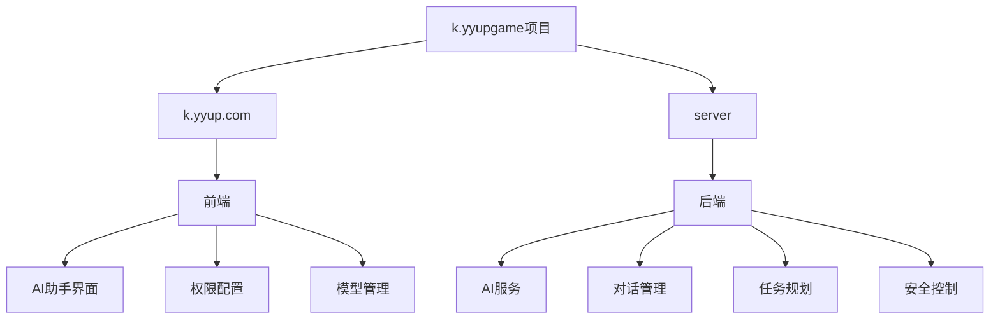
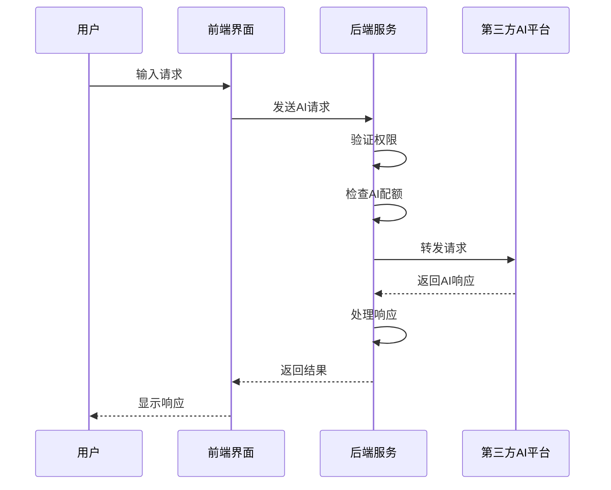
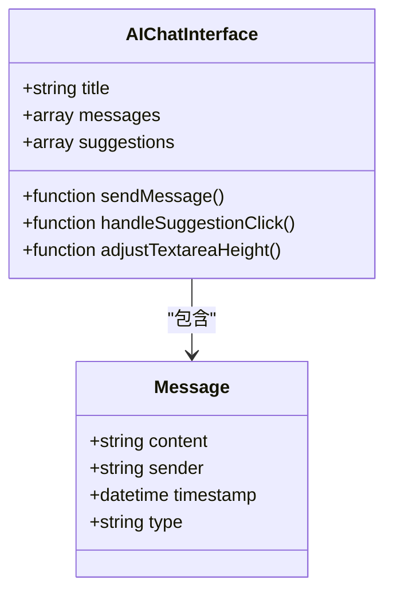
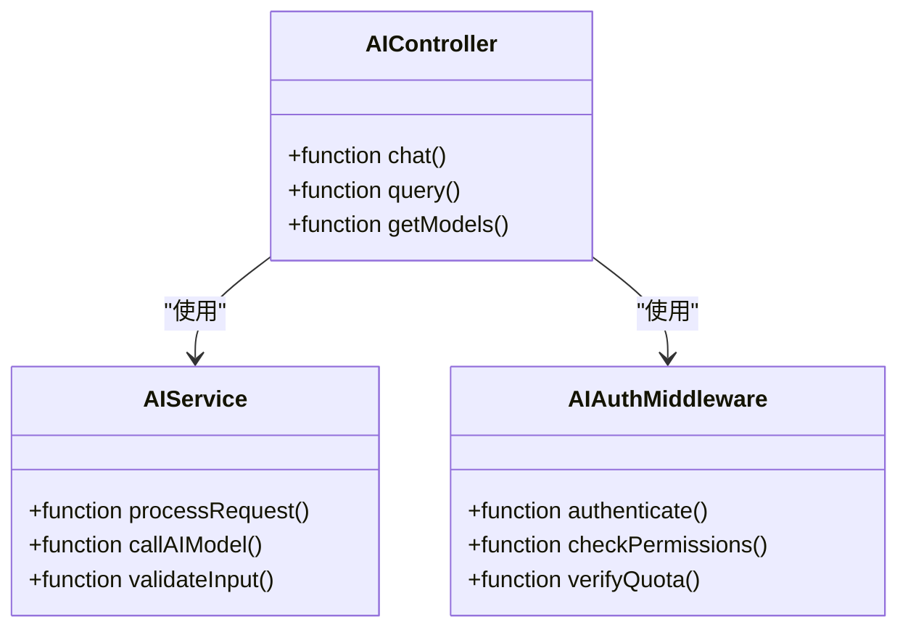
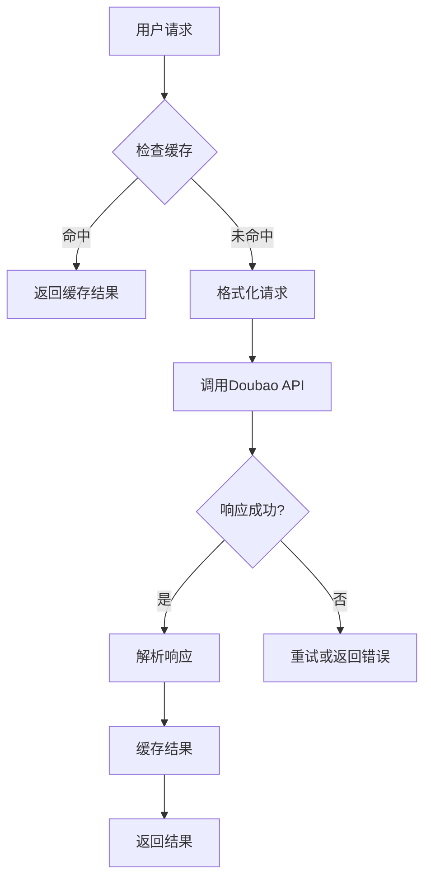
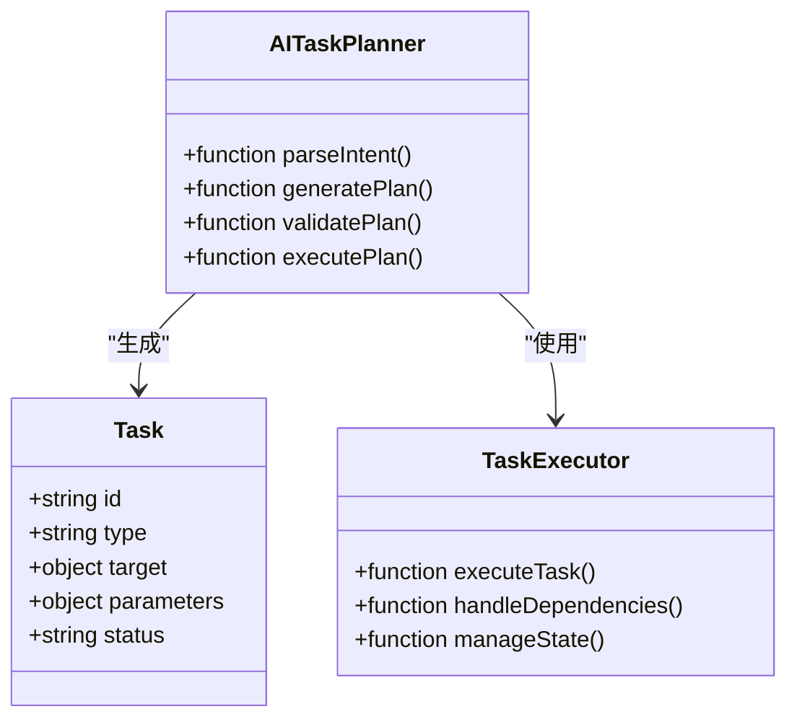
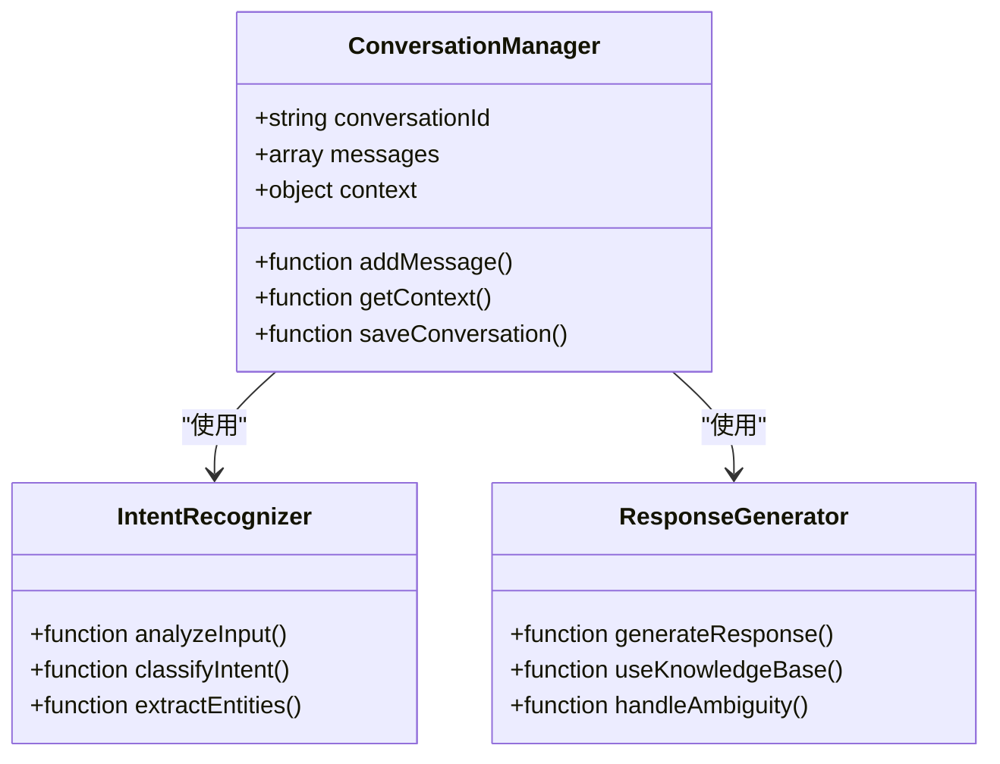
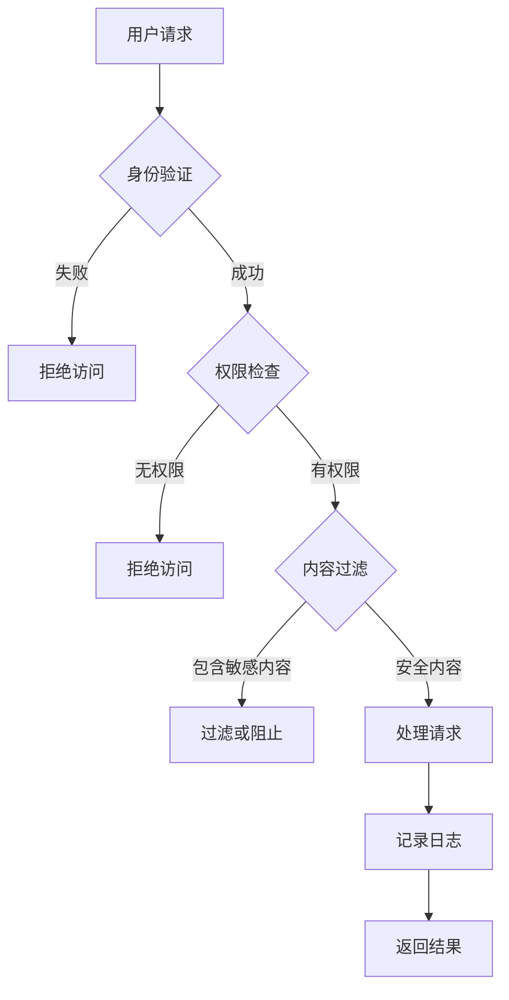
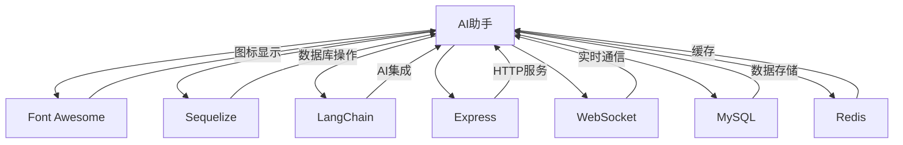

# AI助手

<cite>
**本文档引用的文件**
- [ai-assistant-simple.html](file://k.yyup.com/ai-assistant-simple.html)
- [ai-assistant-demo.html](file://k.yyup.com/ai-assistant-demo.html)
- [add-ai-assistant-permissions.sql](file://k.yyup.com/add-ai-assistant-permissions.sql)
- [add-doubao-model.js](file://k.yyup.com/add-doubao-model.js)
- [check-doubao-config.cjs](file://k.yyup.com/check-doubao-config.cjs)
- [doubao-thinking-demo.js](file://k.yyup.com/doubao-thinking-demo.js)
- [ai-chat-interface-fixed.vue](file://k.yyup.com/ai-chat-interface-fixed.vue)
- [add-ai-analytics-permissions.js](file://k.yyup.com/add-ai-analytics-permissions.js)
- [add-ai-center-docs.js](file://k.yyup.com/add-ai-center-docs.js)
- [add-customer-pool-ai-docs.js](file://k.yyup.com/add-customer-pool-ai-docs.js)
- [add-dashboard-ai-docs.js](file://k.yyup.com/add-dashboard-ai-docs.js)
- [add-ai-performance-monitor-permission.sql](file://k.yyup.com/add-ai-performance-monitor-permission.sql)
- [add-doubao-model.js](file://k.yyup.com/add-doubao-model.js)
- [setup-doubao-model.js](file://k.yyup.com/setup-doubao-model.js)
- [server/src/services/ai-service.ts](file://k.yyup.com/server/src/services/ai-service.ts)
- [server/src/controllers/ai-controller.ts](file://k.yyup.com/server/src/controllers/ai-controller.ts)
- [server/src/middleware/ai-auth.middleware.ts](file://k.yyup.com/server/src/middleware/ai-auth.middleware.ts)
- [server/src/models/ai-conversation.model.ts](file://k.yyup.com/server/src/models/ai-conversation.model.ts)
- [server/src/models/ai-message.model.ts](file://k.yyup.com/server/src/models/ai-message.model.ts)
- [server/src/models/ai-task.model.ts](file://k.yyup.com/server/src/models/ai-task.model.ts)
- [server/src/models/ai-knowledge.model.ts](file://k.yyup.com/server/src/models/ai-knowledge.model.ts)
</cite>

## 目录
1. [简介](#简介)
2. [项目结构](#项目结构)
3. [核心组件](#核心组件)
4. [架构概述](#架构概述)
5. [详细组件分析](#详细组件分析)
6. [依赖分析](#依赖分析)
7. [性能考虑](#性能考虑)
8. [故障排除指南](#故障排除指南)
9. [结论](#结论)

## 简介
本项目AI助手是k.yyupgame系统集成的智能助手功能，旨在为幼儿园管理系统提供智能化支持。AI助手通过与第三方AI平台（如Doubao）的对接，实现了智能建议、自动化操作和数据分析等核心功能。系统采用前后端分离架构，前端提供直观的交互界面，后端服务负责处理AI请求和业务逻辑。AI任务规划器能够将用户请求分解为可执行的任务序列，对话管理系统则负责维护上下文、识别意图和生成响应。系统还考虑了数据隐私保护、内容过滤和访问控制等安全因素，为开发者提供了完整的AI集成指南。

## 项目结构
项目结构清晰，主要分为前端和后端两大部分。前端位于`k.yyup.com`目录下，包含HTML、CSS和JavaScript文件，用于构建用户界面。后端位于`server`目录下，采用Node.js和TypeScript开发，包含控制器、服务、中间件和模型等组件。AI相关功能分布在多个文件中，包括权限配置、模型管理、对话界面和后端服务。

**图源**
- [ai-assistant-simple.html](file://k.yyup.com/ai-assistant-simple.html)
- [server/src/services/ai-service.ts](file://k.yyup.com/server/src/services/ai-service.ts)

**本节来源**
- [k.yyup.com](file://k.yyup.com)
- [server](file://k.yyup.com/server)

## 核心组件
AI助手的核心组件包括前端交互界面、后端AI服务、权限管理系统、模型配置模块、对话管理器和任务规划器。前端界面提供用户友好的聊天窗口和操作按钮，后端服务处理AI请求并与第三方平台通信。权限管理系统确保不同角色的用户只能访问其授权的功能，模型配置模块管理AI模型的参数和状态。对话管理器维护用户会话的上下文，任务规划器将复杂请求分解为可执行的步骤序列。

**本节来源**
- [ai-assistant-simple.html](file://k.yyup.com/ai-assistant-simple.html)
- [add-ai-assistant-permissions.sql](file://k.yyup.com/add-ai-assistant-permissions.sql)
- [add-doubao-model.js](file://k.yyup.com/add-doubao-model.js)
- [server/src/services/ai-service.ts](file://k.yyup.com/server/src/services/ai-service.ts)

## 架构概述
AI助手采用分层架构设计，从前端到后端再到第三方AI平台，形成完整的请求处理链路。前端通过WebSocket或HTTP请求与后端通信，后端服务验证用户权限后，将请求转发给配置的AI模型。AI模型处理请求并返回结果，后端服务再将结果返回给前端。系统支持多种AI模型，通过配置文件或数据库进行管理，确保灵活性和可扩展性。

**图源**
- [ai-assistant-simple.html](file://k.yyup.com/ai-assistant-simple.html)
- [server/src/controllers/ai-controller.ts](file://k.yyup.com/server/src/controllers/ai-controller.ts)
- [server/src/services/ai-service.ts](file://k.yyup.com/server/src/services/ai-service.ts)

## 详细组件分析

### 前端交互界面分析
前端交互界面采用现代化的UI设计，提供流畅的用户体验。界面包含侧边栏、聊天窗口、输入区域和建议标签。侧边栏显示AI功能和快速操作，聊天窗口展示对话历史，输入区域支持多行文本输入和自动高度调整，建议标签提供常用操作的快捷方式。

**图源**
- [ai-assistant-simple.html](file://k.yyup.com/ai-assistant-simple.html)
- [ai-chat-interface-fixed.vue](file://k.yyup.com/ai-chat-interface-fixed.vue)

### 后端服务集成分析
后端服务采用模块化设计，包含控制器、服务、中间件和模型。控制器处理HTTP请求，服务层实现业务逻辑，中间件负责权限验证和日志记录，模型定义数据结构。AI服务模块负责与第三方AI平台通信，管理API密钥和请求速率限制。

**图源**
- [server/src/controllers/ai-controller.ts](file://k.yyup.com/server/src/controllers/ai-controller.ts)
- [server/src/services/ai-service.ts](file://k.yyup.com/server/src/services/ai-service.ts)
- [server/src/middleware/ai-auth.middleware.ts](file://k.yyup.com/server/src/middleware/ai-auth.middleware.ts)

### 第三方AI平台对接分析
系统通过Doubao平台实现AI功能，对接过程包括模型配置、API密钥管理、请求格式化和响应解析。系统支持多种AI模型，通过配置文件动态加载模型参数。对接模块处理网络请求、错误重试和超时控制，确保与第三方平台的稳定通信。

**图源**
- [add-doubao-model.js](file://k.yyup.com/add-doubao-model.js)
- [setup-doubao-model.js](file://k.yyup.com/setup-doubao-model.js)
- [server/src/services/ai-service.ts](file://k.yyup.com/server/src/services/ai-service.ts)

### AI任务规划器实现机制
AI任务规划器将用户请求分解为可执行的任务序列。系统首先分析用户意图，然后根据预定义的规则或机器学习模型生成任务计划。每个任务包含操作类型、目标对象和参数，任务执行器按顺序执行任务并返回结果。

**图源**
- [server/src/models/ai-task.model.ts](file://k.yyup.com/server/src/models/ai-task.model.ts)
- [server/src/services/ai-service.ts](file://k.yyup.com/server/src/services/ai-service.ts)

### 对话管理系统运作方式
对话管理系统负责维护用户会话的上下文，包括历史消息、用户偏好和会话状态。系统使用数据库存储对话记录，支持长期记忆和上下文感知。意图识别模块分析用户输入，响应生成模块根据上下文和知识库生成合适的回复。

**图源**
- [server/src/models/ai-conversation.model.ts](file://k.yyup.com/server/src/models/ai-conversation.model.ts)
- [server/src/models/ai-message.model.ts](file://k.yyup.com/server/src/models/ai-message.model.ts)
- [server/src/services/ai-service.ts](file://k.yyup.com/server/src/services/ai-service.ts)

### AI功能安全考虑
系统在数据隐私保护、内容过滤和访问控制方面采取了多项安全措施。所有用户数据加密存储，敏感信息脱敏处理。内容过滤模块检测和阻止不当内容，访问控制基于角色和权限，确保用户只能访问授权资源。系统还实现了操作日志和审计功能，便于追踪和分析安全事件。

**图源**
- [add-ai-assistant-permissions.sql](file://k.yyup.com/add-ai-assistant-permissions.sql)
- [server/src/middleware/ai-auth.middleware.ts](file://k.yyup.com/server/src/middleware/ai-auth.middleware.ts)
- [server/src/services/ai-service.ts](file://k.yyup.com/server/src/services/ai-service.ts)

**本节来源**
- [add-ai-assistant-permissions.sql](file://k.yyup.com/add-ai-assistant-permissions.sql)
- [server/src/middleware/ai-auth.middleware.ts](file://k.yyup.com/server/src/middleware/ai-auth.middleware.ts)
- [server/src/services/ai-service.ts](file://k.yyup.com/server/src/services/ai-service.ts)

## 依赖分析
AI助手依赖多个外部库和内部模块。前端依赖Font Awesome用于图标显示，后端依赖Sequelize用于数据库操作，LangChain用于AI集成。系统内部模块之间通过清晰的接口通信，确保低耦合和高内聚。依赖关系通过package.json和import语句管理，确保版本兼容性和可维护性。

**图源**
- [package.json](file://k.yyup.com/package.json)
- [server/package.json](file://k.yyup.com/server/package.json)
- [server/src/services/ai-service.ts](file://k.yyup.com/server/src/services/ai-service.ts)

**本节来源**
- [package.json](file://k.yyup.com/package.json)
- [server/package.json](file://k.yyup.com/server/package.json)
- [server/src/services/ai-service.ts](file://k.yyup.com/server/src/services/ai-service.ts)

## 性能考虑
系统在性能方面进行了多项优化。前端采用虚拟滚动技术处理大量消息，减少DOM操作。后端使用连接池管理数据库连接，缓存常用数据减少数据库查询。AI请求采用异步处理，避免阻塞主线程。系统还实现了负载均衡和水平扩展，支持高并发场景。

**本节来源**
- [server/src/services/ai-service.ts](file://k.yyup.com/server/src/services/ai-service.ts)
- [server/src/middleware/ai-auth.middleware.ts](file://k.yyup.com/server/src/middleware/ai-auth.middleware.ts)

## 故障排除指南
常见问题包括AI响应延迟、权限错误和模型配置问题。对于响应延迟，检查网络连接和第三方AI平台状态。权限错误通常由角色配置不当引起，需检查权限分配。模型配置问题可通过重新运行配置脚本解决。系统提供了详细的日志记录，便于定位和解决问题。

**本节来源**
- [server/src/services/ai-service.ts](file://k.yyup.com/server/src/services/ai-service.ts)
- [server/src/middleware/ai-auth.middleware.ts](file://k.yyup.com/server/src/middleware/ai-auth.middleware.ts)
- [server/src/controllers/ai-controller.ts](file://k.yyup.com/server/src/controllers/ai-controller.ts)

## 结论
k.yyupgame系统的AI助手功能通过集成第三方AI平台，为幼儿园管理系统提供了强大的智能化支持。系统架构清晰，组件职责明确，安全措施完善。通过详细的文档和示例，开发者可以轻松扩展和优化AI功能，满足不断变化的业务需求。