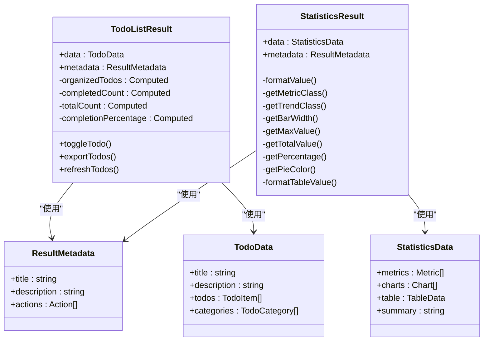

# 功能说明

<cite>
**本文档引用的文件**   
- [ai-assistant-demo.html](file://ai-assistant-demo.html)
- [MobileAiAssistant.vue](file://client/aimobile/components/MobileAiAssistant.vue)
- [ai-assistant-optimized.controller.js](file://server/dist/controllers/ai-assistant-optimized.controller.js)
- [ai-assistant-optimized.routes.js](file://server/dist/routes/ai-assistant-optimized.routes.js)
- [TodoListResult.vue](file://client/aimobile/components/results/TodoListResult.vue)
- [StatisticsResult.vue](file://client/aimobile/components/results/StatisticsResult.vue)
- [ai-assistant.ts](file://client/aimobile/stores/ai-assistant.ts)
- [mobile-api.service.ts](file://client/aimobile/services/mobile-api.service.ts)
</cite>

## 目录
1. [AI助手核心功能](#ai助手核心功能)
2. [自然语言理解与意图分析](#自然语言理解与意图分析)
3. [任务规划与子任务分解](#任务规划与子任务分解)
4. [业务场景应用实例](#业务场景应用实例)
5. [AI功能调用与响应处理](#ai功能调用与响应处理)
6. [结果展示组件渲染](#结果展示组件渲染)
7. [移动端交互模式与用户体验](#移动端交互模式与用户体验)

## AI助手核心功能

AI助手系统提供智能建议、自动化操作和数据分析等核心功能。系统通过多级分层处理机制优化性能，包含直接响应、语义查询和复杂分析三个处理级别。AI助手能够理解用户意图并生成相应的操作建议，支持语音输入、快捷操作和智能推荐等功能。系统实现了三级分层处理架构，可降低70-80%的Token消耗，通过复杂度评估服务判断查询复杂度，结合查询路由分析决定处理策略。

**Section sources**
- [ai-assistant-demo.html](file://ai-assistant-demo.html#L1-L499)
- [MobileAiAssistant.vue](file://client/aimobile/components/MobileAiAssistant.vue#L1-L800)

## 自然语言理解与意图分析

AI助手通过自然语言理解技术解析用户意图。系统采用查询路由服务分析用户查询，结合复杂度评估服务判断查询的复杂程度。当用户查询包含"现状"、"状态"、"情况"等关键词时，系统会识别为现状报表查询并直接处理。对于常规查询，系统会评估其复杂度得分、置信度和预估Token消耗，根据评估结果选择合适的处理级别。系统支持直接匹配、语义检索和复杂分析等多种处理策略，确保高效准确地响应用户请求。

**Section sources**
- [ai-assistant-optimized.controller.js](file://server/dist/controllers/ai-assistant-optimized.controller.js#L1-L863)
- [ai-assistant-optimized.routes.js](file://server/dist/routes/ai-assistant-optimized.routes.js#L1-L555)

## 任务规划与子任务分解

任务规划器能够将复杂请求分解为可执行的子任务序列。系统通过工具管理系统智能选择合适的工具，根据用户角色和权限决定是否启用工具调用。对于管理员角色，系统会智能选择最多3个相关工具；对于普通用户，仅启用网页搜索功能。任务规划器支持多种工具类型，包括数据统计、导航跳转、内容生成等，能够协调多个工具完成复杂任务。系统还实现了兜底机制，当直接查询无结果时会自动升级到复杂查询级别。

**Section sources**
- [ai-assistant-optimized.controller.js](file://server/dist/controllers/ai-assistant-optimized.controller.js#L390-L454)
- [mobile-api.service.ts](file://client/aimobile/services/mobile-api.service.ts#L1-L389)

## 业务场景应用实例

AI助手在多个具体业务场景中提供应用实例。在招生管理方面，系统支持查询招生统计、查看招生计划、管理招生申请等功能。在教学计划方面，助手可协助安排课程表、生成教学总结和提供家长沟通建议。在考勤统计方面，系统能查询学生出勤情况、生成考勤报表和提醒异常考勤。此外，AI助手还支持财务管理、活动安排、人员管理等多种业务场景，通过智能建议和快捷操作提升工作效率。

**Section sources**
- [ai-assistant-optimized.controller.js](file://server/dist/controllers/ai-assistant-optimized.controller.js#L507-L571)
- [ai-assistant-optimized.routes.js](file://server/dist/routes/ai-assistant-optimized.routes.js#L243-L386)

## AI功能调用与响应处理

系统提供标准化的API接口处理AI功能调用。前端通过元数据传递工具启用开关和用户角色信息，后端根据这些参数决定处理策略。API接口支持查询、性能统计、直接响应测试、查询路由测试等多种功能。响应数据包含处理级别、置信度、Token使用量、预估消耗等详细信息，便于监控和优化。系统还实现了错误处理和性能统计功能，记录总查询数、直接查询数、复杂查询数等关键指标。

**Section sources**
- [ai-assistant-optimized.routes.js](file://server/dist/routes/ai-assistant-optimized.routes.js#L171-L208)
- [ai-assistant-optimized.controller.js](file://server/dist/controllers/ai-assistant-optimized.controller.js#L206-L225)

## 结果展示组件渲染

不同类型的结果展示组件根据AI返回的数据进行渲染。TodoListResult组件用于展示任务清单，支持分类显示、进度跟踪和操作按钮。StatisticsResult组件用于展示统计数据，包含指标卡片、图表数据、数据表格和总结文本等元素。组件通过元数据配置标题、描述和操作按钮，支持条形图、饼图、列表等多种数据展示形式。所有结果组件均采用响应式设计，适配移动端和桌面端不同屏幕尺寸。

**Diagram sources**
- [TodoListResult.vue](file://client/aimobile/components/results/TodoListResult.vue#L1-L496)
- [StatisticsResult.vue](file://client/aimobile/components/results/StatisticsResult.vue#L1-L580)

## 移动端交互模式与用户体验

移动端AI助手采用悬浮窗模式，提供流畅的用户体验。助手支持语音输入、快捷操作和智能建议等功能，用户可通过按住说话进行语音输入，系统会实时显示声波动画。界面包含快捷操作区，提供智能搜索、今日日程、生成报告等常用功能入口。系统还实现了手势控制，用户可通过上下滑动调整助手窗口大小。整体设计遵循移动端交互规范，确保操作便捷性和界面美观性。

**Section sources**
- [MobileAiAssistant.vue](file://client/aimobile/components/MobileAiAssistant.vue#L1-L800)
- [ai-assistant.ts](file://client/aimobile/stores/ai-assistant.ts#L1-L648)