# 可视化组件

<cite>
**本文档引用文件**   
- [TodoListResult.vue](file://client/aimobile/components/results/TodoListResult.vue)
- [StatisticsResult.vue](file://client/aimobile/components/results/StatisticsResult.vue)
- [MobileAIChat.vue](file://client/aimobile/pages/MobileAIChat.vue)
- [mobile-ai.ts](file://client/aimobile/stores/mobile-ai.ts)
</cite>

## 目录
1. [引言](#引言)
2. [组件体系概述](#组件体系概述)
3. [核心可视化组件](#核心可视化组件)
4. [数据格式与响应式更新](#数据格式与响应式更新)
5. [交互功能实现](#交互功能实现)
6. [组件复用与可配置性](#组件复用与可配置性)
7. [状态管理集成](#状态管理集成)
8. [状态处理机制](#状态处理机制)
9. [总结](#总结)

## 引言
本文档深入介绍AI助手的可视化组件体系，详细说明TodoListResult、StatisticsResult等组件如何根据AI返回的数据进行动态渲染。解析各组件的数据格式要求、响应式更新机制和交互功能实现，为开发者提供全面的技术参考。

## 组件体系概述
AI助手的可视化组件体系采用模块化设计，通过Function Call机制将AI返回的数据映射到特定的可视化组件。系统根据工具调用类型动态加载相应的结果展示组件，实现数据的智能可视化。

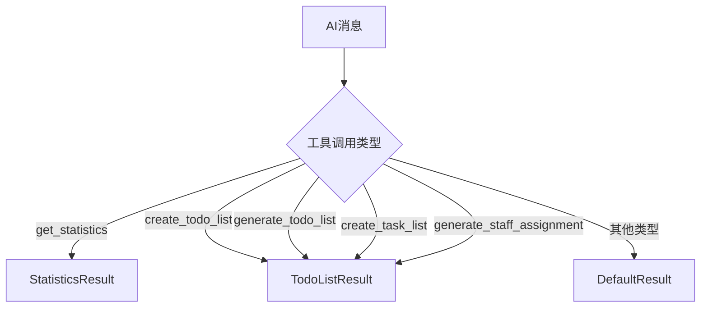

**图表来源**
- [MobileAIChat.vue](file://client/aimobile/pages/MobileAIChat.vue#L652-L664)

## 核心可视化组件

### TodoListResult组件
TodoListResult组件用于展示任务清单类的结果，支持任务分类、进度跟踪和交互操作。

**组件功能特点**：
- 支持自动分类（即时任务、短期任务、长期任务）
- 提供任务完成进度可视化
- 支持任务分配、截止日期和优先级展示
- 提供导出和刷新功能

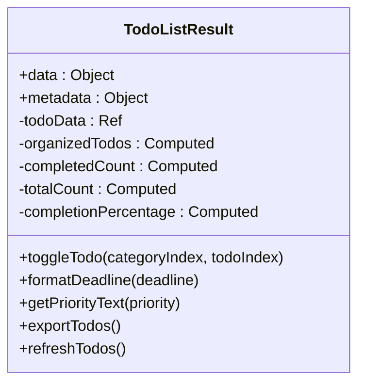

**图表来源**
- [TodoListResult.vue](file://client/aimobile/components/results/TodoListResult.vue)

### StatisticsResult组件
StatisticsResult组件用于展示统计分析结果，支持多种数据可视化形式。

**组件功能特点**：
- 数字指标卡片展示
- 支持条形图、饼图、列表等多种图表类型
- 数据表格展示
- 智能数据洞察总结
- 响应式布局适配

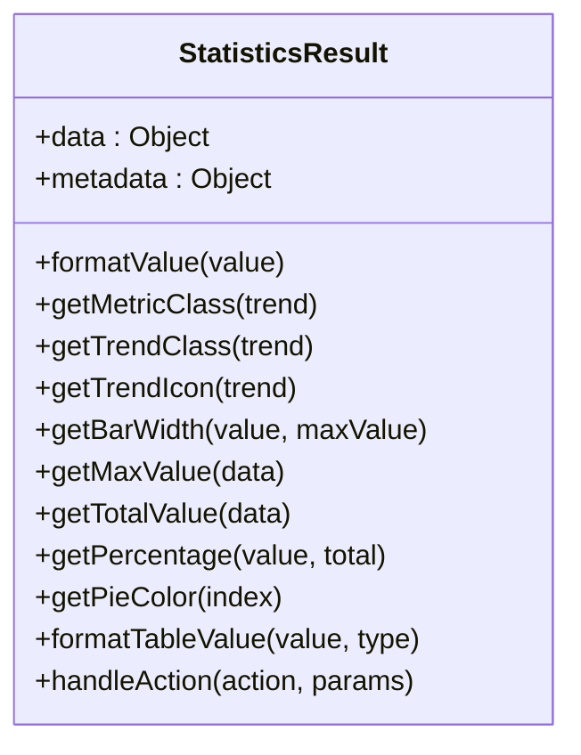

**图表来源**
- [StatisticsResult.vue](file://client/aimobile/components/results/StatisticsResult.vue)

## 数据格式与响应式更新

### 数据格式要求
各可视化组件对AI返回的数据有明确的格式要求：

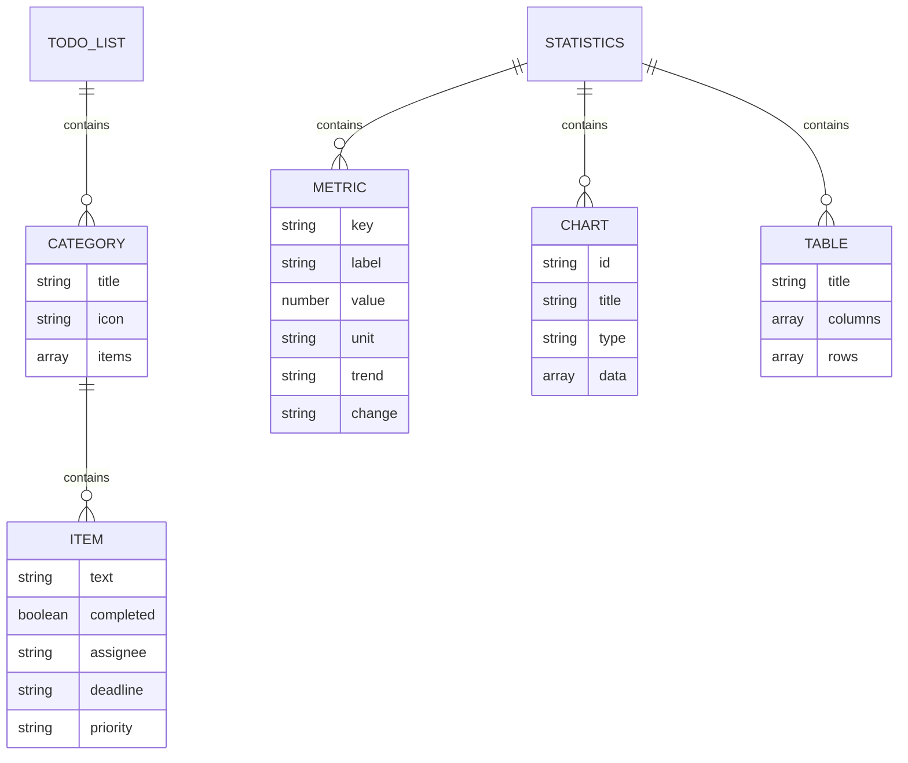

**图表来源**
- [TodoListResult.vue](file://client/aimobile/components/results/TodoListResult.vue)
- [StatisticsResult.vue](file://client/aimobile/components/results/StatisticsResult.vue)

### 响应式更新机制
组件通过Vue的响应式系统实现数据的动态更新：

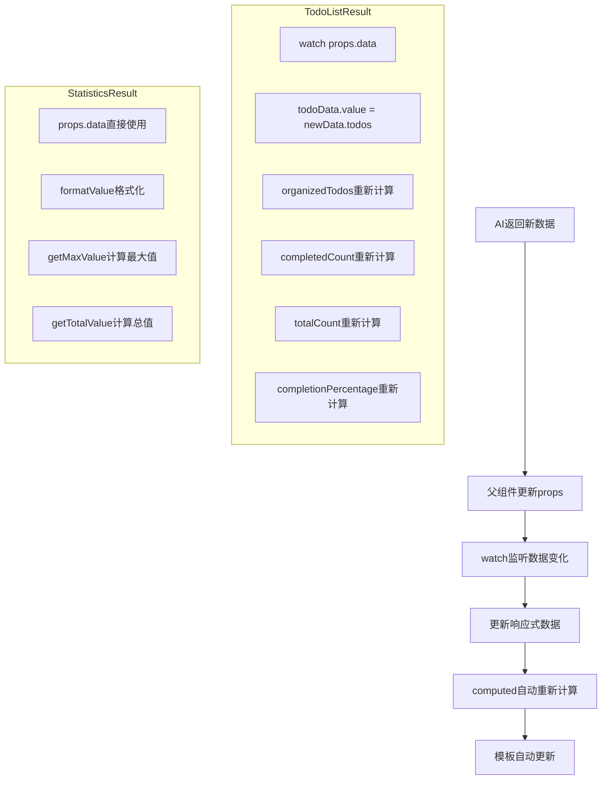

**图表来源**
- [TodoListResult.vue](file://client/aimobile/components/results/TodoListResult.vue#L224-L228)
- [StatisticsResult.vue](file://client/aimobile/components/results/StatisticsResult.vue)

## 交互功能实现

### 组件交互流程
可视化组件通过emit事件与父组件通信，实现交互功能：

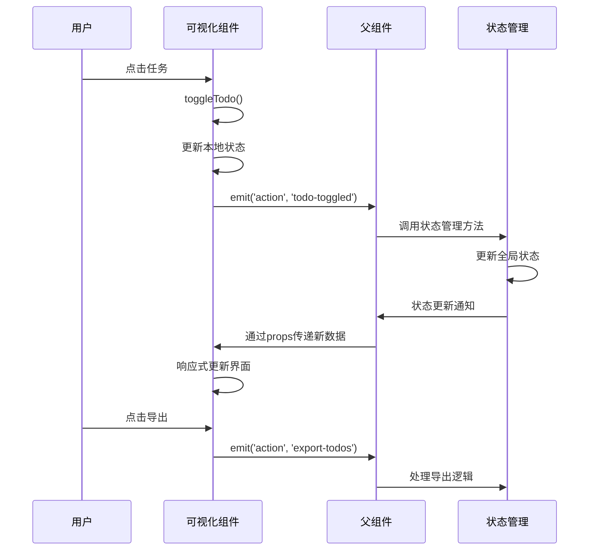

**图表来源**
- [TodoListResult.vue](file://client/aimobile/components/results/TodoListResult.vue#L161-L170)
- [MobileAIChat.vue](file://client/aimobile/pages/MobileAIChat.vue#L667-L678)

### 交互事件处理
组件定义了标准化的事件处理机制：

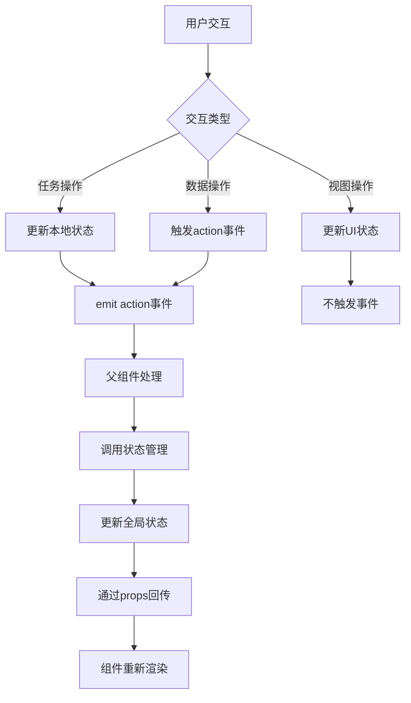

**图表来源**
- [TodoListResult.vue](file://client/aimobile/components/results/TodoListResult.vue)
- [StatisticsResult.vue](file://client/aimobile/components/results/StatisticsResult.vue)

## 组件复用与可配置性

### 复用模式设计
组件采用高内聚、低耦合的设计原则，支持多场景复用：

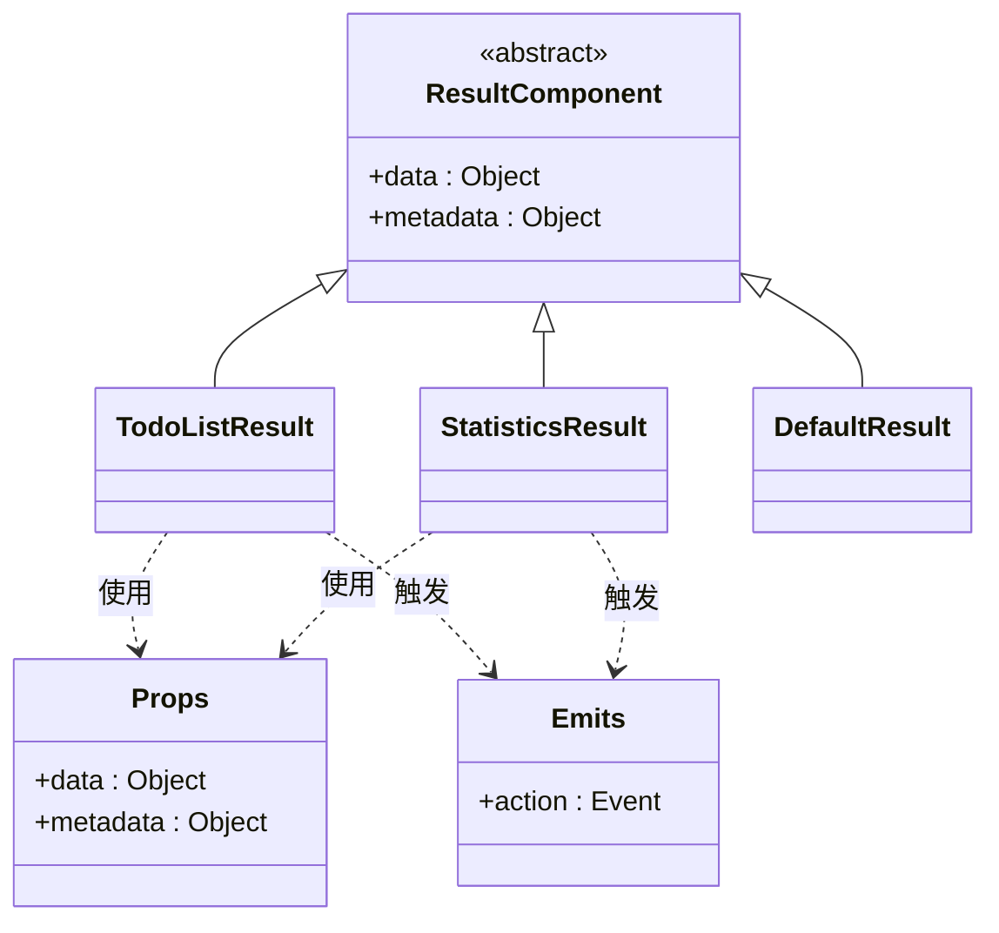

**图表来源**
- [TodoListResult.vue](file://client/aimobile/components/results/TodoListResult.vue)
- [StatisticsResult.vue](file://client/aimobile/components/results/StatisticsResult.vue)

### 可配置性设计
通过props和slots实现组件的高度可配置性：

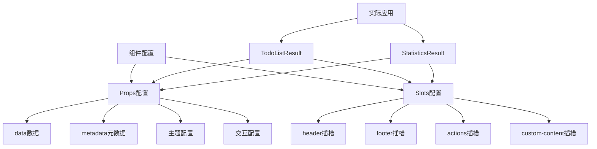

**图表来源**
- [TodoListResult.vue](file://client/aimobile/components/results/TodoListResult.vue)
- [StatisticsResult.vue](file://client/aimobile/components/results/StatisticsResult.vue)

## 状态管理集成

### mobile-ai状态管理
可视化组件与mobile-ai状态管理深度集成：

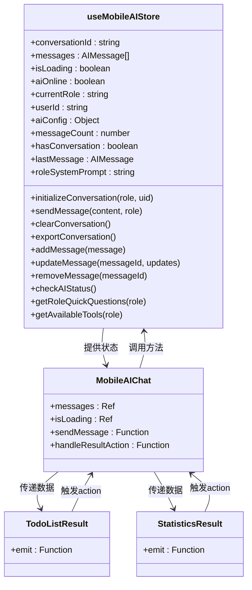

**图表来源**
- [mobile-ai.ts](file://client/aimobile/stores/mobile-ai.ts)
- [MobileAIChat.vue](file://client/aimobile/pages/MobileAIChat.vue)

### 集成代码示例
组件与状态管理的集成方式：

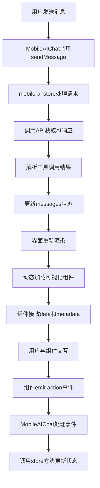

**图表来源**
- [MobileAIChat.vue](file://client/aimobile/pages/MobileAIChat.vue)
- [mobile-ai.ts](file://client/aimobile/stores/mobile-ai.ts)

## 状态处理机制

### 加载状态处理
组件对不同状态进行优雅处理：

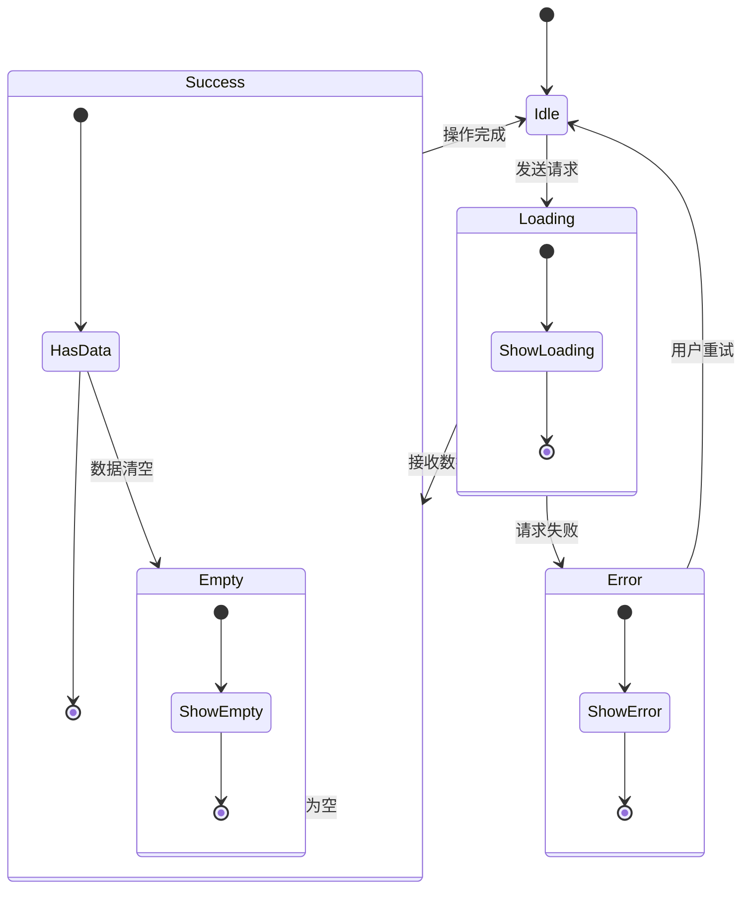

**图表来源**
- [MobileAIChat.vue](file://client/aimobile/pages/MobileAIChat.vue#L244-L262)
- [TodoListResult.vue](file://client/aimobile/components/results/TodoListResult.vue)
- [StatisticsResult.vue](file://client/aimobile/components/results/StatisticsResult.vue)

### 错误状态处理
系统对错误状态进行分层处理：

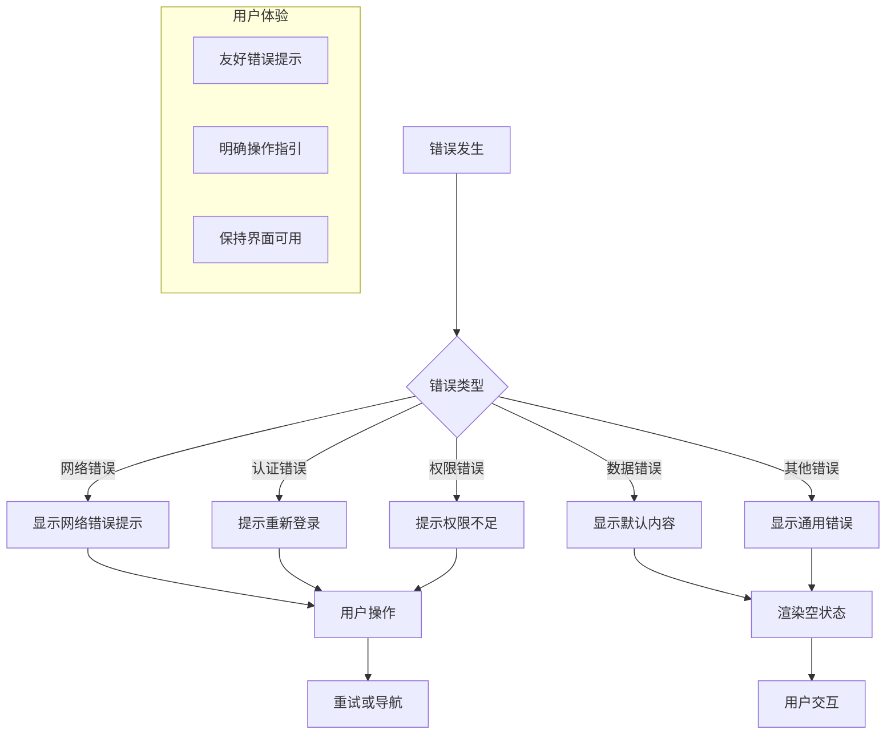

**图表来源**
- [MobileAIChat.vue](file://client/aimobile/pages/MobileAIChat.vue#L579-L799)
- [mobile-ai.ts](file://client/aimobile/stores/mobile-ai.ts#L257-L266)

## 总结
AI助手的可视化组件体系通过模块化设计、响应式更新和标准化交互，实现了高效的数据可视化。组件与mobile-ai状态管理深度集成，支持加载、错误和空数据等状态的优雅处理，为用户提供流畅的交互体验。通过props和slots的可配置性设计，组件能够在不同场景下灵活复用，满足多样化的业务需求。