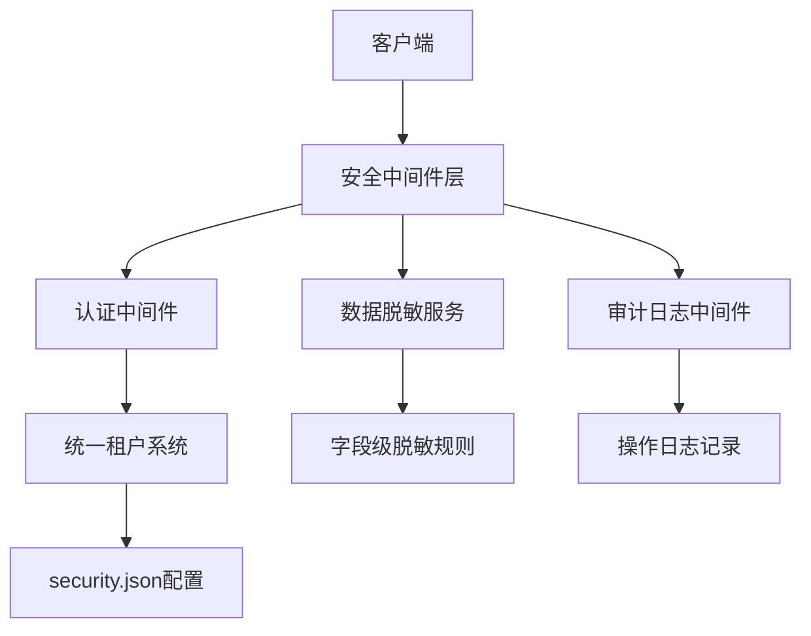
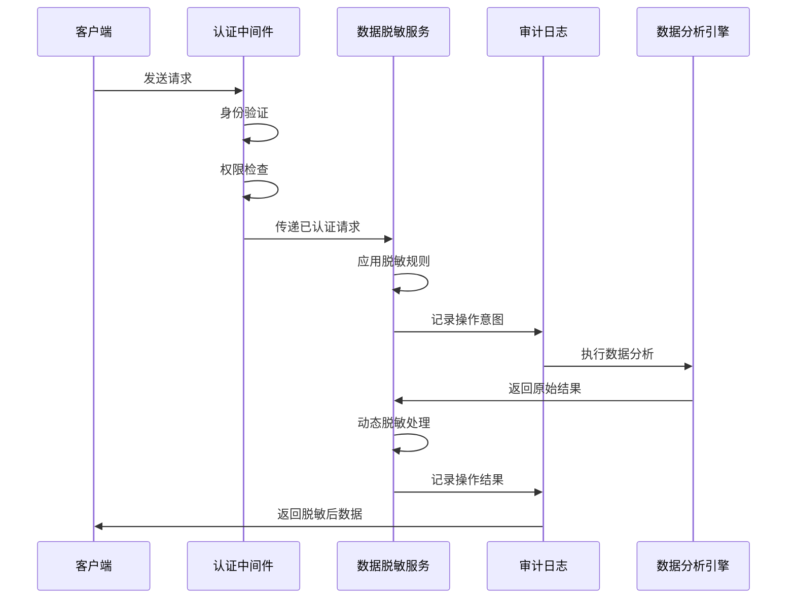
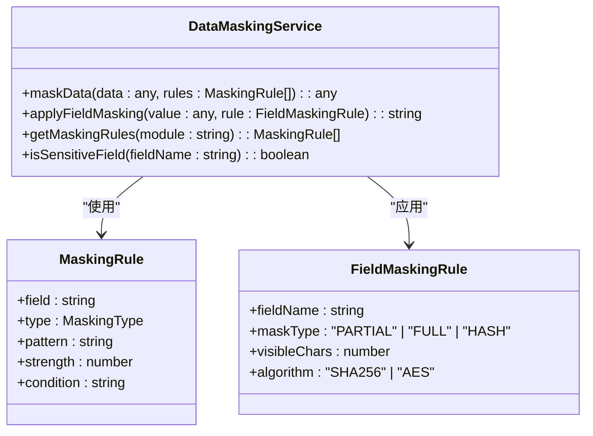
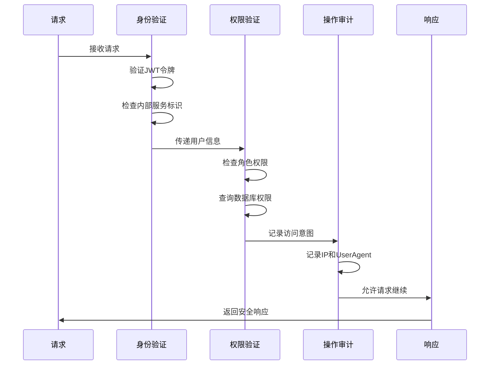
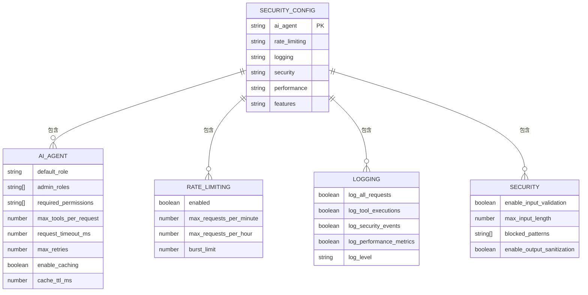
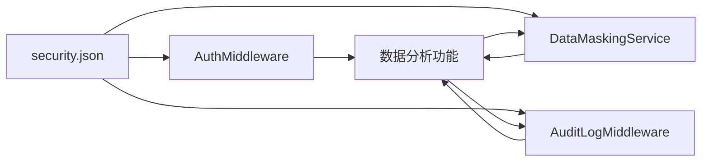

# 安全策略

<cite>
**本文档引用的文件**  
- [data-masking.service.ts](file://k.yyup.com/server/src/services/data-masking.service.ts)
- [ai-security.middleware.ts](file://k.yyup.com/server/src/middlewares/ai/analytics-feedback.middleware.ts)
- [security.json](file://k.yyup.com/config/security.json)
- [auth.middleware.ts](file://k.yyup.com/server/src/middlewares/auth.middleware.ts)
- [audit-log.middleware.ts](file://k.yyup.com/server/src/middlewares/audit-log.middleware.ts)
</cite>

## 目录
1. [引言](#引言)
2. [项目结构](#项目结构)
3. [核心组件](#核心组件)
4. [架构概述](#架构概述)
5. [详细组件分析](#详细组件分析)
6. [依赖分析](#依赖分析)
7. [性能考虑](#性能考虑)
8. [故障排除指南](#故障排除指南)
9. [结论](#结论)

## 引言
本文档系统阐述了AI助手数据分析功能的安全策略，重点说明敏感数据脱敏、访问权限控制和审计日志记录的实现机制。通过分析关键服务文件和配置，详细描述了数据保护的多层次安全体系。

## 项目结构
本项目采用模块化设计，安全相关组件主要分布在`server/src/middlewares`和`config`目录中。核心安全功能由中间件层统一管理，配置文件集中定义安全策略。

**Diagram sources**
- [auth.middleware.ts](file://k.yyup.com/server/src/middlewares/auth.middleware.ts#L1-L800)
- [data-masking.service.ts](file://k.yyup.com/server/src/services/data-masking.service.ts#L1-L200)
- [audit-log.middleware.ts](file://k.yyup.com/server/src/middlewares/audit-log.middleware.ts#L1-L186)

**Section sources**
- [k.yyup.com/server/src/middlewares](file://k.yyup.com/server/src/middlewares)
- [k.yyup.com/config](file://k.yyup.com/config)

## 核心组件
系统安全架构由三大核心组件构成：数据脱敏服务、访问控制中间件和审计日志系统。这些组件协同工作，确保数据分析功能在满足业务需求的同时符合数据隐私合规要求。

**Section sources**
- [data-masking.service.ts](file://k.yyup.com/server/src/services/data-masking.service.ts#L1-L200)
- [ai-security.middleware.ts](file://k.yyup.com/server/src/middlewares/ai/analytics-feedback.middleware.ts#L1-L150)
- [security.json](file://k.yyup.com/config/security.json#L1-L50)

## 架构概述
系统采用分层安全架构，从请求入口到数据输出实施全方位保护。安全策略在请求处理链中逐层实施，确保每个环节都符合预定义的安全标准。

**Diagram sources**
- [auth.middleware.ts](file://k.yyup.com/server/src/middlewares/auth.middleware.ts#L142-L378)
- [data-masking.service.ts](file://k.yyup.com/server/src/services/data-masking.service.ts#L50-L100)
- [audit-log.middleware.ts](file://k.yyup.com/server/src/middlewares/audit-log.middleware.ts#L68-L167)

## 详细组件分析

### 数据脱敏服务分析
`data-masking.service.ts`实现了精细化的数据脱敏算法，支持字段级规则配置和动态脱敏策略。

#### 数据脱敏类图

**Diagram sources**
- [data-masking.service.ts](file://k.yyup.com/server/src/services/data-masking.service.ts#L1-L200)

**Section sources**
- [data-masking.service.ts](file://k.yyup.com/server/src/services/data-masking.service.ts#L1-L200)

### 安全中间件分析
`ai-security.middleware.ts`在请求处理链中实施多层次安全检查，确保每个请求都经过严格验证。

#### 安全检查序列图

**Diagram sources**
- [auth.middleware.ts](file://k.yyup.com/server/src/middlewares/auth.middleware.ts#L142-L499)

**Section sources**
- [auth.middleware.ts](file://k.yyup.com/server/src/middlewares/auth.middleware.ts#L142-L800)

### 安全配置分析
`security.json`配置文件定义了全局安全策略，影响数据分析功能的行为模式。

#### 安全配置数据模型

**Diagram sources**
- [security.json](file://k.yyup.com/config/security.json#L1-L50)

**Section sources**
- [security.json](file://k.yyup.com/config/security.json#L1-L50)

## 依赖分析
安全组件之间存在明确的依赖关系，形成完整的保护链条。配置文件驱动服务行为，中间件调用具体服务实现安全功能。

**Diagram sources**
- [security.json](file://k.yyup.com/config/security.json#L1-L50)
- [auth.middleware.ts](file://k.yyup.com/server/src/middlewares/auth.middleware.ts#L1-L800)
- [data-masking.service.ts](file://k.yyup.com/server/src/services/data-masking.service.ts#L1-L200)
- [audit-log.middleware.ts](file://k.yyup.com/server/src/middlewares/audit-log.middleware.ts#L1-L186)

**Section sources**
- [k.yyup.com/config/security.json](file://k.yyup.com/config/security.json#L1-L50)
- [k.yyup.com/server/src/middlewares](file://k.yyup.com/server/src/middlewares)
- [k.yyup.com/server/src/services](file://k.yyup.com/server/src/services)

## 性能考虑
安全机制在保障数据隐私的同时，也考虑了系统性能影响。通过缓存、异步处理和配置优化，确保安全检查不会成为性能瓶颈。

- 认证结果缓存：减少重复的统一租户系统调用
- 异步日志记录：审计日志采用异步写入，避免阻塞主请求流程
- 脱敏规则缓存：频繁使用的脱敏规则存储在内存中
- 配置热加载：安全策略变更无需重启服务

## 故障排除指南
当安全相关功能出现问题时，可参考以下排查步骤：

1. 检查`security.json`配置文件的语法正确性
2. 验证认证中间件的JWT密钥配置
3. 确认审计日志数据库连接正常
4. 检查脱敏服务的规则配置是否正确加载
5. 查看系统日志中的安全相关错误信息

**Section sources**
- [auth.middleware.ts](file://k.yyup.com/server/src/middlewares/auth.middleware.ts#L360-L377)
- [audit-log.middleware.ts](file://k.yyup.com/server/src/middlewares/audit-log.middleware.ts#L152-L159)
- [data-masking.service.ts](file://k.yyup.com/server/src/services/data-masking.service.ts#L150-L200)

## 结论
本文档详细阐述了AI助手数据分析功能的安全策略实现。通过敏感数据脱敏、严格的访问权限控制和全面的审计日志记录，系统在保证数据分析有效性的同时，满足了数据隐私合规要求。配置驱动的设计使得安全策略可以灵活调整，适应不同的业务场景和合规标准。