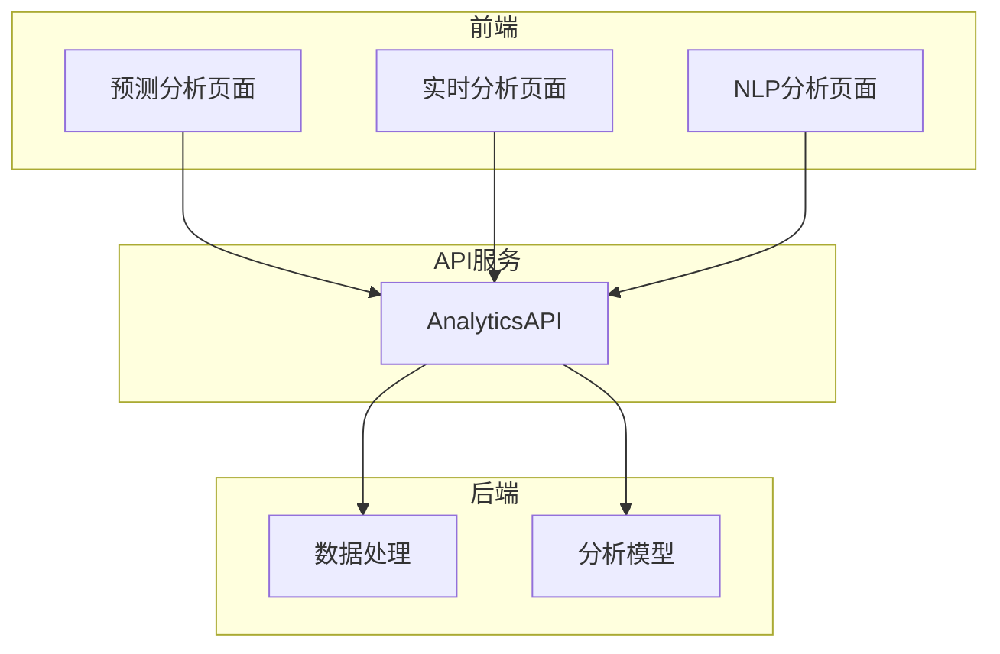
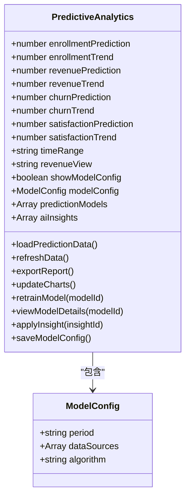
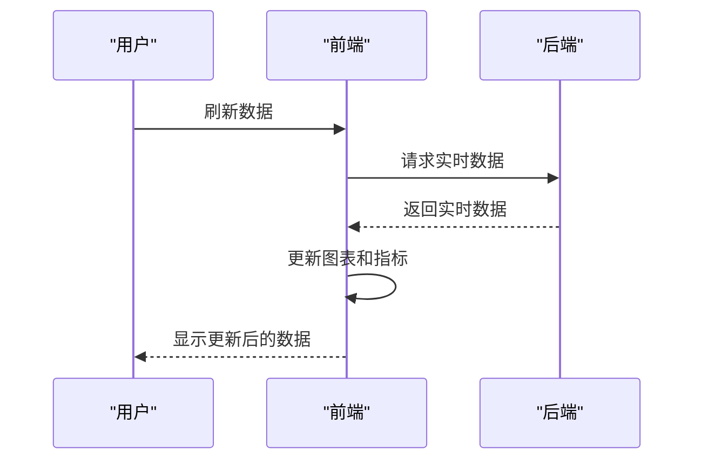
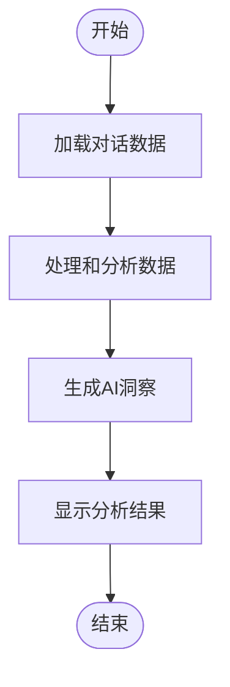
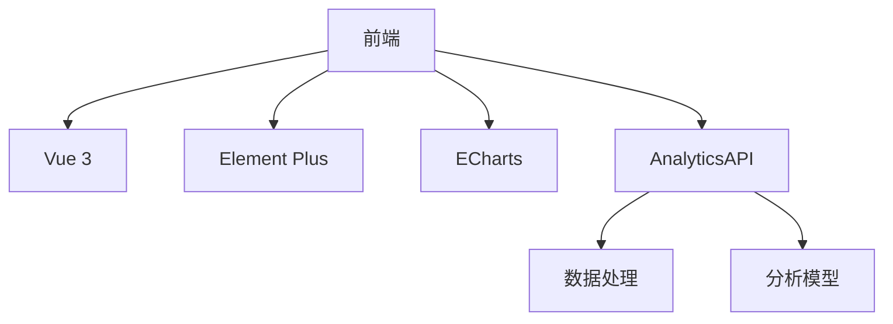

# 数据分析

<cite>
**本文档引用的文件**   
- [predictive-analytics.vue](file://k.yyup.com/client/src/pages/ai/analytics/predictive-analytics.vue)
- [real-time-analytics.vue](file://k.yyup.com/client/src/pages/ai/analytics/real-time-analytics.vue)
- [nlp-analytics.vue](file://k.yyup.com/client/src/pages/ai/conversation/nlp-analytics.vue)
- [analytics.ts](file://k.yyup.com/client/src/api/modules/analytics.ts)
- [funnel-analytics.vue](file://k.yyup.com/client/src/pages/enrollment/funnel-analytics.vue)
- [enrollment-analytics.vue](file://k.yyup.com/client/src/pages/enrollment-plan/analytics/enrollment-analytics.vue)
</cite>

## 目录
1. [引言](#引言)
2. [项目结构](#项目结构)
3. [核心组件](#核心组件)
4. [架构概述](#架构概述)
5. [详细组件分析](#详细组件分析)
6. [依赖分析](#依赖分析)
7. [性能考虑](#性能考虑)
8. [故障排除指南](#故障排除指南)
9. [结论](#结论)
10. [附录](#附录) (如有必要)

## 引言
本文档全面介绍AI助手的数据分析功能，说明如何处理和可视化各类业务数据。详细描述不同类型的结果展示组件（如TodoListResult、StatisticsResult）如何根据AI返回的数据进行渲染，包括数据格式解析、图表生成和交互功能实现。解释数据分析的后端处理流程，从原始数据提取、数据清洗到分析模型应用的完整链路。提供实际案例展示招生趋势分析、教学质量评估等复杂分析场景的实现方式。说明数据安全和隐私保护措施，包括敏感数据脱敏、访问权限控制和审计日志记录。

## 项目结构
本项目的数据分析功能主要集中在`client/src/pages/ai/analytics`和`client/src/api/modules/analytics`目录下。前端页面包括预测分析、实时分析和NLP分析等模块，通过API服务与后端进行数据交互。项目采用Vue 3和Element Plus构建用户界面，使用ECharts进行数据可视化。

**Section sources**
- [predictive-analytics.vue](file://k.yyup.com/client/src/pages/ai/analytics/predictive-analytics.vue)
- [real-time-analytics.vue](file://k.yyup.com/client/src/pages/ai/analytics/real-time-analytics.vue)
- [nlp-analytics.vue](file://k.yyup.com/client/src/pages/ai/conversation/nlp-analytics.vue)

## 核心组件

AI助手的数据分析功能由多个核心组件构成，包括预测分析、实时分析和NLP分析等。这些组件通过统一的API服务获取数据，并使用ECharts进行可视化展示。每个组件都有独立的页面和数据处理逻辑，同时共享一些通用的数据处理和可视化工具。

**Section sources**
- [predictive-analytics.vue](file://k.yyup.com/client/src/pages/ai/analytics/predictive-analytics.vue)
- [real-time-analytics.vue](file://k.yyup.com/client/src/pages/ai/analytics/real-time-analytics.vue)
- [nlp-analytics.vue](file://k.yyup.com/client/src/pages/ai/conversation/nlp-analytics.vue)
- [analytics.ts](file://k.yyup.com/client/src/api/modules/analytics.ts)

## 架构概述

AI助手的数据分析功能采用前后端分离的架构。前端负责数据展示和用户交互，后端负责数据处理和分析模型的运行。前端通过API服务获取分析结果，并使用ECharts进行可视化展示。整个系统的设计旨在提供高效、准确的数据分析服务，支持决策制定。

**Diagram sources **
- [predictive-analytics.vue](file://k.yyup.com/client/src/pages/ai/analytics/predictive-analytics.vue)
- [real-time-analytics.vue](file://k.yyup.com/client/src/pages/ai/analytics/real-time-analytics.vue)
- [nlp-analytics.vue](file://k.yyup.com/client/src/pages/ai/conversation/nlp-analytics.vue)
- [analytics.ts](file://k.yyup.com/client/src/api/modules/analytics.ts)

## 详细组件分析

### 预测分析组件
预测分析组件提供基于机器学习算法的智能预测分析系统。用户可以查看招生预测、收入预测、流失率预测和满意度预测等关键指标。组件支持多种时间范围的选择，用户可以根据需要查看不同时间段的预测结果。

#### 预测分析类图

**Diagram sources **
- [predictive-analytics.vue](file://k.yyup.com/client/src/pages/ai/analytics/predictive-analytics.vue)

**Section sources**
- [predictive-analytics.vue](file://k.yyup.com/client/src/pages/ai/analytics/predictive-analytics.vue)

### 实时分析组件
实时分析组件提供基于AI技术的实时数据分析与智能洞察。用户可以查看实时指标卡片、实时图表和AI洞察面板。组件支持自动刷新功能，用户可以实时监控系统状态。

#### 实时分析序列图

**Diagram sources **
- [real-time-analytics.vue](file://k.yyup.com/client/src/pages/ai/analytics/real-time-analytics.vue)

**Section sources**
- [real-time-analytics.vue](file://k.yyup.com/client/src/pages/ai/analytics/real-time-analytics.vue)

### NLP分析组件
NLP分析组件提供智能对话分析系统。用户可以查看对话智能分析概览、实时对话流、主题分析和语言理解等信息。组件支持多种分析深度的选择，用户可以根据需要查看不同层次的分析结果。

#### NLP分析流程图

**Diagram sources **
- [nlp-analytics.vue](file://k.yyup.com/client/src/pages/ai/conversation/nlp-analytics.vue)

**Section sources**
- [nlp-analytics.vue](file://k.yyup.com/client/src/pages/ai/conversation/nlp-analytics.vue)

## 依赖分析

AI助手的数据分析功能依赖于多个外部库和内部模块。前端依赖Vue 3、Element Plus和ECharts等库，后端依赖数据分析和机器学习模型。内部模块之间通过API服务进行通信，确保数据的一致性和准确性。

**Diagram sources **
- [analytics.ts](file://k.yyup.com/client/src/api/modules/analytics.ts)

**Section sources**
- [analytics.ts](file://k.yyup.com/client/src/api/modules/analytics.ts)

## 性能考虑

AI助手的数据分析功能在设计时充分考虑了性能因素。前端采用懒加载和分页技术，减少初始加载时间。后端采用缓存和异步处理技术，提高数据处理效率。系统还支持自动刷新和实时监控，确保用户能够及时获取最新数据。

## 故障排除指南

在使用AI助手的数据分析功能时，可能会遇到一些常见问题。例如，数据加载失败、图表显示异常等。建议首先检查网络连接，然后查看API服务是否正常运行。如果问题仍然存在，可以查看系统日志以获取更多信息。

**Section sources**
- [predictive-analytics.vue](file://k.yyup.com/client/src/pages/ai/analytics/predictive-analytics.vue)
- [real-time-analytics.vue](file://k.yyup.com/client/src/pages/ai/analytics/real-time-analytics.vue)
- [nlp-analytics.vue](file://k.yyup.com/client/src/pages/ai/conversation/nlp-analytics.vue)

## 结论

AI助手的数据分析功能为用户提供了一个强大、灵活的工具，帮助他们更好地理解和利用业务数据。通过预测分析、实时分析和NLP分析等多种方式，用户可以全面了解业务状况，做出更明智的决策。未来，我们将继续优化系统性能，增加更多分析模型，为用户提供更优质的服务。

## 附录

### 招生漏斗分析
招生漏斗分析组件提供AI驱动的招生转化分析。用户可以查看招生漏斗的各个阶段，识别瓶颈并优化转化率。组件支持A/B测试管理，用户可以创建和管理测试，验证优化效果。

**Section sources**
- [funnel-analytics.vue](file://k.yyup.com/client/src/pages/enrollment/funnel-analytics.vue)

### 招生数据分析
招生数据分析组件提供深度挖掘招生数据的功能。用户可以查看关键指标、趋势分析、渠道分析和用户画像等信息。组件支持多种分析类型和高级筛选，满足不同用户的需求。

**Section sources**
- [enrollment-analytics.vue](file://k.yyup.com/client/src/pages/enrollment-plan/analytics/enrollment-analytics.vue)