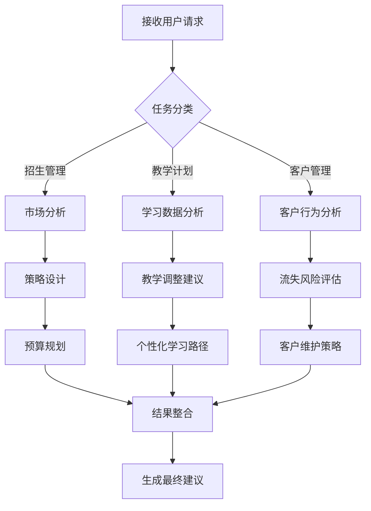

# 业务应用

<cite>
**本文档引用的文件**
- [ai-task-planner.service.ts](file://k.yyup.com/client/aimobile/services/ai-task-planner.service.ts)
- [ai-assistant.ts](file://k.yyup.com/client/aimobile/stores/ai-assistant.ts)
- [mobile-workflow-engine.service.ts](file://k.yyup.com/client/aimobile/services/mobile-workflow-engine.service.ts)
- [mobile-api.service.ts](file://k.yyup.com/client/aimobile/services/mobile-api.service.ts)
- [generate-template-recommendations.js](file://k.yyup.com/server/scripts/generate-template-recommendations.js)
</cite>

## 目录
1. [招生管理场景中的智能建议](#招生管理场景中的智能建议)
2. [教学计划场景中的智能建议](#教学计划场景中的智能建议)
3. [客户管理场景中的智能建议](#客户管理场景中的智能建议)
4. [建议生成的业务逻辑与决策依据](#建议生成的业务逻辑与决策依据)
5. [反馈机制与建议质量优化](#反馈机制与建议质量优化)

## 招生管理场景中的智能建议

在招生管理场景中，AI系统通过分析历史招生数据、市场趋势和资源配置，生成全面的招生策略建议。系统首先调用市场分析专家对当前招生环境进行评估，识别潜在的目标人群特征，包括地理位置、家庭背景和教育需求偏好。基于分析结果，AI进一步设计招生策略，涵盖宣传渠道选择、预算分配和时间节点规划。

在预算规划阶段，成本分析专家会根据历史数据和当前市场行情，提供详细的预算分配建议，确保资源高效利用。同时，内容创作工具会根据策略生成相应的宣传材料，如海报和推广文案，确保信息传递的一致性和吸引力。整个流程通过任务规划器进行协调，确保各环节紧密衔接，形成闭环管理。

**Section sources**
- [ai-task-planner.service.ts](file://k.yyup.com/client/aimobile/services/ai-task-planner.service.ts#L274-L337)
- [mobile-api.service.ts](file://k.yyup.com/client/aimobile/services/mobile-api.service.ts#L41-L94)

## 教学计划场景中的智能建议

在教学计划场景中，AI系统通过分析课程进度、学生表现和教学资源，生成个性化的教学调整建议。系统首先收集学生的学习数据，包括作业完成情况、测试成绩和课堂参与度，通过数据分析专家识别学习难点和知识盲点。基于这些洞察，AI会建议教师调整教学节奏，增加针对性辅导或引入新的教学方法。

此外，AI还能根据学生的兴趣和能力，推荐个性化的学习路径和拓展资源，促进差异化教学。当检测到学生整体表现下滑时，系统会建议开展专题复习或组织小组讨论，以提升学习效果。所有建议均基于实际教学数据，确保科学性和可操作性。

**Section sources**
- [ai-task-planner.service.ts](file://k.yyup.com/client/aimobile/services/ai-task-planner.service.ts#L274-L337)
- [mobile-workflow-engine.service.ts](file://k.yyup.com/client/aimobile/services/mobile-workflow-engine.service.ts#L317-L363)

## 客户管理场景中的智能建议

在客户管理场景中，AI系统通过分析客户互动数据和行为模式，识别潜在的流失风险，并建议相应的客户维护策略。系统会监控客户的关键指标，如参与度、反馈频率和满意度评分，当发现异常波动时，自动触发风险评估流程。

基于评估结果，AI会建议采取具体的维护措施，如发送个性化关怀消息、提供专属优惠或安排专人回访。对于高价值客户，系统还会建议开展深度沟通，了解其核心需求，从而制定长期合作方案。这些建议旨在提升客户满意度和忠诚度，降低流失率。

**Section sources**
- [ai-task-planner.service.ts](file://k.yyup.com/client/aimobile/services/ai-task-planner.service.ts#L274-L337)
- [ai-assistant.ts](file://k.yyup.com/client/aimobile/stores/ai-assistant.ts#L300-L357)

## 建议生成的业务逻辑与决策依据

智能建议的生成遵循严格的业务逻辑和决策流程。系统首先接收用户请求，通过任务分类器识别任务类型，如招生策略、教学调整或客户维护。随后，需求分析模块提取关键参数，包括时间范围、预算限制和预期目标。

基于任务类型和需求参数，系统生成执行计划，包含多个有序步骤，如数据分析、专家咨询和结果整合。每个步骤由特定的智能体或工具执行，确保专业性和准确性。最终，系统整合所有步骤的结果，生成综合建议，并通过移动端API服务返回给用户。

**Diagram sources**
- [ai-task-planner.service.ts](file://k.yyup.com/client/aimobile/services/ai-task-planner.service.ts#L109-L158)
- [mobile-api.service.ts](file://k.yyup.com/client/aimobile/services/mobile-api.service.ts#L41-L94)

**Section sources**
- [ai-task-planner.service.ts](file://k.yyup.com/client/aimobile/services/ai-task-planner.service.ts#L109-L158)
- [mobile-api.service.ts](file://k.yyup.com/client/aimobile/services/mobile-api.service.ts#L41-L94)

## 反馈机制与建议质量优化

系统通过闭环反馈机制持续优化建议质量。每次建议执行后，系统会收集用户反馈和实际效果数据，用于评估建议的有效性。这些数据被存储在本地缓存中，作为后续任务的历史参考。

当用户对某些建议提出修改意见时，系统会记录这些反馈，并在下次生成类似建议时加以考虑。此外，任务规划器会定期回顾执行历史，识别常见问题和改进点，自动调整执行策略。通过这种方式，系统能够不断学习和进化，提供越来越精准和实用的建议。

**Section sources**
- [ai-task-planner.service.ts](file://k.yyup.com/client/aimobile/services/ai-task-planner.service.ts#L698-L719)
- [ai-assistant.ts](file://k.yyup.com/client/aimobile/stores/ai-assistant.ts#L538-L552)