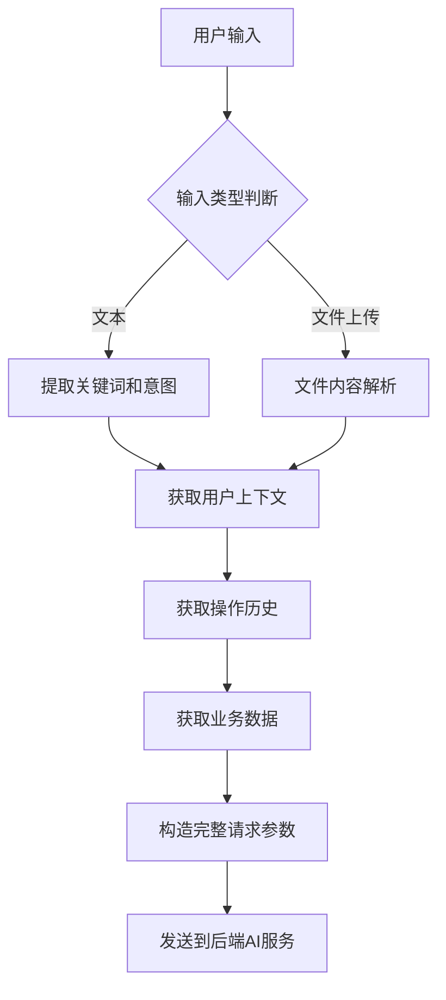
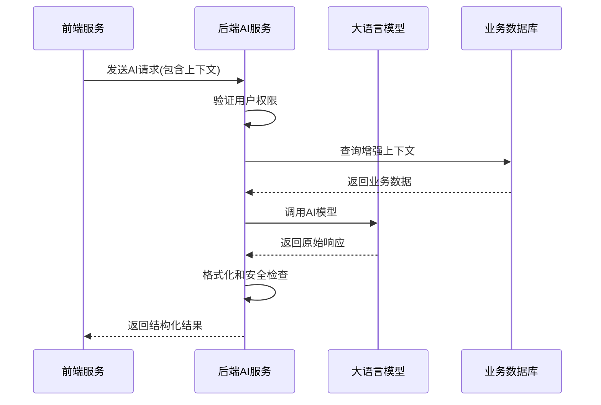
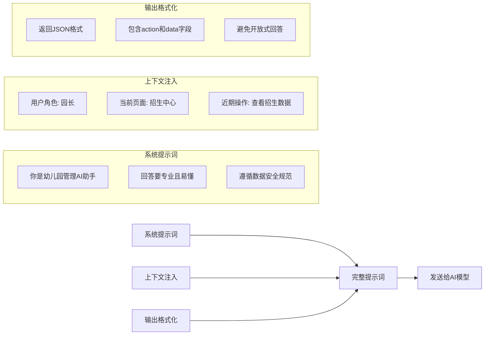
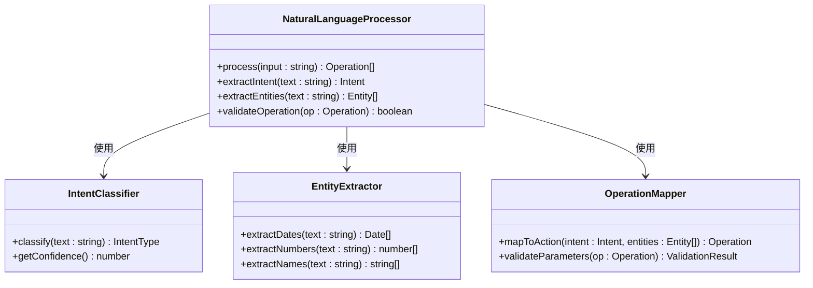
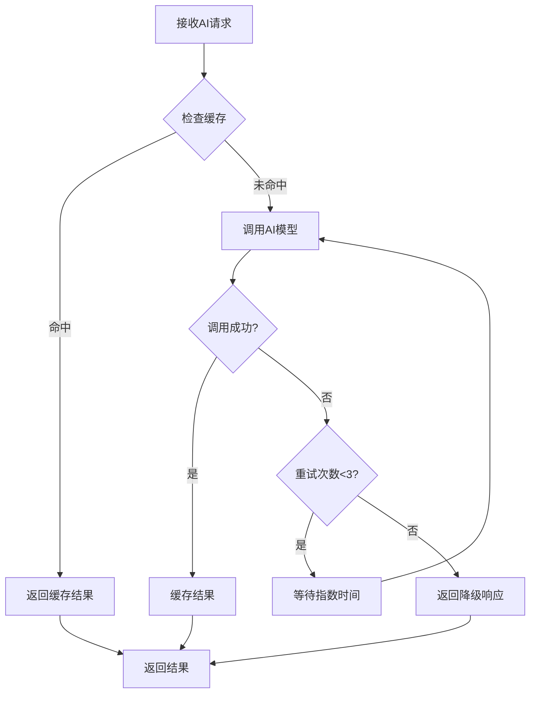
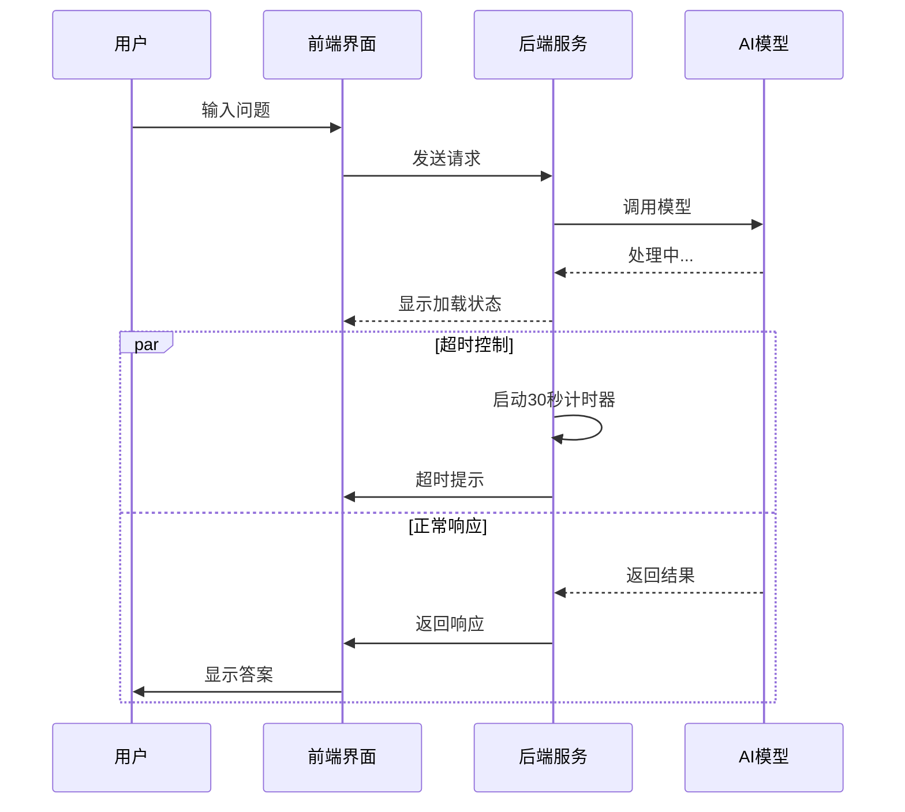

# 技术实现

<cite>
**本文档引用的文件**
- [ai-chat-interface-fixed.vue](file://k.yyup.com/ai-chat-interface-fixed.vue)
- [add-ai-assistant-permissions.sql](file://k.yyup.com/add-ai-assistant-permissions.sql)
- [ai-assistant-simple.html](file://k.yyup.com/ai-assistant-simple.html)
- [ai-assistant-demo.html](file://k.yyup.com/ai-assistant-demo.html)
- [ai.ts](file://k.yyup.com/client/src/api/ai.ts)
- [ai-conversation.controller.ts](file://k.yyup.com/server/coverage/lcov-report/src/controllers/ai-conversation.controller.ts.html)
- [ai-query.controller.ts](file://k.yyup.com/server/coverage/lcov-report/src/controllers/ai-query.controller.ts.html)
- [ai-bridge.controller.ts](file://k.yyup.com/server/coverage/lcov-report/src/controllers/ai-bridge.controller.ts.html)
- [ai-cache.controller.ts](file://k.yyup.com/server/coverage/lcov-report/src/controllers/ai-cache.controller.ts.html)
- [ai-model-config.ts](file://k.yyup.com/client/src/api/ai-model-config.ts)
</cite>

## 目录
1. [引言](#引言)
2. [前端服务请求构造](#前端服务请求构造)
3. [后端AI操作员服务处理](#后端ai操作员服务处理)
4. [提示词工程设计原理](#提示词工程设计原理)
5. [自然语言理解模块](#自然语言理解模块)
6. [响应缓存与错误重试机制](#响应缓存与错误重试机制)
7. [完整调用链路分析](#完整调用链路分析)
8. [结论](#结论)

## 引言

本文档深入解析AI助手智能建议功能的技术实现细节。该功能为幼儿园管理系统提供智能化支持，通过大语言模型为用户提供操作建议、数据分析和业务辅助。系统采用前后端分离架构，前端负责用户交互和上下文收集，后端负责AI模型调用和业务逻辑处理。

**本文档引用的文件**
- [ai-chat-interface-fixed.vue](file://k.yyup.com/ai-chat-interface-fixed.vue)
- [add-ai-assistant-permissions.sql](file://k.yyup.com/add-ai-assistant-permissions.sql)

## 前端服务请求构造

前端服务通过AI聊天界面收集用户输入，并构造包含丰富上下文的请求参数。系统在`ai-chat-interface-fixed.vue`中实现了完整的聊天界面，包含会话历史管理、模型选择、消息输入和结果显示等功能。

请求参数包含用户上下文、操作历史和业务数据三个核心部分。用户上下文包括当前用户身份、角色权限和使用偏好；操作历史记录了用户近期的系统操作序列；业务数据则根据当前所在页面动态注入，如招生中心的招生计划数据、考勤中心的出勤记录等。

**本文档引用的文件**
- [ai-chat-interface-fixed.vue](file://k.yyup.com/ai-chat-interface-fixed.vue)
- [ai-assistant-simple.html](file://k.yyup.com/ai-assistant-simple.html)
- [ai-assistant-demo.html](file://k.yyup.com/ai-assistant-demo.html)

## 后端AI操作员服务处理

后端AI操作员服务负责接收前端请求，调用大语言模型并返回处理结果。服务通过`ai-conversation.controller.ts`和`ai-query.controller.ts`等控制器处理不同类型的AI请求。

服务处理流程包括请求验证、上下文增强、模型调用和结果处理四个阶段。首先验证请求的合法性，包括用户权限和输入格式；然后通过数据库查询增强上下文信息；接着调用配置的AI模型进行处理；最后对模型输出进行格式化和安全检查。

**本文档引用的文件**
- [ai-conversation.controller.ts](file://k.yyup.com/server/coverage/lcov-report/src/controllers/ai-conversation.controller.ts.html)
- [ai-query.controller.ts](file://k.yyup.com/server/coverage/lcov-report/src/controllers/ai-query.controller.ts.html)
- [ai-bridge.controller.ts](file://k.yyup.com/server/coverage/lcov-report/src/controllers/ai-bridge.controller.ts.html)

## 提示词工程设计原理

提示词工程是AI助手功能的核心，采用系统提示词、上下文注入和输出格式化策略确保模型输出的准确性和一致性。

系统提示词定义了AI助手的角色定位和行为准则，包括"你是幼儿园管理专家"、"回答要简洁明了"等指导原则。上下文注入策略将用户信息、业务数据和操作历史以结构化方式嵌入提示词，提高模型理解能力。输出格式化策略要求模型返回JSON格式的结构化数据，便于前端解析和展示。

**本文档引用的文件**
- [ai.ts](file://k.yyup.com/client/src/api/ai.ts)
- [ai-model-config.ts](file://k.yyup.com/client/src/api/ai-model-config.ts)

## 自然语言理解模块

自然语言理解模块负责解析用户意图并映射到具体的业务操作。模块通过关键词识别、语义分析和意图分类技术，将用户自然语言转换为系统可执行的操作指令。

系统支持多种业务操作的识别，包括"创建活动"、"检查考勤"、"生成报告"等。对于复杂请求，模块采用分步解析策略，将多意图请求分解为多个单一操作。同时，系统提供快速操作建议，通过预设的提示词模板引导用户输入。

**本文档引用的文件**
- [ai.ts](file://k.yyup.com/client/src/api/ai.ts)
- [ai-conversation.controller.ts](file://k.yyup.com/server/coverage/lcov-report/src/controllers/ai-conversation.controller.ts.html)

## 响应缓存与错误重试机制

系统实现了响应缓存和错误重试机制，确保服务的稳定性和响应速度。缓存机制基于Redis实现，对相同或相似的请求结果进行缓存，减少AI模型调用次数。

错误重试策略采用指数退避算法，在请求失败时进行有限次数的重试。同时，系统设置了降级方案，当AI服务不可用时，返回预设的默认响应或引导用户进行手动操作。

**本文档引用的文件**
- [ai-cache.controller.ts](file://k.yyup.com/server/coverage/lcov-report/src/controllers/ai-cache.controller.ts.html)
- [ai-bridge.controller.ts](file://k.yyup.com/server/coverage/lcov-report/src/controllers/ai-bridge.controller.ts.html)

## 完整调用链路分析

从用户输入到AI响应的完整调用链路包括异步处理、超时控制和降级方案。系统采用异步处理模式，避免长时间等待导致的界面卡顿。

超时控制设置为30秒，超过时限的请求将被中断并返回超时提示。降级方案包括返回缓存结果、提供相似问题建议或引导用户联系人工客服。

**本文档引用的文件**
- [ai-chat-interface-fixed.vue](file://k.yyup.com/ai-chat-interface-fixed.vue)
- [ai.ts](file://k.yyup.com/client/src/api/ai.ts)
- [ai-conversation.controller.ts](file://k.yyup.com/server/coverage/lcov-report/src/controllers/ai-conversation.controller.ts.html)

## 结论

AI助手智能建议功能通过前后端协同工作，为用户提供智能化的业务辅助。前端服务精心构造包含用户上下文、操作历史和业务数据的请求参数，后端AI操作员服务高效处理这些请求并调用大语言模型。

提示词工程的设计确保了模型输出的准确性和一致性，自然语言理解模块有效解析用户意图并映射到具体业务操作。响应缓存和错误重试机制保障了服务的稳定性和响应速度。完整的调用链路设计包含异步处理、超时控制和降级方案，确保用户体验的流畅性。

该功能的实现为幼儿园管理系统增添了智能化维度，提高了工作效率和决策质量。

**本文档引用的文件**
- [ai-chat-interface-fixed.vue](file://k.yyup.com/ai-chat-interface-fixed.vue)
- [add-ai-assistant-permissions.sql](file://k.yyup.com/add-ai-assistant-permissions.sql)
- [ai.ts](file://k.yyup.com/client/src/api/ai.ts)