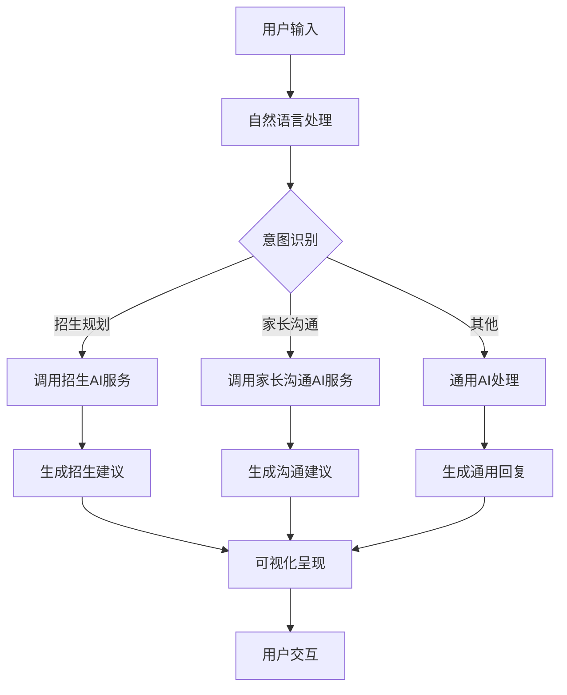
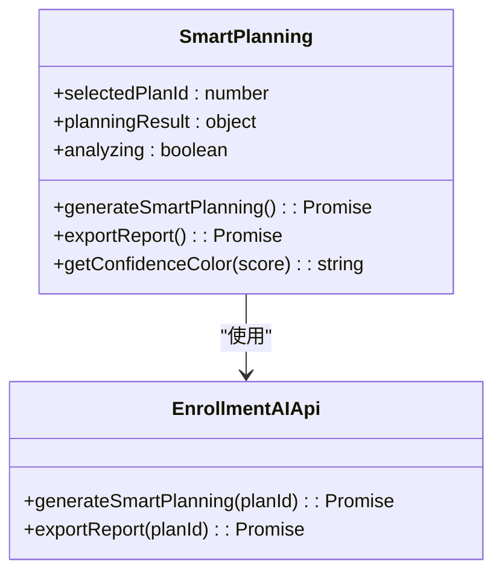
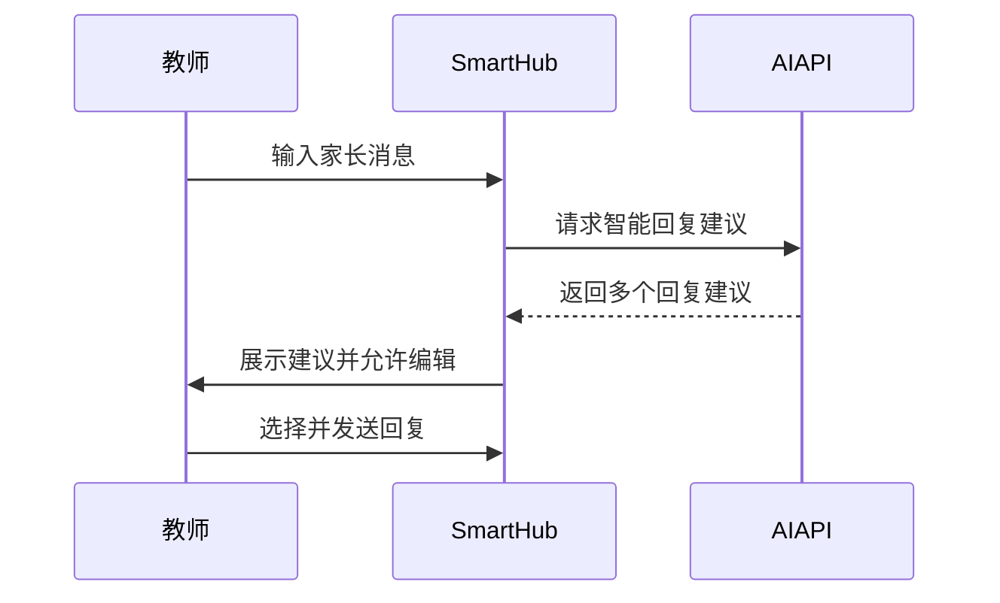
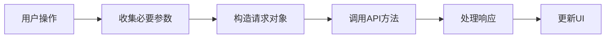

# 智能建议

<cite>
**本文档引用的文件**  
- [ai-chat-interface-fixed.vue](file://k.yyup.com/ai-chat-interface-fixed.vue)
- [assistant.vue](file://k.yyup.com/client/src/pages/ai/assistant.vue)
- [smart-planning.vue](file://k.yyup.com/client/src/pages/enrollment-plan/smart-planning/smart-planning.vue)
- [smart-hub.vue](file://k.yyup.com/client/src/pages/parent/communication/smart-hub.vue)
- [useSmartParentCommunication.ts](file://k.yyup.com/client/src/composables/useSmartParentCommunication.ts)
- [enrollment-ai.ts](file://k.yyup.com/client/src/api/modules/enrollment-ai.ts)
- [ai.ts](file://k.yyup.com/client/src/api/modules/ai.ts)
</cite>

## 目录
1. [引言](#引言)
2. [智能建议功能概述](#智能建议功能概述)
3. [自然语言理解与意图识别](#自然语言理解与意图识别)
4. [提示词工程在建议生成中的作用](#提示词工程在建议生成中的作用)
5. [业务场景下的建议生成逻辑](#业务场景下的建议生成逻辑)
6. [前后端交互实现](#前后端交互实现)
7. [上下文管理机制](#上下文管理机制)
8. [建议结果的可视化与交互](#建议结果的可视化与交互)
9. [总结](#总结)

## 引言

智能建议功能是本系统的核心AI能力之一，旨在通过人工智能技术为教育管理提供智能化决策支持。该功能覆盖招生管理、教学计划、家长沟通等多个业务场景，通过自然语言理解用户意图，生成精准的操作建议，并通过直观的可视化界面呈现给用户。本文档详细阐述该功能的技术实现、业务逻辑和交互设计。

## 智能建议功能概述

智能建议功能通过集成先进的AI模型，为用户提供基于数据驱动的决策支持。系统能够理解用户输入的自然语言，分析上下文信息，并生成针对性的建议。该功能主要体现在以下几个方面：

- **招生智能规划**：基于历史数据和市场分析，为招生计划提供目标人数、定价策略、时间规划等建议
- **家长沟通优化**：分析家长沟通数据，生成个性化内容和改进建议，提升沟通效率
- **教学管理辅助**：为教师提供教学计划建议和学生管理策略

该功能通过统一的AI助手界面（`assistant.vue`）和特定业务场景页面（如`smart-planning.vue`、`smart-hub.vue`）向用户呈现。

**Section sources**
- [assistant.vue](file://k.yyup.com/client/src/pages/ai/assistant.vue#L1-L68)
- [smart-planning.vue](file://k.yyup.com/client/src/pages/enrollment-plan/smart-planning/smart-planning.vue#L1-L652)
- [smart-hub.vue](file://k.yyup.com/client/src/pages/parent/communication/smart-hub.vue#L1-L1512)

## 自然语言理解与意图识别

系统通过AI助手组件（`ai-chat-interface-fixed.vue`）实现自然语言理解与意图识别功能。当用户输入问题或请求时，系统会：

1. 接收用户输入的文本内容
2. 通过AI模型分析文本语义，识别用户意图
3. 根据识别的意图选择合适的处理流程和建议生成策略

系统支持多种输入方式，包括文本输入、文件上传等，能够处理复杂的自然语言查询。AI助手界面提供了清晰的交互元素，如快速提问按钮、消息历史记录等，帮助用户更高效地与系统交互。

**Diagram sources**
- [ai-chat-interface-fixed.vue](file://k.yyup.com/ai-chat-interface-fixed.vue#L1-L648)

**Section sources**
- [ai-chat-interface-fixed.vue](file://k.yyup.com/ai-chat-interface-fixed.vue#L1-L648)

## 提示词工程在建议生成中的作用

提示词工程是智能建议生成的核心技术之一。系统通过精心设计的提示词模板，引导AI模型生成符合业务需求的高质量建议。提示词工程的主要作用包括：

1. **结构化输出**：通过定义清晰的输出格式，确保建议内容的结构化和一致性
2. **上下文控制**：在提示词中包含必要的上下文信息，提高建议的相关性和准确性
3. **业务规则嵌入**：将业务规则和约束条件编码到提示词中，确保建议符合实际业务要求

在招生智能规划场景中，系统会将招生计划的历史数据、市场环境、竞争情况等信息整合到提示词中，引导AI模型生成全面的规划建议。

**Section sources**
- [smart-planning.vue](file://k.yyup.com/client/src/pages/enrollment-plan/smart-planning/smart-planning.vue#L253-L386)
- [enrollment-ai.ts](file://k.yyup.com/client/src/api/modules/enrollment-ai.ts#L1-L100)

## 业务场景下的建议生成逻辑

### 招生管理场景

在招生管理场景中，智能建议功能通过`smart-planning.vue`组件实现。系统会分析历史招生数据、市场趋势和竞争环境，生成全面的招生规划建议。建议内容包括：

- **目标人数建议**：基于历史数据和市场需求预测最佳招生规模
- **定价策略**：分析市场平均价格和竞争对手定价，提供最优定价建议
- **时间规划**：推荐最佳招生启动时间和关键里程碑
- **营销策略**：建议最有效的营销渠道和预算分配
- **风险分析**：识别潜在风险因素并提供应对策略

**Diagram sources**
- [smart-planning.vue](file://k.yyup.com/client/src/pages/enrollment-plan/smart-planning/smart-planning.vue#L253-L386)

### 教学计划场景

在家长沟通场景中，智能建议功能通过`smart-hub.vue`组件实现。系统会分析家长沟通数据，生成个性化的内容和改进建议。主要功能包括：

- **个性化内容生成**：根据家长偏好和孩子特点，生成定制化的沟通内容
- **智能回复建议**：针对家长消息，提供多种回复方案供教师选择
- **沟通效果分析**：分析沟通渠道偏好、时间分布和话题热度
- **家长画像**：对家长进行细分，提供针对性的沟通策略
- **改进建议**：基于数据分析，提供沟通优化建议

**Diagram sources**
- [smart-hub.vue](file://k.yyup.com/client/src/pages/parent/communication/smart-hub.vue#L362-L800)
- [useSmartParentCommunication.ts](file://k.yyup.com/client/src/composables/useSmartParentCommunication.ts#L1-L200)

**Section sources**
- [smart-planning.vue](file://k.yyup.com/client/src/pages/enrollment-plan/smart-planning/smart-planning.vue#L1-L652)
- [smart-hub.vue](file://k.yyup.com/client/src/pages/parent/communication/smart-hub.vue#L1-L1512)

## 前后端交互实现

智能建议功能的前后端交互通过标准的API调用实现。前端组件通过API模块与后端AI服务通信，完成建议生成和数据获取。

### 请求参数构造

前端在调用AI服务时，会构造包含必要信息的请求参数。例如，在生成招生规划建议时，会传递招生计划ID和其他相关参数：

### 响应处理

系统对API响应进行统一处理，提取建议数据并更新UI状态。处理流程包括：

1. 检查响应状态码
2. 解析响应数据
3. 更新组件状态
4. 显示成功或错误消息

### 错误恢复机制

系统实现了完善的错误处理机制，包括：

- 网络错误重试
- 用户友好的错误提示
- 操作状态恢复
- 数据一致性保证

**Section sources**
- [smart-planning.vue](file://k.yyup.com/client/src/pages/enrollment-plan/smart-planning/smart-planning.vue#L253-L386)
- [smart-hub.vue](file://k.yyup.com/client/src/pages/parent/communication/smart-hub.vue#L362-L800)
- [ai.ts](file://k.yyup.com/client/src/api/modules/ai.ts#L1-L150)

## 上下文管理机制

系统通过会话管理机制保持对话连贯性。AI助手界面（`ai-chat-interface-fixed.vue`）实现了完整的会话管理功能：

- **会话历史**：保存用户的对话历史，支持在不同会话间切换
- **上下文传递**：在连续对话中保持上下文信息，确保AI理解对话背景
- **会话持久化**：将会话数据保存到服务器，支持跨设备同步
- **上下文清理**：提供清空对话功能，允许用户开始新的对话主题

会话管理不仅提高了用户体验，还确保了AI建议的连贯性和相关性。

**Section sources**
- [ai-chat-interface-fixed.vue](file://k.yyup.com/ai-chat-interface-fixed.vue#L1-L648)

## 建议结果的可视化与交互

### 建议卡片设计

系统采用卡片式布局呈现建议结果，每张卡片包含：

- **核心指标**：以大字体突出显示关键数据
- **详细信息**：提供具体的建议内容和分析依据
- **可视化元素**：使用进度条、图表等增强信息可读性
- **操作按钮**：提供直接的操作入口

### 操作按钮布局

操作按钮根据重要性和使用频率进行布局：

- **主要操作**：使用主色调按钮，放置在显眼位置
- **次要操作**：使用普通按钮或文字按钮
- **危险操作**：使用警示色按钮，并添加确认对话框

### 反馈收集机制

系统提供了多种反馈收集方式：

- **显式反馈**：通过评分、点赞/点踩按钮收集用户反馈
- **隐式反馈**：通过用户操作行为（如点击、停留时间）分析建议效果
- **改进建议**：允许用户提交具体的改进建议

这些反馈数据将用于持续优化AI模型和建议生成算法。

**Section sources**
- [smart-planning.vue](file://k.yyup.com/client/src/pages/enrollment-plan/smart-planning/smart-planning.vue#L1-L652)
- [smart-hub.vue](file://k.yyup.com/client/src/pages/parent/communication/smart-hub.vue#L1-L1512)
- [ai-chat-interface-fixed.vue](file://k.yyup.com/ai-chat-interface-fixed.vue#L1-L648)

## 总结

智能建议功能通过整合自然语言处理、提示词工程和业务逻辑，为教育管理提供了强大的AI支持。系统能够理解用户意图，生成针对性的建议，并通过直观的界面呈现给用户。通过完善的上下文管理和反馈机制，系统能够持续学习和优化，为用户提供越来越精准的智能服务。该功能在招生管理、家长沟通等场景中展现了显著的价值，有效提升了教育管理的智能化水平。