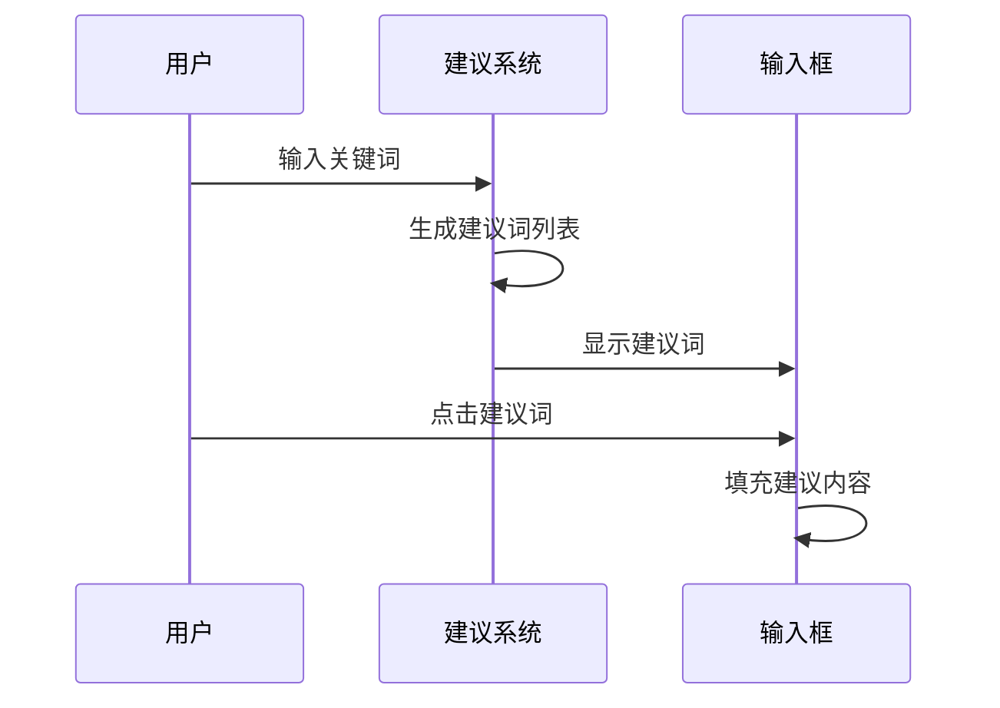
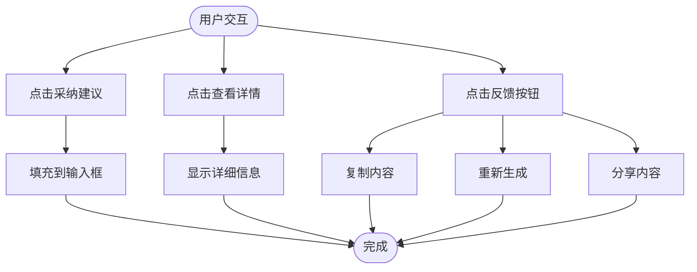
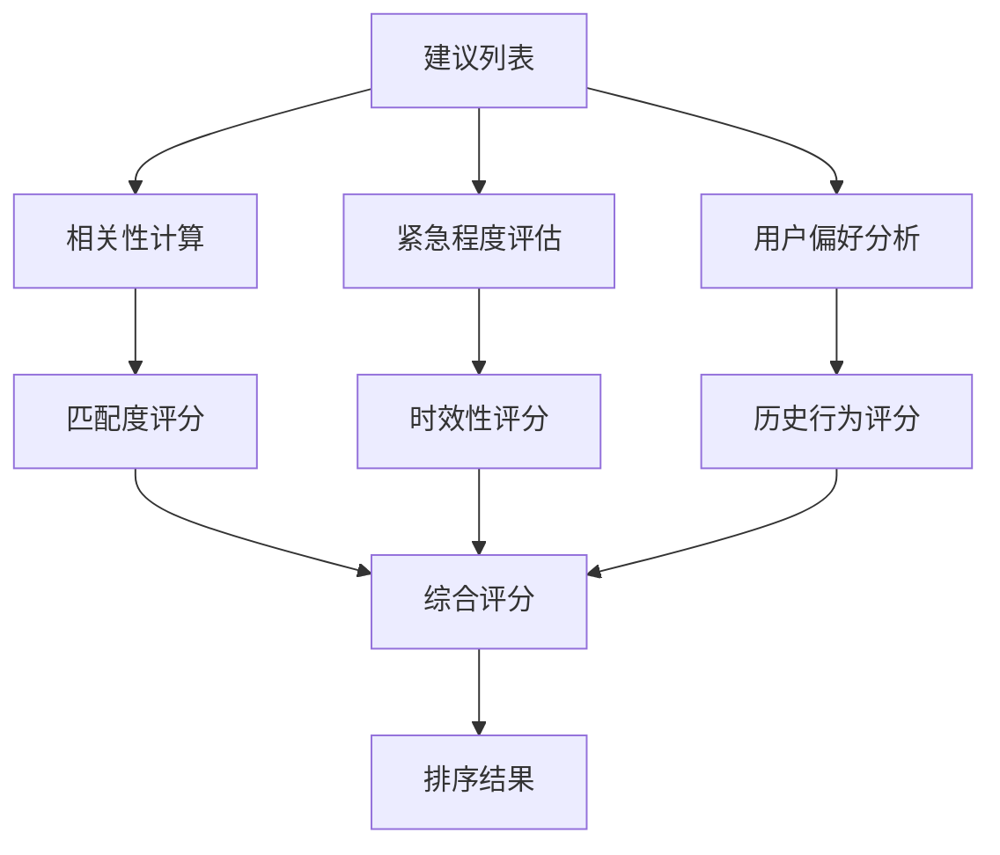
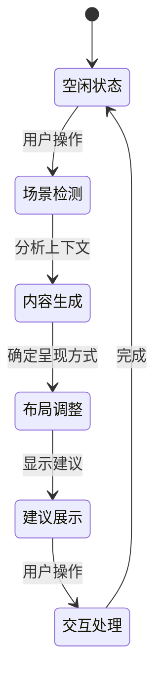
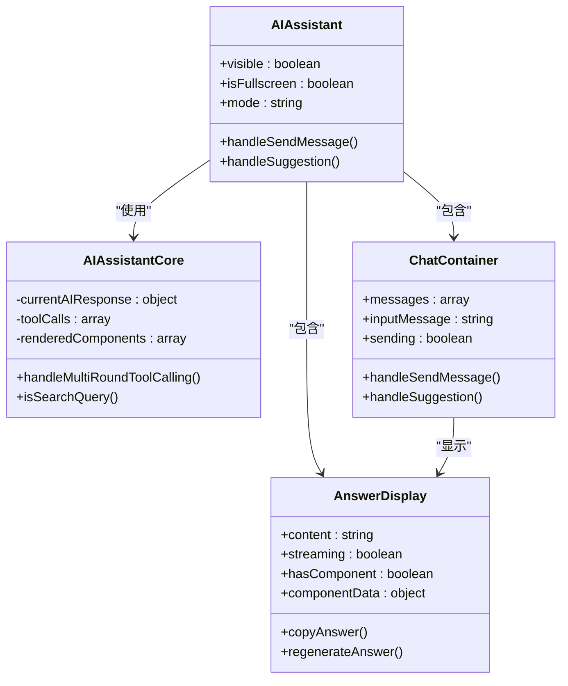

# 用户交互

<cite>
**本文档引用的文件**   
- [assistant.vue](file://k.yyup.com/client/src/pages/ai/assistant.vue)
- [AIAssistant.vue](file://k.yyup.com/client/backups/src/components/ai-assistant/AIAssistant.vue)
- [MobileAiAssistant.vue](file://k.yyup.com/client/aimobile/components/MobileAiAssistant.vue)
- [AIAssistantCore.vue](file://k.yyup.com/client/backups/src/components/ai-assistant/core/AIAssistantCore.vue)
- [ChatContainer.vue](file://k.yyup.com/client/backups/src/components/ai-assistant/chat/ChatContainer.vue)
- [AnswerDisplay.vue](file://k.yyup.com/client/backups/src/components/ai-assistant/ai-response/AnswerDisplay.vue)
- [ai-chat-interface-fixed.vue](file://k.yyup.com/ai-chat-interface-fixed.vue)
</cite>

## 目录
1. [智能建议功能概述](#智能建议功能概述)
2. [建议卡片视觉设计](#建议卡片视觉设计)
3. [用户交互模式](#用户交互模式)
4. [建议列表排序与过滤](#建议列表排序与过滤)
5. [上下文感知交互设计](#上下文感知交互设计)
6. [前端组件结构与状态管理](#前端组件结构与状态管理)
7. [无障碍设计考虑](#无障碍设计考虑)

## 智能建议功能概述

智能建议功能是AI助手的核心交互特性，旨在为用户提供上下文相关的操作建议和快捷查询。该功能通过分析用户当前操作场景和历史行为，动态生成个性化建议，提升用户操作效率。系统实现了多端适配，包括桌面端全屏模式和移动端悬浮窗模式，确保在不同设备上都能提供一致的用户体验。

**本节来源**
- [assistant.vue](file://k.yyup.com/client/src/pages/ai/assistant.vue#L1-L68)
- [AIAssistant.vue](file://k.yyup.com/client/backups/src/components/ai-assistant/AIAssistant.vue#L1-L800)

## 建议卡片视觉设计

建议卡片采用现代化的卡片式设计，遵循清晰的信息层级和响应式布局原则。

### 信息层级
建议卡片的信息层级设计遵循从重要到次要的视觉流：
1. **主标题**：使用加粗字体，字号为`var(--text-sm)`，颜色为`var(--el-text-color-primary)`，突出显示建议的核心内容。
2. **操作图标**：位于卡片左侧或右侧，使用Element Plus图标库，颜色为`var(--el-color-primary)`，提供直观的视觉提示。
3. **辅助信息**：使用较小字号`var(--text-xs)`，颜色为`var(--el-text-color-secondary)`，显示建议的附加信息或状态。

### 色彩搭配
系统采用主题化色彩搭配方案，支持明暗两种主题：
- **明色主题**：背景色为`var(--bg-primary)`，边框色为`var(--border-color)`，文字色为`var(--text-primary)`。
- **暗色主题**：背景色为`var(--el-bg-color-dark)`，边框色为`var(--el-border-color-dark)`，文字色为`var(--text-primary)`。

### 响应式布局
建议卡片采用响应式设计，适配不同屏幕尺寸：
- **桌面端**：卡片宽度为70%容器宽度，最大宽度700px，居中显示。
- **移动端**：卡片宽度为90%容器宽度，去除侧边距，适应小屏幕。

```mermaid
graph TD
A[建议卡片] --> B[主标题]
A --> C[操作图标]
A --> D[辅助信息]
B --> E[字体: var(--text-sm)]
B --> F[颜色: var(--el-text-color-primary)]
C --> G[颜色: var(--el-color-primary)]
D --> H[字体: var(--text-xs)]
D --> I[颜色: var(--el-text-color-secondary)]
```

**本节来源**
- [MobileAiAssistant.vue](file://k.yyup.com/client/aimobile/components/MobileAiAssistant.vue#L1-L800)
- [ai-chat-interface-fixed.vue](file://k.yyup.com/ai-chat-interface-fixed.vue#L1-L648)

## 用户交互模式

智能建议功能提供了多种用户交互模式，包括点击采纳、查看详情和提供反馈。

### 点击采纳
用户可以通过点击建议卡片直接采纳建议。在移动端，建议词显示在输入框上方，用户点击后会自动填充到输入框中：



### 查看详情
对于复杂建议，用户可以点击"查看详情"按钮展开详细信息。系统通过`HtmlPreview`组件在独立窗口中显示详细的建议内容，包括HTML预览和相关数据。

### 提供反馈
系统提供了反馈机制，用户可以通过操作按钮对建议进行反馈：
- **复制**：复制建议内容到剪贴板
- **重新生成**：请求AI重新生成建议
- **分享**：分享建议内容



**本节来源**
- [AIAssistant.vue](file://k.yyup.com/client/backups/src/components/ai-assistant/AIAssistant.vue#L1-L800)
- [MobileAiAssistant.vue](file://k.yyup.com/client/aimobile/components/MobileAiAssistant.vue#L1-L800)

## 建议列表排序与过滤

建议列表的排序和过滤机制基于相关性、紧急程度和用户偏好进行动态调整。

### 排序逻辑
建议列表采用多维度排序算法：
1. **相关性**：基于用户当前输入内容与建议的匹配度
2. **紧急程度**：基于建议的时效性和重要性
3. **用户偏好**：基于用户历史选择行为的个性化权重



### 过滤机制
系统实现了智能过滤机制，根据用户操作场景动态调整建议内容：
- **场景感知**：检测用户当前页面和操作上下文
- **关键词过滤**：基于输入关键词过滤不相关建议
- **状态过滤**：根据用户权限和系统状态过滤不可用建议

**本节来源**
- [AIAssistantCore.vue](file://k.yyup.com/client/backups/src/components/ai-assistant/core/AIAssistantCore.vue#L1-L800)
- [ChatContainer.vue](file://k.yyup.com/client/backups/src/components/ai-assistant/chat/ChatContainer.vue#L1-L245)

## 上下文感知交互设计

系统实现了上下文感知的交互设计，能够根据用户当前操作场景动态调整建议的呈现方式。

### 场景检测
系统通过`usePageAwareness`组合式函数检测用户当前操作场景：
- **页面上下文**：获取当前路由路径和页面标题
- **用户角色**：识别用户权限和角色
- **操作历史**：分析用户近期操作行为

### 动态调整
基于上下文信息，系统动态调整建议的呈现：
- **内容调整**：根据场景生成相关建议
- **布局调整**：在移动端采用悬浮窗模式，在桌面端采用侧边栏模式
- **优先级调整**：根据场景重要性调整建议排序



**本节来源**
- [AIAssistantCore.vue](file://k.yyup.com/client/backups/src/components/ai-assistant/core/AIAssistantCore.vue#L1-L800)
- [MobileAiAssistant.vue](file://k.yyup.com/client/aimobile/components/MobileAiAssistant.vue#L1-L800)

## 前端组件结构与状态管理

智能建议功能采用模块化的组件结构和组合式API进行状态管理。

### 组件结构
系统采用分层组件架构：
- **主容器**：`AIAssistant.vue`负责整体布局和状态协调
- **核心逻辑**：`AIAssistantCore.vue`处理业务逻辑
- **UI组件**：`ChatContainer.vue`、`AnswerDisplay.vue`等负责界面渲染

### 状态管理
系统使用组合式函数进行状态管理：
- `useAIAssistantState`：管理AI助手的整体状态
- `useMessageHandling`：处理消息生命周期
- `useAIResponse`：管理AI响应流程



**本节来源**
- [AIAssistant.vue](file://k.yyup.com/client/backups/src/components/ai-assistant/AIAssistant.vue#L1-L800)
- [AIAssistantCore.vue](file://k.yyup.com/client/backups/src/components/ai-assistant/core/AIAssistantCore.vue#L1-L800)
- [ChatContainer.vue](file://k.yyup.com/client/backups/src/components/ai-assistant/chat/ChatContainer.vue#L1-L245)
- [AnswerDisplay.vue](file://k.yyup.com/client/backups/src/components/ai-assistant/ai-response/AnswerDisplay.vue#L1-L331)

## 无障碍设计考虑

系统充分考虑了无障碍设计，确保所有用户都能有效使用智能建议功能。

### 键盘导航
- 支持Tab键在建议间切换
- Enter键确认选择
- Esc键关闭建议列表

### 屏幕阅读器支持
- 为所有交互元素添加适当的ARIA标签
- 为建议卡片提供清晰的语义化标签
- 确保动态内容更新能被屏幕阅读器感知

### 视觉可访问性
- 确保足够的颜色对比度
- 提供文本替代方案
- 支持高对比度模式

**本节来源**
- [MobileAiAssistant.vue](file://k.yyup.com/client/aimobile/components/MobileAiAssistant.vue#L1-L800)
- [ai-chat-interface-fixed.vue](file://k.yyup.com/ai-chat-interface-fixed.vue#L1-L648)