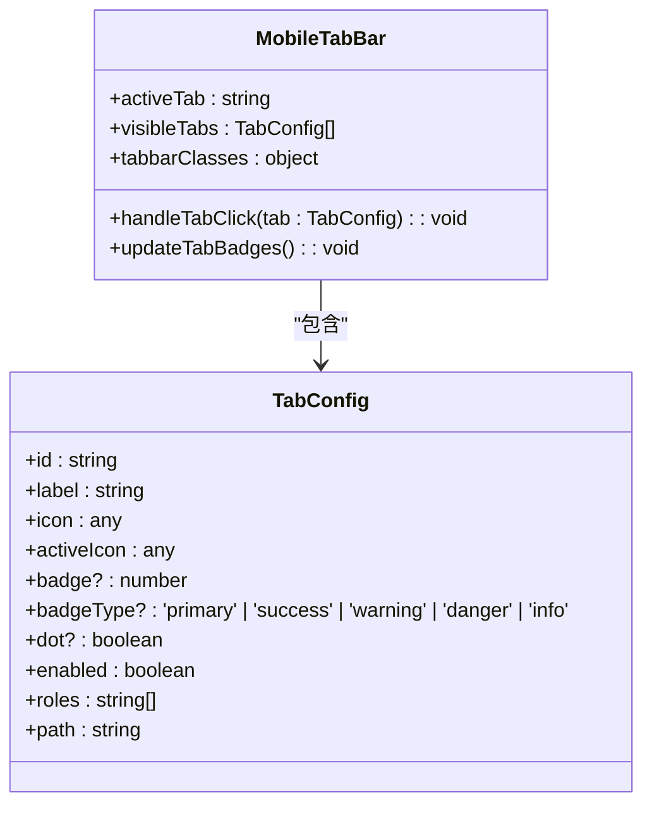
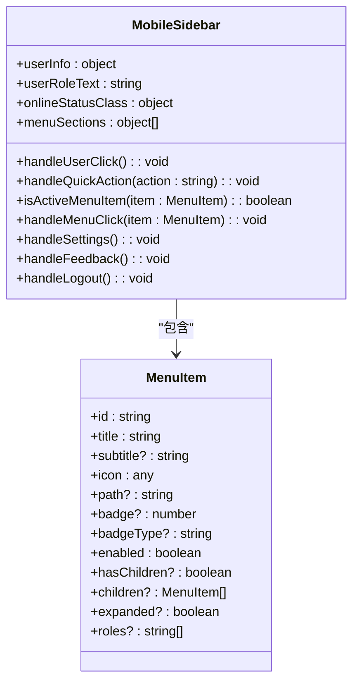
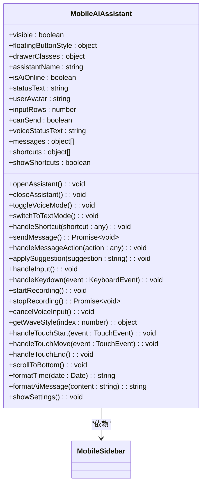
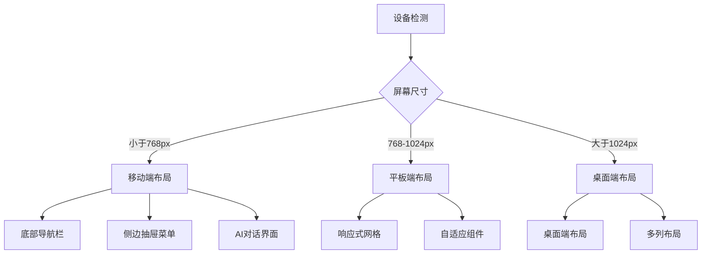
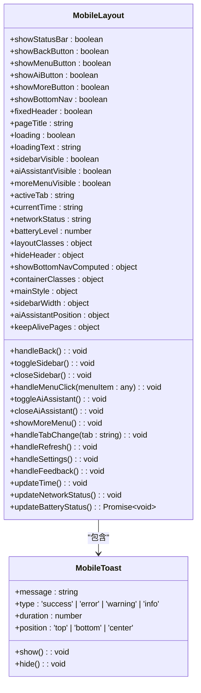
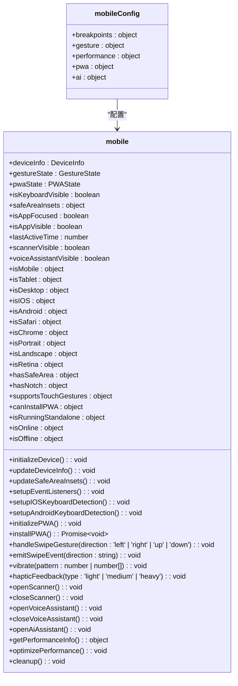
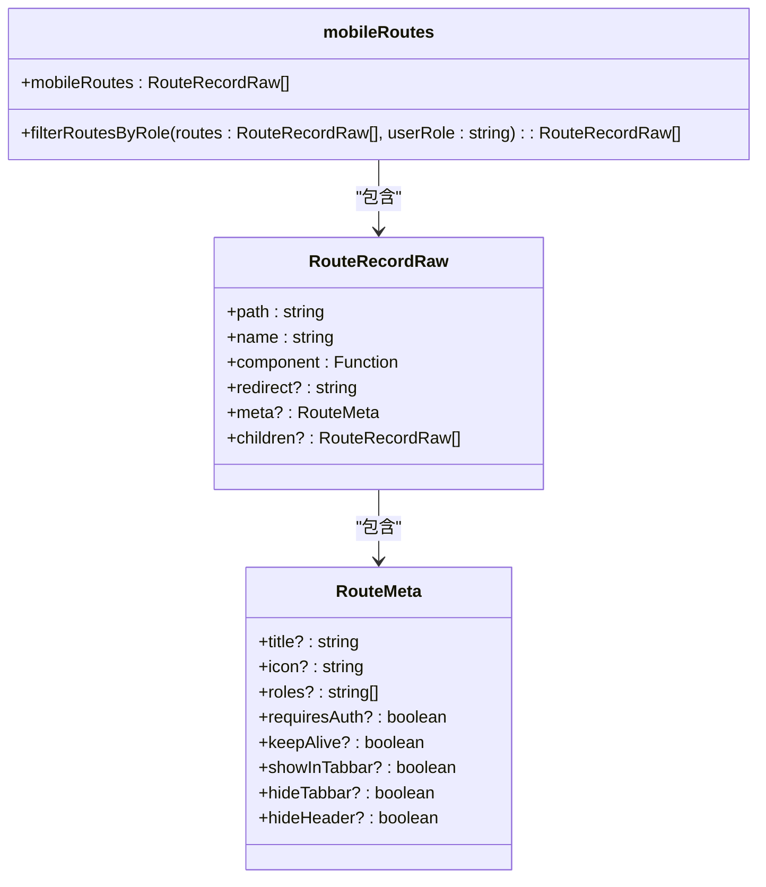

# 移动端UI设计

<cite>
**本文档引用的文件**   
- [App.vue](file://client/aimobile/App.vue)
- [MobileTabBar.vue](file://client/aimobile/components/MobileTabBar.vue)
- [MobileSidebar.vue](file://client/aimobile/components/MobileSidebar.vue)
- [MobileAiAssistant.vue](file://client/aimobile/components/MobileAiAssistant.vue)
- [MobileToast.vue](file://client/aimobile/components/MobileToast.vue)
- [MobileLayout.vue](file://client/aimobile/layouts/MobileLayout.vue)
- [mobile.routes.ts](file://client/aimobile/router/mobile.routes.ts)
- [mobile.scss](file://client/aimobile/styles/mobile.scss)
- [mobile.ts](file://client/aimobile/stores/mobile.ts)
- [mobile.config.ts](file://client/aimobile/config/mobile.config.ts)
- [MobileAIChat.vue](file://client/aimobile/pages/MobileAIChat.vue)
</cite>

## 目录
1. [引言](#引言)
2. [底部导航栏设计](#底部导航栏设计)
3. [侧边抽屉菜单设计](#侧边抽屉菜单设计)
4. [AI对话界面布局](#ai对话界面布局)
5. [响应式设计原则](#响应式设计原则)
6. [移动端特有组件](#移动端特有组件)
7. [UI组件库与主题定制](#ui组件库与主题定制)
8. [页面路由与导航守卫](#页面路由与导航守卫)
9. [结论](#结论)

## 引言
本文档详细阐述了移动端AI助手的用户界面设计，重点介绍底部导航栏、侧边抽屉菜单和AI对话界面的布局结构。文档解释了响应式设计原则在不同屏幕尺寸上的适配策略，包括手势操作、触摸目标大小和视觉层次设计。通过实际代码示例展示了Vue组件的实现方式，特别是MobileToast等移动端特有组件的使用方法。文档还说明了UI组件库的设计规范和主题定制方案，包括暗黑模式支持和无障碍访问特性，以及移动端页面路由配置和导航守卫的实现机制。

## 底部导航栏设计
移动端底部导航栏采用角色适配设计，根据用户角色动态显示不同的导航项。导航栏包含图标、标签文字和徽章提示，支持触摸优化和视觉反馈。

**图源**
- [MobileTabBar.vue](file://client/aimobile/components/MobileTabBar.vue#L89-L237)

**节源**
- [MobileTabBar.vue](file://client/aimobile/components/MobileTabBar.vue#L1-L561)

## 侧边抽屉菜单设计
侧边抽屉菜单提供角色权限控制、手势操作和动画效果。菜单包含用户信息区域、快捷操作区、主导航菜单和底部操作区，支持动态展开和折叠子菜单。

**图源**
- [MobileSidebar.vue](file://client/aimobile/components/MobileSidebar.vue#L160-L408)

**节源**
- [MobileSidebar.vue](file://client/aimobile/components/MobileSidebar.vue#L1-L877)

## AI对话界面布局
AI对话界面采用单页面AI交互设计，所有功能通过AI对话和Function Call实现。界面包含悬浮按钮、AI助手弹窗、快捷操作区、聊天消息区和输入区域。

**图源**
- [MobileAiAssistant.vue](file://client/aimobile/components/MobileAiAssistant.vue#L251-L629)

**节源**
- [MobileAiAssistant.vue](file://client/aimobile/components/MobileAiAssistant.vue#L1-L1238)

## 响应式设计原则
响应式设计原则确保应用在不同屏幕尺寸上都能提供良好的用户体验。设计考虑了手势操作、触摸目标大小和视觉层次。

**图源**
- [mobile.config.ts](file://client/aimobile/config/mobile.config.ts#L45-L83)
- [mobile.scss](file://client/aimobile/styles/mobile.scss#L244-L280)

**节源**
- [mobile.config.ts](file://client/aimobile/config/mobile.config.ts#L1-L83)
- [mobile.scss](file://client/aimobile/styles/mobile.scss#L1-L877)

## 移动端特有组件
移动端特有组件包括MobileToast等，用于提供用户反馈和提示。

**图源**
- [MobileToast.vue](file://client/aimobile/components/MobileToast.vue#L9-L12)
- [MobileLayout.vue](file://client/aimobile/layouts/MobileLayout.vue#L152-L349)

**节源**
- [MobileToast.vue](file://client/aimobile/components/MobileToast.vue#L1-L15)
- [MobileLayout.vue](file://client/aimobile/layouts/MobileLayout.vue#L1-L674)

## UI组件库与主题定制
UI组件库提供了一致的设计语言和交互模式，支持主题定制和暗黑模式。

**图源**
- [mobile.config.ts](file://client/aimobile/config/mobile.config.ts#L7-L83)
- [mobile.ts](file://client/aimobile/stores/mobile.ts#L8-L481)

**节源**
- [mobile.config.ts](file://client/aimobile/config/mobile.config.ts#L1-L83)
- [mobile.ts](file://client/aimobile/stores/mobile.ts#L1-L481)

## 页面路由与导航守卫
页面路由配置定义了应用的导航结构，导航守卫确保用户权限和状态。

**图源**
- [mobile.routes.ts](file://client/aimobile/router/mobile.routes.ts#L8-L122)

**节源**
- [mobile.routes.ts](file://client/aimobile/router/mobile.routes.ts#L1-L122)

## 结论
本文档详细阐述了移动端AI助手的用户界面设计，包括底部导航栏、侧边抽屉菜单和AI对话界面的布局结构。文档解释了响应式设计原则在不同屏幕尺寸上的适配策略，包括手势操作、触摸目标大小和视觉层次设计。通过实际代码示例展示了Vue组件的实现方式，特别是MobileToast等移动端特有组件的使用方法。文档还说明了UI组件库的设计规范和主题定制方案，包括暗黑模式支持和无障碍访问特性，以及移动端页面路由配置和导航守卫的实现机制。