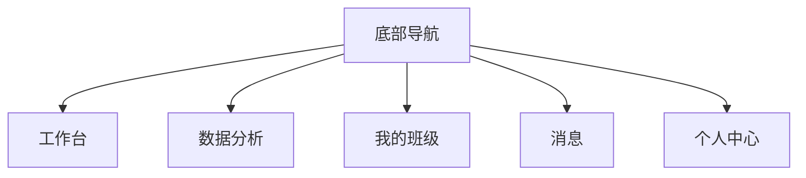
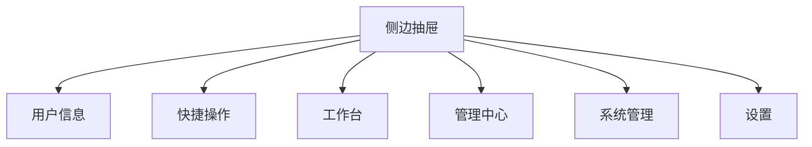
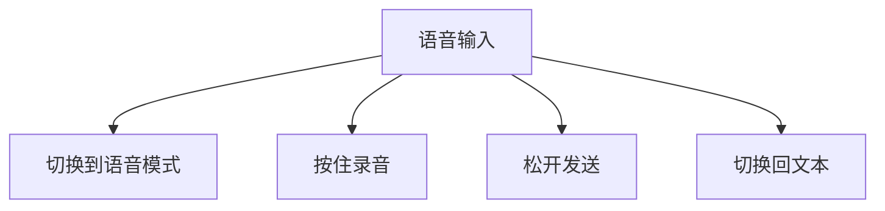
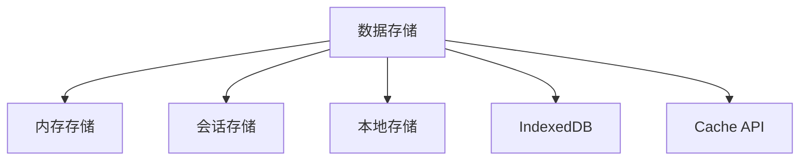
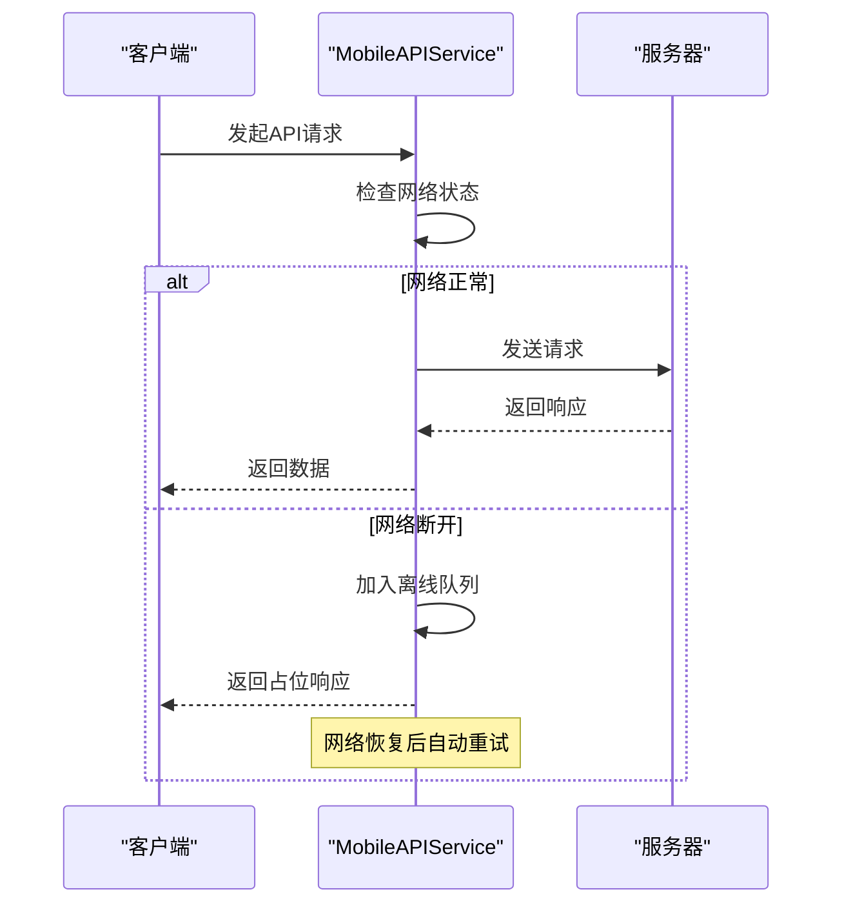
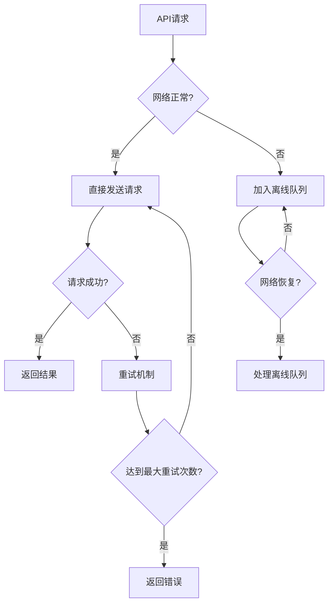
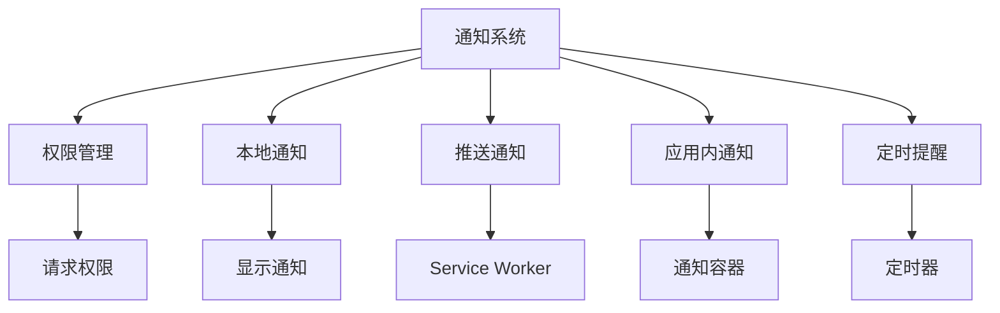
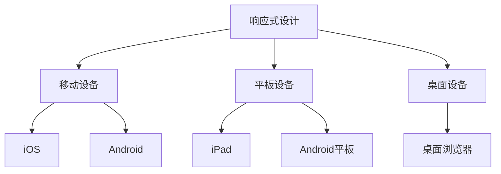

# 移动端体验

<cite>
**本文档引用的文件**   
- [App.vue](file://k.yyup.com/client/aimobile/App.vue)
- [MobileAiAssistant.vue](file://k.yyup.com/client/aimobile/components/MobileAiAssistant.vue)
- [MobileSidebar.vue](file://k.yyup.com/client/aimobile/components/MobileSidebar.vue)
- [MobileTabBar.vue](file://k.yyup.com/client/aimobile/components/MobileTabBar.vue)
- [mobile-api.service.ts](file://k.yyup.com/client/aimobile/services/mobile-api.service.ts)
- [mobile-storage.service.ts](file://k.yyup.com/client/aimobile/services/mobile-storage.service.ts)
- [mobile-notification.service.ts](file://k.yyup.com/client/aimobile/services/mobile-notification.service.ts)
- [mobile.routes.ts](file://k.yyup.com/client/aimobile/router/mobile.routes.ts)
</cite>

## 目录
1. [交互模式与用户体验设计](#交互模式与用户体验设计)
2. [性能优化策略](#性能优化策略)
3. [通信协议设计](#通信协议设计)
4. [移动端功能实现](#移动端功能实现)
5. [UI响应式设计与兼容性](#ui响应式设计与兼容性)

## 交互模式与用户体验设计

移动端AI助手采用现代化的交互设计，通过底部导航、侧边抽屉和语音输入等特色功能提供流畅的用户体验。

### 底部导航设计

移动端采用底部标签栏（TabBar）作为主要导航方式，根据用户角色动态显示不同的功能入口。底部导航具有以下特点：

- **角色适配**：根据用户角色（管理员、园长、教师、家长）显示不同的标签页
- **徽章提示**：支持数字徽章和红点提示，显示未读消息和待办事项
- **触摸优化**：提供触觉反馈，增强触摸操作的确认感
- **安全区域适配**：自动适配iPhone刘海屏的安全区域

底部导航包含工作台、数据分析、我的班级、消息等核心功能入口，确保用户能够快速访问常用功能。

**图源**
- [MobileTabBar.vue](file://k.yyup.com/client/aimobile/components/MobileTabBar.vue#L1-L561)

### 侧边抽屉设计

侧边抽屉提供更全面的导航和快捷操作，包含用户信息、快捷功能和系统设置等。

- **用户信息展示**：显示用户头像、姓名、角色和组织信息
- **快捷操作区**：提供扫一扫、AI助手、语音助手和消息等快捷入口
- **角色权限控制**：根据用户角色显示不同的菜单项
- **手势操作**：支持滑动打开和关闭侧边栏

侧边栏的菜单结构根据用户角色动态生成，确保用户只能访问其权限范围内的功能。

**图源**
- [MobileSidebar.vue](file://k.yyup.com/client/aimobile/components/MobileSidebar.vue#L1-L877)

### 语音输入设计

AI助手组件支持语音输入模式，提供自然的语音交互体验。

- **语音模式切换**：通过麦克风图标在文本和语音模式间切换
- **录音指示器**：显示动态的声波动画，提供视觉反馈
- **按住说话**：长按录音按钮开始录音，松开发送
- **键盘切换**：可随时切换回文本输入模式

语音输入模式特别适合移动场景，让用户能够通过语音快速输入问题和指令。

**图源**
- [MobileAiAssistant.vue](file://k.yyup.com/client/aimobile/components/MobileAiAssistant.vue#L1-L1238)

**本节来源**
- [MobileAiAssistant.vue](file://k.yyup.com/client/aimobile/components/MobileAiAssistant.vue#L1-L1238)
- [MobileTabBar.vue](file://k.yyup.com/client/aimobile/components/MobileTabBar.vue#L1-L561)
- [MobileSidebar.vue](file://k.yyup.com/client/aimobile/components/MobileSidebar.vue#L1-L877)

## 性能优化策略

移动端应用采用多种性能优化策略，确保在各种网络和设备条件下都能提供流畅的用户体验。

### 资源懒加载

应用采用按需加载策略，只在需要时加载组件和资源。

- **路由懒加载**：使用动态导入语法(`import()`)实现路由组件的懒加载
- **图片懒加载**：图片资源在进入视口时才加载
- **数据懒加载**：列表数据采用分页或无限滚动方式加载

这种策略显著减少了初始加载时间，提高了应用的启动速度。

### 离线缓存

应用实现了完善的离线缓存机制，确保在网络不稳定时仍能正常使用。

- **IndexedDB存储**：使用IndexedDB存储结构化数据
- **Cache API**：缓存静态资源和API响应
- **内存缓存**：临时数据存储在内存中
- **本地存储**：使用localStorage和sessionStorage存储简单数据

**图源**
- [mobile-storage.service.ts](file://k.yyup.com/client/aimobile/services/mobile-storage.service.ts#L1-L581)

### 网络请求优化

网络请求层实现了多种优化机制，提高网络效率和可靠性。

- **请求重试**：失败的请求会自动重试，最多3次
- **超时控制**：设置30秒的请求超时时间
- **数据压缩**：移除空值和undefined字段，减少传输数据量
- **离线队列**：网络断开时，请求会被加入离线队列，待网络恢复后自动重试

**图源**
- [mobile-api.service.ts](file://k.yyup.com/client/aimobile/services/mobile-api.service.ts#L1-L389)

**本节来源**
- [mobile-storage.service.ts](file://k.yyup.com/client/aimobile/services/mobile-storage.service.ts#L1-L581)
- [mobile-api.service.ts](file://k.yyup.com/client/aimobile/services/mobile-api.service.ts#L1-L389)

## 通信协议设计

移动端与后端AI服务的通信协议经过精心设计，确保高效、可靠的数据传输。

### 数据压缩

通信层实现了数据压缩机制，减少网络传输量。

- **请求压缩**：移除空值和undefined字段
- **响应处理**：对返回的数据进行解压缩
- **智能压缩**：根据数据类型选择合适的压缩策略

### 断点续传

对于大文件上传和下载，支持断点续传功能。

- **分块传输**：将大文件分割成小块进行传输
- **进度跟踪**：实时跟踪传输进度
- **续传机制**：中断后可以从断点继续传输

### 错误恢复机制

通信层实现了完善的错误恢复机制。

- **自动重试**：失败的请求会自动重试
- **离线队列**：网络断开时请求被暂存
- **状态同步**：网络恢复后自动同步离线数据
- **错误分类**：区分网络错误和业务错误，采取不同处理策略

**图源**
- [mobile-api.service.ts](file://k.yyup.com/client/aimobile/services/mobile-api.service.ts#L1-L389)

**本节来源**
- [mobile-api.service.ts](file://k.yyup.com/client/aimobile/services/mobile-api.service.ts#L1-L389)

## 移动端功能实现

应用实现了多种移动端特有的功能，提升用户体验。

### PWA支持

应用支持PWA（渐进式Web应用）特性。

- **安装提示**：检测到可以安装时显示安装提示
- **离线工作**：通过Service Worker实现离线访问
- **添加到主屏幕**：支持添加到主屏幕，获得原生应用体验
- **更新机制**：检测到新版本时提示用户更新

### 推送通知集成

实现了完整的推送通知系统。

- **权限管理**：请求和管理通知权限
- **本地通知**：显示本地生成的通知
- **推送通知**：接收服务器推送的通知
- **应用内通知**：在应用内部显示通知
- **定时提醒**：支持设置定时提醒

**图源**
- [mobile-notification.service.ts](file://k.yyup.com/client/aimobile/services/mobile-notification.service.ts#L1-L576)

### 本地存储管理

实现了多层本地存储管理。

- **内存存储**：临时数据，应用关闭后丢失
- **会话存储**：会话期间持久化
- **本地存储**：长期持久化
- **IndexedDB**：结构化数据存储
- **Cache API**：资源缓存

**本节来源**
- [mobile-notification.service.ts](file://k.yyup.com/client/aimobile/services/mobile-notification.service.ts#L1-L576)
- [mobile-storage.service.ts](file://k.yyup.com/client/aimobile/services/mobile-storage.service.ts#L1-L581)

## UI响应式设计与兼容性

应用采用响应式设计，确保在各种设备上都能提供良好的用户体验。

### 响应式设计原则

- **移动优先**：首先为移动设备设计，然后适配更大屏幕
- **弹性布局**：使用Flexbox和Grid布局
- **媒体查询**：针对不同屏幕尺寸应用不同的样式
- **触摸优化**：按钮和交互元素足够大，便于触摸操作

### 跨设备兼容性测试

- **设备适配**：适配不同尺寸的手机和平板
- **操作系统适配**：针对iOS和Android提供特定样式
- **浏览器兼容性**：支持主流移动浏览器
- **网络条件测试**：在不同网络条件下测试应用性能

**本节来源**
- [App.vue](file://k.yyup.com/client/aimobile/App.vue#L1-L753)