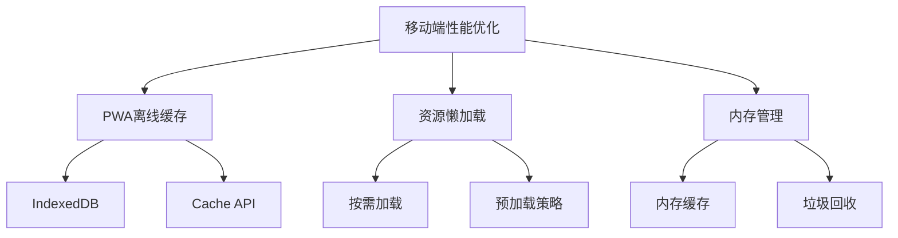
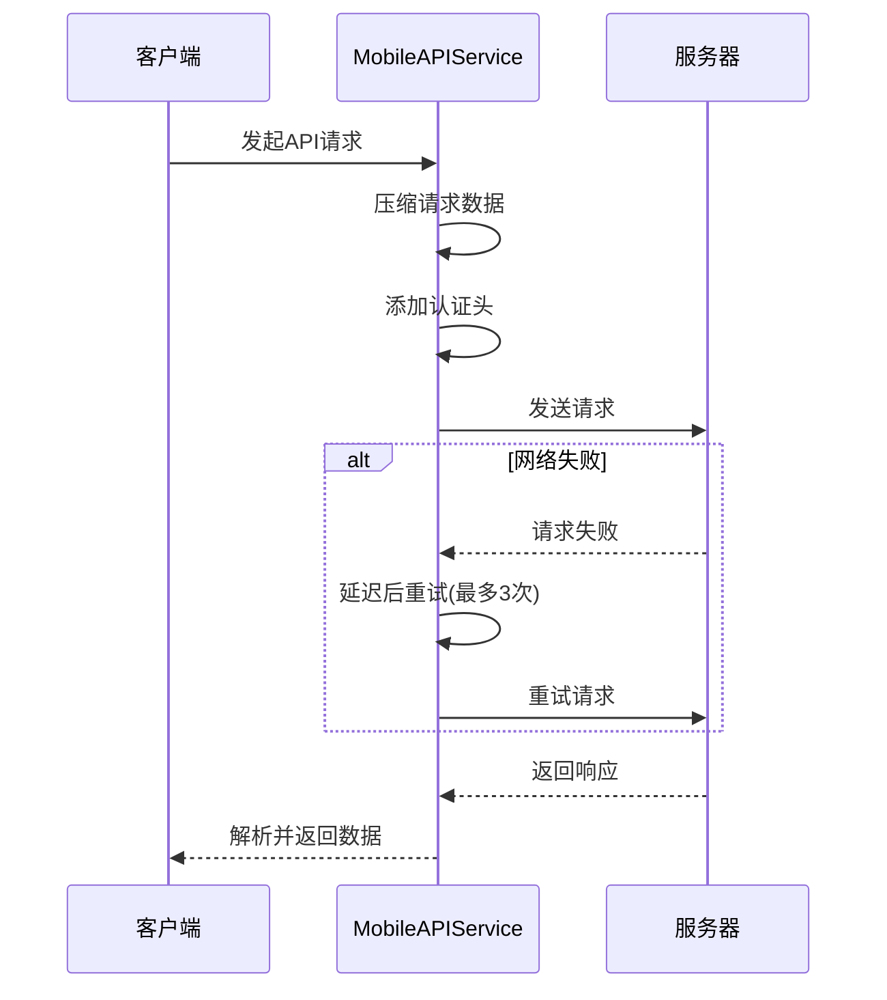
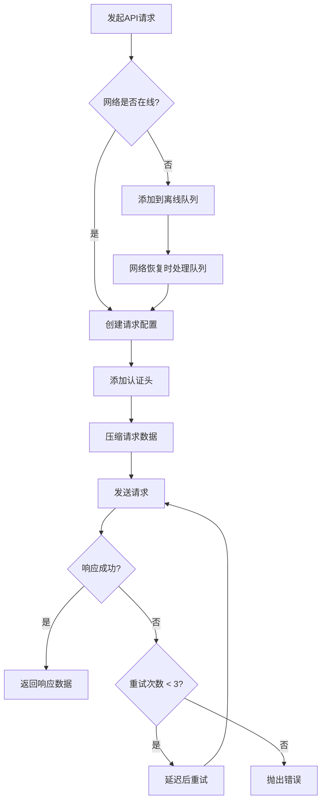
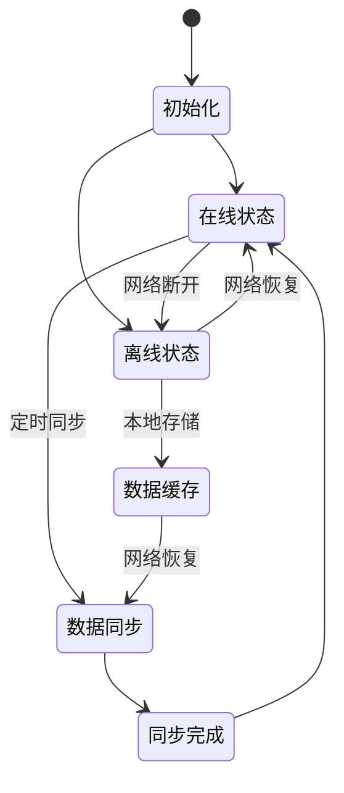
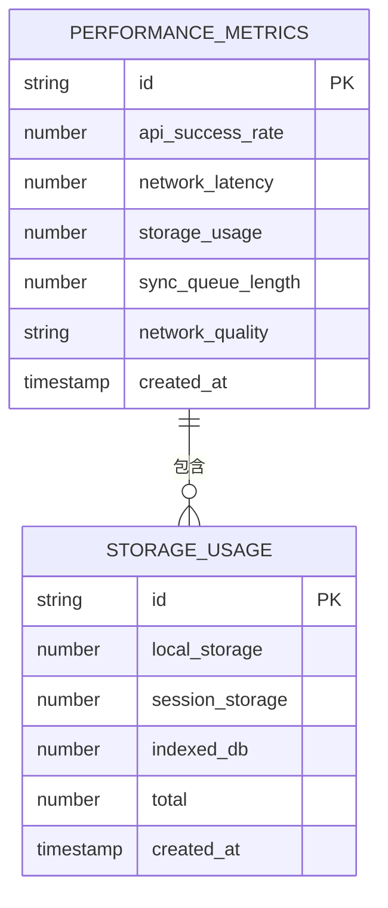

# 移动端性能优化

<cite>
**本文档引用的文件**  
- [mobile-storage.service.ts](file://k.yyup.com/client/aimobile/services/mobile-storage.service.ts)
- [mobile-api.service.ts](file://k.yyup.com/client/aimobile/services/mobile-api.service.ts)
- [mobile-storage.service.ts](file://unified-tenant-system/client/aimobile/services/mobile-storage.service.ts)
- [mobile-api.service.ts](file://unified-tenant-system/client/aimobile/services/mobile-api.service.ts)
</cite>

## 目录
1. [简介](#简介)
2. [移动端性能优化策略](#移动端性能优化策略)
3. [网络请求优化技术](#网络请求优化技术)
4. [本地存储实现方案](#本地存储实现方案)
5. [请求拦截器设计](#请求拦截器设计)
6. [移动端状态管理](#移动端状态管理)
7. [性能监控与指标](#性能监控与指标)

## 简介
本文档深入分析移动端AI助手的性能优化策略，涵盖PWA离线缓存机制、资源懒加载、内存管理、网络请求优化、本地存储实现、状态管理及性能监控等方面。通过分析`mobile-storage.service.ts`和`mobile-api.service.ts`等核心文件，详细阐述移动端性能优化的实现方案。

## 移动端性能优化策略

移动端AI助手采用多层次的性能优化策略，包括PWA离线缓存、资源懒加载和内存管理方案。通过IndexedDB和Cache API实现离线数据存储，利用内存缓存提升访问速度，同时通过合理的内存管理避免内存泄漏。



**图表来源**
- [mobile-storage.service.ts](file://k.yyup.com/client/aimobile/services/mobile-storage.service.ts#L45-L573)

**本节来源**
- [mobile-storage.service.ts](file://k.yyup.com/client/aimobile/services/mobile-storage.service.ts#L1-L581)

## 网络请求优化技术

移动端网络请求优化采用请求合并、数据压缩和智能缓存策略。通过`mobile-api.service.ts`中的`fetchWithRetry`机制实现请求重试，利用`compressRequestData`方法压缩请求数据，减少网络传输量。



**图表来源**
- [mobile-api.service.ts](file://k.yyup.com/client/aimobile/services/mobile-api.service.ts#L25-L387)

**本节来源**
- [mobile-api.service.ts](file://k.yyup.com/client/aimobile/services/mobile-api.service.ts#L1-L389)

## 本地存储实现方案

`mobile-storage.service.ts`实现了多层存储机制，支持内存、会话、本地存储、IndexedDB和Cache API五种存储类型。通过统一的接口封装，提供数据持久化、过期管理、压缩加密和同步功能。

```mermaid
classDiagram
class MobileStorageService {
+memoryCache : Map~string, StorageItem~
+dbName : string
+dbVersion : number
+db : IDBDatabase | null
+syncQueue : {key, data, action}[]
+isOnline : boolean
+set~T~(key : string, data : T, config : Partial~StorageConfig~) : Promise~void~
+get~T~(key : string, type : StorageType) : Promise~T | null~
+remove(key : string, type : StorageType) : Promise~void~
+clear(type : StorageType) : Promise~void~
+getStorageUsage() : Promise~{localStorage, sessionStorage, indexedDB, total}~
+cleanupExpiredData() : Promise~void~
}
class StorageType {
MEMORY : 'memory'
SESSION : 'session'
LOCAL : 'local'
INDEXED_DB : 'indexeddb'
CACHE_API : 'cache'
}
class StorageConfig {
type : StorageType
key : string
ttl? : number
compress? : boolean
encrypt? : boolean
sync? : boolean
}
class StorageItem~T~ {
data : T
timestamp : number
ttl? : number
version : string
compressed? : boolean
encrypted? : boolean
}
MobileStorageService --> StorageType
MobileStorageService --> StorageConfig
MobileStorageService --> StorageItem
```

**图表来源**
- [mobile-storage.service.ts](file://k.yyup.com/client/aimobile/services/mobile-storage.service.ts#L45-L573)

**本节来源**
- [mobile-storage.service.ts](file://k.yyup.com/client/aimobile/services/mobile-storage.service.ts#L1-L581)

## 请求拦截器设计

`mobile-api.service.ts`中的请求拦截器设计实现了认证头自动添加、请求重试、离线队列处理等核心功能。通过`getAuthToken`方法从多种存储位置获取认证令牌，确保请求的安全性。



**图表来源**
- [mobile-api.service.ts](file://k.yyup.com/client/aimobile/services/mobile-api.service.ts#L25-L387)

**本节来源**
- [mobile-api.service.ts](file://k.yyup.com/client/aimobile/services/mobile-api.service.ts#L1-L389)

## 移动端状态管理

移动端状态管理采用持久化存储与数据同步相结合的机制。通过`mobileStorageService`实现数据的本地持久化，利用同步队列在设备上线时自动同步数据到服务器，确保数据的一致性。



**图表来源**
- [mobile-storage.service.ts](file://k.yyup.com/client/aimobile/services/mobile-storage.service.ts#L45-L573)

**本节来源**
- [mobile-storage.service.ts](file://k.yyup.com/client/aimobile/services/mobile-storage.service.ts#L1-L581)

## 性能监控与指标

系统集成了性能监控工具，关键性能指标包括：API请求成功率、网络延迟、存储使用率、同步队列长度等。通过`getNetworkQuality`方法检测网络质量，为性能优化提供数据支持。



**图表来源**
- [mobile-api.service.ts](file://k.yyup.com/client/aimobile/services/mobile-api.service.ts#L25-L387)
- [mobile-storage.service.ts](file://k.yyup.com/client/aimobile/services/mobile-storage.service.ts#L45-L573)

**本节来源**
- [mobile-api.service.ts](file://k.yyup.com/client/aimobile/services/mobile-api.service.ts#L1-L389)
- [mobile-storage.service.ts](file://k.yyup.com/client/aimobile/services/mobile-storage.service.ts#L1-L581)