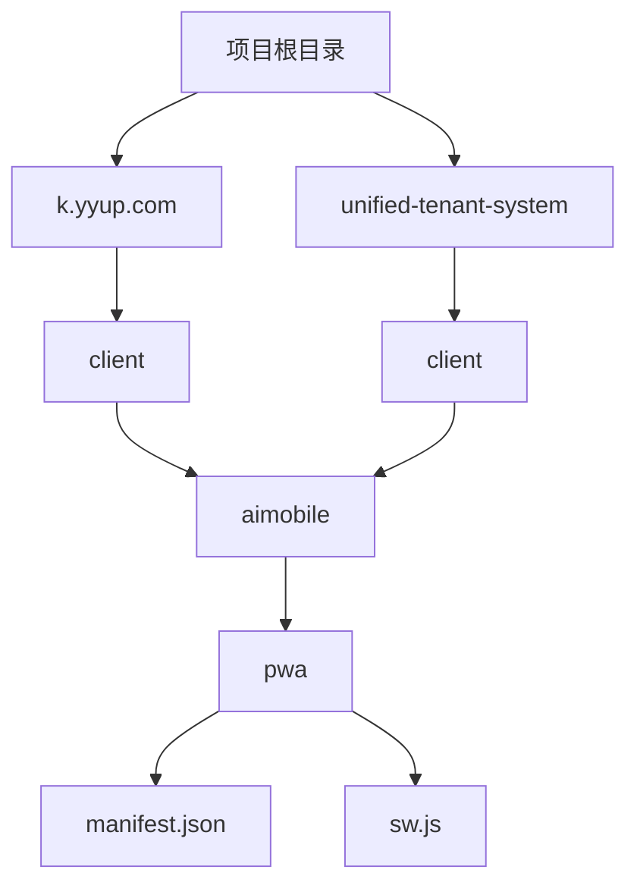
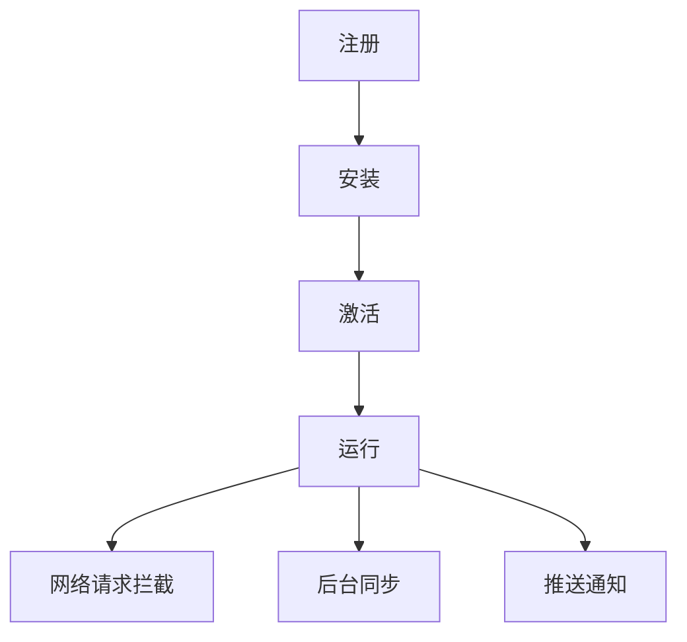
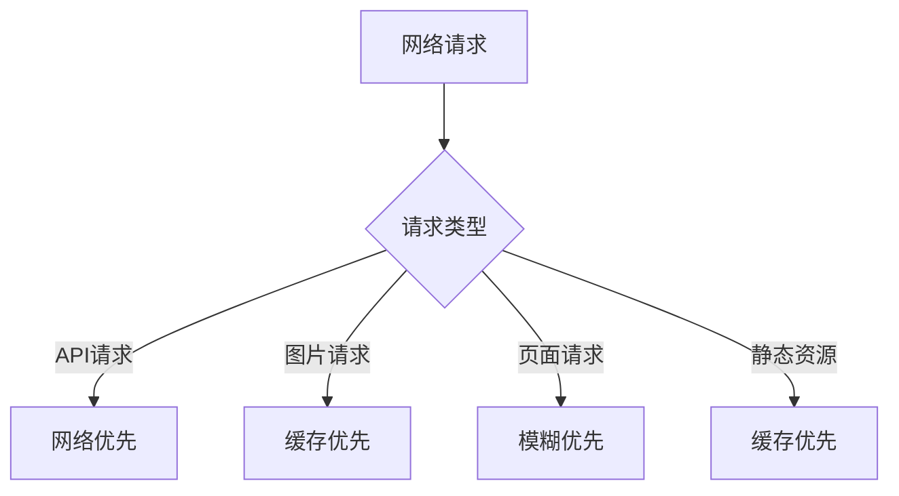
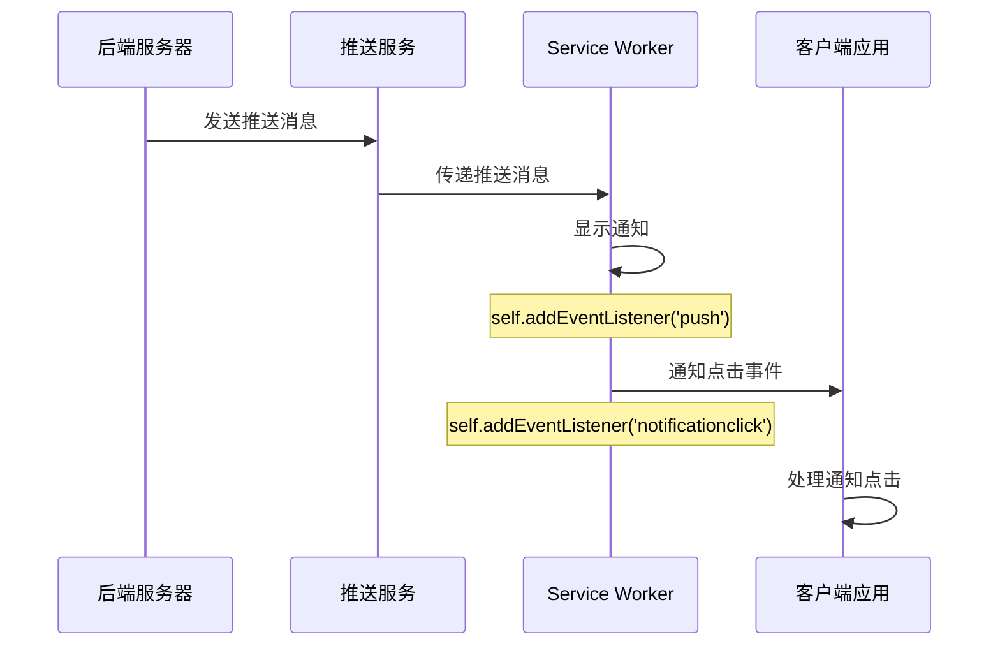
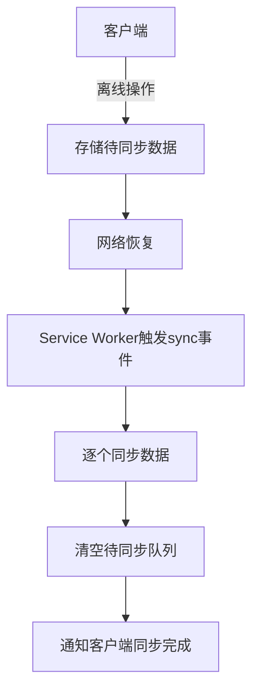

# 设备功能集成

<cite>
**本文档引用的文件**
- [manifest.json](file://k.yyup.com/client/aimobile/pwa/manifest.json)
- [sw.js](file://k.yyup.com/client/aimobile/pwa/sw.js)
- [App.vue](file://k.yyup.com/client/aimobile/App.vue)
- [MobileAiAssistant.vue](file://k.yyup.com/client/aimobile/components/MobileAiAssistant.vue)
</cite>

## 目录
1. [项目结构](#项目结构)
2. [PWA配置与安装](#pwa配置与安装)
3. [Service Worker与离线访问](#service-worker与离线访问)
4. [推送通知实现](#推送通知实现)
5. [后台同步机制](#后台同步机制)
6. [设备权限管理](#设备权限管理)
7. [长连接与实时通信](#长连接与实时通信)

## 项目结构

项目包含两个主要系统：`k.yyup.com` 和 `unified-tenant-system`，两者都实现了移动端AI助手功能。核心的PWA和Service Worker配置位于客户端的`aimobile/pwa/`目录下。



**Diagram sources**
- [manifest.json](file://k.yyup.com/client/aimobile/pwa/manifest.json)
- [sw.js](file://k.yyup.com/client/aimobile/pwa/sw.js)

**Section sources**
- [manifest.json](file://k.yyup.com/client/aimobile/pwa/manifest.json)
- [sw.js](file://k.yyup.com/client/aimobile/pwa/sw.js)

## PWA配置与安装

PWA（渐进式Web应用）通过`manifest.json`文件进行配置，使Web应用能够像原生应用一样被安装到移动设备上。

### manifest.json 配置详解

`manifest.json`文件定义了应用的元数据、外观和功能特性。

```json
{
  "name": "幼儿园管理系统",
  "short_name": "幼儿园管理",
  "description": "专业的幼儿园综合管理平台，支持招生管理、教学管理、家长沟通、AI智能分析等功能",
  "start_url": "/mobile/dashboard",
  "scope": "/mobile/",
  "display": "standalone",
  "orientation": "portrait-primary",
  "theme_color": "#1890ff",
  "background_color": "#ffffff",
  "lang": "zh-CN",
  "dir": "ltr",
  "icons": [...],
  "categories": ["education", "productivity", "business", "utilities"],
  "screenshots": [...],
  "shortcuts": [...],
  "related_applications": [...],
  "prefer_related_applications": false,
  "iarc_rating_id": "e58c174a-81d2-5c3c-32cc-34b8de4a52e9",
  "edge_side_panel": {
    "preferred_width": 320
  },
  "launch_handler": {
    "client_mode": "navigate-existing"
  },
  "protocol_handlers": [
    {
      "protocol": "web+kindergarten",
      "url": "/mobile/handle?type=%s"
    }
  ],
  "share_target": {
    "action": "/mobile/share",
    "method": "POST",
    "enctype": "multipart/form-data",
    "params": {
      "title": "title",
      "text": "text",
      "url": "url",
      "files": [
        {
          "name": "files",
          "accept": ["image/*", "application/pdf", ".doc", ".docx"]
        }
      ]
    }
  },
  "file_handlers": [
    {
      "action": "/mobile/files",
      "accept": {
        "image/*": [".jpg", ".jpeg", ".png", ".gif", ".webp"],
        "application/pdf": [".pdf"],
        "application/msword": [".doc"],
        "application/vnd.openxmlformats-officedocument.wordprocessingml.document": [".docx"]
      }
    }
  ],
  "handle_links": "preferred",
  "capture_links": "new-client",
  "scope_extensions": [
    {
      "origin": "https://api.kindergarten.example.com"
    }
  ]
}
```

#### 核心配置说明

- **name/short_name**: 应用的全名和短名，显示在主屏幕上
- **start_url**: 应用启动时的入口URL
- **scope**: 应用的导航范围，限制在`/mobile/`路径下
- **display**: 显示模式为`standalone`，隐藏浏览器UI，提供原生应用体验
- **orientation**: 强制纵向显示
- **theme_color/background_color**: 主题色和背景色，影响状态栏和启动画面
- **icons**: 提供多种尺寸的图标，支持maskable（可遮罩）和badge（角标）用途
- **shortcuts**: 添加主屏幕快捷方式，如"AI助手"、"学生管理"等
- **share_target**: 配置分享功能，允许用户从其他应用分享内容到本应用
- **file_handlers**: 配置文件处理，允许应用处理特定类型的文件
- **protocol_handlers**: 注册自定义协议，实现应用间跳转
- **scope_extensions**: 扩展作用域，允许访问API域名

**Section sources**
- [manifest.json](file://k.yyup.com/client/aimobile/pwa/manifest.json)

## Service Worker与离线访问

Service Worker是PWA的核心，它是一个运行在浏览器后台的脚本，独立于网页主线程，能够拦截网络请求、管理缓存并实现离线访问。

### Service Worker 生命周期

Service Worker的生命周期包括安装、激活和运行三个阶段：



**Diagram sources**
- [sw.js](file://k.yyup.com/client/aimobile/pwa/sw.js)

### 缓存策略

Service Worker实现了多种缓存策略，以优化不同类型的资源加载：

```javascript
// 缓存版本号
const CACHE_VERSION = 'v1.0.0'
const STATIC_CACHE = `kindergarten-static-${CACHE_VERSION}`
const API_CACHE = `kindergarten-api-${CACHE_VERSION}`
const PAGES_CACHE = `kindergarten-pages-${CACHE_VERSION}`
const IMAGES_CACHE = `kindergarten-images-${CACHE_VERSION}`
```

#### 缓存分类

- **STATIC_CACHE**: 静态资源缓存，包括CSS、JS、HTML等应用骨架文件
- **API_CACHE**: API响应缓存，存储接口数据
- **PAGES_CACHE**: 页面缓存，存储HTML页面
- **IMAGES_CACHE**: 图片缓存，存储用户上传和系统图片

### 请求处理策略

根据请求类型采用不同的缓存策略：



**Diagram sources**
- [sw.js](file://k.yyup.com/client/aimobile/pwa/sw.js)

#### 策略详解

- **网络优先 (API请求)**: 首先尝试从网络获取最新数据，失败时使用缓存
- **缓存优先 (图片/静态资源)**: 首先检查缓存，命中则直接返回，未命中再从网络获取
- **模糊优先 (页面请求)**: 同时发起网络请求和缓存查询，优先显示缓存内容，网络数据到达后更新

### 离线页面实现

当网络不可用时，Service Worker会返回预定义的离线页面：

```javascript
const OFFLINE_PAGE = '/mobile/offline'
const OFFLINE_API_RESPONSE = {
  success: false,
  data: null,
  message: '网络连接失败，请检查网络设置'
}
```

**Section sources**
- [sw.js](file://k.yyup.com/client/aimobile/pwa/sw.js)

## 推送通知实现

推送通知功能通过Service Worker的Push API实现，允许服务器向用户发送消息，即使应用未在前台运行。

### 推送通知流程



**Diagram sources**
- [sw.js](file://k.yyup.com/client/aimobile/pwa/sw.js)

### 推送通知代码实现

```javascript
// 推送消息事件监听
self.addEventListener('push', event => {
  console.log('[SW] 收到推送消息:', event.data?.text())
  
  if (event.data) {
    const data = event.data.json()
    event.waitUntil(showNotification(data))
  }
})

// 通知点击事件监听
self.addEventListener('notificationclick', event => {
  console.log('[SW] 通知被点击:', event.notification.data)
  
  event.notification.close()
  
  event.waitUntil(
    self.clients.matchAll().then(clients => {
      const client = clients.find(client => client.visibilityState === 'visible')
      
      if (client) {
        client.focus()
        client.postMessage({
          type: 'NOTIFICATION_CLICKED',
          data: event.notification.data
        })
      } else {
        self.clients.openWindow('/mobile/dashboard')
      }
    })
  )
})

// 显示通知
async function showNotification(data) {
  const options = {
    body: data.body || '您有新消息',
    icon: data.icon || '/icons/icon-192.png',
    badge: data.badge || '/icons/badge-72.png',
    image: data.image,
    tag: data.tag || 'default',
    renotify: data.renotify || false,
    requireInteraction: data.requireInteraction || false,
    actions: data.actions || [
      {
        action: 'view',
        title: '查看',
        icon: '/icons/action-view.png'
      },
      {
        action: 'dismiss',
        title: '忽略',
        icon: '/icons/action-dismiss.png'
      }
    ],
    data: data.data || {}
  }
  
  return self.registration.showNotification(
    data.title || '幼儿园管理系统',
    options
  )
}
```

**Section sources**
- [sw.js](file://k.yyup.com/client/aimobile/pwa/sw.js)

## 后台同步机制

后台同步（Background Sync）允许应用在用户重新获得网络连接时自动同步数据，确保离线期间的操作能够最终提交到服务器。

### 后台同步流程



**Diagram sources**
- [sw.js](file://k.yyup.com/client/aimobile/pwa/sw.js)

### 后台同步代码实现

```javascript
// 后台同步事件监听
self.addEventListener('sync', event => {
  console.log('[SW] 后台同步事件:', event.tag)
  
  if (event.tag === 'background-sync') {
    event.waitUntil(handleBackgroundSync())
  }
})

// 后台同步处理
async function handleBackgroundSync() {
  console.log('[SW] 执行后台同步')
  
  try {
    const pendingData = await getStoredData('pending-sync')
    
    if (pendingData && pendingData.length > 0) {
      for (const item of pendingData) {
        await syncDataItem(item)
      }
      
      await clearStoredData('pending-sync')
      
      self.clients.matchAll().then(clients => {
        clients.forEach(client => {
          client.postMessage({
            type: 'SYNC_COMPLETED',
            count: pendingData.length
          })
        })
      })
    }
  } catch (error) {
    console.error('[SW] 后台同步失败:', error)
  }
}

// 同步单个数据项
async function syncDataItem(item) {
  try {
    const response = await fetch(item.url, {
      method: item.method,
      headers: item.headers,
      body: item.data
    })
    
    if (!response.ok) {
      throw new Error(`同步失败: ${response.status}`)
    }
    
    console.log('[SW] 数据项同步成功:', item.id)
  } catch (error) {
    console.error('[SW] 数据项同步失败:', item.id, error)
    throw error
  }
}
```

**Section sources**
- [sw.js](file://k.yyup.com/client/aimobile/pwa/sw.js)

## 设备权限管理

虽然当前代码库中未直接体现权限请求代码，但基于PWA的特性，应用需要合理管理设备权限。

### 敏感权限请求策略

- **位置权限**: 在需要定位功能时请求，如签到考勤
- **摄像头权限**: 在需要拍照或扫码时请求，如学生签到
- **麦克风权限**: 在需要语音输入时请求，如语音助手

### 用户体验设计

- **渐进式请求**: 不在应用启动时一次性请求所有权限，而是在需要时按需请求
- **权限说明**: 在请求权限前，向用户解释为什么需要该权限
- **优雅降级**: 当用户拒绝权限时，提供替代方案或功能降级

## 长连接与实时通信

虽然当前代码库中未直接体现WebSocket或SSE代码，但基于AI助手的实时交互需求，系统应实现长连接机制。

### 实时通信协议选择

- **WebSocket**: 适用于双向实时通信，如AI对话流式响应
- **Server-Sent Events (SSE)**: 适用于服务器向客户端的单向实时更新
- **长轮询**: 作为兼容性备选方案

### 长连接管理方案

- **连接保活**: 定期发送心跳包维持连接
- **自动重连**: 网络中断后自动尝试重新连接
- **状态同步**: 重连后同步最新状态
- **资源释放**: 在适当时候（如页面隐藏）释放连接资源