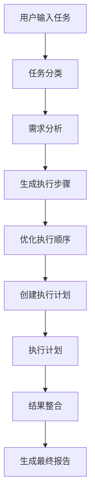
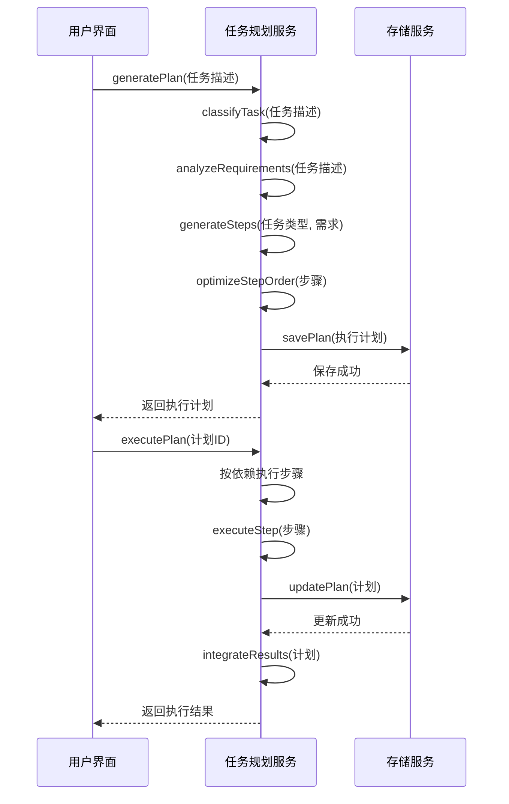
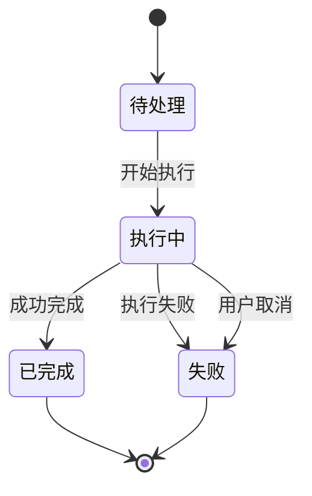
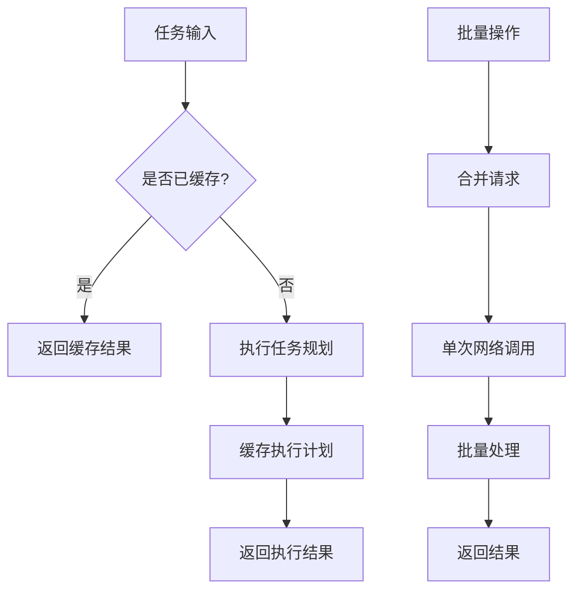
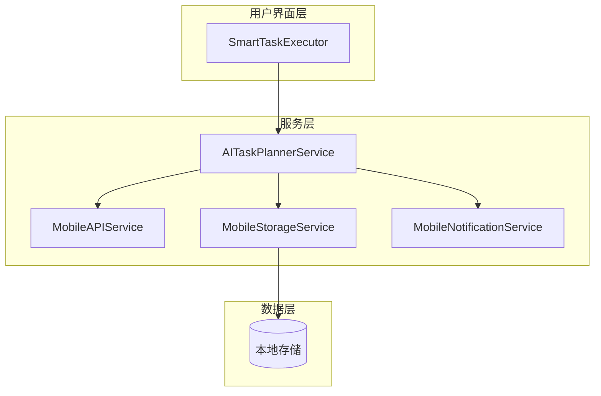
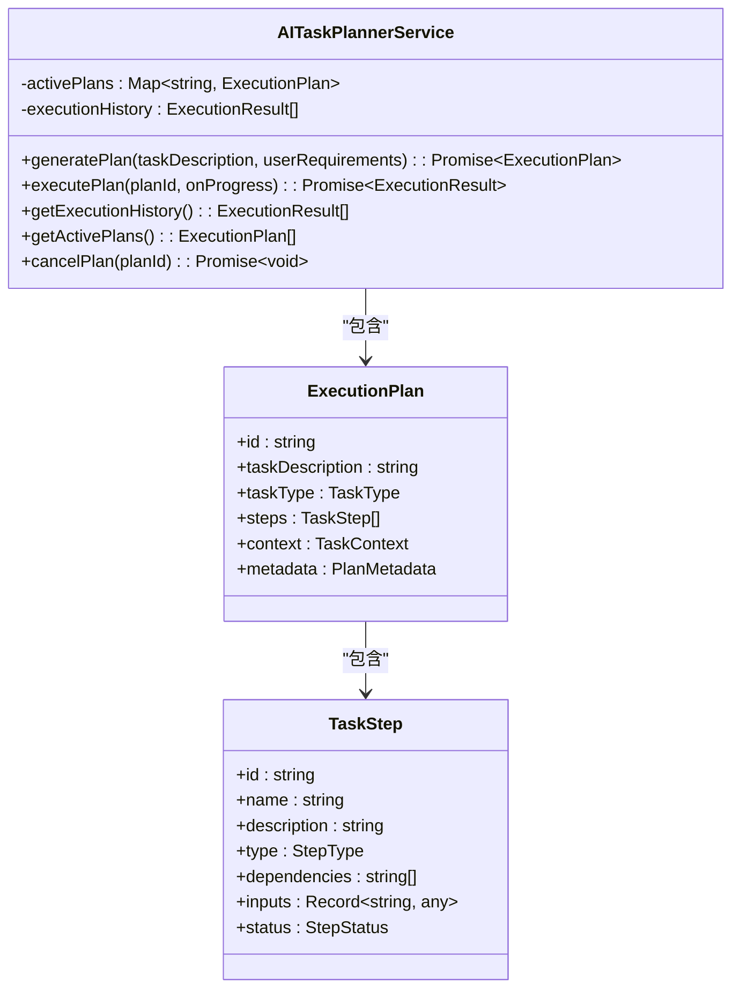
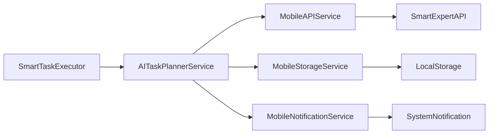

# 任务规划器

<cite>
**本文档引用的文件**
- [ai-task-planner.service.ts](file://k.yyup.com/client/aimobile/services/ai-task-planner.service.ts)
- [task-center.ts](file://k.yyup.com/client/src/api/task-center.ts)
- [task.ts](file://k.yyup.com/client/src/services/task.ts)
- [activity-planner.service.ts](file://k.yyup.com/server/src/services/ai/activity-planner.service.ts)
- [activity-planner.ts](file://k.yyup.com/server/src/routes/activity-planner.ts)
- [SmartTaskExecutor.vue](file://k.yyup.com/client/aimobile/components/SmartTaskExecutor.vue)
- [services.md](file://k.yyup.com/client/aimobile/docs/services.md)
- [concurrent-task-manager.ts](file://k.yyup.com/client/src/utils/concurrent-task-manager.ts)
</cite>

## 目录
1. [简介](#简介)
2. [核心组件](#核心组件)
3. [任务分解算法](#任务分解算法)
4. [API接口使用](#api接口使用)
5. [任务状态机设计](#任务状态机设计)
6. [性能优化策略](#性能优化策略)
7. [架构概览](#架构概览)
8. [详细组件分析](#详细组件分析)
9. [依赖关系分析](#依赖关系分析)
10. [故障排除指南](#故障排除指南)
11. [结论](#结论)

## 简介
任务规划器是AI助手的核心智能组件，负责将用户自然语言指令转化为可执行的任务序列。该系统实现了类似Claude的多轮任务执行机制，能够理解复杂任务、自动分解、动态规划和智能执行。通过分析用户需求，系统生成详细的执行计划，协调专家咨询、工具调用和数据分析等资源，最终整合生成综合报告。

## 核心组件
任务规划器由多个核心组件构成，包括任务理解、计划生成、执行编排和结果整合等模块。系统通过`AITaskPlannerService`类实现核心功能，该类提供了生成执行计划、执行计划、获取执行历史等方法。任务规划器与移动API服务、存储服务、通知服务等其他组件协同工作，形成完整的智能工作流编排引擎。

**Section sources**
- [ai-task-planner.service.ts](file://k.yyup.com/client/aimobile/services/ai-task-planner.service.ts#L96-L756)
- [SmartTaskExecutor.vue](file://k.yyup.com/client/aimobile/components/SmartTaskExecutor.vue#L1-L200)

## 任务分解算法
任务分解算法是任务规划器的核心，负责将用户输入的复杂任务分解为可执行的步骤序列。算法首先对任务进行分类和需求分析，然后生成具体的执行步骤，最后优化执行顺序。

### 任务分类
系统通过`classifyTask`方法对用户输入的任务进行分类，识别任务类型，如活动策划、招生策略、课程设计等。分类基于任务描述中的关键词进行匹配。

### 需求分析
`analyzeRequirements`方法从用户输入中提取关键信息，如参与人数、预算、时间线和交付物等。这些信息用于指导后续的执行计划生成。

### 步骤生成
`generateSteps`方法根据任务类型和需求生成具体的执行步骤。不同任务类型对应不同的步骤模板，如活动策划包括历史数据分析、主题策划、预算分析、海报设计等步骤。

### 顺序优化
`optimizeStepOrder`方法对生成的步骤进行拓扑排序，确保依赖关系得到满足。系统通过简单的排序算法将依赖较少的步骤排在前面执行。

**Diagram sources**
- [ai-task-planner.service.ts](file://k.yyup.com/client/aimobile/services/ai-task-planner.service.ts#L109-L153)
- [services.md](file://k.yyup.com/client/aimobile/docs/services.md#L243-L253)

**Section sources**
- [ai-task-planner.service.ts](file://k.yyup.com/client/aimobile/services/ai-task-planner.service.ts#L231-L617)

## API接口使用
任务规划器提供了丰富的API接口，用于任务的创建、更新和查询操作。这些接口通过RESTful API暴露，支持JSON格式的数据交换。

### 任务创建
通过`createTask`方法创建新任务，需要提供任务标题、描述、优先级等信息。系统会返回创建的任务对象，包含唯一标识符。

### 任务更新
`updateTask`方法允许修改任务的属性，如状态、进度、分配对象等。更新操作会触发相应的业务逻辑，如通知分配对象。

### 任务查询
系统提供了多种查询方法，包括按ID获取任务详情、获取任务列表、获取任务统计信息等。查询支持分页、过滤和排序功能。

**Diagram sources**
- [task-center.ts](file://k.yyup.com/client/src/api/task-center.ts#L79-L114)
- [task.ts](file://k.yyup.com/client/src/services/task.ts#L44-L85)

**Section sources**
- [task-center.ts](file://k.yyup.com/client/src/api/task-center.ts#L1-L241)
- [task.ts](file://k.yyup.com/client/src/services/task.ts#L1-L107)

## 任务状态机设计
任务状态机管理任务的生命周期，涵盖待处理、执行中、已完成、失败等状态的转换逻辑。状态机确保任务执行过程的可控性和可追踪性。

### 状态定义
任务有四种主要状态：
- **待处理(pending)**：任务已创建但尚未开始执行
- **执行中(running)**：任务正在执行中
- **已完成(completed)**：任务成功完成
- **失败(failed)**：任务执行失败

### 状态转换
状态转换遵循严格的规则：
- 待处理 → 执行中：当任务开始执行时
- 执行中 → 已完成：当任务成功完成时
- 执行中 → 失败：当任务执行失败且重试次数用尽时
- 任何状态 → 失败：当用户取消任务时

### 重试机制
系统实现了智能重试机制，当任务执行失败时，会自动重试最多3次。每次重试之间有适当的延迟，以避免对系统造成过大压力。

**Diagram sources**
- [ai-task-planner.service.ts](file://k.yyup.com/client/aimobile/services/ai-task-planner.service.ts#L34-L48)
- [task-center.ts](file://k.yyup.com/client/src/api/task-center.ts#L8-L9)

**Section sources**
- [ai-task-planner.service.ts](file://k.yyup.com/client/aimobile/services/ai-task-planner.service.ts#L349-L392)

## 性能优化策略
为了提高任务规划器的性能和效率，系统采用了多种优化策略，包括任务缓存、批量处理和增量更新。

### 任务缓存策略
系统使用本地存储缓存执行计划和执行历史，减少重复计算和网络请求。执行计划的缓存有效期为7天，执行历史的缓存有效期为30天。

### 批量处理
对于大量任务的更新或删除操作，系统提供了批量处理接口，减少网络往返次数，提高操作效率。

### 增量更新
任务更新采用增量更新模式，只发送修改的字段，减少数据传输量。

### 并发控制
`ConcurrentTaskManager`类实现了并发控制，限制同时执行的任务数，避免系统资源过载。

**Diagram sources**
- [ai-task-planner.service.ts](file://k.yyup.com/client/aimobile/services/ai-task-planner.service.ts#L698-L718)
- [concurrent-task-manager.ts](file://k.yyup.com/client/src/utils/concurrent-task-manager.ts#L45-L287)

**Section sources**
- [ai-task-planner.service.ts](file://k.yyup.com/client/aimobile/services/ai-task-planner.service.ts#L698-L718)
- [concurrent-task-manager.ts](file://k.yyup.com/client/src/utils/concurrent-task-manager.ts#L1-L290)

## 架构概览
任务规划器采用分层架构设计，包括用户界面层、服务层和数据层。各层之间通过清晰的接口进行通信，确保系统的可维护性和可扩展性。

**Diagram sources**
- [SmartTaskExecutor.vue](file://k.yyup.com/client/aimobile/components/SmartTaskExecutor.vue#L1-L200)
- [ai-task-planner.service.ts](file://k.yyup.com/client/aimobile/services/ai-task-planner.service.ts#L8-L12)

**Section sources**
- [SmartTaskExecutor.vue](file://k.yyup.com/client/aimobile/components/SmartTaskExecutor.vue#L1-L200)

## 详细组件分析
### AITaskPlannerService分析
`AITaskPlannerService`是任务规划器的核心服务类，负责管理执行计划和执行历史。

#### 类结构

**Diagram sources**
- [ai-task-planner.service.ts](file://k.yyup.com/client/aimobile/services/ai-task-planner.service.ts#L96-L756)

**Section sources**
- [ai-task-planner.service.ts](file://k.yyup.com/client/aimobile/services/ai-task-planner.service.ts#L96-L756)

## 依赖关系分析
任务规划器与其他组件存在明确的依赖关系，确保系统的模块化和可维护性。

**Diagram sources**
- [ai-task-planner.service.ts](file://k.yyup.com/client/aimobile/services/ai-task-planner.service.ts#L8-L12)
- [SmartTaskExecutor.vue](file://k.yyup.com/client/aimobile/components/SmartTaskExecutor.vue#L309)

**Section sources**
- [ai-task-planner.service.ts](file://k.yyup.com/client/aimobile/services/ai-task-planner.service.ts#L8-L12)

## 故障排除指南
### 常见问题
1. **任务执行失败**：检查网络连接，确保API服务可用
2. **计划生成缓慢**：检查输入任务描述是否过于复杂
3. **缓存数据过期**：清除本地存储并重新生成计划

### 调试方法
1. 启用详细日志输出，查看执行过程
2. 使用`getExecutionHistory`方法检查历史执行记录
3. 通过`getActivePlans`方法监控当前活动计划

**Section sources**
- [ai-task-planner.service.ts](file://k.yyup.com/client/aimobile/services/ai-task-planner.service.ts#L726-L754)

## 结论
任务规划器是一个功能强大的AI助手组件，能够将用户自然语言指令转化为可执行的任务序列。通过智能的任务分解算法、完善的API接口和高效的状态管理机制，系统实现了复杂任务的自动化执行。性能优化策略确保了系统的高效率和可扩展性。未来可以进一步优化任务分类算法，引入机器学习模型提高任务理解的准确性。