# 工具集成

<cite>
**本文档引用的文件**
- [tool-integration.service.ts](file://k.yyup.com/client/aimobile/services/tool-integration.service.ts)
- [function-tools.ts](file://k.yyup.com/client/src/api/endpoints/function-tools.ts)
- [ai-assistant.ts](file://k.yyup.com/client/src/stores/ai-assistant.ts)
- [tool.types.ts](file://k.yyup.com/server/src/services/ai/tools/types/tool.types.ts)
- [tool-manager.service.ts](file://k.yyup.com/server/src/services/ai/tools/core/tool-manager.service.ts)
- [tool-loader.service.ts](file://k.yyup.com/server/src/services/ai/tools/core/tool-loader.service.ts)
- [function-tools.routes.ts](file://k.yyup.com/server/src/routes/ai/function-tools.routes.ts)
- [fill-form.tool.ts](file://k.yyup.com/server/src/services/ai/tools/web-operation/fill-form.tool.ts)
- [click-element.tool.ts](file://k.yyup.com/server/src/services/ai/tools/web-operation/click-element.tool.ts)
</cite>

## 目录
1. [工具集成架构概述](#工具集成架构概述)
2. [前端组件与后端服务协同工作](#前端组件与后端服务协同工作)
3. [原子操作实现原理](#原子操作实现原理)
4. [工具调用链路配置](#工具调用链路配置)
5. [工具注册机制与插件化设计](#工具注册机制与插件化设计)
6. [集成最佳实践](#集成最佳实践)

## 工具集成架构概述

本系统采用前后端分离的架构，通过AI助手实现前端组件与后端服务的自动化协同工作。系统核心由前端工具集成服务、后端工具管理器和工具执行引擎三部分组成，形成完整的工具调用闭环。

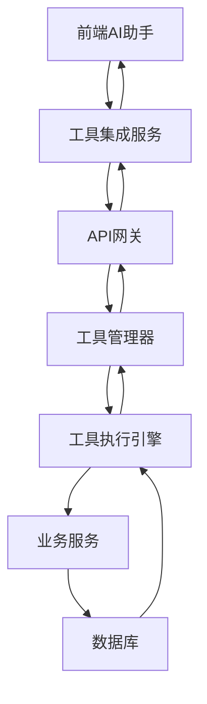

**图表来源**
- [tool-integration.service.ts](file://k.yyup.com/client/aimobile/services/tool-integration.service.ts)
- [function-tools.routes.ts](file://k.yyup.com/server/src/routes/ai/function-tools.routes.ts)
- [tool-manager.service.ts](file://k.yyup.com/server/src/services/ai/tools/core/tool-manager.service.ts)

**章节来源**
- [tool-integration.service.ts](file://k.yyup.com/client/aimobile/services/tool-integration.service.ts)
- [function-tools.routes.ts](file://k.yyup.com/server/src/routes/ai/function-tools.routes.ts)

## 前端组件与后端服务协同工作

前端组件通过工具集成服务与后端服务进行协同工作，实现自动化操作。前端AI助手通过状态管理存储当前页面上下文，当用户发起操作请求时，工具集成服务会根据上下文信息选择合适的工具，并通过API网关调用后端服务。

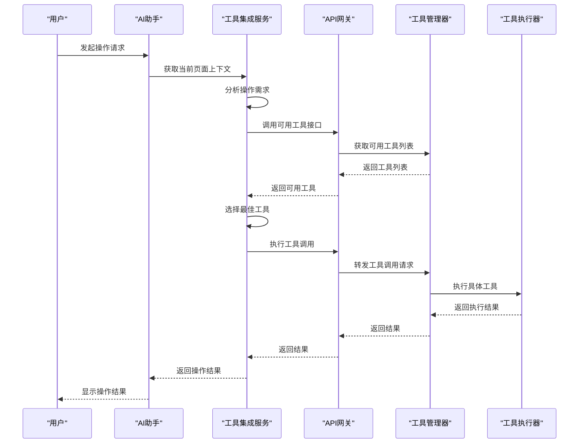

**图表来源**
- [ai-assistant.ts](file://k.yyup.com/client/src/stores/ai-assistant.ts)
- [function-tools.ts](file://k.yyup.com/client/src/api/endpoints/function-tools.ts)
- [function-tools.routes.ts](file://k.yyup.com/server/src/routes/ai/function-tools.routes.ts)

**章节来源**
- [ai-assistant.ts](file://k.yyup.com/client/src/stores/ai-assistant.ts)
- [function-tools.ts](file://k.yyup.com/client/src/api/endpoints/function-tools.ts)

## 原子操作实现原理

### 页面导航实现

页面导航操作通过`navigate_to_page`工具实现，该工具接收目标页面路径作为参数，通过前端路由系统完成页面跳转。

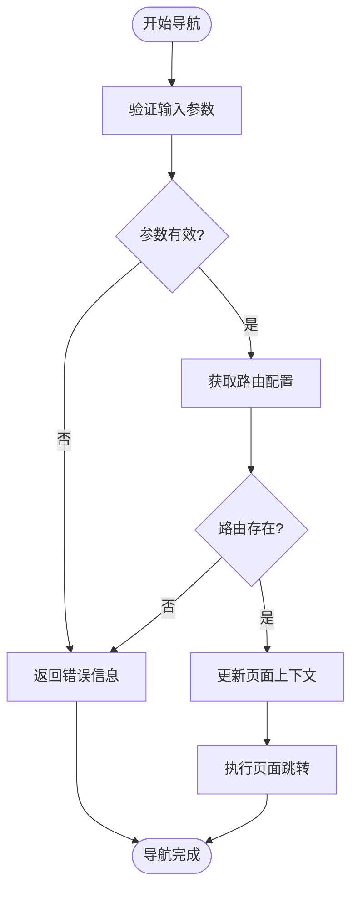

**图表来源**
- [function-tools.routes.ts](file://k.yyup.com/server/src/routes/ai/function-tools.routes.ts)
- [tool-loader.service.ts](file://k.yyup.com/server/src/services/ai/tools/core/tool-loader.service.ts)

### 表单填写实现

表单填写操作通过`fill_form`工具实现，该工具接收表单字段和值作为参数，通过DOM操作完成表单自动填写。

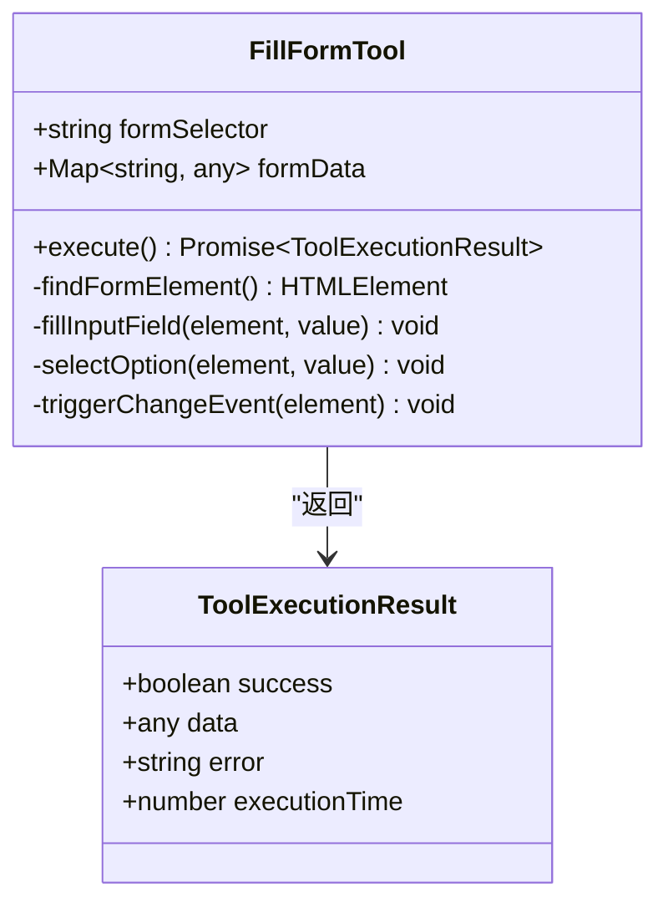

**图表来源**
- [fill-form.tool.ts](file://k.yyup.com/server/src/services/ai/tools/web-operation/fill-form.tool.ts)
- [tool.types.ts](file://k.yyup.com/server/src/services/ai/tools/types/tool.types.ts)

### 数据提交实现

数据提交操作通过`submit_form`工具实现，该工具在完成表单填写后触发表单提交事件，并处理提交结果。

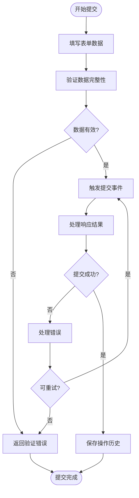

**图表来源**
- [function-tools.routes.ts](file://k.yyup.com/server/src/routes/ai/function-tools.routes.ts)
- [tool-loader.service.ts](file://k.yyup.com/server/src/services/ai/tools/core/tool-loader.service.ts)

**章节来源**
- [fill-form.tool.ts](file://k.yyup.com/server/src/services/ai/tools/web-operation/fill-form.tool.ts)
- [click-element.tool.ts](file://k.yyup.com/server/src/services/ai/tools/web-operation/click-element.tool.ts)

## 工具调用链路配置

### 招生表单自动填写

招生表单自动填写场景通过配置工具调用链路实现，包括获取招生表单、填写表单数据和提交表单三个步骤。

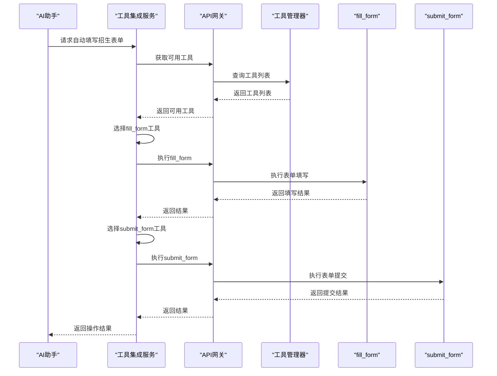

**图表来源**
- [function-tools.routes.ts](file://k.yyup.com/server/src/routes/ai/function-tools.routes.ts)
- [fill-form.tool.ts](file://k.yyup.com/server/src/services/ai/tools/web-operation/fill-form.tool.ts)

### 考勤数据批量提交

考勤数据批量提交场景通过配置批量处理工具链路实现，包括数据验证、批量填写和批量提交三个主要步骤。

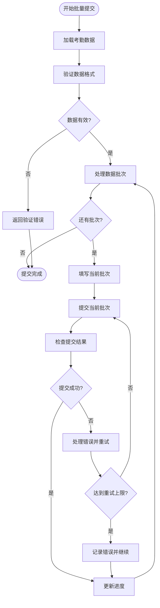

**图表来源**
- [function-tools.routes.ts](file://k.yyup.com/server/src/routes/ai/function-tools.routes.ts)
- [tool-loader.service.ts](file://k.yyup.com/server/src/services/ai/tools/core/tool-loader.service.ts)

**章节来源**
- [function-tools.routes.ts](file://k.yyup.com/server/src/routes/ai/function-tools.routes.ts)
- [tool-loader.service.ts](file://k.yyup.com/server/src/services/ai/tools/core/tool-loader.service.ts)

## 工具注册机制与插件化设计

### 工具注册机制

系统采用插件化设计，通过工具加载器服务实现工具的动态注册和管理。新工具可以通过实现`ToolDefinition`接口并注册到工具管理器中来扩展系统功能。

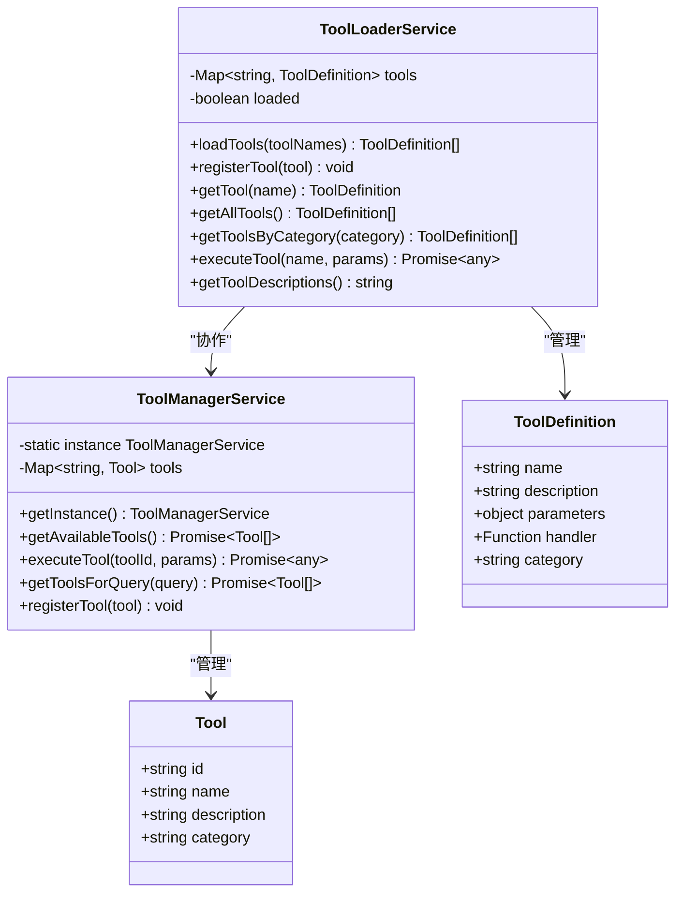

**图表来源**
- [tool-loader.service.ts](file://k.yyup.com/server/src/services/ai/tools/core/tool-loader.service.ts)
- [tool-manager.service.ts](file://k.yyup.com/server/src/services/ai/tools/core/tool-manager.service.ts)
- [tool.types.ts](file://k.yyup.com/server/src/services/ai/tools/types/tool.types.ts)

### 插件化设计

系统支持通过插件化方式扩展新的自动化功能，新工具的开发遵循统一的接口规范，确保与现有系统的兼容性。

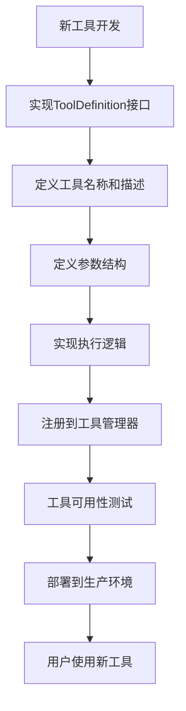

**图表来源**
- [tool-loader.service.ts](file://k.yyup.com/server/src/services/ai/tools/core/tool-loader.service.ts)
- [tool.types.ts](file://k.yyup.com/server/src/services/ai/tools/types/tool.types.ts)

**章节来源**
- [tool-loader.service.ts](file://k.yyup.com/server/src/services/ai/tools/core/tool-loader.service.ts)
- [tool.types.ts](file://k.yyup.com/server/src/services/ai/tools/types/tool.types.ts)

## 集成最佳实践

### 错误处理机制

系统实现了完善的错误处理机制，包括输入验证、执行异常捕获和降级处理策略。

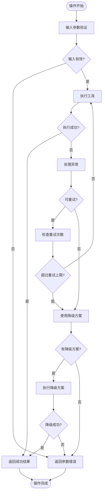

**图表来源**
- [tool-integration.service.ts](file://k.yyup.com/client/aimobile/services/tool-integration.service.ts)
- [tool-loader.service.ts](file://k.yyup.com/server/src/services/ai/tools/core/tool-loader.service.ts)

### 超时控制

系统实现了多层次的超时控制机制，确保长时间运行的操作不会阻塞系统资源。

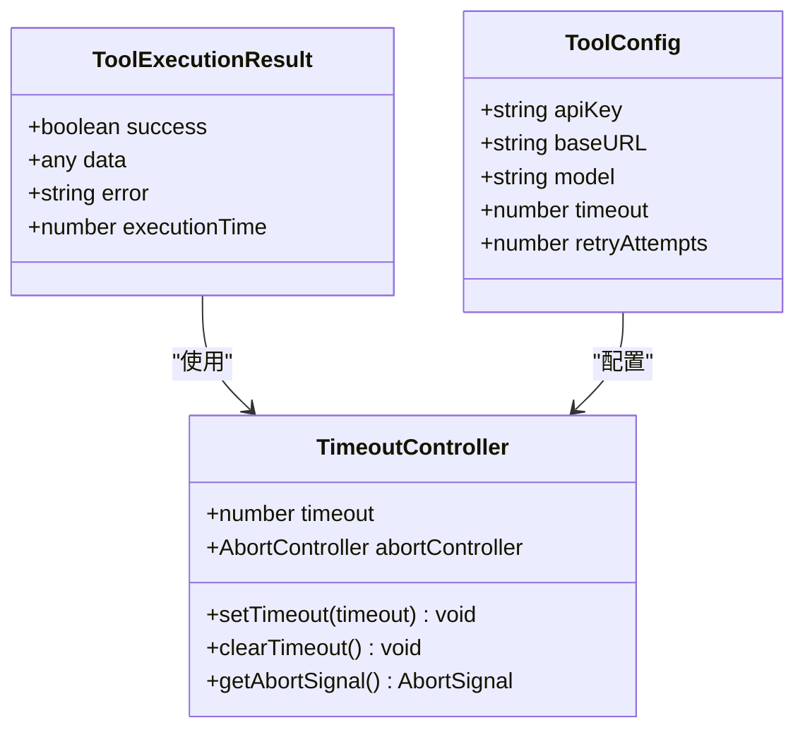

**图表来源**
- [tool-integration.service.ts](file://k.yyup.com/client/aimobile/services/tool-integration.service.ts)
- [tool.types.ts](file://k.yyup.com/server/src/services/ai/tools/types/tool.types.ts)

### 用户反馈机制

系统提供了实时的用户反馈机制，通过SSE流式接口向用户展示操作执行的实时状态。

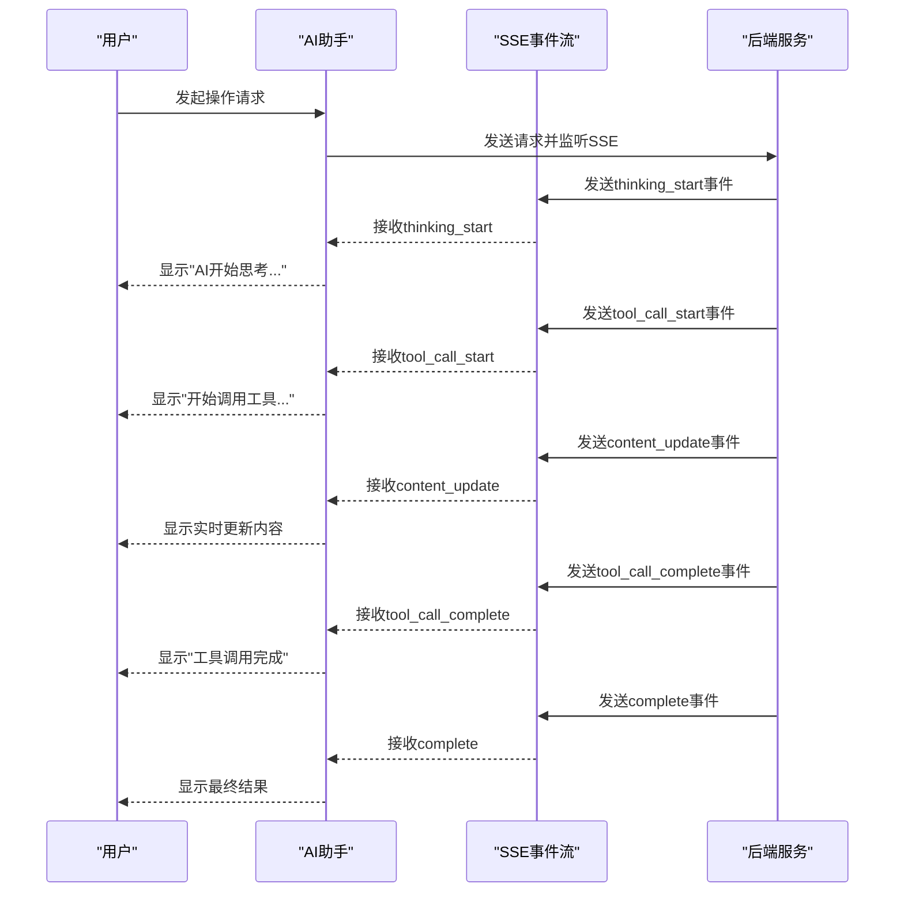

**图表来源**
- [function-tools.ts](file://k.yyup.com/client/src/api/endpoints/function-tools.ts)
- [function-tools.routes.ts](file://k.yyup.com/server/src/routes/ai/function-tools.routes.ts)

**章节来源**
- [function-tools.ts](file://k.yyup.com/client/src/api/endpoints/function-tools.ts)
- [function-tools.routes.ts](file://k.yyup.com/server/src/routes/ai/function-tools.routes.ts)