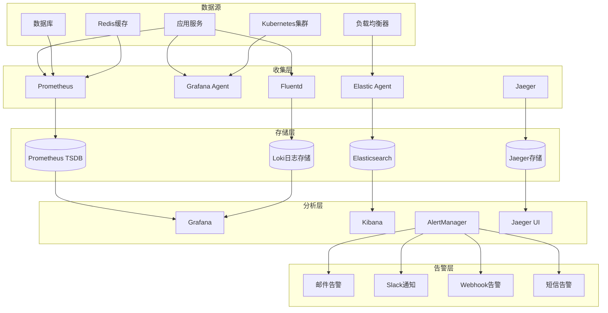
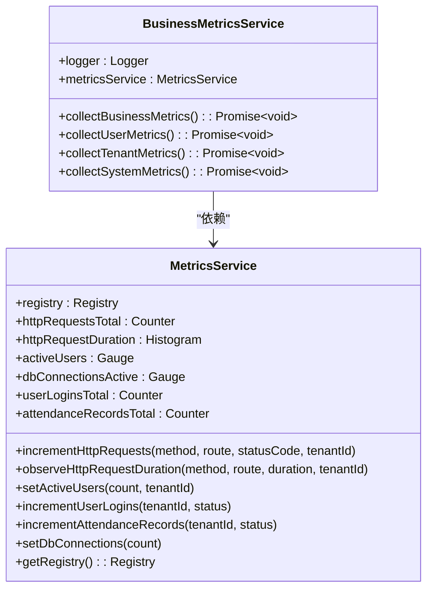
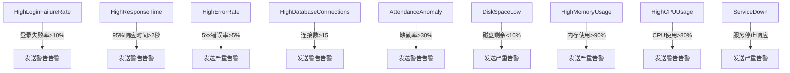
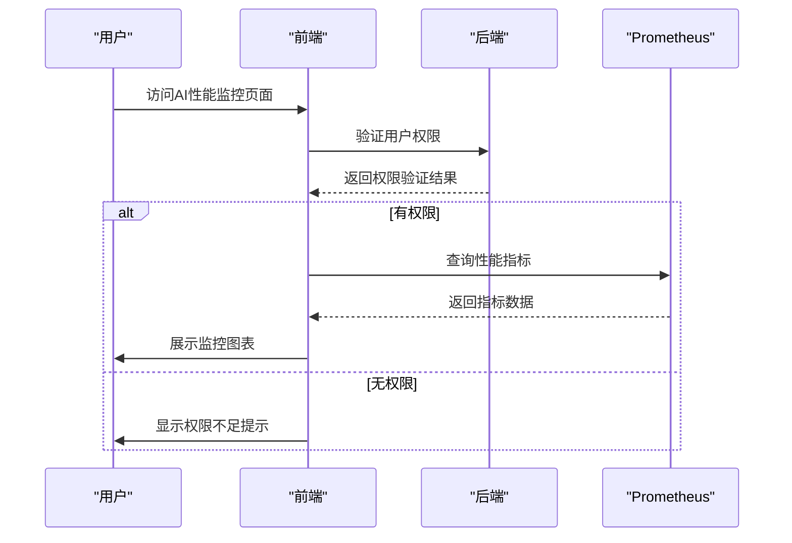

# 执行监控

<cite>
**本文档引用文件**  
- [06-monitoring-and-logging.md](file://docs/wiki/system-architecture-and-deployment/06-monitoring-and-logging.md)
- [add-ai-performance-monitor-permission.sql](file://k.yyup.com/add-ai-performance-monitor-permission.sql)
- [capture-dashboard-logs.cjs](file://k.yyup.com/capture-dashboard-logs.cjs)
- [check-dashboard-errors.ts](file://k.yyup.com/check-dashboard-errors.ts)
- [AIPerformanceMonitor.vue](file://k.yyup.com/client/src/pages/ai/monitoring/AIPerformanceMonitor.vue)
</cite>

## 目录
1. [引言](#引言)
2. [监控体系架构](#监控体系架构)
3. [日志管理机制](#日志管理机制)
4. [性能指标收集](#性能指标收集)
5. [告警系统设计](#告警系统设计)
6. [监控数据分析](#监控数据分析)
7. [可视化反馈与仪表板](#可视化反馈与仪表板)
8. [监控优化建议](#监控优化建议)
9. [总结](#总结)

## 引言

本系统为统一幼儿园管理系统构建了一套完整的AI助手自动化操作执行监控体系，旨在实现对任务执行状态的实时跟踪、异常检测和性能分析。该体系覆盖基础设施、应用服务、业务流程和安全事件等多个维度，通过多层次的日志记录、指标采集和告警机制，确保系统的高可用性和稳定性。本文档详细阐述了监控体系的架构设计、关键组件实现、数据采集方法以及可视化反馈机制。

**Section sources**
- [06-monitoring-and-logging.md](file://docs/wiki/system-architecture-and-deployment/06-monitoring-and-logging.md#L1-L80)

## 监控体系架构

系统采用分层式监控架构，包含数据源、收集层、存储层、分析层和告警层五大组成部分。各层级协同工作，形成闭环的监控流程。



**Diagram sources**
- [06-monitoring-and-logging.md](file://docs/wiki/system-architecture-and-deployment/06-monitoring-and-logging.md#L20-L83)

### 监控目标

系统监控体系主要实现以下五个核心目标：

1. **系统可用性**：持续监控服务的可用性和响应时间，确保关键服务始终在线。
2. **性能指标**：采集CPU、内存、网络、磁盘等资源使用情况，预防性能瓶颈。
3. **业务指标**：跟踪用户活跃度、登录成功率、考勤记录数等关键业务数据。
4. **错误追踪**：捕获并分析错误率、异常堆栈和失败请求，快速定位问题根源。
5. **安全监控**：监测异常登录、未授权访问和数据导出等安全事件，防范潜在威胁。

**Section sources**
- [06-monitoring-and-logging.md](file://docs/wiki/system-architecture-and-deployment/06-monitoring-and-logging.md#L85-L92)

## 日志管理机制

### 日志分类与格式

系统定义了六种主要日志类型，每种类型具有明确的用途和存储期限。所有日志均采用统一的JSON格式，便于解析和分析。

| 日志类型 | 用途 | 格式 | 存储期限 |
|---------|------|------|----------|
| 应用日志 | 应用程序运行日志 | JSON | 30天 |
| 访问日志 | HTTP请求日志 | JSON | 7天 |
| 错误日志 | 错误和异常日志 | JSON | 90天 |
| 审计日志 | 用户操作审计 | JSON | 1年 |
| 系统日志 | 系统服务日志 | 文本 | 30天 |
| 安全日志 | 安全相关日志 | JSON | 1年 |

**标准日志格式示例:**
```json
{
  "timestamp": "2024-12-01T10:30:45.123Z",
  "level": "info",
  "service": "auth-service",
  "version": "1.0.0",
  "tenantId": "tenant_123",
  "userId": "user_456",
  "requestId": "req_789",
  "traceId": "trace_abc",
  "spanId": "span_def",
  "message": "用户登录成功",
  "data": {
    "username": "admin@example.com",
    "ip": "192.168.1.100"
  },
  "error": null,
  "duration": 150,
  "metadata": {
    "userAgent": "Mozilla/5.0...",
    "method": "POST",
    "url": "/api/auth/login"
  }
}
```

**Section sources**
- [06-monitoring-and-logging.md](file://docs/wiki/system-architecture-and-deployment/06-monitoring-and-logging.md#L95-L133)

### 日志收集流程

日志收集主要通过Fluentd实现，其配置包括多个数据源和过滤器。系统通过`tail`插件实时读取应用日志和Nginx访问日志，并自动添加环境变量和主机名等元数据。收集到的日志被发送到Loki进行长期存储，支持高效的日志查询和分析。

**Section sources**
- [06-monitoring-and-logging.md](file://docs/wiki/system-architecture-and-deployment/06-monitoring-and-logging.md#L135-L189)

## 性能指标收集

### Prometheus指标配置

系统使用Prometheus作为核心指标采集和存储系统。通过`MetricsService`类定义了多种关键指标，包括HTTP请求计数器、请求延迟直方图、活跃用户数、数据库连接池状态等。



**Diagram sources**
- [06-monitoring-and-logging.md](file://docs/wiki/system-architecture-and-deployment/06-monitoring-and-logging.md#L197-L309)

### 业务指标实现

`BusinessMetricsCollector`服务通过定时任务（Cron）每24小时执行一次，收集用户、学生、考勤和照片等核心业务数据。这些数据被汇总后发送到监控系统，用于生成业务报表和趋势分析。

**Section sources**
- [06-monitoring-and-logging.md](file://docs/wiki/system-architecture-and-deployment/06-monitoring-and-logging.md#L624-L815)

## 告警系统设计

### AlertManager配置

告警系统基于Prometheus AlertManager构建，支持多渠道通知。系统根据告警级别（critical、warning）和业务服务（auth-service）进行路由，确保告警信息能够准确送达相关人员。

**通知渠道包括：**
- **邮件告警**：发送详细的告警描述和上下文信息。
- **Slack通知**：在`#alerts-critical`和`#alerts-warning`频道实时推送严重告警。
- **Webhook告警**：集成Telegram等第三方消息平台。
- **短信告警**：用于最高优先级的严重故障通知。

**Section sources**
- [06-monitoring-and-logging.md](file://docs/wiki/system-architecture-and-deployment/06-monitoring-and-logging.md#L822-L883)

### 告警规则定义

系统预定义了多项关键告警规则，涵盖服务健康、性能瓶颈和业务异常等场景。



**Diagram sources**
- [06-monitoring-and-logging.md](file://docs/wiki/system-architecture-and-deployment/06-monitoring-and-logging.md#L897-L1016)

## 监控数据分析

### 日志分析查询

通过Kibana平台，运维人员可以执行复杂的日志查询和聚合分析。例如，可以按服务维度统计错误日志数量，或分析用户登录行为的时间分布。

**错误日志分析查询:**
```json
{
  "query": {
    "bool": {
      "must": [
        { "term": { "level": "error" } },
        { "range": { "@timestamp": { "gte": "now-1h" } } }
      ]
    }
  },
  "aggs": {
    "errors_by_service": {
      "terms": {
        "field": "service"
      },
      "aggs": {
        "error_count": {
          "value_count": {
            "field": "message"
          }
        }
      }
    }
  }
}
```

**Section sources**
- [06-monitoring-and-logging.md](file://docs/wiki/system-architecture-and-deployment/06-monitoring-and-logging.md#L1122-L1148)

### 链路追踪实现

系统集成Jaeger实现分布式链路追踪。通过`TracingMiddleware`中间件，每个HTTP请求都会生成一个唯一的`traceId`和`spanId`，并记录请求方法、URL、用户ID等关键信息。当请求失败时，系统会自动标记错误并记录异常日志。

**Section sources**
- [06-monitoring-and-logging.md](file://docs/wiki/system-architecture-and-deployment/06-monitoring-and-logging.md#L1194-L1265)

## 可视化反馈与仪表板

### AI性能监控页面

系统提供了专门的AI性能监控页面（AIPerformanceMonitor.vue），用于展示AI助手的各项性能指标。该页面通过权限控制（`ai-performance-monitor`）确保只有授权用户（如管理员、园长）可以访问。



**Diagram sources**
- [add-ai-performance-monitor-permission.sql](file://k.yyup.com/add-ai-performance-monitor-permission.sql#L5-L99)
- [AIPerformanceMonitor.vue](file://k.yyup.com/client/src/pages/ai/monitoring/AIPerformanceMonitor.vue)

### Grafana仪表板

Grafana仪表板提供了直观的可视化界面，包含多个关键性能指标的图表：

- **请求速率**：显示各服务的每分钟请求数。
- **错误率**：以单值图表展示整体错误率，并根据阈值显示不同颜色（绿色正常，黄色警告，红色严重）。
- **响应时间分布**：使用热力图展示响应时间的分布情况。
- **活跃用户数**：实时统计当前活跃用户数量。
- **数据库连接**：监控数据库连接池的使用情况。
- **考勤记录数**：显示考勤记录的生成速率。

**Section sources**
- [06-monitoring-and-logging.md](file://docs/wiki/system-architecture-and-deployment/06-monitoring-and-logging.md#L1391-L1472)

## 监控优化建议

### 数据采样策略

对于高频日志和指标，建议实施智能采样策略。例如，对于非错误级别的日志，可以按一定比例进行采样，以降低存储和处理成本。同时，对于关键业务操作（如登录、支付），应确保100%记录。

### 存储优化

- **分层存储**：将热数据（最近7天）存储在高性能SSD上，冷数据（超过30天）迁移到成本更低的对象存储。
- **数据压缩**：启用LZ4或Zstandard等高效压缩算法，减少存储空间占用。
- **索引优化**：为常用查询字段（如`service`、`level`、`tenantId`）建立索引，提升查询性能。

### 实时分析技术

- **流式处理**：使用Kafka或Pulsar作为消息队列，结合Flink或Spark Streaming进行实时日志分析。
- **边缘计算**：在客户端或边缘节点进行初步的数据过滤和聚合，减少中心系统的处理压力。
- **机器学习**：应用异常检测算法（如Isolation Forest、LSTM）自动识别异常模式，减少误报和漏报。

**Section sources**
- [06-monitoring-and-logging.md](file://docs/wiki/system-architecture-and-deployment/06-monitoring-and-logging.md#L1018-L1115)

## 总结

本文档全面阐述了统一幼儿园管理系统中AI助手自动化操作的执行监控体系。该体系通过多层次的架构设计，实现了从数据采集、存储、分析到告警的完整闭环。系统不仅能够实时跟踪任务执行状态，还提供了丰富的可视化反馈和深入的分析能力。通过合理的告警策略和优化建议，系统能够有效保障服务的稳定性和业务的连续性，为运维团队提供强有力的支持。