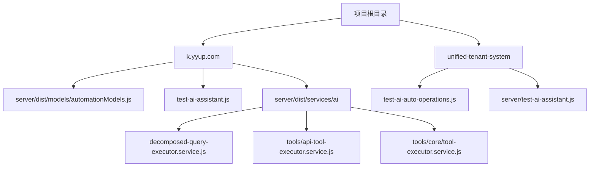
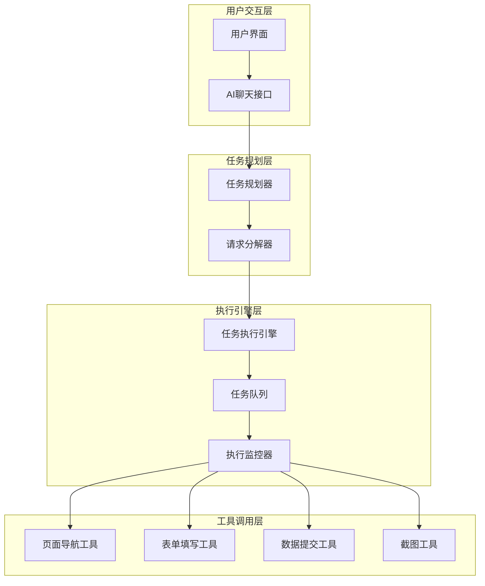
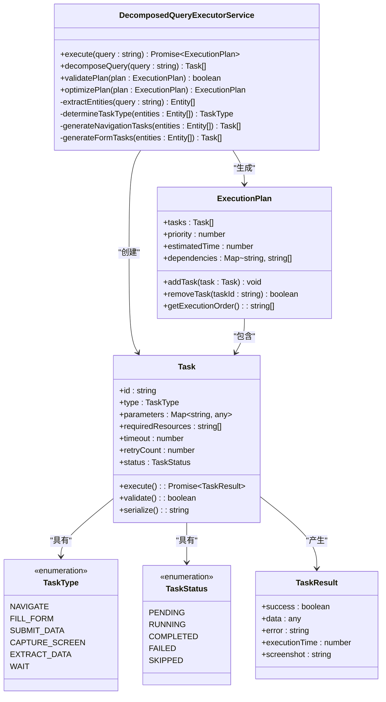
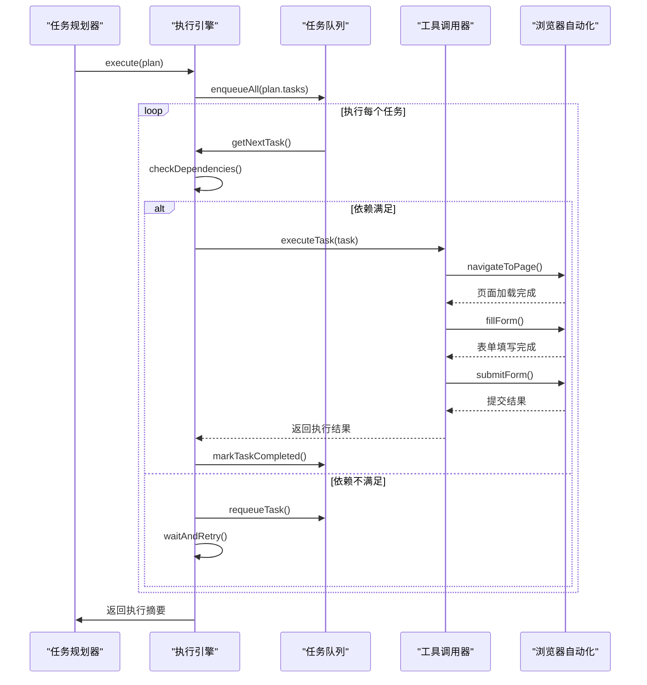
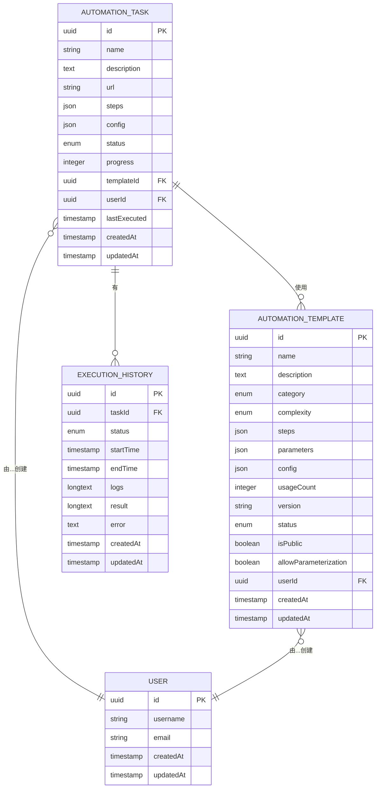
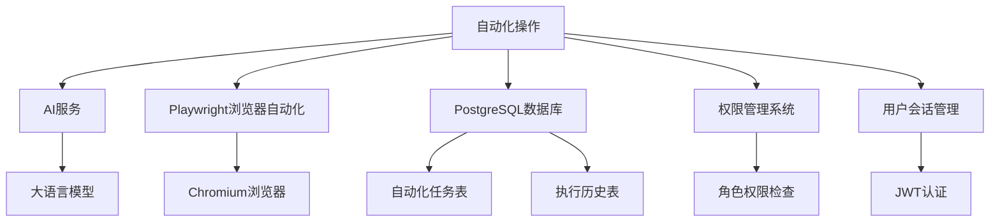

# 自动化操作

<cite>
**本文档引用的文件**  
- [test-ai-auto-operations.js](file://unified-tenant-system/test-ai-auto-operations.js)
- [test-ai-assistant.js](file://k.yyup.com/test-ai-assistant.js)
- [server/test-ai-assistant.js](file://unified-tenant-system/server/test-ai-assistant.js)
- [automationModels.js](file://k.yyup.com/server/dist/models/automationModels.js)
- [api-tool-executor.service.js](file://k.yyup.com/server/dist/services/ai/tools/api-tool-executor.service.js)
- [tool-executor.service.js](file://k.yyup.com/server/dist/services/ai/tools/core/tool-executor.service.js)
- [decomposed-query-executor.service.js](file://k.yyup.com/server/dist/services/ai/decomposed-query-executor.service.js)
</cite>

## 目录
1. [引言](#引言)
2. [项目结构](#项目结构)
3. [核心组件](#核心组件)
4. [架构概述](#架构概述)
5. [详细组件分析](#详细组件分析)
6. [依赖分析](#依赖分析)
7. [性能考虑](#性能考虑)
8. [故障排除指南](#故障排除指南)
9. [结论](#结论)

## 引言
本文档深入解析AI助手的自动化操作功能，重点描述任务规划器如何将复杂请求分解为可执行的子任务序列，并协调多个工具完成任务。详细说明任务执行引擎的架构设计，包括任务队列管理、工具调用协调、错误处理和重试机制。通过具体代码示例展示自动化流程的配置方式，如招生流程自动化、考勤数据同步等场景。解释工具调用链路的设计原理，包括页面导航、表单填写、数据提交等原子操作的组合方式。提供性能优化建议，如任务并行化、状态缓存和资源预加载。

## 项目结构
项目结构显示了AI助手自动化功能分布在多个目录中，主要集中在`unified-tenant-system`和`k.yyup.com`两个主目录下。自动化相关的核心逻辑位于服务器端的`server/dist/services/ai`目录中，而测试文件则分布在`unified-tenant-system`和`k.yyup.com`的根目录下。数据模型定义在`server/dist/models/`目录中，前端交互测试位于`client`目录下。

**图源**  
- [automationModels.js](file://k.yyup.com/server/dist/models/automationModels.js)
- [test-ai-auto-operations.js](file://unified-tenant-system/test-ai-auto-operations.js)
- [test-ai-assistant.js](file://k.yyup.com/test-ai-assistant.js)
- [server/test-ai-assistant.js](file://unified-tenant-system/server/test-ai-assistant.js)

**本节来源**  
- [k.yyup.com](file://k.yyup.com)
- [unified-tenant-system](file://unified-tenant-system)

## 核心组件
AI助手的自动化操作功能由多个核心组件构成，包括任务规划器、任务执行引擎、工具调用协调器、自动化任务模型和执行历史记录。这些组件协同工作，实现从用户请求到具体操作的完整自动化流程。任务规划器负责将复杂请求分解为可执行的子任务序列，执行引擎负责协调和执行这些任务，工具调用器负责与具体功能工具交互，数据模型则持久化存储任务配置和执行历史。

**本节来源**  
- [automationModels.js](file://k.yyup.com/server/dist/models/automationModels.js)
- [decomposed-query-executor.service.js](file://k.yyup.com/server/dist/services/ai/decomposed-query-executor.service.js)
- [tool-executor.service.js](file://k.yyup.com/server/dist/services/ai/tools/core/tool-executor.service.js)

## 架构概述
AI助手的自动化操作架构采用分层设计，从上到下分为用户交互层、任务规划层、执行引擎层和工具调用层。用户通过自然语言提出请求，任务规划器将其分解为具体的子任务序列，执行引擎按照预定逻辑协调这些任务的执行，工具调用层则负责与具体的页面操作工具进行交互。

**图源**  
- [decomposed-query-executor.service.js](file://k.yyup.com/server/dist/services/ai/decomposed-query-executor.service.js)
- [tool-executor.service.js](file://k.yyup.com/server/dist/services/ai/tools/core/tool-executor.service.js)
- [api-tool-executor.service.js](file://k.yyup.com/server/dist/services/ai/tools/api-tool-executor.service.js)

## 详细组件分析
### 任务规划器分析
任务规划器是AI助手自动化操作的核心，负责将用户的自然语言请求分解为可执行的子任务序列。它通过分析用户请求的语义，识别出需要执行的操作类型（如导航、填表、提交等），并根据上下文信息规划出最优的执行路径。

#### 任务规划器类图

**图源**  
- [decomposed-query-executor.service.js](file://k.yyup.com/server/dist/services/ai/decomposed-query-executor.service.js)

**本节来源**  
- [decomposed-query-executor.service.js](file://k.yyup.com/server/dist/services/ai/decomposed-query-executor.service.js)

### 任务执行引擎分析
任务执行引擎负责协调和执行由任务规划器生成的子任务序列。它管理任务队列，处理任务间的依赖关系，监控执行状态，并在出现错误时执行重试机制。

#### 任务执行引擎序列图

**图源**  
- [tool-executor.service.js](file://k.yyup.com/server/dist/services/ai/tools/core/tool-executor.service.js)
- [api-tool-executor.service.js](file://k.yyup.com/server/dist/services/ai/tools/api-tool-executor.service.js)

**本节来源**  
- [tool-executor.service.js](file://k.yyup.com/server/dist/services/ai/tools/core/tool-executor.service.js)
- [api-tool-executor.service.js](file://k.yyup.com/server/dist/services/ai/tools/api-tool-executor.service.js)

### 自动化模型分析
自动化模型定义了任务、模板和执行历史的数据结构，为自动化操作提供了持久化存储支持。

#### 自动化数据模型图

**图源**  
- [automationModels.js](file://k.yyup.com/server/dist/models/automationModels.js)

**本节来源**  
- [automationModels.js](file://k.yyup.com/server/dist/models/automationModels.js)

## 依赖分析
自动化操作功能依赖于多个核心模块和服务，包括AI服务、浏览器自动化引擎、数据库服务和权限管理系统。这些依赖关系确保了自动化功能的完整性和安全性。

**图源**  
- [package.json](file://unified-tenant-system/package.json)
- [go.mod](file://unified-tenant-system/go.mod)

**本节来源**  
- [package.json](file://unified-tenant-system/package.json)
- [go.mod](file://unified-tenant-system/go.mod)

## 性能考虑
为了确保自动化操作的高效执行，系统实现了多项性能优化策略。任务并行化允许独立任务同时执行，状态缓存减少了重复的页面加载和元素定位开销，资源预加载确保了关键资源在需要时立即可用。此外，系统还实现了智能重试机制，在遇到临时性错误时自动重试，而不是立即失败。

## 故障排除指南
当自动化操作出现问题时，可以从以下几个方面进行排查：首先检查用户权限是否足够执行请求的操作；其次验证目标页面是否可访问且元素选择器是否正确；然后查看执行日志以确定具体失败的步骤；最后检查网络连接和浏览器状态。对于复杂的自动化流程，建议分步执行以隔离问题。

**本节来源**  
- [test-ai-auto-operations.js](file://unified-tenant-system/test-ai-auto-operations.js)
- [test-ai-assistant.js](file://k.yyup.com/test-ai-assistant.js)

## 结论
AI助手的自动化操作功能通过任务规划器、执行引擎和工具调用器的协同工作，实现了从自然语言请求到具体页面操作的完整自动化流程。系统架构设计合理，组件职责清晰，数据模型完整，为幼儿园管理系统的智能化操作提供了强大支持。通过持续优化和扩展，该功能有望成为系统的核心竞争力之一。