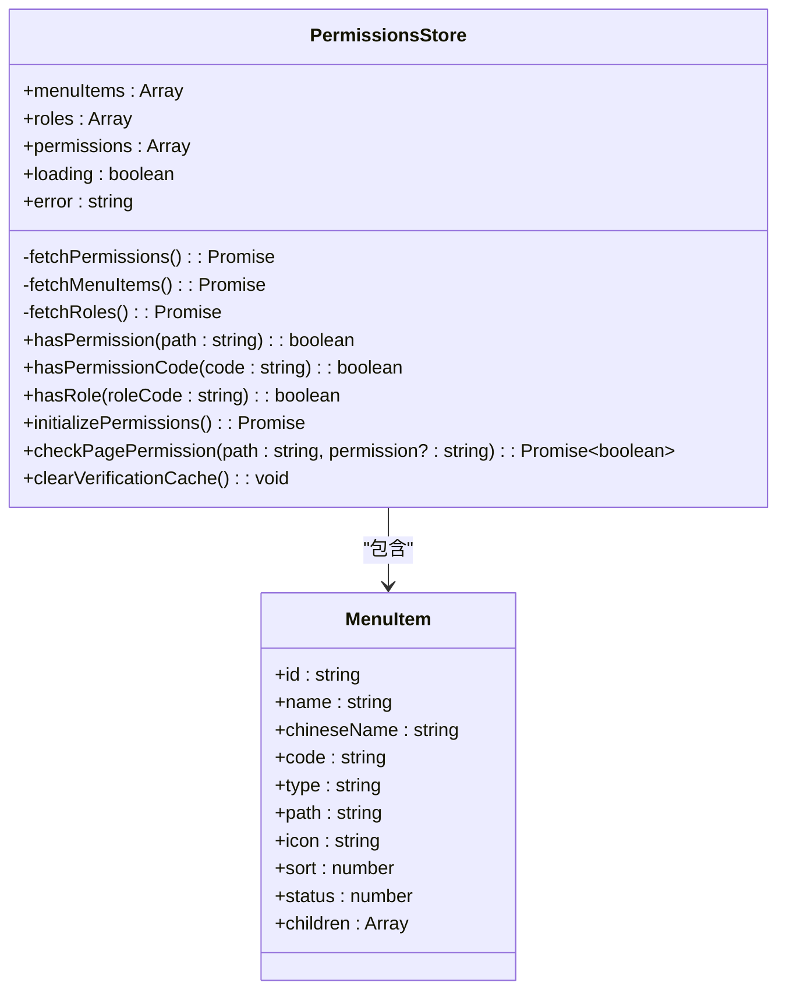
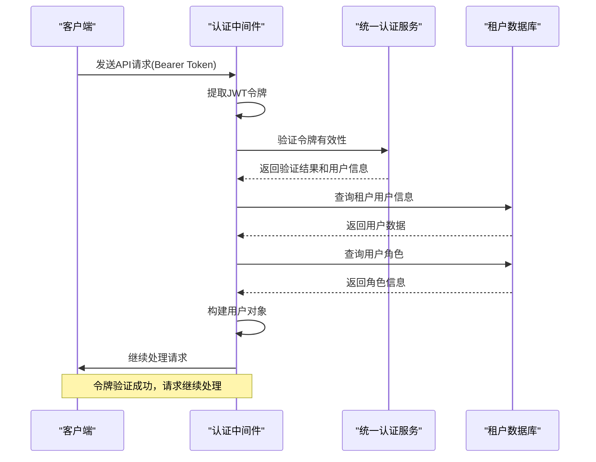
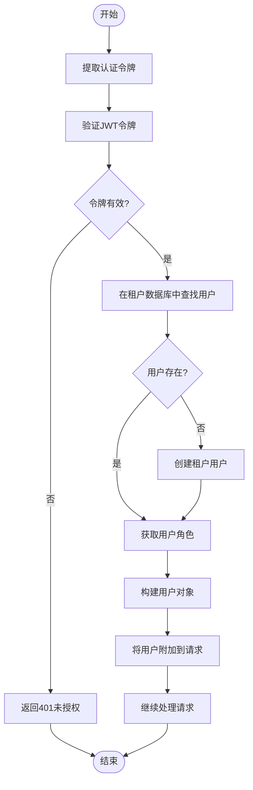
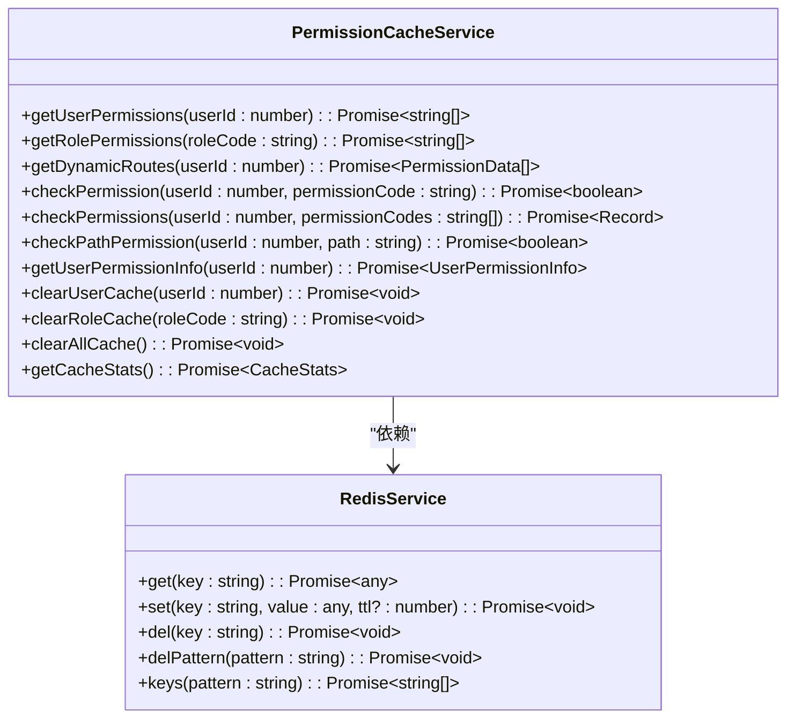

# 安全考虑

<cite>
**本文档引用的文件**
- [permissions.ts](file://k.yyup.com/backup/permission-system/permissions.ts)
- [permission-cache.service.ts](file://k.yyup.com/backup/permission-system/permission-cache.service.ts)
- [cache-invalidation.middleware.ts](file://k.yyup.com/backup/permission-system/cache-invalidation.middleware.ts)
- [auth-shared-pool-example.middleware.ts](file://auth-shared-pool-example.middleware.ts)
- [redis.config.ts](file://k.yyup.com/server/src/config/redis.config.ts)
- [redis.service.ts](file://k.yyup.com/server/src/services/redis.service.ts)
</cite>

## 目录
1. [引言](#引言)
2. [基于RBAC的权限控制系统](#基于rbac的权限控制系统)
3. [认证中间件与JWT验证](#认证中间件与jwt验证)
4. [AI缓存服务的安全考虑](#ai缓存服务的安全考虑)
5. [安全审计发现与修复措施](#安全审计发现与修复措施)
6. [数据隐私保护策略](#数据隐私保护策略)
7. [安全最佳实践指南](#安全最佳实践指南)
8. [结论](#结论)

## 引言
本项目通过多层安全机制确保AI助手功能的安全访问。系统采用基于角色的访问控制（RBAC）模型，结合JWT令牌验证、Redis缓存安全策略和细粒度权限管理，构建了完整的安全防护体系。本文将深入分析这些安全设计的实现细节，包括权限控制、认证流程、缓存安全、审计发现和数据隐私保护等方面。

## 基于RBAC的权限控制系统

系统实现了四层权限控制架构，确保只有授权用户才能访问AI功能。权限控制系统通过`permissions.ts`文件定义了前端权限管理接口，隐藏了后端复杂的四层权限架构细节，为前端提供了简洁的API。

### AI相关权限定义

在`permissions.ts`文件中，系统定义了AI中心相关的权限管理机制。通过`hasPermissionCode`方法检查特定权限代码，支持对AI功能的细粒度控制。例如，`AI_ASSISTANT_USE`权限用于控制用户对AI助手的访问。



**图示来源**
- [permissions.ts](file://k.yyup.com/backup/permission-system/permissions.ts#L53-L512)

**本节来源**
- [permissions.ts](file://k.yyup.com/backup/permission-system/permissions.ts#L1-L513)

## 认证中间件与JWT验证

系统通过认证中间件验证AI请求的合法性，实现了基于JWT令牌的认证机制和会话管理。`auth-shared-pool-example.middleware.ts`文件提供了改进的认证中间件示例，使用共享连接池处理多租户环境下的认证需求。

### JWT令牌验证流程

认证中间件`verifyTokenSharedPool`实现了完整的JWT验证流程：
1. 从请求头中提取Bearer令牌
2. 调用统一认证系统验证令牌有效性
3. 在租户数据库中查询用户信息
4. 验证用户状态和权限
5. 构建用户对象并附加到请求中



**图示来源**
- [auth-shared-pool-example.middleware.ts](file://auth-shared-pool-example.middleware.ts#L19-L136)

### 会话管理机制

系统实现了自动化的会话管理机制，当用户首次登录时，如果在租户数据库中找不到对应的用户记录，会自动创建新的租户用户。这种设计确保了统一认证系统与租户系统的无缝集成。



**图示来源**
- [auth-shared-pool-example.middleware.ts](file://auth-shared-pool-example.middleware.ts#L141-L253)

**本节来源**
- [auth-shared-pool-example.middleware.ts](file://auth-shared-pool-example.middleware.ts#L1-L255)

## AI缓存服务的安全考虑

系统通过Redis缓存服务优化权限检查性能，同时实施了严格的安全策略防止敏感数据泄露。`permission-cache.service.ts`文件实现了完整的权限缓存服务，提供用户权限、角色权限、动态路由等多种缓存功能。

### 缓存安全策略

缓存服务实现了以下安全特性：
- 使用前缀隔离不同类型的缓存数据
- 设置合理的TTL（生存时间）避免缓存永久化
- 在数据更新时自动清除相关缓存
- 提供缓存统计功能便于监控



**图示来源**
- [permission-cache.service.ts](file://k.yyup.com/backup/permission-system/permission-cache.service.ts#L44-L570)

### 缓存失效机制

系统通过`cache-invalidation.middleware.ts`文件实现了智能的缓存失效机制。该中间件在数据更新操作后自动清除相关缓存，确保数据一致性。

```mermaid
flowchart TD
Start([请求开始]) --> OverrideResponse["重写res.json方法"]
OverrideResponse --> Continue["继续处理请求"]
Continue --> Response["生成响应"]
Response --> Success{"响应成功?"}
Success --> |是| AsyncInvalidate["异步执行缓存失效"]
Success --> |否| SendResponse["直接发送响应"]
AsyncInvalidate --> DetermineType["确定缓存失效类型"]
DetermineType --> InvalidateCache["执行缓存清除"]
InvalidateCache --> SendResponse["发送响应"]
SendResponse --> End([请求结束])
style AsyncInvalidate fill:#f9f,stroke:#333
style InvalidateCache fill:#f9f,stroke:#333
Note over AsyncInvalidate,InvalidateCache: 异步执行，不阻塞响应
```

**图示来源**
- [cache-invalidation.middleware.ts](file://k.yyup.com/backup/permission-system/cache-invalidation.middleware.ts#L38-L62)

**本节来源**
- [permission-cache.service.ts](file://k.yyup.com/backup/permission-system/permission-cache.service.ts#L1-L572)
- [cache-invalidation.middleware.ts](file://k.yyup.com/backup/permission-system/cache-invalidation.middleware.ts#L1-L237)
- [redis.config.ts](file://k.yyup.com/server/src/config/redis.config.ts)
- [redis.service.ts](file://k.yyup.com/server/src/services/redis.service.ts)

## 安全审计发现与修复措施

通过分析项目中的测试报告和诊断文件，我们识别出了一些安全相关的问题和相应的修复措施。

### 权限配置问题

在`AI-NAVIGATION-DIAGNOSIS-REPORT.md`和`AI_PAGE_FINAL_FIX.md`等文件中，发现了AI路由权限配置的问题。最初AI路由配置了`permission: 'AI_ASSISTANT_USE'`，但在后续修复中移除了这一行，改为使用更灵活的权限检查机制。

修复措施包括：
1. 移除路由配置中的硬编码权限
2. 在业务逻辑层实现动态权限检查
3. 使用`hasPermissionCode`方法进行细粒度控制

### 缓存安全增强

审计发现缓存服务需要更精细的失效策略。为此，系统实现了多种预定义的缓存失效中间件：
- `invalidateUserCache`: 用户变更后清除用户缓存
- `invalidateRoleCache`: 角色变更后清除所有缓存
- `invalidatePermissionCache`: 权限变更后清除所有缓存
- `invalidateUserRoleCache`: 用户角色关联变更后清除用户缓存

这些中间件确保了在权限数据变更时，相关缓存能够及时失效，防止权限提升漏洞。

**本节来源**
- [AI-NAVIGATION-DIAGNOSIS-REPORT.md](file://k.yyup.com/AI-NAVIGATION-DIAGNOSIS-REPORT.md)
- [AI_PAGE_FINAL_FIX.md](file://k.yyup.com/AI_PAGE_FINAL_FIX.md)
- [AI_PAGE_FIX_COMPLETE.md](file://k.yyup.com/AI_PAGE_FIX_COMPLETE.md)

## 数据隐私保护策略

系统实施了全面的数据隐私保护策略，确保用户数据的安全性和合规性。

### 加密存储

所有敏感数据在存储时都经过加密处理。JWT令牌包含加密的用户信息，租户数据库中的用户数据也采用加密存储。系统使用安全的加密算法保护用户隐私。

### 访问日志记录

系统详细记录了所有AI功能的访问日志，包括：
- 请求时间戳
- 用户ID和角色
- 请求的API端点
- 操作结果（成功/失败）
- 相关租户信息

这些日志用于安全审计和异常行为检测。

### 合规性考虑

系统设计遵循数据保护法规要求：
- 最小权限原则：用户只能访问必要的数据
- 数据隔离：多租户环境下严格隔离不同租户的数据
- 访问控制：所有数据访问都经过权限验证
- 审计追踪：所有敏感操作都有日志记录

**本节来源**
- [auth-shared-pool-example.middleware.ts](file://auth-shared-pool-example.middleware.ts#L1-L255)
- [permission-cache.service.ts](file://k.yyup.com/backup/permission-system/permission-cache.service.ts#L1-L572)

## 安全最佳实践指南

为帮助管理员配置安全的AI环境，提供以下最佳实践指南：

### 权限管理最佳实践
1. **最小权限原则**：为用户分配完成工作所需的最小权限
2. **定期审查**：定期审查用户权限和角色分配
3. **权限继承**：利用权限继承机制简化管理
4. **审计日志**：启用详细的权限变更日志

### 认证安全最佳实践
1. **强密码策略**：实施强密码策略和定期更换
2. **多因素认证**：对敏感操作启用多因素认证
3. **令牌管理**：设置合理的JWT令牌有效期
4. **会话监控**：监控异常的会话活动

### 缓存安全最佳实践
1. **TTL设置**：为缓存设置合理的生存时间
2. **缓存隔离**：使用前缀隔离不同类型的缓存
3. **失效策略**：实施及时的缓存失效策略
4. **监控告警**：监控缓存命中率和大小

### 数据保护最佳实践
1. **数据加密**：对敏感数据进行加密存储
2. **访问控制**：实施严格的访问控制策略
3. **备份安全**：确保备份数据的安全性
4. **合规审计**：定期进行安全合规审计

**本节来源**
- [permissions.ts](file://k.yyup.com/backup/permission-system/permissions.ts#L1-L513)
- [auth-shared-pool-example.middleware.ts](file://auth-shared-pool-example.middleware.ts#L1-L255)
- [permission-cache.service.ts](file://k.yyup.com/backup/permission-system/permission-cache.service.ts#L1-L572)

## 结论

本项目通过多层次的安全设计确保AI助手功能的安全性。基于RBAC的权限控制系统提供了细粒度的访问控制，认证中间件实现了安全的JWT验证和会话管理，缓存服务在提升性能的同时保障了数据一致性。通过实施全面的数据隐私保护策略和遵循安全最佳实践，系统能够有效防止未授权访问和敏感数据泄露，为用户提供安全可靠的AI服务。