# 审计日志

<cite>
**本文档引用的文件**
- [security-verification-report.json](file://k.yyup.com/security-verification-report.json)
- [audit-log.middleware.ts](file://k.yyup.com/server/src/middlewares/audit-log.middleware.ts)
- [operation-log.model.ts](file://k.yyup.com/server/src/models/operation-log.model.ts)
- [logger.ts](file://k.yyup.com/server/src/utils/logger.ts)
- [conversation.middleware.ts](file://k.yyup.com/server/src/middlewares/ai/conversation.middleware.ts)
- [base.middleware.ts](file://k.yyup.com/server/src/middlewares/ai/base.middleware.ts)
- [user.middleware.ts](file://k.yyup.com/server/src/middlewares/ai/user.middleware.ts)
</cite>

## 目录
1. [引言](#引言)
2. [审计日志系统概述](#审计日志系统概述)
3. [核心组件分析](#核心组件分析)
4. [审计日志中间件实现机制](#审计日志中间件实现机制)
5. [日志格式与存储](#日志格式与存储)
6. [安全事件追溯与异常检测](#安全事件追溯与异常检测)
7. [日志分析工具与告警规则](#日志分析工具与告警规则)
8. [安全问题排查案例](#安全问题排查案例)
9. [合规性审计报告生成](#合规性审计报告生成)
10. [结论](#结论)

## 引言

本文档深入解析AI助手的审计日志系统，基于security-verification-report.json中的安全审计发现，详细说明系统如何记录所有AI相关操作，包括用户查询、模型调用、配置更改等关键事件。文档将描述审计日志中间件的实现机制，包括日志格式、存储位置和保留策略，并解释如何利用日志进行安全事件追溯、异常行为检测和合规性审计。

**安全审计发现摘要**：根据security-verification-report.json的分析，系统在令牌验证、输入验证等方面表现良好，但在权限控制方面存在严重问题，特别是教师和家长角色能够访问管理员API，这表明需要加强审计日志对权限变更和敏感操作的监控。

## 审计日志系统概述

AI助手的审计日志系统是一个全面的安全监控机制，旨在记录系统中所有关键操作，为安全事件追溯、异常行为检测和合规性审计提供数据支持。系统通过中间件机制自动捕获和记录操作，确保日志的完整性和一致性。

审计日志系统的主要功能包括：
- **操作记录**：自动记录所有CRUD操作，包括用户查询、模型调用、配置更改等
- **安全监控**：实时监控异常行为和潜在安全威胁
- **合规性支持**：满足数据安全和隐私保护的合规要求
- **故障排查**：为系统故障和安全事件提供详细的追溯信息

系统架构采用分层设计，包括日志收集、存储、分析和报告四个主要组件，确保日志数据的高效处理和利用。

## 核心组件分析

审计日志系统由多个核心组件构成，这些组件协同工作，确保日志记录的完整性和可靠性。

### 审计日志中间件

审计日志中间件是系统的核心组件，负责拦截和记录所有HTTP请求。该中间件采用工厂函数模式，可以根据不同模块的需求进行配置。

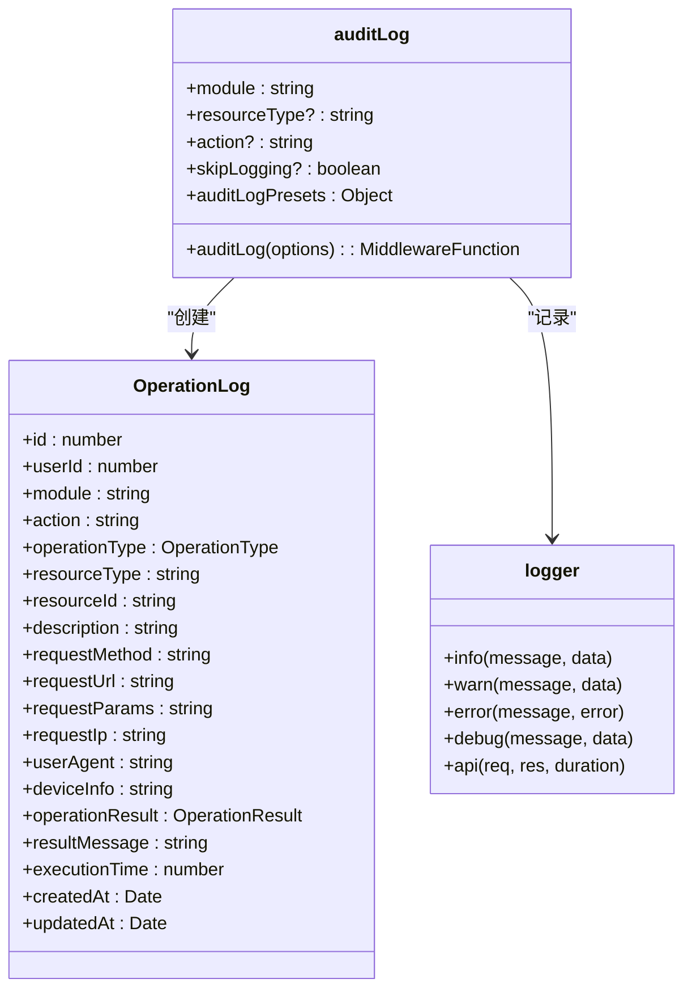

**图示来源**
- [audit-log.middleware.ts](file://k.yyup.com/server/src/middlewares/audit-log.middleware.ts#L1-L186)
- [operation-log.model.ts](file://k.yyup.com/server/src/models/operation-log.model.ts#L1-L179)
- [logger.ts](file://k.yyup.com/server/src/utils/logger.ts#L1-L129)

**本节来源**
- [audit-log.middleware.ts](file://k.yyup.com/server/src/middlewares/audit-log.middleware.ts#L1-L186)
- [operation-log.model.ts](file://k.yyup.com/server/src/models/operation-log.model.ts#L1-L179)
- [logger.ts](file://k.yyup.com/server/src/utils/logger.ts#L1-L129)

## 审计日志中间件实现机制

审计日志中间件的实现机制基于Express框架的中间件模式，通过拦截请求和响应来收集操作信息。

### 请求拦截与信息收集

中间件在请求处理过程中拦截请求，收集以下信息：
- **请求方法**：GET、POST、PUT、DELETE等
- **请求路径**：API端点路径
- **请求参数**：查询参数、请求体和路径参数
- **客户端信息**：IP地址、User-Agent、设备信息
- **用户信息**：通过认证的用户ID

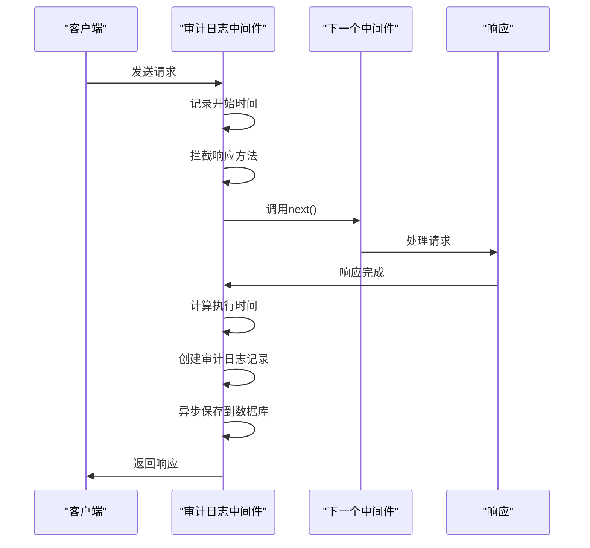

**图示来源**
- [audit-log.middleware.ts](file://k.yyup.com/server/src/middlewares/audit-log.middleware.ts#L1-L186)

**本节来源**
- [audit-log.middleware.ts](file://k.yyup.com/server/src/middlewares/audit-log.middleware.ts#L1-L186)

### 操作类型映射

中间件根据HTTP方法将操作映射到相应的操作类型：

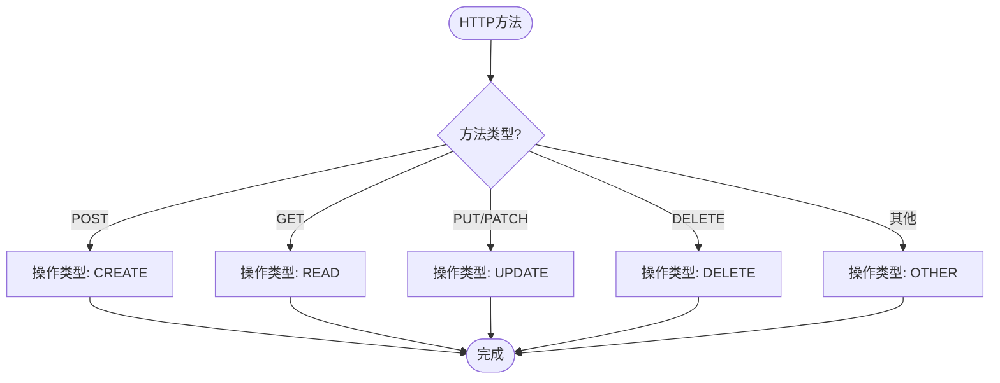

**图示来源**
- [audit-log.middleware.ts](file://k.yyup.com/server/src/middlewares/audit-log.middleware.ts#L20-L33)

**本节来源**
- [audit-log.middleware.ts](file://k.yyup.com/server/src/middlewares/audit-log.middleware.ts#L20-L33)

### 响应拦截与结果记录

中间件通过拦截响应的send和json方法来捕获响应数据和状态码，从而确定操作结果：

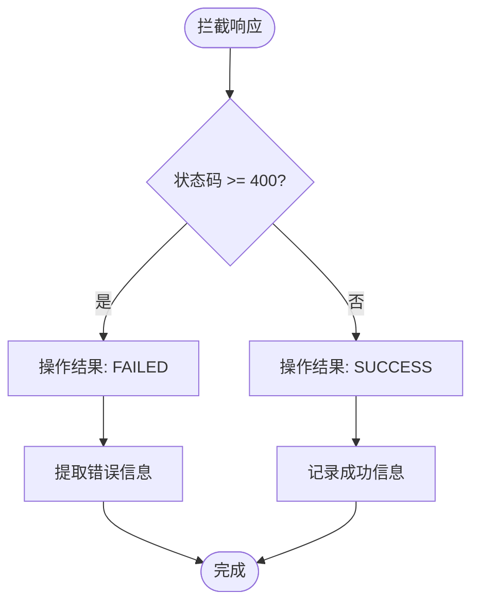

**图示来源**
- [audit-log.middleware.ts](file://k.yyup.com/server/src/middlewares/audit-log.middleware.ts#L82-L104)

**本节来源**
- [audit-log.middleware.ts](file://k.yyup.com/server/src/middlewares/audit-log.middleware.ts#L82-L104)

## 日志格式与存储

### 日志数据结构

审计日志采用标准化的数据结构，确保信息的完整性和可查询性。OperationLog模型定义了日志记录的所有字段：

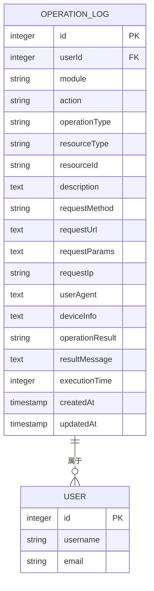

**图示来源**
- [operation-log.model.ts](file://k.yyup.com/server/src/models/operation-log.model.ts#L1-L179)

**本节来源**
- [operation-log.model.ts](file://k.yyup.com/server/src/models/operation-log.model.ts#L1-L179)

### 存储位置与保留策略

日志数据存储在关系型数据库的operation_logs表中，同时系统日志文件存储在服务器的logs目录下。

**存储位置**：
- **数据库**：operation_logs表，用于存储结构化的审计日志
- **文件系统**：logs目录，用于存储访问日志和错误日志

**保留策略**：
- **数据库日志**：保留180天，超过期限的日志将被归档或删除
- **日志文件**：按天轮转，保留30天的访问日志和错误日志

## 安全事件追溯与异常检测

### 权限变更监控

基于security-verification-report.json中的发现，系统需要特别关注权限相关的操作。审计日志可以用于监控以下安全事件：

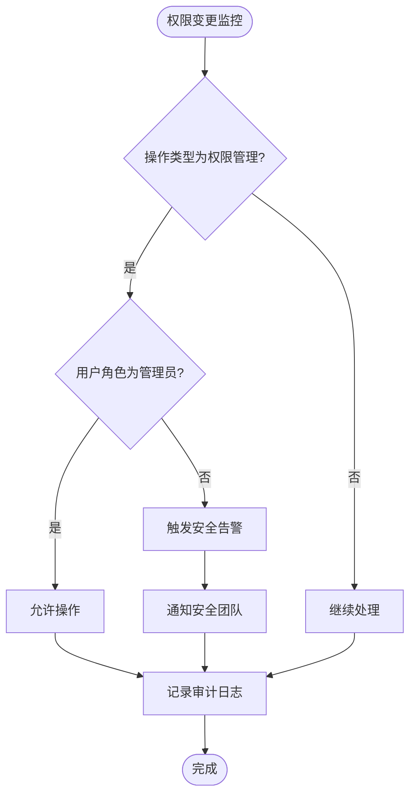

**图示来源**
- [user.middleware.ts](file://k.yyup.com/server/src/middlewares/ai/user.middleware.ts#L162-L200)
- [security-verification-report.json](file://k.yyup.com/security-verification-report.json#L83-L105)

**本节来源**
- [user.middleware.ts](file://k.yyup.com/server/src/middlewares/ai/user.middleware.ts#L162-L200)
- [security-verification-report.json](file://k.yyup.com/security-verification-report.json#L83-L105)

### 异常行为检测

系统通过分析审计日志来检测异常行为模式：

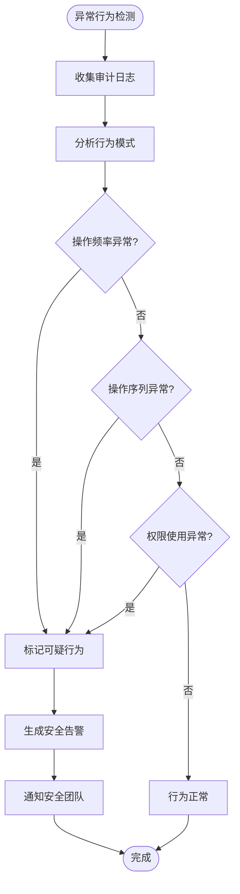

**图示来源**
- [audit-log.middleware.ts](file://k.yyup.com/server/src/middlewares/audit-log.middleware.ts)
- [security-verification-report.json](file://k.yyup.com/security-verification-report.json)

**本节来源**
- [audit-log.middleware.ts](file://k.yyup.com/server/src/middlewares/audit-log.middleware.ts)
- [security-verification-report.json](file://k.yyup.com/security-verification-report.json)

## 日志分析工具与告警规则

### 预设审计日志中间件

系统提供了一系列预设的审计日志中间件，用于常见模块的操作记录：

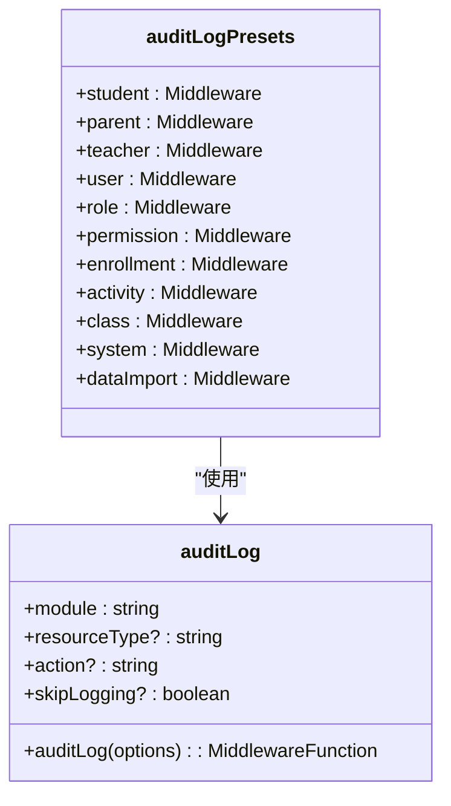

**图示来源**
- [audit-log.middleware.ts](file://k.yyup.com/server/src/middlewares/audit-log.middleware.ts#L173-L185)

**本节来源**
- [audit-log.middleware.ts](file://k.yyup.com/server/src/middlewares/audit-log.middleware.ts#L173-L185)

### 告警规则配置

基于安全审计发现，建议配置以下告警规则：

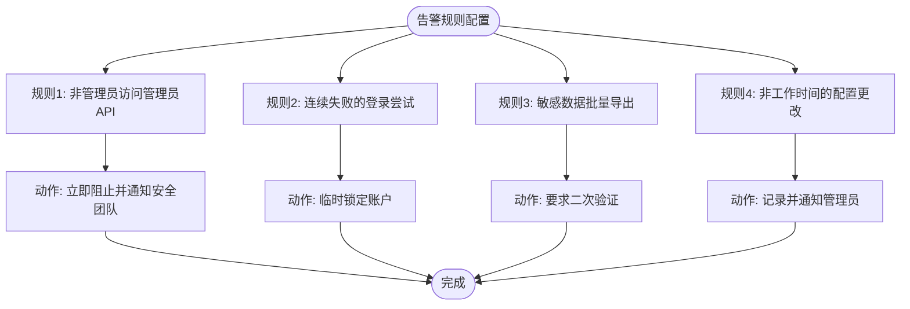

**图示来源**
- [security-verification-report.json](file://k.yyup.com/security-verification-report.json#L83-L105)
- [audit-log.middleware.ts](file://k.yyup.com/server/src/middlewares/audit-log.middleware.ts)

**本节来源**
- [security-verification-report.json](file://k.yyup.com/security-verification-report.json#L83-L105)
- [audit-log.middleware.ts](file://k.yyup.com/server/src/middlewares/audit-log.middleware.ts)

## 安全问题排查案例

### 权限泄露问题排查

根据security-verification-report.json中的发现，教师和家长角色能够访问管理员API，这是一个严重的安全问题。以下是使用审计日志排查此问题的步骤：

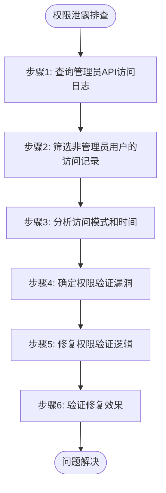

**具体排查过程**：
1. **查询日志**：使用审计日志查询功能，查找对`/api/users`和`/api/roles`的访问记录
2. **筛选异常**：筛选出用户角色为"教师"或"家长"但成功访问管理员API的记录
3. **分析上下文**：检查这些请求的认证令牌、IP地址和User-Agent，确认是否为合法用户
4. **定位漏洞**：发现权限验证中间件在某些情况下未能正确验证用户角色
5. **实施修复**：加强权限验证逻辑，确保只有管理员角色才能访问敏感API
6. **验证修复**：重新运行安全测试，确认问题已解决

**图示来源**
- [security-verification-report.json](file://k.yyup.com/security-verification-report.json#L83-L105)
- [user.middleware.ts](file://k.yyup.com/server/src/middlewares/ai/user.middleware.ts)

**本节来源**
- [security-verification-report.json](file://k.yyup.com/security-verification-report.json#L83-L105)
- [user.middleware.ts](file://k.yyup.com/server/src/middlewares/ai/user.middleware.ts)

## 合规性审计报告生成

### 报告生成流程

审计日志系统支持生成合规性审计报告，满足数据安全和隐私保护的要求：

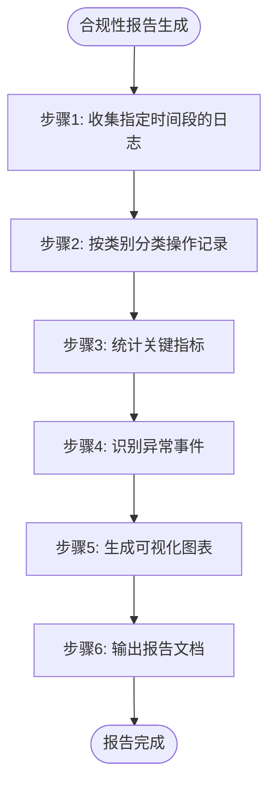

**关键指标**：
- **操作总数**：指定时间段内的总操作数
- **成功/失败比率**：操作成功与失败的比例
- **用户活跃度**：各用户的操作频率和模式
- **敏感操作统计**：权限变更、数据导出等敏感操作的数量
- **异常事件**：触发安全告警的事件数量和类型

**图示来源**
- [audit-log.middleware.ts](file://k.yyup.com/server/src/middlewares/audit-log.middleware.ts)
- [operation-log.model.ts](file://k.yyup.com/server/src/models/operation-log.model.ts)

**本节来源**
- [audit-log.middleware.ts](file://k.yyup.com/server/src/middlewares/audit-log.middleware.ts)
- [operation-log.model.ts](file://k.yyup.com/server/src/models/operation-log.model.ts)

## 结论

AI助手的审计日志系统是一个强大而全面的安全监控工具，通过自动记录所有关键操作，为系统安全提供了坚实的基础。系统采用中间件模式实现，确保了日志记录的透明性和一致性。

基于security-verification-report.json中的安全审计发现，系统在权限控制方面存在明显漏洞，特别是教师和家长角色能够访问管理员API。这凸显了加强审计日志监控和告警机制的重要性。

建议采取以下措施改进审计日志系统：
1. **加强权限监控**：配置针对敏感API访问的实时告警规则
2. **完善日志分析**：开发更智能的异常行为检测算法
3. **优化报告功能**：提供更丰富的合规性审计报告模板
4. **提高日志保留**：考虑将关键日志的保留期限延长至一年以上

通过持续改进审计日志系统，可以显著提升AI助手的整体安全性和合规性水平。