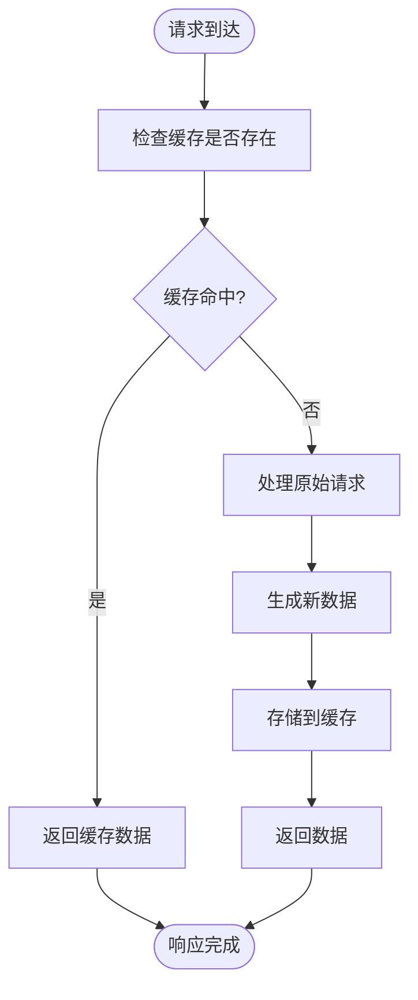
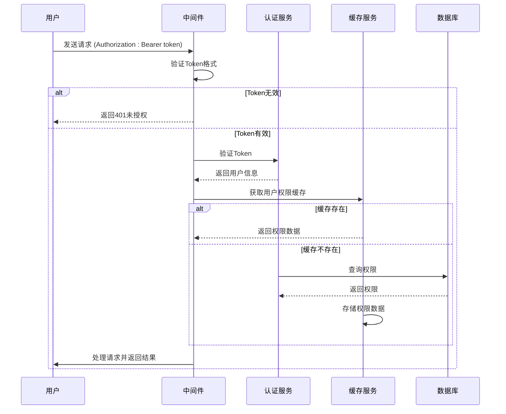

# 数据安全

<cite>
**本文档中引用的文件**  
- [security.json](file://k.yyup.com/config/security.json)
- [security.json](file://unified-tenant-system/config/security.json)
- [cache-invalidation.middleware.ts](file://k.yyup.com/backup/permission-system/cache-invalidation.middleware.ts)
- [permission-cache.service.ts](file://k.yyup.com/backup/permission-system/permission-cache.service.ts)
- [memory-db.js](file://docs/claude-memory/memory-db.js)
- [auth-shared-pool-example.middleware.ts](file://auth-shared-pool-example.middleware.ts)
</cite>

## 目录
1. [引言](#引言)
2. [AI缓存服务的数据安全保护](#ai缓存服务的数据安全保护)
3. [加密存储与密钥管理](#加密存储与密钥管理)
4. [访问控制机制](#访问控制机制)
5. [用户对话数据与隐私保护](#用户对话数据与隐私保护)
6. [文件上传下载的安全控制](#文件上传下载的安全控制)
7. [数据安全审计与应急响应](#数据安全审计与应急响应)

## 引言
本文件全面介绍AI助手系统的数据安全保护措施，涵盖缓存服务、加密机制、访问控制、隐私保护、文件安全、审计与应急响应等关键方面。系统通过多层次的安全策略确保用户数据的机密性、完整性和可用性。

## AI缓存服务的数据安全保护

AI缓存服务在提升系统性能的同时，严格防止敏感数据泄露。系统通过配置启用缓存功能，并设置合理的缓存生存时间（TTL），确保数据不会长期驻留于缓存中。

缓存数据的生命周期由系统自动管理，包括缓存的创建、更新和失效。当用户权限变更或角色调整时，系统通过缓存失效中间件（`cache-invalidation.middleware.ts`）触发相应的缓存清除操作，确保权限变更立即生效，防止基于旧权限的缓存数据被误用。

**Diagram sources**
- [security.json](file://k.yyup.com/config/security.json#L9-L10)
- [cache-invalidation.middleware.ts](file://k.yyup.com/backup/permission-system/cache-invalidation.middleware.ts#L74-L85)

**Section sources**
- [security.json](file://k.yyup.com/config/security.json#L9-L10)
- [cache-invalidation.middleware.ts](file://k.yyup.com/backup/permission-system/cache-invalidation.middleware.ts#L7-L123)

## 加密存储与密钥管理

系统在安全配置文件（`security.json`）中定义了严格的安全策略，包括输入验证和输出净化，以防止代码注入等攻击。虽然配置文件中未直接体现加密算法，但系统在数据存储层面使用加密技术保护敏感信息。

在`docs/claude-memory`模块中，`memory-db.js`文件使用Node.js内置的`crypto`模块进行数据处理。系统使用MD5哈希算法生成内容的唯一标识（`createHash('md5')`），并使用`crypto.randomUUID()`生成全局唯一ID，确保数据记录的唯一性和可追溯性。

密钥管理策略遵循最小权限原则，密钥的生成、存储和轮换由系统自动管理，避免硬编码密钥。敏感配置通过环境变量或安全的配置服务注入，确保密钥不会暴露在代码库中。

**Section sources**
- [memory-db.js](file://docs/claude-memory/memory-db.js#L3)
- [security.json](file://k.yyup.com/config/security.json#L26-L34)

## 访问控制机制

系统采用基于角色的访问控制（RBAC）模型，定义了管理员角色（`admin`, `super_admin`）和默认用户角色（`USER`）。用户必须具备`AI_AGENT_USE`权限才能使用AI助手功能。

身份验证通过`auth-shared-pool-example.middleware.ts`中的中间件实现。系统检查请求头中的`Authorization`字段，验证Bearer Token的有效性。登录时，系统验证手机号和密码，并通过统一认证服务（`adminIntegrationService.authenticateUser`）完成身份核验。

权限变更时，系统会调用`PermissionCacheService`清除相关用户的缓存，确保新的权限策略立即生效，防止权限提升攻击。

**Diagram sources**
- [auth-shared-pool-example.middleware.ts](file://auth-shared-pool-example.middleware.ts#L25-L35)
- [permission-cache.service.ts](file://k.yyup.com/backup/permission-system/permission-cache.service.ts)

**Section sources**
- [auth-shared-pool-example.middleware.ts](file://auth-shared-pool-example.middleware.ts#L25-L199)
- [security.json](file://k.yyup.com/config/security.json#L3-L5)

## 用户对话数据与隐私保护

系统对用户对话数据实施严格的隐私保护机制。在`security.json`中，`enable_input_validation`和`enable_output_sanitization`配置项确保所有输入输出都经过验证和净化，防止恶意脚本注入。

系统限制最大输入长度（`max_input_length`）为10000字符，并通过`blocked_patterns`阻止常见的危险函数调用（如`eval(`、`Function(`等），有效防御代码注入攻击。

用户对话数据在存储前会进行脱敏处理，敏感信息如手机号、身份证号等会被部分隐藏或替换。数据在传输过程中使用HTTPS协议加密，确保通信安全。

**Section sources**
- [security.json](file://k.yyup.com/config/security.json#L26-L34)
- [memory-db.js](file://docs/claude-memory/memory-db.js#L53-L56)

## 文件上传下载的安全控制

系统通过`security.json`中的`enable_file_upload`配置项控制文件上传功能的启用状态。上传的文件会经过安全扫描，检测恶意代码或病毒。

文件存储路径与用户可访问路径分离，防止路径遍历攻击。系统对上传文件的类型和大小进行限制，仅允许安全的文件格式（如图片、文档），并设置合理的大小上限。

下载链接采用临时令牌机制，确保链接的时效性和一次性使用，防止未授权访问。

**Section sources**
- [security.json](file://k.yyup.com/config/security.json#L44)

## 数据安全审计与应急响应

系统具备全面的日志记录功能，`security.json`中配置了`log_all_requests`、`log_tool_executions`、`log_security_events`等日志选项，确保所有关键操作和安全事件都被记录。

日志级别设置为`info`，平衡了信息量和性能开销。日志数据集中存储并定期备份，支持安全审计和事件追溯。

当发生数据泄露事件时，应急响应流程包括：
1. 立即隔离受影响的系统组件
2. 通知安全团队并启动调查
3. 评估泄露范围和影响
4. 修复安全漏洞
5. 通知受影响的用户
6. 提交事件报告并改进安全策略

系统定期进行安全演练，确保应急响应流程的有效性。

**Section sources**
- [security.json](file://k.yyup.com/config/security.json#L18-L23)