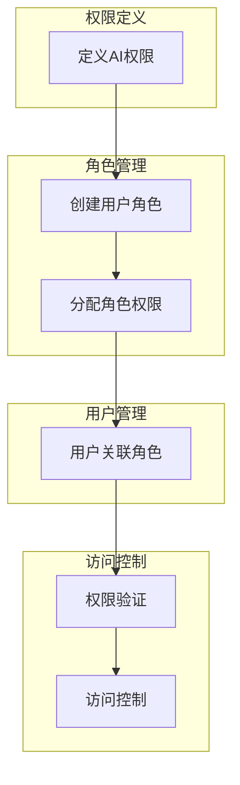
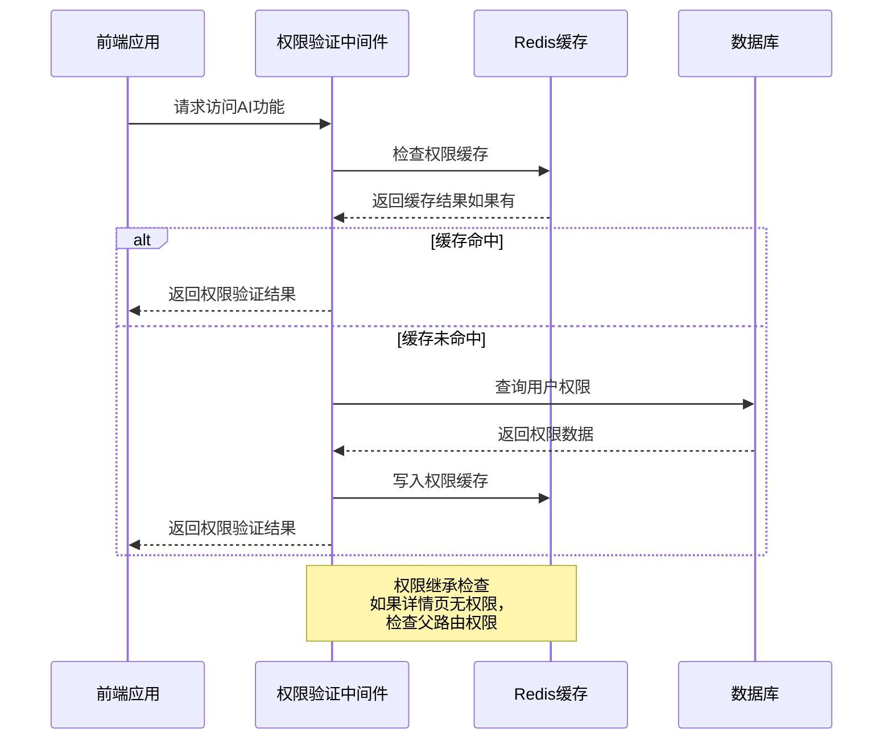
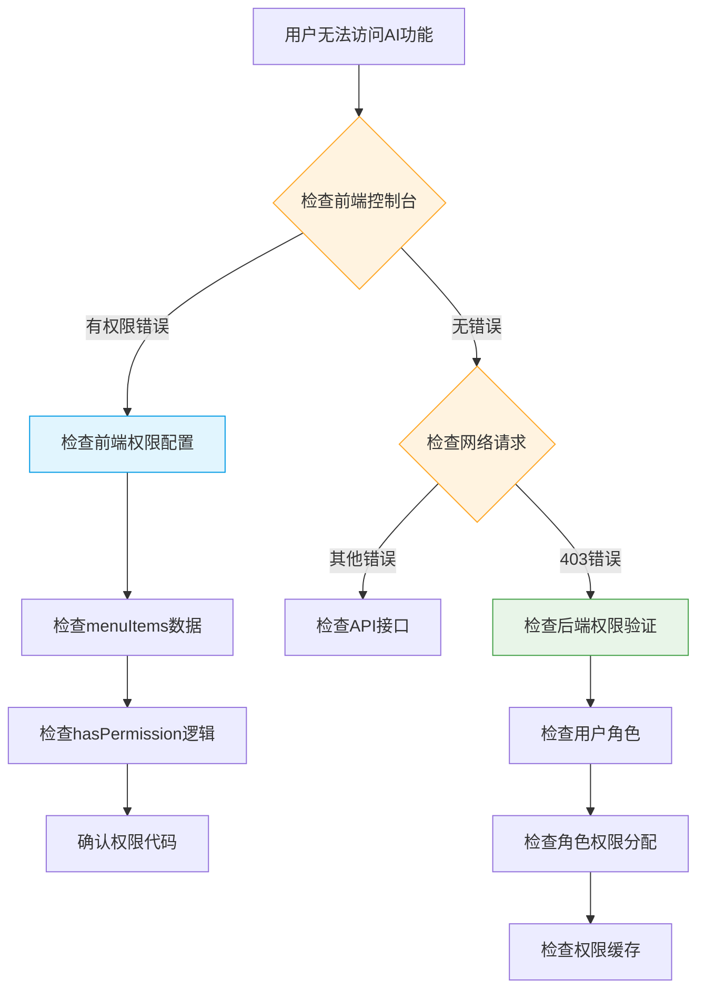

# 访问控制

<cite>
**本文档引用的文件**   
- [permissions.ts](file://k.yyup.com/backup/permission-system/permissions.ts)
- [permission-cache.service.ts](file://k.yyup.com/backup/permission-system/permission-cache.service.ts)
- [cache-invalidation.middleware.ts](file://k.yyup.com/backup/permission-system/cache-invalidation.middleware.ts)
- [add-ai-assistant-permissions.sql](file://k.yyup.com/add-ai-assistant-permissions.sql)
- [add-ai-performance-monitor-permission.sql](file://k.yyup.com/add-ai-performance-monitor-permission.sql)
- [auth-permissions.ts](file://k.yyup.com/client/src/api/modules/auth-permissions.ts)
</cite>

## 目录
1. [引言](#引言)
2. [AI权限定义与粒度控制](#ai权限定义与粒度控制)
3. [RBAC角色权限分配机制](#rbac角色权限分配机制)
4. [权限验证中间件实现逻辑](#权限验证中间件实现逻辑)
5. [前后端双重权限保障机制](#前后端双重权限保障机制)
6. [权限配置最佳实践](#权限配置最佳实践)
7. [常见权限问题排查方法](#常见权限问题排查方法)
8. [结论](#结论)

## 引言

本系统采用基于角色的访问控制（RBAC）模型，为AI助手功能提供细粒度的访问控制机制。通过定义明确的权限体系、角色分配策略和多层验证流程，确保不同用户角色（如园长、教师、管理员）只能访问其授权范围内的AI功能。系统实现了从前端路由守卫到后端API验证的双重保障，并结合Redis缓存提升权限检查性能。本文档详细阐述了AI相关权限的定义、分配、验证及管理机制。

## AI权限定义与粒度控制

系统在`permissions.ts`中定义了AI相关的权限体系，采用分层结构实现细粒度控制。AI权限主要分为菜单权限、页面权限和操作权限三个层级。

### AI权限分类

AI权限主要分为以下几类：

- **基础功能权限**：包括AI对话、AI查询、AI模型配置等核心功能
- **高级功能权限**：涵盖AI专家咨询、AI预测维护、AI数据分析等专业功能
- **管理功能权限**：涉及AI配额管理、AI反馈管理、AI分析统计等管理功能

### 权限粒度示例

在`add-ai-assistant-permissions.sql`文件中定义了详细的AI权限：

```sql
-- AI助手主菜单权限
INSERT IGNORE INTO permissions (name, code, type, parent_id, path, component, permission, icon, sort, status)
VALUES ('AI助手', 'AI_ASSISTANT_USE', 'menu', NULL, '/ai', 'pages/ai/ChatInterface.vue', 'ai:assistant:use', 'icon-robot', 20, 1);

-- AI助手子权限
INSERT IGNORE INTO permissions (name, code, type, parent_id, path, component, permission, icon, sort, status)
VALUES 
('AI对话', 'AI_CHAT_USE', 'button', @ai_menu_id, '', '', 'ai:chat:use', '', 10, 1),
('AI查询', 'AI_QUERY_EXECUTE', 'button', @ai_menu_id, '', '', 'ai:query:execute', '', 20, 1),
('AI模型配置', 'AI_MODEL_CONFIG_MANAGE', 'button', @ai_menu_id, '', '', 'ai:model:config', '', 30, 1);
```

**Section sources**
- [add-ai-assistant-permissions.sql](file://k.yyup.com/add-ai-assistant-permissions.sql#L6-L32)

### 权限继承机制

系统实现了权限继承机制，确保子页面权限能够继承父页面的访问控制策略。在`permissions.ts`中，`checkPagePermission`函数实现了权限继承逻辑：

```typescript
// 如果当前路径权限验证失败，尝试验证父路由权限（权限继承）
if (!hasPermission && path.includes('/')) {
  const pathSegments = path.split('/').filter(Boolean);
  if (pathSegments.length > 1) {
    const lastSegment = pathSegments[pathSegments.length - 1];
    const isDetailPage = /^\d+$/.test(lastSegment);
    
    if (isDetailPage) {
      const parentPath = '/' + pathSegments.slice(0, -1).join('/');
      const parentHasPermission = await checkPagePermission(parentPath, permission);
      if (parentHasPermission) {
        hasPermission = true;
      }
    }
  }
}
```

**Section sources**
- [permissions.ts](file://k.yyup.com/backup/permission-system/permissions.ts#L376-L396)

## RBAC角色权限分配机制

系统采用RBAC（基于角色的访问控制）模型，将AI权限分配给不同角色。通过角色-权限关联表，实现灵活的权限管理。

### 角色权限分配策略

在`add-ai-assistant-permissions.sql`文件中定义了不同角色的权限分配策略：

```sql
-- 为admin角色分配所有AI权限
INSERT IGNORE INTO role_permissions (role_id, permission_id, created_at, updated_at)
SELECT 1, p.id, NOW(), NOW()
FROM permissions p 
WHERE p.parent_id = @ai_menu_id;

-- 为园长角色分配核心权限
INSERT IGNORE INTO role_permissions (role_id, permission_id, created_at, updated_at)
SELECT r.id, p.id, NOW(), NOW()
FROM roles r, permissions p 
WHERE r.name = '园长' AND p.parent_id = @ai_menu_id 
AND p.code IN ('AI_CHAT_USE', 'AI_QUERY_EXECUTE', 'AI_DATA_ANALYSIS', 'AI_REPORT_GENERATION', 'AI_ACTIVITY_PLANNING', 'AI_ANALYTICS_VIEW');

-- 为教师角色分配基础权限
INSERT IGNORE INTO role_permissions (role_id, permission_id, created_at, updated_at)
SELECT r.id, p.id, NOW(), NOW()
FROM roles r, permissions p 
WHERE r.name = '教师' AND p.parent_id = @ai_menu_id 
AND p.code IN ('AI_CHAT_USE', 'AI_ACTIVITY_PLANNING', 'AI_EXPERT_CONSULTATION');
```

**Section sources**
- [add-ai-assistant-permissions.sql](file://k.yyup.com/add-ai-assistant-permissions.sql#L47-L75)

### 角色权限继承

系统支持角色权限继承，确保高级角色自动拥有低级角色的权限。在`permission-cache.service.ts`中，管理员角色的权限检查逻辑如下：

```typescript
const isAdmin = roleCodes.some(code => code === 'admin' || code === 'super_admin');

if (isAdmin) {
  // 管理员获取所有权限
  const allPermissions = await sequelize.query<{ code: string }>(`
    SELECT DISTINCT code
    FROM permissions
    WHERE status = 1 AND code IS NOT NULL AND code != ''
    ORDER BY sort, id
  `, {
    type: QueryTypes.SELECT
  });
  
  permissions = allPermissions.map(p => p.code);
}
```

**Section sources**
- [permission-cache.service.ts](file://k.yyup.com/backup/permission-system/permission-cache.service.ts#L82-L97)

### 角色权限分配流程



**Diagram sources **
- [add-ai-assistant-permissions.sql](file://k.yyup.com/add-ai-assistant-permissions.sql#L6-L121)
- [permission-cache.service.ts](file://k.yyup.com/backup/permission-system/permission-cache.service.ts#L44-L572)

## 权限验证中间件实现逻辑

系统实现了多层次的权限验证中间件，确保AI功能的安全访问。权限验证分为前端验证和后端验证两个层面。

### 前端权限验证中间件

前端权限验证主要通过`permissions.ts`中的`checkPagePermission`函数实现：

```typescript
const checkPagePermission = async (path: string, permission?: string): Promise<boolean> => {
  // 检查缓存
  const cacheKey = `${path}:${permission || ''}`;
  const cached = verificationCache.value.get(cacheKey);
  
  if (cached && (Date.now() - cached.timestamp) < VERIFICATION_CACHE_DURATION) {
    return cached.result;
  }
  
  // 调用权限验证API
  const response = await post('/dynamic-permissions/check-permission', {
    path,
    permission
  });
  
  let hasPermission = response.success && response.data?.hasPermission;
  
  // 权限继承检查
  if (!hasPermission && path.includes('/')) {
    // 递归验证父路径权限
    const parentHasPermission = await checkPagePermission(parentPath, permission);
    if (parentHasPermission) {
      hasPermission = true;
    }
  }
  
  // 缓存结果
  verificationCache.value.set(cacheKey, {
    result: hasPermission,
    timestamp: Date.now()
  });
  
  return hasPermission;
};
```

**Section sources**
- [permissions.ts](file://k.yyup.com/backup/permission-system/permissions.ts#L335-L408)

### 后端权限验证中间件

后端权限验证通过`cache-invalidation.middleware.ts`中的缓存失效机制实现：

```typescript
export function createCacheInvalidationMiddleware(config: CacheInvalidationConfig) {
  return async (req: Request, res: Response, next: NextFunction) => {
    // 保存原始的res.json方法
    const originalJson = res.json.bind(res);
    
    // 重写res.json方法
    res.json = function(body: any) {
      // 只在成功响应时清除缓存
      if (body && body.success) {
        // 异步清除缓存，不阻塞响应
        setImmediate(async () => {
          await invalidateCache(config, req);
        });
      }
      
      // 调用原始的json方法
      return originalJson(body);
    };
    
    next();
  };
}
```

**Section sources**
- [cache-invalidation.middleware.ts](file://k.yyup.com/backup/permission-system/cache-invalidation.middleware.ts#L38-L62)

### 权限验证流程图



**Diagram sources **
- [permissions.ts](file://k.yyup.com/backup/permission-system/permissions.ts#L335-L408)
- [permission-cache.service.ts](file://k.yyup.com/backup/permission-system/permission-cache.service.ts#L50-L572)

## 前后端双重权限保障机制

系统采用前后端双重验证机制，确保AI功能的安全访问。这种双重保障机制有效防止了前端绕过权限检查的风险。

### 前端路由守卫

前端通过路由守卫实现第一层权限检查。在`permissions.ts`中，`hasPermission`函数用于检查用户是否有访问特定路径的权限：

```typescript
const hasPermission = (path: string): boolean => {
  // 管理员拥有所有权限
  if (isAdmin.value) {
    return true;
  }
  
  // 递归检查菜单项中是否有匹配的路径
  const checkMenuItems = (items: MenuItem[]): boolean => {
    for (const item of items) {
      if (item.path === path) {
        return true;
      }
      if (item.children && item.children.length > 0) {
        if (checkMenuItems(item.children)) {
          return true;
        }
      }
    }
    return false;
  };
  
  return checkMenuItems(menuItems.value);
};
```

**Section sources**
- [permissions.ts](file://k.yyup.com/backup/permission-system/permissions.ts#L219-L247)

### 后端API权限验证

后端API通过`permission-cache.service.ts`实现第二层权限检查：

```typescript
static async checkPathPermission(userId: number, path: string): Promise<boolean> {
  const cacheKey = `${RedisKeyPrefix.PATH_PERMISSION}${userId}:${path}`;
  
  // 尝试从缓存获取
  const cached = await RedisService.get<boolean>(cacheKey);
  if (cached !== null) {
    return cached;
  }
  
  // 查询路径对应的权限
  const permissions = await sequelize.query<{ code: string }>(`
    SELECT code
    FROM permissions
    WHERE status = 1 AND path = :path
    LIMIT 1
  `, {
    replacements: { path },
    type: QueryTypes.SELECT
  });
  
  if (permissions.length === 0) {
    return false;
  }
  
  // 检查用户是否有该权限
  const hasPermission = await this.checkPermission(userId, permissions[0].code);
  
  // 写入缓存
  await RedisService.set(cacheKey, hasPermission, RedisTTL.PATH_PERMISSION);
  
  return hasPermission;
}
```

**Section sources**
- [permission-cache.service.ts](file://k.yyup.com/backup/permission-system/permission-cache.service.ts#L363-L402)

### 双重验证流程

```mermaid
flowchart TD
A[用户请求访问AI功能] --> B{前端路由守卫}
B --> |通过| C[发送API请求]
B --> |拒绝| D[显示无权限提示]
C --> E{后端API权限验证}
E --> |通过| F[返回数据]
E --> |拒绝| G[返回403错误]
F --> H[显示AI功能]
G --> I[显示无权限提示]
style B fill:#e1f5fe,stroke:#039be5
style E fill:#e8f5e8,stroke:#43a047
note right of B: 前端验证<br>检查菜单权限
note right of E: 后端验证<br>检查路径权限
```

**Diagram sources **
- [permissions.ts](file://k.yyup.com/backup/permission-system/permissions.ts#L219-L247)
- [permission-cache.service.ts](file://k.yyup.com/backup/permission-system/permission-cache.service.ts#L363-L402)

## 权限配置最佳实践

为了确保AI权限系统的安全性和可维护性，建议遵循以下最佳实践。

### 权限命名规范

采用统一的权限命名规范，便于权限管理和维护：

- **菜单权限**：使用`AI_ASSISTANT_USE`格式
- **操作权限**：使用`ai:action:verb`格式，如`ai:chat:use`
- **页面权限**：使用`AI_PAGE_NAME`格式，如`AI_QUERY_PAGE`

### 权限缓存策略

合理配置权限缓存策略，平衡性能和实时性：

```typescript
// 缓存配置
const RedisTTL = {
  USER_PERMISSIONS: 3600,      // 用户权限缓存1小时
  ROLE_PERMISSIONS: 7200,      // 角色权限缓存2小时
  DYNAMIC_ROUTES: 1800,        // 动态路由缓存30分钟
  PERMISSION_CHECK: 300,       // 权限检查缓存5分钟
  PATH_PERMISSION: 600         // 路径权限缓存10分钟
};
```

**Section sources**
- [permission-cache.service.ts](file://k.yyup.com/backup/permission-system/permission-cache.service.ts#L11-L12)

### 权限变更处理

当权限发生变更时，及时清除相关缓存：

```typescript
// 预定义的缓存失效中间件
export const invalidateUserCache = createCacheInvalidationMiddleware({
  type: CacheInvalidationType.USER,
  getUserId: (req) => Number(req.params.id) || Number(req.body.id)
});

export const invalidateRoleCache = createCacheInvalidationMiddleware({
  type: CacheInvalidationType.ROLE,
  getRoleCode: (req) => req.body.code || req.params.code
});

export const invalidatePermissionCache = createCacheInvalidationMiddleware({
  type: CacheInvalidationType.PERMISSION
});
```

**Section sources**
- [cache-invalidation.middleware.ts](file://k.yyup.com/backup/permission-system/cache-invalidation.middleware.ts#L154-L169)

### 权限审计日志

建议记录权限变更和访问日志，便于安全审计：

```sql
-- 记录权限变更日志
INSERT INTO permission_change_log (user_id, action, details, timestamp)
VALUES (:userId, :action, :details, NOW());
```

## 常见权限问题排查方法

当遇到权限相关问题时，可以按照以下步骤进行排查。

### 权限检查流程



**Diagram sources **
- [permissions.ts](file://k.yyup.com/backup/permission-system/permissions.ts#L219-L247)
- [permission-cache.service.ts](file://k.yyup.com/backup/permission-system/permission-cache.service.ts#L363-L402)

### 常见问题及解决方案

#### 问题1：用户无法访问AI助手页面

**可能原因**：
- 用户角色未分配AI助手菜单权限
- 权限缓存未更新
- 路由配置错误

**解决方案**：
1. 检查`role_permissions`表中用户角色是否有`AI_ASSISTANT_USE`权限
2. 清除用户权限缓存：`await PermissionCacheService.clearUserCache(userId)`
3. 检查路由配置是否正确

#### 问题2：权限变更后未生效

**可能原因**：
- 缓存未及时清除
- 权限分配未保存到数据库
- 角色-权限关联表未更新

**解决方案**：
1. 手动清除相关缓存
2. 检查数据库中权限分配是否正确
3. 重启权限服务或刷新缓存

#### 问题3：管理员无法访问某些AI功能

**可能原因**：
- 管理员角色代码不是`admin`或`super_admin`
- 权限检查逻辑未正确处理管理员角色

**解决方案**：
1. 检查用户角色代码是否为`admin`或`super_admin`
2. 确认`isAdmin`计算属性是否正确
3. 检查权限检查逻辑是否优先处理管理员角色

## 结论

本系统的AI助手访问控制机制采用RBAC模型，通过细粒度的权限定义、灵活的角色分配和多层次的验证流程，确保了AI功能的安全访问。系统实现了前后端双重权限保障，结合Redis缓存提升了性能，同时提供了完善的权限管理和审计功能。通过遵循最佳实践和有效的排查方法，可以确保权限系统的稳定运行和安全性。