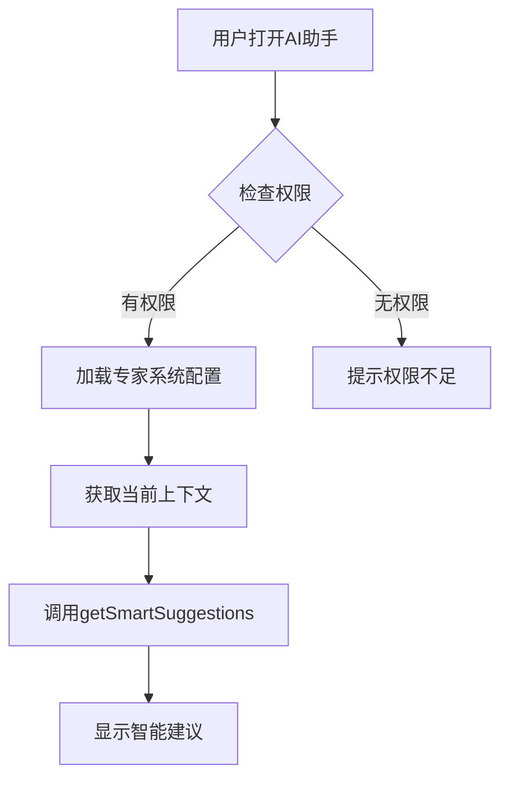

# 功能开关

<cite>
**本文档引用文件**   
- [add-ai-center-docs.js](file://k.yyup.com/add-ai-center-docs.js)
- [ai-experts.ts](file://k.yyup.com/client/src/config/ai-experts.ts)
- [add-ai-analytics-permissions.js](file://k.yyup.com/add-ai-analytics-permissions.js)
</cite>

## 目录
1. [AI中心功能初始化](#ai中心功能初始化)
2. [专家系统配置](#专家系统配置)
3. [AI分析功能启用](#ai分析功能启用)
4. [功能开关配置案例](#功能开关配置案例)

## AI中心功能初始化

AI中心功能的初始化通过执行 `add-ai-center-docs.js` 脚本完成。该脚本负责在数据库中添加AI中心的说明文档和相关配置，为AI功能的启用奠定基础。

脚本首先建立与数据库的连接，然后定义一系列AI中心相关的文档内容，包括AI中心管理概览、AI模型管理指南、智能对话系统指南和AI数据分析指南。这些文档被插入到 `ai_knowledge_base` 表中，如果文档已存在则进行更新。

AI中心的主要功能模块包括：
- **AI模型管理**：涵盖模型配置、部署运维、性能优化和效果评估
- **智能对话系统**：包括自然语言理解、对话管理和自然语言生成
- **智能数据分析**：提供数据采集、存储、计算分析和可视化报告能力
- **自动化流程**：支持工作流自动化、智能排班和自动化报告生成
- **个性化推荐**：提供学习内容、活动、教学资源和家长服务的个性化推荐

通过执行此脚本，系统能够为用户提供全面的AI功能支持，涵盖教育教学、管理运营和安全保障等多个应用场景。

**Section sources**
- [add-ai-center-docs.js](file://k.yyup.com/add-ai-center-docs.js#L1-L1054)

## 专家系统配置

AI专家系统的配置在 `ai-experts.ts` 文件中定义，采用系统内置专家与自定义专家相结合的模式，所有专家均专注于幼儿园托育行业。

### 专家类型

系统内置了多种专业领域的专家，每种专家都有特定的ID、名称、图标、描述和颜色：

- **招生营销专家**：专注于招生策略、品牌推广和市场分析
- **教育评估专家**：负责教育方案评估、课程设计和儿童发展评估
- **成本分析专家**：专注于成本核算、预算制定和资源优化
- **风险评估专家**：负责安全风险识别、应急预案制定和安全培训
- **创意设计专家**：专注于环境创设、空间规划和视觉传达
- **课程教学专家**：负责课程设计、教学方法指导和新教师培训
- **督导评估专家**：负责质量监督、评估指导和标准制定
- **园务管理专家**：专注于园所运营、团队管理和流程优化
- **人事管理专家**：负责招聘培训、绩效考核和团队建设
- **法律顾问专家**：提供合规审查、法律咨询和风险防范服务

### 触发条件和响应策略

每个专家的配置都包含详细的 `systemPrompt`，定义了专家的专业背景、核心能力、工作方式和擅长解决的问题。当用户提出问题时，系统会根据问题的性质选择合适的专家或组合多个专家进行响应。

系统提供了以下关键功能来管理专家系统：
- `getAllExperts()`：获取所有专家（系统+自定义）
- `getExpertById()`：根据ID获取特定专家
- `getSelectedExpertsPrompt()`：获取选中专家的系统提示词，支持单个或多个专家的组合
- `validateCustomExpert()`：验证自定义专家数据的有效性
- `createDefaultCustomExpert()`：创建默认的自定义专家模板

这种配置方式确保了AI助手能够提供专业、全面且可落地的建议，始终以幼儿园的实际情况和儿童的最佳利益为出发点。

**Section sources**
- [ai-experts.ts](file://k.yyup.com/client/src/config/ai-experts.ts#L1-L638)

## AI分析功能启用

AI分析功能的启用通过执行 `add-ai-analytics-permissions.js` 脚本实现。该脚本负责在权限系统中添加AI分析相关的子页面权限，确保用户能够访问和使用AI分析功能。

### 脚本执行流程

1. **建立数据库连接**：脚本首先连接到MySQL数据库
2. **查询现有权限**：检查是否已存在AI分析相关的权限
3. **创建父权限**：如果不存在AI分析父权限（代码为 `ai:analytics`），则创建新的父权限
4. **添加子权限**：为AI分析功能添加多个子页面权限
5. **分配管理员权限**：将新添加的权限分配给管理员角色

### 添加的AI分析子页面权限

脚本添加了以下AI分析子页面权限：

| 权限名称 | 权限代码 | 路径 | 组件 | 描述 |
|---------|--------|------|------|------|
| 实时分析 | ai:analytics:real-time | /ai/analytics/real-time-analytics | pages/ai/analytics/real-time-analytics.vue | AI实时数据分析功能 |
| 预测分析 | ai:analytics:predictive | /ai/analytics/predictive-analytics | pages/ai/analytics/predictive-analytics.vue | AI预测分析功能 |
| 高级分析 | ai:analytics:advanced | /ai/analytics/AdvancedAnalytics | pages/ai/analytics/AdvancedAnalytics.vue | AI高级分析功能 |
| 学生分析 | student:analytics | /student/analytics/StudentAnalytics | pages/student/analytics/StudentAnalytics.vue | 学生数据分析功能 |
| 客户分析 | customer:analytics | /customer/analytics/CustomerAnalytics | pages/customer/analytics/CustomerAnalytics.vue | 客户数据分析功能 |
| 报表构建器 | analytics:report-builder | /analytics/ReportBuilder | pages/analytics/ReportBuilder.vue | 自定义报表构建器 |

通过执行此脚本，系统为管理员角色添加了所有AI分析相关的权限，确保管理员能够全面访问和使用AI分析功能，包括实时分析、预测分析、高级分析、学生分析、客户分析和报表构建等。

**Section sources**
- [add-ai-analytics-permissions.js](file://k.yyup.com/add-ai-analytics-permissions.js#L1-L196)

## 功能开关配置案例

以下案例展示了如何根据幼儿园的具体需求开启或关闭特定的AI功能。

### 案例1：开启智能建议功能

要开启智能建议功能，需要确保AI专家系统已正确配置，并且相关权限已启用。在 `ai-experts.ts` 文件中，系统内置了多个专家，如招生营销专家、教育评估专家等，这些专家能够提供专业的智能建议。

在移动端AI助手的状态管理中，通过 `getSmartSuggestions()` 方法获取智能建议。该方法会根据当前上下文和用户偏好，调用AI服务获取建议，并更新到 `suggestions` 状态中。

**Diagram sources**
- [ai-experts.ts](file://k.yyup.com/client/src/config/ai-experts.ts#L1-L638)
- [ai-assistant.ts](file://k.yyup.com/client/aimobile/stores/ai-assistant.ts#L1-L648)

### 案例2：启用自动化操作

自动化操作功能通过AI中心的自动化流程模块实现。在 `add-ai-center-docs.js` 脚本中，定义了工作流自动化、智能排班、自动化报告和智能提醒等自动化功能。

要启用自动化操作，需要确保AI中心功能已初始化，并且相关权限已分配。系统会根据预设的规则和条件，自动执行相应的操作，如定期生成报告、自动发送提醒等。

### 案例3：开启数据分析功能

要开启数据分析功能，需要执行 `add-ai-analytics-permissions.js` 脚本，为系统添加AI分析相关的权限。执行脚本后，管理员将能够访问实时分析、预测分析、学生分析、客户分析等功能。

数据分析功能的应用包括：
- **学生分析**：跟踪学习进度、评估能力发展、识别学习困难
- **教师分析**：分析教学行为、评估教学效果、提供改进建议
- **家长分析**：分析参与行为、评估满意度、识别参与障碍
- **运营分析**：分析招生趋势、财务状况、优化资源配置

通过这些功能，幼儿园管理者可以获得数据驱动的洞察，做出更明智的决策。

**Section sources**
- [add-ai-center-docs.js](file://k.yyup.com/add-ai-center-docs.js#L1-L1054)
- [add-ai-analytics-permissions.js](file://k.yyup.com/add-ai-analytics-permissions.js#L1-L196)
- [ai-experts.ts](file://k.yyup.com/client/src/config/ai-experts.ts#L1-L638)