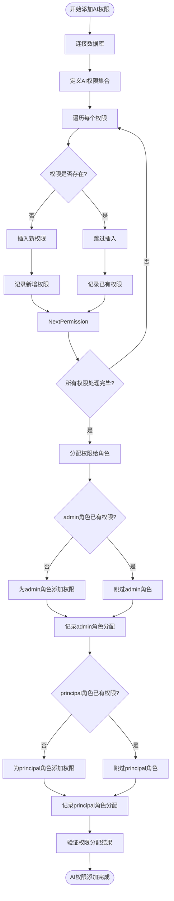
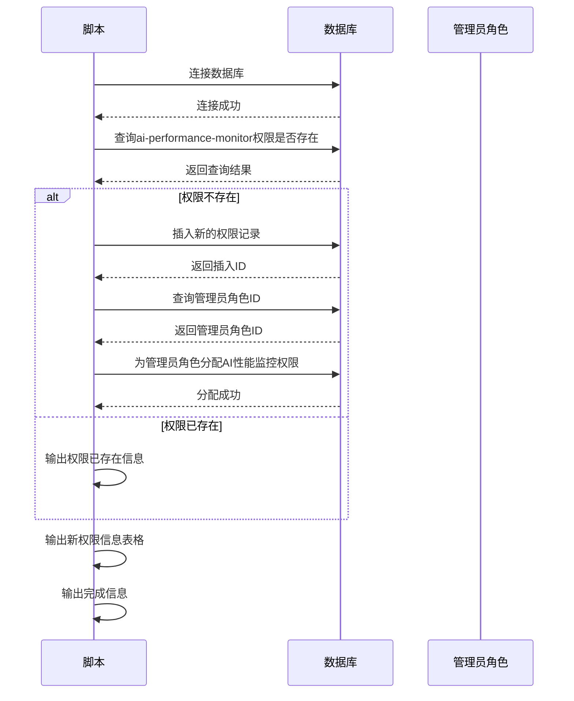
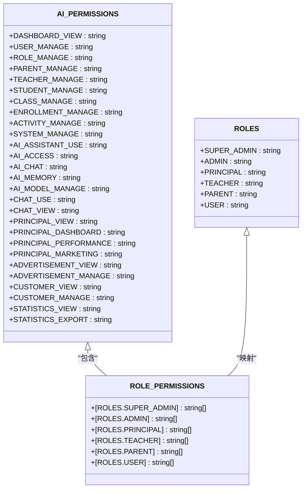
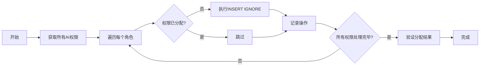
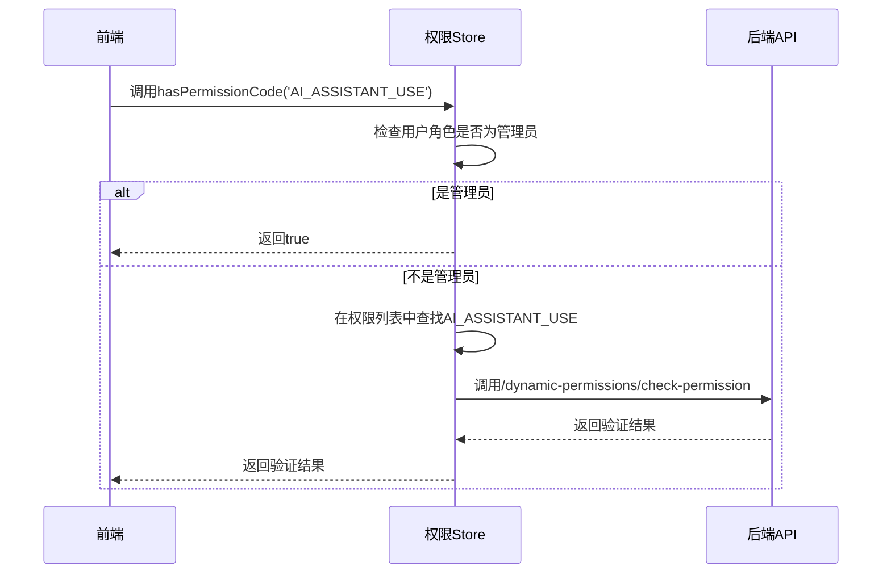
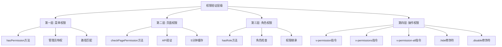

# 权限配置

<cite>
**本文档引用的文件**
- [add-ai-permissions.js](file://k.yyup.com/scripts/add-ai-permissions.js)
- [add-ai-performance-monitor-permission.js](file://unified-tenant-system/server/scripts/add-ai-performance-monitor-permission.js)
- [permissions.ts](file://k.yyup.com/backup/permission-system/permissions.ts)
- [auth-permissions.ts](file://k.yyup.com/client/src/api/modules/auth-permissions.ts)
- [permission.ts](file://k.yyup.com/client/src/directives/permission.ts)
- [permission.guard.ts](file://k.yyup.com/client/src/guards/permission.guard.ts)
- [permission.model.js](file://k.yyup.com/server/dist/models/ai-user-permission.model.js)
- [static-menu.ts](file://k.yyup.com/client/src/config/static-menu.ts)
- [permission.utils.ts](file://k.yyup.com/client/src/utils/permission.ts)
</cite>

## 目录
1. [引言](#引言)
2. [AI助手权限配置机制](#ai助手权限配置机制)
3. [AI性能监控权限配置](#ai性能监控权限配置)
4. [AI相关权限标识符分析](#ai相关权限标识符分析)
5. [权限管理操作示例](#权限管理操作示例)
6. [权限验证层级体系](#权限验证层级体系)
7. [结论](#结论)

## 引言

本文档详细说明了幼儿园管理系统中AI助手的权限配置机制。系统通过多层级的权限管理体系，为不同用户角色（如管理员、园长、教师）分配AI功能的访问权限。权限系统采用前端与后端协同验证的方式，确保AI功能的安全访问和合理使用。文档将深入分析权限配置脚本、权限标识符定义以及实际操作示例，全面展示AI权限管理的实现细节。

## AI助手权限配置机制

系统通过`add-ai-permissions.js`脚本为不同用户角色分配AI功能的访问权限。该脚本实现了完整的权限创建和分配流程，确保管理员和园长角色能够访问核心AI功能。

脚本首先定义了需要添加的AI权限集合，包括AI功能模块、AI对话、AI助手和AI模型配置等核心权限。每个权限都包含代码、名称、描述和路径等必要信息。脚本执行时会检查这些权限是否已存在于数据库中，避免重复添加。

**图示来源**
- [add-ai-permissions.js](file://k.yyup.com/scripts/add-ai-permissions.js#L1-L169)

**本节来源**
- [add-ai-permissions.js](file://k.yyup.com/scripts/add-ai-permissions.js#L1-L169)

## AI性能监控权限配置

AI性能监控权限的配置通过`add-ai-performance-monitor-permission.js`脚本来实现。该脚本专门用于添加AI性能监控功能的访问权限，确保系统管理员能够监控AI功能的运行状态和性能指标。

脚本首先检查`ai-performance-monitor`权限是否已存在，如果不存在则创建新的权限记录。权限配置包括英文名称"AI Performance Monitor"、中文名称"AI性能监控"、权限代码`ai-performance-monitor`、访问路径`/ai/monitoring/AIPerformanceMonitor`以及对应的Vue组件路径。权限创建后，脚本会自动为管理员角色分配此权限，确保管理员能够访问AI性能监控界面。

**图示来源**
- [add-ai-performance-monitor-permission.js](file://unified-tenant-system/server/scripts/add-ai-performance-monitor-permission.js#L1-L103)

**本节来源**
- [add-ai-performance-monitor-permission.js](file://unified-tenant-system/server/scripts/add-ai-performance-monitor-permission.js#L1-L103)

## AI相关权限标识符分析

`permissions.ts`文件中定义了系统中所有AI相关的权限标识符及其作用范围。这些权限标识符构成了AI功能访问控制的基础，通过精确的权限划分实现细粒度的访问控制。

系统定义了多个层级的AI权限，从基础的AI功能访问到具体的AI助手使用、AI对话、AI记忆和AI模型管理等。权限标识符采用大写字母和下划线的命名规范，如`AI_ASSISTANT_USE`、`AI_CHAT`、`AI_MEMORY`和`AI_MODEL_MANAGE`等，确保权限代码的清晰性和可读性。

**图示来源**
- [permissions.ts](file://k.yyup.com/client/src/utils/permission.ts#L23-L208)

**本节来源**
- [permissions.ts](file://k.yyup.com/client/src/utils/permission.ts#L23-L208)

## 权限管理操作示例

### 批量权限管理

系统提供了完善的批量权限管理功能，可以通过脚本实现权限的批量添加和分配。`add-ai-permissions.js`脚本展示了如何批量为多个角色分配AI权限。脚本首先收集所有需要处理的权限，然后分别检查每个权限在admin和principal角色中的分配状态，仅对未分配的权限进行插入操作，避免重复数据。

**图示来源**
- [add-ai-permissions.js](file://k.yyup.com/scripts/add-ai-permissions.js#L62-L111)

### 权限验证操作

系统实现了多层级的权限验证机制。前端通过`hasPermissionCode`方法检查用户是否拥有特定权限代码，支持管理员特权（管理员拥有所有权限）。权限验证结果会被缓存，减少重复查询数据库的开销。

**图示来源**
- [permissions.ts](file://k.yyup.com/backup/permission-system/permissions.ts#L249-L266)

### 实际操作流程

启用特定角色的AI功能访问需要执行以下步骤：
1. 确认目标角色（如教师）需要的AI权限
2. 检查权限是否已定义，若未定义则添加新权限
3. 将权限分配给目标角色
4. 验证权限分配结果

限制特定角色的AI功能访问则需要：
1. 确定需要限制的权限
2. 从角色权限分配表中删除对应记录
3. 验证权限移除结果

**本节来源**
- [add-ai-permissions.js](file://k.yyup.com/scripts/add-ai-permissions.js#L1-L169)
- [permissions.ts](file://k.yyup.com/backup/permission-system/permissions.ts#L249-L266)

## 权限验证层级体系

系统实现了四层权限验证体系，确保AI功能的安全访问：

**第一层：菜单权限** - 基于用户角色和权限的侧边栏菜单显示控制。通过`hasPermission`方法检查用户是否有访问特定路径的权限，管理员默认拥有所有权限。

**第二层：页面权限** - 带缓存的页面访问权限验证。通过`checkPagePermission`方法调用后端API进行权限验证，结果缓存5分钟，提高性能。

**第三层：角色权限** - 基于用户角色的权限检查。通过`hasRole`方法验证用户是否具有特定角色，支持角色继承和权限检查。

**第四层：操作权限** - 细粒度的按钮级权限控制。通过Vue指令`v-permission`、`v-permissions`和`v-permission-all`实现，支持.hide和.disable修饰符。

**图示来源**
- [permissions.ts](file://k.yyup.com/backup/permission-system/permissions.ts#L219-L418)
- [permission.ts](file://k.yyup.com/client/src/directives/permission.ts#L68-L260)

**本节来源**
- [permissions.ts](file://k.yyup.com/backup/permission-system/permissions.ts#L219-L418)
- [permission.ts](file://k.yyup.com/client/src/directives/permission.ts#L68-L260)

## 结论

幼儿园管理系统的AI权限配置机制采用了全面而精细的设计，通过脚本化的方式实现了权限的自动化管理和分配。系统不仅提供了基础的AI功能访问控制，还实现了性能监控等高级功能的权限管理。权限标识符的定义清晰明确，支持细粒度的访问控制。四层权限验证体系确保了AI功能的安全性和可靠性，既满足了不同角色的使用需求，又保障了系统的安全性。通过批量管理和验证机制，系统管理员可以高效地管理AI权限，确保AI功能在幼儿园环境中的合理使用。