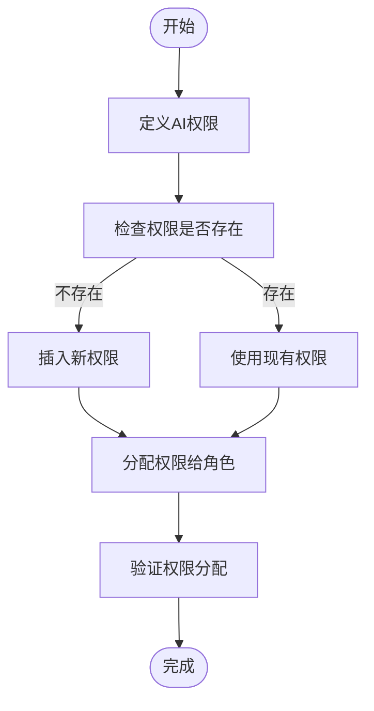
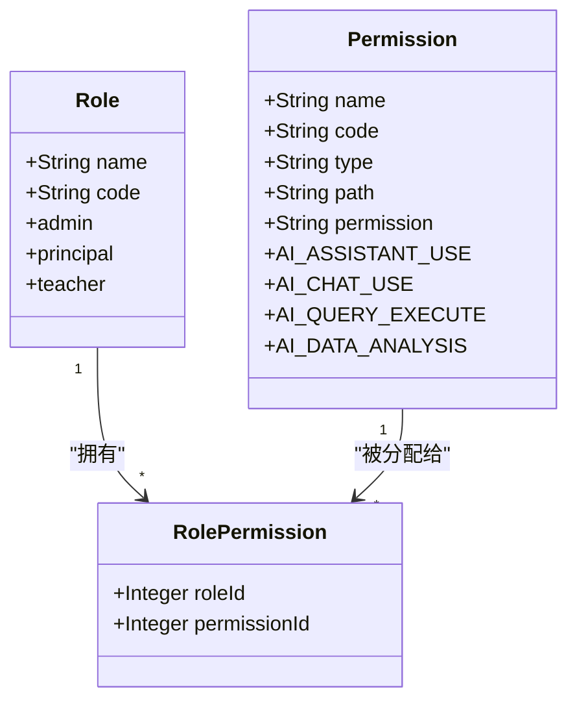
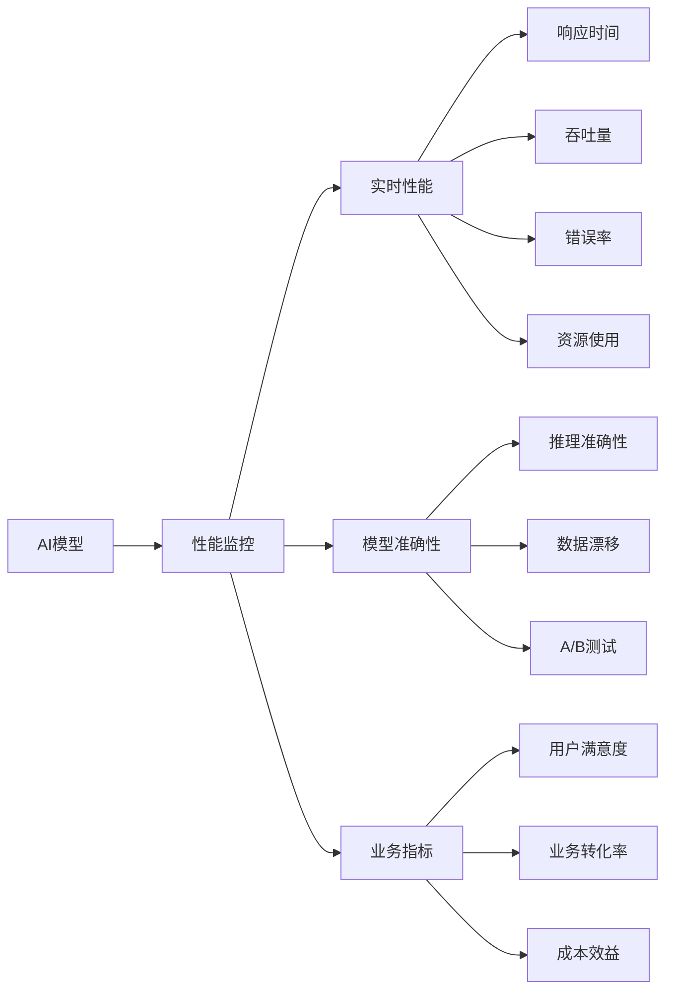
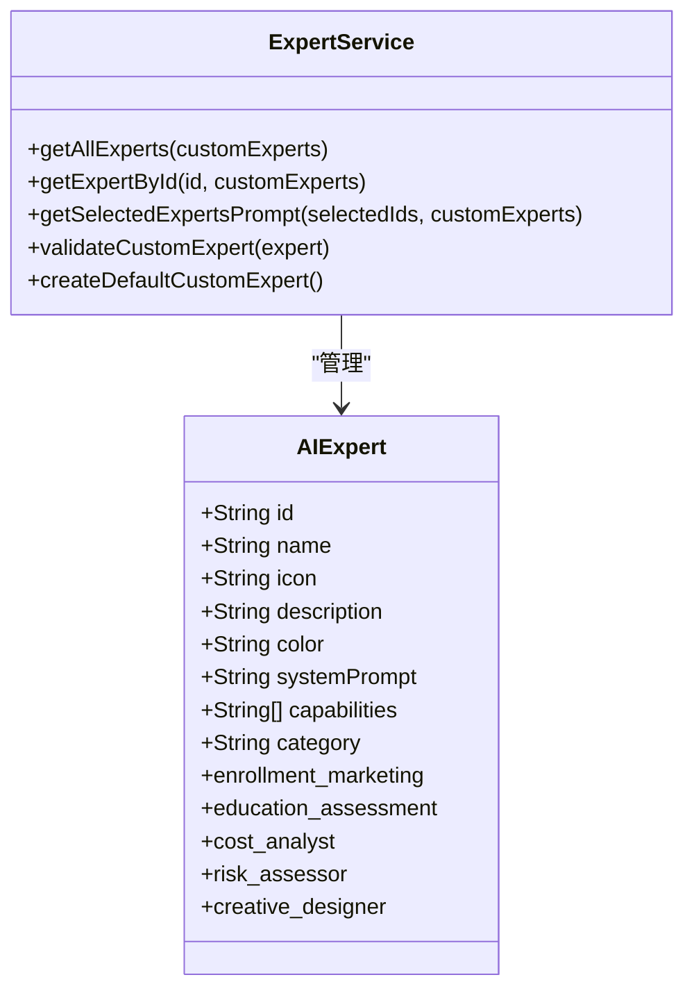

# 配置选项

<cite>
**本文档引用的文件**  
- [add-ai-center-docs.js](file://k.yyup.com/add-ai-center-docs.js)
- [add-ai-permissions.js](file://k.yyup.com/scripts/add-ai-permissions.js)
- [ai-experts.ts](file://k.yyup.com/client/src/config/ai-experts.ts)
- [add-ai-assistant-permissions.sql](file://k.yyup.com/add-ai-assistant-permissions.sql)
- [add-ai-performance-monitor-permission.sql](file://k.yyup.com/add-ai-performance-monitor-permission.sql)
</cite>

## 目录
1. [引言](#引言)
2. [AI中心文档初始化](#ai中心文档初始化)
3. [权限配置机制](#权限配置机制)
4. [AI模型配置管理](#ai模型配置管理)
5. [专家系统配置](#专家系统配置)
6. [实际操作指南](#实际操作指南)
7. [结论](#结论)

## 引言
本文档全面介绍AI助手的配置选项和管理方法，涵盖AI中心文档初始化、权限配置机制、AI模型管理、专家系统配置以及实际操作指南。通过分析相关脚本和配置文件，详细说明如何配置和管理AI功能，为幼儿园智能化管理提供技术支持。

## AI中心文档初始化

`add-ai-center-docs.js` 脚本用于初始化AI中心的文档和配置，通过向数据库插入AI知识库记录来实现。该脚本定义了多个文档条目，涵盖AI中心管理、模型管理、智能对话和数据分析等方面。

文档初始化过程包括：
- 连接到MySQL数据库
- 定义AI知识库文档内容
- 插入或更新文档记录
- 验证插入结果

文档内容采用Markdown格式，包含详细的AI功能说明、技术架构和应用场景。每个文档条目包含分类、标题、内容和元数据，元数据中存储了页面URL、功能列表和关键词等信息。

**文档来源**
- [add-ai-center-docs.js](file://k.yyup.com/add-ai-center-docs.js#L1-L1054)

## 权限配置机制

### 权限初始化脚本
`add-ai-permissions.js` 脚本用于为不同角色分配AI功能访问权限。该脚本主要为admin和principal角色添加AI相关权限，包括AI功能、AI对话、AI助手和AI模型配置等。

权限配置流程：
1. 定义需要添加的AI权限
2. 检查权限是否已存在
3. 插入新权限或使用现有权限
4. 将权限分配给指定角色
5. 验证权限分配结果



**图表来源**
- [add-ai-permissions.js](file://k.yyup.com/scripts/add-ai-permissions.js#L1-L169)

### SQL权限配置
`add-ai-assistant-permissions.sql` 文件通过SQL语句配置AI助手的权限体系。该文件定义了AI助手的菜单权限、子权限和页面权限，并为不同角色分配相应的权限。

权限结构包括：
- **主菜单权限**：AI助手主入口
- **子权限**：基础权限（AI对话、AI查询）和高级功能（AI专家咨询、AI数据分析）
- **页面权限**：AI助手页面、AI智能查询页面、AI模型管理页面等

角色权限分配：
- **管理员**：拥有所有AI权限
- **园长**：拥有核心权限（对话、查询、数据分析、报告生成）
- **教师**：拥有基础权限（对话、活动策划）
- **技术管理员**：拥有完整权限
- **数据分析师**：拥有分析相关权限



**图表来源**
- [add-ai-assistant-permissions.sql](file://k.yyup.com/add-ai-assistant-permissions.sql#L1-L121)

## AI模型配置管理

### 模型管理指南
AI模型管理涵盖模型配置、部署运维、性能优化和效果评估等方面。模型类型包括自然语言处理、计算机视觉、语音处理和推荐系统。

模型参数配置包括：
- **基础参数**：模型版本、精度、批处理大小、超时设置
- **性能优化**：缓存策略、负载均衡、资源限制、并发控制
- **安全控制**：访问权限、数据脱敏、审计日志、内容审核

### 性能监控配置
`add-ai-performance-monitor-permission.sql` 文件配置AI性能监控权限，包括：
- AI性能监控主页面访问权限
- 性能查看、刷新、导出和配置权限
- 为管理员、园长和教师角色分配相应权限

监控指标包括：
- 响应时间、吞吐量、错误率
- CPU、内存、GPU利用率
- 用户满意度、业务转化率
- 成本效益和合规性



**图表来源**
- [add-ai-performance-monitor-permission.sql](file://k.yyup.com/add-ai-performance-monitor-permission.sql#L1-L99)

## 专家系统配置

`ai-experts.ts` 文件定义了AI专家系统的配置结构和用途。系统内置了多个专业领域的专家，每个专家都有独特的系统提示词和能力。

### 专家配置结构
```typescript
interface AIExpert {
  id: string
  name: string
  icon: string
  description: string
  color: string
  systemPrompt: string
  capabilities: string[]
  category: 'system' | 'custom'
}
```

### 内置专家列表
系统提供了以下专业领域的专家：
- **招生营销专家**：招生策略、品牌推广、市场分析
- **教育评估专家**：教育方案评估、课程设计、发展评估
- **成本分析专家**：成本核算、预算制定、资源优化
- **风险评估专家**：风险识别、安全评估、应急预案
- **创意设计专家**：环境创设、空间规划、视觉传达
- **课程教学专家**：课程设计、教学方法、新教师指导
- **督导评估专家**：质量监督、评估指导、标准制定
- **园务管理专家**：园所运营、团队管理、流程优化
- **人事管理专家**：招聘培训、绩效考核、团队建设
- **法律顾问专家**：合规审查、法律咨询、风险防范

### 专家系统功能
- **多专家协作**：支持同时选择多个专家，综合运用不同领域的知识
- **系统提示词**：每个专家都有详细的系统提示词，定义其专业背景、核心能力和工作方式
- **自定义专家**：支持创建自定义专家，扩展系统能力
- **验证机制**：提供专家数据验证功能，确保配置完整性



**图表来源**
- [ai-experts.ts](file://k.yyup.com/client/src/config/ai-experts.ts#L1-L638)

## 实际操作指南

### 启用/禁用AI功能
1. **通过权限配置**：修改角色权限来控制AI功能的访问
2. **通过数据库操作**：更新permissions表中的status字段
3. **通过管理界面**：使用系统提供的权限管理界面进行操作

### 调整AI性能监控设置
1. **配置监控指标**：在AI性能监控页面选择需要监控的指标
2. **设置告警阈值**：为关键指标设置预警阈值
3. **调整采样频率**：根据需求调整数据采集频率
4. **配置通知方式**：设置告警通知的接收方式（邮件、短信等）

### 管理AI权限配置
1. **添加新权限**：使用SQL脚本或管理界面添加新的AI权限
2. **分配权限**：为不同角色分配相应的AI权限
3. **权限继承**：利用权限树结构实现权限的继承和管理
4. **权限审计**：定期审查权限分配情况，确保安全性

### 专家系统管理
1. **创建自定义专家**：使用createDefaultCustomExpert()函数创建新的专家
2. **配置专家能力**：定义专家的系统提示词和专业能力
3. **验证专家配置**：使用validateCustomExpert()函数验证配置的完整性
4. **应用专家组合**：选择多个专家协同工作，解决复杂问题

## 结论
本文档详细介绍了AI助手的配置选项和管理方法，涵盖了从文档初始化到权限配置、模型管理和专家系统配置的各个方面。通过合理配置和管理这些选项，可以充分发挥AI助手在幼儿园智能化管理中的作用，提高运营效率和服务质量。