# API客户端

<cite>
**本文档引用的文件**   
- [ai.ts](file://k.yyup.com/client/src/api/ai.ts)
- [ai-conversation.ts](file://k.yyup.com/client/src/api/modules/ai-conversation.ts)
- [request.ts](file://k.yyup.com/client/src/utils/request.ts)
- [ai-chat-interface-fixed.vue](file://k.yyup.com/ai-chat-interface-fixed.vue)
- [MobileAiAssistant.vue](file://k.yyup.com/client/aimobile/components/MobileAiAssistant.vue)
</cite>

## 目录
1. [引言](#引言)
2. [核心API接口](#核心api接口)
3. [会话管理模块](#会话管理模块)
4. [HTTP请求配置](#http请求配置)
5. [SSE流式数据处理](#sse流式数据处理)
6. [Vue组件中的API使用](#vue组件中的api使用)
7. [错误处理与重试机制](#错误处理与重试机制)
8. [总结](#总结)

## 引言
本文档详细说明了AI助手前端API客户端的实现，重点分析了`ai.ts`中定义的核心API接口和`ai-conversation.ts`中的会话管理模块。文档涵盖了会话创建、消息发送、流式响应处理、请求参数结构、认证头设置、错误码处理和重试机制等关键功能。通过具体的TypeScript接口定义和使用示例，展示了如何在Vue组件中调用这些API，并详细描述了HTTP请求的配置选项和SSE（Server-Sent Events）流式数据的处理策略。

## 核心API接口
`ai.ts`文件定义了AI助手服务的核心API接口，提供了与AI模型和会话交互的完整功能集。这些接口通过`aiApi`对象导出，包含了获取模型列表、创建会话、发送消息等关键方法。

### 会话与消息接口
核心接口定义了会话和消息的数据结构，以及相关的操作方法。

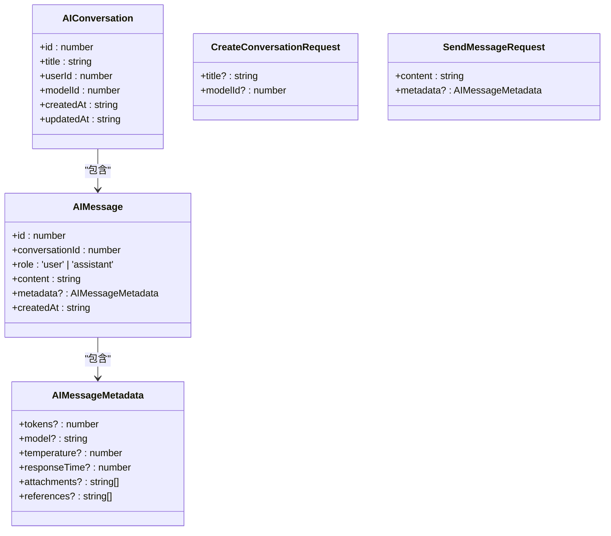

**Diagram sources**
- [ai.ts](file://k.yyup.com/client/src/api/ai.ts#L28-L61)

**Section sources**
- [ai.ts](file://k.yyup.com/client/src/api/ai.ts#L128-L557)

### 会话管理API
`aiApi`对象提供了管理AI会话的完整API，包括创建、获取、删除会话等操作。

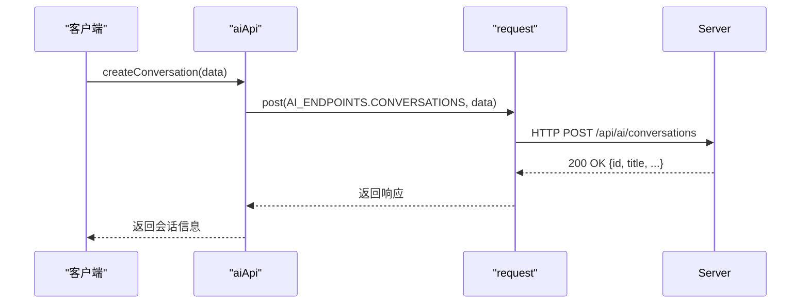

**Diagram sources**
- [ai.ts](file://k.yyup.com/client/src/api/ai.ts#L320-L328)

**Section sources**
- [ai.ts](file://k.yyup.com/client/src/api/ai.ts#L300-L483)

### 流式消息发送
`sendMessageStream`方法实现了SSE流式响应处理，允许客户端实时接收AI助手的响应。

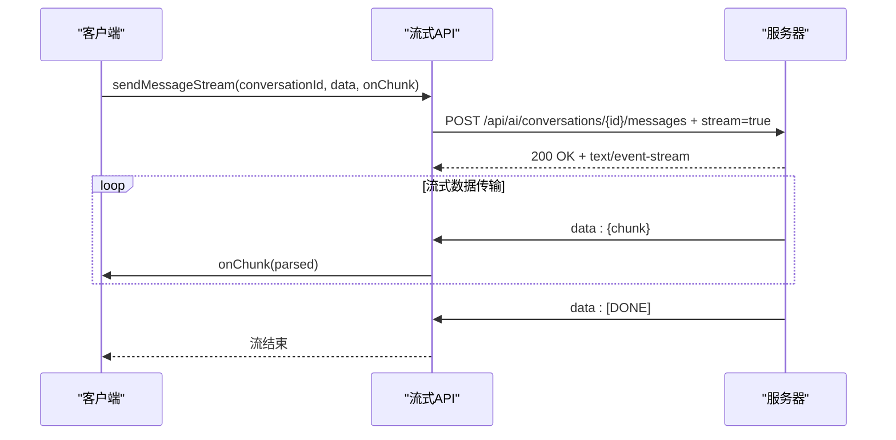

**Diagram sources**
- [ai.ts](file://k.yyup.com/client/src/api/ai.ts#L379-L456)

**Section sources**
- [ai.ts](file://k.yyup.com/client/src/api/ai.ts#L379-L456)

## 会话管理模块
`ai-conversation.ts`文件实现了AI会话管理的核心功能，提供了一个完整的会话管理服务类。

### 会话数据结构
会话管理模块定义了详细的会话和消息数据结构。

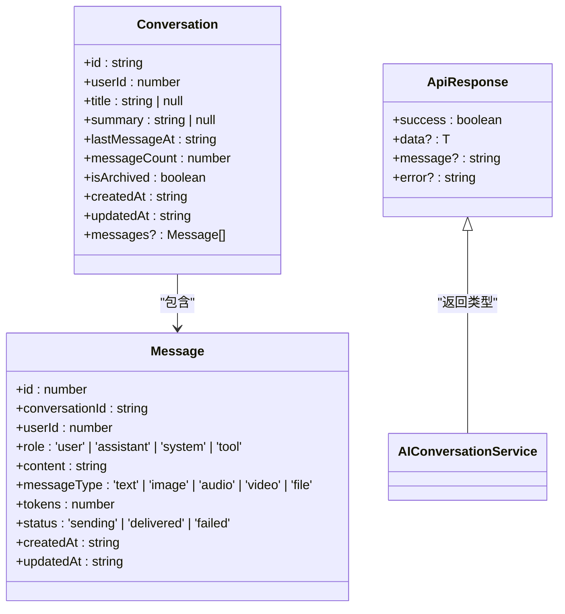

**Diagram sources**
- [ai-conversation.ts](file://k.yyup.com/client/src/api/modules/ai-conversation.ts#L18-L50)

**Section sources**
- [ai-conversation.ts](file://k.yyup.com/client/src/api/modules/ai-conversation.ts#L17-L241)

### 会话管理服务
`AIConversationService`类提供了完整的会话管理功能，包括创建、获取、更新和删除会话。

```mermaid
classDiagram
class AIConversationService {
+getConversations(params?) : Promise<ApiResponse<Conversation[]>>
+createConversation(data?) : Promise<ApiResponse<Conversation>>
+updateConversationTitle(conversationId, data) : Promise<ApiResponse<Conversation>>
+deleteConversation(conversationId) : Promise<ApiResponse<null>>
+getConversationMessages(conversationId, params?) : Promise<ApiResponse<{conversation, messages}>>
+addMessage(conversationId, data) : Promise<ApiResponse<Message>>
+getConversation(conversationId) : Promise<ApiResponse<Conversation>>
+archiveConversation(conversationId) : Promise<ApiResponse<null>>
+unarchiveConversation(conversationId) : Promise<ApiResponse<Conversation>>
+clearConversationMessages(conversationId) : Promise<ApiResponse<null>>
+bulkDeleteConversations(conversationIds) : Promise<ApiResponse<null>>
+getConversationStats(conversationId) : Promise<ApiResponse<{messageCount, tokenCount, lastActivityTime, averageResponseTime}>>
+searchConversations(query, params?) : Promise<ApiResponse<Conversation[]>>
+exportConversation(conversationId, format) : Promise<Blob>
+importConversation(file) : Promise<ApiResponse<Conversation>>
+duplicateConversation(conversationId, newTitle?) : Promise<ApiResponse<Conversation>>
+mergeConversations(sourceConversationIds, targetConversationId?, newTitle?) : Promise<ApiResponse<Conversation>>
}
AIConversationService --> Conversation : "操作"
AIConversationService --> Message : "操作"
AIConversationService --> ApiResponse : "返回"
```

**Diagram sources**
- [ai-conversation.ts](file://k.yyup.com/client/src/api/modules/ai-conversation.ts#L71-L239)

**Section sources**
- [ai-conversation.ts](file://k.yyup.com/client/src/api/modules/ai-conversation.ts#L71-L239)

## HTTP请求配置
`request.ts`文件定义了HTTP请求的全局配置，包括超时设置、拦截器和请求/响应转换。

### 请求实例配置
系统创建了多个axios实例，针对不同类型的请求进行优化配置。

```mermaid
classDiagram
class AxiosInstance {
+baseURL : string
+timeout : number
+withCredentials : boolean
+headers : object
}
class Service {
+baseURL : getApiBaseURL()
+timeout : TimeoutConfigManager.getTimeoutByType('DEFAULT')
+headers : {'Content-Type' : 'application/json; charset=utf-8'}
}
class AiService {
+baseURL : getApiBaseURL()
+timeout : TimeoutConfigManager.getTimeoutByType('AI_ANALYSIS')
+headers : {'Content-Type' : 'application/json; charset=utf-8'}
}
class VideoCreationService {
+baseURL : getApiBaseURL()
+timeout : TimeoutConfigManager.getTimeoutByType('VIDEO_CREATION')
+headers : {'Content-Type' : 'application/json; charset=utf-8'}
}
Service --> AxiosInstance : "继承"
AiService --> AxiosInstance : "继承"
VideoCreationService --> AxiosInstance : "继承"
```

**Diagram sources**
- [request.ts](file://k.yyup.com/client/src/utils/request.ts#L88-L116)

**Section sources**
- [request.ts](file://k.yyup.com/client/src/utils/request.ts#L88-L116)

### 请求拦截器
请求拦截器负责添加认证头和防止缓存。

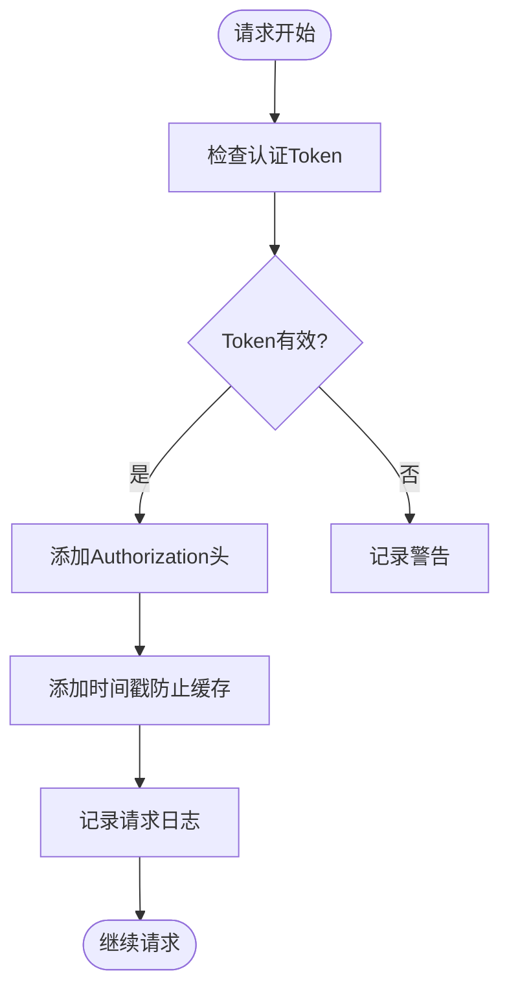

**Diagram sources**
- [request.ts](file://k.yyup.com/client/src/utils/request.ts#L118-L146)

**Section sources**
- [request.ts](file://k.yyup.com/client/src/utils/request.ts#L118-L146)

### 响应拦截器
响应拦截器处理认证过期和网络错误。

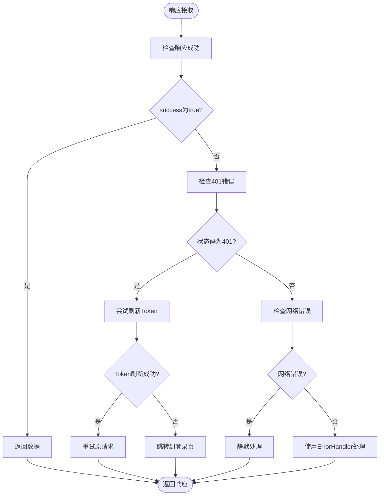

**Diagram sources**
- [request.ts](file://k.yyup.com/client/src/utils/request.ts#L154-L316)

**Section sources**
- [request.ts](file://k.yyup.com/client/src/utils/request.ts#L154-L316)

## SSE流式数据处理
SSE（Server-Sent Events）流式数据处理机制允许客户端实时接收AI助手的响应，提供更好的用户体验。

### 流式数据处理流程
`sendMessageStream`方法实现了完整的SSE流式数据处理流程。

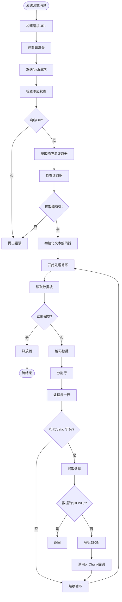

**Diagram sources**
- [ai.ts](file://k.yyup.com/client/src/api/ai.ts#L379-L456)

**Section sources**
- [ai.ts](file://k.yyup.com/client/src/api/ai.ts#L379-L456)

### 连接管理与错误恢复
系统实现了完善的连接管理和错误恢复策略。

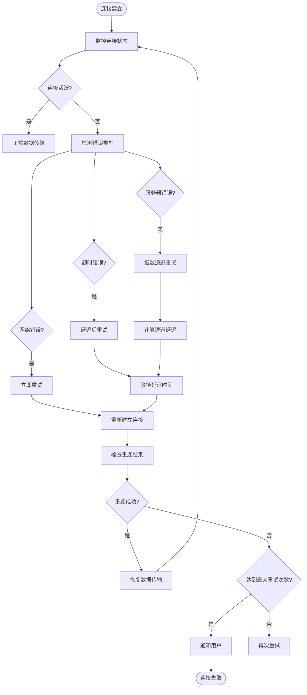

**Diagram sources**
- [request.ts](file://k.yyup.com/client/src/utils/request.ts#L324-L342)

**Section sources**
- [request.ts](file://k.yyup.com/client/src/utils/request.ts#L324-L342)

## Vue组件中的API使用
在Vue组件中，可以通过导入`aiApi`来使用AI助手的API功能。

### 在Vue组件中调用API
`ai-chat-interface-fixed.vue`展示了如何在Vue组件中使用AI API。

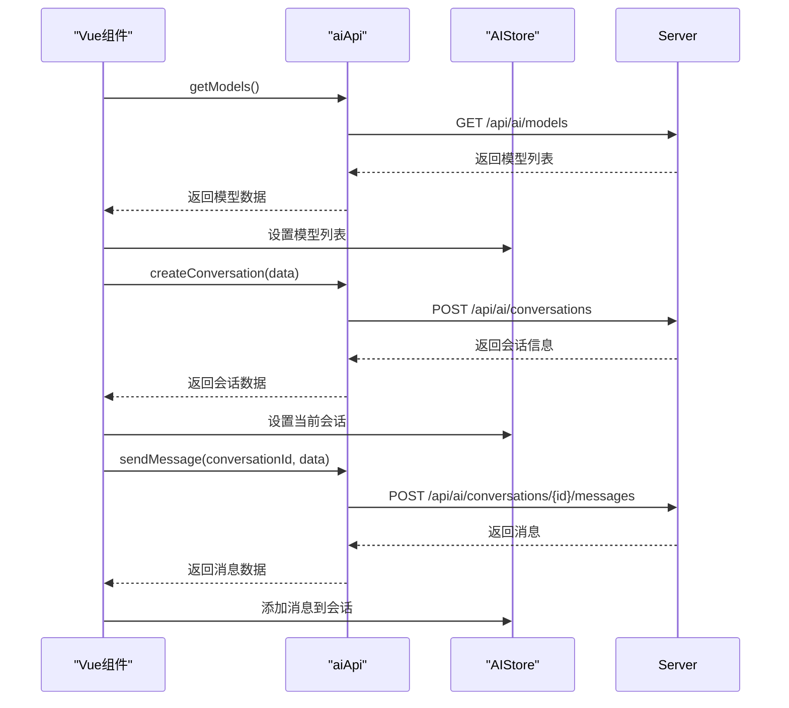

**Diagram sources**
- [ai-chat-interface-fixed.vue](file://k.yyup.com/ai-chat-interface-fixed.vue#L198)
- [ai.ts](file://k.yyup.com/client/src/api/ai.ts#L363-L371)

**Section sources**
- [ai-chat-interface-fixed.vue](file://k.yyup.com/ai-chat-interface-fixed.vue#L198)
- [ai.ts](file://k.yyup.com/client/src/api/ai.ts#L363-L371)

### 移动端AI助手实现
`MobileAiAssistant.vue`展示了移动端AI助手的实现。

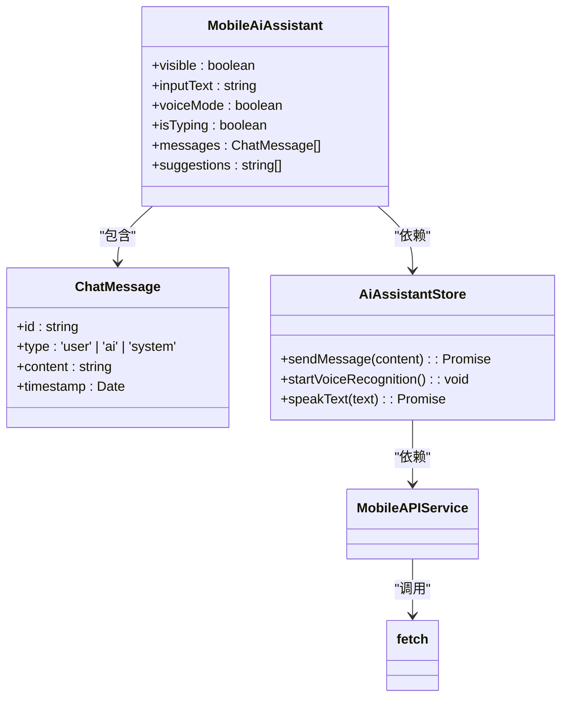

**Diagram sources**
- [MobileAiAssistant.vue](file://k.yyup.com/client/aimobile/components/MobileAiAssistant.vue#L296)
- [ai-assistant.ts](file://k.yyup.com/client/aimobile/stores/ai-assistant.ts#L62)
- [mobile-api.service.ts](file://k.yyup.com/client/aimobile/services/mobile-api.service.ts#L25)

**Section sources**
- [MobileAiAssistant.vue](file://k.yyup.com/client/aimobile/components/MobileAiAssistant.vue#L296)
- [ai-assistant.ts](file://k.yyup.com/client/aimobile/stores/ai-assistant.ts#L62)
- [mobile-api.service.ts](file://k.yyup.com/client/aimobile/services/mobile-api.service.ts#L25)

## 错误处理与重试机制
系统实现了完善的错误处理和重试机制，确保API调用的可靠性。

### 错误处理策略
错误处理策略涵盖了认证过期、网络错误和服务器错误等多种情况。

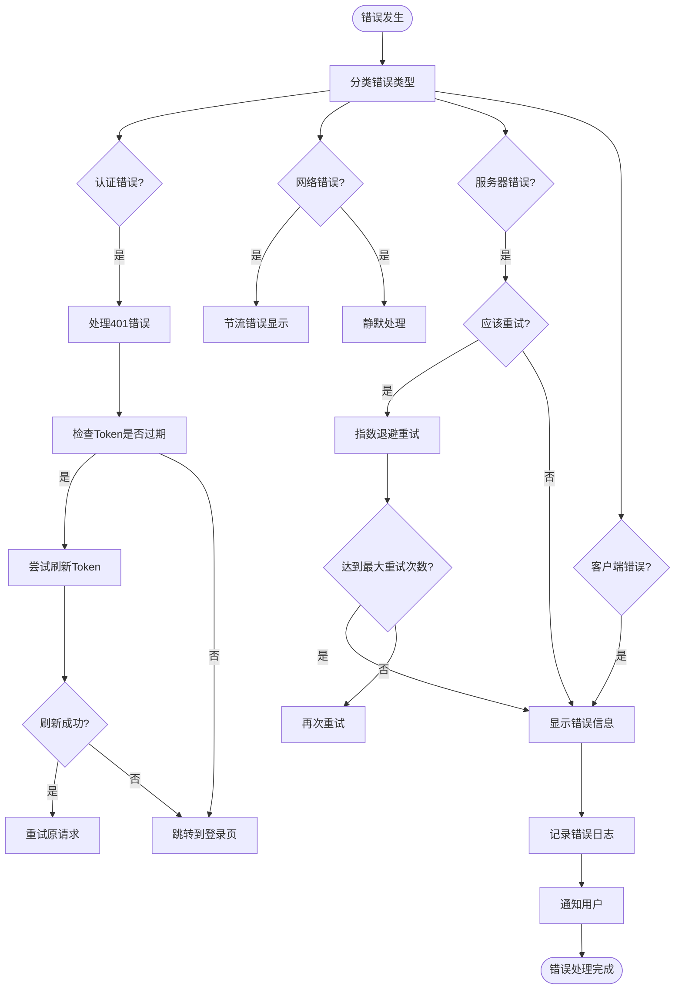

**Diagram sources**
- [request.ts](file://k.yyup.com/client/src/utils/request.ts#L211-L316)

**Section sources**
- [request.ts](file://k.yyup.com/client/src/utils/request.ts#L211-L316)

### 重试机制
重试机制通过`retryRequest`函数实现，支持多种错误类型的重试。

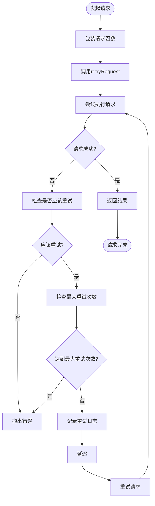

**Diagram sources**
- [request.ts](file://k.yyup.com/client/src/utils/request.ts#L325-L342)

**Section sources**
- [request.ts](file://k.yyup.com/client/src/utils/request.ts#L325-L342)

## 总结
本文档详细分析了AI助手前端API客户端的实现，涵盖了核心API接口、会话管理模块、HTTP请求配置、SSE流式数据处理、Vue组件中的API使用以及错误处理与重试机制。通过这些详细的说明和示例，开发者可以更好地理解和使用AI助手的API功能，构建高效、可靠的AI应用。