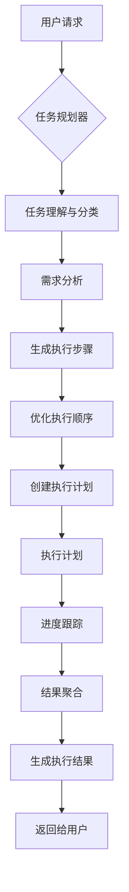
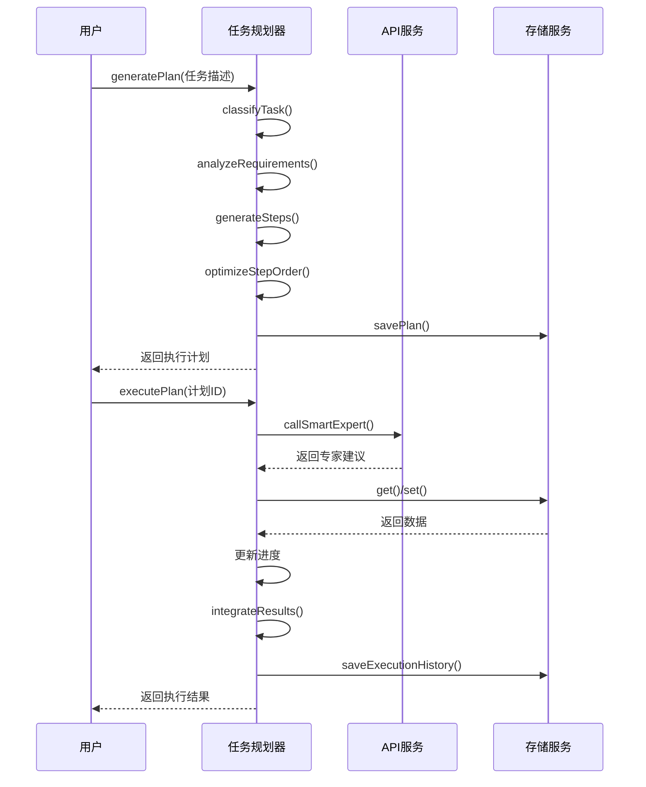

# 服务调用

<cite>
**本文档引用的文件**  
- [ai-task-planner.service.ts](file://k.yyup.com/client/aimobile/services/ai-task-planner.service.ts)
- [function-tools.js](file://k.yyup.com/client/src/api/ai/function-tools.js)
- [mobile-api.service.ts](file://k.yyup.com/client/aimobile/services/mobile-api.service.ts)
- [mobile-storage.service.ts](file://k.yyup.com/client/aimobile/services/mobile-storage.service.ts)
</cite>

## 目录
1. [简介](#简介)
2. [任务规划器服务逻辑](#任务规划器服务逻辑)
3. [前端功能工具实现](#前端功能工具实现)
4. [服务调用完整示例](#服务调用完整示例)
5. [服务间通信模式](#服务间通信模式)
6. [长时间运行任务与用户中断处理](#长时间运行任务与用户中断处理)

## 简介
本文档全面阐述AI助手服务的前端集成机制，重点分析任务规划器的服务逻辑和前端功能工具的实现方式。文档详细说明了任务分解算法、执行队列管理、进度跟踪、结果聚合等核心功能，以及表单填写、页面导航、屏幕截图、元素点击等具体工具的调用方式和参数配置。同时，文档提供了服务调用的完整示例，展示了如何将用户请求转换为AI可执行的任务序列，并描述了服务间通信模式和长时间运行任务的处理机制。

## 任务规划器服务逻辑

AI任务规划器服务（AITaskPlannerService）是智能工作流编排引擎，能够理解复杂任务、自动分解、动态规划并智能执行。该服务通过`generatePlan`方法生成执行计划，通过`executePlan`方法执行计划，并提供进度回调和错误处理机制。

任务规划器定义了多种任务类型（TaskType）和工具类型（ToolType），包括活动策划、招生策略、课程设计、成本分析、风险评估、内容创作和综合报告等。每个任务步骤（TaskStep）包含ID、名称、描述、类型、依赖关系、输入、输出、状态等属性。

执行计划（ExecutionPlan）包含任务描述、任务类型、步骤列表、上下文和元数据。任务上下文（TaskContext）保存原始请求、用户需求、中间结果、共享数据和约束条件。执行结果（ExecutionResult）包含计划ID、状态、结果、摘要、建议、产出物和指标。

**Section sources**
- [ai-task-planner.service.ts](file://k.yyup.com/client/aimobile/services/ai-task-planner.service.ts#L1-L761)

## 前端功能工具实现

前端功能工具（function-tools.js）提供了一组API，用于与统一智能系统进行交互。这些API包括智能聊天、获取可用工具列表、执行工具调用、获取执行历史和获取工具统计信息。

然而，这些API已被标记为废弃（@deprecated），建议使用新的统一智能系统函数替代。迁移指南建议使用`callUnifiedIntelligence()`替代`smartChat()`和`executeTool()`，使用`getUnifiedSystemCapabilities()`替代`getAvailableTools()`，使用`getUnifiedSystemStatus()`替代`getToolStats()`。

智能聊天功能通过POST请求调用`/ai/unified/unified-chat`接口，传递消息内容、用户ID、会话ID和上下文。执行工具调用功能将工具名称和参数转换为自然语言指令，然后通过统一聊天接口执行。

**Section sources**
- [function-tools.js](file://k.yyup.com/client/src/api/ai/function-tools.js#L1-L78)

## 服务调用完整示例

以下示例展示了如何将用户请求转换为AI可执行的任务序列：

**Diagram sources**
- [ai-task-planner.service.ts](file://k.yyup.com/client/aimobile/services/ai-task-planner.service.ts#L109-L227)

## 服务间通信模式

服务间通信采用异步调用和承诺链（Promise Chain）模式。任务规划器服务通过`mobileAPIService`调用智能专家，通过`mobileStorageService`读写本地存储，通过`mobileNotificationService`发送通知。

错误传播机制通过try-catch块实现。在`generatePlan`和`executePlan`方法中，捕获到错误后会记录日志并重新抛出。步骤执行失败时，会记录错误信息，并根据重试次数决定是否重新执行。

**Diagram sources**
- [ai-task-planner.service.ts](file://k.yyup.com/client/aimobile/services/ai-task-planner.service.ts#L109-L227)
- [mobile-api.service.ts](file://k.yyup.com/client/aimobile/services/mobile-api.service.ts)
- [mobile-storage.service.ts](file://k.yyup.com/client/aimobile/services/mobile-storage.service.ts)

## 长时间运行任务与用户中断处理

任务规划器服务通过`activePlans` Map对象管理活动计划，通过`executionHistory`数组保存执行历史。执行计划在本地存储中持久化，具有7天的TTL（Time To Live）。

用户中断操作通过`cancelPlan`方法处理。该方法将指定计划中所有正在运行的步骤状态设置为"failed"，错误信息为"用户取消"，然后更新计划。这允许用户在任何时候取消长时间运行的任务。

执行进度通过`onProgress`回调函数报告，该函数在每个步骤完成后调用，传递当前步骤和整体进度百分比。这使得前端可以实时更新进度条或显示执行状态。

**Section sources**
- [ai-task-planner.service.ts](file://k.yyup.com/client/aimobile/services/ai-task-planner.service.ts#L737-L754)