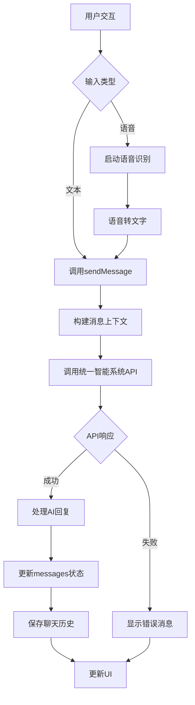

# 状态管理

<cite>
**本文档引用的文件**   
- [ai-assistant.ts](file://k.yyup.com/client/src/stores/ai-assistant.ts)
- [ai-assistant.ts](file://k.yyup.com/client/aimobile/stores/ai-assistant.ts)
- [mobile-ai.ts](file://k.yyup.com/client/aimobile/stores/mobile-ai.ts)
- [MobileAiAssistant.vue](file://k.yyup.com/client/aimobile/components/MobileAiAssistant.vue)
- [MobileExpertChat.vue](file://k.yyup.com/client/aimobile/components/MobileExpertChat.vue)
- [ai-chat-interface-fixed.vue](file://k.yyup.com/ai-chat-interface-fixed.vue)
</cite>

## 目录
1. [AI助手状态管理机制](#ai助手状态管理机制)
2. [移动端AI状态特殊处理](#移动端ai状态特殊处理)
3. [状态变更流程](#状态变更流程)
4. [Vue组件中的状态使用](#vue组件中的状态使用)
5. [状态持久化与共享](#状态持久化与共享)

## AI助手状态管理机制

AI助手的状态管理通过Pinia store实现，主要包含面板状态、聊天状态、上下文状态和记忆管理等核心属性。状态属性包括`panelVisible`（面板可见性）、`currentSessionId`（当前会话ID）、`currentPageContext`（当前页面上下文）和`memoryEnabled`（记忆功能开关）等。

计算属性`contextSummary`和`permissionsSummary`用于生成上下文摘要和权限摘要，便于在UI中展示。action方法如`togglePanel`、`updatePageContext`和`initializeState`提供了状态变更的接口，其中`initializeState`方法在初始化时检查用户权限并从本地存储恢复状态。

状态管理还实现了快捷操作缓存机制，通过`cacheShortcuts`和`getCachedShortcuts`方法实现5分钟的缓存有效期，提升用户体验。

**Section sources**
- [ai-assistant.ts](file://k.yyup.com/client/src/stores/ai-assistant.ts#L29-L426)

## 移动端AI状态特殊处理

移动端AI状态管理具有特殊处理逻辑，主要体现在离线状态管理、本地缓存策略和状态同步机制上。`mobile-ai.ts`文件中的store定义了`conversationId`、`messages`和`isLoading`等状态，支持各角色的个性化AI交互体验。

离线状态管理通过`aiOnline`状态和`checkAIStatus`方法实现，能够检测网络连接状态并相应更新UI。本地缓存策略在`loadChatHistory`和`saveChatHistory`方法中体现，使用localStorage持久化聊天历史和设置。

状态同步机制通过`sendMessage`方法实现，该方法构建符合后端期望的消息格式，并调用统一智能系统API进行通信。响应处理包括AI回复内容提取、工具执行结果处理和UI组件渲染等。

**Section sources**
- [mobile-ai.ts](file://k.yyup.com/client/aimobile/stores/mobile-ai.ts#L52-L456)

## 状态变更流程

状态变更流程从用户交互开始，经过API调用再到状态更新，形成完整的闭环。流程图如下：

**Diagram sources**
- [mobile-ai.ts](file://k.yyup.com/client/aimobile/stores/mobile-ai.ts#L128-L270)

## Vue组件中的状态使用

在Vue组件中，通过`useAiAssistantStore`和`useMobileAIStore`等composable函数使用这些store。组件通过`addMessage`、`updateMessage`和`removeMessage`等方法提交状态变更，确保状态的一致性。

错误处理在组件的try-catch块中实现，如`MobileAiAssistant.vue`中的`sendMessage`方法，捕获API调用异常并显示友好的错误提示。状态订阅通过Vue的响应式系统自动完成，当store状态变化时，相关组件会自动更新。

组件还实现了输入验证，如检查消息内容是否为空，以及禁用状态管理，如在加载时禁用发送按钮，提升用户体验。

**Section sources**
- [MobileAiAssistant.vue](file://k.yyup.com/client/aimobile/components/MobileAiAssistant.vue#L250-L629)
- [MobileExpertChat.vue](file://k.yyup.com/client/aimobile/components/MobileExpertChat.vue#L187-L518)

## 状态持久化与共享

状态持久化策略主要依赖localStorage，将关键状态如面板可见性、面板宽度、记忆设置和聊天历史等保存到本地。`initializeState`方法在初始化时从localStorage恢复这些状态，确保用户设置的持久性。

跨组件状态共享通过Pinia store实现，多个组件可以导入同一个store实例，实现状态的全局共享。如`MobileAiAssistant.vue`和`MobileExpertChat.vue`都使用`useAiAssistantStore`，确保AI助手状态的一致性。

持久化数据包括会话ID、消息列表、用户偏好和系统设置等，通过`saveChatHistory`方法定期保存，避免数据丢失。

**Section sources**
- [ai-assistant.ts](file://k.yyup.com/client/src/stores/ai-assistant.ts#L289-L333)
- [mobile-ai.ts](file://k.yyup.com/client/aimobile/stores/mobile-ai.ts#L539-L552)