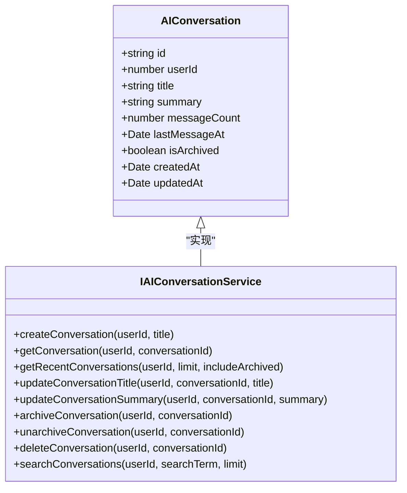
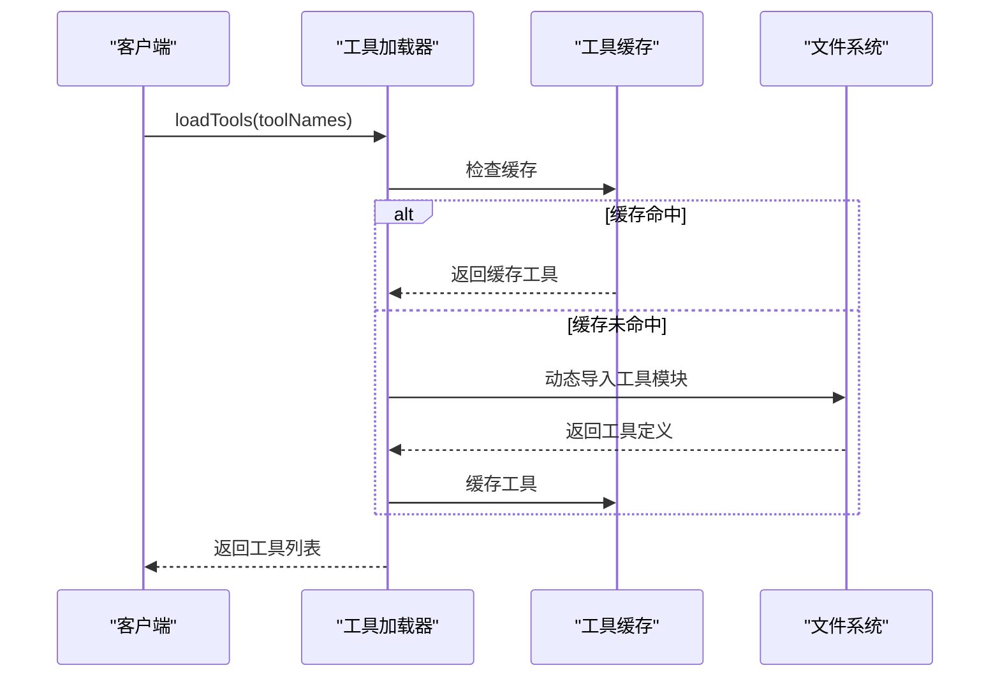
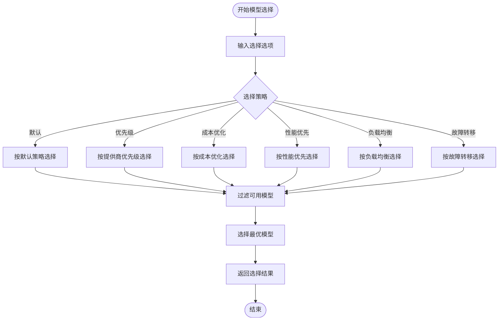
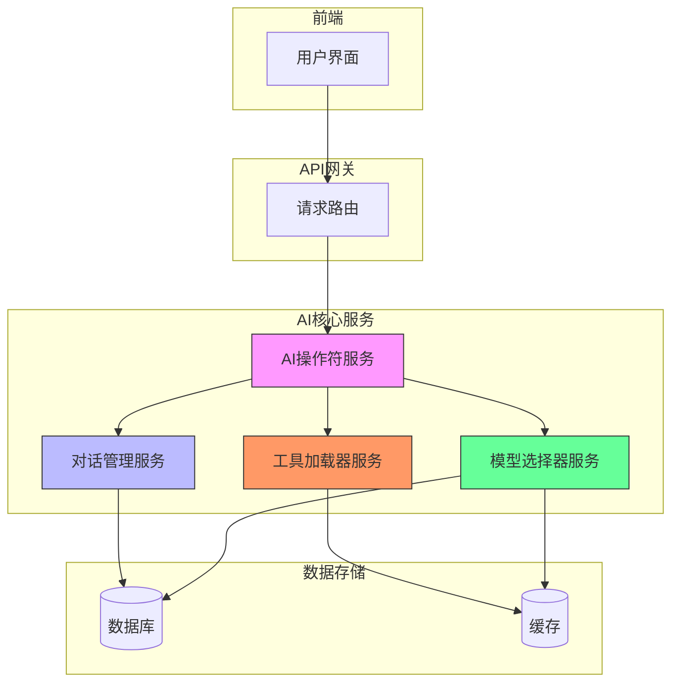

# 后端架构

<cite>
**本文档引用的文件**
- [ai-operator.service.ts](file://server/src/services/ai-operator/unified-intelligence.service.ts)
- [ai-conversation.service.ts](file://unified-tenant-system/server/src/services/ai/ai-conversation.service.ts)
- [tool-loader.service.ts](file://unified-tenant-system/server/src/services/ai/tools/core/tool-loader.service.ts)
- [model-selector.service.ts](file://unified-tenant-system/server/src/services/ai/model-selector.service.ts)
</cite>

## 目录
1. [引言](#引言)
2. [AI操作符核心调度机制](#ai操作符核心调度机制)
3. [对话管理系统实现](#对话管理系统实现)
4. [AI工具加载器工作原理](#ai工具加载器工作原理)
5. [模型选择器决策逻辑](#模型选择器决策逻辑)
6. [系统架构与数据流](#系统架构与数据流)
7. [可扩展性设计](#可扩展性设计)
8. [结论](#结论)

## 引言

本文档深入解析AI助手的后端架构设计，重点分析核心服务组件的实现机制。系统采用模块化设计，通过AI操作符服务协调请求路由、模型选择和执行流程，结合对话管理、工具加载和模型选择等核心服务，构建了一个高效、可扩展的智能助手后端系统。文档将详细说明各组件的功能实现、交互关系和设计原则。

## AI操作符核心调度机制

AI操作符服务（`unified-intelligence.service.ts`）作为系统的核心调度中心，负责处理所有AI请求的完整生命周期。该服务实现了请求路由、上下文管理、模型选择协调和执行调度等关键功能。

当接收到用户请求时，服务首先进行意图分析，确定请求的类型和所需执行的操作。基于分析结果，服务会协调调用模型选择器服务来确定最优AI模型，并根据任务需求加载相应的AI工具。整个调度过程采用异步非阻塞模式，确保高并发场景下的性能表现。

服务还实现了多轮对话的上下文管理，能够维护会话状态并在连续交互中保持语义连贯性。通过与对话管理服务的集成，AI操作符能够访问历史对话记录，为用户提供上下文感知的智能响应。

**Section sources**
- [unified-intelligence.service.ts](file://server/src/services/ai-operator/unified-intelligence.service.ts)

## 对话管理系统实现

对话管理服务（`ai-conversation.service.ts`）负责AI会话的全生命周期管理，包括会话创建、消息存储、状态维护和数据检索等功能。

### 会话生命周期管理

会话服务采用UUID作为会话标识符，确保全局唯一性。当用户发起新对话时，服务会创建包含用户ID、会话ID、创建时间等信息的会话记录。每个会话可设置标题和摘要，便于用户识别和管理。

服务提供了完整的CRUD操作接口：
- **创建会话**：生成新会话并初始化相关元数据
- **获取会话**：根据用户ID和会话ID检索特定会话详情
- **更新会话**：支持修改会话标题和摘要
- **归档/恢复会话**：实现会话的软删除和恢复功能
- **删除会话**：永久移除会话记录

### 上下文存储

会话数据持久化存储在数据库中，包含以下关键字段：
- `id`：会话唯一标识符
- `userId`：关联用户ID
- `title`：会话标题
- `summary`：会话摘要
- `messageCount`：消息数量统计
- `lastMessageAt`：最后消息时间戳
- `isArchived`：归档状态标志
- `createdAt`和`updatedAt`：创建和更新时间

### 多轮对话处理

服务支持多轮对话场景，通过维护会话上下文实现连贯的交互体验。系统提供以下核心功能：
- **最近会话列表**：按最后消息时间倒序排列，支持数量限制
- **会话搜索**：基于标题和摘要的模糊搜索功能
- **批量操作**：支持归档、恢复和删除等批量管理操作

所有数据库操作均包含完善的错误处理机制，确保数据一致性和系统稳定性。

**Diagram sources**
- [ai-conversation.service.ts](file://unified-tenant-system/server/src/services/ai/ai-conversation.service.ts#L8-L337)

**Section sources**
- [ai-conversation.service.ts](file://unified-tenant-system/server/src/services/ai/ai-conversation.service.ts#L8-L337)

## AI工具加载器工作原理

工具加载器服务（`tool-loader.service.ts`）负责AI工具的动态注册、元数据管理和调用分发，是系统功能扩展的核心组件。

### 动态工具注册

服务采用模块化设计，支持工具的动态加载和注册。工具定义包含以下关键属性：
- `name`：工具唯一名称
- `description`：功能描述
- `category`：分类（如查询、生成、操作等）
- `parameters`：参数定义和验证规则
- `handler`：实际执行函数

工具注册通过`registerTool`方法实现，将工具实例存储在内存映射中，确保快速访问。

### 元数据管理

服务维护完整的工具元数据信息，包括：
- **分类管理**：按功能类别组织工具
- **缓存机制**：使用Map结构缓存已加载工具，避免重复加载
- **加载状态跟踪**：记录工具的加载进度和状态

### 调用分发

工具调用流程如下：
1. 接收工具名称和参数
2. 从缓存中查找工具定义
3. 验证工具存在性
4. 执行工具处理函数
5. 返回执行结果

服务还实现了智能加载策略，支持从多个路径加载工具定义，并提供兼容性支持以确保旧版工具的正常运行。

**Diagram sources**
- [tool-loader.service.ts](file://unified-tenant-system/server/src/services/ai/tools/core/tool-loader.service.ts#L6-L248)

**Section sources**
- [tool-loader.service.ts](file://unified-tenant-system/server/src/services/ai/tools/core/tool-loader.service.ts#L6-L248)

## 模型选择器决策逻辑

模型选择器服务（`model-selector.service.ts`）根据任务特征智能选择最优AI模型，是系统性能和成本平衡的关键组件。

### 决策策略

服务支持多种模型选择策略：
- **默认策略**：优先使用用户指定或系统默认模型
- **优先级策略**：按提供商优先级排序选择
- **成本优化**：选择成本最低的可用模型
- **性能优先**：选择性能最优的模型
- **负载均衡**：采用轮询策略分发请求
- **故障转移**：在主模型不可用时自动切换

### 决策流程

模型选择流程如下：
1. 根据模型类型获取可用模型列表
2. 应用排除规则过滤指定模型
3. 验证模型能力是否满足需求
4. 根据选择策略确定最优模型
5. 返回选择结果和备选方案

### 能力匹配

服务支持基于模型能力的精确匹配，可验证以下能力：
- 文本处理
- 图像分析
- 推理能力
- 实时响应
- 多模态支持

选择结果包含主选模型、选择理由和备选模型列表，为系统提供透明的决策过程。

**Diagram sources**
- [model-selector.service.ts](file://unified-tenant-system/server/src/services/ai/model-selector.service.ts#L6-L369)

**Section sources**
- [model-selector.service.ts](file://unified-tenant-system/server/src/services/ai/model-selector.service.ts#L6-L369)

## 系统架构与数据流

系统采用分层架构设计，各组件通过清晰的接口进行交互，确保高内聚低耦合。

**Diagram sources**
- [unified-intelligence.service.ts](file://server/src/services/ai-operator/unified-intelligence.service.ts)
- [ai-conversation.service.ts](file://unified-tenant-system/server/src/services/ai/ai-conversation.service.ts)
- [tool-loader.service.ts](file://unified-tenant-system/server/src/services/ai/tools/core/tool-loader.service.ts)
- [model-selector.service.ts](file://unified-tenant-system/server/src/services/ai/model-selector.service.ts)

## 可扩展性设计

系统采用高度模块化的设计，支持轻松添加新的AI操作符和集成第三方AI服务。

### 新AI操作符添加

添加新AI操作符的步骤：
1. 创建新的服务文件
2. 定义操作符接口
3. 实现具体功能
4. 注册到操作符管理器
5. 配置路由和权限

### 第三方服务集成

集成第三方AI服务的流程：
1. 创建适配器层
2. 实现标准化接口
3. 配置认证和连接参数
4. 注册到模型管理器
5. 添加能力描述和元数据

系统通过依赖注入和接口抽象，确保新组件能够无缝集成到现有架构中，同时保持系统的稳定性和可维护性。

## 结论

本文档详细解析了AI助手后端架构的设计与实现。系统通过AI操作符服务作为核心调度中心，协调对话管理、工具加载和模型选择等关键组件，构建了一个高效、可扩展的智能助手平台。各服务组件采用模块化设计，具有清晰的职责划分和良好的可维护性。系统的可扩展性设计支持快速添加新功能和集成第三方服务，为未来的功能演进提供了坚实的基础。