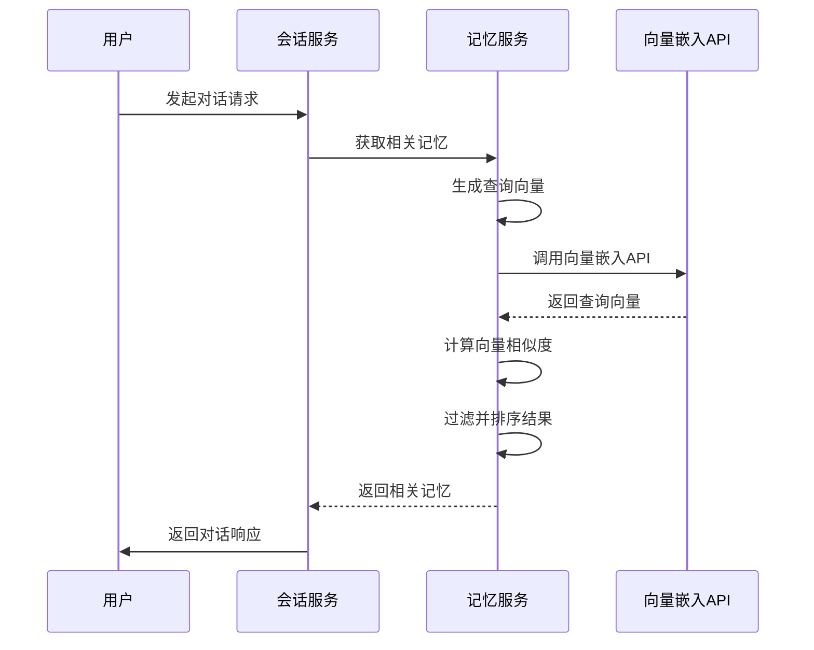
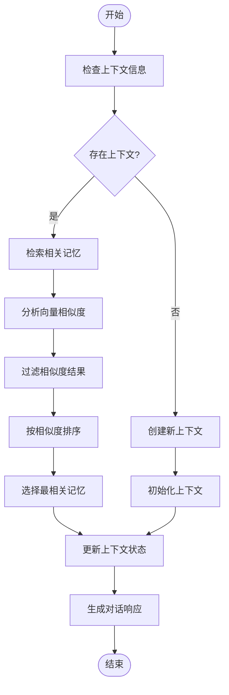

# 对话管理

<cite>
**本文档引用的文件**  
- [ai-conversation.service.ts](file://unified-tenant-system/server/src/services/ai/ai-conversation.service.ts)
- [ai-conversation.service.ts](file://k.yyup.com/server/src/services/ai/ai-conversation.service.ts)
- [ai-memory.service.ts](file://unified-tenant-system/server/src/services/ai/ai-memory.service.ts)
- [ai-conversation.model.ts](file://unified-tenant-system/server/src/models/ai-conversation.model.ts)
- [interfaces/index.ts](file://unified-tenant-system/server/src/services/ai/interfaces/index.ts)
</cite>

## 目录
1. [引言](#引言)
2. [会话生命周期管理](#会话生命周期管理)
3. [上下文信息存储与检索策略](#上下文信息存储与检索策略)
4. [对话状态跟踪与上下文切换](#对话状态跟踪与上下文切换)
5. [实际使用示例](#实际使用示例)
6. [高并发性能优化策略](#高并发性能优化策略)
7. [结论](#结论)

## 引言

AI助手对话管理系统是统一租户系统中的核心组件，负责管理用户与AI之间的交互会话。该系统通过会话服务、记忆服务和模型使用统计等模块，实现了完整的对话生命周期管理。本系统设计遵循模块化原则，各服务之间通过清晰的接口定义进行通信，确保了系统的可维护性和可扩展性。

系统主要包含会话管理、消息处理、记忆存储、权限控制和使用统计等功能模块。其中，会话服务负责会话的创建、查询、更新和删除操作；记忆服务通过向量嵌入技术实现上下文信息的智能检索；权限服务确保用户只能访问自己的会话数据。这种分层架构设计使得系统既能够满足当前需求，又具备良好的扩展能力。

**Section sources**
- [ai-conversation.service.ts](file://unified-tenant-system/server/src/services/ai/ai-conversation.service.ts#L1-L337)
- [interfaces/index.ts](file://unified-tenant-system/server/src/services/ai/interfaces/index.ts#L25-L65)

## 会话生命周期管理

AI会话服务实现了完整的会话生命周期管理机制，包括会话的创建、维护和销毁。会话服务通过UUID生成唯一会话标识符，确保每个会话的全局唯一性。当用户发起新的对话请求时，系统会调用`createConversation`方法创建新会话，并在数据库中持久化会话记录。

会话维护功能包括标题更新、摘要更新、归档和恢复等操作。系统通过`updateConversationTitle`和`updateConversationSummary`方法允许用户修改会话的元数据信息。归档功能通过`archiveConversation`和`unarchiveConversation`方法实现，用户可以将会话标记为归档状态，便于会话的组织和管理。已归档的会话不会出现在默认的会话列表中，但仍然可以通过搜索功能访问。

会话销毁通过`deleteConversation`方法实现，该方法会先验证用户权限，确保用户只能删除自己创建的会话。系统还提供了`searchConversations`方法，支持基于标题和摘要的全文搜索，帮助用户快速定位历史会话。所有会话操作都包含完善的错误处理机制，确保在数据库异常等情况下的系统稳定性。

```mermaid
classDiagram
class AIConversationService {
+createConversation(userId : number, title? : string) : Promise<{id : string, title : string | null}>
+getConversation(userId : number, conversationId : string) : Promise<ConversationDetail | null>
+getRecentConversations(userId : number, limit? : number, includeArchived? : boolean) : Promise<ConversationDetail[]>
+updateConversationTitle(userId : number, conversationId : string, title : string) : Promise<boolean>
+updateConversationSummary(userId : number, conversationId : string, summary : string) : Promise<boolean>
+archiveConversation(userId : number, conversationId : string) : Promise<boolean>
+unarchiveConversation(userId : number, conversationId : string) : Promise<boolean>
+deleteConversation(userId : number, conversationId : string) : Promise<boolean>
+searchConversations(userId : number, searchTerm : string, limit? : number) : Promise<ConversationDetail[]>
}
class IAIConversationService {
<<interface>>
+createConversation(userId : number, title? : string) : Promise<{id : string, title : string | null}>
+getConversation(userId : number, conversationId : string) : Promise<{...} | null>
+getRecentConversations(userId : number, limit? : number, includeArchived? : boolean) : Promise<Array<{...}>>
+updateConversationTitle(userId : number, conversationId : string, title : string) : Promise<boolean>
+updateConversationSummary(userId : number, conversationId : string, summary : string) : Promise<boolean>
+archiveConversation(userId : number, conversationId : string) : Promise<boolean>
+unarchiveConversation(userId : number, conversationId : string) : Promise<boolean>
+deleteConversation(userId : number, conversationId : string) : Promise<boolean>
}
AIConversationService ..|> IAIConversationService : 实现
```

**Diagram sources**
- [ai-conversation.service.ts](file://unified-tenant-system/server/src/services/ai/ai-conversation.service.ts#L30-L337)
- [interfaces/index.ts](file://unified-tenant-system/server/src/services/ai/interfaces/index.ts#L25-L65)

**Section sources**
- [ai-conversation.service.ts](file://unified-tenant-system/server/src/services/ai/ai-conversation.service.ts#L30-L337)
- [ai-conversation.model.ts](file://unified-tenant-system/server/src/models/ai-conversation.model.ts#L84-L214)

## 上下文信息存储与检索策略

系统采用多层次的上下文信息存储与检索策略，确保多轮对话的连贯性。记忆服务通过`createMemoryWithEmbedding`方法创建带向量嵌入的记忆，将文本内容转换为高维向量存储。系统支持多种向量嵌入提供商，包括OpenAI、DeepSeek和豆包（Doubao），并可根据数据库配置动态选择默认提供商。

上下文检索采用向量相似度匹配算法，通过余弦相似度计算查询文本与存储记忆的相似度。`findSimilarMemories`方法首先为查询文本生成向量嵌入，然后与数据库中所有记忆的向量进行相似度计算，返回相似度超过阈值的结果。为了优化性能，系统实现了TOKEN优化机制，通过`excludeIds`参数排除已使用的记忆ID，避免重复检索相同内容。

记忆服务还提供了多种检索方式，包括基于时间范围的检索（`searchMemoriesByTimeRange`）和特定时间段的记忆搜索（`searchLastMonthMemories`）。这些方法结合了向量相似度搜索和传统数据库查询，既保证了检索的准确性，又提高了查询效率。系统还实现了记忆重要性分级机制，根据内容的重要程度自动调整记忆的存储策略和检索优先级。



**Diagram sources**
- [ai-memory.service.ts](file://unified-tenant-system/server/src/services/ai/ai-memory.service.ts#L115-L1070)
- [ai-conversation.service.ts](file://unified-tenant-system/server/src/services/ai/ai-conversation.service.ts#L30-L337)

**Section sources**
- [ai-memory.service.ts](file://unified-tenant-system/server/src/services/ai/ai-memory.service.ts#L115-L1070)
- [ai-conversation.service.ts](file://unified-tenant-system/server/src/services/ai/ai-conversation.service.ts#L30-L337)

## 对话状态跟踪与上下文切换

系统通过会话模型中的状态字段和记忆服务的上下文管理机制实现对话状态的跟踪。`AIConversation`模型包含`lastPagePath`、`pageContext`和`usedMemoryIds`等字段，用于记录用户最后访问的页面路径、缓存的页面上下文信息和已使用的记忆ID列表。这些字段为AI提供了丰富的上下文信息，使其能够根据用户的操作环境调整响应策略。

上下文切换处理逻辑通过记忆服务的分类机制实现。系统将记忆分为即时记忆（immediate）、短期记忆（shortterm）和长期记忆（longterm）三种类型，分别对应不同的存储策略和生命周期。`archiveToLongTerm`方法允许将重要的短期记忆归档为长期记忆，确保关键信息的持久化。系统还实现了记忆过期清理机制，定期删除已过期的记忆记录，保持数据库的高效运行。

对话状态的跟踪还体现在会话的元数据管理上。`lastMessageAt`字段记录了会话中最后一条消息的时间，用于会话列表的排序和最近会话的筛选。`messageCount`字段统计会话中的消息数量，为用户提供会话活跃度的参考。这些状态信息的综合运用，使得系统能够智能地管理大量并发会话，为用户提供个性化的对话体验。



**Diagram sources**
- [ai-conversation.model.ts](file://unified-tenant-system/server/src/models/ai-conversation.model.ts#L84-L214)
- [ai-memory.service.ts](file://unified-tenant-system/server/src/services/ai/ai-memory.service.ts#L115-L1070)

**Section sources**
- [ai-conversation.model.ts](file://unified-tenant-system/server/src/models/ai-conversation.model.ts#L84-L214)
- [ai-memory.service.ts](file://unified-tenant-system/server/src/services/ai/ai-memory.service.ts#L115-L1070)

## 实际使用示例

在实际应用中，AI会话服务通过RESTful API接口供前端调用。创建新会话时，前端发送POST请求到`/api/ai/conversations`端点，携带用户ID和可选的会话标题。服务端验证用户权限后，生成UUID作为会话ID，并在`ai_conversations`表中创建新记录。成功后返回会话ID和标题，前端据此初始化对话界面。

获取会话列表时，前端调用`/api/ai/conversations/recent`接口，服务端调用`getRecentConversations`方法查询用户最近的会话。系统默认返回10个未归档的会话，按最后消息时间降序排列。用户可以通过搜索功能查找特定会话，系统使用Sequelize的`Op.or`操作符在标题和摘要字段进行模糊匹配。

当用户与AI交互时，消息服务会调用记忆服务的`findSimilarMemories`方法，检索与当前对话内容相关的记忆。系统将查询文本转换为向量嵌入，与数据库中的记忆向量进行相似度计算，返回最相关的记忆内容。这些记忆作为上下文信息传递给AI模型，确保对话的连贯性和一致性。整个过程通过异步操作实现，保证了系统的响应速度。

**Section sources**
- [ai-conversation.service.ts](file://unified-tenant-system/server/src/services/ai/ai-conversation.service.ts#L30-L337)
- [ai-memory.service.ts](file://unified-tenant-system/server/src/services/ai/ai-memory.service.ts#L115-L1070)

## 高并发性能优化策略

系统在高并发场景下采用了多种性能优化策略。数据库层面，`ai_conversations`表在`external_user_id`、`last_message_at`和`is_archived`字段上创建了索引，显著提高了查询效率。使用`underscored: true`配置自动将驼峰命名转换为下划线命名，减少了字段映射的开销。`messageCount`字段设置默认值为0，避免了空值处理的额外开销。

缓存策略方面，系统通过`usedMemoryIds`字段实现记忆使用状态的缓存，避免重复检索相同内容。向量嵌入计算采用异步处理模式，在创建记忆后单独执行，减少主流程的等待时间。对于频繁访问的向量嵌入模型配置，系统在服务初始化时从数据库加载到内存中，避免重复查询。

连接池管理通过Sequelize的连接池配置实现，合理设置最大连接数和空闲连接数，平衡资源利用率和响应速度。错误处理机制包含详细的日志记录和异常捕获，便于问题定位和性能分析。系统还实现了定期清理过期记忆的功能，通过`cleanupExpiredMemories`方法删除已过期的记忆记录，保持数据库的高效运行。

**Section sources**
- [ai-conversation.model.ts](file://unified-tenant-system/server/src/models/ai-conversation.model.ts#L195-L208)
- [ai-memory.service.ts](file://unified-tenant-system/server/src/services/ai/ai-memory.service.ts#L797-L812)

## 结论

AI助手对话管理系统通过完善的会话生命周期管理、智能的上下文信息存储与检索机制，以及高效的性能优化策略，为用户提供流畅的对话体验。系统架构设计合理，各组件职责清晰，接口定义规范，具备良好的可维护性和可扩展性。

会话服务实现了从创建到销毁的完整生命周期管理，支持会话的归档、搜索和元数据更新等高级功能。记忆服务采用向量嵌入技术，通过余弦相似度算法实现上下文的智能检索，确保多轮对话的连贯性。系统还通过多种性能优化策略，包括数据库索引、缓存机制和连接池管理，在高并发场景下保持稳定的性能表现。

未来可以进一步优化向量嵌入的计算效率，探索更先进的记忆压缩算法，并增强上下文切换的智能化程度。同时，可以引入机器学习模型对会话质量进行评估，持续改进对话管理系统的整体性能和用户体验。