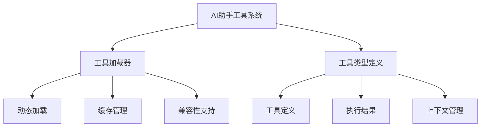
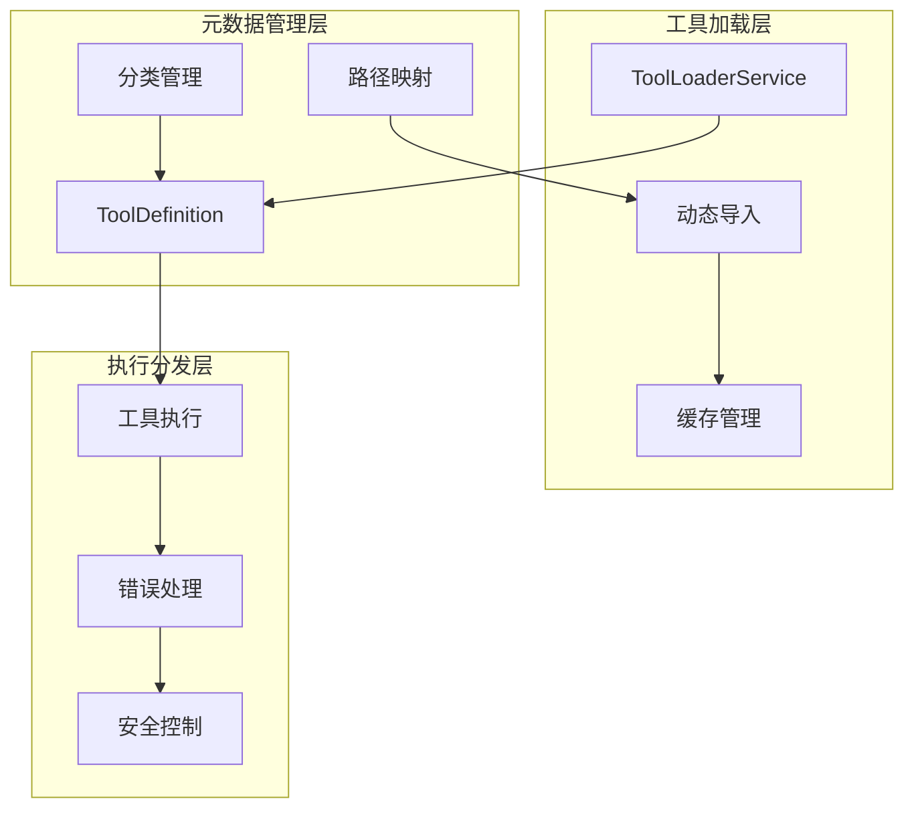
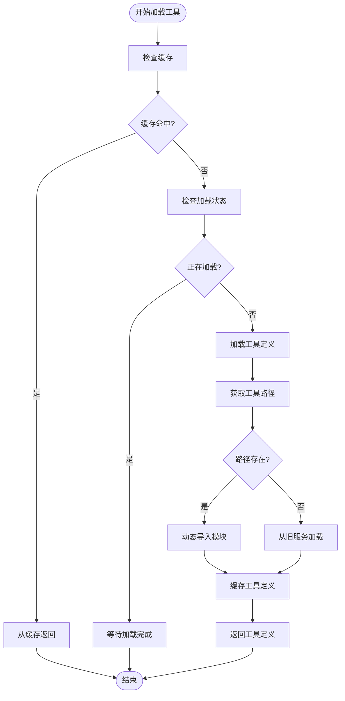
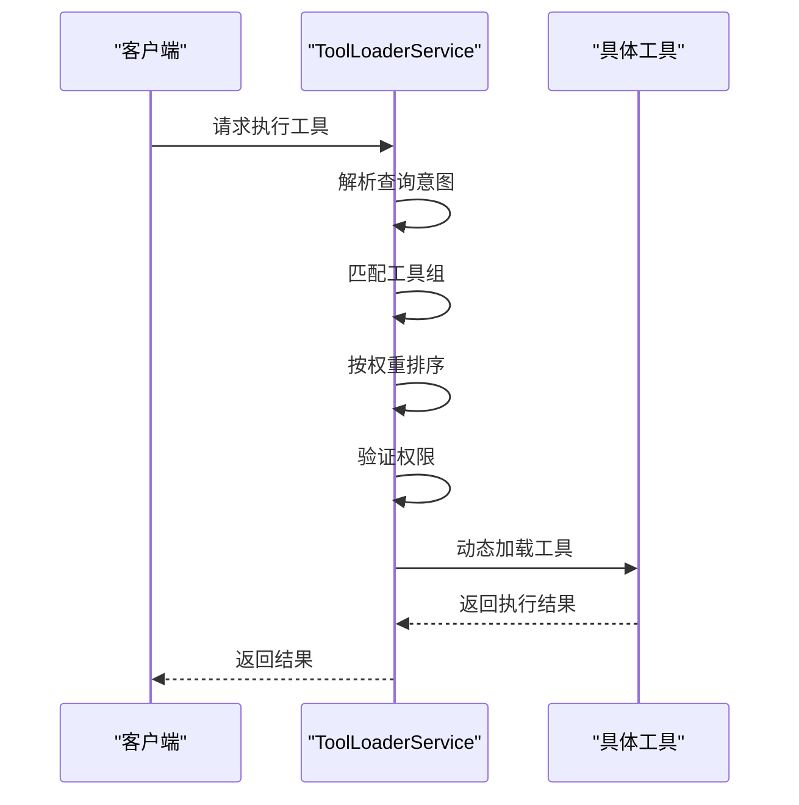
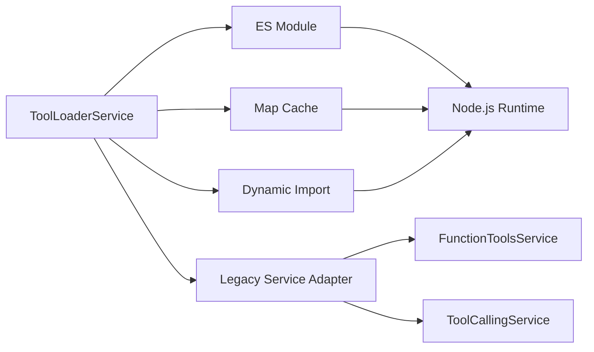

# 工具系统

<cite>
**本文档引用的文件**
- [tool-loader.service.ts](file://k.yyup.com/server/src/services/ai/tools/core/tool-loader.service.ts)
- [tool-loader.service.ts](file://unified-tenant-system/server/src/services/ai/tools/core/tool-loader.service.ts)
- [tool.types.ts](file://k.yyup.com/server/src/services/ai/tools/types/tool.types.ts)
- [tool.types.ts](file://unified-tenant-system/server/src/services/ai/tools/types/tool.types.ts)
</cite>

## 目录
1. [简介](#简介)
2. [项目结构](#项目结构)
3. [核心组件](#核心组件)
4. [架构概述](#架构概述)
5. [详细组件分析](#详细组件分析)
6. [依赖分析](#依赖分析)
7. [性能考虑](#性能考虑)
8. [故障排除指南](#故障排除指南)
9. [结论](#结论)

## 简介
本文档全面解析AI助手工具系统的实现原理，重点分析`tool-loader.service.ts`中的动态工具加载机制。系统采用模块化设计，支持工具的动态注册、发现和实例化，通过元数据管理和调用分发逻辑实现智能化工具选择。工具插件架构设计支持第三方工具的无缝集成，并包含完善的安全控制措施防止恶意工具执行。

## 项目结构
AI助手工具系统采用分层架构，核心工具加载功能位于服务层的AI工具模块中。系统通过清晰的目录结构组织不同类型的工具，包括UI展示、网页操作、数据库查询和业务操作等类别。



**图示来源**
- [tool-loader.service.ts](file://k.yyup.com/server/src/services/ai/tools/core/tool-loader.service.ts#L1-L120)
- [tool.types.ts](file://k.yyup.com/server/src/services/ai/tools/types/tool.types.ts#L1-L35)

**本节来源**
- [tool-loader.service.ts](file://k.yyup.com/server/src/services/ai/tools/core/tool-loader.service.ts#L1-L120)
- [tool.types.ts](file://k.yyup.com/server/src/services/ai/tools/types/tool.types.ts#L1-L35)

## 核心组件
工具系统的核心组件包括工具加载服务、工具定义接口和工具执行上下文。`ToolLoaderService`负责管理工具的生命周期，包括加载、缓存和执行。`ToolDefinition`接口定义了工具的元数据结构，包括名称、描述、参数和执行方法。系统通过`ToolContext`提供执行环境信息，确保工具在正确的上下文中运行。

**本节来源**
- [tool.types.ts](file://k.yyup.com/server/src/services/ai/tools/types/tool.types.ts#L5-L35)
- [tool-loader.service.ts](file://unified-tenant-system/server/src/services/ai/tools/core/tool-loader.service.ts#L6-L247)

## 架构概述
工具系统采用分层架构设计，包含工具加载层、元数据管理层和执行分发层。系统通过动态导入机制实现工具的按需加载，利用内存缓存提高加载效率，并通过路径映射表实现工具的快速定位。



**图示来源**
- [tool-loader.service.ts](file://unified-tenant-system/server/src/services/ai/tools/core/tool-loader.service.ts#L6-L247)
- [tool.types.ts](file://unified-tenant-system/server/src/services/ai/tools/types/tool.types.ts#L5-L73)

## 详细组件分析

### 工具加载器分析
`ToolLoaderService`是工具系统的核心组件，负责工具的动态加载和管理。服务采用单例模式，确保全局唯一的工具注册表。

#### 类图
```mermaid
classDiagram
class ToolLoaderService {
-toolCache : Map<string, ToolDefinition>
-loadingPromises : Map<string, Promise<ToolDefinition | null>>
+loadTools(toolNames : string[]) : Promise<ToolDefinition[]>
+loadSingleTool(toolName : string) : Promise<ToolDefinition | null>
+loadToolDefinition(toolName : string) : Promise<ToolDefinition | null>
+getToolPath(toolName : string) : string | null
+loadFromLegacyServices(toolName : string) : Promise<ToolDefinition | null>
+clearCache() : void
+getCacheStats() : { size : number; tools : string[] }
}
class ToolDefinition {
+name : string
+description : string
+category : string
+weight : number
+parameters : object
+implementation? : (args : any) => Promise<ToolResult>
}
ToolLoaderService --> ToolDefinition : "管理"
```

**图示来源**
- [tool-loader.service.ts](file://unified-tenant-system/server/src/services/ai/tools/core/tool-loader.service.ts#L6-L247)
- [tool.types.ts](file://unified-tenant-system/server/src/services/ai/tools/types/tool.types.ts#L5-L73)

### 工具注册与发现
系统通过路径映射表实现工具的快速发现和加载。每个工具在映射表中都有对应的文件路径，加载器根据工具名称查找并动态导入相应的模块。



**图示来源**
- [tool-loader.service.ts](file://unified-tenant-system/server/src/services/ai/tools/core/tool-loader.service.ts#L38-L71)
- [tool-loader.service.ts](file://unified-tenant-system/server/src/services/ai/tools/core/tool-loader.service.ts#L76-L96)

**本节来源**
- [tool-loader.service.ts](file://unified-tenant-system/server/src/services/ai/tools/core/tool-loader.service.ts#L6-L247)

### 工具元数据管理
系统通过`ToolDefinition`接口统一管理工具的元数据，包括名称、描述、分类、权重和参数定义。元数据用于工具的选择、排序和验证。

| 属性 | 类型 | 描述 |
|------|------|------|
| name | string | 工具名称，唯一标识 |
| description | string | 工具功能描述 |
| category | string | 工具分类（ui-display, web-operation等） |
| weight | number | 工具权重，影响选择优先级 |
| parameters | object | 工具参数定义，符合JSON Schema |

**本节来源**
- [tool.types.ts](file://unified-tenant-system/server/src/services/ai/tools/types/tool.types.ts#L5-L14)

### 调用分发逻辑
系统根据请求内容智能选择合适的工具执行。分发逻辑考虑查询意图、用户角色、工具权重和使用统计等因素。



**图示来源**
- [tool-loader.service.ts](file://unified-tenant-system/server/src/services/ai/tools/core/tool-loader.service.ts#L13-L33)
- [tool.types.ts](file://unified-tenant-system/server/src/services/ai/tools/types/tool.types.ts#L41-L55)

## 依赖分析
工具系统依赖于Node.js的动态导入功能实现按需加载，利用Map数据结构进行高效的缓存管理。系统与旧版服务保持兼容，通过适配器模式支持遗留工具的调用。



**图示来源**
- [tool-loader.service.ts](file://unified-tenant-system/server/src/services/ai/tools/core/tool-loader.service.ts#L76-L84)
- [tool-loader.service.ts](file://unified-tenant-system/server/src/services/ai/tools/core/tool-loader.service.ts#L149-L170)

**本节来源**
- [tool-loader.service.ts](file://unified-tenant-system/server/src/services/ai/tools/core/tool-loader.service.ts#L6-L247)

## 性能考虑
工具加载器采用多级缓存策略，首次加载后将工具定义缓存在内存中，避免重复的文件系统访问和模块解析。系统支持并发加载多个工具，通过Promise.all实现并行处理。

- **缓存命中率**：通过`getCacheStats()`方法监控缓存使用情况
- **加载延迟**：首次加载包含文件读取和模块解析开销
- **内存占用**：缓存所有已加载的工具定义
- **并发性能**：支持同时加载多个工具，避免阻塞

## 故障排除指南
当工具系统出现问题时，可参考以下常见问题和解决方案：

**本节来源**
- [tool-loader.service.ts](file://unified-tenant-system/server/src/services/ai/tools/core/tool-loader.service.ts#L93-L95)
- [tool-loader.service.ts](file://unified-tenant-system/server/src/services/ai/tools/core/tool-loader.service.ts#L167-L169)

## 结论
AI助手工具系统通过`tool-loader.service.ts`实现了灵活的动态工具加载机制。系统采用模块化设计，支持工具的注册、发现和实例化，通过元数据管理和智能分发逻辑实现高效的工具调用。插件架构设计确保了系统的可扩展性，兼容性支持保证了平滑的版本升级。整体设计注重性能和安全性，为AI助手提供了强大的工具支持能力。