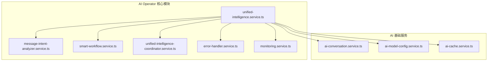
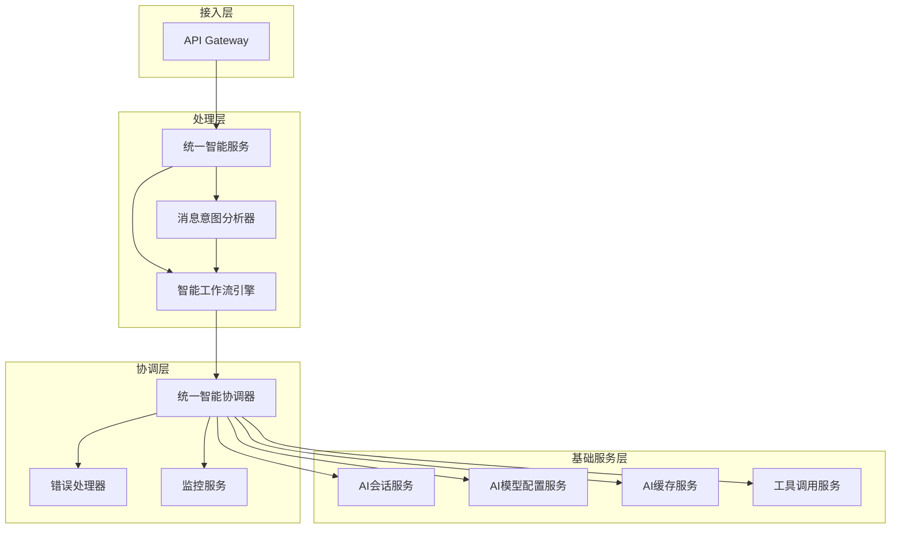
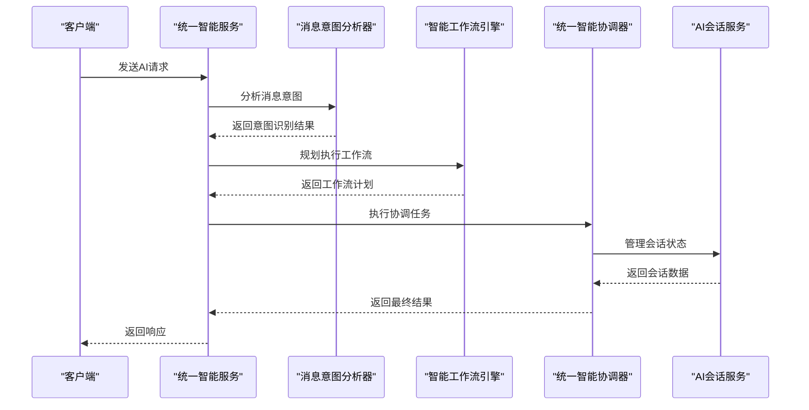
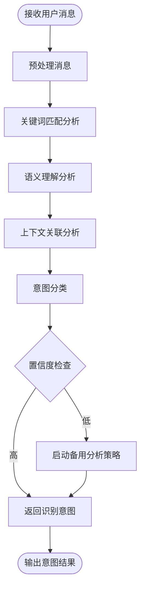
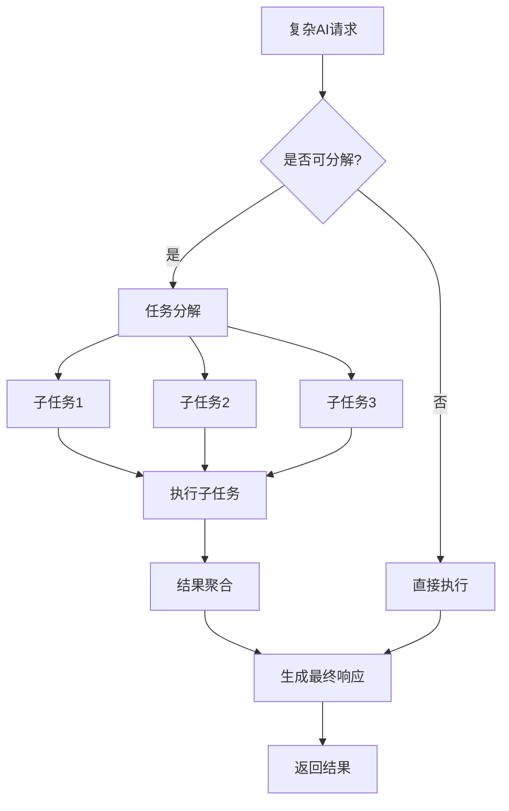
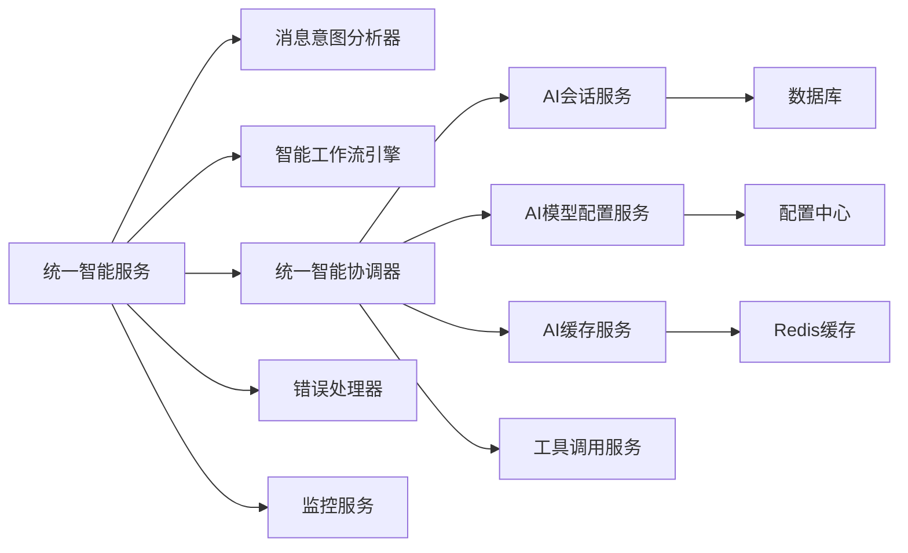

# 核心服务

<cite>
**本文档中引用的文件**  
- [ai-operator.service.ts](file://server/src/services/ai-operator/unified-intelligence.service.ts)
- [message-intent-analyzer.service.ts](file://server/src/services/ai-operator/message-intent-analyzer.service.ts)
- [smart-workflow.service.ts](file://server/src/services/ai-operator/smart-workflow.service.ts)
- [unified-intelligence-coordinator.service.ts](file://server/src/services/ai-operator/unified-intelligence-coordinator.service.ts)
- [ai-conversation.service.ts](file://server/src/services/ai/ai-conversation.service.ts)
- [ai-model-config.service.ts](file://server/src/services/ai/ai-model-config.service.ts)
- [ai-cache.service.ts](file://server/src/services/ai/ai-cache.service.ts)
- [error-handling.service.ts](file://server/src/services/ai-operator/error-handling/error-handler.service.ts)
</cite>

## 目录

1. [引言](#引言)  
2. [项目结构](#项目结构)  
3. [核心组件](#核心组件)  
4. [架构概述](#架构概述)  
5. [详细组件分析](#详细组件分析)  
6. [依赖分析](#依赖分析)  
7. [性能考虑](#性能考虑)  
8. [故障排除指南](#故障排除指南)  
9. [结论](#结论)

## 引言

本文档深入解析AI助手核心服务的实现机制，重点分析`ai-operator.service.ts`中AI操作符的核心调度逻辑。文档详细说明请求的接收、解析和路由机制，解释服务如何协调不同AI组件的执行流程，实现任务的分解与组合。同时描述错误处理和重试机制，确保服务的稳定性和可靠性。通过代码示例展示核心服务与其他组件的交互方式，并说明服务的扩展性设计，如何集成新的AI功能模块。

## 项目结构

AI操作符服务位于`server/src/services/ai-operator/`目录下，采用模块化设计，包含核心调度、意图分析、工作流管理、错误处理和监控等子模块。该服务作为AI能力的统一入口，协调多个AI子系统协同工作。

**图示来源**  
- [unified-intelligence.service.ts](file://server/src/services/ai-operator/unified-intelligence.service.ts)
- [message-intent-analyzer.service.ts](file://server/src/services/ai-operator/message-intent-analyzer.service.ts)
- [ai-conversation.service.ts](file://server/src/services/ai/ai-conversation.service.ts)

**本节来源**  
- [server/src/services/ai-operator/](file://server/src/services/ai-operator/)

## 核心组件

AI操作符服务的核心组件包括统一智能服务、消息意图分析器、智能工作流引擎和统一智能协调器。这些组件共同构成了AI请求的处理管道，实现了从请求接收到响应生成的完整闭环。

统一智能服务作为入口点，负责接收外部请求并启动处理流程。消息意图分析器负责解析用户输入，识别操作意图。智能工作流引擎根据意图规划执行路径，协调多个AI组件完成复杂任务。统一智能协调器负责管理AI模型的调用和资源分配。

**本节来源**  
- [unified-intelligence.service.ts](file://server/src/services/ai-operator/unified-intelligence.service.ts)
- [message-intent-analyzer.service.ts](file://server/src/services/ai-operator/message-intent-analyzer.service.ts)
- [smart-workflow.service.ts](file://server/src/services/ai-operator/smart-workflow.service.ts)

## 架构概述

AI操作符服务采用分层架构设计，包含接入层、处理层、协调层和基础服务层。这种架构设计实现了关注点分离，提高了系统的可维护性和可扩展性。

**图示来源**  
- [unified-intelligence.service.ts](file://server/src/services/ai-operator/unified-intelligence.service.ts)
- [unified-intelligence-coordinator.service.ts](file://server/src/services/ai-operator/unified-intelligence-coordinator.service.ts)
- [ai-conversation.service.ts](file://server/src/services/ai/ai-conversation.service.ts)

## 详细组件分析

### 统一智能服务分析

统一智能服务是AI操作符的核心调度组件，负责接收、解析和路由AI请求。该服务实现了请求的统一入口，提供了标准化的API接口。

#### 核心调度逻辑

**图示来源**  
- [unified-intelligence.service.ts](file://server/src/services/ai-operator/unified-intelligence.service.ts)
- [message-intent-analyzer.service.ts](file://server/src/services/ai-operator/message-intent-analyzer.service.ts)

**本节来源**  
- [unified-intelligence.service.ts](file://server/src/services/ai-operator/unified-intelligence.service.ts)

### 消息意图分析器分析

消息意图分析器负责解析用户输入，识别操作意图。该组件采用多层分析策略，结合关键词匹配、语义分析和上下文理解技术。

#### 意图解析流程

**图示来源**  
- [message-intent-analyzer.service.ts](file://server/src/services/ai-operator/message-intent-analyzer.service.ts)

**本节来源**  
- [message-intent-analyzer.service.ts](file://server/src/services/ai-operator/message-intent-analyzer.service.ts)

### 智能工作流引擎分析

智能工作流引擎负责根据识别的意图规划执行路径，协调多个AI组件完成复杂任务。该引擎支持动态工作流生成和执行。

#### 任务分解与组合

**图示来源**  
- [smart-workflow.service.ts](file://server/src/services/ai-operator/smart-workflow.service.ts)

**本节来源**  
- [smart-workflow.service.ts](file://server/src/services/ai-operator/smart-workflow.service.ts)

## 依赖分析

AI操作符服务依赖多个核心服务组件，形成了复杂的依赖关系网络。这些依赖关系确保了服务的功能完整性和性能优化。

**图示来源**  
- [unified-intelligence.service.ts](file://server/src/services/ai-operator/unified-intelligence.service.ts)
- [unified-intelligence-coordinator.service.ts](file://server/src/services/ai-operator/unified-intelligence-coordinator.service.ts)
- [ai-conversation.service.ts](file://server/src/services/ai/ai-conversation.service.ts)

**本节来源**  
- [server/src/services/ai-operator/](file://server/src/services/ai-operator/)
- [server/src/services/ai/](file://server/src/services/ai/)

## 性能考虑

AI操作符服务在设计时充分考虑了性能优化，采用了多种技术手段确保服务的高效运行。服务实现了请求缓存、连接池管理和异步处理机制，有效提升了系统吞吐量和响应速度。

服务还实现了智能负载均衡和资源调度策略，根据AI模型的特性和当前系统负载动态分配资源。同时，通过监控服务实时收集性能指标，为系统优化提供数据支持。

## 故障排除指南

AI操作符服务内置了完善的错误处理和重试机制，确保服务的稳定性和可靠性。当遇到异常情况时，系统会按照预定义的策略进行处理。

**本节来源**  
- [error-handler.service.ts](file://server/src/services/ai-operator/error-handling/error-handler.service.ts)
- [monitoring.service.ts](file://server/src/services/ai-operator/monitoring/monitoring.service.ts)

## 结论

AI操作符服务通过精心设计的架构和组件，实现了AI请求的高效处理和智能调度。服务采用模块化设计，各组件职责明确，便于维护和扩展。通过消息意图分析、智能工作流规划和统一协调机制，服务能够处理复杂的AI请求，提供稳定可靠的AI能力。

服务的扩展性设计允许轻松集成新的AI功能模块，只需遵循既定的接口规范即可。这种设计模式为系统的持续演进提供了坚实的基础，确保了AI能力的不断丰富和完善。