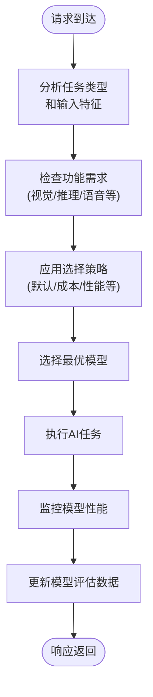
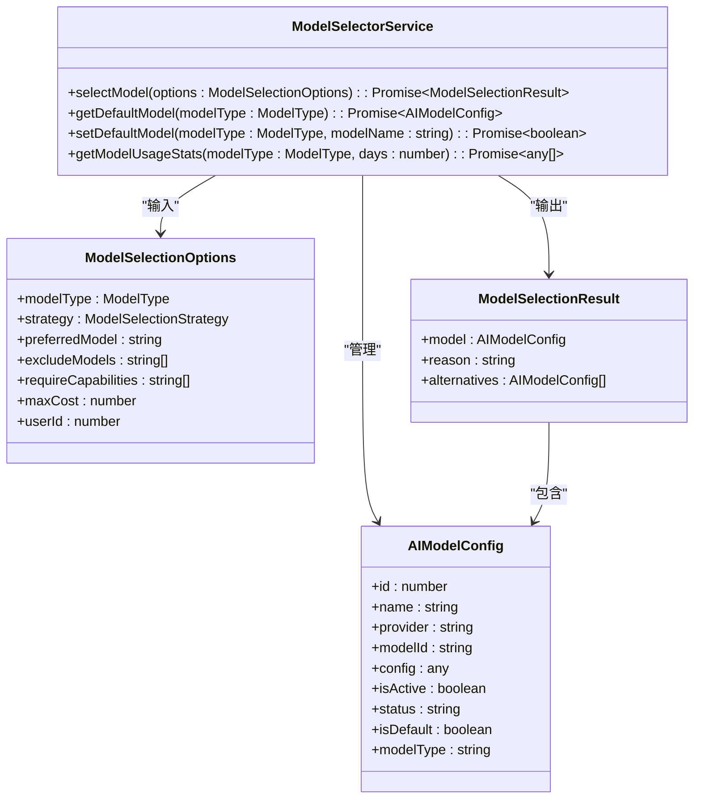
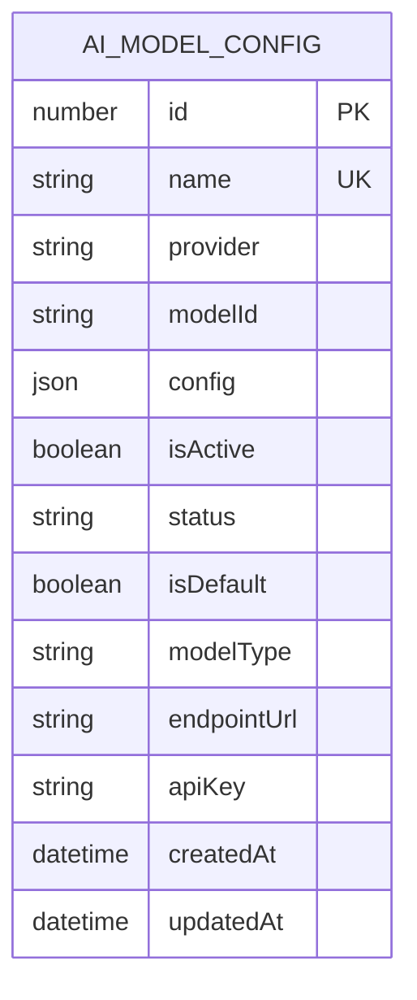
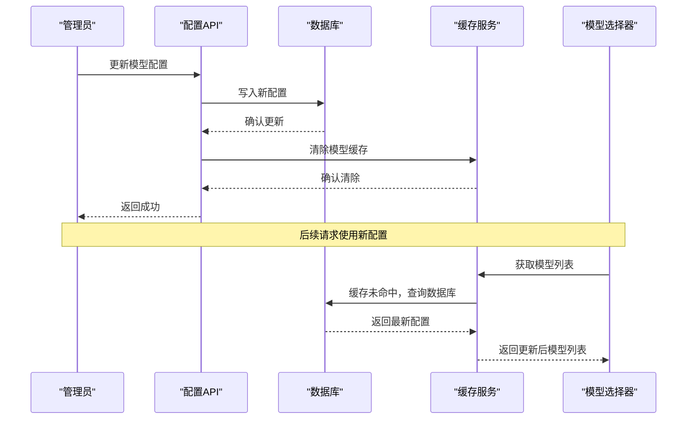
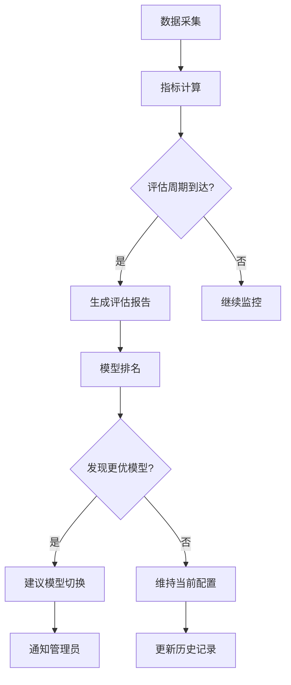
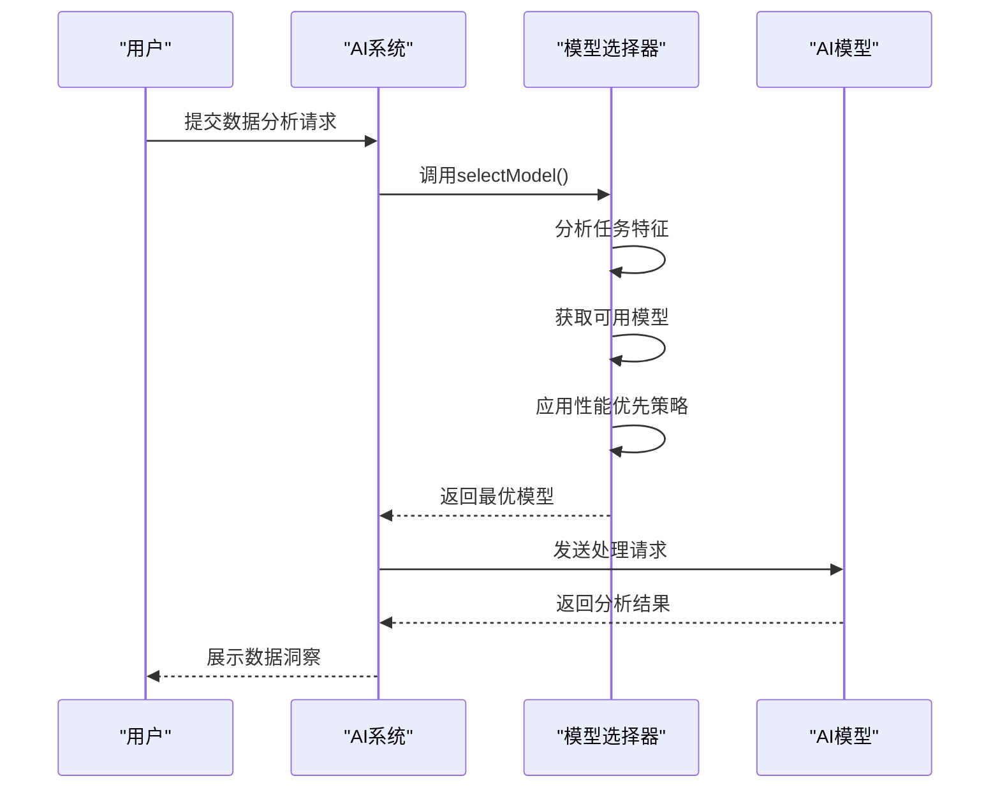

# 模型管理

<cite>
**本文档引用文件**  
- [model-selector.service.ts](file://k.yyup.com/server/src/services/ai/model-selector.service.ts)
- [model-selector.service.ts](file://unified-tenant-system/server/src/services/ai/model-selector.service.ts)
- [ai-model-config.model.ts](file://k.yyup.com/server/src/models/ai-model-config.model.ts)
- [ai-model-config.service.ts](file://k.yyup.com/server/src/services/ai/ai-model-config.service.ts)
- [model-cache.service.ts](file://unified-tenant-system/server/src/services/ai/model-cache.service.ts)
- [check-ai-models.js](file://check-ai-models.js) - *新增模型配置检查脚本*
- [check-all-models-details.js](file://check-all-models-details.js) - *新增模型详情检查脚本*
- [clean-ai-models.js](file://clean-ai-models.js) - *新增模型清理脚本*
- [copy-ai-models-to-admin-db.js](file://copy-ai-models-to-admin-db.js) - *新增模型配置迁移脚本*
- [check-model-types.js](file://check-model-types.js) - *新增模型类型检查脚本*
- [check-tenant-mgmt.js](file://check-tenant-mgmt.js) - *新增租户管理检查脚本*
</cite>

## 更新摘要
**变更内容**  
- 新增AI模型配置检查、迁移和清理脚本的功能说明
- 补充模型配置管理、性能监控和多供应商支持的详细信息
- 更新模型选择算法的实现细节
- 增加模型配置数据库结构的详细描述
- 添加模型管理脚本的实际应用案例

## 目录
1. [引言](#引言)
2. [模型选择算法](#模型选择算法)
3. [模型配置管理](#模型配置管理)
4. [模型性能监控与评估](#模型性能监控与评估)
5. [实际案例分析](#实际案例分析)
6. [多模型供应商支持](#多模型供应商支持)
7. [模型管理脚本](#模型管理脚本)
8. [结论](#结论)

## 引言
AI助手模型管理系统通过智能决策机制实现最优模型选择，确保系统在不同任务场景下能够高效、准确地响应。本系统核心在于`model-selector.service.ts`中的模型选择算法，该算法综合考虑任务类型、输入特征和性能要求，动态选择最适合的AI模型。同时，系统支持模型配置的动态更新、性能监控和多供应商集成，为AI服务的稳定性和可扩展性提供保障。新增的模型管理脚本进一步增强了系统的可维护性和数据一致性。

## 模型选择算法

### 决策机制概述
模型选择算法基于多维度评估标准，包括任务类型、复杂度、功能需求（如是否需要视觉或推理能力）以及性能约束。系统通过策略模式实现灵活的模型选择逻辑，支持多种选择策略，如默认优先、成本优化、性能优先、负载均衡和故障转移等。



**Diagram sources**
- [model-selector.service.ts](file://unified-tenant-system/server/src/services/ai/model-selector.service.ts#L54-L95)

### 选择策略详解
系统实现了多种模型选择策略，可根据业务需求灵活切换：

| 策略类型 | 描述 | 适用场景 |
|---------|------|---------|
| **默认策略** | 优先使用用户指定模型，其次使用系统默认模型 | 一般性任务处理 |
| **优先级策略** | 按提供商优先级排序选择（OpenAI > Anthropic > Google） | 高可靠性要求场景 |
| **成本优化策略** | 选择成本最低的可用模型 | 预算敏感型应用 |
| **性能优先策略** | 选择性能最优的模型 | 高复杂度任务处理 |
| **负载均衡策略** | 使用轮询方式分配请求 | 高并发场景 |
| **故障转移策略** | 优先选择不同提供商的模型以提高可用性 | 高可用性要求场景 |

**Section sources**
- [model-selector.service.ts](file://unified-tenant-system/server/src/services/ai/model-selector.service.ts#L13-L20)

### 核心算法流程
模型选择的核心算法遵循以下流程：
1. 获取指定类型的所有可用模型
2. 根据选项排除指定模型
3. 按能力要求过滤模型
4. 根据选择策略确定最优模型
5. 返回选择结果及备选方案



**Diagram sources**
- [model-selector.service.ts](file://unified-tenant-system/server/src/services/ai/model-selector.service.ts#L25-L42)
- [ai-model-config.model.ts](file://k.yyup.com/server/src/models/ai-model-config.model.ts#L26-L58)

## 模型配置管理

### 配置结构
模型配置采用结构化设计，包含基本信息、提供商信息、运行参数和状态标识。数据库表结构如下：



**Diagram sources**
- [ai-model-config.model.ts](file://k.yyup.com/server/src/models/ai-model-config.model.ts#L26-L58)

### 动态更新机制
系统支持模型配置的动态更新，无需重启服务即可生效。更新流程如下：
1. 修改模型配置数据库记录
2. 清除相关缓存
3. 新请求自动使用更新后的配置



**Diagram sources**
- [ai-model-config.service.ts](file://k.yyup.com/server/src/services/ai/ai-model-config.service.ts#L64-L66)
- [model-cache.service.ts](file://unified-tenant-system/server/src/services/ai/model-cache.service.ts)

**Section sources**
- [ai-model-config.service.ts](file://k.yyup.com/server/src/services/ai/ai-model-config.service.ts#L56-L74)
- [model-cache.service.ts](file://unified-tenant-system/server/src/services/ai/model-cache.service.ts)

## 模型性能监控与评估

### 监控指标体系
系统建立了全面的模型性能监控体系，主要指标包括：
- **响应时间**：模型处理请求的平均和最大耗时
- **成功率**：请求成功处理的比例
- **资源消耗**：CPU、内存等系统资源使用情况
- **错误率**：各类错误的发生频率
- **吞吐量**：单位时间内处理的请求数量

### 评估策略
系统定期对模型进行评估，支持以下评估方式：
1. **基准测试**：使用标准测试集评估模型性能
2. **A/B测试**：对比不同模型在同一场景下的表现
3. **用户反馈**：收集用户对模型输出质量的评价
4. **成本效益分析**：评估模型性能与使用成本的平衡



**Diagram sources**
- [model-selector.service.ts](file://unified-tenant-system/server/src/services/ai/model-selector.service.ts#L356-L365)

## 实际案例分析

### 案例一：智能客服场景
在智能客服场景中，系统根据用户问题的复杂度选择不同模型：
- 简单咨询：使用`doubao-pro-4k`模型，快速响应
- 复杂问题：启用`doubao-seed-1-6-thinking-250615`模型，进行深度推理
- 图片咨询：调用`doubao-vision`模型，处理视觉信息

### 案例二：数据分析任务
对于数据分析任务，系统采用性能优先策略：
1. 识别任务类型为"数据分析"
2. 要求模型具备"analysis"和"reasoning"能力
3. 选择性能最优的可用模型
4. 执行复杂的数据处理和洞察生成



**Diagram sources**
- [model-selector.service.ts](file://unified-tenant-system/server/src/services/ai/model-selector.service.ts#L54-L95)

## 多模型供应商支持

### 供应商管理
系统支持多模型供应商集成，当前支持的主要供应商包括：
- **OpenAI**：提供GPT系列模型
- **Anthropic**：提供Claude系列模型
- **Google**：提供Gemini等模型
- **自研模型**：公司内部开发的专用模型

### 优先级配置
系统通过提供商优先级配置实现供应商偏好管理：
```typescript
const providerPriority: Record<string, number> = {
  'openai': 100,
  'anthropic': 90,
  'google': 80
};
```
该配置支持动态调整，可根据合同、性能表现或成本因素重新排序。

**Section sources**
- [model-selector.service.ts](file://unified-tenant-system/server/src/services/ai/model-selector.service.ts#L183-L187)

## 模型管理脚本

### 模型配置检查脚本
系统提供了一系列脚本用于模型配置的检查、迁移和清理：

**check-ai-models.js**: 检查源数据库中的AI模型配置，并生成迁移到目标数据库的SQL语句
```javascript
// 连接到源数据库
const sequelize = new Sequelize('kargerdensales', 'root', 'pwk5ls7j', {
  host: 'dbconn.sealoshzh.site',
  port: 43906,
  dialect: 'mysql'
});
```

**check-all-models-details.js**: 查询所有AI模型配置的详细信息，包括统计信息和状态分析
```javascript
// 查询所有AI模型配置
const [rows] = await connection.execute('SELECT * FROM ai_model_config ORDER BY id ASC');
```

**Section sources**
- [check-ai-models.js](file://check-ai-models.js#L1-L171)
- [check-all-models-details.js](file://check-all-models-details.js#L1-L105)

### 模型配置迁移脚本
**copy-ai-models-to-admin-db.js**: 将AI模型配置从源数据库迁移到目标数据库，支持插入和更新操作
```javascript
// 从源数据库读取AI模型配置并插入到目标数据库
async function copyAIModelsToAdminDB() {
  // 连接源数据库和目标数据库
  // 读取源数据库中的AI模型配置
  // 清空目标数据库中的现有配置
  // 插入所有模型配置到目标数据库
}
```

**Section sources**
- [copy-ai-models-to-admin-db.js](file://copy-ai-models-to-admin-db.js#L1-L188)

### 模型清理脚本
**clean-ai-models.js**: 清理目标数据库中的非豆包模型，保留豆包相关模型
```javascript
// 找出需要删除的非豆包模型
const nonDoubaoModels = allModels.filter(model => {
  const isDoubaoRelated = model.provider && (
    model.provider.toLowerCase().includes('bytedance') ||
    model.provider.toLowerCase().includes('doubao') ||
    model.provider.toLowerCase().includes('volcengine')
  );
  return !isDoubaoRelated;
});
```

**Section sources**
- [clean-ai-models.js](file://clean-ai-models.js#L1-L127)

### 其他辅助脚本
**check-model-types.js**: 检查模型类型的实际使用情况，确保数据一致性
```javascript
// 检查源数据库中实际使用的 model_type 值
const [modelTypes] = await sourceConnection.execute('SELECT DISTINCT model_type FROM ai_model_config');
```

**check-tenant-mgmt.js**: 检查租户管理数据库的完整性和数据关联性
```javascript
// 检查global_users表、tenants表和global_user_tenant_relations表
async function checkTenantManagement() {
  // 连接租户管理数据库
  // 查询各表数据并验证关联性
}
```

**Section sources**
- [check-model-types.js](file://check-model-types.js#L1-L57)
- [check-tenant-mgmt.js](file://check-tenant-mgmt.js#L1-L149)

## 结论
AI助手模型管理系统通过智能化的决策机制，实现了高效、灵活的模型选择。系统不仅能够根据任务特征和性能要求自动选择最优模型，还支持配置的动态更新和全面的性能监控。多供应商支持能力确保了系统的高可用性和可扩展性，为AI服务的稳定运行提供了坚实基础。新增的模型管理脚本进一步增强了系统的可维护性，通过自动化检查、迁移和清理操作，确保了模型配置数据的一致性和准确性。未来可进一步优化评估算法，引入机器学习方法实现更精准的模型选择。