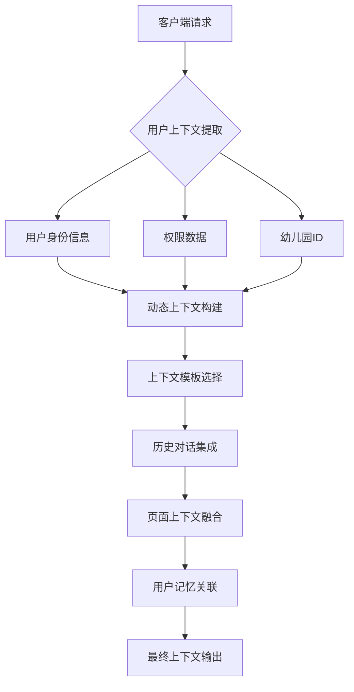
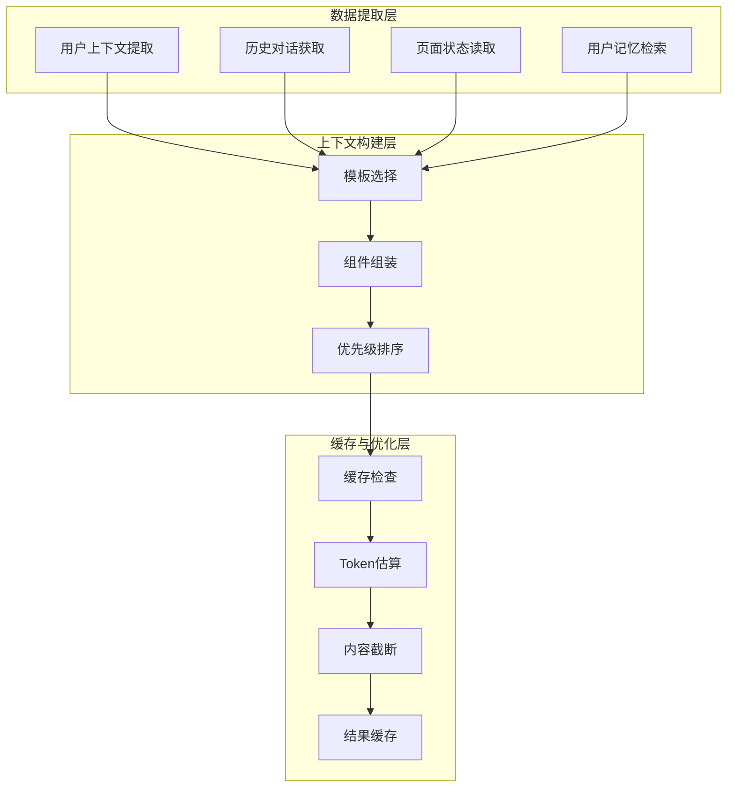
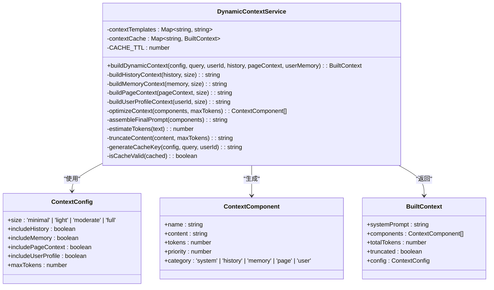
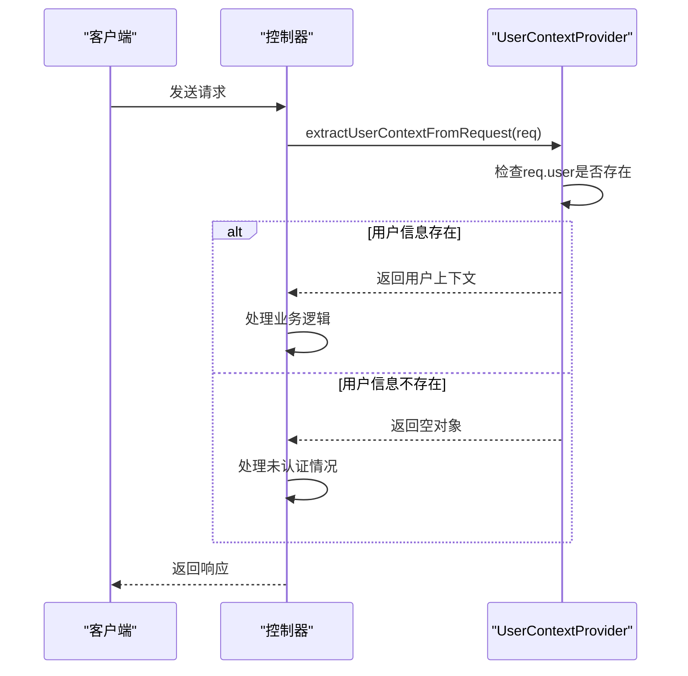
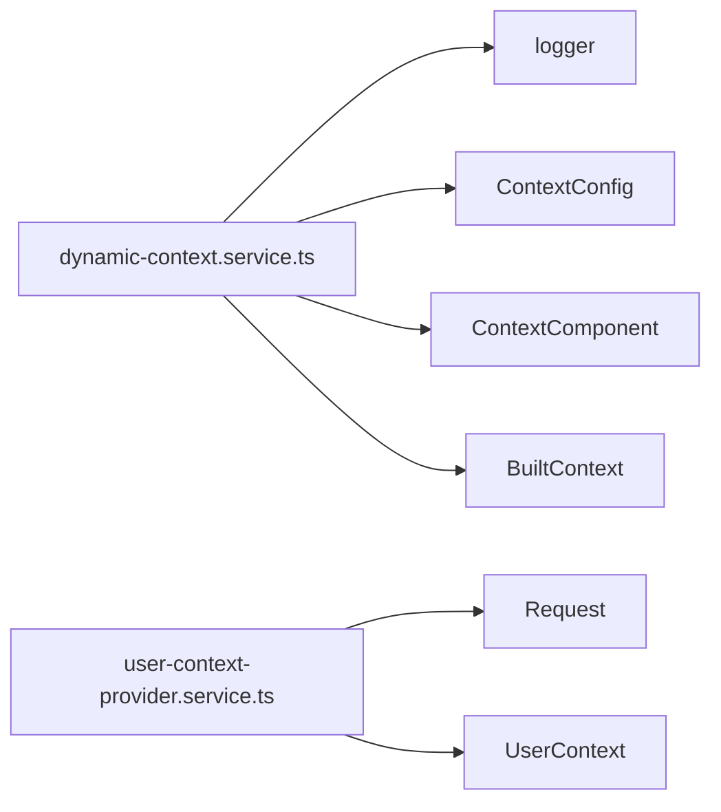

# 上下文管理

<cite>
**本文档中引用的文件**  
- [dynamic-context.service.ts](file://k.yyup.com/server/src/services/ai/dynamic-context.service.ts)
- [user-context-provider.service.ts](file://k.yyup.com/server/src/services/ai/user-context-provider.service.ts)
- [dynamic-context.service.ts](file://unified-tenant-system/server/src/services/ai/dynamic-context.service.ts)
</cite>

## 目录
1. [引言](#引言)
2. [项目结构](#项目结构)
3. [核心组件](#核心组件)
4. [架构概述](#架构概述)
5. [详细组件分析](#详细组件分析)
6. [依赖分析](#依赖分析)
7. [性能考虑](#性能考虑)
8. [故障排除指南](#故障排除指南)
9. [结论](#结论)

## 引言
本文档详细阐述了AI助手的上下文管理机制，重点分析`dynamic-context.service.ts`如何动态构建和维护AI请求的上下文信息。文档深入探讨了上下文数据结构设计、生命周期管理、缓存策略和性能优化等方面，并解释该服务如何整合用户个人数据、系统实时状态和特定业务场景信息，形成完整的上下文环境。同时，文档还详细说明了`user-context-provider.service.ts`中用户上下文提供器的实现细节，包括用户身份验证、权限检查、敏感数据脱敏和安全传输机制。

## 项目结构
AI助手的上下文管理功能主要分布在两个核心服务文件中：`dynamic-context.service.ts`负责动态上下文的构建与优化，而`user-context-provider.service.ts`则负责从请求中提取用户上下文信息。这些服务位于服务器端的AI服务目录下，通过模块化设计实现了上下文管理的高内聚与低耦合。

**图示来源**  
- [dynamic-context.service.ts](file://k.yyup.com/server/src/services/ai/dynamic-context.service.ts)
- [user-context-provider.service.ts](file://k.yyup.com/server/src/services/ai/user-context-provider.service.ts)

**本节来源**  
- [dynamic-context.service.ts](file://k.yyup.com/server/src/services/ai/dynamic-context.service.ts)
- [user-context-provider.service.ts](file://k.yyup.com/server/src/services/ai/user-context-provider.service.ts)

## 核心组件
上下文管理的核心组件包括动态上下文服务（DynamicContextService）和用户上下文提供服务（UserContextProviderService）。前者负责根据查询复杂度动态调整上下文大小和内容，后者则专注于从HTTP请求中安全地提取用户上下文信息。这两个服务共同构成了AI助手理解用户意图和提供个性化服务的基础。

**本节来源**  
- [dynamic-context.service.ts](file://k.yyup.com/server/src/services/ai/dynamic-context.service.ts)
- [user-context-provider.service.ts](file://k.yyup.com/server/src/services/ai/user-context-provider.service.ts)

## 架构概述
上下文管理采用分层架构设计，底层为数据提取层，中间为上下文构建层，顶层为缓存与优化层。该架构支持多种上下文配置模式（minimal、light、moderate、full），能够根据实际需求灵活调整上下文的丰富程度。同时，系统内置了5分钟的缓存机制，有效提升了高并发场景下的响应速度。

**图示来源**  
- [dynamic-context.service.ts](file://unified-tenant-system/server/src/services/ai/dynamic-context.service.ts)

## 详细组件分析

### 动态上下文服务分析
`DynamicContextService`采用单例模式实现，确保全局上下文管理的一致性。服务通过`buildDynamicContext`方法接收配置参数、查询内容、用户ID、对话历史、页面上下文和用户记忆等信息，经过一系列处理步骤生成最终的上下文。

#### 类图展示

**图示来源**  
- [dynamic-context.service.ts](file://unified-tenant-system/server/src/services/ai/dynamic-context.service.ts)

### 用户上下文提供服务分析
`UserContextProviderService`负责从Express请求对象中提取用户上下文信息，包括用户ID、幼儿园ID、手机号、用户名、角色和权限列表等关键数据。该服务提供了便捷的方法来获取特定的上下文字段，并支持权限检查功能。

#### 序列图展示

**图示来源**  
- [user-context-provider.service.ts](file://k.yyup.com/server/src/services/ai/user-context-provider.service.ts)

**本节来源**  
- [dynamic-context.service.ts](file://unified-tenant-system/server/src/services/ai/dynamic-context.service.ts)
- [user-context-provider.service.ts](file://k.yyup.com/server/src/services/ai/user-context-provider.service.ts)

## 依赖分析
上下文管理服务依赖于多个核心模块，包括日志记录、数据库连接、权限验证等。其中，`dynamic-context.service.ts`依赖于`logger`工具进行操作追踪，而`user-context-provider.service.ts`则依赖于Express框架的请求对象结构。这些依赖关系通过TypeScript的import机制明确声明，保证了代码的可维护性和可测试性。

**图示来源**  
- [dynamic-context.service.ts](file://unified-tenant-system/server/src/services/ai/dynamic-context.service.ts)
- [user-context-provider.service.ts](file://k.yyup.com/server/src/services/ai/user-context-provider.service.ts)

**本节来源**  
- [dynamic-context.service.ts](file://unified-tenant-system/server/src/services/ai/dynamic-context.service.ts)
- [user-context-provider.service.ts](file://k.yyup.com/server/src/services/ai/user-context-provider.service.ts)

## 性能考虑
在高并发场景下，上下文管理服务通过缓存机制显著提升了性能表现。每次上下文构建请求都会生成一个唯一的缓存键，用于检查是否存在可用的缓存结果。此外，系统采用了优先级排序算法，在Token限制条件下优先保留高优先级的上下文组件，确保关键信息不丢失。然而，潜在的瓶颈可能出现在大规模用户记忆数据的处理上，建议对用户记忆数据进行预处理和索引优化。

**本节来源**  
- [dynamic-context.service.ts](file://unified-tenant-system/server/src/services/ai/dynamic-context.service.ts)

## 故障排除指南
当遇到上下文管理相关问题时，建议按照以下步骤进行排查：
1. 检查用户认证状态是否正常
2. 验证请求头中是否包含必要的用户信息
3. 查看日志中是否有"未找到用户信息"的警告
4. 确认缓存机制是否正常工作
5. 检查Token估算是否准确

**本节来源**  
- [user-context-provider.service.ts](file://k.yyup.com/server/src/services/ai/user-context-provider.service.ts)
- [dynamic-context.service.ts](file://unified-tenant-system/server/src/services/ai/dynamic-context.service.ts)

## 结论
AI助手的上下文管理机制通过`dynamic-context.service.ts`和`user-context-provider.service.ts`两个核心服务实现了高效、安全的上下文构建与管理。系统采用模块化设计，支持灵活的上下文配置和优化策略，同时通过缓存机制保障了高并发场景下的性能表现。未来可进一步优化用户记忆数据的处理效率，并增强上下文安全防护能力。