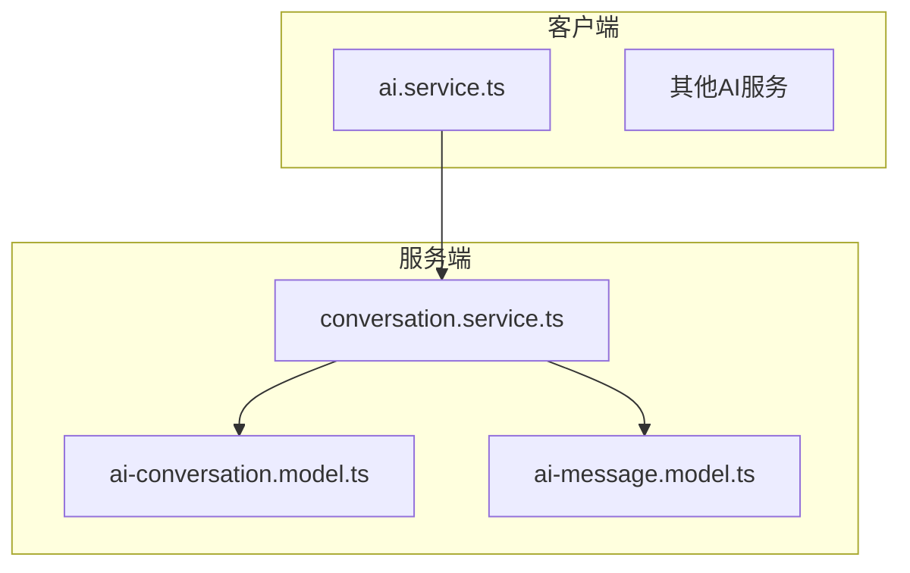
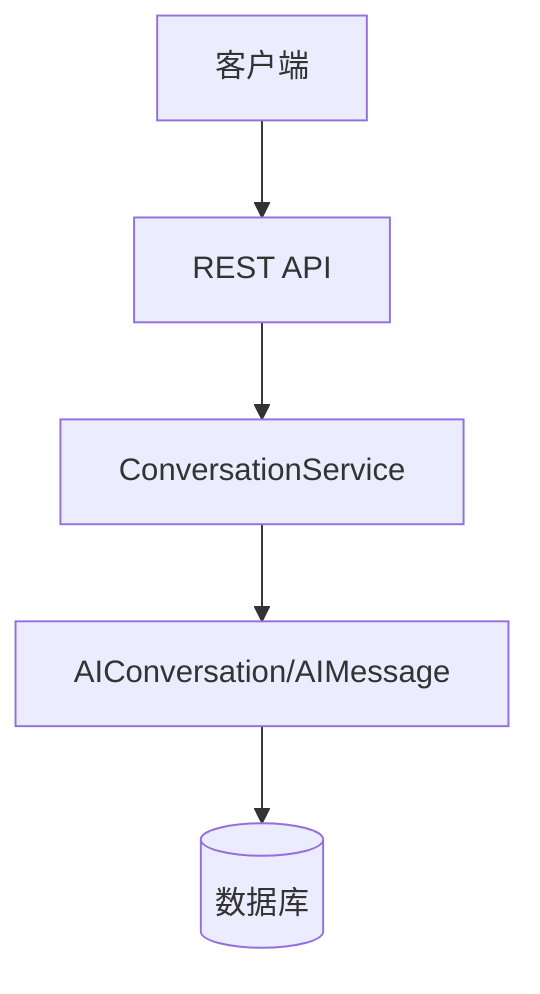
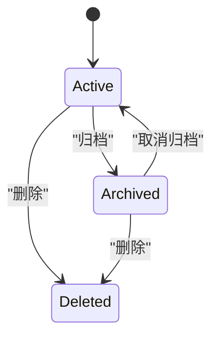
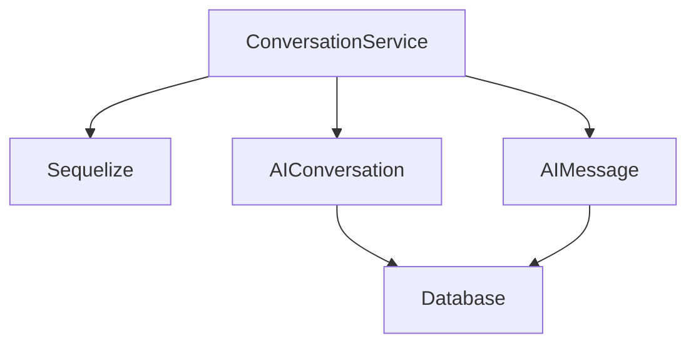

# 会话协调

<cite>
**本文档引用文件**  
- [conversation.service.ts](file://k.yyup.com/server/src/services/ai/conversation.service.ts)
- [ai-conversation.model.ts](file://k.yyup.com/server/src/models/ai-conversation.model.ts)
- [ai-message.model.ts](file://k.yyup.com/server/src/models/ai-message.model.ts)
- [ai.service.ts](file://k.yyup.com/client/src/services/ai.service.ts)
</cite>

## 目录
1. [引言](#引言)
2. [项目结构](#项目结构)
3. [核心组件](#核心组件)
4. [架构概述](#架构概述)
5. [详细组件分析](#详细组件分析)
6. [依赖分析](#依赖分析)
7. [性能考虑](#性能考虑)
8. [故障排除指南](#故障排除指南)
9. [结论](#结论)

## 引言
本文档全面解析AI助手的会话协调能力，重点分析`conversation.service.ts`如何管理复杂的多轮对话和多步骤任务执行。文档阐述了会话状态跟踪、任务分解、服务编排和结果聚合机制，以及如何协调调用多个AI服务（如自然语言理解、知识检索、决策推理）和传统业务API，实现端到端的智能服务。

## 项目结构
项目结构显示了AI会话服务位于服务器端的`services/ai/`目录下，相关模型定义在`models/`目录中。客户端也包含AI相关服务，形成了完整的前后端协作体系。



**图示来源**  
- [conversation.service.ts](file://k.yyup.com/server/src/services/ai/conversation.service.ts)
- [ai-conversation.model.ts](file://k.yyup.com/server/src/models/ai-conversation.model.ts)
- [ai-message.model.ts](file://k.yyup.com/server/src/models/ai-message.model.ts)

**章节来源**  
- [conversation.service.ts](file://k.yyup.com/server/src/services/ai/conversation.service.ts)
- [ai-conversation.model.ts](file://k.yyup.com/server/src/models/ai-conversation.model.ts)

## 核心组件
核心组件包括会话服务、会话模型和消息模型。`ConversationService`提供创建、查询、更新和删除会话的功能，`AIConversation`模型定义会话数据结构，`AIMessage`模型定义消息数据结构。

**章节来源**  
- [conversation.service.ts](file://k.yyup.com/server/src/services/ai/conversation.service.ts#L23-L196)
- [ai-conversation.model.ts](file://k.yyup.com/server/src/models/ai-conversation.model.ts#L84-L237)
- [ai-message.model.ts](file://k.yyup.com/server/src/models/ai-message.model.ts#L130-L246)

## 架构概述
系统采用分层架构，客户端通过API调用服务端的会话服务，服务端使用Sequelize ORM操作数据库。会话服务负责业务逻辑处理，模型层负责数据持久化。



**图示来源**  
- [conversation.service.ts](file://k.yyup.com/server/src/services/ai/conversation.service.ts)
- [ai-conversation.model.ts](file://k.yyup.com/server/src/models/ai-conversation.model.ts)

## 详细组件分析

### 会话服务分析
`ConversationService`类提供了完整的会话管理功能，包括创建会话、获取会话列表、添加消息等操作。服务使用异步方法处理数据库操作，并包含错误处理机制。

```mermaid
classDiagram
class ConversationService {
+createConversation(userIdOrData, title) Promise~any~
+getConversations(userId) Promise~any[]~
+getUserConversations(userId, options) Promise~{conversations, total}~
+getConversation(conversationId) Promise~any~
+updateConversation(conversationId, data) Promise~any~
+deleteConversation(conversationId) Promise~boolean~
+addMessage(data) Promise~any~
+getMessages(conversationId) Promise~any[]~
+getRecentConversations(userId, limit) Promise~any[]~
+updateConversationTitle(conversationId, title) Promise~any~
+updateConversationSummary(conversationId, summary) Promise~any~
+archiveConversation(conversationId) Promise~any~
+unarchiveConversation(conversationId) Promise~any~
}
class AIConversation {
+id : string
+userId : number
+title : string | null
+model : string | null
+status : string | null
+summary : string | null
+lastMessageAt : Date
+messageCount : number
+isArchived : boolean
+lastPagePath : string | null
+pageContext : string | null
+lastPageUpdateAt : Date | null
+usedMemoryIds : number[] | null
+metadata : Record~string, any~ | null
+createdAt : Date
+updatedAt : Date
}
class AIMessage {
+id : number
+conversationId : string
+userId : number
+role : MessageRole
+content : string
+messageType : MessageType
+mediaUrl : string | null
+metadata : any | null
+tokens : number
+status : MessageStatus
+isDeleted : boolean
+createdAt : Date
+updatedAt : Date
}
ConversationService --> AIConversation : "使用"
ConversationService --> AIMessage : "使用"
AIConversation --> AIMessage : "包含"
```

**图示来源**  
- [conversation.service.ts](file://k.yyup.com/server/src/services/ai/conversation.service.ts#L23-L196)
- [ai-conversation.model.ts](file://k.yyup.com/server/src/models/ai-conversation.model.ts#L84-L237)
- [ai-message.model.ts](file://k.yyup.com/server/src/models/ai-message.model.ts#L130-L246)

**章节来源**  
- [conversation.service.ts](file://k.yyup.com/server/src/services/ai/conversation.service.ts#L23-L196)
- [ai-conversation.model.ts](file://k.yyup.com/server/src/models/ai-conversation.model.ts#L84-L237)
- [ai-message.model.ts](file://k.yyup.com/server/src/models/ai-message.model.ts#L130-L246)

### 会话状态管理
系统通过数据库字段实现会话状态管理，包括`status`字段表示会话状态，`isArchived`字段表示是否归档，`lastMessageAt`字段记录最后消息时间。



**图示来源**  
- [ai-conversation.model.ts](file://k.yyup.com/server/src/models/ai-conversation.model.ts#L92-L96)

## 依赖分析
会话服务依赖于Sequelize ORM框架和数据库模型，通过标准的CRUD操作管理会话和消息数据。服务间通过清晰的接口定义进行交互。



**图示来源**  
- [conversation.service.ts](file://k.yyup.com/server/src/services/ai/conversation.service.ts)
- [ai-conversation.model.ts](file://k.yyup.com/server/src/models/ai-conversation.model.ts)
- [ai-message.model.ts](file://k.yyup.com/server/src/models/ai-message.model.ts)

**章节来源**  
- [conversation.service.ts](file://k.yyup.com/server/src/services/ai/conversation.service.ts)
- [ai-conversation.model.ts](file://k.yyup.com/server/src/models/ai-conversation.model.ts)
- [ai-message.model.ts](file://k.yyup.com/server/src/models/ai-message.model.ts)

## 性能考虑
系统通过数据库索引优化查询性能，包括`external_user_id_idx`、`last_message_at_idx`和`is_archived_idx`等索引。消息表使用自增ID作为主键，会话表使用UUID作为主键。

## 故障排除指南
常见问题包括会话创建失败、消息添加失败等。检查数据库连接、确保模型定义正确、验证输入参数是解决问题的关键步骤。

**章节来源**  
- [conversation.service.ts](file://k.yyup.com/server/src/services/ai/conversation.service.ts)
- [ai-conversation.model.ts](file://k.yyup.com/server/src/models/ai-conversation.model.ts)

## 结论
`conversation.service.ts`实现了完整的会话管理功能，通过清晰的接口设计和健壮的错误处理机制，为AI助手提供了可靠的会话协调能力。系统采用现代化的TypeScript和Sequelize技术栈，具有良好的可维护性和扩展性。