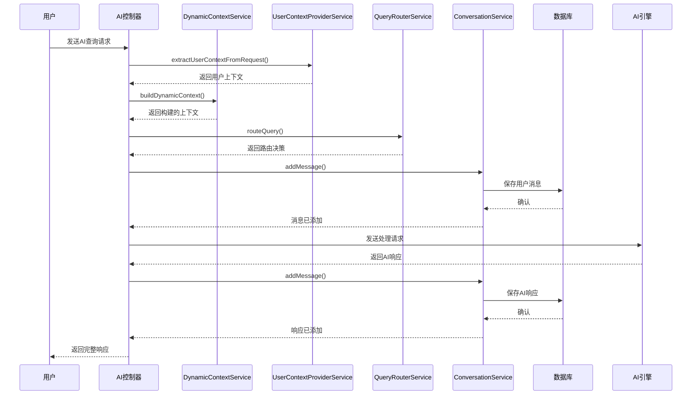

# 服务协调

<cite>
**本文档引用文件**   
- [dynamic-context.service.ts](file://k.yyup.com/server/src/services/ai/dynamic-context.service.ts)
- [user-context-provider.service.ts](file://k.yyup.com/server/src/services/ai/user-context-provider.service.ts)
- [query-router.service.ts](file://k.yyup.com/server/src/services/ai/query-router.service.ts)
- [conversation.service.ts](file://k.yyup.com/server/src/services/ai/conversation.service.ts)
</cite>

## 目录
1. [引言](#引言)
2. [动态上下文构建机制](#动态上下文构建机制)
3. [用户上下文提供器实现](#用户上下文提供器实现)
4. [查询路由器智能路由逻辑](#查询路由器智能路由逻辑)
5. [会话服务协调机制](#会话服务协调机制)
6. [AI请求处理时序分析](#ai请求处理时序分析)
7. [错误处理与降级策略](#错误处理与降级策略)
8. [结论](#结论)

## 引言
本文档详细阐述AI助手系统中各核心服务间的协调机制。重点分析dynamic-context.service.ts如何动态构建AI请求的上下文信息，整合用户数据、系统状态和业务上下文；解释user-context-provider.service.ts中用户上下文提供器的实现原理；描述query-router.service.ts的智能路由逻辑；以及conversation.service.ts如何协调多个AI服务调用处理复杂任务。

## 动态上下文构建机制

`DynamicContextService` 负责构建AI请求所需的完整上下文信息。该服务采用单例模式实现，确保全局唯一实例。其核心功能是通过`buildDynamicContext`方法整合多种上下文来源，包括用户查询、对话历史、页面上下文和用户记忆等。

该服务支持新旧两种调用方式的兼容处理，能够根据参数类型自动判断调用模式。构建的上下文包含系统提示词（systemPrompt），其中嵌入了用户ID、最近对话记录和当前页面信息等关键数据。同时计算总token数以进行资源管理，并将上下文结构化为包含系统组件、查询组件的标准化格式。

**Section sources**
- [dynamic-context.service.ts](file://k.yyup.com/server/src/services/ai/dynamic-context.service.ts#L1-L98)

## 用户上下文提供器实现

`UserContextProviderService` 服务负责从HTTP请求中安全地提取和提供用户上下文信息。该服务定义了`UserContext`接口，明确包含用户ID、幼儿园ID、手机号、用户名、角色和权限等关键属性。

核心方法`extractUserContextFromRequest`从请求对象的`user`属性中提取认证后的用户信息。若未找到用户信息，则返回空对象并记录警告日志。基于此基础方法，提供了`getKindergartenId`、`getUserId`等便捷方法用于获取特定上下文信息。

权限检查功能通过`hasPermission`方法实现，该方法检查用户权限数组中是否包含指定权限标识，为后续的访问控制提供支持。所有方法均通过请求对象安全获取用户数据，避免了直接暴露敏感信息的风险。

**Section sources**
- [user-context-provider.service.ts](file://k.yyup.com/server/src/services/ai/user-context-provider.service.ts#L1-L67)

## 查询路由器智能路由逻辑

`QueryRouterService` 实现了AI请求的智能路由功能，采用单例模式确保全局一致性。该服务定义了`ProcessingLevel`枚举，包含直接处理、语义处理、复杂处理和降级处理四个级别。

核心路由方法`routeQuery`接收查询字符串和上下文参数，根据预定义的规则将请求分发到相应的处理路径。服务实现了`checkDirectMatch`方法进行关键词匹配，支持对"你好"、"谢谢"、"帮助"等常见问候语的直接响应，提高响应效率。

对于不同复杂度的查询，服务提供了`handleSimpleQuery`和`handleComplexQuery`两个专用方法。简单查询直接返回确认处理状态，而复杂查询则标记为复杂类型进行特殊处理。这种分层路由机制确保了请求能够被恰当处理，同时保留了未来扩展的灵活性。

**Section sources**
- [query-router.service.ts](file://k.yyup.com/server/src/services/ai/query-router.service.ts#L1-L97)

## 会话服务协调机制

`ConversationService` 是AI对话的核心协调服务，负责管理完整的对话生命周期。该服务提供了创建、查询、更新和删除对话的完整CRUD操作，以及消息管理功能。

在创建对话时，服务会设置默认模型为"doubao-pro-4k"，并初始化对话状态为"active"。对话列表查询支持按创建时间或更新时间排序，满足不同场景需求。消息管理功能允许向指定对话添加新消息，并按时间顺序获取完整消息历史。

服务还实现了对话归档和取消归档功能，通过更新对话状态实现。特别值得注意的是，`updateConversationSummary`方法将摘要更新映射到标题更新，体现了设计上的简洁性。所有数据库操作均包含完整的错误处理，确保服务的健壮性。

**Section sources**
- [conversation.service.ts](file://k.yyup.com/server/src/services/ai/conversation.service.ts#L1-L199)

## AI请求处理时序分析

**Diagram sources**
- [dynamic-context.service.ts](file://k.yyup.com/server/src/services/ai/dynamic-context.service.ts#L33-L83)
- [user-context-provider.service.ts](file://k.yyup.com/server/src/services/ai/user-context-provider.service.ts#L21-L37)
- [query-router.service.ts](file://k.yyup.com/server/src/services/ai/query-router.service.ts#L27-L36)
- [conversation.service.ts](file://k.yyup.com/server/src/services/ai/conversation.service.ts#L120-L132)

## 错误处理与降级策略

系统实现了多层次的错误处理与降级策略。在服务层，所有关键操作均包含try-catch异常捕获，并记录详细的错误日志。当数据库操作失败时，服务会抛出具体错误信息，便于问题排查。

降级策略主要体现在查询路由服务中，当无法匹配直接响应模式时，系统会进入更复杂的处理流程。对于无法处理的请求，系统保留了fallback处理级别，确保不会完全失败。同时，上下文构建服务能够处理缺失的可选参数，保证核心功能的可用性。

监控方面，各服务均提供了统计信息获取方法，如`getContextStats`和`getStats`，可用于监控系统运行状态和性能指标。这些统计信息有助于及时发现潜在问题并进行容量规划。

**Section sources**
- [dynamic-context.service.ts](file://k.yyup.com/server/src/services/ai/dynamic-context.service.ts#L85-L94)
- [query-router.service.ts](file://k.yyup.com/server/src/services/ai/query-router.service.ts#L83-L93)
- [conversation.service.ts](file://k.yyup.com/server/src/services/ai/conversation.service.ts#L30-L49)

## 结论
AI助手系统通过`DynamicContextService`、`UserContextProviderService`、`QueryRouterService`和`ConversationService`四个核心服务的协同工作，实现了完整的AI请求处理流程。各服务职责分明，通过清晰的接口进行交互，形成了高内聚、低耦合的架构设计。

系统在保证功能完整性的同时，考虑了错误处理和降级策略，确保了服务的稳定性和可靠性。未来可通过扩展查询路由规则、增强上下文构建能力等方式进一步提升系统智能化水平。