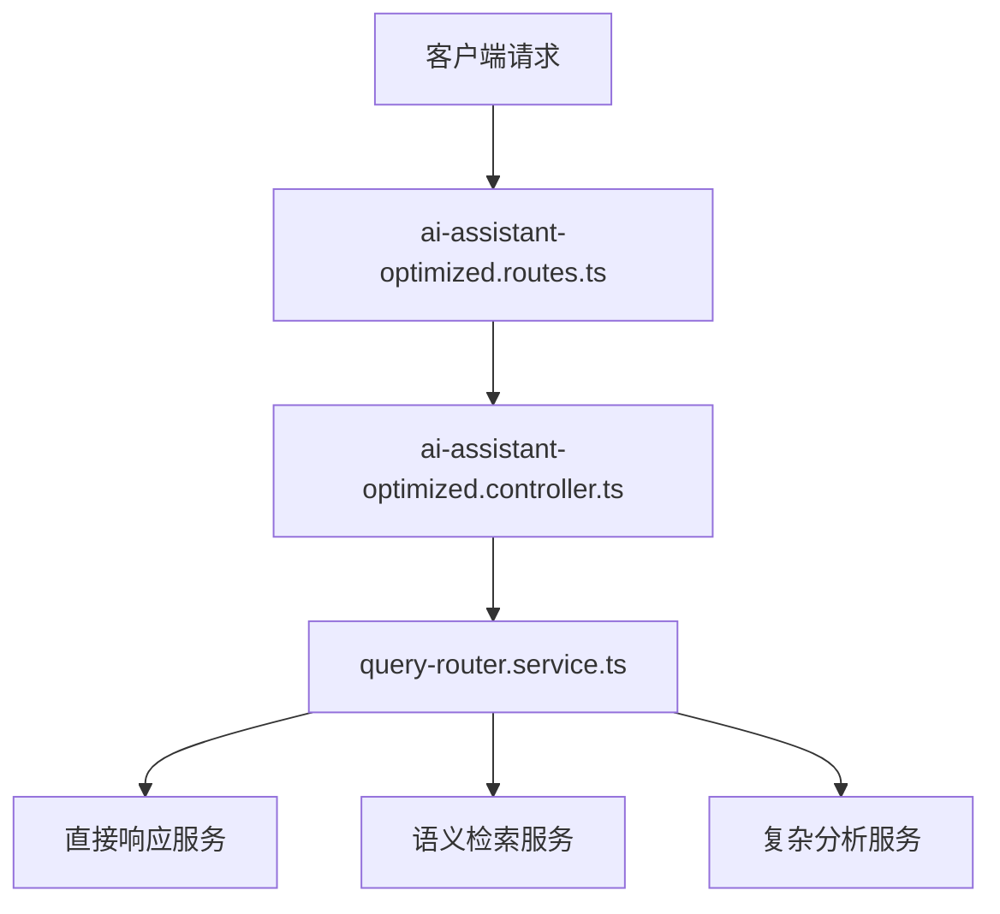
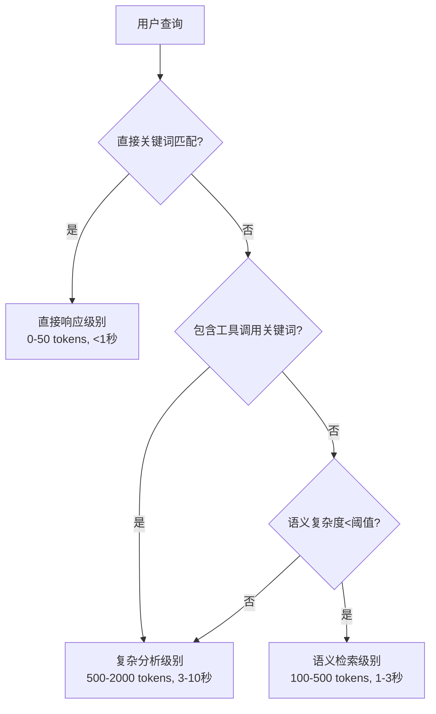
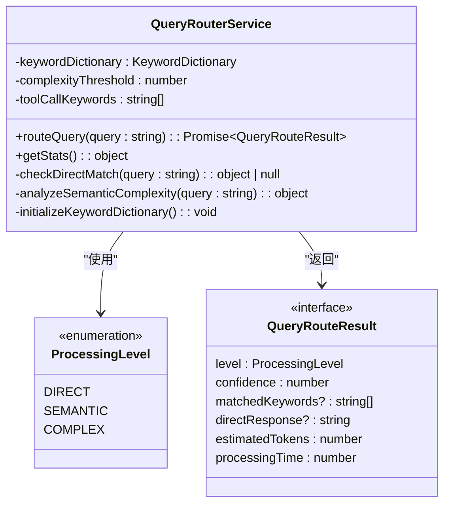
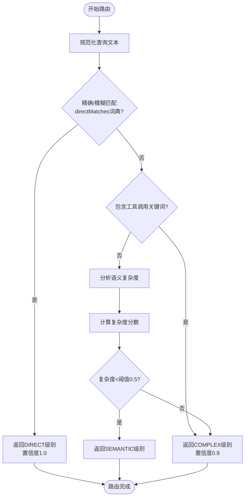
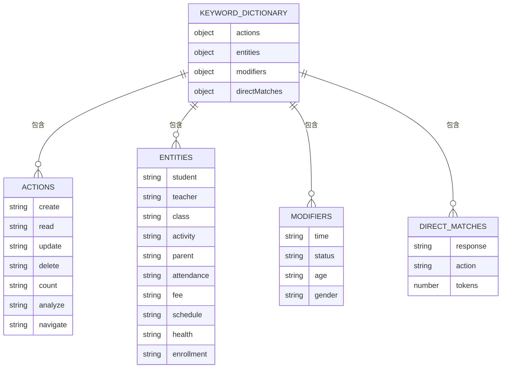
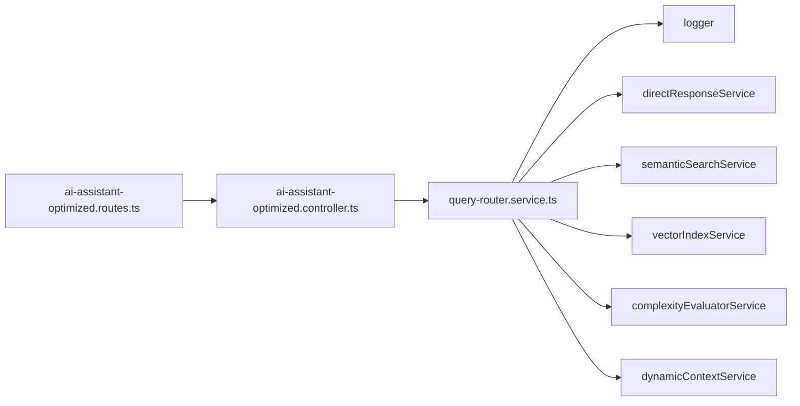

# 请求路由

<cite>
**本文档中引用的文件**  
- [query-router.service.ts](file://k.yyup.com/server/src/services/ai/query-router.service.ts)
- [ai-assistant-optimized.controller.ts](file://k.yyup.com/server/src/controllers/ai-assistant-optimized.controller.ts)
- [ai-assistant-optimized.routes.ts](file://k.yyup.com/server/src/routes/ai-assistant-optimized.routes.ts)
</cite>

## 目录
1. [引言](#引言)
2. [项目结构](#项目结构)
3. [核心组件](#核心组件)
4. [架构概述](#架构概述)
5. [详细组件分析](#详细组件分析)
6. [依赖分析](#依赖分析)
7. [性能考量](#性能考量)
8. [故障排查指南](#故障排查指南)
9. [结论](#结论)

## 引言
本文档深入解析AI助手的请求路由机制，重点分析`query-router.service.ts`中的智能路由算法。该系统通过三级分层处理策略，实现对用户查询的高效路由，显著降低Token消耗并提升响应速度。

## 项目结构
AI助手的请求路由系统主要位于服务器端的AI服务目录中，采用分层架构设计，包含路由服务、控制器和API路由三个主要组成部分。

**图示来源**
- [ai-assistant-optimized.routes.ts](file://k.yyup.com/server/src/routes/ai-assistant-optimized.routes.ts)
- [ai-assistant-optimized.controller.ts](file://k.yyup.com/server/src/controllers/ai-assistant-optimized.controller.ts)
- [query-router.service.ts](file://k.yyup.com/server/src/services/ai/query-router.service.ts)

**章节来源**
- [query-router.service.ts](file://k.yyup.com/server/src/services/ai/query-router.service.ts)
- [ai-assistant-optimized.routes.ts](file://k.yyup.com/server/src/routes/ai-assistant-optimized.routes.ts)

## 核心组件
请求路由系统的核心是`QueryRouterService`类，它实现了三级分层处理机制：关键词直接命中、向量语义检索和大模型深度分析。这种设计旨在降低70-80%的Token消耗，同时提升响应速度。

**章节来源**
- [query-router.service.ts](file://k.yyup.com/server/src/services/ai/query-router.service.ts#L49-L636)

## 架构概述
AI助手的请求路由架构采用智能分层策略，根据查询的复杂度和语义特征将其分发到最合适的处理层级。

**图示来源**
- [query-router.service.ts](file://k.yyup.com/server/src/services/ai/query-router.service.ts#L415-L507)

## 详细组件分析

### 查询路由器服务分析
`QueryRouterService`是AI助手的核心路由组件，负责分析用户查询并将其路由到适当的处理级别。

#### 类结构分析

**图示来源**
- [query-router.service.ts](file://k.yyup.com/server/src/services/ai/query-router.service.ts#L49-L636)

#### 路由决策流程分析

**图示来源**
- [query-router.service.ts](file://k.yyup.com/server/src/services/ai/query-router.service.ts#L415-L507)

### 关键词词典结构
查询路由器使用多维度关键词词典进行语义分析和路由决策。

**图示来源**
- [query-router.service.ts](file://k.yyup.com/server/src/services/ai/query-router.service.ts#L69-L407)

**章节来源**
- [query-router.service.ts](file://k.yyup.com/server/src/services/ai/query-router.service.ts#L69-L407)

## 依赖分析
请求路由系统与其他多个服务组件存在依赖关系，形成完整的AI助手功能链。

**图示来源**
- [query-router.service.ts](file://k.yyup.com/server/src/services/ai/query-router.service.ts)
- [ai-assistant-optimized.controller.ts](file://k.yyup.com/server/src/controllers/ai-assistant-optimized.controller.ts)
- [ai-assistant-optimized.routes.ts](file://k.yyup.com/server/src/routes/ai-assistant-optimized.routes.ts)

**章节来源**
- [query-router.service.ts](file://k.yyup.com/server/src/services/ai/query-router.service.ts)
- [ai-assistant-optimized.controller.ts](file://k.yyup.com/server/src/controllers/ai-assistant-optimized.controller.ts)

## 性能考量
请求路由系统的设计充分考虑了性能优化，通过三级分层处理策略显著降低了系统资源消耗。

- **Token消耗优化**：通过直接匹配和语义检索处理简单查询，避免不必要的大模型调用
- **响应时间优化**：简单查询在1秒内完成，复杂查询在3-10秒内完成
- **计算资源优化**：根据查询复杂度动态分配计算资源，避免资源浪费

系统通过`getStats()`方法提供详细的性能统计信息，包括直接匹配数量、关键词总数和复杂度阈值等指标。

**章节来源**
- [query-router.service.ts](file://k.yyup.com/server/src/services/ai/query-router.service.ts#L620-L632)
- [ai-assistant-optimized.controller.ts](file://k.yyup.com/server/src/controllers/ai-assistant-optimized.controller.ts#L857-L893)

## 故障排查指南
当请求路由系统出现问题时，可参考以下排查步骤：

1. **检查日志输出**：查看系统日志中的路由决策信息，确认查询是否被正确路由
2. **验证关键词配置**：检查`directMatches`词典是否包含必要的直接匹配项
3. **测试路由功能**：使用`/test-route`API端点测试特定查询的路由结果
4. **检查服务依赖**：确保所有依赖服务（如语义检索、向量索引等）正常运行
5. **监控性能指标**：通过`/keywords`端点获取关键词统计信息，评估系统配置

**章节来源**
- [query-router.service.ts](file://k.yyup.com/server/src/services/ai/query-router.service.ts)
- [ai-assistant-optimized.routes.ts](file://k.yyup.com/server/src/routes/ai-assistant-optimized.routes.ts#L472-L497)
- [ai-assistant-optimized.controller.ts](file://k.yyup.com/server/src/controllers/ai-assistant-optimized.controller.ts#L857-L893)

## 结论
AI助手的请求路由机制通过智能的三级分层处理策略，实现了高效、准确的查询分发。系统能够根据用户查询的语义特征、复杂度和业务领域，将其准确路由到最合适的处理级别，既保证了响应质量，又显著降低了资源消耗。这种设计模式为大规模AI应用的性能优化提供了有价值的参考。