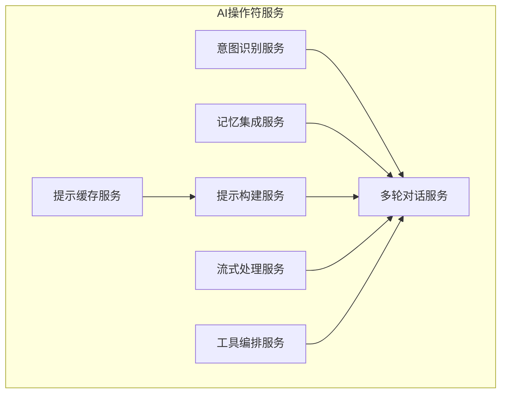
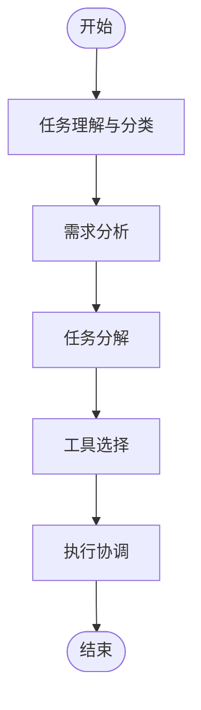

# 集成方法

<cite>
**本文档中引用的文件**  
- [ai-conversation.ts](file://k.yyup.com/client/src/api/modules/ai-conversation.ts)
- [ai-task-planner.service.ts](file://k.yyup.com/client/aimobile/services/ai-task-planner.service.ts)
- [ai-operator.service.ts](file://k.yyup.com/server/src/services/ai-operator/unified-intelligence.service.ts)
- [multi-round-chat.service.ts](file://k.yyup.com/server/src/services/ai-operator/core/multi-round-chat.service.ts)
- [tool-orchestrator.service.ts](file://k.yyup.com/server/src/services/ai-operator/core/tool-orchestrator.service.ts)
</cite>

## 目录
1. [介绍](#介绍)
2. [前端与后端AI服务通信](#前端与后端AI服务通信)
3. [后端AI服务架构设计](#后端AI服务架构设计)
4. [对话管理系统](#对话管理系统)
5. [AI任务规划器实现原理](#AI任务规划器实现原理)
6. [扩展AI功能](#扩展AI功能)

## 介绍
本文档为开发者提供AI功能集成的完整指南，涵盖前端与后端AI服务的通信机制、后端AI服务的架构设计、对话管理系统、AI任务规划器的实现原理以及如何扩展AI功能。通过本指南，开发者可以深入了解系统的AI功能集成方式，并能够根据需要进行功能扩展。

## 前端与后端AI服务通信

前端通过API客户端与后端AI服务进行通信，主要涉及请求格式、认证方式和错误处理。前端使用`AIConversationService`类来管理与后端AI服务的交互，该类提供了获取会话列表、创建会话、更新会话标题、删除会话、获取会话消息列表、添加消息到会话等方法。

**Section sources**
- [ai-conversation.ts](file://k.yyup.com/client/src/api/modules/ai-conversation.ts#L1-L241)

## 后端AI服务架构设计

后端AI服务的架构设计主要包括AI操作符的调度机制。AI操作符服务位于`k.yyup.com/server/src/services/ai-operator`目录下，核心组件包括意图识别、记忆集成、多轮对话、提示构建、提示缓存、流式处理和工具编排等服务。这些服务协同工作，实现复杂的AI任务处理。

**Diagram sources**
- [unified-intelligence.service.ts](file://k.yyup.com/server/src/services/ai-operator/unified-intelligence.service.ts)
- [multi-round-chat.service.ts](file://k.yyup.com/server/src/services/ai-operator/core/multi-round-chat.service.ts)

## 对话管理系统

对话管理系统负责维护上下文状态、处理多轮对话和管理会话生命周期。系统通过`multi-round-chat.service.ts`文件中的`MultiRoundChatService`类来实现这些功能。该服务能够跟踪对话的上下文，确保在多轮对话中保持一致性和连贯性。

**Section sources**
- [multi-round-chat.service.ts](file://k.yyup.com/server/src/services/ai-operator/core/multi-round-chat.service.ts)

## AI任务规划器实现原理

AI任务规划器的实现原理包括任务分解、工具选择和执行协调。任务规划器能够理解复杂任务，自动将其分解为多个子任务，并选择合适的工具来执行这些子任务。执行过程中，任务规划器协调各个子任务的执行顺序，确保任务的顺利完成。

**Diagram sources**
- [ai-task-planner.service.ts](file://k.yyup.com/client/aimobile/services/ai-task-planner.service.ts#L1-L761)

## 扩展AI功能

扩展AI功能可以通过添加新的AI操作符或集成新的第三方AI服务来实现。开发者可以参考现有的AI操作符服务，创建新的服务类，并将其集成到AI操作符服务中。此外，还可以通过配置文件或数据库来管理新的AI服务，使其能够被系统识别和调用。

**Section sources**
- [ai-task-planner.service.ts](file://k.yyup.com/client/aimobile/services/ai-task-planner.service.ts#L1-L761)
- [tool-orchestrator.service.ts](file://k.yyup.com/server/src/services/ai-operator/core/tool-orchestrator.service.ts)