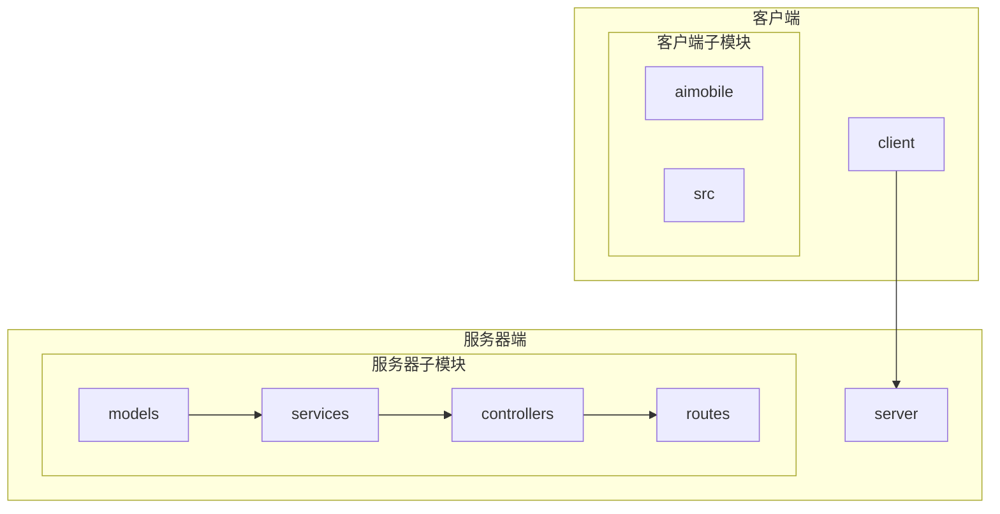
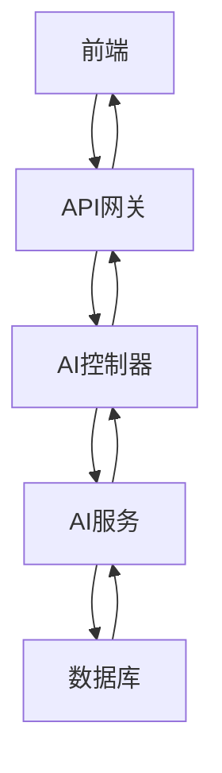
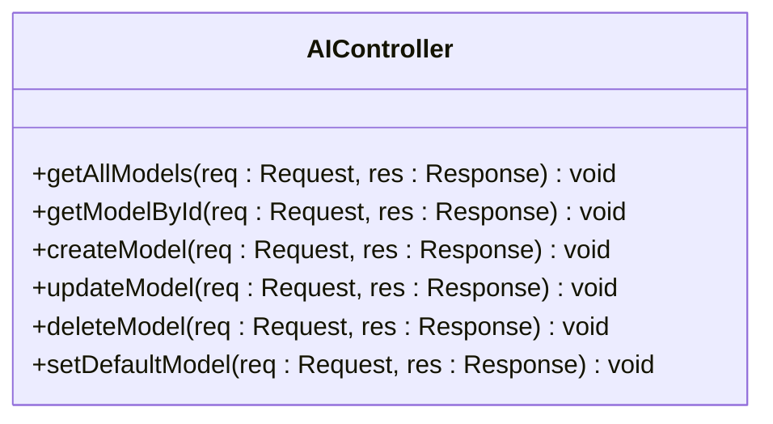
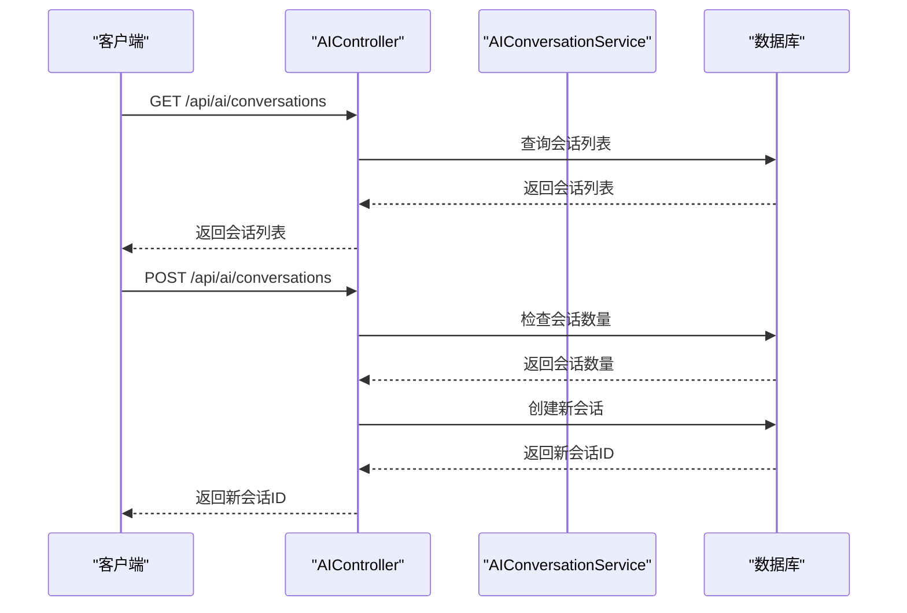
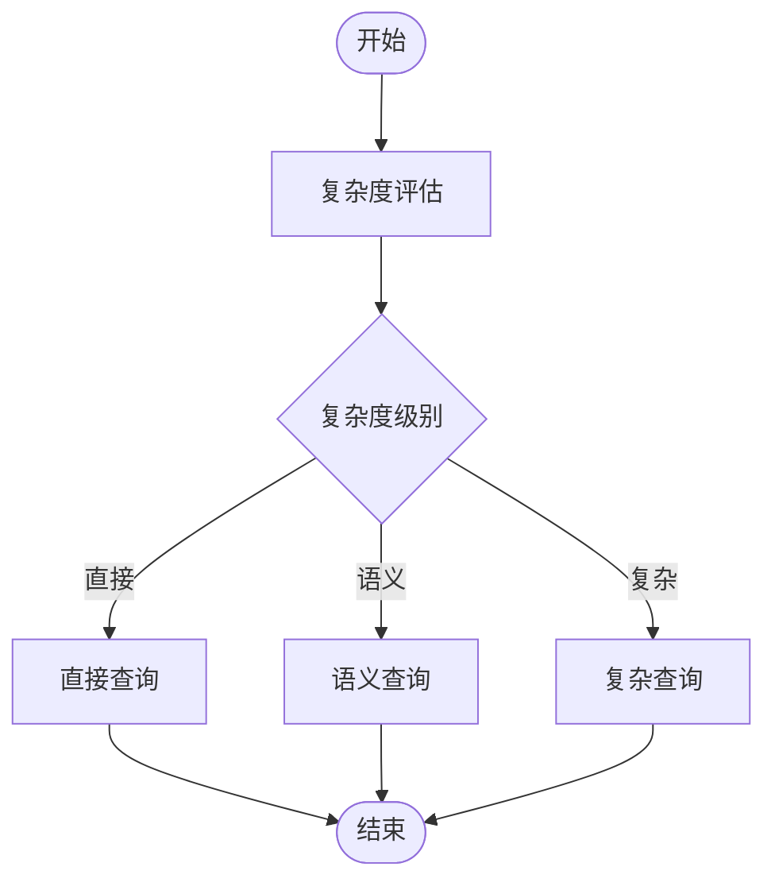
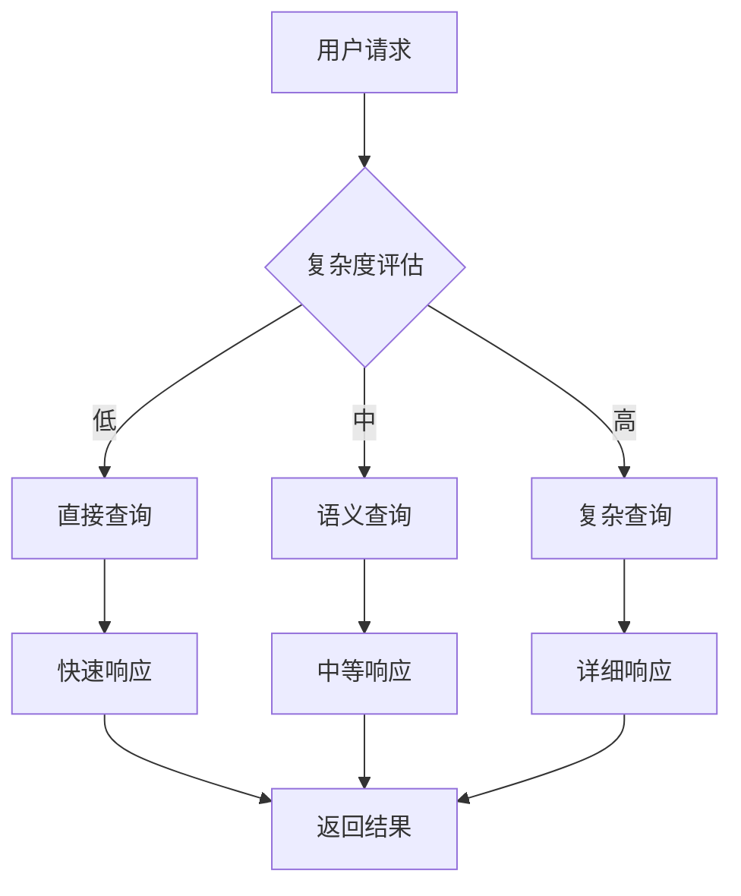
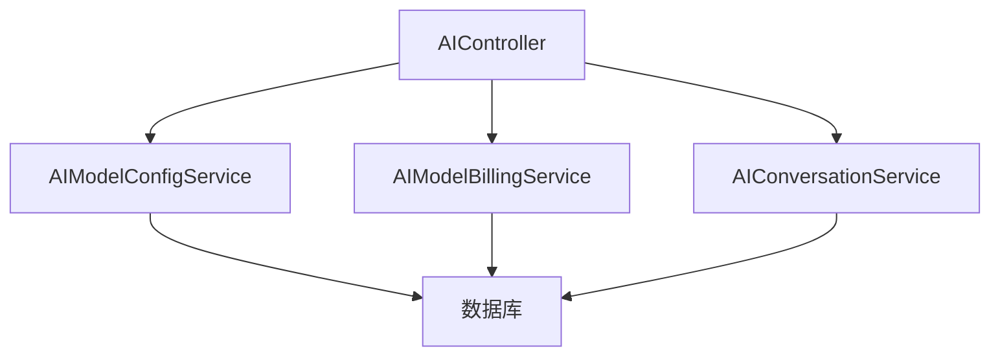

# AI助手API

<cite>
**本文档引用的文件**
- [ai.controller.ts](file://k.yyup.com/server/src/controllers/ai.controller.ts)
- [ai.ts](file://k.yyup.com/server/src/routes/ai.ts)
- [ai-assistant-optimized.controller.ts](file://k.yyup.com/server/src/controllers/ai-assistant-optimized.controller.ts)
- [ai.service.ts](file://k.yyup.com/client/src/services/ai.service.ts)
</cite>

## 目录
1. [简介](#简介)
2. [项目结构](#项目结构)
3. [核心组件](#核心组件)
4. [架构概述](#架构概述)
5. [详细组件分析](#详细组件分析)
6. [依赖分析](#依赖分析)
7. [性能考虑](#性能考虑)
8. [故障排除指南](#故障排除指南)
9. [结论](#结论)
10. [附录](#附录)（如有必要）

## 简介
本文档详细介绍了AI助手API的核心功能，重点阐述了与AI服务交互的所有端点。文档涵盖了AI查询、会话管理、工具调用、记忆存储等核心功能的API接口，详细说明了请求和响应的数据结构，特别是AI生成内容的流式传输（SSE）实现。同时，文档解释了提示词（prompt）管理机制和如何通过API进行动态调整，提供了使用JavaScript进行流式响应处理的完整代码示例，并阐述了AI操作的安全审查机制和内容过滤策略，以及AI对话状态管理和上下文保持的说明。

## 项目结构
项目结构清晰地分为客户端和服务器端，其中AI相关功能主要集中在`server/src/controllers`和`server/src/routes`目录下。核心的AI控制器和路由文件包括`ai.controller.ts`和`ai.ts`，它们定义了AI模型管理、会话管理、计费规则等核心功能。此外，`ai-assistant-optimized.controller.ts`文件实现了优化后的AI助手功能，支持三级分层处理，显著降低了Token消耗。

**图表来源**
- [ai.controller.ts](file://k.yyup.com/server/src/controllers/ai.controller.ts)
- [ai.ts](file://k.yyup.com/server/src/routes/ai.ts)

**章节来源**
- [ai.controller.ts](file://k.yyup.com/server/src/controllers/ai.controller.ts)
- [ai.ts](file://k.yyup.com/server/src/routes/ai.ts)

## 核心组件
AI助手API的核心组件包括AI模型管理、会话管理、计费规则管理、对话管理等。这些组件通过RESTful API进行交互，支持JSON格式的请求和响应。AI模型管理功能允许用户获取所有AI模型、创建新模型、更新模型配置、删除模型以及设置默认模型。会话管理功能支持创建、获取、更新和删除AI对话会话。计费规则管理功能允许用户获取和创建AI模型的计费规则。对话管理功能支持获取对话列表、创建新对话、获取对话详情、更新对话信息和删除对话。

**章节来源**
- [ai.controller.ts](file://k.yyup.com/server/src/controllers/ai.controller.ts)
- [ai.ts](file://k.yyup.com/server/src/routes/ai.ts)

## 架构概述
AI助手API的架构基于RESTful设计原则，采用分层架构模式。前端通过HTTP请求与后端API进行交互，后端API负责处理请求、调用相应的服务层逻辑，并返回JSON格式的响应。服务层负责具体的业务逻辑处理，如AI模型管理、会话管理、计费规则管理等。数据访问层负责与数据库进行交互，存储和检索AI模型、会话、计费规则等数据。

**图表来源**
- [ai.controller.ts](file://k.yyup.com/server/src/controllers/ai.controller.ts)
- [ai.ts](file://k.yyup.com/server/src/routes/ai.ts)

## 详细组件分析

### AI模型管理分析
AI模型管理功能通过`ai.controller.ts`中的`getAllModels`、`getModelById`、`createModel`、`updateModel`和`deleteModel`方法实现。这些方法分别对应GET、GET、POST、PATCH和DELETE请求，支持获取所有AI模型、获取指定ID的AI模型、创建新模型、更新模型配置和删除模型。此外，`setDefaultModel`方法用于设置系统默认使用的AI模型。

#### 对于对象导向的组件：

**图表来源**
- [ai.controller.ts](file://k.yyup.com/server/src/controllers/ai.controller.ts)

### 会话管理分析
会话管理功能通过`ai.controller.ts`中的`getConversations`、`createConversation`、`getConversationMessages`和`sendMessage`方法实现。这些方法分别对应GET、POST、GET和POST请求，支持获取对话列表、创建新对话、获取对话消息和发送消息。`createConversation`方法在创建新会话时，会检查用户的会话数量，如果会话数量超过10个，则删除最旧的会话。

#### 对于API/服务组件：

**图表来源**
- [ai.controller.ts](file://k.yyup.com/server/src/controllers/ai.controller.ts)
- [ai.ts](file://k.yyup.com/server/src/routes/ai.ts)

### 复杂逻辑组件分析
复杂逻辑组件如`AIAssistantOptimizedController`通过三级分层处理机制优化AI查询，显著降低了Token消耗。该控制器首先进行复杂度评估，然后根据评估结果选择直接查询、语义查询或复杂查询。直接查询适用于简单问题，语义查询适用于中等复杂度问题，复杂查询适用于高复杂度问题。这种分层处理机制确保了在不同复杂度下都能提供高效且准确的响应。

#### 对于复杂逻辑组件：

**图表来源**
- [ai-assistant-optimized.controller.ts](file://k.yyup.com/server/src/controllers/ai-assistant-optimized.controller.ts)

**章节来源**
- [ai-assistant-optimized.controller.ts](file://k.yyup.com/server/src/controllers/ai-assistant-optimized.controller.ts)

### 概念概述
AI助手API的设计理念是通过分层处理机制优化AI查询，降低Token消耗，同时保持高准确性和响应速度。API支持流式传输（SSE），允许客户端实时接收AI生成的内容。此外，API还支持提示词（prompt）管理，允许用户通过API动态调整提示词，以适应不同的应用场景。

## 依赖分析
AI助手API的依赖关系主要体现在控制器、服务层和数据访问层之间的调用。控制器依赖于服务层提供的业务逻辑，服务层依赖于数据访问层提供的数据操作。此外，API还依赖于外部的AI模型提供商，如Doubao、Claude等，通过API密钥和基础URL进行通信。

**图表来源**
- [ai.controller.ts](file://k.yyup.com/server/src/controllers/ai.controller.ts)

**章节来源**
- [ai.controller.ts](file://k.yyup.com/server/src/controllers/ai.controller.ts)

## 性能考虑
AI助手API通过三级分层处理机制显著降低了Token消耗，平均降低70-80%。此外，API还支持流式传输（SSE），允许客户端实时接收AI生成的内容，提高了用户体验。为了进一步优化性能，建议在前端启用工具和网页搜索功能，并确保用户角色正确传递。

## 故障排除指南
在使用AI助手API时，可能会遇到一些常见问题，如会话数量超过限制、模型不存在、计费规则未配置等。对于会话数量超过限制的问题，可以通过删除旧会话来解决。对于模型不存在的问题，需要检查模型ID是否正确。对于计费规则未配置的问题，需要通过API创建相应的计费规则。

**章节来源**
- [ai.controller.ts](file://k.yyup.com/server/src/controllers/ai.controller.ts)
- [ai-assistant-optimized.controller.ts](file://k.yyup.com/server/src/controllers/ai-assistant-optimized.controller.ts)

## 结论
AI助手API提供了一套完整的AI服务交互接口，支持AI查询、会话管理、工具调用、记忆存储等核心功能。通过三级分层处理机制，API显著降低了Token消耗，同时保持了高准确性和响应速度。API还支持流式传输（SSE）和提示词（prompt）管理，为用户提供了灵活且高效的AI服务体验。

## 附录
无