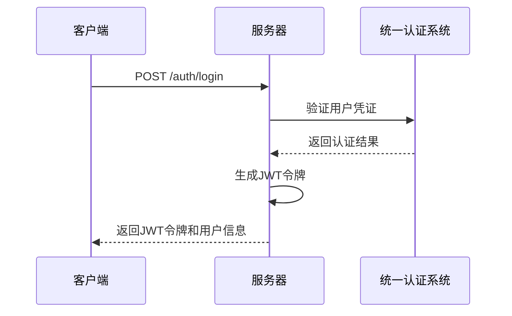
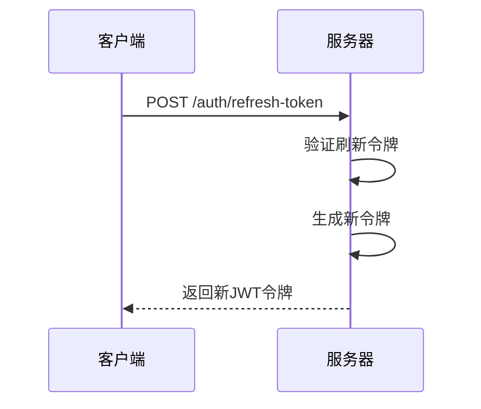
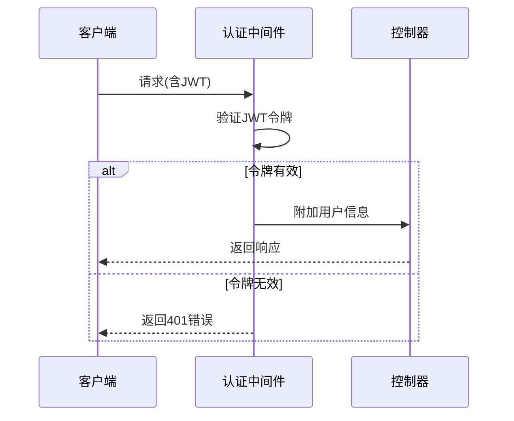
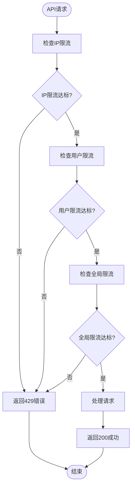
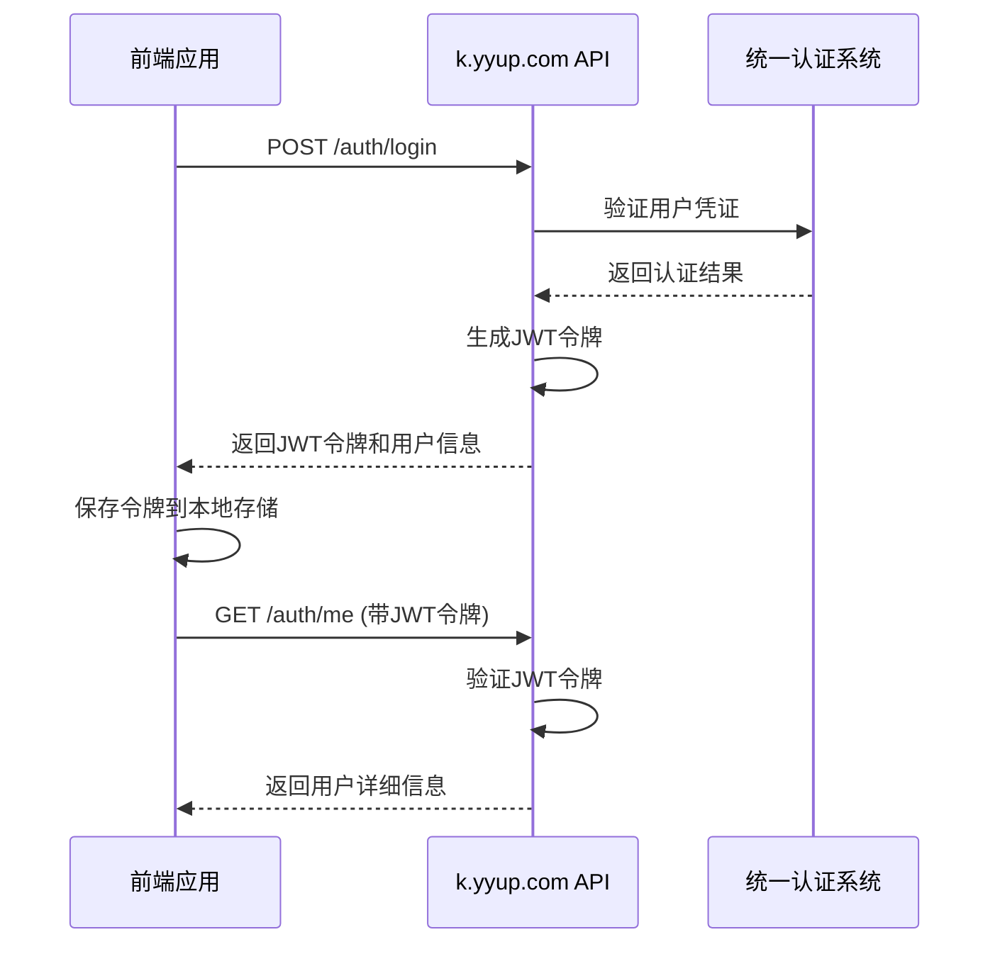
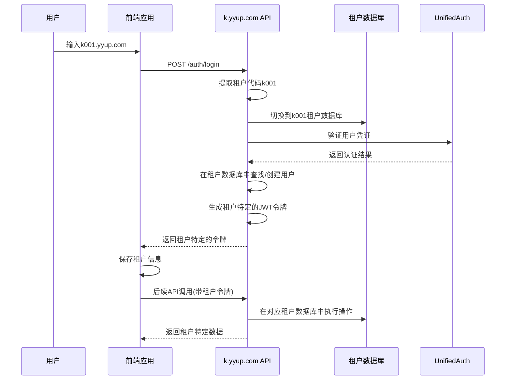
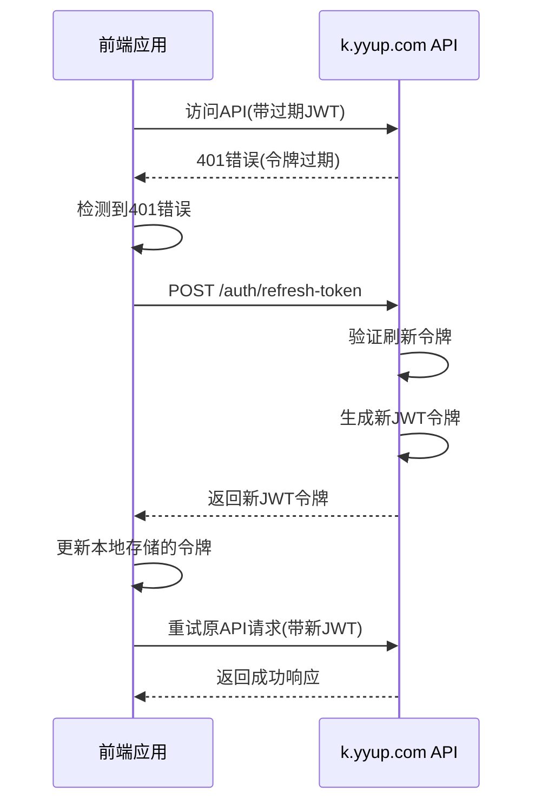

# API参考

<cite>
**本文档引用的文件**
- [auth.routes.ts](file://k.yyup.com/server/src/routes/auth.routes.ts)
- [auth.controller.ts](file://k.yyup.com/server/src/controllers/auth.controller.ts)
- [auth.middleware.ts](file://k.yyup.com/server/src/middlewares/auth.middleware.ts)
- [unified-tenant-system/server/src/routes/auth.routes.ts](file://unified-tenant-system/server/src/routes/auth.routes.ts)
- [unified-tenant-system/server/src/controllers/auth.controller.ts](file://unified-tenant-system/server/src/controllers/auth.controller.ts)
</cite>

## 目录
1. [简介](#简介)
2. [API端点详情](#api端点详情)
3. [认证与授权机制](#认证与授权机制)
4. [API版本控制与向后兼容性](#api版本控制与向后兼容性)
5. [API限流与防滥用机制](#api限流与防滥用机制)
6. [API使用示例](#api使用示例)
7. [API调试指南](#api调试指南)
8. [API交互图](#api交互图)

## 简介
本API参考文档详细介绍了k.yyup.com子系统暴露的所有API端点。该系统采用统一租户认证架构，为用户提供安全、可靠的认证服务。API设计遵循RESTful原则，支持JSON格式的数据交换，并通过JWT令牌实现安全的用户认证和授权。

系统主要功能包括用户登录、登出、令牌刷新、用户信息获取等核心认证功能。通过统一认证系统，实现了跨租户的用户管理，支持多租户架构下的用户身份验证和权限控制。

**API基础URL**: `https://k.yyup.com/api`

**请求格式**: 所有请求必须使用`application/json`作为Content-Type。

**响应格式**: 所有响应都遵循统一的JSON格式，包含`success`、`data`和`message`字段。

## API端点详情

### 认证端点

#### 用户登录
**HTTP方法**: POST  
**URL路径**: `/auth/login`  
**标签**: Authentication

**请求参数**:
- `phone` (string, 必需): 手机号
- `password` (string, 必需): 密码
- `tenantCode` (string, 可选): 租户代码

**请求体结构**:
```json
{
  "phone": "13800138000",
  "password": "password123",
  "tenantCode": "k001"
}
```

**响应格式**:
- 成功 (200): 返回JWT访问令牌和用户信息
- 认证失败 (401): 认证失败

**错误码**:
- 401: 认证失败

**Section sources**
- [auth.routes.ts](file://k.yyup.com/server/src/routes/auth.routes.ts#L13-L42)
- [auth.controller.ts](file://k.yyup.com/server/src/controllers/auth.controller.ts#L15-L22)

#### 用户登出
**HTTP方法**: POST  
**URL路径**: `/auth/logout`  
**标签**: Authentication

**安全要求**: Bearer JWT令牌

**响应格式**:
- 成功 (200): 登出成功
- 未授权 (401): 未提供有效的认证令牌

**错误码**:
- 401: 未授权访问

**Section sources**
- [auth.routes.ts](file://k.yyup.com/server/src/routes/auth.routes.ts#L43-L55)
- [auth.controller.ts](file://k.yyup.com/server/src/controllers/auth.controller.ts#L27-L33)

#### 获取当前用户信息
**HTTP方法**: GET  
**URL路径**: `/auth/me`  
**标签**: Authentication

**安全要求**: Bearer JWT令牌

**响应格式**:
- 成功 (200): 返回当前用户信息
- 未授权 (401): 未提供有效的认证令牌

**错误码**:
- 401: 未授权访问

**Section sources**
- [auth.routes.ts](file://k.yyup.com/server/src/routes/auth.routes.ts#L57-L69)
- [auth.controller.ts](file://k.yyup.com/server/src/controllers/auth.controller.ts#L38-L48)

#### 获取用户关联的租户列表
**HTTP方法**: POST  
**URL路径**: `/auth/tenants`  
**标签**: Authentication

**请求参数**:
- `phone` (string, 必需): 手机号
- `password` (string, 必需): 密码

**请求体结构**:
```json
{
  "phone": "13800138000",
  "password": "password123"
}
```

**响应格式**:
- 成功 (200): 返回用户关联的租户列表
- 认证失败 (401): 认证失败

**错误码**:
- 401: 认证失败

**Section sources**
- [auth.routes.ts](file://k.yyup.com/server/src/routes/auth.routes.ts#L71-L94)
- [auth.controller.ts](file://k.yyup.com/server/src/controllers/auth.controller.ts#L62-L69)

#### 绑定用户到租户
**HTTP方法**: POST  
**URL路径**: `/auth/bind-tenant`  
**标签**: Authentication

**请求参数**:
- `globalUserId` (string, 必需): 全局用户ID
- `tenantCode` (string, 必需): 租户代码
- `role` (string, 必需): 用户角色
- `permissions` (array, 必需): 权限列表

**请求体结构**:
```json
{
  "globalUserId": "123456",
  "tenantCode": "k001",
  "role": "admin",
  "permissions": ["read", "write"]
}
```

**响应格式**:
- 成功 (200): 绑定成功
- 认证失败 (401): 认证失败

**错误码**:
- 401: 认证失败

**Section sources**
- [auth.routes.ts](file://k.yyup.com/server/src/routes/auth.routes.ts#L96-L127)
- [auth.controller.ts](file://k.yyup.com/server/src/controllers/auth.controller.ts#L75-L82)

## 认证与授权机制

### JWT令牌获取流程
k.yyup.com子系统采用基于JWT（JSON Web Token）的认证机制。用户通过手机号和密码进行身份验证，成功后服务器返回JWT访问令牌和刷新令牌。

**令牌获取流程**:
1. 客户端发送登录请求，包含手机号和密码
2. 服务器验证用户凭证
3. 验证通过后，生成JWT访问令牌和刷新令牌
4. 将令牌返回给客户端



**Diagram sources**
- [auth.routes.ts](file://k.yyup.com/server/src/routes/auth.routes.ts#L13-L42)
- [auth.controller.ts](file://k.yyup.com/server/src/controllers/auth.controller.ts#L15-L22)

### JWT令牌刷新流程
为了提高安全性，访问令牌具有较短的有效期。当访问令牌过期时，客户端可以使用刷新令牌获取新的访问令牌，而无需重新登录。

**令牌刷新流程**:
1. 客户端检测到访问令牌即将过期或已过期
2. 使用刷新令牌发送刷新请求
3. 服务器验证刷新令牌的有效性
4. 验证通过后，生成新的访问令牌和刷新令牌
5. 将新令牌返回给客户端



**Diagram sources**
- [unified-tenant-system/server/src/routes/auth.routes.ts](file://unified-tenant-system/server/src/routes/auth.routes.ts#L497-L577)
- [unified-tenant-system/server/src/controllers/auth.controller.ts](file://unified-tenant-system/server/src/controllers/auth.controller.ts#L183-L261)

### JWT令牌验证流程
服务器通过中间件自动验证JWT令牌的有效性。验证过程包括检查令牌签名、过期时间等。

**验证流程**:
1. 客户端在请求头中包含Bearer令牌
2. 服务器中间件拦截请求
3. 解码并验证JWT令牌
4. 验证通过后，将用户信息附加到请求对象
5. 继续处理请求



**Diagram sources**
- [auth.middleware.ts](file://k.yyup.com/server/src/middlewares/auth.middleware.ts)
- [auth.controller.ts](file://k.yyup.com/server/src/controllers/auth.controller.ts#L55-L57)

## API版本控制与向后兼容性

### 版本控制策略
k.yyup.com子系统采用URL路径版本控制策略。所有API端点都位于`/api/v1/`路径下，确保API的稳定性和向后兼容性。

**版本控制规则**:
- 主版本号变更表示不兼容的API变更
- 次版本号变更表示向后兼容的功能添加
- 修订号变更表示向后兼容的问题修复

### 向后兼容性保证
系统承诺保持向后兼容性，确保现有客户端能够继续正常工作。具体措施包括：

1. **字段兼容性**: 不删除现有响应字段，只添加新字段
2. **参数兼容性**: 不删除现有请求参数，只添加可选参数
3. **错误码兼容性**: 保持现有错误码不变，只添加新错误码
4. **行为兼容性**: 不改变现有API的行为逻辑

当需要进行不兼容的变更时，将创建新的API版本（如v2），同时保持旧版本的运行。

## API限流与防滥用机制

### 限流策略
为防止API被滥用，系统实施了多层次的限流机制：

**登录限流**: 每个IP地址每分钟最多5次登录尝试，防止暴力破解攻击。

**API调用限流**: 每个用户每秒最多10次API调用，防止过度使用。

**全局限流**: 系统整体每秒最多1000次请求，防止DDoS攻击。



**Diagram sources**
- [unified-tenant-system/server/src/routes/auth.routes.ts](file://unified-tenant-system/server/src/routes/auth.routes.ts#L126-L130)
- [unified-tenant-system/server/src/middlewares/security.middleware.ts](file://unified-tenant-system/server/src/middlewares/security.middleware.ts)

### 防滥用机制
系统还实施了其他安全措施来防止API滥用：

1. **SQL注入防护**: 所有数据库查询都使用参数化查询，防止SQL注入攻击。
2. **请求大小限制**: 单个请求体大小限制为10MB，防止大请求导致服务器资源耗尽。
3. **安全头设置**: 设置CORS、XSS防护等安全头，增强API安全性。
4. **日志监控**: 记录所有API调用日志，便于监控和审计。

## API使用示例

### curl命令示例

#### 用户登录
```bash
curl -X POST https://k.yyup.com/api/auth/login \
  -H "Content-Type: application/json" \
  -d '{
    "phone": "13800138000",
    "password": "password123",
    "tenantCode": "k001"
  }'
```

#### 获取当前用户信息
```bash
curl -X GET https://k.yyup.com/api/auth/me \
  -H "Authorization: Bearer YOUR_JWT_TOKEN"
```

#### 用户登出
```bash
curl -X POST https://k.yyup.com/api/auth/logout \
  -H "Authorization: Bearer YOUR_JWT_TOKEN"
```

#### 获取租户列表
```bash
curl -X POST https://k.yyup.com/api/auth/tenants \
  -H "Content-Type: application/json" \
  -d '{
    "phone": "13800138000",
    "password": "password123"
  }'
```

### JavaScript代码示例

#### 使用fetch进行登录
```javascript
async function login(phone, password, tenantCode) {
  try {
    const response = await fetch('https://k.yyup.com/api/auth/login', {
      method: 'POST',
      headers: {
        'Content-Type': 'application/json',
      },
      body: JSON.stringify({
        phone,
        password,
        tenantCode
      })
    });

    const data = await response.json();
    
    if (data.success) {
      // 登录成功，保存令牌
      localStorage.setItem('token', data.data.token);
      console.log('登录成功:', data.data.user);
    } else {
      // 登录失败
      console.error('登录失败:', data.message);
    }
  } catch (error) {
    console.error('请求失败:', error);
  }
}
```

#### 获取当前用户信息
```javascript
async function getCurrentUser() {
  const token = localStorage.getItem('token');
  
  try {
    const response = await fetch('https://k.yyup.com/api/auth/me', {
      method: 'GET',
      headers: {
        'Authorization': `Bearer ${token}`
      }
    });

    const data = await response.json();
    
    if (data.success) {
      console.log('用户信息:', data.data);
      return data.data;
    } else {
      console.error('获取用户信息失败:', data.message);
      return null;
    }
  } catch (error) {
    console.error('请求失败:', error);
    return null;
  }
}
```

#### 使用axios进行API调用
```javascript
import axios from 'axios';

// 创建API实例
const api = axios.create({
  baseURL: 'https://k.yyup.com/api',
  timeout: 10000,
});

// 请求拦截器 - 添加JWT令牌
api.interceptors.request.use(
  (config) => {
    const token = localStorage.getItem('token');
    if (token) {
      config.headers.Authorization = `Bearer ${token}`;
    }
    return config;
  },
  (error) => {
    return Promise.reject(error);
  }
);

// 响应拦截器 - 处理错误
api.interceptors.response.use(
  (response) => {
    return response;
  },
  (error) => {
    if (error.response?.status === 401) {
      // 令牌过期，清除本地存储
      localStorage.removeItem('token');
      window.location.href = '/login';
    }
    return Promise.reject(error);
  }
);

// 使用示例
async function login(phone, password, tenantCode) {
  try {
    const response = await api.post('/auth/login', {
      phone,
      password,
      tenantCode
    });
    
    if (response.data.success) {
      localStorage.setItem('token', response.data.data.token);
      return response.data.data;
    }
  } catch (error) {
    console.error('登录失败:', error);
    throw error;
  }
}
```

## API调试指南

### 使用Postman调试
Postman是调试API的强大工具。以下是使用Postman调试k.yyup.com API的步骤：

1. **创建请求集合**: 创建一个名为"k.yyup.com API"的集合，用于组织相关API请求。

2. **配置环境变量**: 设置环境变量如`base_url`（https://k.yyup.com/api）和`token`，便于在不同环境中切换。

3. **添加认证头**: 在请求的Headers中添加`Authorization: Bearer {{token}}`，使用环境变量中的令牌。

4. **保存常用请求**: 保存常用的API请求，如登录、获取用户信息等，便于重复使用。

5. **使用预请求脚本**: 在需要时使用预请求脚本自动获取令牌。

### 常见错误处理

#### 401 Unauthorized错误
当收到401错误时，通常表示认证失败或令牌过期。处理步骤：

1. 检查请求头中的Authorization字段是否正确
2. 验证JWT令牌是否有效
3. 如果令牌过期，使用刷新令牌获取新令牌
4. 如果刷新失败，要求用户重新登录

```javascript
function handle401Error() {
  const refreshToken = localStorage.getItem('refreshToken');
  
  if (refreshToken) {
    // 尝试刷新令牌
    refreshAccessToken(refreshToken);
  } else {
    // 重新登录
    window.location.href = '/login';
  }
}
```

#### 429 Too Many Requests错误
当收到429错误时，表示请求过于频繁。处理步骤：

1. 立即停止发送请求
2. 等待一段时间（通常为1分钟）
3. 重新发送请求
4. 实现指数退避算法，避免再次触发限流

```javascript
async function retryWithBackoff(requestFn, maxRetries = 3) {
  let delay = 1000; // 1秒
  
  for (let i = 0; i < maxRetries; i++) {
    try {
      return await requestFn();
    } catch (error) {
      if (error.response?.status === 429 && i < maxRetries - 1) {
        console.log(`请求过于频繁，${delay}ms后重试...`);
        await new Promise(resolve => setTimeout(resolve, delay));
        delay *= 2; // 指数退避
      } else {
        throw error;
      }
    }
  }
}
```

#### 500 Internal Server Error错误
当收到500错误时，表示服务器内部错误。处理步骤：

1. 记录错误详情，包括请求URL、参数和时间戳
2. 不要频繁重试，避免加重服务器负担
3. 联系技术支持团队
4. 提供详细的错误信息以便排查

### 调试技巧
1. **启用详细日志**: 在开发环境中启用详细的API日志，便于追踪问题。
2. **使用浏览器开发者工具**: 利用浏览器的Network面板查看请求和响应详情。
3. **验证请求格式**: 确保请求体格式正确，Content-Type设置正确。
4. **检查CORS配置**: 确保服务器正确配置了CORS，允许前端域名访问。
5. **测试边界情况**: 测试空值、特殊字符、超长字符串等边界情况。

## API交互图

### 典型登录场景


**Diagram sources**
- [auth.routes.ts](file://k.yyup.com/server/src/routes/auth.routes.ts)
- [auth.controller.ts](file://k.yyup.com/server/src/controllers/auth.controller.ts)

### 多租户访问场景


**Diagram sources**
- [auth.middleware.ts](file://k.yyup.com/server/src/middlewares/auth.middleware.ts)
- [unified-tenant-system/server/src/controllers/auth.controller.ts](file://unified-tenant-system/server/src/controllers/auth.controller.ts)

### 令牌刷新场景


**Diagram sources**
- [unified-tenant-system/server/src/routes/auth.routes.ts](file://unified-tenant-system/server/src/routes/auth.routes.ts)
- [unified-tenant-system/server/src/controllers/auth.controller.ts](file://unified-tenant-system/server/src/controllers/auth.controller.ts)