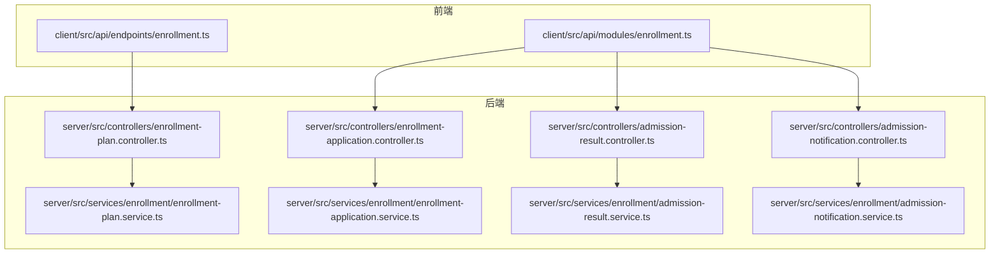
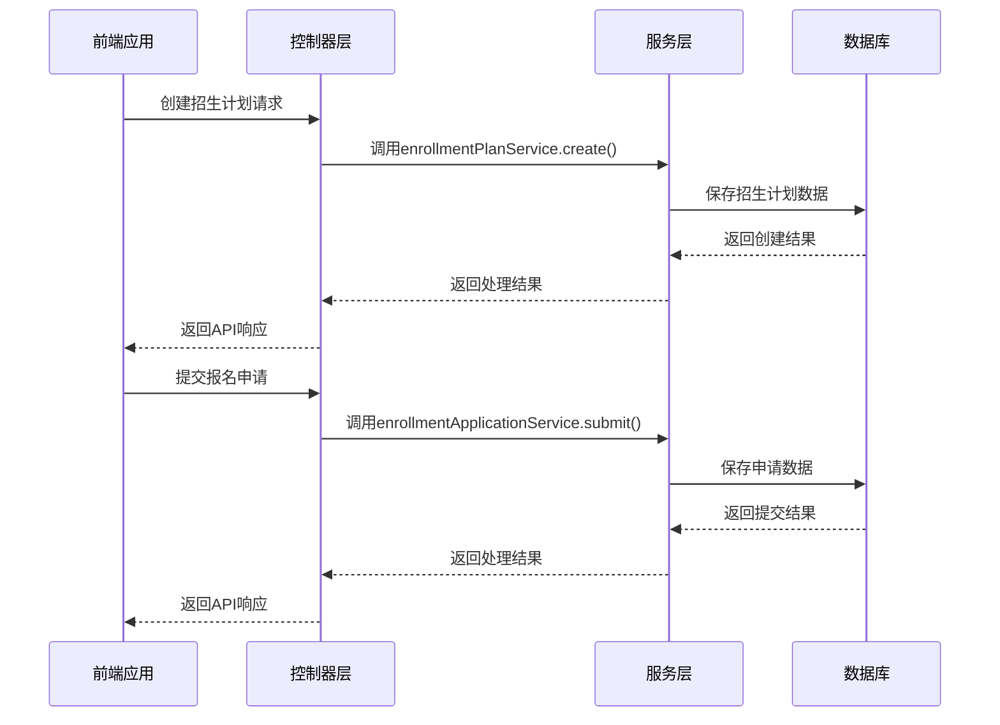
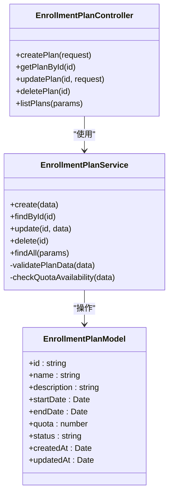
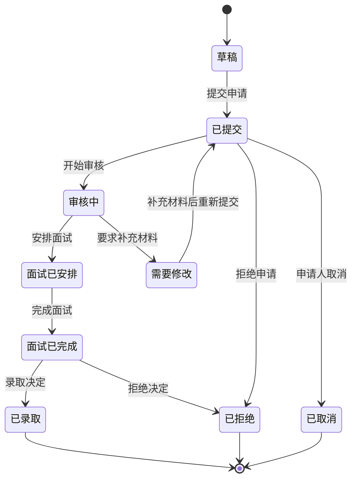
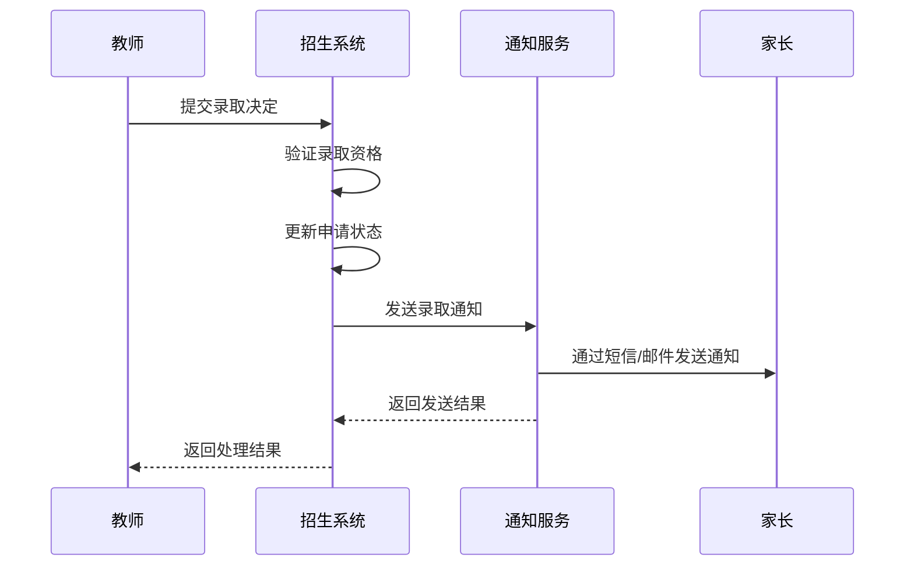
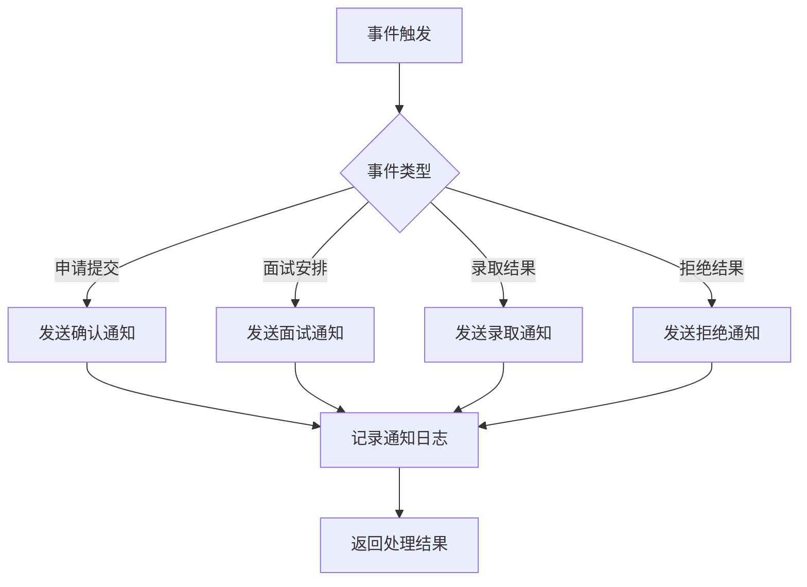
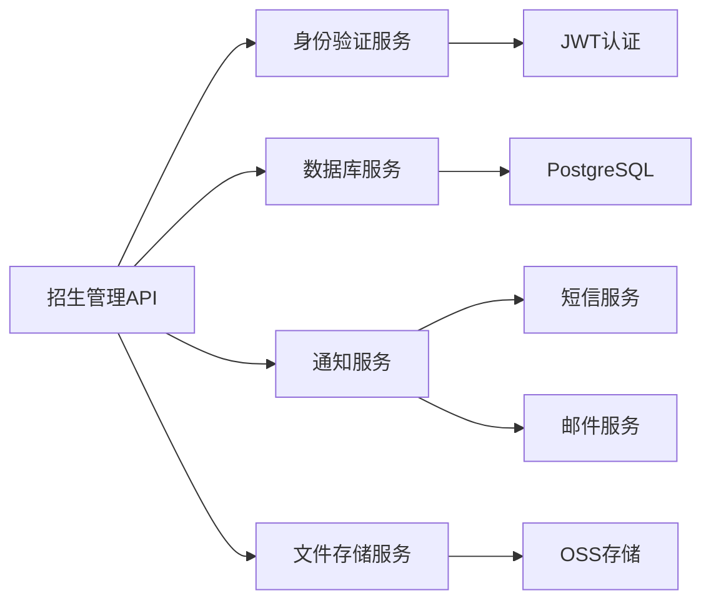

# 招生管理API

<cite>
**本文档引用的文件**  
- [enrollment.ts](file://client/src/api/modules/enrollment.ts)
- [enrollment-plan.controller.ts](file://server/src/controllers/enrollment-plan.controller.ts)
- [enrollment-application.controller.ts](file://server/src/controllers/enrollment-application.controller.ts)
- [admission-result.controller.ts](file://server/src/controllers/admission-result.controller.ts)
- [admission-notification.controller.ts](file://server/src/controllers/admission-notification.controller.ts)
- [enrollment-plan.service.ts](file://server/src/services/enrollment/enrollment-plan.service.ts)
- [enrollment-application.service.ts](file://server/src/services/enrollment/enrollment-application.service.ts)
- [admission-result.service.ts](file://server/src/services/enrollment/admission-result.service.ts)
- [admission-notification.service.ts](file://server/src/services/enrollment/admission-notification.service.ts)
- [enrollment.ts](file://client/src/api/endpoints/enrollment.ts)
</cite>

## 目录
1. [简介](#简介)
2. [项目结构](#项目结构)
3. [核心组件](#核心组件)
4. [架构概述](#架构概述)
5. [详细组件分析](#详细组件分析)
6. [依赖分析](#依赖分析)
7. [性能考虑](#性能考虑)
8. [故障排除指南](#故障排除指南)
9. [结论](#结论)

## 简介
本文档全面介绍了招生管理API，涵盖招生计划管理、报名申请处理、状态跟踪和统计分析功能。文档详细描述了每个API端点的技术细节，包括分页、过滤和排序参数的使用。同时解释了招生流程的状态机设计及其在API中的体现，并提供了创建招生计划、提交报名表单、更新申请状态等核心操作的完整示例。此外，还说明了如何通过API获取招生统计数据和生成报表，并包含招生业务流程图和关键API调用的时序图。

## 项目结构
招生管理功能分布在客户端和服务端多个目录中，主要集中在`client/src/api`和`server/src/controllers/enrollment`路径下。前端API定义位于`client/src/api/endpoints/enrollment.ts`，而服务端控制器和服务实现位于`server/src/controllers`和`server/src/services/enrollment`目录中。

**图源**
- [enrollment.ts](file://client/src/api/endpoints/enrollment.ts)
- [enrollment-plan.controller.ts](file://server/src/controllers/enrollment-plan.controller.ts)
- [enrollment-application.controller.ts](file://server/src/controllers/enrollment-application.controller.ts)
- [admission-result.controller.ts](file://server/src/controllers/admission-result.controller.ts)
- [admission-notification.controller.ts](file://server/src/controllers/admission-notification.controller.ts)

**节源**
- [enrollment.ts](file://client/src/api/endpoints/enrollment.ts)
- [enrollment-plan.controller.ts](file://server/src/controllers/enrollment-plan.controller.ts)

## 核心组件
招生管理API的核心组件包括招生计划管理、招生申请处理、录取结果管理和通知服务。这些组件共同构成了完整的招生业务流程，支持从计划创建到最终录取的全过程管理。

**节源**
- [enrollment-plan.controller.ts](file://server/src/controllers/enrollment-plan.controller.ts)
- [enrollment-application.controller.ts](file://server/src/controllers/enrollment-application.controller.ts)
- [admission-result.controller.ts](file://server/src/controllers/admission-result.controller.ts)
- [admission-notification.controller.ts](file://server/src/controllers/admission-notification.controller.ts)

## 架构概述
招生管理API采用分层架构设计，前端通过API端点与后端控制器通信，控制器调用服务层处理业务逻辑，服务层与数据访问层交互完成数据持久化。

**图源**
- [enrollment-plan.controller.ts](file://server/src/controllers/enrollment-plan.controller.ts)
- [enrollment-application.controller.ts](file://server/src/controllers/enrollment-application.controller.ts)
- [enrollment-plan.service.ts](file://server/src/services/enrollment/enrollment-plan.service.ts)
- [enrollment-application.service.ts](file://server/src/services/enrollment/enrollment-application.service.ts)

## 详细组件分析

### 招生计划管理分析
招生计划管理组件负责创建、查询、更新和删除招生计划，支持分页、过滤和排序功能。

#### 招生计划管理类图

**图源**
- [enrollment-plan.controller.ts](file://server/src/controllers/enrollment-plan.controller.ts)
- [enrollment-plan.service.ts](file://server/src/services/enrollment/enrollment-plan.service.ts)

**节源**
- [enrollment-plan.controller.ts](file://server/src/controllers/enrollment-plan.controller.ts)
- [enrollment-plan.service.ts](file://server/src/services/enrollment/enrollment-plan.service.ts)

### 招生申请处理分析
招生申请处理组件管理报名申请的全生命周期，包括创建、更新、审核和状态变更。

#### 招生申请状态机

**图源**
- [enrollment-application.controller.ts](file://server/src/controllers/enrollment-application.controller.ts)
- [enrollment-application.service.ts](file://server/src/services/enrollment/enrollment-application.service.ts)

**节源**
- [enrollment.ts](file://client/src/api/modules/enrollment.ts)
- [enrollment-application.controller.ts](file://server/src/controllers/enrollment-application.controller.ts)

### 录取结果管理分析
录取结果管理组件处理录取决策、结果通知和相关统计。

#### 录取结果处理时序图

**图源**
- [admission-result.controller.ts](file://server/src/controllers/admission-result.controller.ts)
- [admission-result.service.ts](file://server/src/services/enrollment/admission-result.service.ts)

**节源**
- [admission-result.controller.ts](file://server/src/controllers/admission-result.controller.ts)
- [admission-result.service.ts](file://server/src/services/enrollment/admission-result.service.ts)

### 通知服务分析
通知服务组件负责在招生流程的关键节点向相关人员发送通知。

#### 通知服务流程图

**图源**
- [admission-notification.controller.ts](file://server/src/controllers/admission-notification.controller.ts)
- [admission-notification.service.ts](file://server/src/services/enrollment/admission-notification.service.ts)

**节源**
- [admission-notification.controller.ts](file://server/src/controllers/admission-notification.controller.ts)
- [admission-notification.service.ts](file://server/src/services/enrollment/admission-notification.service.ts)

## 依赖分析
招生管理API依赖于身份验证服务、数据库服务和通知服务。这些依赖关系确保了系统的安全性和功能完整性。

**图源**
- [enrollment-plan.controller.ts](file://server/src/controllers/enrollment-plan.controller.ts)
- [enrollment-application.controller.ts](file://server/src/controllers/enrollment-application.controller.ts)
- [admission-result.controller.ts](file://server/src/controllers/admission-result.controller.ts)
- [admission-notification.controller.ts](file://server/src/controllers/admission-notification.controller.ts)

**节源**
- [enrollment-plan.controller.ts](file://server/src/controllers/enrollment-plan.controller.ts)
- [enrollment-application.controller.ts](file://server/src/controllers/enrollment-application.controller.ts)

## 性能考虑
招生管理API在设计时考虑了性能优化，包括数据库索引优化、缓存机制和分页查询。对于大量数据的统计分析操作，系统采用异步处理模式，避免阻塞主线程。

## 故障排除指南
常见问题包括API认证失败、数据验证错误和通知发送失败。对于认证失败，请检查JWT令牌的有效性；对于数据验证错误，请确保请求数据符合API规范；对于通知发送失败，请检查通知服务的配置和网络连接。

**节源**
- [enrollment-plan.controller.ts](file://server/src/controllers/enrollment-plan.controller.ts)
- [enrollment-application.controller.ts](file://server/src/controllers/enrollment-application.controller.ts)
- [admission-result.controller.ts](file://server/src/controllers/admission-result.controller.ts)
- [admission-notification.controller.ts](file://server/src/controllers/admission-notification.controller.ts)

## 结论
招生管理API提供了一套完整的招生解决方案，涵盖了从计划创建到录取通知的全过程。通过清晰的API设计和状态机管理，系统能够有效支持复杂的招生业务流程。未来可以进一步增强数据分析功能，提供更智能的招生预测和决策支持。