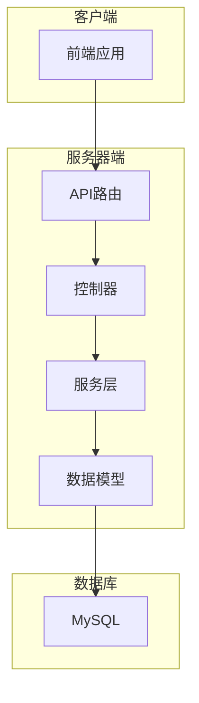
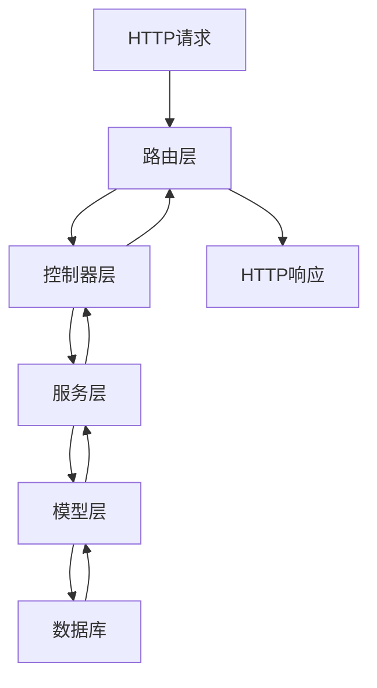
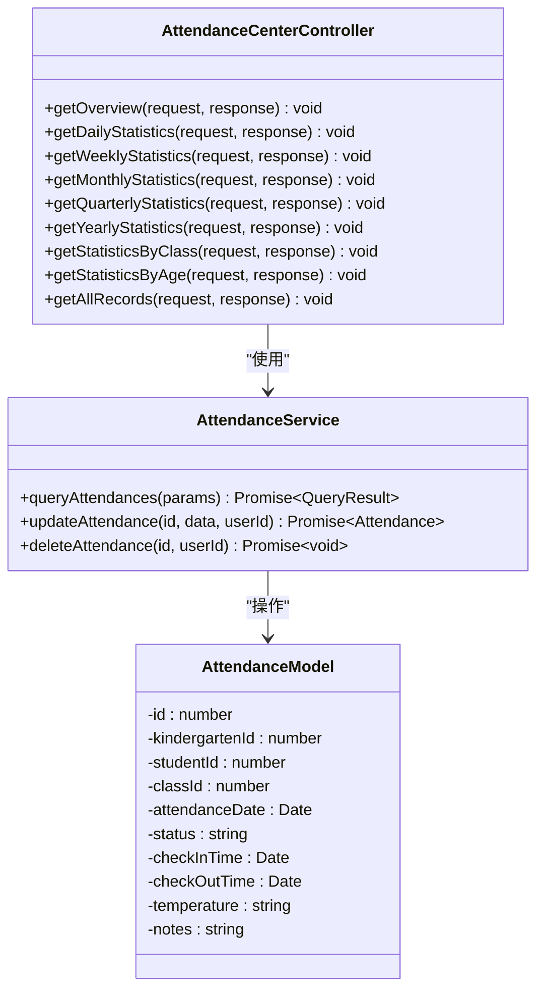
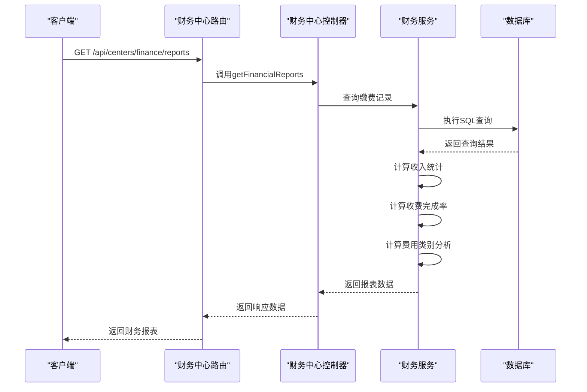
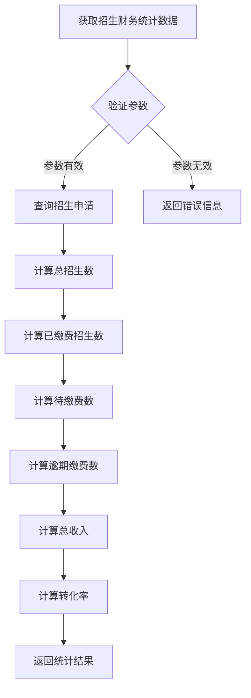
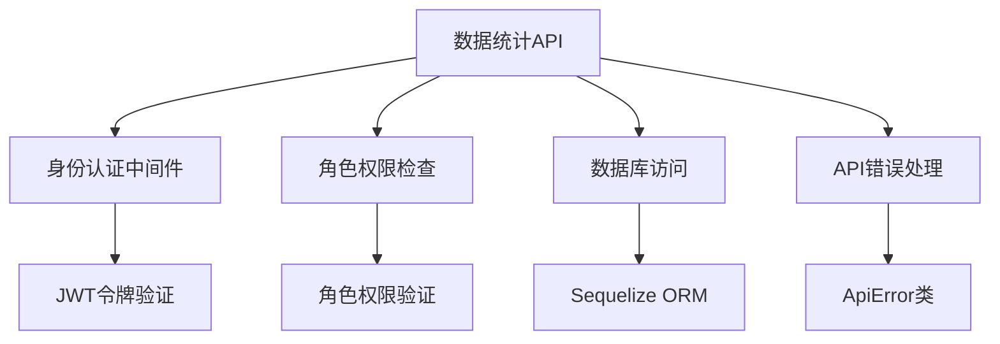

# 数据统计API

<cite>
**本文档引用的文件**   
- [attendance-center.controller.ts](file://k.yyup.com/server/src/controllers/attendance-center.controller.ts)
- [finance-center.controller.ts](file://k.yyup.com/server/src/controllers/centers/finance-center.controller.ts)
- [enrollment-finance.controller.ts](file://k.yyup.com/server/src/controllers/enrollment-finance.controller.ts)
- [attendance-center.routes.ts](file://k.yyup.com/server/src/routes/attendance-center.routes.ts)
- [finance-center.routes.ts](file://k.yyup.com/server/src/routes/centers/finance-center.routes.ts)
- [enrollment-finance.routes.ts](file://k.yyup.com/server/src/routes/enrollment-finance.routes.ts)
- [attendance.ts](file://k.yyup.com/client/src/api/endpoints/attendance.ts)
- [finance.ts](file://k.yyup.com/client/src/api/modules/finance.ts)
</cite>

## 目录
1. [引言](#引言)
2. [项目结构](#项目结构)
3. [核心组件](#核心组件)
4. [架构概述](#架构概述)
5. [详细组件分析](#详细组件分析)
6. [依赖分析](#依赖分析)
7. [性能考虑](#性能考虑)
8. [故障排除指南](#故障排除指南)
9. [结论](#结论)
10. [附录](#附录)（如有必要）

## 引言
本文档详细介绍了幼儿园管理系统中的数据统计API，涵盖招生统计、考勤数据、财务报表等核心功能。文档重点说明了API端点、复杂查询参数使用、大数据集分页处理、性能优化策略以及实时数据流实现。通过本API，系统管理员和园长可以获取全面的业务洞察，支持数据驱动的决策制定。

## 项目结构
系统采用分层架构设计，包含客户端、服务器端和数据库三层。数据统计功能主要集中在服务器端的控制器和路由模块中，通过RESTful API提供服务。前端通过模块化API调用与后端交互，实现各类报表和统计功能。

**图表来源**
- [attendance-center.controller.ts](file://k.yyup.com/server/src/controllers/attendance-center.controller.ts)
- [finance-center.controller.ts](file://k.yyup.com/server/src/controllers/centers/finance-center.controller.ts)

**章节来源**
- [attendance-center.controller.ts](file://k.yyup.com/server/src/controllers/attendance-center.controller.ts)
- [finance-center.controller.ts](file://k.yyup.com/server/src/controllers/centers/finance-center.controller.ts)

## 核心组件
数据统计API的核心组件包括考勤统计、财务报表和招生统计三大模块。每个模块都提供了多维度的数据聚合和分析功能，支持按时间范围、数据分组和聚合函数进行复杂查询。API设计遵循RESTful原则，通过统一的响应格式返回数据。

**章节来源**
- [attendance-center.controller.ts](file://k.yyup.com/server/src/controllers/attendance-center.controller.ts)
- [finance-center.controller.ts](file://k.yyup.com/server/src/controllers/centers/finance-center.controller.ts)
- [enrollment-finance.controller.ts](file://k.yyup.com/server/src/controllers/enrollment-finance.controller.ts)

## 架构概述
系统采用MVC架构模式，将数据统计功能分为路由、控制器、服务和模型四个层次。路由层负责API端点的定义和请求分发，控制器层处理业务逻辑，服务层封装核心业务规则，模型层负责数据持久化。

**图表来源**
- [attendance-center.routes.ts](file://k.yyup.com/server/src/routes/attendance-center.routes.ts)
- [finance-center.routes.ts](file://k.yyup.com/server/src/routes/centers/finance-center.routes.ts)
- [enrollment-finance.routes.ts](file://k.yyup.com/server/src/routes/enrollment-finance.routes.ts)

## 详细组件分析

### 考勤统计组件分析
考勤统计组件提供了全面的考勤数据分析功能，包括日、周、月、季度和年度统计，以及按班级和年龄段的分组统计。

#### 考勤统计类图

**图表来源**
- [attendance-center.controller.ts](file://k.yyup.com/server/src/controllers/attendance-center.controller.ts)
- [attendance-center.routes.ts](file://k.yyup.com/server/src/routes/attendance-center.routes.ts)

### 财务报表组件分析
财务报表组件提供了全面的财务管理功能，包括财务概览、收费项目管理、缴费记录查询和财务报表生成。

#### 财务报表序列图

**图表来源**
- [finance-center.controller.ts](file://k.yyup.com/server/src/controllers/centers/finance-center.controller.ts)
- [finance-center.routes.ts](file://k.yyup.com/server/src/routes/centers/finance-center.routes.ts)

### 招生统计组件分析
招生统计组件实现了招生与财务的联动分析，提供招生流程跟踪、费用套餐管理和缴费确认等功能。

#### 招生统计流程图

**图表来源**
- [enrollment-finance.controller.ts](file://k.yyup.com/server/src/controllers/enrollment-finance.controller.ts)
- [enrollment-finance.routes.ts](file://k.yyup.com/server/src/routes/enrollment-finance.routes.ts)

**章节来源**
- [enrollment-finance.controller.ts](file://k.yyup.com/server/src/controllers/enrollment-finance.controller.ts)
- [enrollment-finance.routes.ts](file://k.yyup.com/server/src/routes/enrollment-finance.routes.ts)

## 依赖分析
数据统计API依赖于多个核心模块和外部服务，包括身份认证、数据库访问和权限管理。

**图表来源**
- [attendance-center.controller.ts](file://k.yyup.com/server/src/controllers/attendance-center.controller.ts)
- [finance-center.controller.ts](file://k.yyup.com/server/src/controllers/centers/finance-center.controller.ts)
- [enrollment-finance.controller.ts](file://k.yyup.com/server/src/controllers/enrollment-finance.controller.ts)

**章节来源**
- [attendance-center.controller.ts](file://k.yyup.com/server/src/controllers/attendance-center.controller.ts)
- [finance-center.controller.ts](file://k.yyup.com/server/src/controllers/centers/finance-center.controller.ts)
- [enrollment-finance.controller.ts](file://k.yyup.com/server/src/controllers/enrollment-finance.controller.ts)

## 性能考虑
API在处理大数据集时采用了多种性能优化策略，包括分页查询、数据缓存和异步处理。

**章节来源**
- [attendance-center.controller.ts](file://k.yyup.com/server/src/controllers/attendance-center.controller.ts)
- [finance-center.controller.ts](file://k.yyup.com/server/src/controllers/centers/finance-center.controller.ts)

## 故障排除指南
当API调用出现问题时，应首先检查请求参数是否正确，然后验证用户权限，最后查看服务器日志。

**章节来源**
- [attendance-center.controller.ts](file://k.yyup.com/server/src/controllers/attendance-center.controller.ts)
- [finance-center.controller.ts](file://k.yyup.com/server/src/controllers/centers/finance-center.controller.ts)
- [enrollment-finance.controller.ts](file://k.yyup.com/server/src/controllers/enrollment-finance.controller.ts)

## 结论
数据统计API为幼儿园管理系统提供了强大的数据分析能力，支持多维度的业务洞察。通过合理的架构设计和性能优化，API能够高效处理大量数据，为管理者提供及时准确的决策支持。

## 附录
### API端点列表
| 模块 | 端点 | 方法 | 描述 |
|------|------|------|------|
| 考勤中心 | /api/attendance-center/overview | GET | 获取全园考勤概览 |
| 考勤中心 | /api/attendance-center/statistics/daily | GET | 获取日考勤统计 |
| 考勤中心 | /api/attendance-center/statistics/weekly | GET | 获取周考勤统计 |
| 考勤中心 | /api/attendance-center/statistics/monthly | GET | 获取月考勤统计 |
| 财务中心 | /api/centers/finance/overview | GET | 获取财务概览数据 |
| 财务中心 | /api/centers/finance/reports | GET | 获取财务报表数据 |
| 财务中心 | /api/centers/finance/payment-records | GET | 获取缴费记录列表 |
| 招生财务 | /api/enrollment-finance/stats | GET | 获取招生财务统计数据 |
| 招生财务 | /api/enrollment-finance/linkages | GET | 获取招生财务关联列表 |

**章节来源**
- [attendance-center.routes.ts](file://k.yyup.com/server/src/routes/attendance-center.routes.ts)
- [finance-center.routes.ts](file://k.yyup.com/server/src/routes/centers/finance-center.routes.ts)
- [enrollment-finance.routes.ts](file://k.yyup.com/server/src/routes/enrollment-finance.routes.ts)