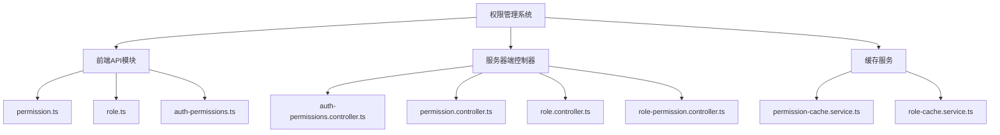
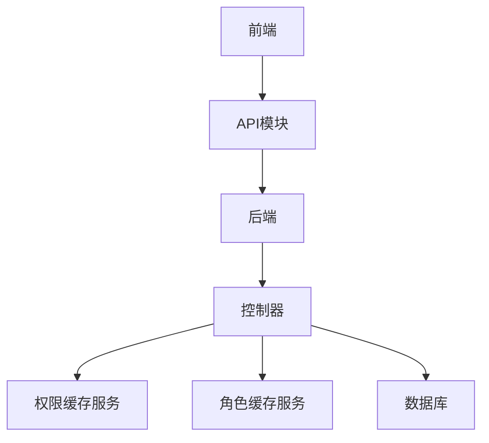
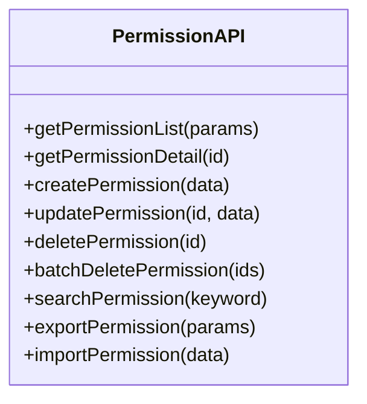
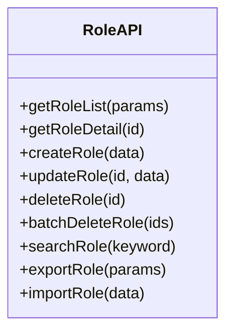
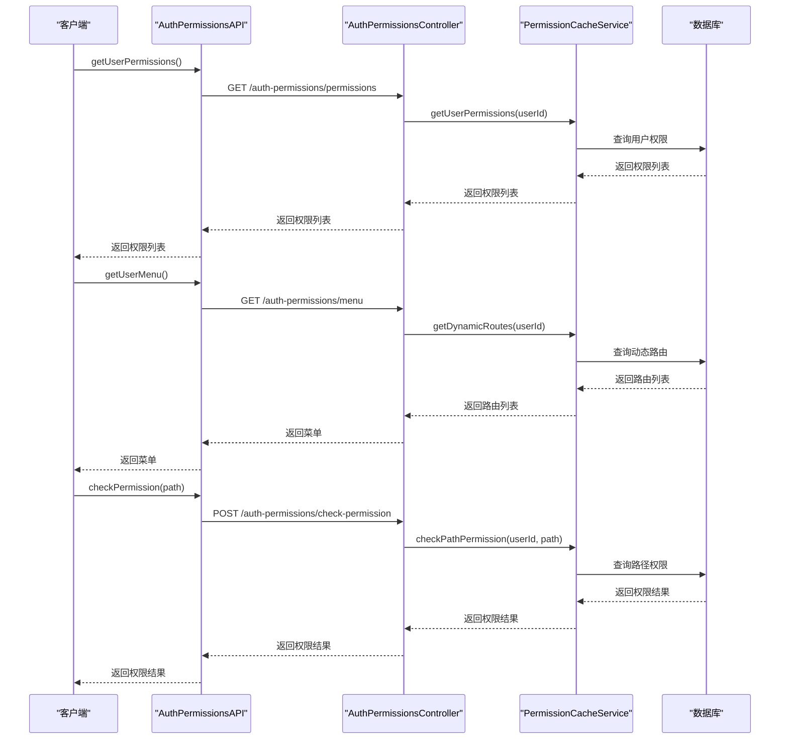
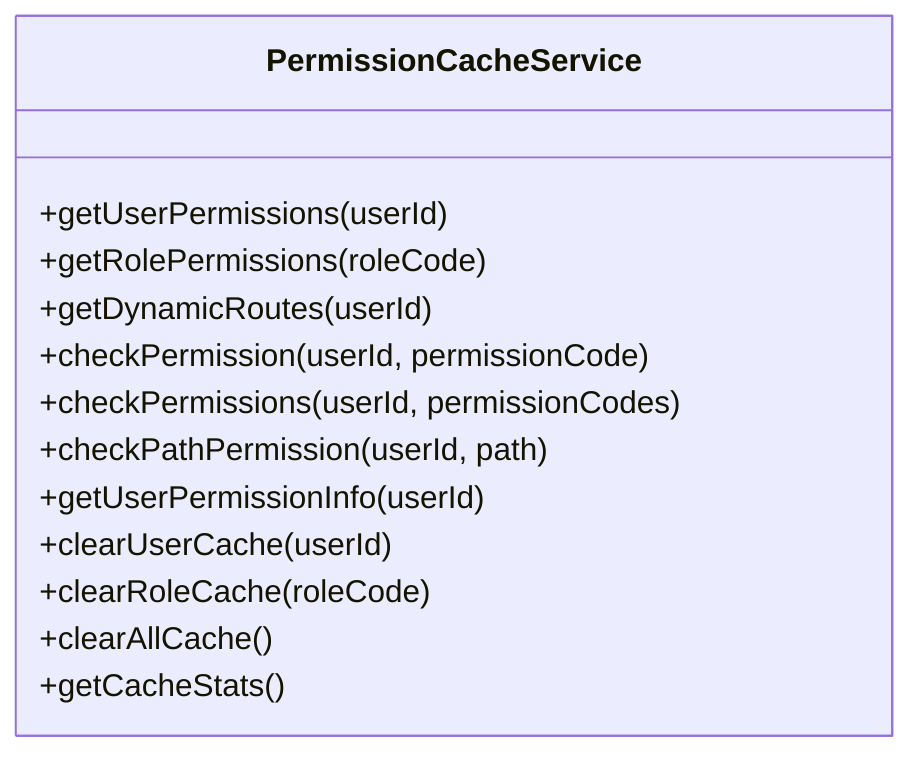
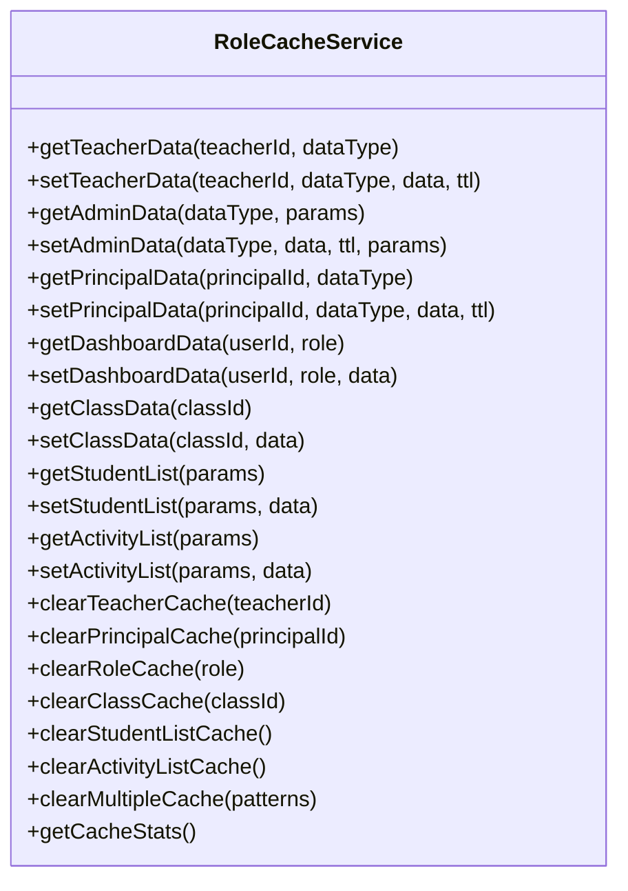
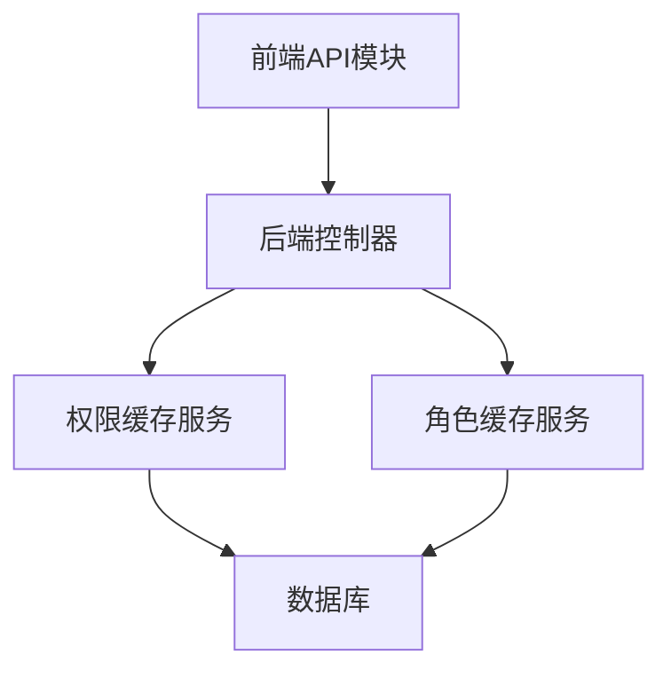

# 权限管理API

<cite>
**本文档引用的文件**
- [permissions.ts](file://k.yyup.com/backup/permission-system/permissions.ts)
- [permission-cache.service.ts](file://k.yyup.com/backup/permission-system/permission-cache.service.ts)
- [permission-cache.controller.ts](file://k.yyup.com/backup/permission-system/permission-cache.controller.ts)
- [role-cache.service.ts](file://k.yyup.com/backup/permission-system/role-cache.service.ts)
- [permission.ts](file://k.yyup.com/client/src/api/modules/permission.ts)
- [role.ts](file://k.yyup.com/client/src/api/modules/role.ts)
- [auth-permissions.ts](file://k.yyup.com/client/src/api/modules/auth-permissions.ts)
- [auth-permissions.controller.ts](file://k.yyup.com/server/src/controllers/auth-permissions.controller.ts)
- [permission.controller.ts](file://k.yyup.com/server/src/controllers/permission.controller.ts)
- [role.controller.ts](file://k.yyup.com/server/src/controllers/role.controller.ts)
- [role-permission.controller.ts](file://k.yyup.com/server/src/controllers/role-permission.controller.ts)
</cite>

## 目录
1. [简介](#简介)
2. [项目结构](#项目结构)
3. [核心组件](#核心组件)
4. [架构概述](#架构概述)
5. [详细组件分析](#详细组件分析)
6. [依赖分析](#依赖分析)
7. [性能考虑](#性能考虑)
8. [故障排除指南](#故障排除指南)
9. [结论](#结论)

## 简介
本文档详细介绍了基于角色的访问控制（RBAC）系统的实现，重点是权限管理API。文档涵盖了与权限、角色和用户权限分配相关的所有API端点，包括创建权限、分配角色、检查用户权限等操作。此外，还详细说明了API的请求/响应模式，特别是权限树结构的序列化和反序列化。文档解释了权限缓存机制如何与API层交互以提高性能，并提供了实际的API调用示例，展示如何为特定用户配置复杂的权限集。最后，文档包含了权限继承和作用域的说明。

## 项目结构
权限管理系统的文件主要分布在`k.yyup.com/backup/permission-system/`目录下，包括权限缓存服务、角色缓存服务、权限和角色的API模块以及控制器。前端API模块位于`client/src/api/modules/`目录下，而服务器端的控制器位于`server/src/controllers/`目录下。

**图源**
- [permission.ts](file://k.yyup.com/client/src/api/modules/permission.ts)
- [role.ts](file://k.yyup.com/client/src/api/modules/role.ts)
- [auth-permissions.ts](file://k.yyup.com/client/src/api/modules/auth-permissions.ts)
- [auth-permissions.controller.ts](file://k.yyup.com/server/src/controllers/auth-permissions.controller.ts)
- [permission.controller.ts](file://k.yyup.com/server/src/controllers/permission.controller.ts)
- [role.controller.ts](file://k.yyup.com/server/src/controllers/role.controller.ts)
- [role-permission.controller.ts](file://k.yyup.com/server/src/controllers/role-permission.controller.ts)
- [permission-cache.service.ts](file://k.yyup.com/backup/permission-system/permission-cache.service.ts)
- [role-cache.service.ts](file://k.yyup.com/backup/permission-system/role-cache.service.ts)

**节源**
- [permission.ts](file://k.yyup.com/client/src/api/modules/permission.ts)
- [role.ts](file://k.yyup.com/client/src/api/modules/role.ts)
- [auth-permissions.ts](file://k.yyup.com/client/src/api/modules/auth-permissions.ts)
- [auth-permissions.controller.ts](file://k.yyup.com/server/src/controllers/auth-permissions.controller.ts)
- [permission.controller.ts](file://k.yyup.com/server/src/controllers/permission.controller.ts)
- [role.controller.ts](file://k.yyup.com/server/src/controllers/role.controller.ts)
- [role-permission.controller.ts](file://k.yyup.com/server/src/controllers/role-permission.controller.ts)
- [permission-cache.service.ts](file://k.yyup.com/backup/permission-system/permission-cache.service.ts)
- [role-cache.service.ts](file://k.yyup.com/backup/permission-system/role-cache.service.ts)

## 核心组件
权限管理API的核心组件包括权限和角色的CRUD操作、权限缓存服务、角色缓存服务以及权限验证。这些组件共同实现了基于角色的访问控制（RBAC）系统。

**节源**
- [permission.ts](file://k.yyup.com/client/src/api/modules/permission.ts)
- [role.ts](file://k.yyup.com/client/src/api/modules/role.ts)
- [auth-permissions.ts](file://k.yyup.com/client/src/api/modules/auth-permissions.ts)
- [auth-permissions.controller.ts](file://k.yyup.com/server/src/controllers/auth-permissions.controller.ts)
- [permission.controller.ts](file://k.yyup.com/server/src/controllers/permission.controller.ts)
- [role.controller.ts](file://k.yyup.com/server/src/controllers/role.controller.ts)
- [role-permission.controller.ts](file://k.yyup.com/server/src/controllers/role-permission.controller.ts)
- [permission-cache.service.ts](file://k.yyup.com/backup/permission-system/permission-cache.service.ts)
- [role-cache.service.ts](file://k.yyup.com/backup/permission-system/role-cache.service.ts)

## 架构概述
权限管理API的架构分为前端和后端两部分。前端通过API模块与后端进行通信，后端通过控制器处理请求并返回响应。权限缓存服务和角色缓存服务用于提高性能，减少数据库查询次数。

**图源**
- [auth-permissions.controller.ts](file://k.yyup.com/server/src/controllers/auth-permissions.controller.ts)
- [permission.controller.ts](file://k.yyup.com/server/src/controllers/permission.controller.ts)
- [role.controller.ts](file://k.yyup.com/server/src/controllers/role.controller.ts)
- [role-permission.controller.ts](file://k.yyup.com/server/src/controllers/role-permission.controller.ts)
- [permission-cache.service.ts](file://k.yyup.com/backup/permission-system/permission-cache.service.ts)
- [role-cache.service.ts](file://k.yyup.com/backup/permission-system/role-cache.service.ts)

## 详细组件分析
### 权限管理API
权限管理API提供了创建、读取、更新和删除权限的功能。这些功能通过`permission.ts`文件中的API模块实现。

#### 权限管理API类图

**图源**
- [permission.ts](file://k.yyup.com/client/src/api/modules/permission.ts)

### 角色管理API
角色管理API提供了创建、读取、更新和删除角色的功能。这些功能通过`role.ts`文件中的API模块实现。

#### 角色管理API类图

**图源**
- [role.ts](file://k.yyup.com/client/src/api/modules/role.ts)

### 权限验证API
权限验证API提供了检查用户是否有访问某个路径的权限的功能。这些功能通过`auth-permissions.ts`文件中的API模块实现。

#### 权限验证API序列图

**图源**
- [auth-permissions.ts](file://k.yyup.com/client/src/api/modules/auth-permissions.ts)
- [auth-permissions.controller.ts](file://k.yyup.com/server/src/controllers/auth-permissions.controller.ts)
- [permission-cache.service.ts](file://k.yyup.com/backup/permission-system/permission-cache.service.ts)

### 权限缓存服务
权限缓存服务提供了权限相关的缓存功能，包括用户权限缓存、角色权限缓存、动态路由缓存和权限检查缓存。

#### 权限缓存服务类图

**图源**
- [permission-cache.service.ts](file://k.yyup.com/backup/permission-system/permission-cache.service.ts)

### 角色缓存服务
角色缓存服务提供了角色特定的业务数据缓存功能，包括教师、管理员和园长的角色数据缓存。

#### 角色缓存服务类图

**图源**
- [role-cache.service.ts](file://k.yyup.com/backup/permission-system/role-cache.service.ts)

**节源**
- [permission.ts](file://k.yyup.com/client/src/api/modules/permission.ts)
- [role.ts](file://k.yyup.com/client/src/api/modules/role.ts)
- [auth-permissions.ts](file://k.yyup.com/client/src/api/modules/auth-permissions.ts)
- [auth-permissions.controller.ts](file://k.yyup.com/server/src/controllers/auth-permissions.controller.ts)
- [permission.controller.ts](file://k.yyup.com/server/src/controllers/permission.controller.ts)
- [role.controller.ts](file://k.yyup.com/server/src/controllers/role.controller.ts)
- [role-permission.controller.ts](file://k.yyup.com/server/src/controllers/role-permission.controller.ts)
- [permission-cache.service.ts](file://k.yyup.com/backup/permission-system/permission-cache.service.ts)
- [role-cache.service.ts](file://k.yyup.com/backup/permission-system/role-cache.service.ts)

## 依赖分析
权限管理API的依赖关系如下图所示，前端API模块依赖于后端控制器，后端控制器依赖于权限缓存服务和角色缓存服务，这些服务又依赖于数据库。

**图源**
- [auth-permissions.controller.ts](file://k.yyup.com/server/src/controllers/auth-permissions.controller.ts)
- [permission.controller.ts](file://k.yyup.com/server/src/controllers/permission.controller.ts)
- [role.controller.ts](file://k.yyup.com/server/src/controllers/role.controller.ts)
- [role-permission.controller.ts](file://k.yyup.com/server/src/controllers/role-permission.controller.ts)
- [permission-cache.service.ts](file://k.yyup.com/backup/permission-system/permission-cache.service.ts)
- [role-cache.service.ts](file://k.yyup.com/backup/permission-system/role-cache.service.ts)

## 性能考虑
权限管理API通过权限缓存服务和角色缓存服务来提高性能，减少数据库查询次数。权限缓存服务提供了用户权限缓存、角色权限缓存、动态路由缓存和权限检查缓存，这些缓存机制可以显著减少数据库查询次数，提高系统性能。

## 故障排除指南
在使用权限管理API时，可能会遇到一些常见问题，如权限验证失败、缓存失效等。以下是一些常见的故障排除方法：
- 检查用户是否已登录。
- 检查用户角色是否正确。
- 检查权限缓存是否已正确设置。
- 检查数据库连接是否正常。

**节源**
- [auth-permissions.controller.ts](file://k.yyup.com/server/src/controllers/auth-permissions.controller.ts)
- [permission-cache.service.ts](file://k.yyup.com/backup/permission-system/permission-cache.service.ts)

## 结论
本文档详细介绍了基于角色的访问控制（RBAC）系统的实现，重点是权限管理API。通过本文档，开发者可以了解权限管理API的架构、核心组件、依赖关系和性能考虑，从而更好地使用和维护该系统。