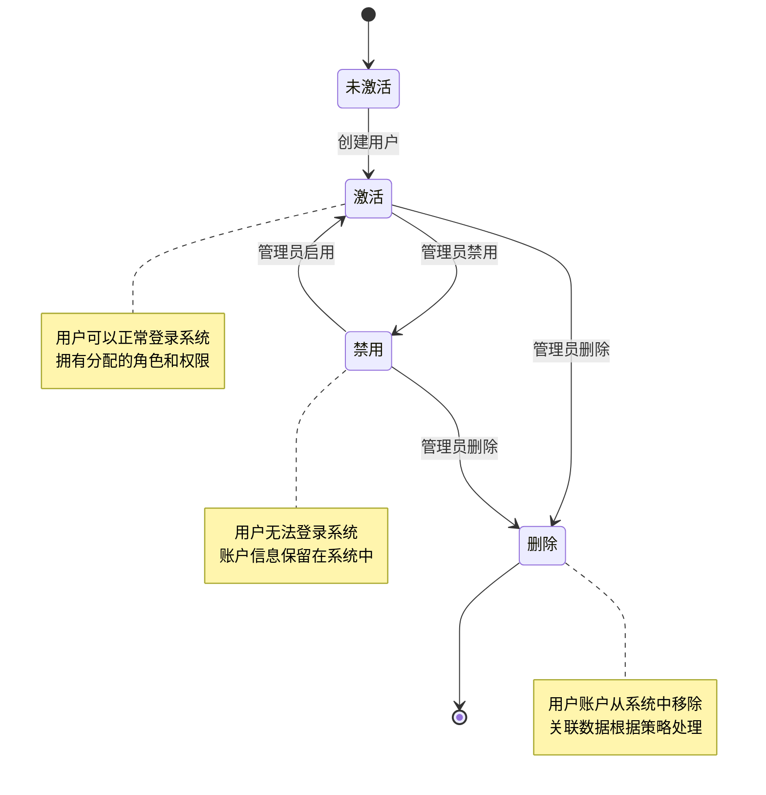
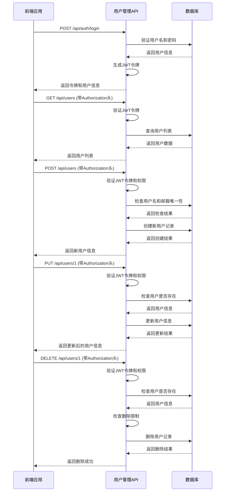

# 用户管理API

<cite>
**本文档引用的文件**   
- [user.ts](file://k.yyup.com/client/src/api/endpoints/user.ts)
- [user.ts](file://k.yyup.com/client/src/api/modules/user.ts)
- [auth.ts](file://k.yyup.com/client/src/api/endpoints/auth.ts)
- [auth.ts](file://k.yyup.com/client/src/api/modules/auth.ts)
- [user.controller.ts](file://k.yyup.com/server/src/controllers/user.controller.ts)
- [users.routes.ts](file://k.yyup.com/server/src/routes/users.routes.ts)
- [auth.controller.ts](file://k.yyup.com/server/src/controllers/auth.controller.ts)
- [auth.routes.ts](file://k.yyup.com/server/src/routes/auth.routes.ts)
</cite>

## 目录
1. [简介](#简介)
2. [用户CRUD操作API](#用户crud操作api)
3. [用户认证API](#用户认证api)
4. [前端调用示例](#前端调用示例)
5. [数据验证规则](#数据验证规则)
6. [错误处理机制](#错误处理机制)
7. [用户状态转换图](#用户状态转换图)
8. [API调用序列图](#api调用序列图)

## 简介
本文档详细描述了用户管理API的实现，涵盖用户创建、读取、更新、删除（CRUD）操作以及用户认证相关功能。文档详细说明了每个端点的HTTP方法、URL路径、请求参数、请求体结构、响应格式以及可能的HTTP状态码。同时提供了使用Axios和fetch的代码示例，展示如何在前端调用这些API。

**Section sources**
- [user.ts](file://k.yyup.com/client/src/api/endpoints/user.ts)
- [user.controller.ts](file://k.yyup.com/server/src/controllers/user.controller.ts)

## 用户CRUD操作API
用户管理API提供了完整的CRUD操作，包括用户创建、读取、更新和删除功能。所有API端点都位于`/api/users`路径下，需要有效的JWT Token进行认证。

### 创建用户
创建新用户账户。

**HTTP方法**: POST  
**URL路径**: `/api/users`

**请求体结构**:
- `username` (string, 必填): 用户名，长度3-50个字符
- `email` (string, 必填): 邮箱地址，必须为有效邮箱格式
- `password` (string, 必填): 密码，长度至少6个字符
- `realName` (string, 可选): 真实姓名
- `phone` (string, 可选): 手机号码
- `role` (string, 必填): 用户角色，可选值: ADMIN, PRINCIPAL, TEACHER, PARENT, STAFF
- `status` (number, 可选): 用户状态，1表示激活，0表示禁用

**成功响应**:
```json
{
  "success": true,
  "data": {
    "id": 1,
    "username": "newuser",
    "email": "newuser@example.com",
    "realName": "张三",
    "phone": "13800138000",
    "role": "TEACHER",
    "status": 1,
    "createdAt": "2024-01-01T00:00:00.000Z",
    "updatedAt": "2024-01-01T00:00:00.000Z"
  },
  "message": "创建用户成功"
}
```

**HTTP状态码**:
- 201 Created: 用户创建成功
- 400 Bad Request: 请求参数错误（缺少必填字段、用户名或邮箱已存在）
- 401 Unauthorized: 未提供有效的认证令牌
- 403 Forbidden: 权限不足
- 500 Internal Server Error: 服务器内部错误

**Section sources**
- [user.ts](file://k.yyup.com/client/src/api/endpoints/user.ts)
- [user.controller.ts](file://k.yyup.com/server/src/controllers/user.controller.ts)
- [users.routes.ts](file://k.yyup.com/server/src/routes/users.routes.ts)

### 获取用户列表
获取系统中所有用户的列表，支持分页和筛选。

**HTTP方法**: GET  
**URL路径**: `/api/users`

**查询参数**:
- `page` (number, 可选): 页码，默认为1
- `pageSize` (number, 可选): 每页数量，默认为10，最大100
- `username` (string, 可选): 按用户名筛选
- `email` (string, 可选): 按邮箱筛选
- `role` (string, 可选): 按角色筛选
- `status` (number, 可选): 按状态筛选（1: 激活, 0: 禁用）
- `department` (string, 可选): 按部门筛选

**成功响应**:
```json
{
  "success": true,
  "data": {
    "items": [
      {
        "id": 1,
        "username": "admin",
        "email": "admin@example.com",
        "realName": "系统管理员",
        "phone": "13800138000",
        "role": "ADMIN",
        "status": 1,
        "createdAt": "2024-01-01T00:00:00.000Z",
        "updatedAt": "2024-01-01T00:00:00.000Z",
        "roles": [
          {
            "id": 1,
            "name": "超级管理员",
            "code": "super_admin"
          }
        ]
      }
    ],
    "total": 1,
    "page": 1,
    "pageSize": 10,
    "totalPages": 1
  },
  "message": "获取用户列表成功"
}
```

**HTTP状态码**:
- 200 OK: 成功获取用户列表
- 401 Unauthorized: 未提供有效的认证令牌
- 500 Internal Server Error: 服务器内部错误

**Section sources**
- [user.ts](file://k.yyup.com/client/src/api/endpoints/user.ts)
- [user.controller.ts](file://k.yyup.com/server/src/controllers/user.controller.ts)
- [users.routes.ts](file://k.yyup.com/server/src/routes/users.routes.ts)

### 获取用户详情
根据用户ID获取用户的详细信息。

**HTTP方法**: GET  
**URL路径**: `/api/users/{id}`

**路径参数**:
- `id` (number, 必填): 用户ID

**成功响应**:
```json
{
  "success": true,
  "data": {
    "id": 1,
    "username": "admin",
    "email": "admin@example.com",
    "realName": "系统管理员",
    "phone": "13800138000",
    "role": "ADMIN",
    "status": 1,
    "createdAt": "2024-01-01T00:00:00.000Z",
    "updatedAt": "2024-01-01T00:00:00.000Z",
    "roles": [
      {
        "id": 1,
        "name": "超级管理员",
        "code": "super_admin"
      }
    ]
  },
  "message": "获取用户详情成功"
}
```

**HTTP状态码**:
- 200 OK: 成功获取用户详情
- 400 Bad Request: 无效的用户ID
- 401 Unauthorized: 未提供有效的认证令牌
- 404 Not Found: 用户不存在
- 500 Internal Server Error: 服务器内部错误

**Section sources**
- [user.ts](file://k.yyup.com/client/src/api/endpoints/user.ts)
- [user.controller.ts](file://k.yyup.com/server/src/controllers/user.controller.ts)
- [users.routes.ts](file://k.yyup.com/server/src/routes/users.routes.ts)

### 更新用户信息
根据用户ID更新用户的基本信息。

**HTTP方法**: PUT  
**URL路径**: `/api/users/{id}`

**路径参数**:
- `id` (number, 必填): 用户ID

**请求体结构**:
- `username` (string, 可选): 用户名
- `email` (string, 可选): 邮箱地址
- `realName` (string, 可选): 真实姓名
- `phone` (string, 可选): 手机号码
- `status` (number, 可选): 用户状态
- `roleIds` (array, 可选): 角色ID数组

**成功响应**:
```json
{
  "success": true,
  "data": {
    "id": 1,
    "username": "updateduser",
    "email": "updated@example.com",
    "realName": "更新姓名",
    "phone": "13800138888",
    "role": "ADMIN",
    "status": 1,
    "createdAt": "2024-01-01T00:00:00.000Z",
    "updatedAt": "2024-01-02T00:00:00.000Z",
    "roles": [
      {
        "id": 1,
        "name": "超级管理员",
        "code": "super_admin"
      }
    ]
  },
  "message": "更新用户成功"
}
```

**HTTP状态码**:
- 200 OK: 用户更新成功
- 400 Bad Request: 无效的用户ID或请求参数错误
- 401 Unauthorized: 未提供有效的认证令牌
- 404 Not Found: 用户不存在
- 500 Internal Server Error: 服务器内部错误

**Section sources**
- [user.ts](file://k.yyup.com/client/src/api/endpoints/user.ts)
- [user.controller.ts](file://k.yyup.com/server/src/controllers/user.controller.ts)
- [users.routes.ts](file://k.yyup.com/server/src/routes/users.routes.ts)

### 删除用户
根据用户ID删除用户账户。

**HTTP方法**: DELETE  
**URL路径**: `/api/users/{id}`

**路径参数**:
- `id` (number, 必填): 用户ID

**成功响应**:
```json
{
  "success": true,
  "data": null,
  "message": "删除用户成功"
}
```

**特殊限制**:
- 不能删除系统管理员账户（用户名为'admin'的用户）
- 不能删除当前操作用户自己的账户
- 如果用户有重要关联数据（如创建的活动、咨询记录等），则不能删除

**HTTP状态码**:
- 200 OK: 用户删除成功
- 400 Bad Request: 无效的用户ID
- 401 Unauthorized: 未提供有效的认证令牌
- 403 Forbidden: 权限不足或违反删除限制
- 500 Internal Server Error: 服务器内部错误

**Section sources**
- [user.ts](file://k.yyup.com/client/src/api/endpoints/user.ts)
- [user.controller.ts](file://k.yyup.com/server/src/controllers/user.controller.ts)
- [users.routes.ts](file://k.yyup.com/server/src/routes/users.routes.ts)

## 用户认证API
用户认证API提供了登录、登出、获取用户信息等功能，所有认证相关的端点都位于`/api/auth`路径下。

### 用户登录
用户使用用户名和密码进行登录。

**HTTP方法**: POST  
**URL路径**: `/api/auth/login`

**请求体结构**:
- `username` (string, 必填): 用户名
- `password` (string, 必填): 密码
- `remember` (boolean, 可选): 是否记住登录状态

**成功响应**:
```json
{
  "success": true,
  "data": {
    "token": "eyJhbGciOiJIUzI1NiIsInR5cCI6IkpXVCJ9...",
    "user": {
      "id": 1,
      "username": "admin",
      "email": "admin@example.com",
      "role": "ADMIN",
      "status": 1
    }
  },
  "message": "登录成功"
}
```

**HTTP状态码**:
- 200 OK: 登录成功
- 400 Bad Request: 缺少必填参数
- 401 Unauthorized: 用户名或密码错误
- 500 Internal Server Error: 服务器内部错误

**Section sources**
- [auth.ts](file://k.yyup.com/client/src/api/endpoints/auth.ts)
- [auth.controller.ts](file://k.yyup.com/server/src/controllers/auth.controller.ts)
- [auth.routes.ts](file://k.yyup.com/server/src/routes/auth.routes.ts)

### 用户登出
用户登出系统。

**HTTP方法**: POST  
**URL路径**: `/api/auth/logout`

**请求头**:
- `Authorization: Bearer <token>`: 有效的JWT Token

**成功响应**:
```json
{
  "success": true,
  "data": null,
  "message": "登出成功"
}
```

**HTTP状态码**:
- 200 OK: 登出成功
- 401 Unauthorized: 未提供有效的认证令牌

**Section sources**
- [auth.ts](file://k.yyup.com/client/src/api/endpoints/auth.ts)
- [auth.controller.ts](file://k.yyup.com/server/src/controllers/auth.controller.ts)
- [auth.routes.ts](file://k.yyup.com/server/src/routes/auth.routes.ts)

### 获取当前用户信息
获取当前登录用户的信息。

**HTTP方法**: GET  
**URL路径**: `/api/auth/me`

**请求头**:
- `Authorization: Bearer <token>`: 有效的JWT Token

**成功响应**:
```json
{
  "success": true,
  "data": {
    "id": 1,
    "username": "admin",
    "email": "admin@example.com",
    "realName": "系统管理员",
    "phone": "13800138000",
    "role": "ADMIN",
    "roles": ["ADMIN"],
    "permissions": ["user:read", "user:write"],
    "status": 1
  },
  "message": "获取用户信息成功"
}
```

**HTTP状态码**:
- 200 OK: 成功获取用户信息
- 401 Unauthorized: 未提供有效的认证令牌

**Section sources**
- [auth.ts](file://k.yyup.com/client/src/api/endpoints/auth.ts)
- [auth.controller.ts](file://k.yyup.com/server/src/controllers/auth.controller.ts)
- [auth.routes.ts](file://k.yyup.com/server/src/routes/auth.routes.ts)

### 修改密码
用户修改自己的密码。

**HTTP方法**: POST  
**URL路径**: `/api/auth/change-password`

**请求头**:
- `Authorization: Bearer <token>`: 有效的JWT Token

**请求体结构**:
- `oldPassword` (string, 必填): 旧密码
- `newPassword` (string, 必填): 新密码
- `confirmPassword` (string, 必填): 确认新密码

**成功响应**:
```json
{
  "success": true,
  "data": {
    "success": true,
    "message": "密码修改成功"
  },
  "message": "密码修改成功"
}
```

**HTTP状态码**:
- 200 OK: 密码修改成功
- 400 Bad Request: 旧密码错误或新密码与确认密码不匹配
- 401 Unauthorized: 未提供有效的认证令牌
- 500 Internal Server Error: 服务器内部错误

**Section sources**
- [auth.ts](file://k.yyup.com/client/src/api/endpoints/auth.ts)
- [auth.controller.ts](file://k.yyup.com/server/src/controllers/auth.controller.ts)

## 前端调用示例
以下示例展示了如何使用Axios和fetch在前端调用用户管理API。

### 使用Axios调用示例
```typescript
import axios from 'axios';
import { LoginParams, LoginResponse } from './types';

// 创建axios实例
const apiClient = axios.create({
  baseURL: '/api',
  timeout: 10000,
  headers: {
    'Content-Type': 'application/json'
  }
});

// 请求拦截器 - 添加认证令牌
apiClient.interceptors.request.use(
  (config) => {
    const token = localStorage.getItem('token');
    if (token) {
      config.headers.Authorization = `Bearer ${token}`;
    }
    return config;
  },
  (error) => {
    return Promise.reject(error);
  }
);

// 响应拦截器 - 处理错误
apiClient.interceptors.response.use(
  (response) => response,
  (error) => {
    if (error.response?.status === 401) {
      // 令牌过期，跳转到登录页
      localStorage.removeItem('token');
      window.location.href = '/login';
    }
    return Promise.reject(error);
  }
);

// 用户登录
export const login = async (data: LoginParams): Promise<LoginResponse> => {
  const response = await apiClient.post('/auth/login', data);
  // 保存令牌到本地存储
  if (response.data.data.token) {
    localStorage.setItem('token', response.data.data.token);
  }
  return response.data;
};

// 获取用户列表
export const getUserList = async (params?: { page: number; size: number; role?: string }) => {
  const response = await apiClient.get('/users', { params });
  return response.data;
};

// 创建用户
export const createUser = async (userData: any) => {
  const response = await apiClient.post('/users', userData);
  return response.data;
};

// 更新用户
export const updateUser = async (id: number, userData: any) => {
  const response = await apiClient.put(`/users/${id}`, userData);
  return response.data;
};

// 删除用户
export const deleteUser = async (id: number) => {
  const response = await apiClient.delete(`/users/${id}`);
  return response.data;
};
```

### 使用fetch调用示例
```typescript
// 封装fetch请求
const request = async <T>(url: string, options: RequestInit = {}): Promise<T> => {
  const defaultOptions = {
    headers: {
      'Content-Type': 'application/json',
    },
  };
  
  const token = localStorage.getItem('token');
  if (token) {
    defaultOptions.headers = {
      ...defaultOptions.headers,
      'Authorization': `Bearer ${token}`,
    };
  }
  
  const mergedOptions = { ...defaultOptions, ...options };
  
  const response = await fetch(`/api${url}`, mergedOptions);
  
  if (!response.ok) {
    if (response.status === 401) {
      // 令牌过期，跳转到登录页
      localStorage.removeItem('token');
      window.location.href = '/login';
      throw new Error('未授权访问');
    }
    const errorData = await response.json();
    throw new Error(errorData.message || '请求失败');
  }
  
  const data = await response.json();
  return data;
};

// 用户登录
export const login = async (username: string, password: string) => {
  const data = await request('/auth/login', {
    method: 'POST',
    body: JSON.stringify({ username, password }),
  });
  
  // 保存令牌到本地存储
  if (data.data.token) {
    localStorage.setItem('token', data.data.token);
  }
  
  return data;
};

// 获取用户列表
export const getUserList = async (params = {}) => {
  const searchParams = new URLSearchParams(params as any);
  return request(`/users?${searchParams.toString()}`);
};

// 创建用户
export const createUser = async (userData: any) => {
  return request('/users', {
    method: 'POST',
    body: JSON.stringify(userData),
  });
};

// 更新用户
export const updateUser = async (id: number, userData: any) => {
  return request(`/users/${id}`, {
    method: 'PUT',
    body: JSON.stringify(userData),
  });
};

// 删除用户
export const deleteUser = async (id: number) => {
  return request(`/users/${id}`, {
    method: 'DELETE',
  });
};
```

**Section sources**
- [user.ts](file://k.yyup.com/client/src/api/modules/user.ts)
- [auth.ts](file://k.yyup.com/client/src/api/modules/auth.ts)

## 数据验证规则
用户管理API实现了严格的数据验证规则，确保数据的完整性和安全性。

### 用户名验证
- 长度要求：3-50个字符
- 字符限制：只能包含字母、数字、下划线和连字符
- 唯一性：系统中不能有重复的用户名
- 特殊限制：不能使用'admin'作为普通用户的用户名

### 邮箱验证
- 格式要求：必须符合标准邮箱格式（包含@符号和有效域名）
- 唯一性：系统中不能有重复的邮箱地址
- 域名检查：建议使用有效的域名

### 密码验证
- 长度要求：至少6个字符
- 复杂度要求：建议包含大小写字母、数字和特殊字符
- 安全存储：密码在数据库中以哈希值存储，使用bcrypt算法加密
- 旧密码检查：修改密码时需要验证旧密码的正确性

### 手机号码验证
- 格式要求：符合中国手机号码格式（1开头，11位数字）
- 唯一性：建议系统中不能有重复的手机号码

### 角色验证
- 有效值：ADMIN, PRINCIPAL, TEACHER, PARENT, STAFF
- 权限检查：用户只能被分配到其权限范围内的角色
- 多角色支持：一个用户可以拥有多个角色

### 状态验证
- 有效值：1（激活）、0（禁用）
- 状态转换：禁用的用户无法登录系统

**Section sources**
- [user.controller.ts](file://k.yyup.com/server/src/controllers/user.controller.ts)
- [users.routes.ts](file://k.yyup.com/server/src/routes/users.routes.ts)

## 错误处理机制
用户管理API实现了完善的错误处理机制，提供清晰的错误信息和适当的HTTP状态码。

### 错误响应格式
所有错误响应都遵循统一的格式：
```json
{
  "success": false,
  "message": "错误描述",
  "code": "错误代码"
}
```

### 常见错误代码
- `USER_USERNAME_EXISTS`: 用户名已存在
- `USER_EMAIL_EXISTS`: 邮箱已存在
- `USER_NOT_FOUND`: 用户不存在
- `USER_INVALID_ID`: 无效的用户ID
- `USER_CREATE_ERROR`: 创建用户失败
- `USER_UPDATE_ERROR`: 更新用户失败
- `USER_DELETE_ERROR`: 删除用户失败
- `UNAUTHORIZED`: 未授权访问
- `FORBIDDEN`: 权限不足
- `INTERNAL_ERROR`: 服务器内部错误

### 错误处理策略
- **客户端错误**（4xx状态码）：返回具体的错误信息，帮助前端进行错误处理和用户提示
- **服务器错误**（5xx状态码）：记录详细的错误日志，但只向客户端返回通用的错误信息，避免暴露系统细节
- **认证错误**：返回401状态码，并清除客户端的认证令牌
- **权限错误**：返回403状态码，提示用户权限不足
- **事务处理**：在创建、更新、删除操作中使用数据库事务，确保数据一致性，操作失败时自动回滚

### 前端错误处理
前端应实现统一的错误处理机制：
- 拦截所有API响应，检查`success`字段
- 根据错误代码显示相应的用户提示
- 对于认证相关的错误，自动跳转到登录页面
- 记录重要的错误日志，便于问题排查

**Section sources**
- [user.controller.ts](file://k.yyup.com/server/src/controllers/user.controller.ts)
- [auth.controller.ts](file://k.yyup.com/server/src/controllers/auth.controller.ts)
- [apiResponse.ts](file://k.yyup.com/server/src/utils/apiResponse.ts)

## 用户状态转换图


**Diagram sources**
- [user.controller.ts](file://k.yyup.com/server/src/controllers/user.controller.ts)
- [users.routes.ts](file://k.yyup.com/server/src/routes/users.routes.ts)

## API调用序列图


**Diagram sources**
- [auth.controller.ts](file://k.yyup.com/server/src/controllers/auth.controller.ts)
- [user.controller.ts](file://k.yyup.com/server/src/controllers/user.controller.ts)
- [auth.routes.ts](file://k.yyup.com/server/src/routes/auth.routes.ts)
- [users.routes.ts](file://k.yyup.com/server/src/routes/users.routes.ts)