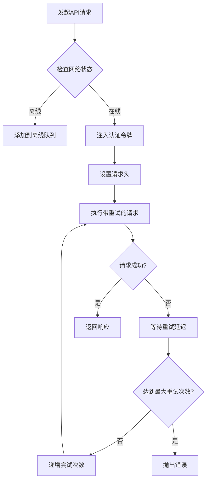
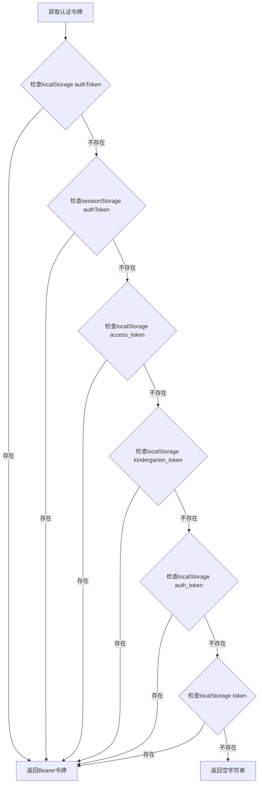
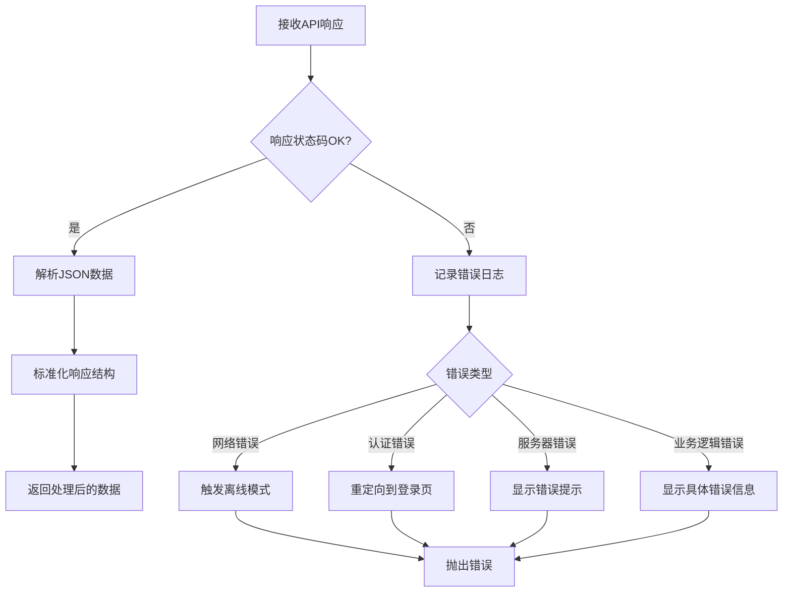
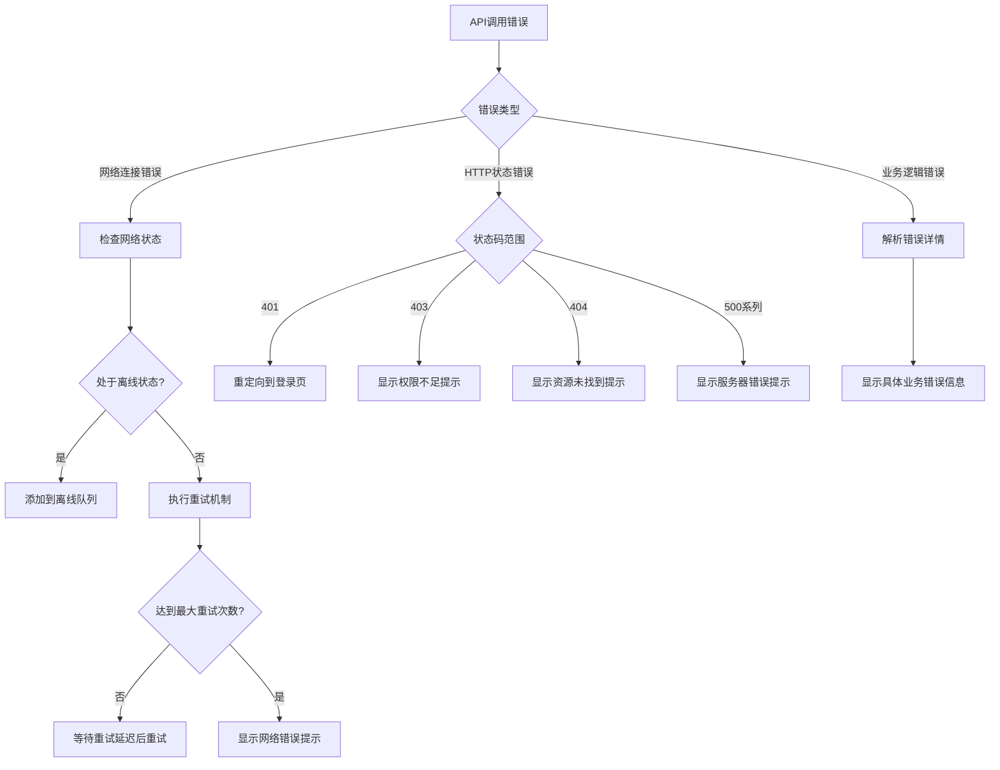
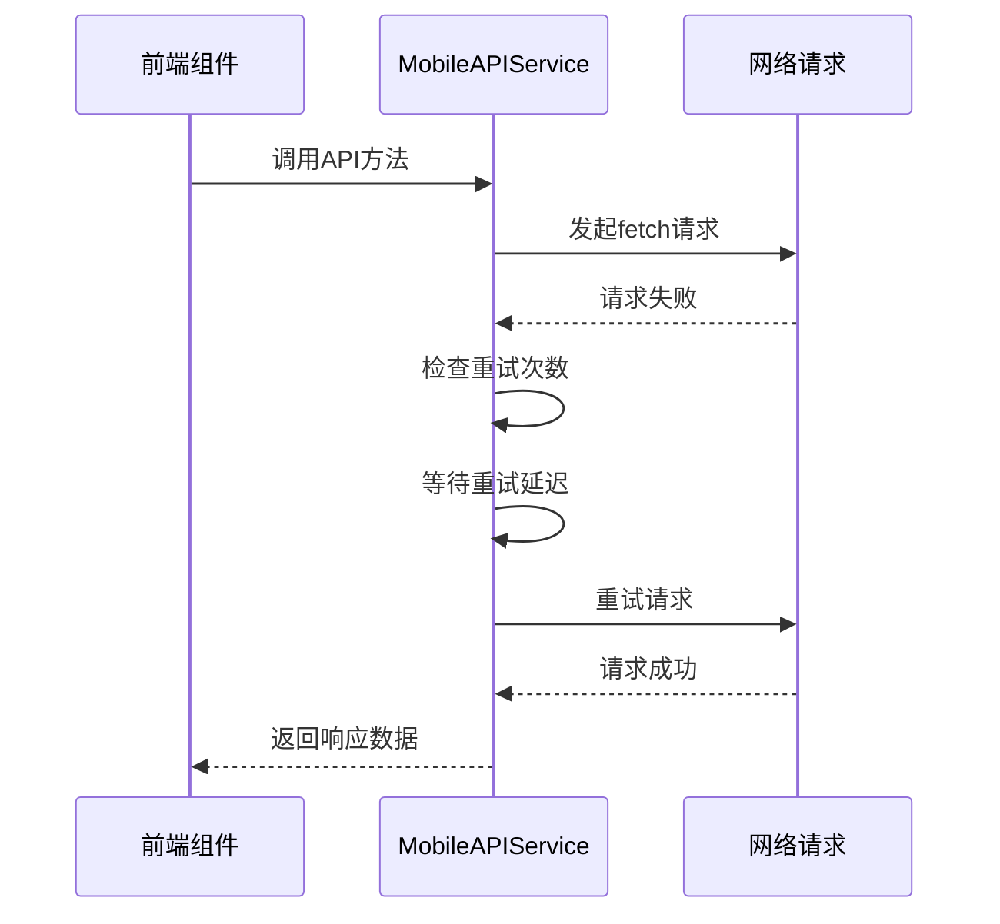
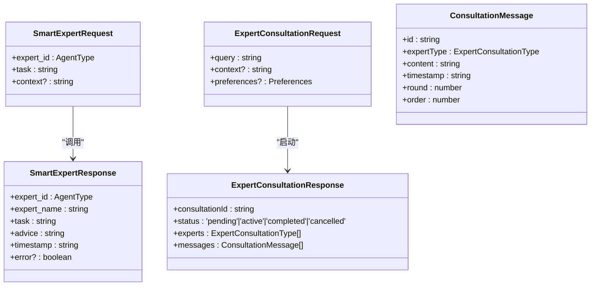
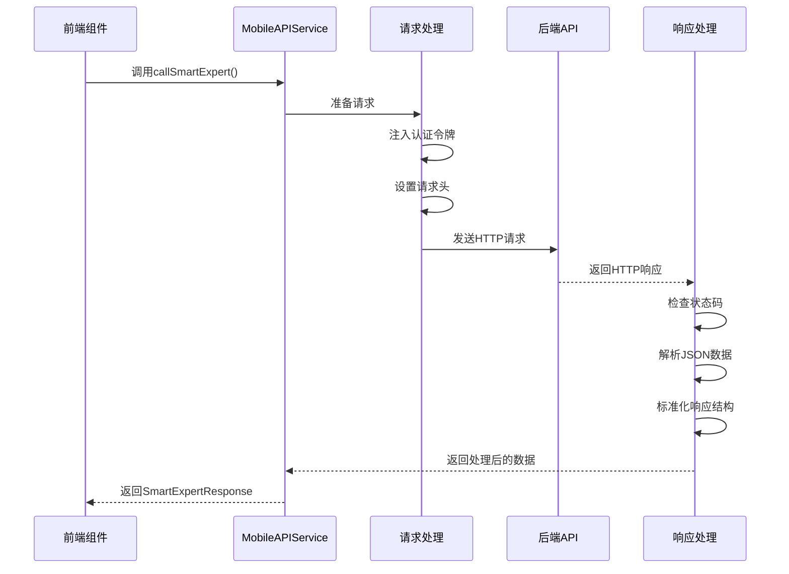

# API客户端

<cite>
**本文档引用的文件**   
- [mobile-api.service.ts](file://k.yyup.com/client/aimobile/services/mobile-api.service.ts)
- [mobile-api.service.ts](file://unified-tenant-system/client/aimobile/services/mobile-api.service.ts)
- [mobile-agents.ts](file://k.yyup.com/client/aimobile/types/mobile-agents.ts)
- [mobile-agents.ts](file://unified-tenant-system/client/aimobile/types/mobile-agents.ts)
- [axios-patch.ts](file://k.yyup.com/client/src/axios-patch.ts)
- [axios-patch.ts](file://unified-tenant-system/client/src/axios-patch.ts)
</cite>

## 目录
1. [API客户端概述](#api客户端概述)
2. [API接口封装机制](#api接口封装机制)
3. [请求与响应拦截器](#请求与响应拦截器)
4. [错误处理策略](#错误处理策略)
5. [类型安全实现](#类型安全实现)
6. [API调用时序图](#api调用时序图)
7. [高级功能指南](#高级功能指南)

## API客户端概述

本项目API客户端为移动端应用提供了统一的后端交互机制，通过`mobile-api.service.ts`文件实现了对Smart Expert和Expert Consultation两大核心系统的API封装。该客户端基于原生fetch API构建，同时通过`axios-patch.ts`提供了axios兼容层，确保了API调用的一致性和可维护性。

API客户端实现了完整的移动端优化特性，包括网络状态检测、离线请求队列、请求重试机制和网络质量评估。这些功能确保了在移动网络环境下应用的稳定性和用户体验。

**本节来源**
- [mobile-api.service.ts](file://k.yyup.com/client/aimobile/services/mobile-api.service.ts#L1-L389)
- [axios-patch.ts](file://k.yyup.com/client/src/axios-patch.ts#L1-L97)

## API接口封装机制

### API服务类结构

`MobileAPIService`类提供了对后端API的封装，采用单例模式导出`mobileAPIService`实例，确保全局API调用的一致性。该服务支持Smart Expert和Expert Consultation两大系统，通过不同的方法封装了相应的API端点。

```mermaid
classDiagram
class MobileAPIService {
+baseURL : string
+timeout : number
+retryAttempts : number
+retryDelay : number
+callSmartExpert(request) : Promise~SmartExpertResponse~
+getSmartExpertList(domain?) : Promise~any~
+startExpertConsultation(request) : Promise~ExpertConsultationResponse~
+getNextConsultationSpeech(consultationId) : Promise~any~
+getConsultationSummary(consultationId) : Promise~any~
+smartExpertChat(messages) : Promise~any~
-fetchWithRetry(url, options, attempt) : Promise~Response~
-getAuthToken() : string
-delay(ms) : Promise~void~
+isOnline() : boolean
+getNetworkQuality() : 'excellent'|'good'|'poor'|'offline'
-compressRequestData(data) : any
-addToOfflineQueue(url, options) : Promise~Response~
+processOfflineQueue() : Promise~void~
}
class MobileAPIService : +static mobileAPIService : MobileAPIService
class MobileAPIService : +static default : MobileAPIService
```

**图示来源**
- [mobile-api.service.ts](file://k.yyup.com/client/aimobile/services/mobile-api.service.ts#L25-L388)

### 模块化组织

API服务按业务领域进行了模块化组织，主要分为智能专家系统和专家咨询系统两大模块。每个模块提供特定的API方法，便于开发者根据业务需求进行调用。

- **智能专家系统模块**：提供`callSmartExpert`、`getSmartExpertList`等方法，用于调用特定专家的智能服务
- **专家咨询系统模块**：提供`startExpertConsultation`、`getNextConsultationSpeech`等方法，用于管理多专家会话流程

这种模块化设计使得API调用逻辑清晰，易于维护和扩展。

**本节来源**
- [mobile-api.service.ts](file://k.yyup.com/client/aimobile/services/mobile-api.service.ts#L41-L237)

## 请求与响应拦截器

### 请求处理机制

虽然项目没有使用标准的axios拦截器，但通过`fetchWithRetry`方法实现了类似的请求处理功能。该机制包含了认证令牌注入、请求重试和超时控制等关键功能。



**图示来源**
- [mobile-api.service.ts](file://k.yyup.com/client/aimobile/services/mobile-api.service.ts#L242-L263)

### 认证令牌注入

客户端通过`getAuthToken`方法实现了认证令牌的自动注入。该方法兼容多种存储方式，能够从localStorage、sessionStorage等不同位置获取认证令牌，确保了认证机制的灵活性。



**图示来源**
- [mobile-api.service.ts](file://k.yyup.com/client/aimobile/services/mobile-api.service.ts#L269-L279)

### 响应处理机制

响应拦截器的设计涵盖了成功响应的数据提取、错误响应的统一处理和认证过期的重定向等场景。通过统一的错误处理机制，确保了API调用的健壮性。



**图示来源**
- [mobile-api.service.ts](file://k.yyup.com/client/aimobile/services/mobile-api.service.ts#L64-L93)

## 错误处理策略

### 分类错误处理

API客户端实现了对网络错误、服务器错误和业务逻辑错误的分类处理。每种错误类型都有相应的处理策略，确保了用户体验的一致性。



**图示来源**
- [mobile-api.service.ts](file://k.yyup.com/client/aimobile/services/mobile-api.service.ts#L90-L93)

### 重试机制

客户端实现了智能重试机制，通过`fetchWithRetry`方法在请求失败时自动进行重试。重试次数和延迟时间可通过配置进行调整，适应不同的网络环境。



**图示来源**
- [mobile-api.service.ts](file://k.yyup.com/client/aimobile/services/mobile-api.service.ts#L242-L263)

## 类型安全实现

### TypeScript接口定义

API客户端通过TypeScript接口实现了请求参数和响应数据结构的类型安全。`mobile-agents.ts`文件中定义了完整的类型系统，确保了前后端数据交互的类型一致性。



**图示来源**
- [mobile-agents.ts](file://k.yyup.com/client/aimobile/types/mobile-agents.ts#L188-L230)

### 类型系统优势

类型安全实现带来了以下优势：
- 编译时错误检测，减少运行时错误
- IDE智能提示，提高开发效率
- 文档化接口结构，便于团队协作
- 前后端契约保证，降低集成风险

**本节来源**
- [mobile-agents.ts](file://k.yyup.com/client/aimobile/types/mobile-agents.ts#L188-L230)

## API调用时序图

### 完整API调用流程

从组件发起请求到获取响应的完整流程如下：



**图示来源**
- [mobile-api.service.ts](file://k.yyup.com/client/aimobile/services/mobile-api.service.ts#L41-L89)

## 高级功能指南

### 添加新的API端点

要添加新的API端点，需要在`MobileAPIService`类中添加相应的方法，并定义对应的请求和响应类型：

1. 在`mobile-agents.ts`中定义新的请求和响应接口
2. 在`mobile-api.service.ts`中添加新的方法
3. 确保新方法遵循现有的错误处理和日志记录模式

### 文件上传处理

虽然当前API客户端主要处理JSON数据，但可以通过扩展`fetchWithRetry`方法来支持文件上传：

```typescript
async uploadFile(url: string, file: File): Promise<any> {
  const formData = new FormData()
  formData.append('file', file)
  
  const headers: Record<string, string> = {}
  const auth = this.getAuthToken()
  if (auth) headers['Authorization'] = auth
  
  const response = await this.fetchWithRetry(url, {
    method: 'POST',
    headers,
    body: formData
  })
  
  if (!response.ok) {
    throw new Error(`文件上传失败: ${response.status}`)
  }
  
  return await response.json()
}
```

### 请求取消功能

客户端可以通过AbortController实现请求取消功能：

```typescript
async callSmartExpertWithCancel(request: SmartExpertRequest, abortSignal?: AbortSignal): Promise<SmartExpertResponse> {
  const url = `${this.baseURL}/ai/expert/smart-chat`
  
  const controller = new AbortController()
  if (abortSignal) {
    abortSignal.addEventListener('abort', () => controller.abort())
  }
  
  try {
    const response = await fetch(url, {
      method: 'POST',
      headers: {
        'Content-Type': 'application/json',
        'Authorization': this.getAuthToken()
      },
      body: JSON.stringify({ messages: [{ role: 'user', content: request.task }] }),
      signal: controller.signal
    })
    
    // 处理响应...
  } catch (error) {
    if (error.name === 'AbortError') {
      console.log('请求已被取消')
    }
    throw error
  }
}
```

**本节来源**
- [mobile-api.service.ts](file://k.yyup.com/client/aimobile/services/mobile-api.service.ts#L242-L263)
- [mobile-api.service.ts](file://k.yyup.com/client/aimobile/services/mobile-api.service.ts#L270-L280)