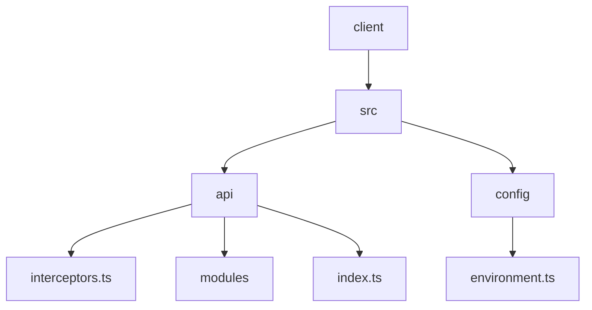
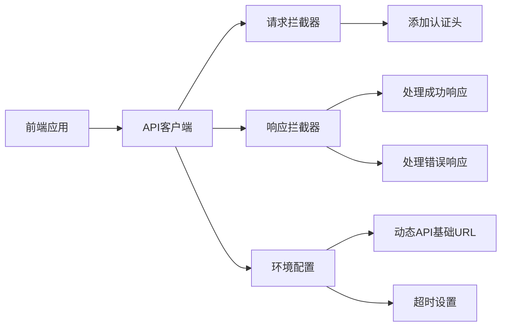
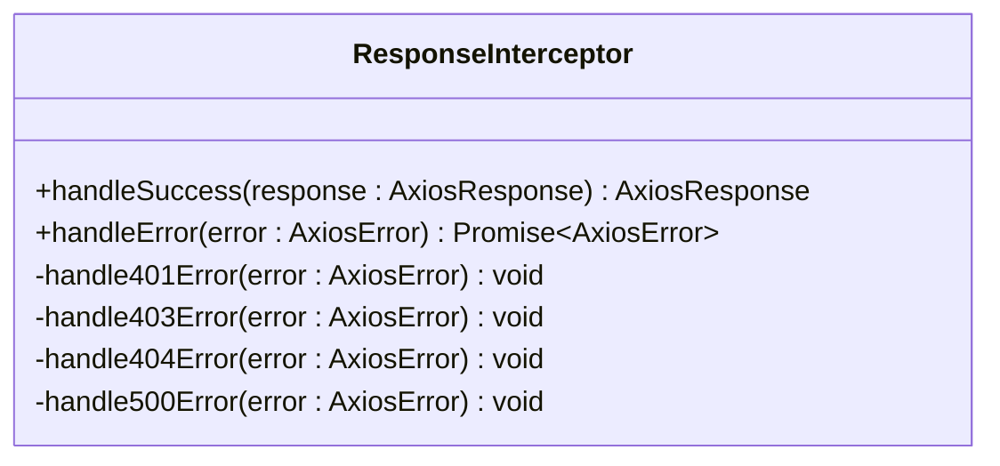
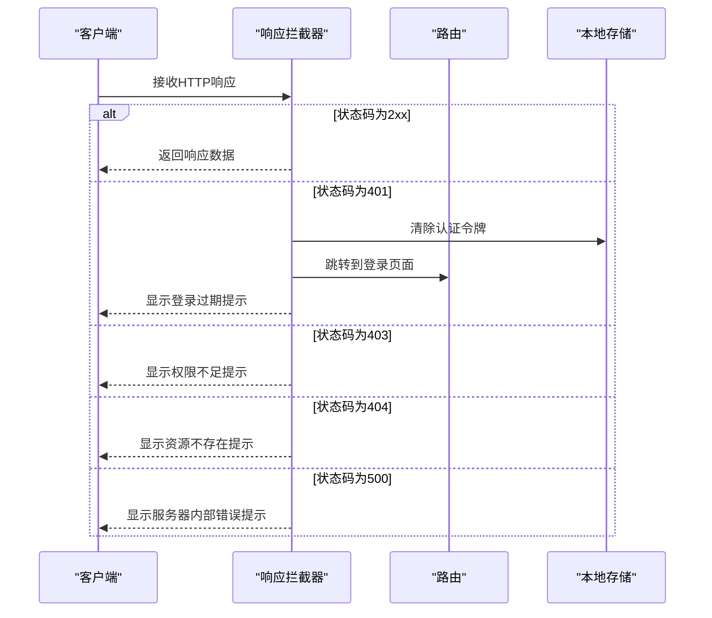
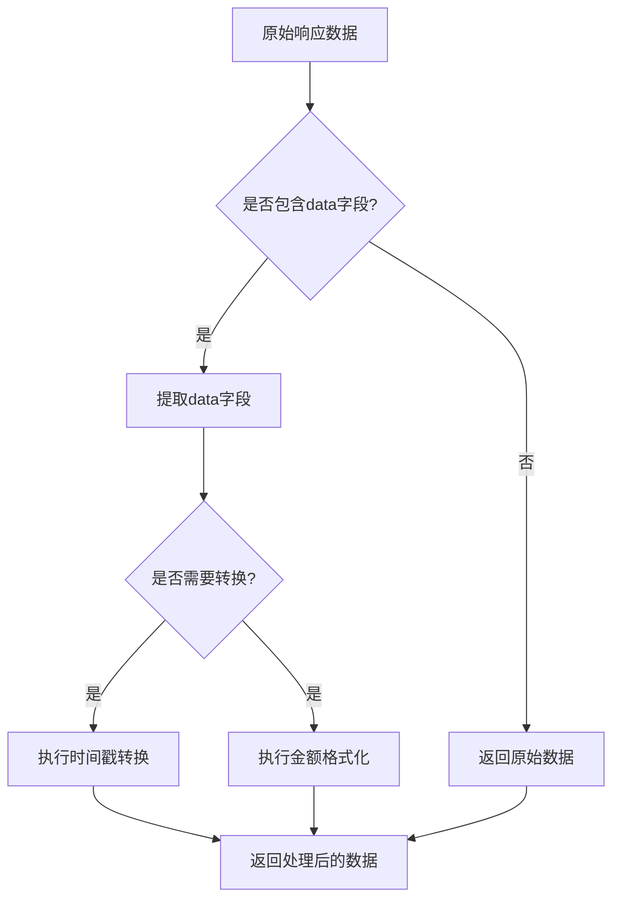
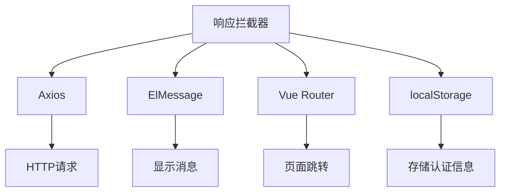

# 响应拦截器

<cite>
**本文档引用的文件**  
- [interceptors.ts](file://k.yyup.com/client/src/api/interceptors.ts)
- [environment.ts](file://k.yyup.com/client/src/config/environment.ts)
- [index.ts](file://k.yyup.com/client/src/api/index.ts)
- [interceptors.test.ts](file://k.yyup.com/client/tests/unit/api/interceptors.test.ts)
</cite>

## 目录
1. [简介](#简介)
2. [项目结构](#项目结构)
3. [核心组件](#核心组件)
4. [架构概述](#架构概述)
5. [详细组件分析](#详细组件分析)
6. [依赖分析](#依赖分析)
7. [性能考虑](#性能考虑)
8. [故障排除指南](#故障排除指南)
9. [结论](#结论)

## 简介
本文档深入解析了API客户端中响应拦截器的设计与实现。重点说明了如何统一处理HTTP成功响应（状态码2xx），自动提取响应体中的data字段，简化前端数据获取流程。详细描述了错误响应的分类处理策略，包括401未授权、403权限不足、404资源不存在和500服务器内部错误的处理方式。同时阐述了响应数据的预处理机制和响应缓存机制的实现可能性。

## 项目结构
项目结构清晰地组织了API相关的代码，主要集中在`client/src/api`目录下。该目录包含了拦截器、环境配置和API模块的定义。

**图示来源**
- [interceptors.ts](file://k.yyup.com/client/src/api/interceptors.ts)
- [environment.ts](file://k.yyup.com/client/src/config/environment.ts)
- [index.ts](file://k.yyup.com/client/src/api/index.ts)

**本节来源**
- [interceptors.ts](file://k.yyup.com/client/src/api/interceptors.ts)
- [environment.ts](file://k.yyup.com/client/src/config/environment.ts)
- [index.ts](file://k.yyup.com/client/src/api/index.ts)

## 核心组件
核心组件包括响应拦截器、环境配置和API配置。响应拦截器负责处理HTTP响应，环境配置提供动态的API基础URL和超时设置，API配置定义了通用的响应格式和错误处理。

**本节来源**
- [interceptors.ts](file://k.yyup.com/client/src/api/interceptors.ts)
- [environment.ts](file://k.yyup.com/client/src/config/environment.ts)
- [index.ts](file://k.yyup.com/client/src/api/index.ts)

## 架构概述
系统架构通过Axios实例和拦截器机制实现了统一的API请求和响应处理。环境配置系统支持多环境自动适配，确保开发、测试和生产环境的无缝切换。

**图示来源**
- [interceptors.ts](file://k.yyup.com/client/src/api/interceptors.ts)
- [environment.ts](file://k.yyup.com/client/src/config/environment.ts)

## 详细组件分析
### 响应拦截器分析
响应拦截器是API客户端的核心部分，负责处理所有HTTP响应。它根据不同的HTTP状态码执行相应的处理逻辑。

#### 响应拦截器实现

**图示来源**
- [interceptors.ts](file://k.yyup.com/client/src/api/interceptors.ts)

#### 错误处理流程

**图示来源**
- [interceptors.ts](file://k.yyup.com/client/src/api/interceptors.ts)

#### 响应数据预处理

**图示来源**
- [interceptors.ts](file://k.yyup.com/client/src/api/interceptors.ts)

**本节来源**
- [interceptors.ts](file://k.yyup.com/client/src/api/interceptors.ts)
- [interceptors.test.ts](file://k.yyup.com/client/tests/unit/api/interceptors.test.ts)

## 依赖分析
响应拦截器依赖于多个核心模块，包括Axios、Element Plus的ElMessage组件和Vue Router。

**图示来源**
- [interceptors.ts](file://k.yyup.com/client/src/api/interceptors.ts)

**本节来源**
- [interceptors.ts](file://k.yyup.com/client/src/api/interceptors.ts)

## 性能考虑
响应拦截器的设计考虑了性能优化，通过避免重复跳转和合理使用缓存来提升用户体验。

**本节来源**
- [interceptors.ts](file://k.yyup.com/client/src/api/interceptors.ts)

## 故障排除指南
### 常见问题
- **401错误重复跳转**: 通过`isRedirectingToLogin`标志防止重复跳转。
- **认证头未正确设置**: 确保localStorage中存在正确的token。
- **环境配置未生效**: 检查环境变量设置是否正确。

**本节来源**
- [interceptors.ts](file://k.yyup.com/client/src/api/interceptors.ts)
- [interceptors.test.ts](file://k.yyup.com/client/tests/unit/api/interceptors.test.ts)

## 结论
响应拦截器的设计和实现有效地统一了API响应处理，简化了前端开发流程。通过分类处理不同类型的错误响应，提升了用户体验。环境配置系统的引入使得应用能够灵活适应不同的部署环境。