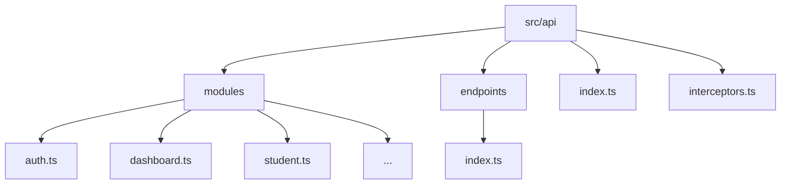
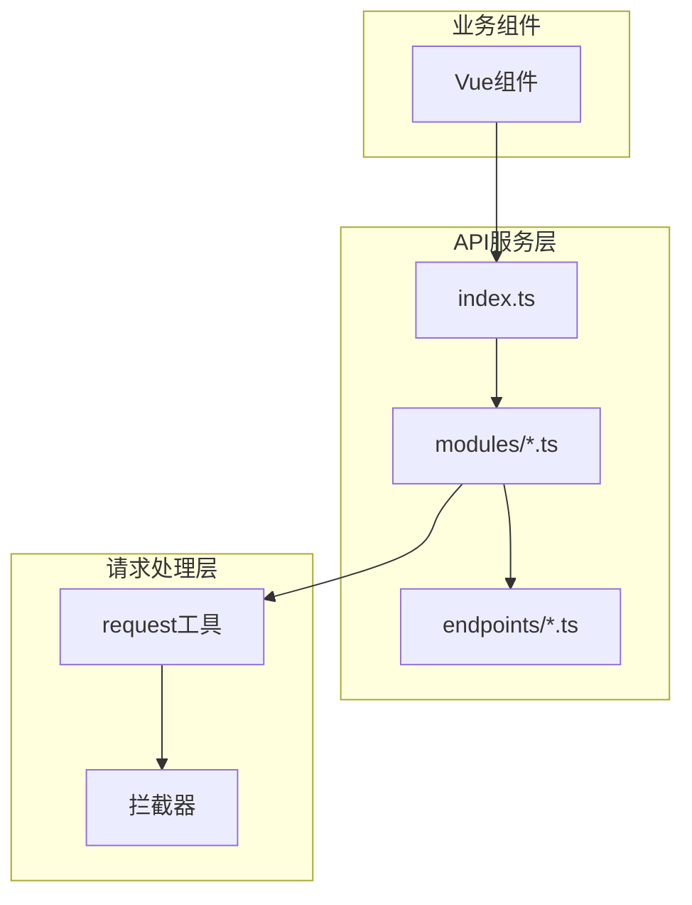
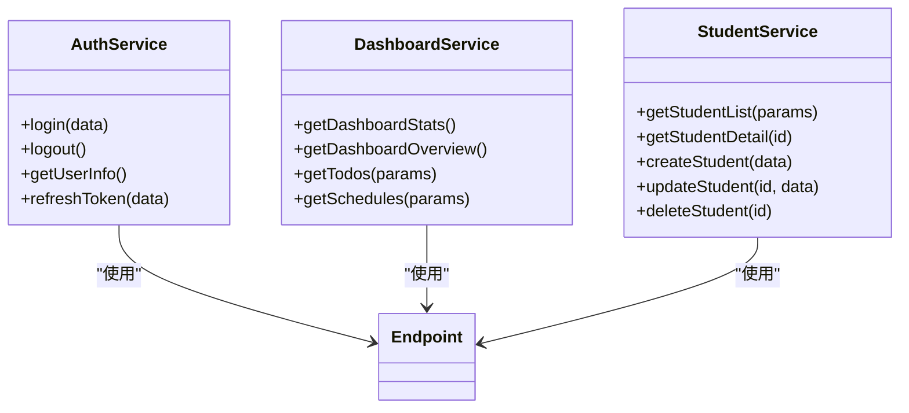
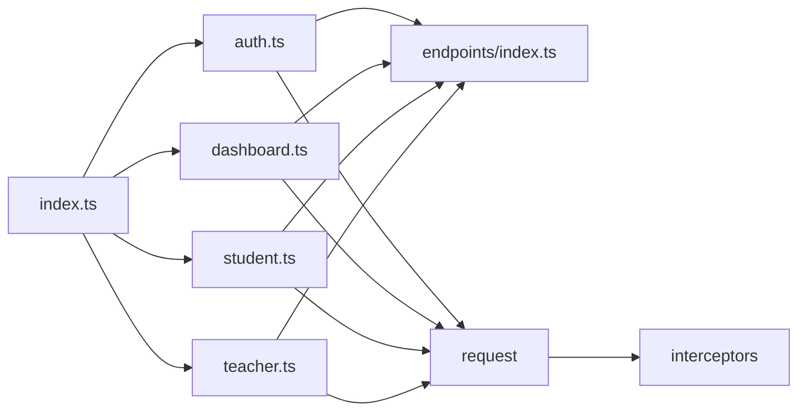

# 模块化组织

<cite>
**本文档引用的文件**
- [auth.ts](file://k.yyup.com/client/src/api/modules/auth.ts)
- [dashboard.ts](file://k.yyup.com/client/src/api/modules/dashboard.ts)
- [student.ts](file://k.yyup.com/client/src/api/modules/student.ts)
- [index.ts](file://k.yyup.com/client/src/api/index.ts)
- [endpoints/index.ts](file://k.yyup.com/client/src/api/endpoints/index.ts)
</cite>

## 目录
1. [简介](#简介)
2. [项目结构](#项目结构)
3. [核心组件](#核心组件)
4. [架构概述](#架构概述)
5. [详细组件分析](#详细组件分析)
6. [依赖分析](#依赖分析)
7. [性能考虑](#性能考虑)
8. [故障排除指南](#故障排除指南)
9. [结论](#结论)

## 简介
本文档详细说明了幼儿园管理系统前端客户端中API服务的模块化组织架构。系统按照业务领域划分不同的API服务文件，每个文件负责特定功能模块的接口封装，并通过统一的入口文件进行聚合导出，为其他组件提供一致的导入方式。

## 项目结构

项目中的API客户端代码位于 `k.yyup.com/client/src/api/` 目录下，采用清晰的模块化结构：

```
src/api/
├── modules/           # 各业务领域的API服务文件
├── endpoints/         # API端点常量定义
├── index.ts           # 统一导出入口
└── interceptors.ts    # 请求拦截器配置
```

这种结构将API相关的逻辑按功能拆分，便于维护和扩展。



**Diagram sources**
- [src/api](file://k.yyup.com/client/src/api)

**Section sources**
- [src/api](file://k.yyup.com/client/src/api)

## 核心组件

API客户端的核心组件包括：
- **模块化服务文件**：按业务领域划分，如认证、仪表盘、学生管理等
- **端点常量管理**：集中定义所有API路径，避免硬编码
- **统一导出机制**：通过index.ts提供单一导入入口
- **请求封装层**：统一处理HTTP请求、响应和错误

这些组件共同构成了可维护、可测试且易于使用的API客户端架构。

**Section sources**
- [auth.ts](file://k.yyup.com/client/src/api/modules/auth.ts)
- [dashboard.ts](file://k.yyup.com/client/src/api/modules/dashboard.ts)
- [student.ts](file://k.yyup.com/client/src/api/modules/student.ts)

## 架构概述

整个API客户端采用分层架构设计，各层职责分明：



**Diagram sources**
- [index.ts](file://k.yyup.com/client/src/api/index.ts)
- [modules](file://k.yyup.com/client/src/api/modules)
- [endpoints](file://k.yyup.com/client/src/api/endpoints)

## 详细组件分析

### 业务领域划分

API服务按照业务领域进行模块化组织，每个服务文件对应一个功能模块：

- `auth.ts`：认证相关接口
- `dashboard.ts`：仪表盘数据接口
- `student.ts`：学生管理接口
- `teacher.ts`：教师管理接口
- `class.ts`：班级管理接口
- `enrollment.ts`：招生管理接口

这种划分方式使得代码结构清晰，便于团队协作开发。



**Diagram sources**
- [auth.ts](file://k.yyup.com/client/src/api/modules/auth.ts)
- [dashboard.ts](file://k.yyup.com/client/src/api/modules/dashboard.ts)
- [student.ts](file://k.yyup.com/client/src/api/modules/student.ts)

### 聚合导出机制

`index.ts` 文件作为API服务的统一入口，采用聚合导出模式：

```typescript
// 认证相关API
export * from './modules/auth'

// 仪表盘API
export * from './modules/dashboard'

// 学生管理API  
export * from './modules/student'

// 教师管理API
export * from './modules/teacher'

// 使用命名空间避免冲突
export * as ActivityModule from './modules/activity'
```

这种方式允许其他组件通过单一入口导入所需的服务，简化了导入语句。

**Section sources**
- [index.ts](file://k.yyup.com/client/src/api/index.ts)

### 服务类设计模式

API服务采用const对象的方式组织相关方法，每个服务文件导出一个包含多个API方法的对象：

```typescript
export const authApi = {
  login(data: LoginRequest): Promise<ApiResponse<LoginResponse>> {
    return post(AUTH_ENDPOINTS.LOGIN, data);
  },
  
  logout(): Promise<ApiResponse> {
    return post(AUTH_ENDPOINTS.LOGOUT);
  },
  
  getUserInfo(): Promise<ApiResponse<LoginResponse['user']>> {
    return get(AUTH_ENDPOINTS.USER_INFO);
  }
};
```

同时提供兼容性导出，方便直接使用：

```typescript
export const login = authApi.login;
export const logout = authApi.logout;
export const getUserInfo = authApi.getUserInfo;
```

**Section sources**
- [auth.ts](file://k.yyup.com/client/src/api/modules/auth.ts)

### 命名规范

API方法遵循动词+名词的命名规范，提高代码可读性：

- `getUserInfo`：获取用户信息（GET）
- `createStudent`：创建学生（POST）
- `updateStudent`：更新学生（PUT/PATCH）
- `deleteStudent`：删除学生（DELETE）
- `getDashboardStats`：获取仪表盘统计

这种命名方式直观地表达了方法的功能和HTTP动词对应关系。

**Section sources**
- [auth.ts](file://k.yyup.com/client/src/api/modules/auth.ts)
- [dashboard.ts](file://k.yyup.com/client/src/api/modules/dashboard.ts)
- [student.ts](file://k.yyup.com/client/src/api/modules/student.ts)

### 在Vue组件中的使用

在Vue组件中可以通过直接导入的方式使用API服务：

```typescript
import { getUserInfo } from '@/api';
import { getStudentList, createStudent } from '@/api/modules/student';

// 在setup函数中使用
const { data: user } = await getUserInfo();
const { data: students } = await getStudentList({ page: 1, pageSize: 10 });
```

对于复杂场景，也可以通过组合式API封装：

```typescript
import { ref } from 'vue';
import { getStudentList } from '@/api/modules/student';

export function useStudentManagement() {
  const students = ref([]);
  const loading = ref(false);
  
  const loadStudents = async (params) => {
    loading.value = true;
    try {
      const response = await getStudentList(params);
      students.value = response.data.items;
    } finally {
      loading.value = false;
    }
  };
  
  return {
    students,
    loading,
    loadStudents
  };
}
```

**Section sources**
- [auth.ts](file://k.yyup.com/client/src/api/modules/auth.ts)
- [student.ts](file://k.yyup.com/client/src/api/modules/student.ts)

### 服务间依赖处理

认证服务作为基础服务被其他所有服务依赖，通过请求拦截器自动处理认证相关逻辑：

```typescript
// 在请求拦截器中自动添加token
request.interceptors.request.use(config => {
  const token = getAuthToken();
  if (token) {
    config.headers.Authorization = `Bearer ${token}`;
  }
  return config;
});
```

当token过期时，拦截器会自动处理刷新逻辑，确保其他服务无需关心认证状态。

**Section sources**
- [auth.ts](file://k.yyup.com/client/src/api/modules/auth.ts)
- [interceptors.ts](file://k.yyup.com/client/src/api/interceptors.ts)

### 可测试性设计

API服务通过依赖注入和模块化设计支持单元测试中的mock：

```typescript
// 可以轻松mock整个模块
jest.mock('@/api/modules/auth', () => ({
  login: jest.fn().mockResolvedValue({ success: true }),
  getUserInfo: jest.fn().mockResolvedValue({ data: mockUser })
}));

// 测试组件时无需真实API调用
test('用户登录后显示用户名', async () => {
  render(LoginComponent);
  await userEvent.click(screen.getByText('登录'));
  expect(screen.getByText(mockUser.username)).toBeInTheDocument();
});
```

此外，API方法返回Promise，便于使用async/await进行测试断言。

**Section sources**
- [auth.ts](file://k.yyup.com/client/src/api/modules/auth.ts)
- [test files](file://k.yyup.com/client/src/api)

## 依赖分析

API客户端各组件之间的依赖关系清晰明确：



所有服务模块都依赖于端点常量和请求工具，但彼此之间没有直接依赖，降低了耦合度。

**Diagram sources**
- [index.ts](file://k.yyup.com/client/src/api/index.ts)
- [modules](file://k.yyup.com/client/src/api/modules)
- [endpoints](file://k.yyup.com/client/src/api/endpoints)

## 性能考虑

API客户端在性能方面做了以下优化：
- 使用统一的请求实例，复用HTTP连接
- 配置合理的超时时间（10秒）和重试机制（3次）
- 在响应处理中集成数据转换，减少组件层的计算负担
- 按需导入，避免不必要的代码加载

这些优化确保了API调用的高效性和可靠性。

## 故障排除指南

常见问题及解决方案：

1. **API调用失败**
   - 检查网络连接
   - 查看浏览器控制台的错误信息
   - 确认API端点是否正确

2. **认证问题**
   - 检查token是否过期
   - 确认登录状态
   - 查看认证拦截器日志

3. **类型错误**
   - 确认API响应格式与类型定义匹配
   - 检查数据转换逻辑

4. **导入问题**
   - 确认路径是否正确
   - 检查index.ts是否正确导出

**Section sources**
- [auth.ts](file://k.yyup.com/client/src/api/modules/auth.ts)
- [interceptors.ts](file://k.yyup.com/client/src/api/interceptors.ts)

## 结论

该API客户端采用模块化组织架构，按业务领域划分服务文件，通过index.ts提供统一导出入口。服务采用const对象组织方法，遵循动词+名词的命名规范。通过依赖注入和模块化设计，实现了良好的可测试性。整体架构清晰、易于维护，为前端应用提供了稳定可靠的API访问能力。