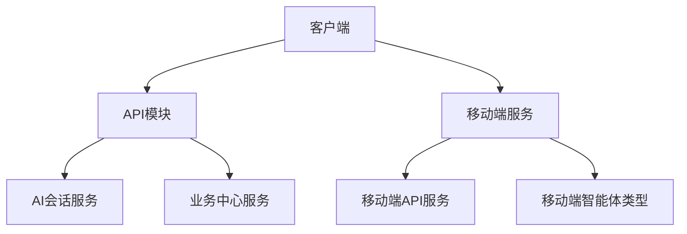
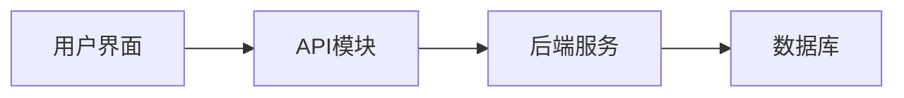

# 类型安全实现

<cite>
**本文档引用的文件**  
- [ai-conversation.ts](file://k.yyup.com/client/src/api/modules/ai-conversation.ts)
- [business-center.ts](file://k.yyup.com/client/src/api/modules/business-center.ts)
- [mobile-api.service.ts](file://k.yyup.com/client/aimobile/services/mobile-api.service.ts)
- [mobile-agents.ts](file://k.yyup.com/client/aimobile/types/mobile-agents.ts)
</cite>

## 目录
1. [项目结构](#项目结构)
2. [核心组件](#核心组件)
3. [架构概述](#架构概述)
4. [详细组件分析](#详细组件分析)
5. [依赖分析](#依赖分析)
6. [性能考虑](#性能考虑)
7. [故障排除指南](#故障排除指南)
8. [结论](#结论)

## 项目结构

项目结构中，API客户端的TypeScript类型安全实现主要集中在`client/src/api/modules`和`client/aimobile/types`目录下。这些文件定义了请求参数、响应数据和复杂类型的接口，确保了类型安全。



**图表来源**  
- [ai-conversation.ts](file://k.yyup.com/client/src/api/modules/ai-conversation.ts)
- [business-center.ts](file://k.yyup.com/client/src/api/modules/business-center.ts)
- [mobile-api.service.ts](file://k.yyup.com/client/aimobile/services/mobile-api.service.ts)
- [mobile-agents.ts](file://k.yyup.com/client/aimobile/types/mobile-agents.ts)

**章节来源**  
- [ai-conversation.ts](file://k.yyup.com/client/src/api/modules/ai-conversation.ts)
- [business-center.ts](file://k.yyup.com/client/src/api/modules/business-center.ts)

## 核心组件

核心组件包括AI会话服务、业务中心服务和移动端API服务。这些服务通过定义精确的TypeScript接口来确保调用API时传入正确的参数结构和类型。

**章节来源**  
- [ai-conversation.ts](file://k.yyup.com/client/src/api/modules/ai-conversation.ts#L70-L240)
- [business-center.ts](file://k.yyup.com/client/src/api/modules/business-center.ts#L170-L262)
- [mobile-api.service.ts](file://k.yyup.com/client/aimobile/services/mobile-api.service.ts#L25-L387)

## 架构概述

系统架构采用分层设计，前端通过API模块与后端进行通信。每个API模块都定义了请求和响应的接口，确保数据的一致性和类型安全。



**图表来源**  
- [ai-conversation.ts](file://k.yyup.com/client/src/api/modules/ai-conversation.ts)
- [business-center.ts](file://k.yyup.com/client/src/api/modules/business-center.ts)

## 详细组件分析

### AI会话服务分析

AI会话服务定义了会话和消息的接口，以及创建、更新和删除会话的方法。通过使用泛型`Promise<ApiResponse<T>>`，统一包装响应结果，提高了代码的可读性和可维护性。

#### 类图
```mermaid
classDiagram
class Conversation {
+id : string
+userId : number
+title : string | null
+summary : string | null
+lastMessageAt : string
+messageCount : number
+isArchived : boolean
+lastPagePath? : string | null
+pageContext? : string | null
+lastPageUpdateAt? : string | null
+usedMemoryIds? : number[] | null
+metadata? : Record<string, any> | null
+createdAt : string
+updatedAt : string
+messages? : Message[]
}
class Message {
+id : number
+conversationId : string
+userId : number
+role : 'user' | 'assistant' | 'system' | 'tool'
+content : string
+messageType : 'text' | 'image' | 'audio' | 'video' | 'file'
+mediaUrl? : string | null
+metadata? : any | null
+tokens : number
+status : 'sending' | 'delivered' | 'failed'
+isDeleted : boolean
+createdAt : string
+updatedAt : string
}
class AIConversationService {
+getConversations(params? : { page? : number, pageSize? : number, archived? : boolean }) : Promise<ApiResponse<Conversation[]>>
+createConversation(data? : CreateConversationRequest) : Promise<ApiResponse<Conversation>>
+updateConversationTitle(conversationId : string, data : UpdateConversationTitleRequest) : Promise<ApiResponse<Conversation>>
+deleteConversation(conversationId : string) : Promise<ApiResponse<null>>
+getConversationMessages(conversationId : string, params? : { page? : number, pageSize? : number }) : Promise<ApiResponse<{ conversation : Conversation, messages : Message[] }>>
+addMessage(conversationId : string, data : AddMessageRequest) : Promise<ApiResponse<Message>>
+getConversation(conversationId : string) : Promise<ApiResponse<Conversation>>
+archiveConversation(conversationId : string) : Promise<ApiResponse<null>>
+unarchiveConversation(conversationId : string) : Promise<ApiResponse<Conversation>>
+clearConversationMessages(conversationId : string) : Promise<ApiResponse<null>>
+bulkDeleteConversations(conversationIds : string[]) : Promise<ApiResponse<null>>
+getConversationStats(conversationId : string) : Promise<ApiResponse<{ messageCount : number, tokenCount : number, lastActivityTime : string, averageResponseTime : number }>>
+searchConversations(query : string, params? : { page? : number, pageSize? : number }) : Promise<ApiResponse<Conversation[]>>
+exportConversation(conversationId : string, format : 'json' | 'csv' | 'pdf' = 'json') : Promise<Blob>
+importConversation(file : File) : Promise<ApiResponse<Conversation>>
+duplicateConversation(conversationId : string, newTitle? : string) : Promise<ApiResponse<Conversation>>
+mergeConversations(sourceConversationIds : string[], targetConversationId? : string, newTitle? : string) : Promise<ApiResponse<Conversation>>
}
Conversation "1" -- "0..*" Message
AIConversationService --> Conversation : "使用"
AIConversationService --> Message : "使用"
```

**图表来源**  
- [ai-conversation.ts](file://k.yyup.com/client/src/api/modules/ai-conversation.ts#L18-L34)
- [ai-conversation.ts](file://k.yyup.com/client/src/api/modules/ai-conversation.ts#L36-L49)

**章节来源**  
- [ai-conversation.ts](file://k.yyup.com/client/src/api/modules/ai-conversation.ts#L70-L240)

### 业务中心服务分析

业务中心服务定义了概览、时间线、招生进度等数据的接口。通过使用联合类型和可选字段，处理复杂的业务场景。

#### 类图
```mermaid
classDiagram
class BusinessCenterOverview {
+teachingCenter : { total_plans : number, active_plans : number, completed_plans : number, overall_achievement_rate : number, overall_completion_rate : number, total_sessions : number, completed_sessions : number, confirmed_sessions : number, plans_with_media : number }
+enrollment : { target : number, current : number, applications : number, approved : number }
+personnel : { teachers : number, students : number, parents : number, classes : number }
+activities : { total : number, ongoing : number, completed : number, upcoming : number }
+system : { uptime : string, modules : number, configItems : number, lastBackup : string }
+lastUpdated : string
}
class TimelineItem {
+id : string
+title : string
+description : string
+icon : string
+status : 'completed' | 'in-progress' | 'pending'
+progress : number
+assignee? : string
+deadline? : string
+detailDescription : string
+metrics? : Array<{ key : string, label : string, value : string | number }>
+recentOperations? : Array<{ id : string, time : string, content : string, user : string }>
}
class EnrollmentProgress {
+target : number
+current : number
+percentage : number
+milestones : Array<{ id : string, label : string, position : number, target : number }>
}
class BusinessCenterDashboard {
+overview : BusinessCenterOverview
+timeline : TimelineItem[]
+enrollmentProgress : EnrollmentProgress
+meta : { responseTime : number, lastUpdated : string, dataVersion : string }
}
class BusinessCenterStatistics {
+teachingCenter : { totalPlans : number, activePlans : number, achievementRate : number, completionRate : number }
+enrollment : { target : number, current : number, completionRate : number, applications : number }
+personnel : { teachers : number, students : number, classes : number, parents : number }
+activities : { total : number, ongoing : number, completed : number, upcoming : number }
+system : { uptime : string, modules : number, configItems : number, lastBackup : string }
}
class TeachingIntegration {
+summary : { totalPlans : number, activePlans : number, completedPlans : number, achievementRate : number, completionRate : number }
+progress : { totalSessions : number, completedSessions : number, confirmedSessions : number, plansWithMedia : number }
+status : string
+lastUpdated : string
}
class UIConfig {
+progressColors : { excellent : number, good : number, warning : number }
+milestones : { default : number[] }
+colors : { excellent : string, good : string, warning : string, default : string }
}
class BusinessCenterService {
+getOverview() : Promise<BusinessCenterOverview>
+getTimeline() : Promise<TimelineItem[]>
+getEnrollmentProgress() : Promise<EnrollmentProgress>
+getStatistics() : Promise<BusinessCenterStatistics>
+getDashboard() : Promise<BusinessCenterDashboard>
+getTeachingIntegration() : Promise<TeachingIntegration>
+getUIConfig() : Promise<UIConfig>
}
BusinessCenterService --> BusinessCenterOverview : "使用"
BusinessCenterService --> TimelineItem : "使用"
BusinessCenterService --> EnrollmentProgress : "使用"
BusinessCenterService --> BusinessCenterDashboard : "使用"
BusinessCenterService --> BusinessCenterStatistics : "使用"
BusinessCenterService --> TeachingIntegration : "使用"
BusinessCenterService --> UIConfig : "使用"
```

**图表来源**  
- [business-center.ts](file://k.yyup.com/client/src/api/modules/business-center.ts#L8-L45)
- [business-center.ts](file://k.yyup.com/client/src/api/modules/business-center.ts#L48-L69)
- [business-center.ts](file://k.yyup.com/client/src/api/modules/business-center.ts#L72-L82)
- [business-center.ts](file://k.yyup.com/client/src/api/modules/business-center.ts#L85-L94)
- [business-center.ts](file://k.yyup.com/client/src/api/modules/business-center.ts#L97-L128)
- [business-center.ts](file://k.yyup.com/client/src/api/modules/business-center.ts#L131-L147)
- [business-center.ts](file://k.yyup.com/client/src/api/modules/business-center.ts#L150-L165)

**章节来源**  
- [business-center.ts](file://k.yyup.com/client/src/api/modules/business-center.ts#L170-L262)

### 移动端API服务分析

移动端API服务支持Smart Expert和Expert Consultation系统的调用。通过定义详细的请求和响应类型，确保了类型安全。

#### 类图
```mermaid
classDiagram
class MobileAPIService {
+baseURL : string
+timeout : number
+retryAttempts : number
+retryDelay : number
+callSmartExpert(request : SmartExpertRequest) : Promise<SmartExpertResponse>
+getSmartExpertList(domain? : string) : Promise<any>
+startExpertConsultation(request : ExpertConsultationRequest) : Promise<ExpertConsultationResponse>
+getNextConsultationSpeech(consultationId : string) : Promise<any>
+getConsultationSummary(consultationId : string) : Promise<any>
+smartExpertChat(messages : any[]) : Promise<any>
+fetchWithRetry(url : string, options : RequestInit, attempt : number = 1) : Promise<Response>
+getAuthToken() : string
+delay(ms : number) : Promise<void>
+isOnline() : boolean
+getNetworkQuality() : 'excellent' | 'good' | 'poor' | 'offline'
+compressRequestData(data : any) : any
+addToOfflineQueue(url : string, options : RequestInit) : Promise<Response>
+processOfflineQueue() : Promise<void>
}
class SmartExpertRequest {
+expert_id : AgentType
+task : string
+context? : string
}
class SmartExpertResponse {
+expert_id : AgentType
+expert_name : string
+task : string
+advice : string
+timestamp : string
+error? : boolean
}
class ExpertConsultationRequest {
+query : string
+context? : string
+preferences? : { expertOrder? : ExpertConsultationType[], focusAreas? : string[], urgency? : 'low' | 'medium' | 'high' }
}
class ExpertConsultationResponse {
+consultationId : string
+status : 'pending' | 'active' | 'completed' | 'cancelled'
+experts : ExpertConsultationType[]
+messages : ConsultationMessage[]
}
class ConsultationMessage {
+id : string
+expertType : ExpertConsultationType
+content : string
+timestamp : string
+round : number
+order : number
}
MobileAPIService --> SmartExpertRequest : "使用"
MobileAPIService --> SmartExpertResponse : "使用"
MobileAPIService --> ExpertConsultationRequest : "使用"
MobileAPIService --> ExpertConsultationResponse : "使用"
MobileAPIService --> ConsultationMessage : "使用"
```

**图表来源**  
- [mobile-api.service.ts](file://k.yyup.com/client/aimobile/services/mobile-api.service.ts#L25-L387)
- [mobile-agents.ts](file://k.yyup.com/client/aimobile/types/mobile-agents.ts#L188-L202)
- [mobile-agents.ts](file://k.yyup.com/client/aimobile/types/mobile-agents.ts#L195-L202)
- [mobile-agents.ts](file://k.yyup.com/client/aimobile/types/mobile-agents.ts#L205-L213)
- [mobile-agents.ts](file://k.yyup.com/client/aimobile/types/mobile-agents.ts#L216-L221)
- [mobile-agents.ts](file://k.yyup.com/client/aimobile/types/mobile-agents.ts#L223-L230)

**章节来源**  
- [mobile-api.service.ts](file://k.yyup.com/client/aimobile/services/mobile-api.service.ts#L25-L387)
- [mobile-agents.ts](file://k.yyup.com/client/aimobile/types/mobile-agents.ts#L188-L230)

## 依赖分析

项目依赖于多个外部库，如`@algolia/autocomplete-core`、`@ampproject/remapping`等。这些库提供了类型定义文件，确保了类型安全。

```mermaid
graph TD
A[项目] --> B[@algolia/autocomplete-core]
A --> C[@ampproject/remapping]
A --> D[@babel/types]
B --> E[类型定义]
C --> F[类型定义]
D --> G[类型定义]
```

**图表来源**  
- [package.json](file://k.yyup.com/package.json)

**章节来源**  
- [package.json](file://k.yyup.com/package.json)

## 性能考虑

在移动端API服务中，通过压缩请求数据和处理离线队列，优化了网络性能。此外，使用重试机制和超时控制，提高了请求的可靠性。

**章节来源**  
- [mobile-api.service.ts](file://k.yyup.com/client/aimobile/services/mobile-api.service.ts#L325-L341)
- [mobile-api.service.ts](file://k.yyup.com/client/aimobile/services/mobile-api.service.ts#L346-L376)

## 故障排除指南

当遇到类型错误时，可以通过检查接口定义和请求参数来定位问题。确保所有字段的类型和可选性都正确匹配。

**章节来源**  
- [ai-conversation.ts](file://k.yyup.com/client/src/api/modules/ai-conversation.ts)
- [business-center.ts](file://k.yyup.com/client/src/api/modules/business-center.ts)
- [mobile-api.service.ts](file://k.yyup.com/client/aimobile/services/mobile-api.service.ts)

## 结论

通过定义精确的TypeScript接口和使用泛型，项目实现了API客户端的类型安全。这不仅提高了代码的可读性和可维护性，还减少了运行时错误的发生。未来可以考虑使用工具如`swagger-typescript-api`自动生成类型定义，进一步提高开发效率。